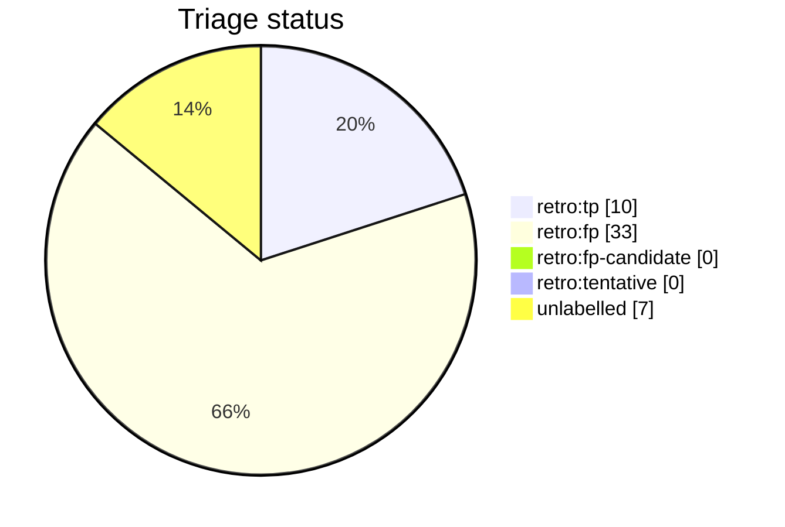

# Auto-retro triage report

This file is generated from live GitHub retro-issue labels by `python3 scripts/auto_retro.py triage-report`. Do not edit it by hand. Unlike the per-script AST docs it is a non-deterministic snapshot of repository state, so it is refreshed on merge by the `post-merge.yml` workflow (which opens a pull request when the snapshot drifts) rather than as part of the deterministic generated docs.

Retros observed: **50**

Open untriaged: **7**

## Anomalies

Signals whose prior FP rate is at or above 0.50 (n >= 5); these signals now suppress new retros via `should_skip_by_prior`:

- `fix_typed_title`: FP rate 0.50 (n=14)

## Triage status

## Signal occurrence and false-positive rates

| Signal | Fired | Fire rate | FP | FP rate | n | Anomaly |
| --- | --: | --: | --: | --: | --: | :-: |
| `inline_review_comments` | 0 | 0.00 | 0 | 0.00 | 0 |  |
| `fix_typed_title` | 14 | 0.28 | 7 | 0.50 | 14 | !! |
| `multi_commit_pr` | 18 | 0.36 | 8 | 0.44 | 18 |  |

## False-positive rate trend

- All-time: 0.77 (n=43 triaged)
- Last 20 retros: 0.77 (n=13 triaged) -- flat

## Recent retros

| # | State | Status | Title |
| --: | :-- | :-- | :-- |
| 1568 | open | untriaged | chore(auto-retro): review PR #1567 repair loops |
| 1518 | open | untriaged | chore(auto-retro): review PR #1517 repair loops |
| 1505 | open | untriaged | chore(auto-retro): review PR #1500 repair loops |
| 1483 | open | untriaged | chore(auto-retro): review PR #1481 repair loops |
| 1482 | open | untriaged | chore(auto-retro): review PR #1480 repair loops |
| 1479 | open | untriaged | chore(auto-retro): review PR #1474 repair loops |
| 1470 | open | untriaged | chore(auto-retro): review PR #1469 repair loops |
| 1465 | closed | retro:fp | chore(auto-retro): review PR #1464 repair loops |
| 1459 | closed | retro:fp | chore(auto-retro): review PR #1457 repair loops |
| 1445 | closed | retro:tp | chore(auto-retro): review PR #1444 repair loops |
