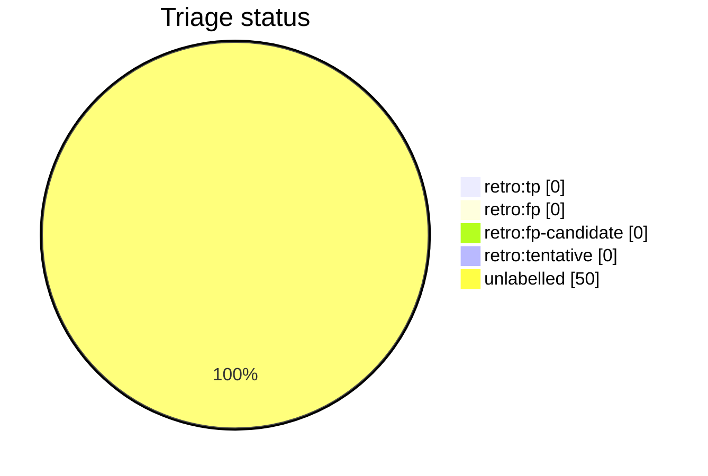

# Auto-retro triage report

This file is generated from live GitHub retro-issue labels by `python3 scripts/auto_retro.py triage-report`. Do not edit it by hand. Unlike the per-script AST docs it is a non-deterministic snapshot of repository state, so it is refreshed on merge by the `post-merge.yml` workflow (which opens a pull request when the snapshot drifts) rather than as part of the deterministic generated docs.

Retros observed: **50**

Open untriaged: **14**

## Anomalies

None: no fired signal clears both the FP-rate and sample-size thresholds.

## Triage status

## Signal occurrence and false-positive rates

| Signal | Fired | Fire rate | FP | FP rate | n | Anomaly |
| --- | --: | --: | --: | --: | --: | :-: |
| `inline_review_comments` | 33 | 0.66 | 0 | 0.00 | 33 |  |
| `fix_typed_title` | 17 | 0.34 | 0 | 0.00 | 17 |  |
| `multi_commit_pr` | 45 | 0.90 | 0 | 0.00 | 45 |  |

## False-positive rate trend

No triaged retros yet (no `retro:tp`/`retro:fp` labels).

## Recent retros

| # | State | Status | Title |
| --: | :-- | :-- | :-- |
| 2006 | open | untriaged | chore(auto-retro): review PR #2004 repair loops |
| 1997 | open | untriaged | chore(auto-retro): review PR #1988 repair loops |
| 1990 | open | untriaged | chore(auto-retro): review PR #1980 repair loops |
| 1972 | open | untriaged | chore(auto-retro): review PR #1960 repair loops |
| 1964 | open | untriaged | chore(auto-retro): review PR #1961 repair loops |
| 1956 | open | untriaged | chore(auto-retro): review PR #1948 repair loops |
| 1951 | open | untriaged | chore(auto-retro): review PR #1949 repair loops |
| 1939 | closed | untriaged | chore(auto-retro): review PR #1933 repair loops |
| 1935 | open | untriaged | chore(auto-retro): review PR #1934 repair loops |
| 1929 | closed | untriaged | chore(auto-retro): review PR #1927 repair loops |
