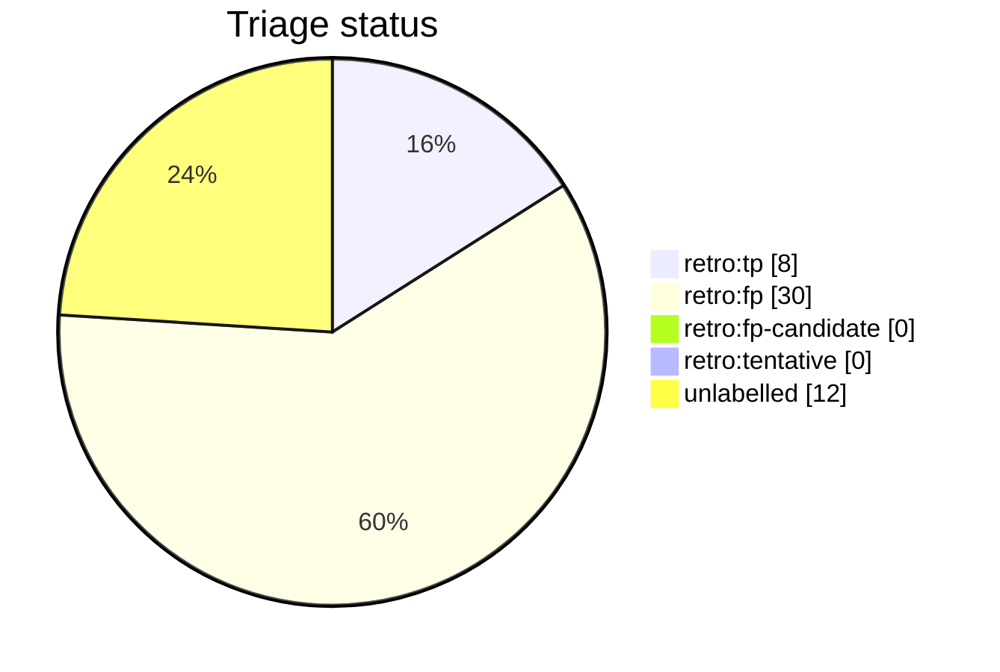

# Auto-retro triage report

This file is generated from live GitHub retro-issue labels by `python3 scripts/auto_retro.py triage-report`. Do not edit it by hand. Unlike the per-script AST docs it is a non-deterministic snapshot of repository state, so it is refreshed on merge by the `post-merge.yml` workflow (which opens a pull request when the snapshot drifts) rather than as part of the deterministic generated docs.

Retros observed: **50**

Open untriaged: **12**

## Anomalies

None: no fired signal clears both the FP-rate and sample-size thresholds.

## Triage status

## Signal occurrence and false-positive rates

| Signal | Fired | Fire rate | FP | FP rate | n | Anomaly |
| --- | --: | --: | --: | --: | --: | :-: |
| `inline_review_comments` | 1 | 0.02 | 0 | 0.00 | 1 |  |
| `fix_typed_title` | 18 | 0.36 | 7 | 0.39 | 18 |  |
| `multi_commit_pr` | 21 | 0.42 | 8 | 0.38 | 21 |  |

## False-positive rate trend

- All-time: 0.79 (n=38 triaged)
- Last 20 retros: 0.88 (n=8 triaged) -- rising

## Recent retros

| # | State | Status | Title |
| --: | :-- | :-- | :-- |
| 1733 | open | untriaged | chore(auto-retro): review PR #1730 repair loops |
| 1661 | open | untriaged | chore(auto-retro): review PR #1659 repair loops |
| 1600 | open | untriaged | chore(auto-retro): review PR #1599 repair loops |
| 1592 | open | untriaged | chore(auto-retro): review PR #1589 repair loops |
| 1585 | open | untriaged | chore(auto-retro): review PR #1584 repair loops |
| 1568 | open | untriaged | chore(auto-retro): review PR #1567 repair loops |
| 1518 | open | untriaged | chore(auto-retro): review PR #1517 repair loops |
| 1505 | open | untriaged | chore(auto-retro): review PR #1500 repair loops |
| 1483 | open | untriaged | chore(auto-retro): review PR #1481 repair loops |
| 1482 | open | untriaged | chore(auto-retro): review PR #1480 repair loops |
