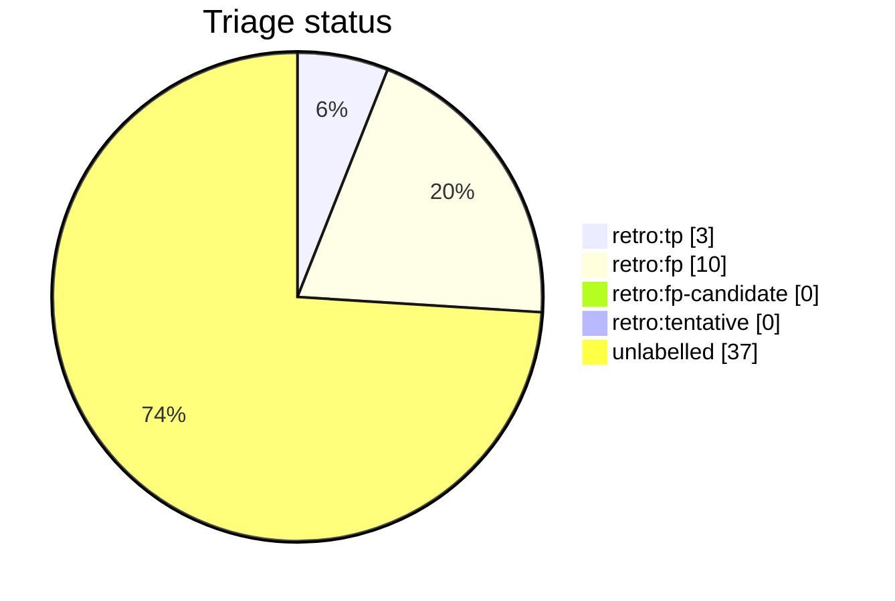

# Auto-retro triage report

This file is generated from live GitHub retro-issue labels by `python3 scripts/auto_retro.py triage-report`. Do not edit it by hand. Unlike the per-script AST docs it is a non-deterministic snapshot of repository state, so it is refreshed on merge by the `post-merge.yml` workflow (which opens a pull request when the snapshot drifts) rather than as part of the deterministic generated docs.

Retros observed: **50**

Open untriaged: **4**

## Anomalies

None: no fired signal clears both the FP-rate and sample-size thresholds.

## Triage status

## Signal occurrence and false-positive rates

| Signal | Fired | Fire rate | FP | FP rate | n | Anomaly |
| --- | --: | --: | --: | --: | --: | :-: |
| `inline_review_comments` | 23 | 0.46 | 0 | 0.00 | 23 |  |
| `fix_typed_title` | 18 | 0.36 | 3 | 0.17 | 18 |  |
| `multi_commit_pr` | 35 | 0.70 | 2 | 0.06 | 35 |  |

## False-positive rate trend

- All-time: 0.77 (n=13 triaged)
- Last 20 retros: 0.00 (n=0 triaged) -- n/a

## Recent retros

| # | State | Status | Title |
| --: | :-- | :-- | :-- |
| 1894 | open | untriaged | chore(auto-retro): review PR #1891 repair loops |
| 1887 | open | untriaged | chore(auto-retro): review PR #1883 repair loops |
| 1885 | open | untriaged | chore(auto-retro): review PR #1883 repair loops |
| 1879 | open | untriaged | chore(auto-retro): review PR #1877 repair loops |
| 1865 | closed | untriaged | chore(auto-retro): review PR #1864 repair loops |
| 1862 | closed | untriaged | chore(auto-retro): review PR #1861 repair loops |
| 1857 | closed | untriaged | chore(auto-retro): review PR #1856 repair loops |
| 1849 | closed | untriaged | chore(auto-retro): review PR #1848 repair loops |
| 1845 | closed | untriaged | chore(auto-retro): review PR #1841 repair loops |
| 1842 | closed | untriaged | chore(auto-retro): review PR #1838 repair loops |
