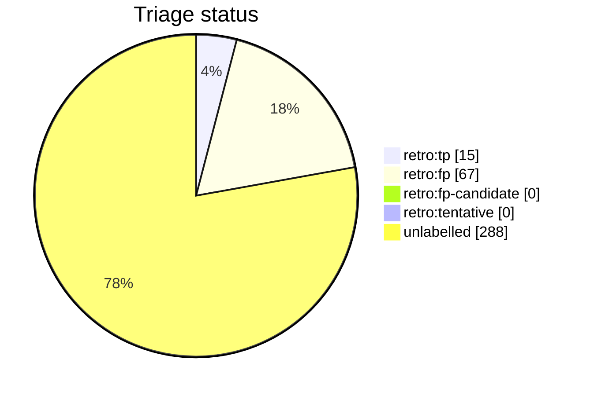

# Auto-retro triage report

This file is generated from live GitHub retro-issue labels by `python3 scripts/auto_retro.py triage-report`. Do not edit it by hand. Unlike the per-script AST docs it is a non-deterministic snapshot of repository state, so it is refreshed on merge by the `post-merge.yml` workflow (which opens a pull request when the snapshot drifts) rather than as part of the deterministic generated docs.

Retros observed: **370**

Open untriaged: **30**

## Anomalies

None: no fired signal clears both the FP-rate and sample-size thresholds.

## Triage status

## Signal occurrence and false-positive rates

| Signal | Fired | Fire rate | FP | FP rate | n | Anomaly |
| --- | --: | --: | --: | --: | --: | :-: |
| `inline_review_comments` | 68 | 0.18 | 0 | 0.00 | 68 |  |
| `fix_typed_title` | 53 | 0.14 | 12 | 0.23 | 53 |  |
| `multi_commit_pr` | 103 | 0.28 | 13 | 0.13 | 103 |  |

## False-positive rate trend

- All-time: 0.82 (n=82 triaged)
- Last 20 retros: 0.00 (n=0 triaged); n/a

## Recent retros

| # | State | Status | Title |
| --: | :-- | :-- | :-- |
| 2412 | open | untriaged | docs(runbook): fix retro-doc drift (refresh cadence, phantom script name) |
| 2400 | open | untriaged | chore(auto-retro): review PR #2396 repair loops |
| 2385 | open | untriaged | chore(auto-retro): review PR #2383 repair loops |
| 2377 | open | untriaged | chore(auto-retro): review PR #2374 repair loops |
| 2375 | open | untriaged | chore(auto-retro): review PR #2373 repair loops |
| 2367 | open | untriaged | chore(auto-retro): review PR #2362 repair loops |
| 2365 | open | untriaged | chore(auto-retro): review PR #2345 repair loops |
| 2356 | open | untriaged | chore(auto-retro): review PR #2344 repair loops |
| 2353 | open | untriaged | chore(auto-retro): review PR #2321 repair loops |
| 2348 | open | untriaged | chore(auto-retro): review PR #2347 repair loops |
