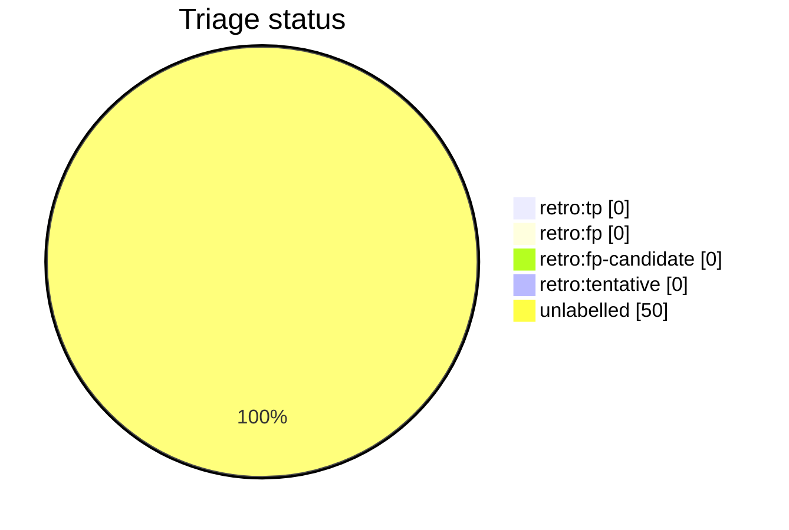

# Auto-retro triage report

This file is generated from live GitHub retro-issue labels by `python3 scripts/auto_retro.py triage-report`. Do not edit it by hand. Unlike the decision-tree doc it is a non-deterministic snapshot of repository state, so it is refreshed by the `auto-retro-triage-report.yml` workflow rather than the `generate-docs.yml` drift gate.

Retros observed: **50**

## Anomalies

None: no fired signal clears both the FP-rate and sample-size thresholds.

## Triage status

## Signal occurrence and false-positive rates

| Signal | Fired | Fire rate | FP | FP rate | n | Anomaly |
| --- | --: | --: | --: | --: | --: | :-: |
| `inline_review_comments` | 0 | 0.00 | 0 | 0.00 | 0 |  |
| `body_cites_refs` | 50 | 1.00 | 0 | 0.00 | 50 |  |
| `fix_typed_title` | 19 | 0.38 | 0 | 0.00 | 19 |  |
| `multi_commit_pr` | 2 | 0.04 | 0 | 0.00 | 2 |  |
| `verification_pairs_failed` | 50 | 1.00 | 0 | 0.00 | 50 |  |
