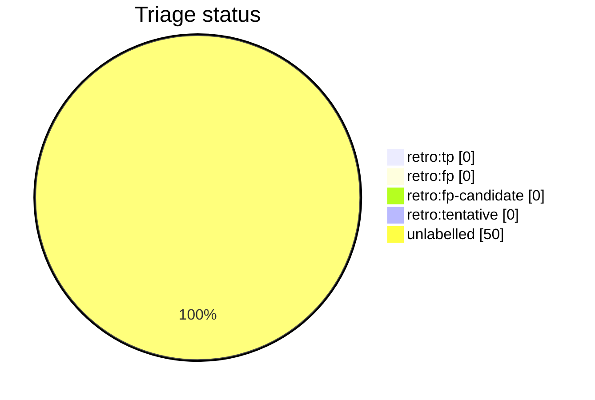

# Auto-retro triage report

This file is generated from live GitHub retro-issue labels by `python3 scripts/auto_retro.py triage-report`. Do not edit it by hand. Unlike the per-script AST docs it is a non-deterministic snapshot of repository state, so it is refreshed on merge by the `post-merge.yml` workflow (which opens a pull request when the snapshot drifts) rather than as part of the deterministic generated docs.

Retros observed: **50**

Open untriaged: **27**

## Anomalies

None: no fired signal clears both the FP-rate and sample-size thresholds.

## Triage status

## Signal occurrence and false-positive rates

| Signal | Fired | Fire rate | FP | FP rate | n | Anomaly |
| --- | --: | --: | --: | --: | --: | :-: |
| `inline_review_comments` | 42 | 0.84 | 0 | 0.00 | 42 |  |
| `fix_typed_title` | 10 | 0.20 | 0 | 0.00 | 10 |  |
| `multi_commit_pr` | 46 | 0.92 | 0 | 0.00 | 46 |  |

## False-positive rate trend

No triaged retros yet (no `retro:tp`/`retro:fp` labels).

## Recent retros

| # | State | Status | Title |
| --: | :-- | :-- | :-- |
| 2187 | open | untriaged | chore(auto-retro): review PR #2186 repair loops |
| 2182 | open | untriaged | chore(auto-retro): review PR #2181 repair loops |
| 2172 | open | untriaged | chore(auto-retro): review PR #2169 repair loops |
| 2165 | open | untriaged | chore(auto-retro): review PR #2161 repair loops |
| 2148 | open | untriaged | chore(auto-retro): review PR #2144 repair loops |
| 2129 | open | untriaged | chore(auto-retro): review PR #2122 repair loops |
| 2110 | open | untriaged | chore(auto-retro): review PR #2094 repair loops |
| 2105 | open | untriaged | chore(auto-retro): review PR #2101 repair loops |
| 2047 | open | untriaged | chore(auto-retro): review PR #2046 repair loops |
| 2044 | open | untriaged | chore(auto-retro): review PR #2035 repair loops |
