# Script dependency graph

This file is generated from `scripts/*.py` import statements by `python3 scripts/script_dependency_graph.py all-doc`. Do not edit it by hand: content under `docs/generated/scripts/` is owned by the post-merge automation (refs #1540, #1543); update the source scripts instead.

## Shared module fan-in

| Module | Imported by | Importers |
| --- | --- | --- |
| `_hook_runtime` | 44 | `block_sensitive_reads`, `check_pr_mergeability`, `ci_early_status_probe`, `gate_cache_regime_advisor`, `gate_decision_handoff_askuserquestion`, `gate_gh_cli`, `gate_handoff_retro_survey_askuserquestion`, `gate_instruction_body_advisory`, `gate_irreversible_bash`, `gate_issue_classification_labels`, `gate_issue_close_comment`, `gate_mcp_github_uncovered`, `gate_merge_safety`, `gate_pr_body_retro_issue_link`, `gate_reserved_retro_scope`, `gate_stop_pr_review_reply`, `gate_unsigned_commit_bash`, `gate_update_pr_branch`, `issue_closure_fast_path`, `plan_approval_gate`, `plan_language_context`, `post_merge_new_session_prompt`, `post_merge_retro_append`, `post_pr_create_body_fix`, `post_pr_create_ci_monitor`, `pr_body_close_keyword_gate`, `preflight_angle_token_drop`, `preflight_codex_github_footer`, `preflight_commit_session_branch`, `preflight_github_secrets`, `preflight_main_freshness`, `preflight_non_ascii`, `preflight_pr_body_required_sections`, `preflight_pr_template_shape`, `preflight_push_base`, `preflight_push_nonempty`, `preflight_push_prek`, `preflight_push_session_branch`, `preflight_resolve_review_thread`, `preflight_session_base_freshness`, `preflight_session_branch_authz`, `preflight_title_policy`, `prompt_context7_gate`, `stop_new_session_handoff_prompt` |
| `_github_api` | 23 | `_ci_watch`, `_pr_commit_batch`, `_pr_merge`, `check_pr_mergeability`, `ci_budget_issue`, `ci_early_status_probe`, `dependabot_automerge`, `gate_pr_body_retro_issue_link`, `github_api`, `issue_closure_fast_path`, `labels_apply`, `np_strategy_tracking`, `post_issue_comment`, `post_merge_new_session_prompt`, `pr_body_close_keyword_gate`, `pr_upsert`, `preflight_replacement_pr`, `prune_devcontainer_images`, `publish_instruction_release`, `ruleset_drift`, `sanitize_history`, `security_drift_report`, `verify_ruleset_sync` |
| `_git` | 13 | `check_hooks_path`, `check_session_branch`, `devcontainer_pin_pr`, `pr_upsert`, `preflight_branch_base`, `preflight_cache`, `preflight_coverage`, `preflight_main_freshness`, `preflight_push_nonempty`, `preflight_session_base_freshness`, `refresh_pr_branch`, `scan_area_path_coverage`, `scan_secrets` |
| `_github_tool_names` | 10 | `gate_handoff_retro_survey_askuserquestion`, `gate_pr_body_retro_issue_link`, `pr_body_close_keyword_gate`, `preflight_angle_token_drop`, `preflight_codex_github_footer`, `preflight_github_secrets`, `preflight_non_ascii`, `preflight_pr_body_required_sections`, `preflight_pr_template_shape`, `preflight_title_policy` |
| `body_policy` | 9 | `post_pr_create_body_fix`, `pr_body_builder`, `preflight_angle_token_drop`, `preflight_codex_github_footer`, `preflight_pr_body`, `preflight_pr_body_required_sections`, `preflight_pr_template_shape`, `verify_instruction_text_growth`, `verify_text_delta_section` |
| `_trusted_bots` | 8 | `_auto_retro_parse`, `auto_retro`, `body_policy`, `dependabot_automerge`, `issue_link`, `scan_non_ascii`, `title_policy`, `verify_dependabot_author` |
| `issue_link` | 7 | `_auto_retro_parse`, `_auto_retro_render`, `auto_retro`, `body_policy`, `gate_pr_body_retro_issue_link`, `preflight_angle_token_drop`, `scan_retro_followup_drift` |
| `issue_anchors` | 6 | `_security_drift_issues`, `ci_budget_issue`, `coverage_failure_issue`, `devcontainer_pin_pr`, `scan_issue_anchor_drift`, `security_drift_report` |
| `_ref_classifier` | 5 | `issue_link`, `np_strategy_tracking`, `pr_body_close_keyword_gate`, `preflight_pr_body`, `verify_linked_issue_titles` |
| `_retro_labels` | 4 | `_auto_retro_render`, `_auto_retro_triage`, `auto_retro`, `scan_retro_followup_drift` |
| `_session_branches` | 4 | `check_session_branch`, `preflight_commit_session_branch`, `preflight_push_session_branch`, `preflight_session_branch_authz` |
| `_auto_retro_parse` | 3 | `_auto_retro_render`, `_auto_retro_triage`, `auto_retro` |
| `doc_graph` | 3 | `doc_graph_viz`, `gate_doc_graph_pr`, `scan_doc_graph_registration` |
| `pr_upsert` | 3 | `_pr_merge`, `auto_retro`, `devcontainer_pin_pr` |
| `_allowlist` | 2 | `scan_allowlist_parser_parity`, `scan_allowlist_rationale` |
| `_pr_commit_batch` | 2 | `devcontainer_pin_pr`, `pr_upsert` |
| `_pr_merge` | 2 | `bot_pr_automerge`, `devcontainer_pin_pr` |
| `_secret_patterns` | 2 | `preflight_github_secrets`, `scan_secrets` |
| `_security_drift_families` | 2 | `_security_drift_issues`, `security_drift_report` |
| `auto_retro` | 2 | `gate_pr_body_retro_issue_link`, `gate_reserved_retro_scope` |
| `scan_non_ascii` | 2 | `preflight_non_ascii`, `preflight_pr_body` |
| `title_policy` | 2 | `preflight_title_policy`, `verify_linked_issue_titles` |
| `_auto_retro_render` | 1 | `auto_retro` |
| `_auto_retro_triage` | 1 | `auto_retro` |
| `_security_drift_issues` | 1 | `security_drift_report` |
| `check_pr_mergeability` | 1 | `gate_merge_safety` |
| `generate_devcontainer_arch_overlays` | 1 | `update_devcontainer_image_pins` |
| `preflight_all` | 1 | `scan_devcontainer_tool_drift` |
| `preflight_branch_base` | 1 | `preflight_session_base_freshness` |
| `preflight_cache` | 1 | `preflight_all` |
| `preflight_main_freshness` | 1 | `preflight_session_base_freshness` |
| `preflight_steps` | 1 | `preflight_all` |
| `scan_maintainability_metrics` | 1 | `scan_module_size_distribution` |
| `scan_markdown_links` | 1 | `measure_tool_overlap` |
| `scan_preflight_drift` | 1 | `scan_input_contract_drift` |
| `scan_secrets` | 1 | `measure_tool_overlap` |
| `scan_workflow_action_pins` | 1 | `measure_tool_overlap` |
| `scan_workflow_injection` | 1 | `measure_tool_overlap` |
| `script_ast_graph` | 1 | `auto_retro` |
| `session_cost_structure` | 1 | `gate_cache_regime_advisor` |
| `update_devcontainer_image_pins` | 1 | `devcontainer_pin_pr` |
| `uv_pin` | 1 | `preflight_uv_version` |

## Isolated scripts

62 script(s) import no sibling module and are imported by none:

`analyze_ci_timings`, `attack_review_reminder`, `backup_archive`, `backup_non_ascii`, `branch_cleanup`, `ccusage_pin`, `compare_cache_regimes`, `dependabot_labels`, `flake_pin`, `flake_pin_latest`, `gate_generated_scripts_manual_edit`, `gen_agent_hooks`, `gen_mcp_json`, `github_paginate`, `measure_devcontainer_startup`, `measure_prefix_tokens`, `mint_github_app_token`, `nixpkgs_cooldown`, `owasp_asi_mapping`, `preflight_hook_event_keys`, `python_pin`, `rulesets_apply`, `scan_apm_ascii`, `scan_apm_lock_drift`, `scan_apm_portability`, `scan_compile_from_source`, `scan_design_philosophy_drift`, `scan_doc_workflow_refs`, `scan_docs_inventory`, `scan_flake_pin_drift`, `scan_harness_doc_coverage`, `scan_hook_coverage_drift`, `scan_mermaid_syntax`, `scan_nonexhaustive_invariant_drift`, `scan_pr_body_quality_drift`, `scan_provisioning_hook_serial`, `scan_quality_standard_drift`, `scan_repo_double_hyphen`, `scan_repo_em_dash`, `scan_secret_runbooks`, `scan_session_path_drift`, `scan_test_presence_drift`, `scan_workflow_gh_calls`, `scan_workflow_pip`, `scan_workflow_unsigned_commit`, `script_dependency_graph`, `script_trigger_map`, `session_resource_report`, `skill_quality_gate`, `threat_intel_triage`, `uv_download_checksum`, `validate_falco_rules`, `validate_json_syntax`, `verify_apm_checksums`, `verify_control_inventory_currency`, `verify_readme_translation`, `verify_required_check_contexts`, `verify_security_control_floor`, `verify_shard_coverage`, `verify_test_shard_markers`, `waza_pin`, `workflow_diagram`

## Dependency graph

```mermaid
flowchart TD
    _auto_retro_parse --> _trusted_bots
    _auto_retro_parse --> issue_link
    _auto_retro_render --> _auto_retro_parse
    _auto_retro_render --> _retro_labels
    _auto_retro_render --> issue_link
    _auto_retro_triage --> _auto_retro_parse
    _auto_retro_triage --> _retro_labels
    _ci_watch --> _github_api
    _pr_commit_batch --> _github_api
    _pr_merge --> _github_api
    _pr_merge --> pr_upsert
    _security_drift_issues --> _security_drift_families
    _security_drift_issues --> issue_anchors
    auto_retro --> _auto_retro_parse
    auto_retro --> _auto_retro_render
    auto_retro --> _auto_retro_triage
    auto_retro --> _retro_labels
    auto_retro --> _trusted_bots
    auto_retro --> issue_link
    auto_retro --> pr_upsert
    auto_retro --> script_ast_graph
    block_sensitive_reads --> _hook_runtime
    body_policy --> _trusted_bots
    body_policy --> issue_link
    bot_pr_automerge --> _pr_merge
    check_hooks_path --> _git
    check_pr_mergeability --> _github_api
    check_pr_mergeability --> _hook_runtime
    check_session_branch --> _git
    check_session_branch --> _session_branches
    ci_budget_issue --> _github_api
    ci_budget_issue --> issue_anchors
    ci_early_status_probe --> _github_api
    ci_early_status_probe --> _hook_runtime
    coverage_failure_issue --> issue_anchors
    dependabot_automerge --> _github_api
    dependabot_automerge --> _trusted_bots
    devcontainer_pin_pr --> _git
    devcontainer_pin_pr --> _pr_commit_batch
    devcontainer_pin_pr --> _pr_merge
    devcontainer_pin_pr --> issue_anchors
    devcontainer_pin_pr --> pr_upsert
    devcontainer_pin_pr --> update_devcontainer_image_pins
    doc_graph_viz --> doc_graph
    gate_cache_regime_advisor --> _hook_runtime
    gate_cache_regime_advisor --> session_cost_structure
    gate_decision_handoff_askuserquestion --> _hook_runtime
    gate_doc_graph_pr --> doc_graph
    gate_gh_cli --> _hook_runtime
    gate_handoff_retro_survey_askuserquestion --> _github_tool_names
    gate_handoff_retro_survey_askuserquestion --> _hook_runtime
    gate_instruction_body_advisory --> _hook_runtime
    gate_irreversible_bash --> _hook_runtime
    gate_issue_classification_labels --> _hook_runtime
    gate_issue_close_comment --> _hook_runtime
    gate_mcp_github_uncovered --> _hook_runtime
    gate_merge_safety --> _hook_runtime
    gate_merge_safety --> check_pr_mergeability
    gate_pr_body_retro_issue_link --> _github_api
    gate_pr_body_retro_issue_link --> _github_tool_names
    gate_pr_body_retro_issue_link --> _hook_runtime
    gate_pr_body_retro_issue_link --> auto_retro
    gate_pr_body_retro_issue_link --> issue_link
    gate_reserved_retro_scope --> _hook_runtime
    gate_reserved_retro_scope --> auto_retro
    gate_stop_pr_review_reply --> _hook_runtime
    gate_unsigned_commit_bash --> _hook_runtime
    gate_update_pr_branch --> _hook_runtime
    github_api --> _github_api
    issue_closure_fast_path --> _github_api
    issue_closure_fast_path --> _hook_runtime
    issue_link --> _ref_classifier
    issue_link --> _trusted_bots
    labels_apply --> _github_api
    measure_tool_overlap --> scan_markdown_links
    measure_tool_overlap --> scan_secrets
    measure_tool_overlap --> scan_workflow_action_pins
    measure_tool_overlap --> scan_workflow_injection
    np_strategy_tracking --> _github_api
    np_strategy_tracking --> _ref_classifier
    plan_approval_gate --> _hook_runtime
    plan_language_context --> _hook_runtime
    post_issue_comment --> _github_api
    post_merge_new_session_prompt --> _github_api
    post_merge_new_session_prompt --> _hook_runtime
    post_merge_retro_append --> _hook_runtime
    post_pr_create_body_fix --> _hook_runtime
    post_pr_create_body_fix --> body_policy
    post_pr_create_ci_monitor --> _hook_runtime
    pr_body_builder --> body_policy
    pr_body_close_keyword_gate --> _github_api
    pr_body_close_keyword_gate --> _github_tool_names
    pr_body_close_keyword_gate --> _hook_runtime
    pr_body_close_keyword_gate --> _ref_classifier
    pr_upsert --> _git
    pr_upsert --> _github_api
    pr_upsert --> _pr_commit_batch
    preflight_all --> preflight_cache
    preflight_all --> preflight_steps
    preflight_angle_token_drop --> _github_tool_names
    preflight_angle_token_drop --> _hook_runtime
    preflight_angle_token_drop --> body_policy
    preflight_angle_token_drop --> issue_link
    preflight_branch_base --> _git
    preflight_cache --> _git
    preflight_codex_github_footer --> _github_tool_names
    preflight_codex_github_footer --> _hook_runtime
    preflight_codex_github_footer --> body_policy
    preflight_commit_session_branch --> _hook_runtime
    preflight_commit_session_branch --> _session_branches
    preflight_coverage --> _git
    preflight_github_secrets --> _github_tool_names
    preflight_github_secrets --> _hook_runtime
    preflight_github_secrets --> _secret_patterns
    preflight_main_freshness --> _git
    preflight_main_freshness --> _hook_runtime
    preflight_non_ascii --> _github_tool_names
    preflight_non_ascii --> _hook_runtime
    preflight_non_ascii --> scan_non_ascii
    preflight_pr_body --> _ref_classifier
    preflight_pr_body --> body_policy
    preflight_pr_body --> scan_non_ascii
    preflight_pr_body_required_sections --> _github_tool_names
    preflight_pr_body_required_sections --> _hook_runtime
    preflight_pr_body_required_sections --> body_policy
    preflight_pr_template_shape --> _github_tool_names
    preflight_pr_template_shape --> _hook_runtime
    preflight_pr_template_shape --> body_policy
    preflight_push_base --> _hook_runtime
    preflight_push_nonempty --> _git
    preflight_push_nonempty --> _hook_runtime
    preflight_push_prek --> _hook_runtime
    preflight_push_session_branch --> _hook_runtime
    preflight_push_session_branch --> _session_branches
    preflight_replacement_pr --> _github_api
    preflight_resolve_review_thread --> _hook_runtime
    preflight_session_base_freshness --> _git
    preflight_session_base_freshness --> _hook_runtime
    preflight_session_base_freshness --> preflight_branch_base
    preflight_session_base_freshness --> preflight_main_freshness
    preflight_session_branch_authz --> _hook_runtime
    preflight_session_branch_authz --> _session_branches
    preflight_title_policy --> _github_tool_names
    preflight_title_policy --> _hook_runtime
    preflight_title_policy --> title_policy
    preflight_uv_version --> uv_pin
    prompt_context7_gate --> _hook_runtime
    prune_devcontainer_images --> _github_api
    publish_instruction_release --> _github_api
    refresh_pr_branch --> _git
    ruleset_drift --> _github_api
    sanitize_history --> _github_api
    scan_allowlist_parser_parity --> _allowlist
    scan_allowlist_rationale --> _allowlist
    scan_area_path_coverage --> _git
    scan_devcontainer_tool_drift --> preflight_all
    scan_doc_graph_registration --> doc_graph
    scan_input_contract_drift --> scan_preflight_drift
    scan_issue_anchor_drift --> issue_anchors
    scan_module_size_distribution --> scan_maintainability_metrics
    scan_non_ascii --> _trusted_bots
    scan_retro_followup_drift --> _retro_labels
    scan_retro_followup_drift --> issue_link
    scan_secrets --> _git
    scan_secrets --> _secret_patterns
    security_drift_report --> _github_api
    security_drift_report --> _security_drift_families
    security_drift_report --> _security_drift_issues
    security_drift_report --> issue_anchors
    stop_new_session_handoff_prompt --> _hook_runtime
    title_policy --> _trusted_bots
    update_devcontainer_image_pins --> generate_devcontainer_arch_overlays
    verify_dependabot_author --> _trusted_bots
    verify_instruction_text_growth --> body_policy
    verify_linked_issue_titles --> _ref_classifier
    verify_linked_issue_titles --> title_policy
    verify_ruleset_sync --> _github_api
    verify_text_delta_section --> body_policy
```

