# Python script AST graphs

This file is generated from `scripts/*.py` by `python3 scripts/script_ast_graph.py all-doc`. Do not edit it by hand; update the source scripts and regenerate instead.

## scripts/_allowlist.py

### split_inline_comment(...)

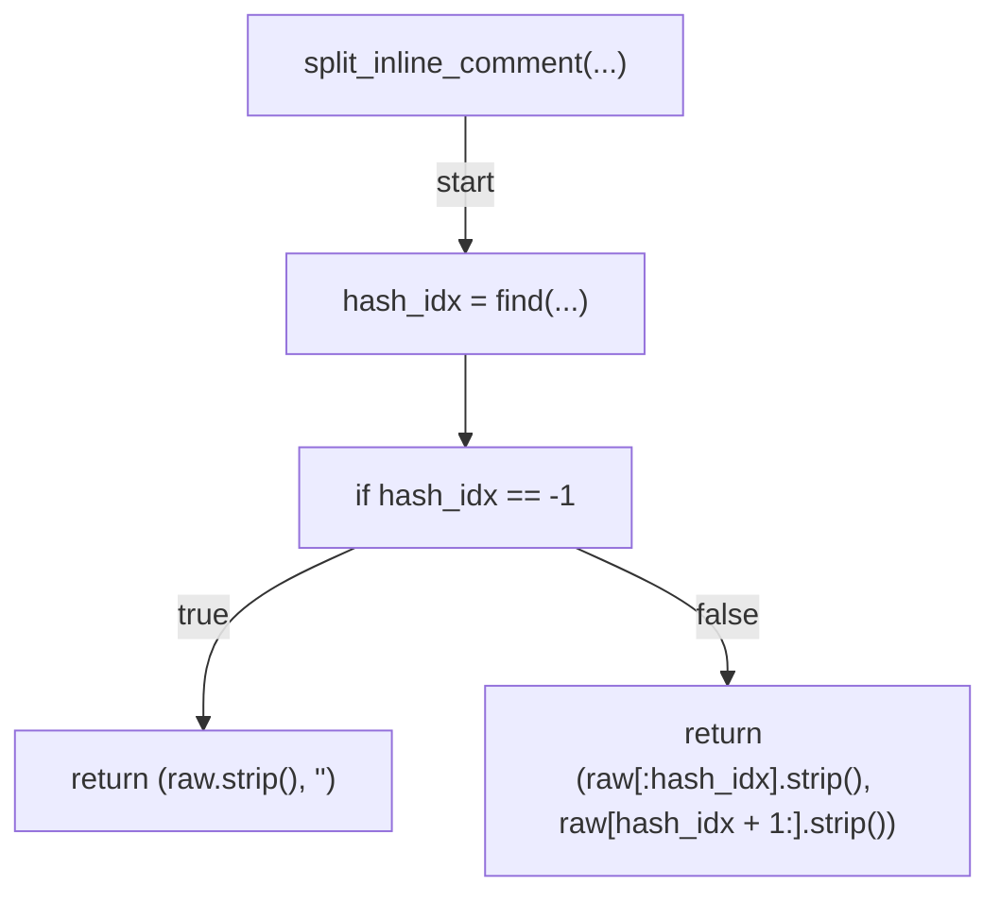
```mermaid
flowchart TD
    N001["split_inline_comment(...)"]
    N002["hash_idx = find(...)"]
    N003["if hash_idx == -1"]
    N004["return (raw.strip(), '<str>')"]
    N005["return (raw[:hash_idx].strip(), raw[hash_idx + 1:].strip())"]
    N001 -->|"start"| N002
    N002 --> N003
    N003 -->|"true"| N004
    N003 -->|"false"| N005
```

### resolve_hosts(...)

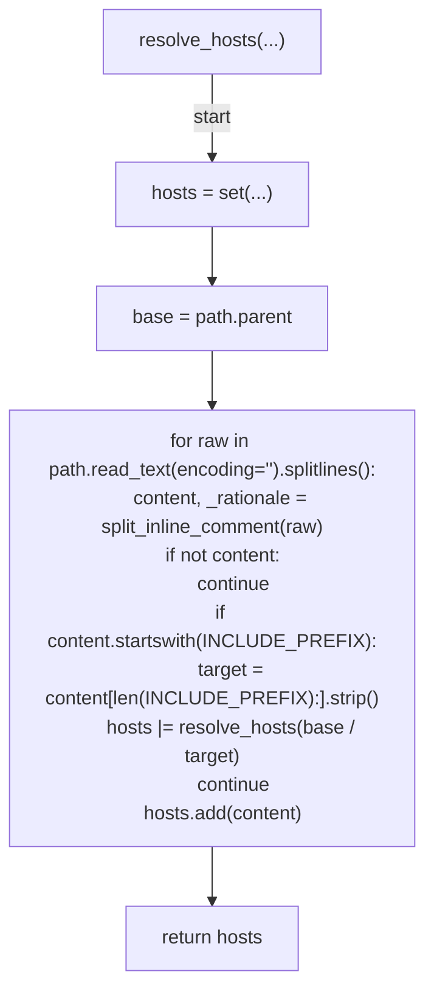
```mermaid
flowchart TD
    N001["resolve_hosts(...)"]
    N002["hosts = set(...)"]
    N003["base = path.parent"]
    N004["for raw in path.read_text(encoding='<str>').splitlines():
    content, _rationale = split_inline_comment(raw)
    if not content:
        continue
    if content.startswith(INCLUDE_PREFIX):
        target = content[len(INCLUDE_PREFIX):].strip()
        hosts |= resolve_hosts(base / target)
        continue
    hosts.add(content)"]
    N005["return hosts"]
    N001 -->|"start"| N002
    N002 --> N003
    N003 --> N004
    N004 --> N005
```

## scripts/_ci_watch.py

### _rest_get(...)

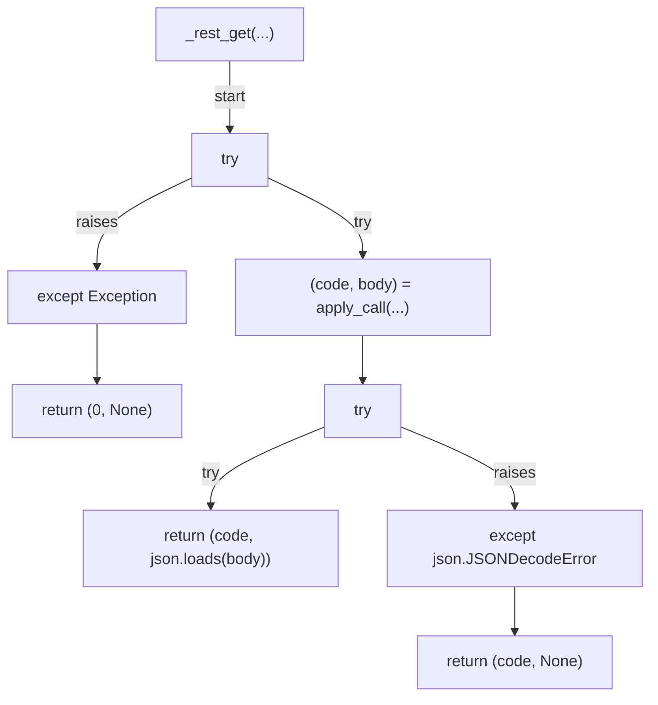
```mermaid
flowchart TD
    N001["_rest_get(...)"]
    N002["try"]
    N003["(code, body) = apply_call(...)"]
    N004["except Exception"]
    N005["return (0, None)"]
    N006["try"]
    N007["return (code, json.loads(body))"]
    N008["except json.JSONDecodeError"]
    N009["return (code, None)"]
    N001 -->|"start"| N002
    N002 -->|"try"| N003
    N002 -->|"raises"| N004
    N004 --> N005
    N003 --> N006
    N006 -->|"try"| N007
    N006 -->|"raises"| N008
    N008 --> N009
```

### poll_ci(...)

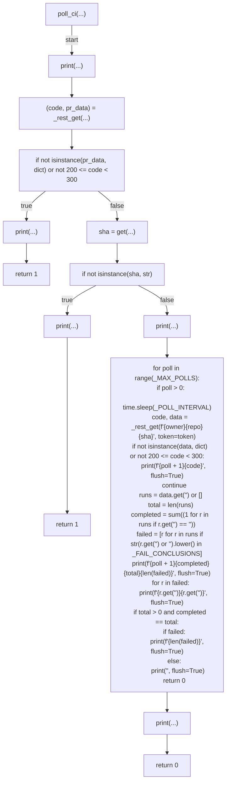
```mermaid
flowchart TD
    N001["poll_ci(...)"]
    N002["print(...)"]
    N003["(code, pr_data) = _rest_get(...)"]
    N004["if not isinstance(pr_data, dict) or not 200 <= code < 300"]
    N005["print(...)"]
    N006["return 1"]
    N007["sha = get(...)"]
    N008["if not isinstance(sha, str)"]
    N009["print(...)"]
    N010["return 1"]
    N011["print(...)"]
    N012["for poll in range(_MAX_POLLS):
    if poll > 0:
        time.sleep(_POLL_INTERVAL)
    code, data = _rest_get(f'<str>{owner}<str>{repo}<str>{sha}<str>', token=token)
    if not isinstance(data, dict) or not 200 <= code < 300:
        print(f'<str>{poll + 1}<str>{code}', flush=True)
        continue
    runs = data.get('<str>') or []
    total = len(runs)
    completed = sum((1 for r in runs if r.get('<str>') == '<str>'))
    failed = [r for r in runs if str(r.get('<str>') or '<str>').lower() in _FAIL_CONCLUSIONS]
    print(f'<str>{poll + 1}<str>{completed}<str>{total}<str>{len(failed)}<str>', flush=True)
    for r in failed:
        print(f'<str>{r.get('<str>')}<str>{r.get('<str>')}<str>', flush=True)
    if total > 0 and completed == total:
        if failed:
            print(f'<str>{len(failed)}<str>', flush=True)
        else:
            print('<str>', flush=True)
        return 0"]
    N013["print(...)"]
    N014["return 0"]
    N001 -->|"start"| N002
    N002 --> N003
    N003 --> N004
    N004 -->|"true"| N005
    N005 --> N006
    N004 -->|"false"| N007
    N007 --> N008
    N008 -->|"true"| N009
    N009 --> N010
    N008 -->|"false"| N011
    N011 --> N012
    N012 --> N013
    N013 --> N014
```

### main(...)

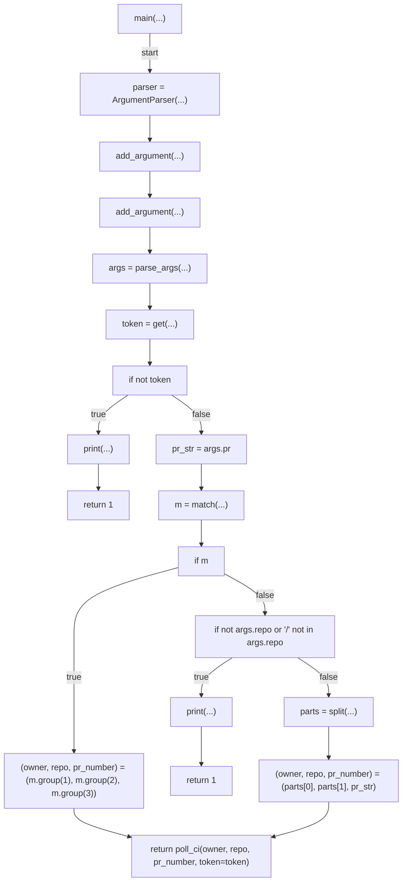
```mermaid
flowchart TD
    N001["main(...)"]
    N002["parser = ArgumentParser(...)"]
    N003["add_argument(...)"]
    N004["add_argument(...)"]
    N005["args = parse_args(...)"]
    N006["token = get(...)"]
    N007["if not token"]
    N008["print(...)"]
    N009["return 1"]
    N010["pr_str = args.pr"]
    N011["m = match(...)"]
    N012["if m"]
    N013["(owner, repo, pr_number) = (m.group(1), m.group(2), m.group(3))"]
    N014["if not args.repo or '/' not in args.repo"]
    N015["print(...)"]
    N016["return 1"]
    N017["parts = split(...)"]
    N018["(owner, repo, pr_number) = (parts[0], parts[1], pr_str)"]
    N019["return poll_ci(owner, repo, pr_number, token=token)"]
    N001 -->|"start"| N002
    N002 --> N003
    N003 --> N004
    N004 --> N005
    N005 --> N006
    N006 --> N007
    N007 -->|"true"| N008
    N008 --> N009
    N007 -->|"false"| N010
    N010 --> N011
    N011 --> N012
    N012 -->|"true"| N013
    N012 -->|"false"| N014
    N014 -->|"true"| N015
    N015 --> N016
    N014 -->|"false"| N017
    N017 --> N018
    N013 --> N019
    N018 --> N019
```

## scripts/_git.py

### run_git(...)

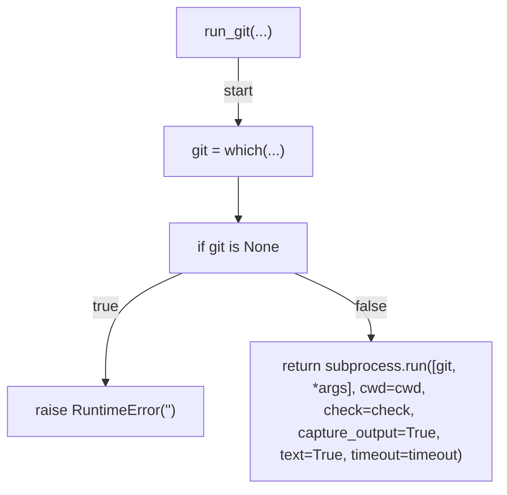
```mermaid
flowchart TD
    N001["run_git(...)"]
    N002["git = which(...)"]
    N003["if git is None"]
    N004["raise RuntimeError('<str>')"]
    N005["return subprocess.run([git, *args], cwd=cwd, check=check, capture_output=True, text=True, timeout=timeout)"]
    N001 -->|"start"| N002
    N002 --> N003
    N003 -->|"true"| N004
    N003 -->|"false"| N005
```

## scripts/_github_api.py

### _default_opener(...)

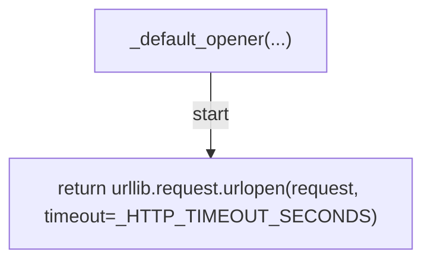
```mermaid
flowchart TD
    N001["_default_opener(...)"]
    N002["return urllib.request.urlopen(request, timeout=_HTTP_TIMEOUT_SECONDS)"]
    N001 -->|"start"| N002
```

### apply_call(...)

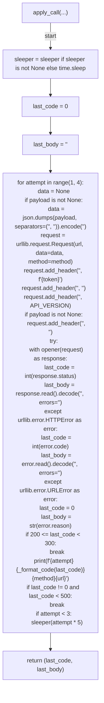
```mermaid
flowchart TD
    N001["apply_call(...)"]
    N002["sleeper = sleeper if sleeper is not None else time.sleep"]
    N003["last_code = 0"]
    N004["last_body = '<str>'"]
    N005["for attempt in range(1, 4):
    data = None
    if payload is not None:
        data = json.dumps(payload, separators=('<str>', '<str>')).encode('<str>')
    request = urllib.request.Request(url, data=data, method=method)
    request.add_header('<str>', f'<str>{token}')
    request.add_header('<str>', '<str>')
    request.add_header('<str>', API_VERSION)
    if payload is not None:
        request.add_header('<str>', '<str>')
    try:
        with opener(request) as response:
            last_code = int(response.status)
            last_body = response.read().decode('<str>', errors='<str>')
    except urllib.error.HTTPError as error:
        last_code = int(error.code)
        last_body = error.read().decode('<str>', errors='<str>')
    except urllib.error.URLError as error:
        last_code = 0
        last_body = str(error.reason)
    if 200 <= last_code < 300:
        break
    print(f'<str>{attempt}<str>{_format_code(last_code)}<str>{method}<str>{url}')
    if last_code != 0 and last_code < 500:
        break
    if attempt < 3:
        sleeper(attempt * 5)"]
    N006["return (last_code, last_body)"]
    N001 -->|"start"| N002
    N002 --> N003
    N003 --> N004
    N004 --> N005
    N005 --> N006
```

### graphql_call(...)

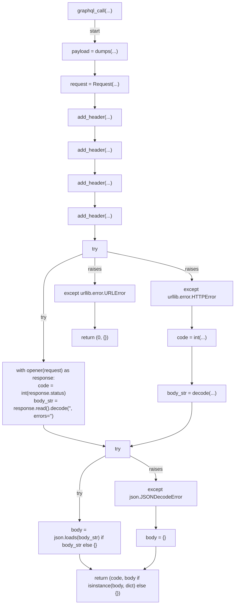
```mermaid
flowchart TD
    N001["graphql_call(...)"]
    N002["payload = dumps(...)"]
    N003["request = Request(...)"]
    N004["add_header(...)"]
    N005["add_header(...)"]
    N006["add_header(...)"]
    N007["add_header(...)"]
    N008["try"]
    N009["with opener(request) as response:
    code = int(response.status)
    body_str = response.read().decode('<str>', errors='<str>')"]
    N010["except urllib.error.HTTPError"]
    N011["code = int(...)"]
    N012["body_str = decode(...)"]
    N013["except urllib.error.URLError"]
    N014["return (0, {})"]
    N015["try"]
    N016["body = json.loads(body_str) if body_str else {}"]
    N017["except json.JSONDecodeError"]
    N018["body = {}"]
    N019["return (code, body if isinstance(body, dict) else {})"]
    N001 -->|"start"| N002
    N002 --> N003
    N003 --> N004
    N004 --> N005
    N005 --> N006
    N006 --> N007
    N007 --> N008
    N008 -->|"try"| N009
    N008 -->|"raises"| N010
    N010 --> N011
    N011 --> N012
    N008 -->|"raises"| N013
    N013 --> N014
    N009 --> N015
    N012 --> N015
    N015 -->|"try"| N016
    N015 -->|"raises"| N017
    N017 --> N018
    N016 --> N019
    N018 --> N019
```

### _format_code(...)

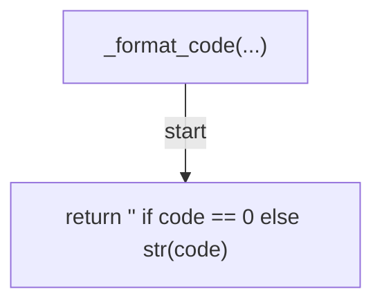
```mermaid
flowchart TD
    N001["_format_code(...)"]
    N002["return '<str>' if code == 0 else str(code)"]
    N001 -->|"start"| N002
```

## scripts/_github_tool_names.py

### canonical_github_tool(...)

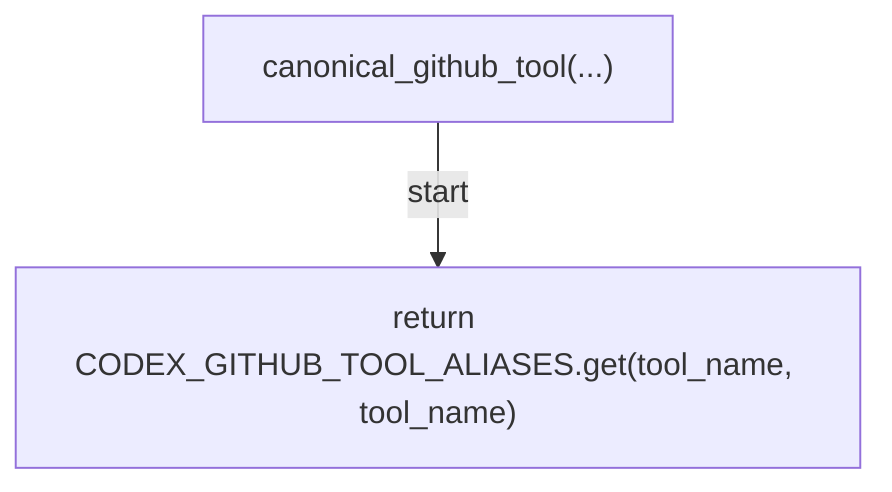
```mermaid
flowchart TD
    N001["canonical_github_tool(...)"]
    N002["return CODEX_GITHUB_TOOL_ALIASES.get(tool_name, tool_name)"]
    N001 -->|"start"| N002
```

## scripts/_hook_runtime.py

### _audit_mode_active(...)

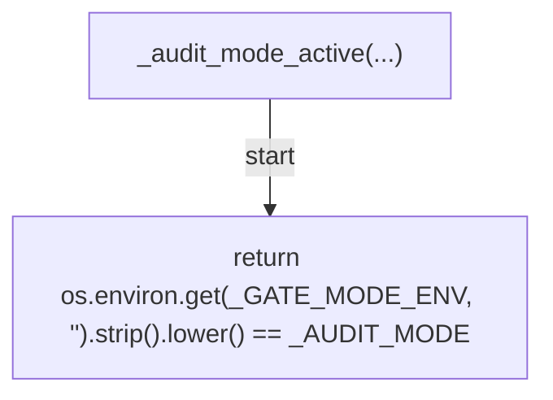
```mermaid
flowchart TD
    N001["_audit_mode_active(...)"]
    N002["return os.environ.get(_GATE_MODE_ENV, '<str>').strip().lower() == _AUDIT_MODE"]
    N001 -->|"start"| N002
```

### _blocking_reason(...)

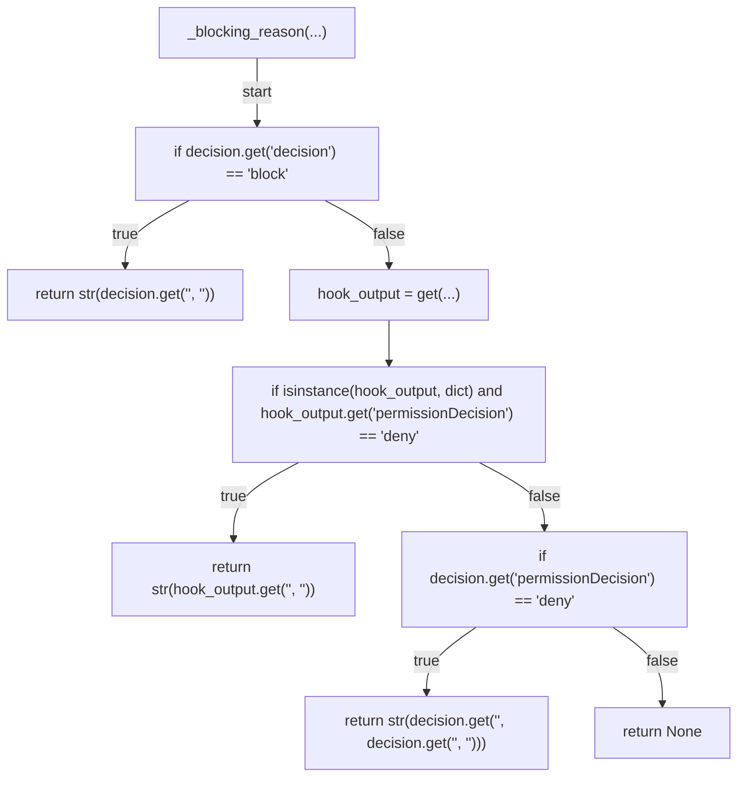
```mermaid
flowchart TD
    N001["_blocking_reason(...)"]
    N002["if decision.get('decision') == 'block'"]
    N003["return str(decision.get('<str>', '<str>'))"]
    N004["hook_output = get(...)"]
    N005["if isinstance(hook_output, dict) and hook_output.get('permissionDecision') == 'deny'"]
    N006["return str(hook_output.get('<str>', '<str>'))"]
    N007["if decision.get('permissionDecision') == 'deny'"]
    N008["return str(decision.get('<str>', decision.get('<str>', '<str>')))"]
    N009["return None"]
    N001 -->|"start"| N002
    N002 -->|"true"| N003
    N002 -->|"false"| N004
    N004 --> N005
    N005 -->|"true"| N006
    N005 -->|"false"| N007
    N007 -->|"true"| N008
    N007 -->|"false"| N009
```

### read_event(...)

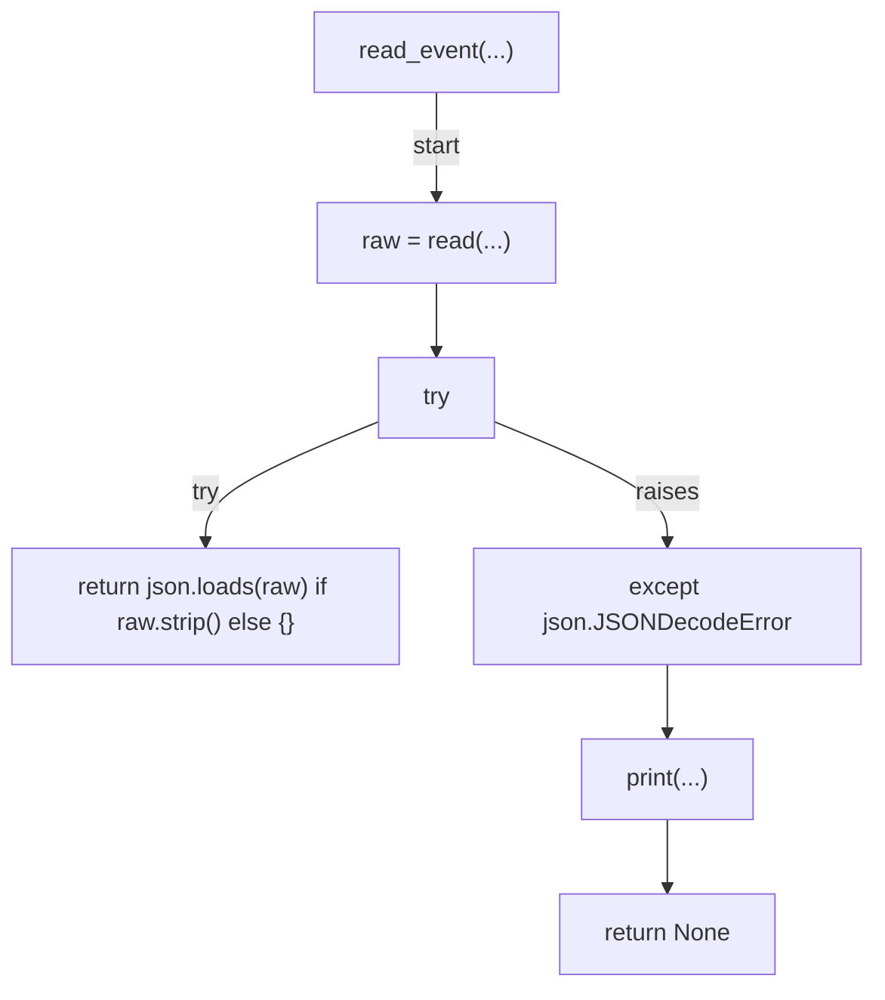
```mermaid
flowchart TD
    N001["read_event(...)"]
    N002["raw = read(...)"]
    N003["try"]
    N004["return json.loads(raw) if raw.strip() else {}"]
    N005["except json.JSONDecodeError"]
    N006["print(...)"]
    N007["return None"]
    N001 -->|"start"| N002
    N002 --> N003
    N003 -->|"try"| N004
    N003 -->|"raises"| N005
    N005 --> N006
    N006 --> N007
```

### emit_decision(...)

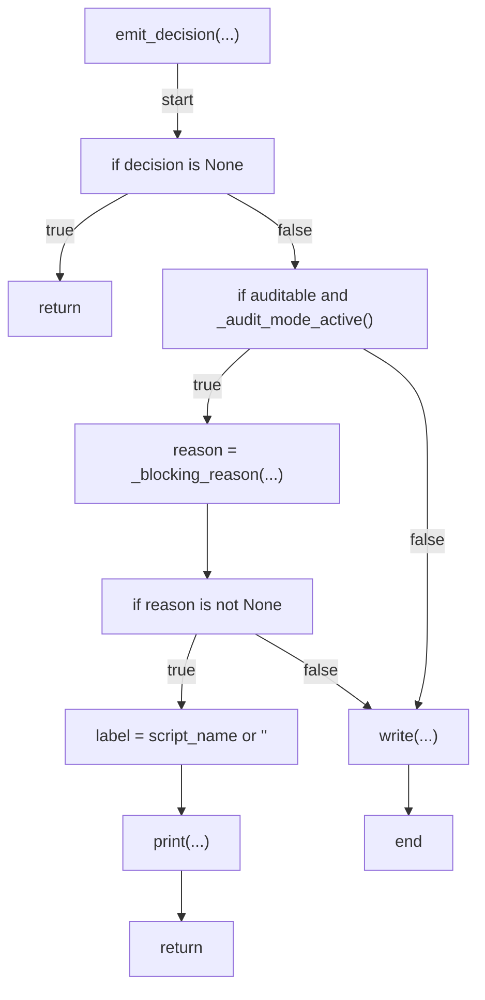
```mermaid
flowchart TD
    N001["emit_decision(...)"]
    N002["if decision is None"]
    N003["return"]
    N004["if auditable and _audit_mode_active()"]
    N005["reason = _blocking_reason(...)"]
    N006["if reason is not None"]
    N007["label = script_name or '<str>'"]
    N008["print(...)"]
    N009["return"]
    N010["write(...)"]
    N011["end"]
    N001 -->|"start"| N002
    N002 -->|"true"| N003
    N002 -->|"false"| N004
    N004 -->|"true"| N005
    N005 --> N006
    N006 -->|"true"| N007
    N007 --> N008
    N008 --> N009
    N006 -->|"false"| N010
    N004 -->|"false"| N010
    N010 --> N011
```

### build_deny(...)

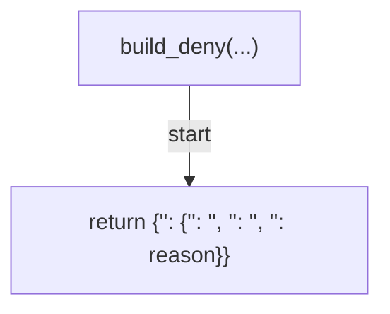
```mermaid
flowchart TD
    N001["build_deny(...)"]
    N002["return {'<str>': {'<str>': '<str>', '<str>': '<str>', '<str>': reason}}"]
    N001 -->|"start"| N002
```

### split_tool_event(...)

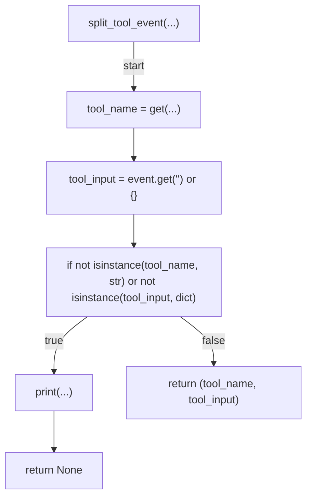
```mermaid
flowchart TD
    N001["split_tool_event(...)"]
    N002["tool_name = get(...)"]
    N003["tool_input = event.get('<str>') or {}"]
    N004["if not isinstance(tool_name, str) or not isinstance(tool_input, dict)"]
    N005["print(...)"]
    N006["return None"]
    N007["return (tool_name, tool_input)"]
    N001 -->|"start"| N002
    N002 --> N003
    N003 --> N004
    N004 -->|"true"| N005
    N005 --> N006
    N004 -->|"false"| N007
```

### run_event_hook(...)

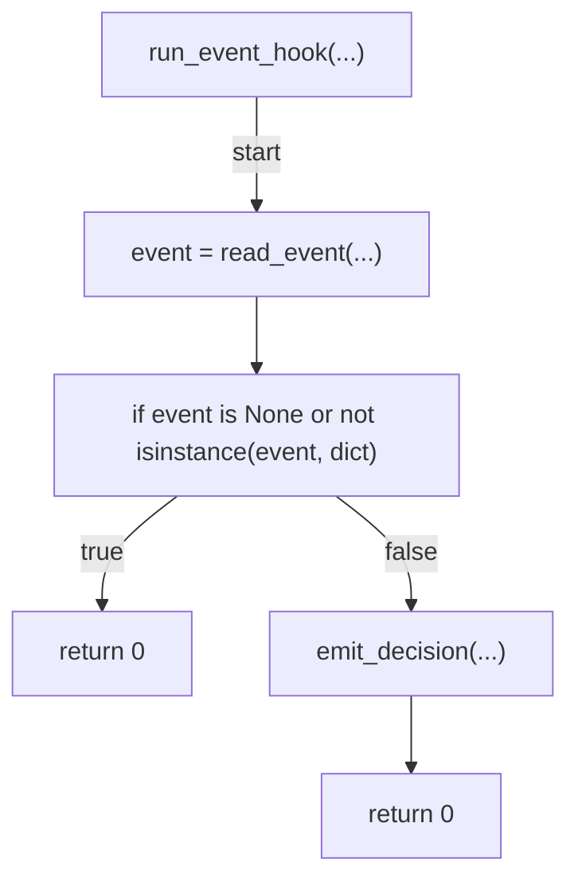
```mermaid
flowchart TD
    N001["run_event_hook(...)"]
    N002["event = read_event(...)"]
    N003["if event is None or not isinstance(event, dict)"]
    N004["return 0"]
    N005["emit_decision(...)"]
    N006["return 0"]
    N001 -->|"start"| N002
    N002 --> N003
    N003 -->|"true"| N004
    N003 -->|"false"| N005
    N005 --> N006
```

### run_tool_hook(...)

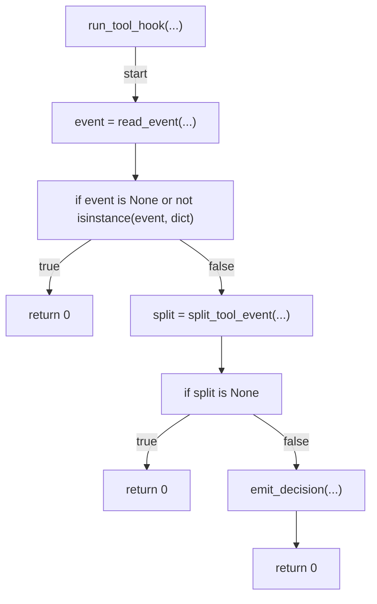
```mermaid
flowchart TD
    N001["run_tool_hook(...)"]
    N002["event = read_event(...)"]
    N003["if event is None or not isinstance(event, dict)"]
    N004["return 0"]
    N005["split = split_tool_event(...)"]
    N006["if split is None"]
    N007["return 0"]
    N008["emit_decision(...)"]
    N009["return 0"]
    N001 -->|"start"| N002
    N002 --> N003
    N003 -->|"true"| N004
    N003 -->|"false"| N005
    N005 --> N006
    N006 -->|"true"| N007
    N006 -->|"false"| N008
    N008 --> N009
```

## scripts/_ref_classifier.py

### strip_html_comments(...)

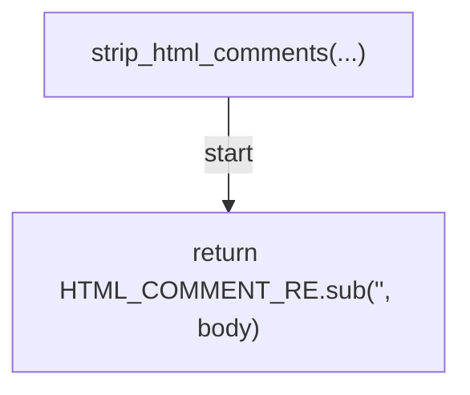
```mermaid
flowchart TD
    N001["strip_html_comments(...)"]
    N002["return HTML_COMMENT_RE.sub('<str>', body)"]
    N001 -->|"start"| N002
```

### classify_refs(...)

```mermaid
flowchart TD
    N001["classify_refs(...)"]
    N002["out = []"]
    N003["seen = set(...)"]
    N004["for m in REF_LINE_KEYWORD_RE.finditer(body):
    key = (m.group(1).lower(), int(m.group(2)))
    if key not in seen:
        seen.add(key)
        out.append(key)"]
    N005["return out"]
    N001 -->|"start"| N002
    N002 --> N003
    N003 --> N004
    N004 --> N005
```

### body_has_partial_marker(...)

```mermaid
flowchart TD
    N001["body_has_partial_marker(...)"]
    N002["return PARTIAL_MARKER_RE.search(raw_body) is not None or PARTIAL_MARKER_PLAINTEXT_RE.search(raw_body) is not None"]
    N001 -->|"start"| N002
```

### format_no_closing_keyword_msg(...)

```mermaid
flowchart TD
    N001["format_no_closing_keyword_msg(...)"]
    N002["joined = join(...)"]
    N003["return f'{prefix}<str>{joined}<str>{TRACKING_LABEL}<str>'"]
    N001 -->|"start"| N002
    N002 --> N003
```

## scripts/_retro_labels.py

No top-level functions found.

## scripts/_secret_patterns.py

### _looks_like_secret_value(...)

```mermaid
flowchart TD
    N001["_looks_like_secret_value(...)"]
    N002["lowered = lower(...)"]
    N003["if any((marker in lowered for marker in _PLACEHOLDER_MARKERS))"]
    N004["return False"]
    N005["if len(value) < 16"]
    N006["return False"]
    N007["has_digit = any(...)"]
    N008["has_alpha = any(...)"]
    N009["return has_digit and has_alpha"]
    N001 -->|"start"| N002
    N002 --> N003
    N003 -->|"true"| N004
    N003 -->|"false"| N005
    N005 -->|"true"| N006
    N005 -->|"false"| N007
    N007 --> N008
    N008 --> N009
```

### scan_line(...)

```mermaid
flowchart TD
    N001["scan_line(...)"]
    N002["if PRAGMA_ALLOWLIST in line"]
    N003["return None"]
    N004["for rule in _RULES:
    match = rule.pattern.search(line)
    if match is None:
        continue
    if rule.value_group is not None:
        value = match.group(rule.value_group)
        if not _looks_like_secret_value(value):
            continue
    return rule.rule_id"]
    N005["return None"]
    N001 -->|"start"| N002
    N002 -->|"true"| N003
    N002 -->|"false"| N004
    N004 --> N005
```

### scan_text(...)

```mermaid
flowchart TD
    N001["scan_text(...)"]
    N002["hits = []"]
    N003["for lineno, line in enumerate(text.splitlines(), start=1):
    rule_id = scan_line(line)
    if rule_id is not None:
        hits.append((lineno, rule_id))"]
    N004["return hits"]
    N001 -->|"start"| N002
    N002 --> N003
    N003 --> N004
```

## scripts/_security_drift_families.py

No top-level functions found.

## scripts/_trusted_bots.py

### _load(...)

```mermaid
flowchart TD
    N001["_load(...)"]
    N002["try"]
    N003["text = read_text(...)"]
    N004["except OSError"]
    N005["print(...)"]
    N006["return (_DEFAULT_GENERAL, _DEFAULT_NON_ASCII_SKIP)"]
    N007["try"]
    N008["import tomllib"]
    N009["data = loads(...)"]
    N010["except Exception"]
    N011["print(...)"]
    N012["return (_DEFAULT_GENERAL, _DEFAULT_NON_ASCII_SKIP)"]
    N013["general = frozenset(...)"]
    N014["non_ascii_skip = frozenset(...)"]
    N015["return (general or _DEFAULT_GENERAL, non_ascii_skip or _DEFAULT_NON_ASCII_SKIP)"]
    N001 -->|"start"| N002
    N002 -->|"try"| N003
    N002 -->|"raises"| N004
    N004 --> N005
    N005 --> N006
    N003 --> N007
    N007 -->|"try"| N008
    N008 --> N009
    N007 -->|"raises"| N010
    N010 --> N011
    N011 --> N012
    N009 --> N013
    N013 --> N014
    N014 --> N015
```

## scripts/analyze_ci_timings.py

### _parse_iso(...)

```mermaid
flowchart TD
    N001["_parse_iso(...)"]
    N002["return datetime.strptime(ts, _GH_TS_FORMAT).replace(tzinfo=UTC)"]
    N001 -->|"start"| N002
```

### _duration_seconds(...)

```mermaid
flowchart TD
    N001["_duration_seconds(...)"]
    N002["if not start or not end"]
    N003["return None"]
    N004["try"]
    N005["delta = total_seconds(...)"]
    N006["except ValueError"]
    N007["return None"]
    N008["if delta < 0"]
    N009["return None"]
    N010["return delta"]
    N001 -->|"start"| N002
    N002 -->|"true"| N003
    N002 -->|"false"| N004
    N004 -->|"try"| N005
    N004 -->|"raises"| N006
    N006 --> N007
    N005 --> N008
    N008 -->|"true"| N009
    N008 -->|"false"| N010
```

### _percentile(...)

```mermaid
flowchart TD
    N001["_percentile(...)"]
    N002["if not values"]
    N003["return 0.0"]
    N004["ordered = sorted(...)"]
    N005["if len(ordered) == 1"]
    N006["return ordered[0]"]
    N007["k = (len(ordered) - 1) * (p / 100.0)"]
    N008["lo = int(...)"]
    N009["hi = min(...)"]
    N010["frac = k - lo"]
    N011["return ordered[lo] + (ordered[hi] - ordered[lo]) * frac"]
    N001 -->|"start"| N002
    N002 -->|"true"| N003
    N002 -->|"false"| N004
    N004 --> N005
    N005 -->|"true"| N006
    N005 -->|"false"| N007
    N007 --> N008
    N008 --> N009
    N009 --> N010
    N010 --> N011
```

### _trend_arrow(...)

```mermaid
flowchart TD
    N001["_trend_arrow(...)"]
    N002["last = samples_chronological[-5:]"]
    N003["if len(last) < 2"]
    N004["return '<str>'"]
    N005["mid = len(last) // 2"]
    N006["older = last[:mid] if mid else last[:1]"]
    N007["newer = last[mid:]"]
    N008["older_med = median(...)"]
    N009["newer_med = median(...)"]
    N010["if older_med == 0"]
    N011["return '<str>' if newer_med == 0 else '<str>'"]
    N012["ratio = newer_med / older_med"]
    N013["if ratio > 1.1"]
    N014["return '<str>'"]
    N015["if ratio < 0.9"]
    N016["return '<str>'"]
    N017["return '<str>'"]
    N001 -->|"start"| N002
    N002 --> N003
    N003 -->|"true"| N004
    N003 -->|"false"| N005
    N005 --> N006
    N006 --> N007
    N007 --> N008
    N008 --> N009
    N009 --> N010
    N010 -->|"true"| N011
    N010 -->|"false"| N012
    N012 --> N013
    N013 -->|"true"| N014
    N013 -->|"false"| N015
    N015 -->|"true"| N016
    N015 -->|"false"| N017
```

### _expand_paths(...)

```mermaid
flowchart TD
    N001["_expand_paths(...)"]
    N002["for p in paths:
    if p.is_dir():
        yield from sorted(p.glob('<str>'))
    else:
        yield p"]
    N003["end"]
    N001 -->|"start"| N002
    N002 --> N003
```

### load_jobs(...)

```mermaid
flowchart TD
    N001["load_jobs(...)"]
    N002["out = []"]
    N003["for path in _expand_paths(paths):
    text = path.read_text(encoding='<str>')
    data = json.loads(text)
    if not isinstance(data, dict):
        continue
    jobs = data.get('<str>')
    if not isinstance(jobs, list):
        continue
    for j in jobs:
        if isinstance(j, dict):
            out.append(j)"]
    N004["return out"]
    N001 -->|"start"| N002
    N002 --> N003
    N003 --> N004
```

### filter_jobs(...)

```mermaid
flowchart TD
    N001["filter_jobs(...)"]
    N002["out = []"]
    N003["for j in jobs:
    if workflow_name is not None and j.get('<str>') != workflow_name:
        continue
    if job_name is not None and j.get('<str>') != job_name:
        continue
    if since is not None:
        start = j.get('<str>')
        if not isinstance(start, str):
            continue
        try:
            started = _parse_iso(start)
        except ValueError:
            continue
        if started < since:
            continue
    out.append(j)"]
    N004["return out"]
    N001 -->|"start"| N002
    N002 --> N003
    N003 --> N004
```

### aggregate_job_durations(...)

```mermaid
flowchart TD
    N001["aggregate_job_durations(...)"]
    N002["bucket = {}"]
    N003["for j in jobs:
    name = j.get('<str>')
    start_raw = j.get('<str>')
    end_raw = j.get('<str>')
    if not isinstance(name, str) or not isinstance(start_raw, str):
        continue
    if not isinstance(end_raw, str):
        continue
    dur = _duration_seconds(start_raw, end_raw)
    if dur is None:
        continue
    try:
        started = _parse_iso(start_raw)
    except ValueError:
        continue
    bucket.setdefault(name, []).append((started, dur))"]
    N004["for v in bucket.values():
    v.sort(key=lambda t: t[0])"]
    N005["return bucket"]
    N001 -->|"start"| N002
    N002 --> N003
    N003 --> N004
    N004 --> N005
```

### aggregate_step_durations(...)

```mermaid
flowchart TD
    N001["aggregate_step_durations(...)"]
    N002["bucket = {}"]
    N003["for j in jobs:
    job_name = j.get('<str>')
    if not isinstance(job_name, str):
        continue
    steps = j.get('<str>')
    if not isinstance(steps, list):
        continue
    for s in steps:
        if not isinstance(s, dict):
            continue
        step_name = s.get('<str>')
        start_raw = s.get('<str>')
        end_raw = s.get('<str>')
        if not isinstance(step_name, str) or not isinstance(start_raw, str):
            continue
        if not isinstance(end_raw, str):
            continue
        dur = _duration_seconds(start_raw, end_raw)
        if dur is None:
            continue
        try:
            started = _parse_iso(start_raw)
        except ValueError:
            continue
        bucket.setdefault((job_name, step_name), []).append((started, dur))"]
    N004["for v in bucket.values():
    v.sort(key=lambda t: t[0])"]
    N005["return bucket"]
    N001 -->|"start"| N002
    N002 --> N003
    N003 --> N004
    N004 --> N005
```

### partition_aggregates_by_cutoff(...)

```mermaid
flowchart TD
    N001["partition_aggregates_by_cutoff(...)"]
    N002["pre = {}"]
    N003["post = {}"]
    N004["for key, samples in aggregates.items():
    for ts, val in samples:
        if ts < cutoff:
            pre.setdefault(key, []).append(val)
        else:
            post.setdefault(key, []).append(val)"]
    N005["return (pre, post)"]
    N001 -->|"start"| N002
    N002 --> N003
    N003 --> N004
    N004 --> N005
```

### _delta_p50_marker(...)

```mermaid
flowchart TD
    N001["_delta_p50_marker(...)"]
    N002["if not pre_samples and (not post_samples)"]
    N003["return '<str>'"]
    N004["if not pre_samples"]
    N005["return '<str>'"]
    N006["if not post_samples"]
    N007["return '<str>'"]
    N008["pre_p50 = _percentile(...)"]
    N009["post_p50 = _percentile(...)"]
    N010["if pre_p50 == 0"]
    N011["return '<str>' if post_p50 > 0 else '<str>'"]
    N012["pct = (post_p50 - pre_p50) / pre_p50 * 100.0"]
    N013["sign = '<str>' if pct >= 0 else '<str>'"]
    N014["return f'{sign}{pct:<str>}<str>'"]
    N001 -->|"start"| N002
    N002 -->|"true"| N003
    N002 -->|"false"| N004
    N004 -->|"true"| N005
    N004 -->|"false"| N006
    N006 -->|"true"| N007
    N006 -->|"false"| N008
    N008 --> N009
    N009 --> N010
    N010 -->|"true"| N011
    N010 -->|"false"| N012
    N012 --> N013
    N013 --> N014
```

### _fmt_seconds(...)

```mermaid
flowchart TD
    N001["_fmt_seconds(...)"]
    N002["return f'{value:<str>}'"]
    N001 -->|"start"| N002
```

### _render_job_table(...)

```mermaid
flowchart TD
    N001["_render_job_table(...)"]
    N002["rows = []"]
    N003["append(...)"]
    N004["append(...)"]
    N005["for name in sorted(aggregates):
    samples = [v for _, v in aggregates[name]]
    rows.append(f'<str>{name}<str>{len(samples)}<str>{_fmt_seconds(_percentile(samples, 50))}<str>{_fmt_seconds(_percentile(samples, 95))}<str>{_fmt_seconds(max(samples))}<str>{_trend_arrow(samples)}<str>')"]
    N006["return '<str>'.join(rows)"]
    N001 -->|"start"| N002
    N002 --> N003
    N003 --> N004
    N004 --> N005
    N005 --> N006
```

### _render_step_table(...)

```mermaid
flowchart TD
    N001["_render_step_table(...)"]
    N002["rows = []"]
    N003["append(...)"]
    N004["append(...)"]
    N005["for key in sorted(aggregates):
    job_name, step_name = key
    samples = [v for _, v in aggregates[key]]
    rows.append(f'<str>{job_name}<str>{step_name}<str>{len(samples)}<str>{_fmt_seconds(_percentile(samples, 50))}<str>{_fmt_seconds(_percentile(samples, 95))}<str>{_fmt_seconds(max(samples))}<str>{_trend_arrow(samples)}<str>')"]
    N006["return '<str>'.join(rows)"]
    N001 -->|"start"| N002
    N002 --> N003
    N003 --> N004
    N004 --> N005
    N005 --> N006
```

### _render_compare_job_table(...)

```mermaid
flowchart TD
    N001["_render_compare_job_table(...)"]
    N002["rows = []"]
    N003["append(...)"]
    N004["append(...)"]
    N005["for name in sorted(set(pre) | set(post)):
    pre_samples = pre.get(name, [])
    post_samples = post.get(name, [])
    rows.append(f'<str>{name}<str>{len(pre_samples)}<str>{_fmt_seconds(_percentile(pre_samples, 50))}<str>{len(post_samples)}<str>{_fmt_seconds(_percentile(post_samples, 50))}<str>{_delta_p50_marker(pre_samples, post_samples)}<str>')"]
    N006["return '<str>'.join(rows)"]
    N001 -->|"start"| N002
    N002 --> N003
    N003 --> N004
    N004 --> N005
    N005 --> N006
```

### _render_compare_step_table(...)

```mermaid
flowchart TD
    N001["_render_compare_step_table(...)"]
    N002["rows = []"]
    N003["append(...)"]
    N004["append(...)"]
    N005["for key in sorted(set(pre) | set(post)):
    job_name, step_name = key
    pre_samples = pre.get(key, [])
    post_samples = post.get(key, [])
    rows.append(f'<str>{job_name}<str>{step_name}<str>{len(pre_samples)}<str>{_fmt_seconds(_percentile(pre_samples, 50))}<str>{len(post_samples)}<str>{_fmt_seconds(_percentile(post_samples, 50))}<str>{_delta_p50_marker(pre_samples, post_samples)}<str>')"]
    N006["return '<str>'.join(rows)"]
    N001 -->|"start"| N002
    N002 --> N003
    N003 --> N004
    N004 --> N005
    N005 --> N006
```

### budget_breaches(...)

```mermaid
flowchart TD
    N001["budget_breaches(...)"]
    N002["out = []"]
    N003["for name, samples in job_agg.items():
    durations = [v for _, v in samples]
    if not durations:
        continue
    p50 = _percentile(durations, 50)
    if p50 > budget_seconds:
        out.append((name, p50))"]
    N004["return sorted(out, key=lambda item: item[1], reverse=True)"]
    N001 -->|"start"| N002
    N002 --> N003
    N003 --> N004
```

### budget_breach_payload(...)

```mermaid
flowchart TD
    N001["budget_breach_payload(...)"]
    N002["breaches = budget_breaches(...)"]
    N003["return {'<str>': budget_seconds, '<str>': [{'<str>': name, '<str>': p50} for name, p50 in breaches]}"]
    N001 -->|"start"| N002
    N002 --> N003
```

### _render_budget_section(...)

```mermaid
flowchart TD
    N001["_render_budget_section(...)"]
    N002["parts = []"]
    N003["append(...)"]
    N004["append(...)"]
    N005["breaches = budget_breaches(...)"]
    N006["if not breaches"]
    N007["append(...)"]
    N008["return '<str>'.join(parts)"]
    N009["append(...)"]
    N010["append(...)"]
    N011["append(...)"]
    N012["append(...)"]
    N013["for name, p50 in breaches:
    parts.append(f'<str>{name}<str>{_fmt_seconds(p50)}<str>{_fmt_seconds(budget_seconds)}<str>')"]
    N014["return '<str>'.join(parts)"]
    N001 -->|"start"| N002
    N002 --> N003
    N003 --> N004
    N004 --> N005
    N005 --> N006
    N006 -->|"true"| N007
    N007 --> N008
    N006 -->|"false"| N009
    N009 --> N010
    N010 --> N011
    N011 --> N012
    N012 --> N013
    N013 --> N014
```

### render_report(...)

```mermaid
flowchart TD
    N001["render_report(...)"]
    N002["if cutoff is None"]
    N003["return _render_single_window_report(jobs, title=title, budget_seconds=budget_seconds)"]
    N004["return _render_compare_report(jobs, title=title, cutoff=cutoff)"]
    N001 -->|"start"| N002
    N002 -->|"true"| N003
    N002 -->|"false"| N004
```

### _render_single_window_report(...)

```mermaid
flowchart TD
    N001["_render_single_window_report(...)"]
    N002["job_agg = aggregate_job_durations(...)"]
    N003["step_agg = aggregate_step_durations(...)"]
    N004["parts = []"]
    N005["append(...)"]
    N006["append(...)"]
    N007["append(...)"]
    N008["append(...)"]
    N009["append(...)"]
    N010["append(...)"]
    N011["if job_agg"]
    N012["append(...)"]
    N013["append(...)"]
    N014["append(...)"]
    N015["append(...)"]
    N016["append(...)"]
    N017["if step_agg"]
    N018["append(...)"]
    N019["append(...)"]
    N020["append(...)"]
    N021["if budget_seconds is not None"]
    N022["append(...)"]
    N023["append(...)"]
    N024["append(...)"]
    N025["return '<str>'.join(parts)"]
    N001 -->|"start"| N002
    N002 --> N003
    N003 --> N004
    N004 --> N005
    N005 --> N006
    N006 --> N007
    N007 --> N008
    N008 --> N009
    N009 --> N010
    N010 --> N011
    N011 -->|"true"| N012
    N011 -->|"false"| N013
    N012 --> N014
    N013 --> N014
    N014 --> N015
    N015 --> N016
    N016 --> N017
    N017 -->|"true"| N018
    N017 -->|"false"| N019
    N018 --> N020
    N019 --> N020
    N020 --> N021
    N021 -->|"true"| N022
    N022 --> N023
    N023 --> N024
    N021 -->|"false"| N024
    N024 --> N025
```

### _render_compare_report(...)

```mermaid
flowchart TD
    N001["_render_compare_report(...)"]
    N002["job_agg = aggregate_job_durations(...)"]
    N003["step_agg = aggregate_step_durations(...)"]
    N004["(pre_jobs, post_jobs) = partition_aggregates_by_cutoff(...)"]
    N005["(pre_steps, post_steps) = partition_aggregates_by_cutoff(...)"]
    N006["pre_total = sum(...)"]
    N007["post_total = sum(...)"]
    N008["cutoff_iso = strftime(...)"]
    N009["parts = []"]
    N010["append(...)"]
    N011["append(...)"]
    N012["append(...)"]
    N013["append(...)"]
    N014["append(...)"]
    N015["append(...)"]
    N016["if pre_jobs or post_jobs"]
    N017["append(...)"]
    N018["append(...)"]
    N019["append(...)"]
    N020["append(...)"]
    N021["append(...)"]
    N022["if pre_steps or post_steps"]
    N023["append(...)"]
    N024["append(...)"]
    N025["append(...)"]
    N026["append(...)"]
    N027["return '<str>'.join(parts)"]
    N001 -->|"start"| N002
    N002 --> N003
    N003 --> N004
    N004 --> N005
    N005 --> N006
    N006 --> N007
    N007 --> N008
    N008 --> N009
    N009 --> N010
    N010 --> N011
    N011 --> N012
    N012 --> N013
    N013 --> N014
    N014 --> N015
    N015 --> N016
    N016 -->|"true"| N017
    N016 -->|"false"| N018
    N017 --> N019
    N018 --> N019
    N019 --> N020
    N020 --> N021
    N021 --> N022
    N022 -->|"true"| N023
    N022 -->|"false"| N024
    N023 --> N025
    N024 --> N025
    N025 --> N026
    N026 --> N027
```

### _parse_since(...)

```mermaid
flowchart TD
    N001["_parse_since(...)"]
    N002["try"]
    N003["return datetime.strptime(value, '<str>').replace(tzinfo=UTC)"]
    N004["except ValueError"]
    N005["raise argparse.ArgumentTypeError(f'<str>{value!r}')"]
    N001 -->|"start"| N002
    N002 -->|"try"| N003
    N002 -->|"raises"| N004
    N004 --> N005
```

### _parse_cutoff(...)

```mermaid
flowchart TD
    N001["_parse_cutoff(...)"]
    N002["try"]
    N003["return datetime.strptime(value, '<str>').replace(tzinfo=UTC)"]
    N004["except ValueError"]
    N005["raise argparse.ArgumentTypeError(f'<str>{value!r}')"]
    N001 -->|"start"| N002
    N002 -->|"try"| N003
    N002 -->|"raises"| N004
    N004 --> N005
```

### main(...)

```mermaid
flowchart TD
    N001["main(...)"]
    N002["parser = ArgumentParser(...)"]
    N003["add_argument(...)"]
    N004["add_argument(...)"]
    N005["add_argument(...)"]
    N006["add_argument(...)"]
    N007["add_argument(...)"]
    N008["add_argument(...)"]
    N009["add_argument(...)"]
    N010["add_argument(...)"]
    N011["args = parse_args(...)"]
    N012["if args.budget_output is not None and args.budget_seconds is None"]
    N013["error(...)"]
    N014["jobs = load_jobs(...)"]
    N015["jobs = filter_jobs(...)"]
    N016["report = render_report(...)"]
    N017["print(...)"]
    N018["if args.budget_output is not None"]
    N019["payload = budget_breach_payload(...)"]
    N020["write_text(...)"]
    N021["return 0"]
    N001 -->|"start"| N002
    N002 --> N003
    N003 --> N004
    N004 --> N005
    N005 --> N006
    N006 --> N007
    N007 --> N008
    N008 --> N009
    N009 --> N010
    N010 --> N011
    N011 --> N012
    N012 -->|"true"| N013
    N013 --> N014
    N012 -->|"false"| N014
    N014 --> N015
    N015 --> N016
    N016 --> N017
    N017 --> N018
    N018 -->|"true"| N019
    N019 --> N020
    N020 --> N021
    N018 -->|"false"| N021
```

## scripts/attack_review_reminder.py

### extract_template_block(...)

```mermaid
flowchart TD
    N001["extract_template_block(...)"]
    N002["lines = splitlines(...)"]
    N003["captured = []"]
    N004["capturing = False"]
    N005["closed = False"]
    N006["for line in lines:
    if not capturing:
        if begin_marker in line:
            capturing = True
            captured.append(line)
        continue
    captured.append(line)
    if end_marker in line:
        closed = True
        break"]
    N007["if not capturing"]
    N008["raise ValueError(f'<str>{begin_marker!r}')"]
    N009["if not closed"]
    N010["raise ValueError(f'<str>{end_marker!r}')"]
    N011["return '<str>'.join(captured) + '<str>'"]
    N001 -->|"start"| N002
    N002 --> N003
    N003 --> N004
    N004 --> N005
    N005 --> N006
    N006 --> N007
    N007 -->|"true"| N008
    N007 -->|"false"| N009
    N009 -->|"true"| N010
    N009 -->|"false"| N011
```

### count_h3(...)

```mermaid
flowchart TD
    N001["count_h3(...)"]
    N002["return sum((1 for line in template_text.splitlines() if line.startswith('<str>')))"]
    N001 -->|"start"| N002
```

### build_comment(...)

```mermaid
flowchart TD
    N001["build_comment(...)"]
    N002["header = join(...)"]
    N003["return f'{header}<str>{template_text}'"]
    N001 -->|"start"| N002
    N002 --> N003
```

### _append_summary(...)

```mermaid
flowchart TD
    N001["_append_summary(...)"]
    N002["block = join(...)"]
    N003["with Path(summary_file).open('<str>', encoding='<str>') as fh:
    fh.write(block)"]
    N004["end"]
    N001 -->|"start"| N002
    N002 --> N003
    N003 --> N004
```

### _cmd_assemble(...)

```mermaid
flowchart TD
    N001["_cmd_assemble(...)"]
    N002["runbook_path = args.runbook"]
    N003["try"]
    N004["runbook_text = read_text(...)"]
    N005["except OSError"]
    N006["print(...)"]
    N007["return 1"]
    N008["try"]
    N009["template_text = extract_template_block(...)"]
    N010["except ValueError"]
    N011["print(...)"]
    N012["return 1"]
    N013["h3 = count_h3(...)"]
    N014["if h3 != args.expected_h3"]
    N015["print(...)"]
    N016["return 1"]
    N017["run_date = args.run_date or datetime.now(UTC).strftime('<str>')"]
    N018["comment = build_comment(...)"]
    N019["write_text(...)"]
    N020["if args.summary_file"]
    N021["_append_summary(...)"]
    N022["print(...)"]
    N023["return 0"]
    N001 -->|"start"| N002
    N002 --> N003
    N003 -->|"try"| N004
    N003 -->|"raises"| N005
    N005 --> N006
    N006 --> N007
    N004 --> N008
    N008 -->|"try"| N009
    N008 -->|"raises"| N010
    N010 --> N011
    N011 --> N012
    N009 --> N013
    N013 --> N014
    N014 -->|"true"| N015
    N015 --> N016
    N014 -->|"false"| N017
    N017 --> N018
    N018 --> N019
    N019 --> N020
    N020 -->|"true"| N021
    N021 --> N022
    N020 -->|"false"| N022
    N022 --> N023
```

### main(...)

```mermaid
flowchart TD
    N001["main(...)"]
    N002["parser = ArgumentParser(...)"]
    N003["sub = add_subparsers(...)"]
    N004["assemble_p = add_parser(...)"]
    N005["add_argument(...)"]
    N006["add_argument(...)"]
    N007["add_argument(...)"]
    N008["add_argument(...)"]
    N009["add_argument(...)"]
    N010["add_argument(...)"]
    N011["add_argument(...)"]
    N012["args = parse_args(...)"]
    N013["if args.cmd == 'assemble'"]
    N014["return _cmd_assemble(args)"]
    N015["return 0"]
    N001 -->|"start"| N002
    N002 --> N003
    N003 --> N004
    N004 --> N005
    N005 --> N006
    N006 --> N007
    N007 --> N008
    N008 --> N009
    N009 --> N010
    N010 --> N011
    N011 --> N012
    N012 --> N013
    N013 -->|"true"| N014
    N013 -->|"false"| N015
```

## scripts/auto_retro.py

### parse_event(...)

```mermaid
flowchart TD
    N001["parse_event(...)"]
    N002["pr = event.get('<str>') or {}"]
    N003["number = get(...)"]
    N004["if number is None"]
    N005["raise ValueError('<str>')"]
    N006["merged_by = pr.get('<str>') or {}"]
    N007["user = pr.get('<str>') or {}"]
    N008["labels = pr.get('<str>') or []"]
    N009["layer_labels = tuple(...)"]
    N010["return MergedPR(number=int(number), title=str(pr.get('<str>') or '<str>'), merged=bool(pr.get('<str>')), merged_at=str(pr.get('<str>') or '<str>'), merged_by_login=merged_by.get('<str>'), user_login=user.get('<str>'), layer_labels=layer_labels, html_url=str(pr.get('<str>') or '<str>'), body=str(pr.get('<str>') or '<str>'), commits=int(pr.get('<str>') or 0))"]
    N001 -->|"start"| N002
    N002 --> N003
    N003 --> N004
    N004 -->|"true"| N005
    N004 -->|"false"| N006
    N006 --> N007
    N007 --> N008
    N008 --> N009
    N009 --> N010
```

### extract_type_scope(...)

```mermaid
flowchart TD
    N001["extract_type_scope(...)"]
    N002["match = match(...)"]
    N003["if match is None"]
    N004["return '<str>'"]
    N005["return match.group(1)"]
    N001 -->|"start"| N002
    N002 --> N003
    N003 -->|"true"| N004
    N003 -->|"false"| N005
```

### is_retro_pr(...)

```mermaid
flowchart TD
    N001["is_retro_pr(...)"]
    N002["stripped = lower(...)"]
    N003["token = extract_type_scope(stripped) or '<str>'"]
    N004["return '<str>' in token"]
    N001 -->|"start"| N002
    N002 --> N003
    N003 --> N004
```

### is_retro_issue_title(...)

```mermaid
flowchart TD
    N001["is_retro_issue_title(...)"]
    N002["stripped = lower(...)"]
    N003["return stripped.startswith('<str>') or stripped.startswith('<str>')"]
    N001 -->|"start"| N002
    N002 --> N003
```

### should_skip(...)

```mermaid
flowchart TD
    N001["should_skip(...)"]
    N002["if pr.merged_by_login is not None and pr.merged_by_login in trusted_bots"]
    N003["return (True, f'<str>{pr.merged_by_login}<str>')"]
    N004["if pr.user_login is not None and pr.user_login in trusted_bots"]
    N005["return (True, f'<str>{pr.user_login}<str>')"]
    N006["if is_retro_pr(pr.title)"]
    N007["return (True, '<str>')"]
    N008["return (False, '<str>')"]
    N001 -->|"start"| N002
    N002 -->|"true"| N003
    N002 -->|"false"| N004
    N004 -->|"true"| N005
    N004 -->|"false"| N006
    N006 -->|"true"| N007
    N006 -->|"false"| N008
```

### _count_merge_from_main(...)

```mermaid
flowchart TD
    N001["_count_merge_from_main(...)"]
    N002["return sum((1 for subject in subjects if any((subject.strip().startswith(prefix) for prefix in _MERGE_FROM_MAIN_PREFIXES))))"]
    N001 -->|"start"| N002
```

### _is_revert_subject(...)

```mermaid
flowchart TD
    N001["_is_revert_subject(...)"]
    N002["stripped = strip(...)"]
    N003["return any((stripped.startswith(prefix) for prefix in _REVERT_PREFIXES)) or bool(_REVERT_CONVENTIONAL_RE.match(stripped))"]
    N001 -->|"start"| N002
    N002 --> N003
```

### _count_revert(...)

```mermaid
flowchart TD
    N001["_count_revert(...)"]
    N002["return sum((1 for subject in subjects if _is_revert_subject(subject)))"]
    N001 -->|"start"| N002
```

### _slice_section(...)

```mermaid
flowchart TD
    N001["_slice_section(...)"]
    N002["cleaned = strip_html_comments(...)"]
    N003["lines = splitlines(...)"]
    N004["target = casefold(...)"]
    N005["h2_pattern = compile(...)"]
    N006["start = None"]
    N007["end = len(...)"]
    N008["for i, line in enumerate(lines):
    match = h2_pattern.match(line)
    if match is None:
        continue
    text = match.group(1).rstrip('<str>').strip()
    if start is None:
        if text.casefold() == target:
            start = i + 1
        continue
    end = i
    break"]
    N009["if start is None"]
    N010["return '<str>'"]
    N011["return '<str>'.join(lines[start:end])"]
    N001 -->|"start"| N002
    N002 --> N003
    N003 --> N004
    N004 --> N005
    N005 --> N006
    N006 --> N007
    N007 --> N008
    N008 --> N009
    N009 -->|"true"| N010
    N009 -->|"false"| N011
```

### _result_is_passing(...)

```mermaid
flowchart TD
    N001["_result_is_passing(...)"]
    N002["raw_text = strip(...)"]
    N003["text = raw_text"]
    N004["if text.startswith('`') and text.endswith('`') and (len(text) >= 2)"]
    N005["text = strip(...)"]
    N006["stripped = strip(...)"]
    N007["if stripped != text"]
    N008["text = stripped"]
    N009["if text.startswith('`') and text.endswith('`') and (len(text) >= 2)"]
    N010["text = strip(...)"]
    N011["if _RESULT_FAILING_COUNT_RE.search(text)"]
    N012["return False"]
    N013["if _RESULT_PASSING_NUMERIC_RE.match(text)"]
    N014["return True"]
    N015["if _RESULT_PASSING_ALL_UNIT_RE.match(text)"]
    N016["return True"]
    N017["if _RESULT_PASSING_COUNT_RE.match(text)"]
    N018["return True"]
    N019["if _RESULT_PASSING_TRAILING_OK_RE.search(text)"]
    N020["return True"]
    N021["if _RESULT_PASSING_NON_ASCII_ZERO_RE.search(raw_text)"]
    N022["return True"]
    N023["if _RESULT_PASSING_NIX_QUOTED_RE.match(text)"]
    N024["return True"]
    N025["if _RESULT_PASSING_GREP_N_RE.match(text)"]
    N026["return True"]
    N027["if _RESULT_PASSING_SHASUM_RE.match(text)"]
    N028["return True"]
    N029["if _RESULT_PASSING_HEX_HASH_RE.match(text)"]
    N030["return True"]
    N031["if _RESULT_PASSING_PKG_VERSION_RE.match(text)"]
    N032["return True"]
    N033["if _RESULT_PASSING_NIX_TOOL_RE.match(text)"]
    N034["return True"]
    N035["if _RESULT_PASSING_EXIT_ZERO_RE.search(text)"]
    N036["return True"]
    N037["if _RESULT_ENV_SKIP_RE.search(text)"]
    N038["return True"]
    N039["lower = lower(...)"]
    N040["raw_lower = lower(...)"]
    N041["return any((lower.startswith(prefix) for prefix in _RESULT_PASSING_PREFIXES)) or any((phrase in raw_lower for phrase in _RESULT_PASSING_OBSERVATION_PHRASES))"]
    N001 -->|"start"| N002
    N002 --> N003
    N003 --> N004
    N004 -->|"true"| N005
    N005 --> N006
    N004 -->|"false"| N006
    N006 --> N007
    N007 -->|"true"| N008
    N008 --> N009
    N009 -->|"true"| N010
    N010 --> N011
    N009 -->|"false"| N011
    N007 -->|"false"| N011
    N011 -->|"true"| N012
    N011 -->|"false"| N013
    N013 -->|"true"| N014
    N013 -->|"false"| N015
    N015 -->|"true"| N016
    N015 -->|"false"| N017
    N017 -->|"true"| N018
    N017 -->|"false"| N019
    N019 -->|"true"| N020
    N019 -->|"false"| N021
    N021 -->|"true"| N022
    N021 -->|"false"| N023
    N023 -->|"true"| N024
    N023 -->|"false"| N025
    N025 -->|"true"| N026
    N025 -->|"false"| N027
    N027 -->|"true"| N028
    N027 -->|"false"| N029
    N029 -->|"true"| N030
    N029 -->|"false"| N031
    N031 -->|"true"| N032
    N031 -->|"false"| N033
    N033 -->|"true"| N034
    N033 -->|"false"| N035
    N035 -->|"true"| N036
    N035 -->|"false"| N037
    N037 -->|"true"| N038
    N037 -->|"false"| N039
    N039 --> N040
    N040 --> N041
```

### extract_verification_pairs(...)

```mermaid
flowchart TD
    N001["extract_verification_pairs(...)"]
    N002["section = _slice_section(...)"]
    N003["if not section.strip()"]
    N004["return []"]
    N005["lines = splitlines(...)"]
    N006["pairs = []"]
    N007["i = 0"]
    N008["while i < len(lines):
    cmd_match = _VERIFICATION_COMMAND_RE.fullmatch(lines[i])
    if cmd_match is not None and i + 1 < len(lines):
        res_match = _VERIFICATION_RESULT_RE.fullmatch(lines[i + 1])
        if res_match is not None:
            cmd_text = lines[i].split('<str>', 1)[1].strip()
            res_text = lines[i + 1].split('<str>', 1)[1].strip()
            pairs.append(VerificationPair(command=cmd_text, result=res_text, passed=_result_is_passing(res_text)))
            i += 2
            continue
    i += 1"]
    N009["return pairs"]
    N001 -->|"start"| N002
    N002 --> N003
    N003 -->|"true"| N004
    N003 -->|"false"| N005
    N005 --> N006
    N006 --> N007
    N007 --> N008
    N008 --> N009
```

### extract_post_merge_checklist(...)

```mermaid
flowchart TD
    N001["extract_post_merge_checklist(...)"]
    N002["section = _slice_section(...)"]
    N003["if not section.strip()"]
    N004["return []"]
    N005["lines = splitlines(...)"]
    N006["h3_pattern = compile(...)"]
    N007["item_pattern = compile(...)"]
    N008["start = None"]
    N009["end = len(...)"]
    N010["for i, line in enumerate(lines):
    match = h3_pattern.match(line)
    if match is None:
        continue
    text = match.group(1).rstrip('<str>').strip()
    base = text.split('<str>', 1)[0].strip().casefold()
    if start is None:
        if base == '<str>':
            start = i + 1
        continue
    end = i
    break"]
    N011["if start is None"]
    N012["return []"]
    N013["items = []"]
    N014["for line in lines[start:end]:
    m = item_pattern.match(line)
    if m is None:
        continue
    checked = m.group(1).lower() == '<str>'
    items.append((m.group(2).strip(), checked))"]
    N015["return items"]
    N001 -->|"start"| N002
    N002 --> N003
    N003 -->|"true"| N004
    N003 -->|"false"| N005
    N005 --> N006
    N006 --> N007
    N007 --> N008
    N008 --> N009
    N009 --> N010
    N010 --> N011
    N011 -->|"true"| N012
    N011 -->|"false"| N013
    N013 --> N014
    N014 --> N015
```

### compute_repair_signals(...)

```mermaid
flowchart TD
    N001["compute_repair_signals(...)"]
    N002["fix_typed = startswith(...)"]
    N003["if commit_subjects is None"]
    N004["multi_commit = pr.commits > 1"]
    N005["pure_commits = pr.commits - _count_merge_from_main(commit_subjects) - _count_revert(commit_subjects)"]
    N006["multi_commit = pure_commits > 1"]
    N007["return {'<str>': bool(has_inline_comments), '<str>': fix_typed, '<str>': multi_commit}"]
    N001 -->|"start"| N002
    N002 --> N003
    N003 -->|"true"| N004
    N003 -->|"false"| N005
    N005 --> N006
    N004 --> N007
    N006 --> N007
```

### render_repair_signals(...)

```mermaid
flowchart TD
    N001["render_repair_signals(...)"]
    N002["return '<str>'.join((f'{name}<str>{str(fired).lower()}' for name, fired in signals.items()))"]
    N001 -->|"start"| N002
```

### render_signals_fired_line(...)

```mermaid
flowchart TD
    N001["render_signals_fired_line(...)"]
    N002["fired = [name for name in _SIGNAL_NAMES if signals.get(name, False)]"]
    N003["if not fired"]
    N004["return '<str>'"]
    N005["return '<str>' + '<str>'.join(fired)"]
    N001 -->|"start"| N002
    N002 --> N003
    N003 -->|"true"| N004
    N003 -->|"false"| N005
```

### parse_signals_from_retro_body(...)

```mermaid
flowchart TD
    N001["parse_signals_from_retro_body(...)"]
    N002["cleaned = strip_html_comments(...)"]
    N003["match = search(...)"]
    N004["if match is None"]
    N005["return frozenset()"]
    N006["payload = strip(...)"]
    N007["if not payload or payload.lower() == '(none)'"]
    N008["return frozenset()"]
    N009["known = set(...)"]
    N010["names = {part.strip() for part in payload.split('<str>') if part.strip()}"]
    N011["return frozenset(names & known)"]
    N001 -->|"start"| N002
    N002 --> N003
    N003 --> N004
    N004 -->|"true"| N005
    N004 -->|"false"| N006
    N006 --> N007
    N007 -->|"true"| N008
    N007 -->|"false"| N009
    N009 --> N010
    N010 --> N011
```

### compute_prior_from_labels(...)

```mermaid
flowchart TD
    N001["compute_prior_from_labels(...)"]
    N002["eligible = past_retros if epoch_min_number <= 0 else [r for r in past_retros if r.number >= epoch_min_number]"]
    N003["prior = {}"]
    N004["for name in signal_names:
    denom = sum((1 for r in eligible if name in r.signals))
    if denom == 0:
        prior[name] = (0.0, 0)
        continue
    numer = sum((1 for r in eligible if name in r.signals and RETRO_FP in r.labels))
    prior[name] = (numer / denom, denom)"]
    N005["return prior"]
    N001 -->|"start"| N002
    N002 --> N003
    N003 --> N004
    N004 --> N005
```

### _retro_status(...)

```mermaid
flowchart TD
    N001["_retro_status(...)"]
    N002["for label in _TRIAGE_LABELS:
    if label in labels:
        return label"]
    N003["return '<str>'"]
    N001 -->|"start"| N002
    N002 --> N003
```

### _retro_fp_rate(...)

```mermaid
flowchart TD
    N001["_retro_fp_rate(...)"]
    N002["triaged = [r for r in retros if RETRO_FP in r.labels or RETRO_TP in r.labels]"]
    N003["if not triaged"]
    N004["return (0.0, 0)"]
    N005["fp = sum(...)"]
    N006["return (fp / len(triaged), len(triaged))"]
    N001 -->|"start"| N002
    N002 --> N003
    N003 -->|"true"| N004
    N003 -->|"false"| N005
    N005 --> N006
```

### compute_triage_report(...)

```mermaid
flowchart TD
    N001["compute_triage_report(...)"]
    N002["total = len(...)"]
    N003["label_counts = {label: sum((1 for r in past_retros if label in r.labels)) for label in _TRIAGE_LABELS}"]
    N004["label_counts[_UNLABELLED_KEY] = sum(...)"]
    N005["prior = compute_prior_from_labels(...)"]
    N006["signal_stats = []"]
    N007["for name in signal_names:
    fp_rate, sample = prior[name]
    fp_count = round(fp_rate * sample)
    fire_rate = sample / total if total else 0.0
    signal_stats.append(SignalStat(name=name, fire_count=sample, fire_rate=fire_rate, fp_count=fp_count, fp_rate=fp_rate, sample_size=sample))"]
    N008["open_untriaged = sum(...)"]
    N009["by_recency = sorted(...)"]
    N010["recent = tuple(...)"]
    N011["(fp_rate_all, fp_triaged) = _retro_fp_rate(...)"]
    N012["(fp_rate_recent, fp_recent_triaged) = _retro_fp_rate(...)"]
    N013["return TriageReport(total=total, label_counts=label_counts, signal_stats=tuple(signal_stats), open_untriaged=open_untriaged, recent=recent, fp_rate_all=fp_rate_all, fp_triaged=fp_triaged, fp_rate_recent=fp_rate_recent, fp_recent_triaged=fp_recent_triaged)"]
    N001 -->|"start"| N002
    N002 --> N003
    N003 --> N004
    N004 --> N005
    N005 --> N006
    N006 --> N007
    N007 --> N008
    N008 --> N009
    N009 --> N010
    N010 --> N011
    N011 --> N012
    N012 --> N013
```

### render_triage_report_markdown(...)

```mermaid
flowchart TD
    N001["render_triage_report_markdown(...)"]
    N002["lines = ['<str>', '<str>', '<str>', '<str>', f'<str>{report.total}<str>', '<str>', f'<str>{report.open_untriaged}<str>', '<str>', '<str>', '<str>']"]
    N003["if report.anomalies"]
    N004["append(...)"]
    N005["append(...)"]
    N006["for stat in report.anomalies:
    lines.append(f'<str>{stat.name}<str>{stat.fp_rate:<str>}<str>{stat.sample_size}<str>')"]
    N007["append(...)"]
    N008["extend(...)"]
    N009["if report.total == 0"]
    N010["append(...)"]
    N011["append(...)"]
    N012["append(...)"]
    N013["append(...)"]
    N014["for label in (*_TRIAGE_LABELS, _UNLABELLED_KEY):
    lines.append(f'<str>{label}<str>{report.label_counts[label]}')"]
    N015["append(...)"]
    N016["extend(...)"]
    N017["for stat in report.signal_stats:
    marker = '<str>' if stat.is_anomaly else '<str>'
    lines.append(f'<str>{stat.name}<str>{stat.fire_count}<str>{stat.fire_rate:<str>}<str>{stat.fp_count}<str>{stat.fp_rate:<str>}<str>{stat.sample_size}<str>{marker}<str>')"]
    N018["extend(...)"]
    N019["extend(...)"]
    N020["return '<str>'.join(lines) + '<str>'"]
    N001 -->|"start"| N002
    N002 --> N003
    N003 -->|"true"| N004
    N004 --> N005
    N005 --> N006
    N003 -->|"false"| N007
    N006 --> N008
    N007 --> N008
    N008 --> N009
    N009 -->|"true"| N010
    N009 -->|"false"| N011
    N011 --> N012
    N012 --> N013
    N013 --> N014
    N014 --> N015
    N010 --> N016
    N015 --> N016
    N016 --> N017
    N017 --> N018
    N018 --> N019
    N019 --> N020
```

### _render_fp_trend(...)

```mermaid
flowchart TD
    N001["_render_fp_trend(...)"]
    N002["lines = ['<str>', '<str>', '<str>']"]
    N003["if report.fp_triaged == 0"]
    N004["append(...)"]
    N005["return lines"]
    N006["delta = report.fp_rate_recent - report.fp_rate_all"]
    N007["if report.fp_recent_triaged == 0"]
    N008["direction = '<str>'"]
    N009["if abs(delta) < 0.005"]
    N010["direction = '<str>'"]
    N011["if delta > 0"]
    N012["direction = '<str>'"]
    N013["direction = '<str>'"]
    N014["append(...)"]
    N015["append(...)"]
    N016["return lines"]
    N001 -->|"start"| N002
    N002 --> N003
    N003 -->|"true"| N004
    N004 --> N005
    N003 -->|"false"| N006
    N006 --> N007
    N007 -->|"true"| N008
    N007 -->|"false"| N009
    N009 -->|"true"| N010
    N009 -->|"false"| N011
    N011 -->|"true"| N012
    N011 -->|"false"| N013
    N008 --> N014
    N010 --> N014
    N012 --> N014
    N013 --> N014
    N014 --> N015
    N015 --> N016
```

### _render_recent_retros(...)

```mermaid
flowchart TD
    N001["_render_recent_retros(...)"]
    N002["lines = ['<str>', '<str>', '<str>']"]
    N003["if not report.recent"]
    N004["append(...)"]
    N005["return lines"]
    N006["append(...)"]
    N007["append(...)"]
    N008["for r in report.recent:
    title = r.title or '<str>'
    lines.append(f'<str>{r.number}<str>{r.state}<str>{r.status}<str>{title}<str>')"]
    N009["return lines"]
    N001 -->|"start"| N002
    N002 --> N003
    N003 -->|"true"| N004
    N004 --> N005
    N003 -->|"false"| N006
    N006 --> N007
    N007 --> N008
    N008 --> N009
```

### auto_retro_decision_tree(...)

```mermaid
flowchart TD
    N001["auto_retro_decision_tree(...)"]
    N002["graph = build_function_graph(...)"]
    N003["return (graph.nodes, graph.edges)"]
    N001 -->|"start"| N002
    N002 --> N003
```

### auto_retro_decision_tree_edges(...)

```mermaid
flowchart TD
    N001["auto_retro_decision_tree_edges(...)"]
    N002["(_nodes, edges) = auto_retro_decision_tree(...)"]
    N003["return edges"]
    N001 -->|"start"| N002
    N002 --> N003
```

### render_decision_tree_mermaid(...)

```mermaid
flowchart TD
    N001["render_decision_tree_mermaid(...)"]
    N002["graph = build_function_graph(...)"]
    N003["return render_mermaid(graph)"]
    N001 -->|"start"| N002
    N002 --> N003
```

### render_decision_tree_markdown(...)

```mermaid
flowchart TD
    N001["render_decision_tree_markdown(...)"]
    N002["return render_auto_retro_decision_tree_markdown()"]
    N001 -->|"start"| N002
```

### _max_active_fp(...)

```mermaid
flowchart TD
    N001["_max_active_fp(...)"]
    N002["best = (0.0, None, 0)"]
    N003["for name, fired in signals.items():
    if not fired:
        continue
    rate, sample = prior.get(name, (0.0, 0))
    if sample < min_sample_size:
        continue
    if rate >= best[0]:
        best = (rate, name, sample)"]
    N004["return best"]
    N001 -->|"start"| N002
    N002 --> N003
    N003 --> N004
```

### should_skip_by_prior(...)

```mermaid
flowchart TD
    N001["should_skip_by_prior(...)"]
    N002["(rate, name, sample) = _max_active_fp(...)"]
    N003["if name is not None and rate >= skip_threshold"]
    N004["return (True, f'<str>{rate:<str>}<str>{name!r}<str>{sample}<str>{skip_threshold}')"]
    N005["return (False, '<str>')"]
    N001 -->|"start"| N002
    N002 --> N003
    N003 -->|"true"| N004
    N003 -->|"false"| N005
```

### is_tentative_by_prior(...)

```mermaid
flowchart TD
    N001["is_tentative_by_prior(...)"]
    N002["(rate, name, _sample) = _max_active_fp(...)"]
    N003["if name is None"]
    N004["return False"]
    N005["return tentative_threshold <= rate < skip_threshold"]
    N001 -->|"start"| N002
    N002 --> N003
    N003 -->|"true"| N004
    N003 -->|"false"| N005
```

### build_retro_title(...)

```mermaid
flowchart TD
    N001["build_retro_title(...)"]
    N002["return f'<str>{pr.number}<str>'"]
    N001 -->|"start"| N002
```

### _escape_table_cell(...)

```mermaid
flowchart TD
    N001["_escape_table_cell(...)"]
    N002["return text.replace('<str>', '<str>').replace('<str>', '<str>').replace('<str>', '<str>')"]
    N001 -->|"start"| N002
```

### _repair_history_rows(...)

```mermaid
flowchart TD
    N001["_repair_history_rows(...)"]
    N002["rows = []"]
    N003["rendered_failed = 0"]
    N004["total_failed = 0"]
    N005["for entry in check_runs or []:
    conclusion = str(entry.get('<str>') or '<str>')
    if conclusion not in _CHECK_RUN_FAIL_CONCLUSIONS:
        continue
    total_failed += 1
    if rendered_failed >= _CHECK_RUN_DISPLAY_CAP:
        continue
    rendered_failed += 1
    name = str(entry.get('<str>') or '<str>')
    completed = str(entry.get('<str>') or '<str>')
    html_url = str(entry.get('<str>') or '<str>').strip()
    summary_raw = entry.get('<str>')
    summary = str(summary_raw).strip() if summary_raw else '<str>'
    parts = [f'<str>{conclusion}<str>{completed}']
    if html_url:
        parts.append(f'<str>{html_url}')
    if summary:
        parts.append(f'<str>{summary}')
    detail = '<str>'.join(parts) or _REPAIR_CAUSE_FILL
    rows.append(RepairHistoryRow(f'<str>{name}', detail, next_action=_REPAIR_NEXT_ACTION_FILL))"]
    N006["overflow = total_failed - _CHECK_RUN_DISPLAY_CAP"]
    N007["if overflow > 0"]
    N008["append(...)"]
    N009["canonical_fix_index = None"]
    N010["if pr_type == 'fix'"]
    N011["for i, subject in enumerate(commit_subjects):
    stripped_i = subject.strip()
    if any((stripped_i.startswith(prefix) for prefix in _MERGE_FROM_MAIN_PREFIXES)):
        continue
    if stripped_i.startswith('<str>'):
        canonical_fix_index = i
    break"]
    N012["for i, subject in enumerate(commit_subjects):
    stripped = subject.strip()
    if i == canonical_fix_index:
        rows.append(RepairHistoryRow('<str>', f'{_POLICY_ARTIFACT_MARKER}<str>{subject}<str>', policy_artifact=True, next_action='<str>'))
        continue
    if stripped.startswith('<str>') or stripped.startswith('<str>') or stripped.startswith('<str>'):
        rows.append(RepairHistoryRow('<str>', f'{_POLICY_ARTIFACT_MARKER}<str>{subject}<str>', policy_artifact=True, next_action='<str>'))"]
    N013["for subject in commit_subjects:
    stripped = subject.strip()
    if any((stripped.startswith(prefix) for prefix in _MERGE_FROM_MAIN_PREFIXES)):
        rows.append(RepairHistoryRow('<str>', f'{_POLICY_ARTIFACT_MARKER}<str>{subject}<str>', policy_artifact=True, next_action='<str>'))"]
    N014["for subject in commit_subjects:
    if _is_revert_subject(subject):
        rows.append(RepairHistoryRow('<str>', f'{_POLICY_ARTIFACT_MARKER}<str>{subject}<str>', policy_artifact=True, next_action='<str>'))"]
    N015["if pr_commit_count > 1"]
    N016["append(...)"]
    N017["for pair in verification_pairs or []:
    if pair.passed:
        continue
    rows.append(RepairHistoryRow(f'<str>{pair.command}', f'{_POLICY_ARTIFACT_MARKER}<str>{pair.result}<str>', policy_artifact=True, next_action='<str>'))"]
    N018["return rows"]
    N001 -->|"start"| N002
    N002 --> N003
    N003 --> N004
    N004 --> N005
    N005 --> N006
    N006 --> N007
    N007 -->|"true"| N008
    N008 --> N009
    N007 -->|"false"| N009
    N009 --> N010
    N010 -->|"true"| N011
    N011 --> N012
    N010 -->|"false"| N012
    N012 --> N013
    N013 --> N014
    N014 --> N015
    N015 -->|"true"| N016
    N016 --> N017
    N015 -->|"false"| N017
    N017 --> N018
```

### _has_only_exempt_policy_artifact_rows(...)

```mermaid
flowchart TD
    N001["_has_only_exempt_policy_artifact_rows(...)"]
    N002["return bool(rows) and all((row.policy_artifact and row.repair != '<str>' for row in rows))"]
    N001 -->|"start"| N002
```

### _build_repair_history_table(...)

```mermaid
flowchart TD
    N001["_build_repair_history_table(...)"]
    N002["rows = _repair_history_rows(...)"]
    N003["header = '<str>'"]
    N004["if not rows"]
    N005["return header + '<str>'"]
    N006["body_rows = join(...)"]
    N007["footnote = '<str>'"]
    N008["if any((row.policy_artifact for row in rows))"]
    N009["footnote = f'<str>{_POLICY_ARTIFACT_MARKER}<str>'"]
    N010["return header + body_rows + footnote"]
    N001 -->|"start"| N002
    N002 --> N003
    N003 --> N004
    N004 -->|"true"| N005
    N004 -->|"false"| N006
    N006 --> N007
    N007 --> N008
    N008 -->|"true"| N009
    N009 --> N010
    N008 -->|"false"| N010
```

### build_retro_body(...)

```mermaid
flowchart TD
    N001["build_retro_body(...)"]
    N002["type_scope = extract_type_scope(...)"]
    N003["pr_type = type_scope.split('<str>', 1)[0] if type_scope else '<str>'"]
    N004["fallback_note = '<str>'"]
    N005["if not type_scope"]
    N006["fallback_note = '<str>'"]
    N007["layer_str = '<str>'.join(pr.layer_labels) if pr.layer_labels else '<str>'"]
    N008["commits_block = '<str>'.join((f'<str>{subj}' for subj in commit_subjects)) if commit_subjects else '<str>'"]
    N009["repair_table = _build_repair_history_table(...)"]
    N010["triage_date = pr.merged_at[:10] if pr.merged_at else '<str>'"]
    N011["positive_control = '<str>' in repair_table"]
    N012["proposed_work_tail = '<str>'"]
    N013["verification_block = '<str>'"]
    N014["acceptance_block = '<str>'"]
    N015["if positive_control"]
    N016["proposed_work_tail = '<str>'"]
    N017["verification_block = '<str>'"]
    N018["acceptance_block = '<str>'"]
    N019["return f'<str>{pr.number}<str>{pr.title}<str>{pr.number}<str>{pr.title}<str>{pr.html_url}<str>{pr.merged_at}<str>{pr.merged_by_login or '<str>'}<str>{pr.user_login or '<str>'}<str>{layer_str}<str>{render_signals_fired_line(signals or {})}<str>{commits_block}<str>{fallback_note}<str>{repair_table}<str>{proposed_work_tail}<str>{verification_block}<str>{acceptance_block}<str>{pr.number}<str>{triage_date}<str>'"]
    N001 -->|"start"| N002
    N002 --> N003
    N003 --> N004
    N004 --> N005
    N005 -->|"true"| N006
    N006 --> N007
    N005 -->|"false"| N007
    N007 --> N008
    N008 --> N009
    N009 --> N010
    N010 --> N011
    N011 --> N012
    N012 --> N013
    N013 --> N014
    N014 --> N015
    N015 -->|"true"| N016
    N016 --> N017
    N017 --> N018
    N018 --> N019
    N015 -->|"false"| N019
```

### verify_retro_repair_completeness(...)

```mermaid
flowchart TD
    N001["verify_retro_repair_completeness(...)"]
    N002["open_idx = find(...)"]
    N003["close_idx = find(...)"]
    N004["if open_idx == -1 or close_idx == -1 or close_idx < open_idx"]
    N005["return []"]
    N006["block = body[open_idx:close_idx]"]
    N007["errors = []"]
    N008["for line in block.splitlines():
    stripped = line.strip()
    if not (stripped.startswith('<str>') and stripped.endswith('<str>')):
        continue
    if '<str>' in stripped:
        continue
    if set(stripped) <= set('<str>'):
        continue
    if _POLICY_ARTIFACT_MARKER in stripped:
        continue
    if '<str>' in stripped:
        continue
    cells = [cell.strip().replace('<str>', '<str>') for cell in re.split('<str>', stripped[1:-1])]
    repair_name = cells[1] if len(cells) > 1 else '<str>'
    if len(cells) < 4:
        errors.append(f'<str>{repair_name}<str>{len(cells)}<str>')
        continue
    cause = cells[2]
    next_action = cells[3]
    if not cause or '<str>' in cause:
        errors.append(f'<str>{repair_name}<str>')
    if not next_action or '<str>' in next_action:
        errors.append(f'<str>{repair_name}<str>')"]
    N009["return errors"]
    N001 -->|"start"| N002
    N002 --> N003
    N003 --> N004
    N004 -->|"true"| N005
    N004 -->|"false"| N006
    N006 --> N007
    N007 --> N008
    N008 --> N009
```

### find_target_retro_from_refs(...)

```mermaid
flowchart TD
    N001["find_target_retro_from_refs(...)"]
    N002["if not pr.title.lstrip().lower().startswith('fix(')"]
    N003["return None"]
    N004["body_without_comments = strip_html_comments(...)"]
    N005["refs = extract_refs(...)"]
    N006["for number in refs:
    title = referenced_titles.get(number)
    if title is None:
        continue
    if is_retro_issue_title(title):
        return number"]
    N007["return None"]
    N001 -->|"start"| N002
    N002 -->|"true"| N003
    N002 -->|"false"| N004
    N004 --> N005
    N005 --> N006
    N006 --> N007
```

### render_appended_row(...)

```mermaid
flowchart TD
    N001["render_appended_row(...)"]
    N002["return (_escape_table_cell(f'<str>{pr.number}'), _escape_table_cell(f'<str>{pr.title}<str>{pr.merged_at}'), _escape_table_cell(_REPAIR_NEXT_ACTION_FILL))"]
    N001 -->|"start"| N002
```

### _next_table_index(...)

```mermaid
flowchart TD
    N001["_next_table_index(...)"]
    N002["pattern = compile(...)"]
    N003["indexes = [int(m.group(1)) for m in pattern.finditer(table_text)]"]
    N004["return max(indexes) + 1 if indexes else 1"]
    N001 -->|"start"| N002
    N002 --> N003
    N003 --> N004
```

### _insert_appended_row(...)

```mermaid
flowchart TD
    N001["_insert_appended_row(...)"]
    N002["open_idx = find(...)"]
    N003["close_idx = find(...)"]
    N004["if open_idx == -1 or close_idx == -1 or close_idx < open_idx"]
    N005["return (body, False)"]
    N006["block = body[open_idx:close_idx]"]
    N007["needle = compile(...)"]
    N008["if needle.search(block)"]
    N009["return (body, False)"]
    N010["next_idx = _next_table_index(...)"]
    N011["new_line = f'<str>{next_idx}<str>{row[0]}<str>{row[1]}<str>{row[2]}<str>'"]
    N012["new_body = body[:close_idx] + new_line + body[close_idx:]"]
    N013["return (new_body, True)"]
    N001 -->|"start"| N002
    N002 --> N003
    N003 --> N004
    N004 -->|"true"| N005
    N004 -->|"false"| N006
    N006 --> N007
    N007 --> N008
    N008 -->|"true"| N009
    N008 -->|"false"| N010
    N010 --> N011
    N011 --> N012
    N012 --> N013
```

### find_existing_retro(...)

```mermaid
flowchart TD
    N001["find_existing_retro(...)"]
    N002["needle = compile(...)"]
    N003["for item in search_items:
    title = item.get('<str>') or '<str>'
    if not is_retro_issue_title(title):
        continue
    if needle.search(title):
        return item.get('<str>')"]
    N004["return None"]
    N001 -->|"start"| N002
    N002 --> N003
    N003 --> N004
```

### is_retro_untouched(...)

```mermaid
flowchart TD
    N001["is_retro_untouched(...)"]
    N002["section = _slice_section(...)"]
    N003["if not section.strip()"]
    N004["return False"]
    N005["checkboxes = findall(...)"]
    N006["if not checkboxes"]
    N007["return False"]
    N008["if any((state.lower() == 'x' for state in checkboxes))"]
    N009["return False"]
    N010["for comment in comments or []:
    user = comment.get('<str>') or {}
    login = user.get('<str>') or '<str>'
    if login and login not in _SENTINEL_IGNORED_COMMENT_LOGINS:
        return False"]
    N011["return True"]
    N001 -->|"start"| N002
    N002 --> N003
    N003 -->|"true"| N004
    N003 -->|"false"| N005
    N005 --> N006
    N006 -->|"true"| N007
    N006 -->|"false"| N008
    N008 -->|"true"| N009
    N008 -->|"false"| N010
    N010 --> N011
```

### is_retro_age_exceeded(...)

```mermaid
flowchart TD
    N001["is_retro_age_exceeded(...)"]
    N002["try"]
    N003["created = fromisoformat(...)"]
    N004["now = fromisoformat(...)"]
    N005["except (ValueError, AttributeError)"]
    N006["return False"]
    N007["if created.tzinfo is None"]
    N008["created = replace(...)"]
    N009["if now.tzinfo is None"]
    N010["now = replace(...)"]
    N011["delta = now - created"]
    N012["return delta.days > days"]
    N001 -->|"start"| N002
    N002 -->|"try"| N003
    N003 --> N004
    N002 -->|"raises"| N005
    N005 --> N006
    N004 --> N007
    N007 -->|"true"| N008
    N008 --> N009
    N007 -->|"false"| N009
    N009 -->|"true"| N010
    N010 --> N011
    N009 -->|"false"| N011
    N011 --> N012
```

### issue_labels(...)

```mermaid
flowchart TD
    N001["issue_labels(...)"]
    N002["labels = ['<str>', '<str>']"]
    N003["for lbl in layer_labels:
    if lbl and lbl not in labels:
        labels.append(lbl)"]
    N004["if tentative and RETRO_TENTATIVE not in labels"]
    N005["append(...)"]
    N006["return labels"]
    N001 -->|"start"| N002
    N002 --> N003
    N003 --> N004
    N004 -->|"true"| N005
    N005 --> N006
    N004 -->|"false"| N006
```

### gh_api(...)

```mermaid
flowchart TD
    N001["gh_api(...)"]
    N002["cmd = ['<str>', '<str>', '<str>', method, path]"]
    N003["if json_body is not None"]
    N004["result = run(...)"]
    N005["result = run(...)"]
    N006["return result.stdout"]
    N001 -->|"start"| N002
    N002 --> N003
    N003 -->|"true"| N004
    N003 -->|"false"| N005
    N004 --> N006
    N005 --> N006
```

### fetch_pr_commits(...)

```mermaid
flowchart TD
    N001["fetch_pr_commits(...)"]
    N002["raw = gh_api(...)"]
    N003["commits = json.loads(raw) if raw.strip() else []"]
    N004["subjects = []"]
    N005["for entry in commits:
    message = (entry.get('<str>') or {}).get('<str>') or '<str>'
    subjects.append(message.split('<str>', 1)[0].strip())"]
    N006["return subjects"]
    N001 -->|"start"| N002
    N002 --> N003
    N003 --> N004
    N004 --> N005
    N005 --> N006
```

### fetch_check_runs(...)

```mermaid
flowchart TD
    N001["fetch_check_runs(...)"]
    N002["sleeper = sleeper if sleeper is not None else time.sleep"]
    N003["sha = None"]
    N004["for attempt in range(1, _MERGE_SHA_RETRY_ATTEMPTS + 1):
    raw = gh_api('<str>', f'<str>{repo}<str>{pr_number}')
    pr_detail = json.loads(raw) if raw.strip() else {}
    sha = pr_detail.get('<str>')
    if sha:
        break
    if attempt < _MERGE_SHA_RETRY_ATTEMPTS:
        sleeper(_MERGE_SHA_RETRY_BACKOFF[attempt - 1])"]
    N005["if not sha"]
    N006["print(...)"]
    N007["return []"]
    N008["raw = gh_api(...)"]
    N009["payload = json.loads(raw) if raw.strip() else {}"]
    N010["all_runs = list(...)"]
    N011["failed_runs = [run for run in all_runs if str(run.get('<str>') or '<str>') in _CHECK_RUN_FAIL_CONCLUSIONS]"]
    N012["for index, run in enumerate(failed_runs):
    run['<str>'] = None
    if index >= _CHECK_RUN_DISPLAY_CAP:
        continue
    run_id = run.get('<str>')
    if not isinstance(run_id, int):
        continue
    try:
        annotations = fetch_check_run_annotations(repo, run_id, limit=_ANNOTATION_FETCH_LIMIT)
    except subprocess.CalledProcessError as exc:
        print(f'<str>{run_id}<str>{exc.returncode}<str>', file=sys.stderr)
        continue
    run['<str>'] = _summarize_annotations(annotations)"]
    N013["return failed_runs"]
    N001 -->|"start"| N002
    N002 --> N003
    N003 --> N004
    N004 --> N005
    N005 -->|"true"| N006
    N006 --> N007
    N005 -->|"false"| N008
    N008 --> N009
    N009 --> N010
    N010 --> N011
    N011 --> N012
    N012 --> N013
```

### fetch_check_run_annotations(...)

```mermaid
flowchart TD
    N001["fetch_check_run_annotations(...)"]
    N002["raw = gh_api(...)"]
    N003["if not raw.strip()"]
    N004["return []"]
    N005["parsed = loads(...)"]
    N006["if not isinstance(parsed, list)"]
    N007["return []"]
    N008["return parsed"]
    N001 -->|"start"| N002
    N002 --> N003
    N003 -->|"true"| N004
    N003 -->|"false"| N005
    N005 --> N006
    N006 -->|"true"| N007
    N006 -->|"false"| N008
```

### _summarize_annotations(...)

```mermaid
flowchart TD
    N001["_summarize_annotations(...)"]
    N002["for entry in annotations:
    level = str(entry.get('<str>') or '<str>')
    if level != '<str>':
        continue
    title = str(entry.get('<str>') or '<str>').strip()
    message = str(entry.get('<str>') or '<str>').strip()
    first_line = message.split('<str>', 1)[0].strip() if message else '<str>'
    if title and first_line:
        summary = f'{title}<str>{first_line}'
    elif title:
        summary = title
    elif first_line:
        summary = first_line
    else:
        return None
    if len(summary) > _ANNOTATION_SUMMARY_MAX:
        summary = summary[:_ANNOTATION_SUMMARY_MAX - 3] + '<str>'
    return summary"]
    N003["return None"]
    N001 -->|"start"| N002
    N002 --> N003
```

### search_retro_issues(...)

```mermaid
flowchart TD
    N001["search_retro_issues(...)"]
    N002["query = f'<str>{repo}<str>{pr_number}<str>'"]
    N003["encoded = quote(...)"]
    N004["raw = gh_api(...)"]
    N005["data = json.loads(raw) if raw.strip() else {}"]
    N006["return list(data.get('<str>') or [])"]
    N001 -->|"start"| N002
    N002 --> N003
    N003 --> N004
    N004 --> N005
    N005 --> N006
```

### fetch_past_retro_labels(...)

```mermaid
flowchart TD
    N001["fetch_past_retro_labels(...)"]
    N002["query = f'<str>{repo}<str>'"]
    N003["encoded = quote(...)"]
    N004["per_page = min(...)"]
    N005["try"]
    N006["raw = gh_api(...)"]
    N007["except subprocess.CalledProcessError"]
    N008["print(...)"]
    N009["return []"]
    N010["try"]
    N011["data = json.loads(raw) if raw.strip() else {}"]
    N012["except json.JSONDecodeError"]
    N013["return []"]
    N014["items = list(data.get('<str>') or [])[:limit]"]
    N015["out = []"]
    N016["for item in items:
    if not isinstance(item, dict):
        continue
    number = item.get('<str>')
    if not isinstance(number, int):
        continue
    labels_raw = item.get('<str>') or []
    names: set[str] = set()
    for lbl in labels_raw:
        if isinstance(lbl, dict):
            name = lbl.get('<str>')
            if isinstance(name, str) and name:
                names.add(name)
    body = item.get('<str>')
    if not isinstance(body, str) or not body:
        body = '<str>'
    signals = parse_signals_from_retro_body(body)
    state = item.get('<str>')
    state = state if isinstance(state, str) and state else '<str>'
    title = item.get('<str>')
    title = title if isinstance(title, str) else '<str>'
    out.append(PastRetro(number=number, signals=signals, labels=frozenset(names), state=state, title=title))"]
    N017["return out"]
    N001 -->|"start"| N002
    N002 --> N003
    N003 --> N004
    N004 --> N005
    N005 -->|"try"| N006
    N005 -->|"raises"| N007
    N007 --> N008
    N008 --> N009
    N006 --> N010
    N010 -->|"try"| N011
    N010 -->|"raises"| N012
    N012 --> N013
    N011 --> N014
    N014 --> N015
    N015 --> N016
    N016 --> N017
```

### has_review_comments(...)

```mermaid
flowchart TD
    N001["has_review_comments(...)"]
    N002["raw = gh_api(...)"]
    N003["items = json.loads(raw) if raw.strip() else []"]
    N004["return bool(items)"]
    N001 -->|"start"| N002
    N002 --> N003
    N003 --> N004
```

### fetch_issue_titles(...)

```mermaid
flowchart TD
    N001["fetch_issue_titles(...)"]
    N002["out = {}"]
    N003["for number in numbers:
    try:
        raw = gh_api('<str>', f'<str>{repo}<str>{number}')
    except subprocess.CalledProcessError:
        continue
    try:
        data = json.loads(raw) if raw.strip() else {}
    except json.JSONDecodeError:
        continue
    title = data.get('<str>')
    if isinstance(title, str):
        out[number] = title"]
    N004["return out"]
    N001 -->|"start"| N002
    N002 --> N003
    N003 --> N004
```

### fetch_issue_body(...)

```mermaid
flowchart TD
    N001["fetch_issue_body(...)"]
    N002["try"]
    N003["raw = gh_api(...)"]
    N004["except subprocess.CalledProcessError"]
    N005["return '<str>'"]
    N006["try"]
    N007["data = json.loads(raw) if raw.strip() else {}"]
    N008["except json.JSONDecodeError"]
    N009["return '<str>'"]
    N010["body = get(...)"]
    N011["return body if isinstance(body, str) else '<str>'"]
    N001 -->|"start"| N002
    N002 -->|"try"| N003
    N002 -->|"raises"| N004
    N004 --> N005
    N003 --> N006
    N006 -->|"try"| N007
    N006 -->|"raises"| N008
    N008 --> N009
    N007 --> N010
    N010 --> N011
```

### patch_issue_body(...)

```mermaid
flowchart TD
    N001["patch_issue_body(...)"]
    N002["raw = gh_api(...)"]
    N003["return json.loads(raw) if raw.strip() else {}"]
    N001 -->|"start"| N002
    N002 --> N003
```

### append_repair_history_row(...)

```mermaid
flowchart TD
    N001["append_repair_history_row(...)"]
    N002["body = fetch_issue_body(...)"]
    N003["if not body"]
    N004["return (False, f'<str>{retro_number}<str>')"]
    N005["row = render_appended_row(...)"]
    N006["(new_body, changed) = _insert_appended_row(...)"]
    N007["if not changed"]
    N008["return (False, f'<str>{retro_number}<str>{pr.number}<str>')"]
    N009["patch_issue_body(...)"]
    N010["return (True, f'<str>{pr.number}<str>{retro_number}')"]
    N001 -->|"start"| N002
    N002 --> N003
    N003 -->|"true"| N004
    N003 -->|"false"| N005
    N005 --> N006
    N006 --> N007
    N007 -->|"true"| N008
    N007 -->|"false"| N009
    N009 --> N010
```

### create_issue(...)

```mermaid
flowchart TD
    N001["create_issue(...)"]
    N002["raw = gh_api(...)"]
    N003["return json.loads(raw) if raw.strip() else {}"]
    N001 -->|"start"| N002
    N002 --> N003
```

### find_existing_back_link_id(...)

```mermaid
flowchart TD
    N001["find_existing_back_link_id(...)"]
    N002["raw = gh_api(...)"]
    N003["comments = json.loads(raw) if raw.strip() else []"]
    N004["for comment in comments:
    body = comment.get('<str>') or '<str>'
    if body.startswith(marker):
        return comment.get('<str>')"]
    N005["return None"]
    N001 -->|"start"| N002
    N002 --> N003
    N003 --> N004
    N004 --> N005
```

### _pr_comments_enabled(...)

```mermaid
flowchart TD
    N001["_pr_comments_enabled(...)"]
    N002["return os.environ.get(_PR_COMMENTS_ENV, '<str>').strip().lower() in {'<str>', '<str>', '<str>', '<str>'}"]
    N001 -->|"start"| N002
```

### post_back_link_comment(...)

```mermaid
flowchart TD
    N001["post_back_link_comment(...)"]
    N002["body = f'{_BACK_LINK_MARKER}<str>{retro_number}'"]
    N003["existing = find_existing_back_link_id(...)"]
    N004["if existing is not None"]
    N005["gh_api(...)"]
    N006["return f'<str>{existing}'"]
    N007["gh_api(...)"]
    N008["return '<str>'"]
    N001 -->|"start"| N002
    N002 --> N003
    N003 --> N004
    N004 -->|"true"| N005
    N005 --> N006
    N004 -->|"false"| N007
    N007 --> N008
```

### apply_terminal_label(...)

```mermaid
flowchart TD
    N001["apply_terminal_label(...)"]
    N002["gh_api(...)"]
    N003["end"]
    N001 -->|"start"| N002
    N002 --> N003
```

### post_skip_comment(...)

```mermaid
flowchart TD
    N001["post_skip_comment(...)"]
    N002["body = f'{_SKIP_COMMENT_MARKER}<str>{reason}'"]
    N003["existing = find_existing_back_link_id(...)"]
    N004["if existing is not None"]
    N005["gh_api(...)"]
    N006["return f'<str>{existing}'"]
    N007["gh_api(...)"]
    N008["return '<str>'"]
    N001 -->|"start"| N002
    N002 --> N003
    N003 --> N004
    N004 -->|"true"| N005
    N005 --> N006
    N004 -->|"false"| N007
    N007 --> N008
```

### _post_skip_comment_soft(...)

```mermaid
flowchart TD
    N001["_post_skip_comment_soft(...)"]
    N002["if not _pr_comments_enabled()"]
    N003["return"]
    N004["try"]
    N005["post_skip_comment(...)"]
    N006["except subprocess.CalledProcessError"]
    N007["print(...)"]
    N008["end"]
    N001 -->|"start"| N002
    N002 -->|"true"| N003
    N002 -->|"false"| N004
    N004 -->|"try"| N005
    N004 -->|"raises"| N006
    N006 --> N007
    N005 --> N008
    N007 --> N008
```

### search_open_retro_issues(...)

```mermaid
flowchart TD
    N001["search_open_retro_issues(...)"]
    N002["query = f'<str>{repo}<str>'"]
    N003["encoded = quote(...)"]
    N004["raw = gh_api(...)"]
    N005["data = json.loads(raw) if raw.strip() else {}"]
    N006["items = list(...)"]
    N007["out = []"]
    N008["for item in items:
    title = item.get('<str>') or '<str>'
    if is_retro_issue_title(title):
        out.append(item)"]
    N009["return out"]
    N001 -->|"start"| N002
    N002 --> N003
    N003 --> N004
    N004 --> N005
    N005 --> N006
    N006 --> N007
    N007 --> N008
    N008 --> N009
```

### fetch_issue_comments(...)

```mermaid
flowchart TD
    N001["fetch_issue_comments(...)"]
    N002["raw = gh_api(...)"]
    N003["if not raw.strip()"]
    N004["return []"]
    N005["parsed = loads(...)"]
    N006["if not isinstance(parsed, list)"]
    N007["return []"]
    N008["return parsed"]
    N001 -->|"start"| N002
    N002 --> N003
    N003 -->|"true"| N004
    N003 -->|"false"| N005
    N005 --> N006
    N006 -->|"true"| N007
    N006 -->|"false"| N008
```

### has_sentinel_marker(...)

```mermaid
flowchart TD
    N001["has_sentinel_marker(...)"]
    N002["for comment in comments or []:
    body = comment.get('<str>') or '<str>'
    if _SENTINEL_CLOSE_MARKER in body:
        return True"]
    N003["return False"]
    N001 -->|"start"| N002
    N002 --> N003
```

### post_sentinel_comment(...)

```mermaid
flowchart TD
    N001["post_sentinel_comment(...)"]
    N002["body = f'{_SENTINEL_CLOSE_MARKER}<str>{days}<str>'"]
    N003["gh_api(...)"]
    N004["end"]
    N001 -->|"start"| N002
    N002 --> N003
    N003 --> N004
```

### close_issue_as_not_planned(...)

```mermaid
flowchart TD
    N001["close_issue_as_not_planned(...)"]
    N002["gh_api(...)"]
    N003["end"]
    N001 -->|"start"| N002
    N002 --> N003
```

### _append_summary(...)

```mermaid
flowchart TD
    N001["_append_summary(...)"]
    N002["path = get(...)"]
    N003["if not path"]
    N004["return"]
    N005["with Path(path).open('<str>', encoding='<str>') as fp:
    fp.write(text)"]
    N006["end"]
    N001 -->|"start"| N002
    N002 --> N003
    N003 -->|"true"| N004
    N003 -->|"false"| N005
    N005 --> N006
```

### _build_summary(...)

```mermaid
flowchart TD
    N001["_build_summary(...)"]
    N002["return f'<str>{pr.number}<str>{pr.title}<str>{pr.merged_at}<str>{action}<str>{detail}<str>'"]
    N001 -->|"start"| N002
```

### run(...)

```mermaid
flowchart TD
    N001["run(...)"]
    N002["pr = parse_event(...)"]
    N003["if not pr.merged"]
    N004["msg = f'<str>{pr.number}<str>'"]
    N005["print(...)"]
    N006["_append_summary(...)"]
    N007["return 0"]
    N008["(skip, reason) = should_skip(...)"]
    N009["if skip"]
    N010["print(...)"]
    N011["_append_summary(...)"]
    N012["return 0"]
    N013["existing_items = search_retro_issues(...)"]
    N014["existing = find_existing_retro(...)"]
    N015["if existing is not None"]
    N016["msg = f'<str>{existing}<str>{pr.number}'"]
    N017["print(...)"]
    N018["_append_summary(...)"]
    N019["return 0"]
    N020["if pr.title.lstrip().lower().startswith('fix(')"]
    N021["body_without_comments = strip_html_comments(...)"]
    N022["candidate_refs = extract_refs(...)"]
    N023["if candidate_refs"]
    N024["try"]
    N025["titles = fetch_issue_titles(...)"]
    N026["except subprocess.CalledProcessError"]
    N027["print(...)"]
    N028["titles = {}"]
    N029["target = find_target_retro_from_refs(...)"]
    N030["if target is not None"]
    N031["try"]
    N032["(changed, detail) = append_repair_history_row(...)"]
    N033["except subprocess.CalledProcessError"]
    N034["print(...)"]
    N035["_append_summary(...)"]
    N036["return 0"]
    N037["action = '<str>' if changed else '<str>'"]
    N038["print(...)"]
    N039["_append_summary(...)"]
    N040["return 0"]
    N041["try"]
    N042["has_inline_comments = has_review_comments(...)"]
    N043["except subprocess.CalledProcessError"]
    N044["print(...)"]
    N045["has_inline_comments = True"]
    N046["commit_subjects = None"]
    N047["if pr.commits > 1"]
    N048["try"]
    N049["commit_subjects = fetch_pr_commits(...)"]
    N050["except subprocess.CalledProcessError"]
    N051["print(...)"]
    N052["commit_subjects = None"]
    N053["signals = compute_repair_signals(...)"]
    N054["signal_summary = render_repair_signals(...)"]
    N055["if not any(signals.values())"]
    N056["msg = f'<str>{signal_summary}<str>'"]
    N057["print(...)"]
    N058["_append_summary(...)"]
    N059["_post_skip_comment_soft(...)"]
    N060["return 0"]
    N061["past_retros = fetch_past_retro_labels(...)"]
    N062["prior = compute_prior_from_labels(...)"]
    N063["(prior_skip, prior_reason) = should_skip_by_prior(...)"]
    N064["if prior_skip"]
    N065["print(...)"]
    N066["_append_summary(...)"]
    N067["_post_skip_comment_soft(...)"]
    N068["return 0"]
    N069["tentative = is_tentative_by_prior(...)"]
    N070["if commit_subjects is None"]
    N071["commit_subjects = fetch_pr_commits(...)"]
    N072["check_runs_unknown = False"]
    N073["try"]
    N074["check_runs = fetch_check_runs(...)"]
    N075["except subprocess.CalledProcessError"]
    N076["print(...)"]
    N077["check_runs = []"]
    N078["check_runs_unknown = True"]
    N079["verification_pairs = extract_verification_pairs(...)"]
    N080["pr_type = (extract_type_scope(pr.title) or '<str>').split('<str>', 1)[0]"]
    N081["repair_rows = _repair_history_rows(...)"]
    N082["if not check_runs_unknown and (not repair_rows or (not has_inline_comments and _has_only_exempt_policy_artifact_rows(repair_rows)))"]
    N083["if repair_rows"]
    N084["msg = f'<str>{signal_summary}<str>'"]
    N085["msg = f'<str>{signal_summary}<str>'"]
    N086["print(...)"]
    N087["_append_summary(...)"]
    N088["_post_skip_comment_soft(...)"]
    N089["return 0"]
    N090["title = build_retro_title(...)"]
    N091["body = build_retro_body(...)"]
    N092["labels = issue_labels(...)"]
    N093["created = create_issue(...)"]
    N094["new_number = get(...)"]
    N095["new_url = created.get('<str>') or '<str>'"]
    N096["back_link_status = '<str>'"]
    N097["terminal_label_status = '<str>'"]
    N098["if isinstance(new_number, int)"]
    N099["if not _pr_comments_enabled()"]
    N100["back_link_status = '<str>'"]
    N101["try"]
    N102["back_link_status = post_back_link_comment(...)"]
    N103["except subprocess.CalledProcessError"]
    N104["print(...)"]
    N105["back_link_status = '<str>'"]
    N106["try"]
    N107["apply_terminal_label(...)"]
    N108["terminal_label_status = '<str>'"]
    N109["except subprocess.CalledProcessError"]
    N110["print(...)"]
    N111["terminal_label_status = '<str>'"]
    N112["msg = f'<str>{new_number}<str>{new_url}<str>{back_link_status}<str>{terminal_label_status}'"]
    N113["print(...)"]
    N114["_append_summary(...)"]
    N115["return 0"]
    N001 -->|"start"| N002
    N002 --> N003
    N003 -->|"true"| N004
    N004 --> N005
    N005 --> N006
    N006 --> N007
    N003 -->|"false"| N008
    N008 --> N009
    N009 -->|"true"| N010
    N010 --> N011
    N011 --> N012
    N009 -->|"false"| N013
    N013 --> N014
    N014 --> N015
    N015 -->|"true"| N016
    N016 --> N017
    N017 --> N018
    N018 --> N019
    N015 -->|"false"| N020
    N020 -->|"true"| N021
    N021 --> N022
    N022 --> N023
    N023 -->|"true"| N024
    N024 -->|"try"| N025
    N024 -->|"raises"| N026
    N026 --> N027
    N027 --> N028
    N025 --> N029
    N028 --> N029
    N029 --> N030
    N030 -->|"true"| N031
    N031 -->|"try"| N032
    N031 -->|"raises"| N033
    N033 --> N034
    N034 --> N035
    N035 --> N036
    N032 --> N037
    N037 --> N038
    N038 --> N039
    N039 --> N040
    N030 -->|"false"| N041
    N023 -->|"false"| N041
    N020 -->|"false"| N041
    N041 -->|"try"| N042
    N041 -->|"raises"| N043
    N043 --> N044
    N044 --> N045
    N042 --> N046
    N045 --> N046
    N046 --> N047
    N047 -->|"true"| N048
    N048 -->|"try"| N049
    N048 -->|"raises"| N050
    N050 --> N051
    N051 --> N052
    N049 --> N053
    N052 --> N053
    N047 -->|"false"| N053
    N053 --> N054
    N054 --> N055
    N055 -->|"true"| N056
    N056 --> N057
    N057 --> N058
    N058 --> N059
    N059 --> N060
    N055 -->|"false"| N061
    N061 --> N062
    N062 --> N063
    N063 --> N064
    N064 -->|"true"| N065
    N065 --> N066
    N066 --> N067
    N067 --> N068
    N064 -->|"false"| N069
    N069 --> N070
    N070 -->|"true"| N071
    N071 --> N072
    N070 -->|"false"| N072
    N072 --> N073
    N073 -->|"try"| N074
    N073 -->|"raises"| N075
    N075 --> N076
    N076 --> N077
    N077 --> N078
    N074 --> N079
    N078 --> N079
    N079 --> N080
    N080 --> N081
    N081 --> N082
    N082 -->|"true"| N083
    N083 -->|"true"| N084
    N083 -->|"false"| N085
    N084 --> N086
    N085 --> N086
    N086 --> N087
    N087 --> N088
    N088 --> N089
    N082 -->|"false"| N090
    N090 --> N091
    N091 --> N092
    N092 --> N093
    N093 --> N094
    N094 --> N095
    N095 --> N096
    N096 --> N097
    N097 --> N098
    N098 -->|"true"| N099
    N099 -->|"true"| N100
    N099 -->|"false"| N101
    N101 -->|"try"| N102
    N101 -->|"raises"| N103
    N103 --> N104
    N104 --> N105
    N100 --> N106
    N102 --> N106
    N105 --> N106
    N106 -->|"try"| N107
    N107 --> N108
    N106 -->|"raises"| N109
    N109 --> N110
    N110 --> N111
    N108 --> N112
    N111 --> N112
    N098 -->|"false"| N112
    N112 --> N113
    N113 --> N114
    N114 --> N115
```

### _now_utc_iso(...)

```mermaid
flowchart TD
    N001["_now_utc_iso(...)"]
    N002["return datetime.now(UTC).strftime('<str>')"]
    N001 -->|"start"| N002
```

### _build_sentinel_summary(...)

```mermaid
flowchart TD
    N001["_build_sentinel_summary(...)"]
    N002["closed_block = '<str>'.join((f'<str>{n}' for n in closed)) if closed else '<str>'"]
    N003["skipped_block = '<str>'.join((f'<str>{n}<str>{reason}' for n, reason in skipped)) if skipped else '<str>'"]
    N004["return f'<str>{days}<str>{closed_block}<str>{skipped_block}<str>'"]
    N001 -->|"start"| N002
    N002 --> N003
    N003 --> N004
```

### sentinel_run(...)

```mermaid
flowchart TD
    N001["sentinel_run(...)"]
    N002["try"]
    N003["items = search_open_retro_issues(...)"]
    N004["except subprocess.CalledProcessError"]
    N005["print(...)"]
    N006["return 0"]
    N007["closed = []"]
    N008["skipped = []"]
    N009["for item in items:
    raw_number = item.get('<str>')
    if not isinstance(raw_number, int):
        continue
    number = raw_number
    created_at = str(item.get('<str>') or '<str>')
    if not is_retro_age_exceeded(created_at, now_iso, days):
        skipped.append((number, '<str>'))
        continue
    try:
        comments = fetch_issue_comments(repo, number)
    except subprocess.CalledProcessError as exc:
        print(f'<str>{number}<str>{exc.returncode}<str>', file=sys.stderr)
        skipped.append((number, '<str>'))
        continue
    if has_sentinel_marker(comments):
        skipped.append((number, '<str>'))
        continue
    body = item.get('<str>') or '<str>'
    if not is_retro_untouched(body, comments):
        skipped.append((number, '<str>'))
        continue
    try:
        post_sentinel_comment(repo, number, days)
    except subprocess.CalledProcessError as exc:
        print(f'<str>{number}<str>{exc.returncode}<str>', file=sys.stderr)
        skipped.append((number, '<str>'))
        continue
    try:
        close_issue_as_not_planned(repo, number)
    except subprocess.CalledProcessError as exc:
        print(f'<str>{number}<str>{exc.returncode}<str>', file=sys.stderr)
        skipped.append((number, '<str>'))
        continue
    closed.append(number)
    print(f'<str>{number}<str>')"]
    N010["_append_summary(...)"]
    N011["return 0"]
    N001 -->|"start"| N002
    N002 -->|"try"| N003
    N002 -->|"raises"| N004
    N004 --> N005
    N005 --> N006
    N003 --> N007
    N007 --> N008
    N008 --> N009
    N009 --> N010
    N010 --> N011
```

### _hours_between(...)

```mermaid
flowchart TD
    N001["_hours_between(...)"]
    N002["fmt = '<str>'"]
    N003["a = replace(...)"]
    N004["b = replace(...)"]
    N005["return abs((b - a).total_seconds()) / 3600.0"]
    N001 -->|"start"| N002
    N002 --> N003
    N003 --> N004
    N004 --> N005
```

### search_recently_merged_prs(...)

```mermaid
flowchart TD
    N001["search_recently_merged_prs(...)"]
    N002["cutoff = replace(...)"]
    N003["since_ts = cutoff.timestamp() - hours * 3600"]
    N004["since_dt = fromtimestamp(...)"]
    N005["since_str = strftime(...)"]
    N006["query = f'<str>{repo}<str>{since_str}'"]
    N007["encoded = quote(...)"]
    N008["raw = gh_api(...)"]
    N009["data = json.loads(raw) if raw.strip() else {}"]
    N010["return list(data.get('<str>') or [])"]
    N001 -->|"start"| N002
    N002 --> N003
    N003 --> N004
    N004 --> N005
    N005 --> N006
    N006 --> N007
    N007 --> N008
    N008 --> N009
    N009 --> N010
```

### fetch_issue_state(...)

```mermaid
flowchart TD
    N001["fetch_issue_state(...)"]
    N002["try"]
    N003["raw = gh_api(...)"]
    N004["except subprocess.CalledProcessError"]
    N005["return '<str>'"]
    N006["try"]
    N007["data = json.loads(raw) if raw.strip() else {}"]
    N008["except json.JSONDecodeError"]
    N009["return '<str>'"]
    N010["return str(data.get('<str>') or '<str>')"]
    N001 -->|"start"| N002
    N002 -->|"try"| N003
    N002 -->|"raises"| N004
    N004 --> N005
    N003 --> N006
    N006 -->|"try"| N007
    N006 -->|"raises"| N008
    N008 --> N009
    N007 --> N010
```

### search_fix_prs_since(...)

```mermaid
flowchart TD
    N001["search_fix_prs_since(...)"]
    N002["query = f'<str>{repo}<str>{merged_at}<str>{now_iso}'"]
    N003["encoded = quote(...)"]
    N004["try"]
    N005["raw = gh_api(...)"]
    N006["except subprocess.CalledProcessError"]
    N007["return []"]
    N008["data = json.loads(raw) if raw.strip() else {}"]
    N009["items = list(...)"]
    N010["return [item for item in items if (item.get('<str>') or '<str>').lstrip().lower().startswith('<str>')]"]
    N001 -->|"start"| N002
    N002 --> N003
    N003 --> N004
    N004 -->|"try"| N005
    N004 -->|"raises"| N006
    N006 --> N007
    N005 --> N008
    N008 --> N009
    N009 --> N010
```

### fetch_pr_detail(...)

```mermaid
flowchart TD
    N001["fetch_pr_detail(...)"]
    N002["try"]
    N003["raw = gh_api(...)"]
    N004["except subprocess.CalledProcessError"]
    N005["return {}"]
    N006["try"]
    N007["return json.loads(raw) if raw.strip() else {}"]
    N008["except json.JSONDecodeError"]
    N009["return {}"]
    N001 -->|"start"| N002
    N002 -->|"try"| N003
    N002 -->|"raises"| N004
    N004 --> N005
    N003 --> N006
    N006 -->|"try"| N007
    N006 -->|"raises"| N008
    N008 --> N009
```

### verify_post_merge_gates(...)

```mermaid
flowchart TD
    N001["verify_post_merge_gates(...)"]
    N002["items = extract_post_merge_checklist(...)"]
    N003["if not items"]
    N004["return []"]
    N005["results = []"]
    N006["for text, checked in items:
    if checked:
        continue
    lower = text.lower()
    if '<str>' in lower:
        body_no_comments = strip_html_comments(pr_body or '<str>')
        refs = extract_refs(body_no_comments)
        if not refs:
            results.append(PostMergeGateResult(gate='<str>', satisfied=True, detail='<str>'))
            continue
        all_closed = True
        for ref in refs:
            state = fetch_issue_state(repo, ref)
            if state != '<str>':
                all_closed = False
                break
        results.append(PostMergeGateResult(gate='<str>', satisfied=all_closed, detail=f'<str>{refs}<str>' if all_closed else f'<str>{ref}<str>{state}'))
    elif '<str>' in lower:
        existing_items = search_retro_issues(repo, pr_number)
        existing = find_existing_retro(existing_items, pr_number)
        results.append(PostMergeGateResult(gate='<str>', satisfied=existing is not None, detail=f'<str>{existing}<str>' if existing is not None else f'<str>{pr_number}'))
    elif '<str>' in lower and '<str>' in lower:
        fix_prs = search_fix_prs_since(repo, merged_at, now_iso)
        has_followup = len(fix_prs) > 0
        results.append(PostMergeGateResult(gate='<str>', satisfied=not has_followup, detail='<str>' if not has_followup else '<str>' + '<str>'.join(('<str>' + str(p.get('<str>', '<str>')) for p in fix_prs))))
    else:
        results.append(PostMergeGateResult(gate='<str>', satisfied=True, detail=f'<str>{text!r}'))"]
    N007["return results"]
    N001 -->|"start"| N002
    N002 --> N003
    N003 -->|"true"| N004
    N003 -->|"false"| N005
    N005 --> N006
    N006 --> N007
```

### _build_rescan_summary(...)

```mermaid
flowchart TD
    N001["_build_rescan_summary(...)"]
    N002["appended_block = '<str>'.join((f'<str>{pr}<str>{retro}' for pr, retro in appended)) if appended else '<str>'"]
    N003["skipped_block = '<str>'.join((f'<str>{pr}<str>{reason}' for pr, reason in skipped)) if skipped else '<str>'"]
    N004["return f'<str>{hours}<str>{appended_block}<str>{skipped_block}<str>'"]
    N001 -->|"start"| N002
    N002 --> N003
    N003 --> N004
```

### post_merge_rescan_run(...)

```mermaid
flowchart TD
    N001["post_merge_rescan_run(...)"]
    N002["try"]
    N003["items = search_recently_merged_prs(...)"]
    N004["except subprocess.CalledProcessError"]
    N005["print(...)"]
    N006["_append_summary(...)"]
    N007["return 0"]
    N008["appended = []"]
    N009["skipped = []"]
    N010["for item in items:
    raw_number = item.get('<str>')
    if not isinstance(raw_number, int):
        continue
    pr_number = raw_number
    title = str(item.get('<str>') or '<str>')
    if is_retro_pr(title):
        skipped.append((pr_number, '<str>'))
        continue
    skip, reason = should_skip(MergedPR(number=pr_number, title=title, merged=True, merged_at='<str>', merged_by_login=(item.get('<str>') or {}).get('<str>'), user_login=(item.get('<str>') or {}).get('<str>'), layer_labels=(), html_url='<str>'))
    if skip:
        skipped.append((pr_number, reason))
        continue
    pr_detail = fetch_pr_detail(repo, pr_number)
    if not pr_detail:
        skipped.append((pr_number, '<str>'))
        continue
    merged_at = str(pr_detail.get('<str>') or '<str>')
    if not merged_at:
        skipped.append((pr_number, '<str>'))
        continue
    age_hours = _hours_between(merged_at, now_iso)
    if age_hours < _RESCAN_MIN_AGE_HOURS:
        skipped.append((pr_number, f'<str>{age_hours:<str>}<str>{_RESCAN_MIN_AGE_HOURS}<str>'))
        continue
    pr_body = str(pr_detail.get('<str>') or '<str>')
    post_merge_items = extract_post_merge_checklist(pr_body)
    if not post_merge_items:
        skipped.append((pr_number, '<str>'))
        continue
    all_checked = all((checked for _, checked in post_merge_items))
    if all_checked:
        skipped.append((pr_number, '<str>'))
        continue
    existing_items = search_retro_issues(repo, pr_number)
    retro_number = find_existing_retro(existing_items, pr_number)
    if retro_number is None:
        skipped.append((pr_number, '<str>'))
        continue
    retro_body = fetch_issue_body(repo, retro_number)
    if not retro_body:
        skipped.append((pr_number, f'<str>{retro_number}<str>'))
        continue
    if _RESCAN_MARKER in retro_body:
        skipped.append((pr_number, f'<str>{retro_number}<str>'))
        continue
    gate_results = verify_post_merge_gates(repo, pr_number, pr_body, merged_at, now_iso)
    unsatisfied = [g for g in gate_results if not g.satisfied]
    if not unsatisfied:
        skipped.append((pr_number, '<str>'))
        continue
    open_idx = retro_body.find(_AUTO_FILLED_OPEN)
    close_idx = retro_body.find(_AUTO_FILLED_CLOSE)
    if open_idx == -1 or close_idx == -1 or close_idx < open_idx:
        skipped.append((pr_number, f'<str>{retro_number}<str>'))
        continue
    block = retro_body[open_idx:close_idx]
    next_idx = _next_table_index(block)
    new_rows = '<str>'
    for i, gate in enumerate(unsatisfied):
        row_idx = next_idx + i
        repair = _escape_table_cell(f'<str>{gate.gate}')
        detail = _escape_table_cell(gate.detail)
        new_rows += f'<str>{row_idx}<str>{repair}<str>{detail}<str>'
    new_body = retro_body[:close_idx] + new_rows + retro_body[close_idx:]
    rescan_comment = f'<str>{_RESCAN_MARKER}<str>{len(unsatisfied)}<str>{pr_number}<str>'
    new_body += rescan_comment
    try:
        patch_issue_body(repo, retro_number, new_body)
    except subprocess.CalledProcessError as exc:
        print(f'<str>{retro_number}<str>{exc.returncode}<str>', file=sys.stderr)
        skipped.append((pr_number, f'<str>{retro_number}<str>'))
        continue
    appended.append((pr_number, retro_number))
    print(f'<str>{len(unsatisfied)}<str>{pr_number}<str>{retro_number}')"]
    N011["_append_summary(...)"]
    N012["return 0"]
    N001 -->|"start"| N002
    N002 -->|"try"| N003
    N002 -->|"raises"| N004
    N004 --> N005
    N005 --> N006
    N006 --> N007
    N003 --> N008
    N008 --> N009
    N009 --> N010
    N010 --> N011
    N011 --> N012
```

### _cmd_post_merge_rescan(...)

```mermaid
flowchart TD
    N001["_cmd_post_merge_rescan(...)"]
    N002["repo = args.repo or os.environ.get('<str>') or os.environ.get('<str>')"]
    N003["if not repo"]
    N004["print(...)"]
    N005["return 1"]
    N006["hours_raw = args.hours if args.hours is not None else os.environ.get('<str>')"]
    N007["if hours_raw is None"]
    N008["hours = _DEFAULT_RESCAN_HOURS"]
    N009["try"]
    N010["hours = int(...)"]
    N011["except (TypeError, ValueError)"]
    N012["print(...)"]
    N013["return 1"]
    N014["if hours <= 0"]
    N015["print(...)"]
    N016["return 1"]
    N017["return post_merge_rescan_run(repo, _now_utc_iso(), hours)"]
    N001 -->|"start"| N002
    N002 --> N003
    N003 -->|"true"| N004
    N004 --> N005
    N003 -->|"false"| N006
    N006 --> N007
    N007 -->|"true"| N008
    N007 -->|"false"| N009
    N009 -->|"try"| N010
    N009 -->|"raises"| N011
    N011 --> N012
    N012 --> N013
    N010 --> N014
    N014 -->|"true"| N015
    N015 --> N016
    N008 --> N017
    N014 -->|"false"| N017
```

### _cmd_sentinel(...)

```mermaid
flowchart TD
    N001["_cmd_sentinel(...)"]
    N002["repo = args.repo or os.environ.get('<str>') or os.environ.get('<str>')"]
    N003["if not repo"]
    N004["print(...)"]
    N005["return 1"]
    N006["days_raw = args.days if args.days is not None else os.environ.get('<str>')"]
    N007["if days_raw is None"]
    N008["days = _DEFAULT_SENTINEL_DAYS"]
    N009["try"]
    N010["days = int(...)"]
    N011["except (TypeError, ValueError)"]
    N012["print(...)"]
    N013["return 1"]
    N014["if days <= 0"]
    N015["print(...)"]
    N016["return 1"]
    N017["return sentinel_run(repo, _now_utc_iso(), days)"]
    N001 -->|"start"| N002
    N002 --> N003
    N003 -->|"true"| N004
    N004 --> N005
    N003 -->|"false"| N006
    N006 --> N007
    N007 -->|"true"| N008
    N007 -->|"false"| N009
    N009 -->|"try"| N010
    N009 -->|"raises"| N011
    N011 --> N012
    N012 --> N013
    N010 --> N014
    N014 -->|"true"| N015
    N015 --> N016
    N008 --> N017
    N014 -->|"false"| N017
```

### _cmd_run(...)

```mermaid
flowchart TD
    N001["_cmd_run(...)"]
    N002["event_path = args.event_file or os.environ.get('<str>')"]
    N003["repo = args.repo or os.environ.get('<str>') or os.environ.get('<str>')"]
    N004["if not event_path"]
    N005["print(...)"]
    N006["return 1"]
    N007["if not repo"]
    N008["print(...)"]
    N009["return 1"]
    N010["try"]
    N011["event = loads(...)"]
    N012["except (OSError, json.JSONDecodeError)"]
    N013["print(...)"]
    N014["return 1"]
    N015["return run(event, repo)"]
    N001 -->|"start"| N002
    N002 --> N003
    N003 --> N004
    N004 -->|"true"| N005
    N005 --> N006
    N004 -->|"false"| N007
    N007 -->|"true"| N008
    N008 --> N009
    N007 -->|"false"| N010
    N010 -->|"try"| N011
    N010 -->|"raises"| N012
    N012 --> N013
    N013 --> N014
    N011 --> N015
```

### _cmd_decision_tree(...)

```mermaid
flowchart TD
    N001["_cmd_decision_tree(...)"]
    N002["write(...)"]
    N003["return 0"]
    N001 -->|"start"| N002
    N002 --> N003
```

### _cmd_decision_tree_doc(...)

```mermaid
flowchart TD
    N001["_cmd_decision_tree_doc(...)"]
    N002["output = Path(...)"]
    N003["mkdir(...)"]
    N004["write_text(...)"]
    N005["return 0"]
    N001 -->|"start"| N002
    N002 --> N003
    N003 --> N004
    N004 --> N005
```

### _cmd_triage_report(...)

```mermaid
flowchart TD
    N001["_cmd_triage_report(...)"]
    N002["repo = args.repo or os.environ.get('<str>') or os.environ.get('<str>')"]
    N003["if not repo"]
    N004["print(...)"]
    N005["return 1"]
    N006["past = fetch_past_retro_labels(...)"]
    N007["report = compute_triage_report(...)"]
    N008["output = Path(...)"]
    N009["mkdir(...)"]
    N010["write_text(...)"]
    N011["return 0"]
    N001 -->|"start"| N002
    N002 --> N003
    N003 -->|"true"| N004
    N004 --> N005
    N003 -->|"false"| N006
    N006 --> N007
    N007 --> N008
    N008 --> N009
    N009 --> N010
    N010 --> N011
```

### _cmd_triage_report_pr(...)

```mermaid
flowchart TD
    N001["_cmd_triage_report_pr(...)"]
    N002["repo = args.repo or os.environ.get('<str>') or os.environ.get('<str>')"]
    N003["if not repo"]
    N004["print(...)"]
    N005["return 1"]
    N006["token = get(...)"]
    N007["if not token"]
    N008["print(...)"]
    N009["return 1"]
    N010["base = args.base or os.environ.get('<str>') or '<str>'"]
    N011["report_path = Path(...)"]
    N012["try"]
    N013["content = read_bytes(...)"]
    N014["except OSError"]
    N015["print(...)"]
    N016["return 1"]
    N017["try"]
    N018["result = upsert_single_file_pr(...)"]
    N019["except RuntimeError"]
    N020["print(...)"]
    N021["return 1"]
    N022["print(...)"]
    N023["return 0"]
    N001 -->|"start"| N002
    N002 --> N003
    N003 -->|"true"| N004
    N004 --> N005
    N003 -->|"false"| N006
    N006 --> N007
    N007 -->|"true"| N008
    N008 --> N009
    N007 -->|"false"| N010
    N010 --> N011
    N011 --> N012
    N012 -->|"try"| N013
    N012 -->|"raises"| N014
    N014 --> N015
    N015 --> N016
    N013 --> N017
    N017 -->|"try"| N018
    N017 -->|"raises"| N019
    N019 --> N020
    N020 --> N021
    N018 --> N022
    N022 --> N023
```

### _cmd_verify_retro_completeness(...)

```mermaid
flowchart TD
    N001["_cmd_verify_retro_completeness(...)"]
    N002["repo = args.repo or os.environ.get('<str>') or os.environ.get('<str>')"]
    N003["if not repo"]
    N004["print(...)"]
    N005["return 1"]
    N006["pr_title = args.pr_title or os.environ.get('<str>') or '<str>'"]
    N007["if not is_retro_pr(pr_title)"]
    N008["print(...)"]
    N009["return 0"]
    N010["if args.pr_body_file"]
    N011["try"]
    N012["pr_body = read_text(...)"]
    N013["except OSError"]
    N014["print(...)"]
    N015["return 1"]
    N016["pr_body = os.environ.get('<str>') or '<str>'"]
    N017["refs = extract_refs(...)"]
    N018["titles = fetch_issue_titles(...)"]
    N019["target = None"]
    N020["for number in refs:
    title = titles.get(number)
    if title is not None and is_retro_issue_title(title):
        target = number
        break"]
    N021["if target is None"]
    N022["print(...)"]
    N023["return 0"]
    N024["body = fetch_issue_body(...)"]
    N025["if not body"]
    N026["print(...)"]
    N027["return 0"]
    N028["errors = verify_retro_repair_completeness(...)"]
    N029["if errors"]
    N030["for error in errors:
    print(error)"]
    N031["return 1"]
    N032["print(...)"]
    N033["return 0"]
    N001 -->|"start"| N002
    N002 --> N003
    N003 -->|"true"| N004
    N004 --> N005
    N003 -->|"false"| N006
    N006 --> N007
    N007 -->|"true"| N008
    N008 --> N009
    N007 -->|"false"| N010
    N010 -->|"true"| N011
    N011 -->|"try"| N012
    N011 -->|"raises"| N013
    N013 --> N014
    N014 --> N015
    N010 -->|"false"| N016
    N012 --> N017
    N016 --> N017
    N017 --> N018
    N018 --> N019
    N019 --> N020
    N020 --> N021
    N021 -->|"true"| N022
    N022 --> N023
    N021 -->|"false"| N024
    N024 --> N025
    N025 -->|"true"| N026
    N026 --> N027
    N025 -->|"false"| N028
    N028 --> N029
    N029 -->|"true"| N030
    N030 --> N031
    N029 -->|"false"| N032
    N032 --> N033
```

### find_linked_retro_refs(...)

```mermaid
flowchart TD
    N001["find_linked_retro_refs(...)"]
    N002["out = []"]
    N003["for number in extract_refs(strip_html_comments(pr_body)):
    title = titles.get(number)
    if title is not None and is_retro_issue_title(title):
        out.append(number)"]
    N004["return out"]
    N001 -->|"start"| N002
    N002 --> N003
    N003 --> N004
```

### _cmd_verify_no_direct_retro_pr(...)

```mermaid
flowchart TD
    N001["_cmd_verify_no_direct_retro_pr(...)"]
    N002["repo = args.repo or os.environ.get('<str>') or os.environ.get('<str>')"]
    N003["if not repo"]
    N004["print(...)"]
    N005["return 1"]
    N006["pr_title = args.pr_title or os.environ.get('<str>') or '<str>'"]
    N007["if is_retro_pr(pr_title)"]
    N008["print(...)"]
    N009["return 0"]
    N010["if args.pr_body_file"]
    N011["try"]
    N012["pr_body = read_text(...)"]
    N013["except OSError"]
    N014["print(...)"]
    N015["return 1"]
    N016["pr_body = os.environ.get('<str>') or '<str>'"]
    N017["refs = extract_refs(...)"]
    N018["if not refs"]
    N019["print(...)"]
    N020["return 0"]
    N021["titles = fetch_issue_titles(...)"]
    N022["linked = find_linked_retro_refs(...)"]
    N023["if not linked"]
    N024["print(...)"]
    N025["return 0"]
    N026["joined = join(...)"]
    N027["print(...)"]
    N028["return 1"]
    N001 -->|"start"| N002
    N002 --> N003
    N003 -->|"true"| N004
    N004 --> N005
    N003 -->|"false"| N006
    N006 --> N007
    N007 -->|"true"| N008
    N008 --> N009
    N007 -->|"false"| N010
    N010 -->|"true"| N011
    N011 -->|"try"| N012
    N011 -->|"raises"| N013
    N013 --> N014
    N014 --> N015
    N010 -->|"false"| N016
    N012 --> N017
    N016 --> N017
    N017 --> N018
    N018 -->|"true"| N019
    N019 --> N020
    N018 -->|"false"| N021
    N021 --> N022
    N022 --> N023
    N023 -->|"true"| N024
    N024 --> N025
    N023 -->|"false"| N026
    N026 --> N027
    N027 --> N028
```

### main(...)

```mermaid
flowchart TD
    N001["main(...)"]
    N002["parser = ArgumentParser(...)"]
    N003["sub = add_subparsers(...)"]
    N004["p_run = add_parser(...)"]
    N005["add_argument(...)"]
    N006["add_argument(...)"]
    N007["set_defaults(...)"]
    N008["p_sentinel = add_parser(...)"]
    N009["add_argument(...)"]
    N010["add_argument(...)"]
    N011["set_defaults(...)"]
    N012["p_rescan = add_parser(...)"]
    N013["add_argument(...)"]
    N014["add_argument(...)"]
    N015["set_defaults(...)"]
    N016["p_decision_tree = add_parser(...)"]
    N017["set_defaults(...)"]
    N018["p_decision_tree_doc = add_parser(...)"]
    N019["add_argument(...)"]
    N020["set_defaults(...)"]
    N021["p_triage = add_parser(...)"]
    N022["add_argument(...)"]
    N023["add_argument(...)"]
    N024["add_argument(...)"]
    N025["set_defaults(...)"]
    N026["p_triage_pr = add_parser(...)"]
    N027["add_argument(...)"]
    N028["add_argument(...)"]
    N029["add_argument(...)"]
    N030["set_defaults(...)"]
    N031["p_verify = add_parser(...)"]
    N032["add_argument(...)"]
    N033["add_argument(...)"]
    N034["add_argument(...)"]
    N035["set_defaults(...)"]
    N036["p_no_direct = add_parser(...)"]
    N037["add_argument(...)"]
    N038["add_argument(...)"]
    N039["add_argument(...)"]
    N040["set_defaults(...)"]
    N041["args = parse_args(...)"]
    N042["try"]
    N043["return args.func(args)"]
    N044["except ValueError"]
    N045["print(...)"]
    N046["return 1"]
    N047["except subprocess.CalledProcessError"]
    N048["print(...)"]
    N049["return 1"]
    N001 -->|"start"| N002
    N002 --> N003
    N003 --> N004
    N004 --> N005
    N005 --> N006
    N006 --> N007
    N007 --> N008
    N008 --> N009
    N009 --> N010
    N010 --> N011
    N011 --> N012
    N012 --> N013
    N013 --> N014
    N014 --> N015
    N015 --> N016
    N016 --> N017
    N017 --> N018
    N018 --> N019
    N019 --> N020
    N020 --> N021
    N021 --> N022
    N022 --> N023
    N023 --> N024
    N024 --> N025
    N025 --> N026
    N026 --> N027
    N027 --> N028
    N028 --> N029
    N029 --> N030
    N030 --> N031
    N031 --> N032
    N032 --> N033
    N033 --> N034
    N034 --> N035
    N035 --> N036
    N036 --> N037
    N037 --> N038
    N038 --> N039
    N039 --> N040
    N040 --> N041
    N041 --> N042
    N042 -->|"try"| N043
    N042 -->|"raises"| N044
    N044 --> N045
    N045 --> N046
    N042 -->|"raises"| N047
    N047 --> N048
    N048 --> N049
```

## scripts/backup_archive.py

### build_payload(...)

```mermaid
flowchart TD
    N001["build_payload(...)"]
    N002["payload = {'<str>': timestamp, '<str>': repo}"]
    N003["counts = []"]
    N004["for key, fname in sources:
    path = indir / fname
    try:
        raw = path.read_text(encoding='<str>')
    except OSError as exc:
        raise ValueError(f'<str>{path}<str>{exc}<str>') from exc
    try:
        data = json.loads(raw)
    except json.JSONDecodeError as exc:
        raise ValueError(f'<str>{path}<str>{exc}') from exc
    if not isinstance(data, list):
        raise ValueError(f'<str>{path}<str>{type(data).__name__}')
    payload[key] = data
    counts.append((key, len(data)))"]
    N005["return (payload, counts)"]
    N001 -->|"start"| N002
    N002 --> N003
    N003 --> N004
    N004 --> N005
```

### write_gzip(...)

```mermaid
flowchart TD
    N001["write_gzip(...)"]
    N002["with gzip.open(archive, '<str>', encoding='<str>') as fh:
    json.dump(payload, fh, ensure_ascii=True, indent=None)"]
    N003["end"]
    N001 -->|"start"| N002
    N002 --> N003
```

### _cmd_build(...)

```mermaid
flowchart TD
    N001["_cmd_build(...)"]
    N002["try"]
    N003["(payload, counts) = build_payload(...)"]
    N004["except ValueError"]
    N005["print(...)"]
    N006["return 1"]
    N007["for key, count in counts:
    print(f'{key}<str>{count}<str>', flush=True)"]
    N008["archive = Path(...)"]
    N009["write_gzip(...)"]
    N010["print(...)"]
    N011["return 0"]
    N001 -->|"start"| N002
    N002 -->|"try"| N003
    N002 -->|"raises"| N004
    N004 --> N005
    N005 --> N006
    N003 --> N007
    N007 --> N008
    N008 --> N009
    N009 --> N010
    N010 --> N011
```

### main(...)

```mermaid
flowchart TD
    N001["main(...)"]
    N002["parser = ArgumentParser(...)"]
    N003["sub = add_subparsers(...)"]
    N004["build_p = add_parser(...)"]
    N005["add_argument(...)"]
    N006["add_argument(...)"]
    N007["add_argument(...)"]
    N008["add_argument(...)"]
    N009["args = parse_args(...)"]
    N010["if args.cmd == 'build'"]
    N011["return _cmd_build(args)"]
    N012["return 0"]
    N001 -->|"start"| N002
    N002 --> N003
    N003 --> N004
    N004 --> N005
    N005 --> N006
    N006 --> N007
    N007 --> N008
    N008 --> N009
    N009 --> N010
    N010 -->|"true"| N011
    N010 -->|"false"| N012
```

## scripts/backup_non_ascii.py

### _parent_number_from_url(...)

```mermaid
flowchart TD
    N001["_parent_number_from_url(...)"]
    N002["if not url"]
    N003["return None"]
    N004["tail = url.rsplit('<str>', 1)[-1]"]
    N005["try"]
    N006["return int(tail)"]
    N007["except ValueError"]
    N008["return None"]
    N001 -->|"start"| N002
    N002 -->|"true"| N003
    N002 -->|"false"| N004
    N004 --> N005
    N005 -->|"try"| N006
    N005 -->|"raises"| N007
    N007 --> N008
```

### _normalise_issue_or_pr(...)

```mermaid
flowchart TD
    N001["_normalise_issue_or_pr(...)"]
    N002["is_pr = bool(...)"]
    N003["return {'<str>': '<str>' if is_pr else '<str>', '<str>': raw.get('<str>'), '<str>': raw.get('<str>'), '<str>': None, '<str>': raw.get('<str>') or '<str>', '<str>': raw.get('<str>') or '<str>', '<str>': (raw.get('<str>') or {}).get('<str>'), '<str>': raw.get('<str>'), '<str>': raw.get('<str>')}"]
    N001 -->|"start"| N002
    N002 --> N003
```

### _normalise_issue_comment(...)

```mermaid
flowchart TD
    N001["_normalise_issue_comment(...)"]
    N002["return {'<str>': '<str>', '<str>': raw.get('<str>'), '<str>': _parent_number_from_url(raw.get('<str>')), '<str>': raw.get('<str>'), '<str>': '<str>', '<str>': raw.get('<str>') or '<str>', '<str>': (raw.get('<str>') or {}).get('<str>'), '<str>': None, '<str>': raw.get('<str>')}"]
    N001 -->|"start"| N002
```

### _normalise_pr_review_comment(...)

```mermaid
flowchart TD
    N001["_normalise_pr_review_comment(...)"]
    N002["return {'<str>': '<str>', '<str>': raw.get('<str>'), '<str>': _parent_number_from_url(raw.get('<str>')), '<str>': raw.get('<str>'), '<str>': '<str>', '<str>': raw.get('<str>') or '<str>', '<str>': (raw.get('<str>') or {}).get('<str>'), '<str>': None, '<str>': raw.get('<str>')}"]
    N001 -->|"start"| N002
```

### normalise_items(...)

```mermaid
flowchart TD
    N001["normalise_items(...)"]
    N002["items = []"]
    N003["extend(...)"]
    N004["extend(...)"]
    N005["extend(...)"]
    N006["sort(...)"]
    N007["return items"]
    N001 -->|"start"| N002
    N002 --> N003
    N003 --> N004
    N004 --> N005
    N005 --> N006
    N006 --> N007
```

### build_payload(...)

```mermaid
flowchart TD
    N001["build_payload(...)"]
    N002["return {'<str>': SCHEMA_VERSION, '<str>': captured_at, '<str>': repo, '<str>': items}"]
    N001 -->|"start"| N002
```

### serialise_payload(...)

```mermaid
flowchart TD
    N001["serialise_payload(...)"]
    N002["return json.dumps(payload, sort_keys=True, separators=('<str>', '<str>'), ensure_ascii=False).encode('<str>')"]
    N001 -->|"start"| N002
```

### gzip_bytes(...)

```mermaid
flowchart TD
    N001["gzip_bytes(...)"]
    N002["buf = BytesIO(...)"]
    N003["with gzip.GzipFile(filename='<str>', mode='<str>', fileobj=buf, mtime=mtime) as gz:
    gz.write(raw)"]
    N004["return buf.getvalue()"]
    N001 -->|"start"| N002
    N002 --> N003
    N003 --> N004
```

### sha256_hex(...)

```mermaid
flowchart TD
    N001["sha256_hex(...)"]
    N002["return hashlib.sha256(blob).hexdigest()"]
    N001 -->|"start"| N002
```

### _now_iso(...)

```mermaid
flowchart TD
    N001["_now_iso(...)"]
    N002["return datetime.now(UTC).strftime('<str>')"]
    N001 -->|"start"| N002
```

### gh_paginate(...)

```mermaid
flowchart TD
    N001["gh_paginate(...)"]
    N002["if runner is None"]
    N003["runner = subprocess.run"]
    N004["cmd = ['<str>', '<str>', '<str>', path, '<str>', '<str>']"]
    N005["result = runner(...)"]
    N006["out = []"]
    N007["for line in result.stdout.splitlines():
    if not line.strip():
        continue
    out.append(json.loads(line))"]
    N008["return out"]
    N001 -->|"start"| N002
    N002 -->|"true"| N003
    N003 --> N004
    N002 -->|"false"| N004
    N004 --> N005
    N005 --> N006
    N006 --> N007
    N007 --> N008
```

### cmd_capture(...)

```mermaid
flowchart TD
    N001["cmd_capture(...)"]
    N002["repo = get(...)"]
    N003["if not repo"]
    N004["print(...)"]
    N005["return 2"]
    N006["token = get(...)"]
    N007["if not token"]
    N008["print(...)"]
    N009["return 2"]
    N010["issues_and_prs = gh_paginate(...)"]
    N011["issue_comments = gh_paginate(...)"]
    N012["pr_review_comments = gh_paginate(...)"]
    N013["items = normalise_items(...)"]
    N014["captured_at = os.environ.get('<str>') or _now_iso()"]
    N015["payload = build_payload(...)"]
    N016["raw = serialise_payload(...)"]
    N017["blob = gzip_bytes(...)"]
    N018["out_path = Path(...)"]
    N019["mkdir(...)"]
    N020["write_bytes(...)"]
    N021["digest = sha256_hex(...)"]
    N022["print(...)"]
    N023["print(...)"]
    N024["print(...)"]
    N025["return 0"]
    N001 -->|"start"| N002
    N002 --> N003
    N003 -->|"true"| N004
    N004 --> N005
    N003 -->|"false"| N006
    N006 --> N007
    N007 -->|"true"| N008
    N008 --> N009
    N007 -->|"false"| N010
    N010 --> N011
    N011 --> N012
    N012 --> N013
    N013 --> N014
    N014 --> N015
    N015 --> N016
    N016 --> N017
    N017 --> N018
    N018 --> N019
    N019 --> N020
    N020 --> N021
    N021 --> N022
    N022 --> N023
    N023 --> N024
    N024 --> N025
```

### cmd_sha256(...)

```mermaid
flowchart TD
    N001["cmd_sha256(...)"]
    N002["in_path = Path(...)"]
    N003["blob = read_bytes(...)"]
    N004["print(...)"]
    N005["return 0"]
    N001 -->|"start"| N002
    N002 --> N003
    N003 --> N004
    N004 --> N005
```

### build_parser(...)

```mermaid
flowchart TD
    N001["build_parser(...)"]
    N002["parser = ArgumentParser(...)"]
    N003["sub = add_subparsers(...)"]
    N004["p_capture = add_parser(...)"]
    N005["add_argument(...)"]
    N006["p_sha = add_parser(...)"]
    N007["add_argument(...)"]
    N008["return parser"]
    N001 -->|"start"| N002
    N002 --> N003
    N003 --> N004
    N004 --> N005
    N005 --> N006
    N006 --> N007
    N007 --> N008
```

### main(...)

```mermaid
flowchart TD
    N001["main(...)"]
    N002["parser = build_parser(...)"]
    N003["args = parse_args(...)"]
    N004["if args.command == 'capture'"]
    N005["return cmd_capture(args)"]
    N006["if args.command == 'sha256'"]
    N007["return cmd_sha256(args)"]
    N008["error(...)"]
    N009["return 2"]
    N001 -->|"start"| N002
    N002 --> N003
    N003 --> N004
    N004 -->|"true"| N005
    N004 -->|"false"| N006
    N006 -->|"true"| N007
    N006 -->|"false"| N008
    N008 --> N009
```

## scripts/block_sensitive_reads.py

### _normalize(...)

```mermaid
flowchart TD
    N001["_normalize(...)"]
    N002["return path.strip().strip('<str>')"]
    N001 -->|"start"| N002
```

### is_sensitive_path(...)

```mermaid
flowchart TD
    N001["is_sensitive_path(...)"]
    N002["cleaned = _normalize(...)"]
    N003["if not cleaned"]
    N004["return False"]
    N005["if cleaned in ALLOWLIST_PATHS"]
    N006["return False"]
    N007["pure = PurePosixPath(...)"]
    N008["name = pure.name"]
    N009["for glob in _SENSITIVE_BASENAME_GLOBS:
    if fnmatch.fnmatch(name, glob):
        return True"]
    N010["segments = set(...)"]
    N011["if segments & _SENSITIVE_DIR_SEGMENTS"]
    N012["return True"]
    N013["return '<str>' in segments and '<str>' in segments"]
    N001 -->|"start"| N002
    N002 --> N003
    N003 -->|"true"| N004
    N003 -->|"false"| N005
    N005 -->|"true"| N006
    N005 -->|"false"| N007
    N007 --> N008
    N008 --> N009
    N009 --> N010
    N010 --> N011
    N011 -->|"true"| N012
    N011 -->|"false"| N013
```

### _tokenize(...)

```mermaid
flowchart TD
    N001["_tokenize(...)"]
    N002["try"]
    N003["return shlex.split(command)"]
    N004["except ValueError"]
    N005["return command.split()"]
    N001 -->|"start"| N002
    N002 -->|"try"| N003
    N002 -->|"raises"| N004
    N004 --> N005
```

### _bash_sensitive_target(...)

```mermaid
flowchart TD
    N001["_bash_sensitive_target(...)"]
    N002["tokens = _tokenize(...)"]
    N003["if not tokens"]
    N004["return None"]
    N005["has_reader = any(...)"]
    N006["if not has_reader"]
    N007["return None"]
    N008["for tok in tokens:
    if is_sensitive_path(tok):
        return _normalize(tok)"]
    N009["return None"]
    N001 -->|"start"| N002
    N002 --> N003
    N003 -->|"true"| N004
    N003 -->|"false"| N005
    N005 --> N006
    N006 -->|"true"| N007
    N006 -->|"false"| N008
    N008 --> N009
```

### _deny(...)

```mermaid
flowchart TD
    N001["_deny(...)"]
    N002["return {'<str>': '<str>', '<str>': f'<str>{_DENY_RULE}<str>{path!r}<str>'}"]
    N001 -->|"start"| N002
```

### decide(...)

```mermaid
flowchart TD
    N001["decide(...)"]
    N002["if tool_name == 'Read'"]
    N003["path = str(...)"]
    N004["if path and is_sensitive_path(path)"]
    N005["return _deny(_normalize(path))"]
    N006["return None"]
    N007["if tool_name == 'Bash'"]
    N008["command = str(...)"]
    N009["matched = _bash_sensitive_target(...)"]
    N010["if matched is not None"]
    N011["return _deny(matched)"]
    N012["return None"]
    N013["return None"]
    N001 -->|"start"| N002
    N002 -->|"true"| N003
    N003 --> N004
    N004 -->|"true"| N005
    N004 -->|"false"| N006
    N002 -->|"false"| N007
    N007 -->|"true"| N008
    N008 --> N009
    N009 --> N010
    N010 -->|"true"| N011
    N010 -->|"false"| N012
    N007 -->|"false"| N013
```

### main(...)

```mermaid
flowchart TD
    N001["main(...)"]
    N002["del argv"]
    N003["event = read_event(...)"]
    N004["if event is None"]
    N005["return 0"]
    N006["tool_name = get(...)"]
    N007["if not isinstance(tool_name, str)"]
    N008["print(...)"]
    N009["return 0"]
    N010["tool_input = get(...)"]
    N011["if not isinstance(tool_input, dict)"]
    N012["tool_input = {}"]
    N013["emit_decision(...)"]
    N014["return 0"]
    N001 -->|"start"| N002
    N002 --> N003
    N003 --> N004
    N004 -->|"true"| N005
    N004 -->|"false"| N006
    N006 --> N007
    N007 -->|"true"| N008
    N008 --> N009
    N007 -->|"false"| N010
    N010 --> N011
    N011 -->|"true"| N012
    N012 --> N013
    N011 -->|"false"| N013
    N013 --> N014
```

## scripts/body_policy.py

### extract_headings(...)

```mermaid
flowchart TD
    N001["extract_headings(...)"]
    N002["cleaned = strip_html_comments(...)"]
    N003["out = []"]
    N004["for match in _HEADING_RE.finditer(cleaned):
    level = len(match.group(1))
    text = _TRAILING_COLON_RE.sub('<str>', match.group(2)).strip()
    text = html.unescape(text)
    if text:
        out.append((level, text))"]
    N005["return out"]
    N001 -->|"start"| N002
    N002 --> N003
    N003 --> N004
    N004 --> N005
```

### required_sections(...)

```mermaid
flowchart TD
    N001["required_sections(...)"]
    N002["if kind == 'pull_request'"]
    N003["return _PR_REQUIRED"]
    N004["if kind == 'issue'"]
    N005["cleaned = strip_html_comments(...)"]
    N006["if _TRACKING_MARKER.lower() in cleaned.lower()"]
    N007["return _ISSUE_TRACKING_REQUIRED"]
    N008["return _ISSUE_COMMON_REQUIRED"]
    N009["raise ValueError(f'<str>{kind!r}')"]
    N001 -->|"start"| N002
    N002 -->|"true"| N003
    N002 -->|"false"| N004
    N004 -->|"true"| N005
    N005 --> N006
    N006 -->|"true"| N007
    N006 -->|"false"| N008
    N004 -->|"false"| N009
```

### _normalize_heading(...)

```mermaid
flowchart TD
    N001["_normalize_heading(...)"]
    N002["return _AMPERSAND_RE.sub('<str>', text).strip()"]
    N001 -->|"start"| N002
```

### missing_sections(...)

```mermaid
flowchart TD
    N001["missing_sections(...)"]
    N002["present = {_normalize_heading(text) for _, text in headings}"]
    N003["return [name for name in required if _normalize_heading(name) not in present]"]
    N001 -->|"start"| N002
    N002 --> N003
```

### unexpected_pr_sections(...)

```mermaid
flowchart TD
    N001["unexpected_pr_sections(...)"]
    N002["allowed = {_normalize_heading(name) for name in _PR_ALLOWED}"]
    N003["seen = set(...)"]
    N004["out = []"]
    N005["for level, text in headings:
    if level != 2:
        continue
    norm = _normalize_heading(text)
    if norm in allowed or norm in seen:
        continue
    seen.add(norm)
    out.append(text)"]
    N006["return out"]
    N001 -->|"start"| N002
    N002 --> N003
    N003 --> N004
    N004 --> N005
    N005 --> N006
```

### verify_pr_allowed_sections(...)

```mermaid
flowchart TD
    N001["verify_pr_allowed_sections(...)"]
    N002["allowed_list = join(...)"]
    N003["return [f'<str>{name}<str>{allowed_list}<str>' for name in unexpected_pr_sections(extract_headings(body))]"]
    N001 -->|"start"| N002
    N002 --> N003
```

### extract_section_body(...)

```mermaid
flowchart TD
    N001["extract_section_body(...)"]
    N002["cleaned = strip_html_comments(...)"]
    N003["target = casefold(...)"]
    N004["lines = splitlines(...)"]
    N005["start_idx = None"]
    N006["end_idx = len(...)"]
    N007["pattern = compile(...)"]
    N008["for i, line in enumerate(lines):
    match = pattern.match(line)
    if match is None:
        continue
    line_level = len(match.group(1))
    text = _TRAILING_COLON_RE.sub('<str>', match.group(2)).strip()
    norm = _normalize_heading(text).casefold()
    if start_idx is None:
        if line_level == level and norm == target:
            start_idx = i + 1
        continue
    if line_level <= 2:
        end_idx = i
        break"]
    N009["if start_idx is None"]
    N010["return '<str>'"]
    N011["return '<str>'.join(lines[start_idx:end_idx])"]
    N001 -->|"start"| N002
    N002 --> N003
    N003 --> N004
    N004 --> N005
    N005 --> N006
    N006 --> N007
    N007 --> N008
    N008 --> N009
    N009 -->|"true"| N010
    N009 -->|"false"| N011
```

### verify_pr_verification_pairs(...)

```mermaid
flowchart TD
    N001["verify_pr_verification_pairs(...)"]
    N002["section = extract_section_body(...)"]
    N003["if not section.strip()"]
    N004["return ['<str>']"]
    N005["lines = splitlines(...)"]
    N006["pairs = 0"]
    N007["errors = []"]
    N008["i = 0"]
    N009["while i < len(lines):
    line = lines[i]
    cmd_match = _VERIFICATION_COMMAND_RE.fullmatch(line)
    if cmd_match is not None:
        if i + 1 >= len(lines) or _VERIFICATION_RESULT_RE.fullmatch(lines[i + 1]) is None:
            errors.append('<str>')
            i += 1
            continue
        pairs += 1
        i += 2
        continue
    trailing_match = _VERIFICATION_COMMAND_TRAILING_RE.fullmatch(line)
    if trailing_match is not None:
        trailing = trailing_match.group('<str>')
        errors.append(f'<str>{trailing!r}<str>')
        if i + 1 < len(lines) and _VERIFICATION_RESULT_RE.fullmatch(lines[i + 1]):
            i += 2
        else:
            i += 1
        continue
    res_match = _VERIFICATION_RESULT_RE.fullmatch(line)
    if res_match is not None:
        errors.append('<str>')
    i += 1"]
    N010["if pairs == 0 and (not errors)"]
    N011["append(...)"]
    N012["return errors"]
    N001 -->|"start"| N002
    N002 --> N003
    N003 -->|"true"| N004
    N003 -->|"false"| N005
    N005 --> N006
    N006 --> N007
    N007 --> N008
    N008 --> N009
    N009 --> N010
    N010 -->|"true"| N011
    N011 --> N012
    N010 -->|"false"| N012
```

### verify_pr_checklist_subsections(...)

```mermaid
flowchart TD
    N001["verify_pr_checklist_subsections(...)"]
    N002["section = extract_section_body(...)"]
    N003["if not section.strip()"]
    N004["return ['<str>']"]
    N005["lines = splitlines(...)"]
    N006["found = {}"]
    N007["pattern = compile(...)"]
    N008["for i, line in enumerate(lines):
    match = pattern.match(line)
    if match is None:
        continue
    text = _TRAILING_COLON_RE.sub('<str>', match.group(1)).strip()
    base = text.split('<str>', 1)[0].strip()
    found[base.casefold()] = i"]
    N009["errors = []"]
    N010["for name in _CHECKLIST_SUBSECTIONS:
    if name.casefold() not in found:
        errors.append(f'<str>{name}<str>')"]
    N011["h3_positions = sorted(...)"]
    N012["for idx, (name_key, start) in enumerate(h3_positions):
    end = h3_positions[idx + 1][1] if idx + 1 < len(h3_positions) else len(lines)
    chunk = '<str>'.join(lines[start + 1:end])
    if _CHECKLIST_ITEM_RE.search(chunk) is None:
        canonical = next((n for n in _CHECKLIST_SUBSECTIONS if n.casefold() == name_key), name_key)
        errors.append(f'<str>{canonical}<str>')"]
    N013["return errors"]
    N001 -->|"start"| N002
    N002 --> N003
    N003 -->|"true"| N004
    N003 -->|"false"| N005
    N005 --> N006
    N006 --> N007
    N007 --> N008
    N008 --> N009
    N009 --> N010
    N010 --> N011
    N011 --> N012
    N012 --> N013
```

### verify_pr_agent_attribution_footer(...)

```mermaid
flowchart TD
    N001["verify_pr_agent_attribution_footer(...)"]
    N002["cleaned = rstrip(...)"]
    N003["lines = splitlines(...)"]
    N004["matching = [line for line in lines if _AGENT_ATTRIBUTION_FOOTER_RE.fullmatch(line)]"]
    N005["if harness_appends_footer"]
    N006["if matching"]
    N007["return ['<str>']"]
    N008["return []"]
    N009["if len(matching) > 1"]
    N010["return ['<str>']"]
    N011["if lines and _AGENT_ATTRIBUTION_FOOTER_RE.fullmatch(lines[-1])"]
    N012["return []"]
    N013["return ['<str>']"]
    N001 -->|"start"| N002
    N002 --> N003
    N003 --> N004
    N004 --> N005
    N005 -->|"true"| N006
    N006 -->|"true"| N007
    N006 -->|"false"| N008
    N005 -->|"false"| N009
    N009 -->|"true"| N010
    N009 -->|"false"| N011
    N011 -->|"true"| N012
    N011 -->|"false"| N013
```

### collapse_duplicate_footer(...)

```mermaid
flowchart TD
    N001["collapse_duplicate_footer(...)"]
    N002["text = replace(...)"]
    N003["lines = split(...)"]
    N004["footer_idxs = [i for i, line in enumerate(lines) if _AGENT_ATTRIBUTION_FOOTER_RE.fullmatch(line.strip())]"]
    N005["if len(footer_idxs) <= 1"]
    N006["return text"]
    N007["drop = set(...)"]
    N008["kept = [line for i, line in enumerate(lines) if i not in drop]"]
    N009["return _BLANK_RUN_RE.sub('<str>', '<str>'.join(kept))"]
    N001 -->|"start"| N002
    N002 --> N003
    N003 --> N004
    N004 --> N005
    N005 -->|"true"| N006
    N005 -->|"false"| N007
    N007 --> N008
    N008 --> N009
```

### normalize_pr_body(...)

```mermaid
flowchart TD
    N001["normalize_pr_body(...)"]
    N002["return collapse_duplicate_footer(html.unescape(body))"]
    N001 -->|"start"| N002
```

### detect_dropped_angle_tokens(...)

```mermaid
flowchart TD
    N001["detect_dropped_angle_tokens(...)"]
    N002["stored_norm = unescape(...)"]
    N003["seen = set(...)"]
    N004["dropped = []"]
    N005["for token in _ANGLE_TOKEN_RE.findall(authored):
    if token not in stored_norm and token not in seen:
        seen.add(token)
        dropped.append(token)"]
    N006["return dropped"]
    N001 -->|"start"| N002
    N002 --> N003
    N003 --> N004
    N004 --> N005
    N005 --> N006
```

### build_codex_attribution_footer(...)

```mermaid
flowchart TD
    N001["build_codex_attribution_footer(...)"]
    N002["normalized = strip(...)"]
    N003["if not normalized"]
    N004["raise ValueError('<str>')"]
    N005["if any((ord(ch) < 32 or ord(ch) > 126 for ch in normalized))"]
    N006["raise ValueError('<str>')"]
    N007["return f'{_CODEX_FOOTER_PREFIX}{normalized}<str>'"]
    N001 -->|"start"| N002
    N002 --> N003
    N003 -->|"true"| N004
    N003 -->|"false"| N005
    N005 -->|"true"| N006
    N005 -->|"false"| N007
```

### verify_codex_attribution_footer(...)

```mermaid
flowchart TD
    N001["verify_codex_attribution_footer(...)"]
    N002["try"]
    N003["expected = build_codex_attribution_footer(...)"]
    N004["except ValueError"]
    N005["return [f'<str>{exc}<str>']"]
    N006["cleaned = rstrip(...)"]
    N007["lines = [line for line in cleaned.splitlines() if line.strip()]"]
    N008["matching = [line for line in lines if _CODEX_FOOTER_RE.fullmatch(line)]"]
    N009["if len(matching) > 1"]
    N010["return ['<str>']"]
    N011["if not lines or lines[-1] != expected"]
    N012["return [f'<str>{expected}']"]
    N013["return []"]
    N001 -->|"start"| N002
    N002 -->|"try"| N003
    N002 -->|"raises"| N004
    N004 --> N005
    N003 --> N006
    N006 --> N007
    N007 --> N008
    N008 --> N009
    N009 -->|"true"| N010
    N009 -->|"false"| N011
    N011 -->|"true"| N012
    N011 -->|"false"| N013
```

### _parse_iso(...)

```mermaid
flowchart TD
    N001["_parse_iso(...)"]
    N002["if not value"]
    N003["return None"]
    N004["text = strip(...)"]
    N005["if not text"]
    N006["return None"]
    N007["if text.endswith('Z')"]
    N008["text = text[:-1] + '<str>'"]
    N009["try"]
    N010["parsed = fromisoformat(...)"]
    N011["except ValueError"]
    N012["return None"]
    N013["if parsed.tzinfo is None"]
    N014["parsed = replace(...)"]
    N015["return parsed"]
    N001 -->|"start"| N002
    N002 -->|"true"| N003
    N002 -->|"false"| N004
    N004 --> N005
    N005 -->|"true"| N006
    N005 -->|"false"| N007
    N007 -->|"true"| N008
    N008 --> N009
    N007 -->|"false"| N009
    N009 -->|"try"| N010
    N009 -->|"raises"| N011
    N011 --> N012
    N010 --> N013
    N013 -->|"true"| N014
    N014 --> N015
    N013 -->|"false"| N015
```

### is_within_gate_window(...)

```mermaid
flowchart TD
    N001["is_within_gate_window(...)"]
    N002["created = _parse_iso(...)"]
    N003["cut = _parse_iso(...)"]
    N004["if created is None or cut is None"]
    N005["return True"]
    N006["return created >= cut"]
    N001 -->|"start"| N002
    N002 --> N003
    N003 --> N004
    N004 -->|"true"| N005
    N004 -->|"false"| N006
```

### _verify(...)

```mermaid
flowchart TD
    N001["_verify(...)"]
    N002["if author is not None and author in _TRUSTED_BOT_LOGINS"]
    N003["print(...)"]
    N004["return 0"]
    N005["if created_at and cutoff and (not is_within_gate_window(created_at, cutoff))"]
    N006["print(...)"]
    N007["return 0"]
    N008["required = required_sections(...)"]
    N009["headings = extract_headings(...)"]
    N010["missing = missing_sections(...)"]
    N011["if missing"]
    N012["for name in missing:
    print(f'<str>{kind}<str>{name}<str>{name}<str>')"]
    N013["return 1"]
    N014["if kind == 'pull_request'"]
    N015["allowlist_errors = verify_pr_allowed_sections(...)"]
    N016["if allowlist_errors"]
    N017["for msg in allowlist_errors:
    print(msg)"]
    N018["return 1"]
    N019["if kind == 'pull_request' and shape_cutoff and (not created_at or is_within_gate_window(created_at, shape_cutoff))"]
    N020["shape_errors = verify_pr_verification_pairs(body) + verify_pr_checklist_subsections(body) + verify_pr_agent_attribution_footer(body)"]
    N021["if shape_errors"]
    N022["for msg in shape_errors:
    print(msg)"]
    N023["return 1"]
    N024["print(...)"]
    N025["return 0"]
    N001 -->|"start"| N002
    N002 -->|"true"| N003
    N003 --> N004
    N002 -->|"false"| N005
    N005 -->|"true"| N006
    N006 --> N007
    N005 -->|"false"| N008
    N008 --> N009
    N009 --> N010
    N010 --> N011
    N011 -->|"true"| N012
    N012 --> N013
    N011 -->|"false"| N014
    N014 -->|"true"| N015
    N015 --> N016
    N016 -->|"true"| N017
    N017 --> N018
    N016 -->|"false"| N019
    N014 -->|"false"| N019
    N019 -->|"true"| N020
    N020 --> N021
    N021 -->|"true"| N022
    N022 --> N023
    N021 -->|"false"| N024
    N019 -->|"false"| N024
    N024 --> N025
```

### _resolve_body(...)

```mermaid
flowchart TD
    N001["_resolve_body(...)"]
    N002["if args.body_file is not None"]
    N003["return Path(args.body_file).read_text(encoding='<str>')"]
    N004["env_name = '<str>' if args.kind == '<str>' else '<str>'"]
    N005["return os.environ.get(env_name, '<str>')"]
    N001 -->|"start"| N002
    N002 -->|"true"| N003
    N002 -->|"false"| N004
    N004 --> N005
```

### _resolve_author(...)

```mermaid
flowchart TD
    N001["_resolve_author(...)"]
    N002["if args.author is not None"]
    N003["return args.author or None"]
    N004["env_name = '<str>' if args.kind == '<str>' else '<str>'"]
    N005["return os.environ.get(env_name) or None"]
    N001 -->|"start"| N002
    N002 -->|"true"| N003
    N002 -->|"false"| N004
    N004 --> N005
```

### _resolve_created_at(...)

```mermaid
flowchart TD
    N001["_resolve_created_at(...)"]
    N002["if args.created_at is not None"]
    N003["return args.created_at"]
    N004["env_name = '<str>' if args.kind == '<str>' else '<str>'"]
    N005["return os.environ.get(env_name, '<str>')"]
    N001 -->|"start"| N002
    N002 -->|"true"| N003
    N002 -->|"false"| N004
    N004 --> N005
```

### _resolve_cutoff(...)

```mermaid
flowchart TD
    N001["_resolve_cutoff(...)"]
    N002["if args.cutoff is not None"]
    N003["return args.cutoff"]
    N004["return os.environ.get('<str>', '<str>')"]
    N001 -->|"start"| N002
    N002 -->|"true"| N003
    N002 -->|"false"| N004
```

### _resolve_shape_cutoff(...)

```mermaid
flowchart TD
    N001["_resolve_shape_cutoff(...)"]
    N002["if args.shape_cutoff is not None"]
    N003["return args.shape_cutoff"]
    N004["return os.environ.get('<str>', '<str>')"]
    N001 -->|"start"| N002
    N002 -->|"true"| N003
    N002 -->|"false"| N004
```

### _cmd_verify(...)

```mermaid
flowchart TD
    N001["_cmd_verify(...)"]
    N002["body = _resolve_body(...)"]
    N003["author = _resolve_author(...)"]
    N004["created_at = _resolve_created_at(...)"]
    N005["cutoff = _resolve_cutoff(...)"]
    N006["shape_cutoff = _resolve_shape_cutoff(...)"]
    N007["return _verify(args.kind, body, author=author, created_at=created_at, cutoff=cutoff, shape_cutoff=shape_cutoff)"]
    N001 -->|"start"| N002
    N002 --> N003
    N003 --> N004
    N004 --> N005
    N005 --> N006
    N006 --> N007
```

### main(...)

```mermaid
flowchart TD
    N001["main(...)"]
    N002["parser = ArgumentParser(...)"]
    N003["sub = add_subparsers(...)"]
    N004["p_verify = add_parser(...)"]
    N005["add_argument(...)"]
    N006["add_argument(...)"]
    N007["add_argument(...)"]
    N008["add_argument(...)"]
    N009["add_argument(...)"]
    N010["add_argument(...)"]
    N011["set_defaults(...)"]
    N012["args = parse_args(...)"]
    N013["try"]
    N014["return args.func(args)"]
    N015["except ValueError"]
    N016["print(...)"]
    N017["return 1"]
    N001 -->|"start"| N002
    N002 --> N003
    N003 --> N004
    N004 --> N005
    N005 --> N006
    N006 --> N007
    N007 --> N008
    N008 --> N009
    N009 --> N010
    N010 --> N011
    N011 --> N012
    N012 --> N013
    N013 -->|"try"| N014
    N013 -->|"raises"| N015
    N015 --> N016
    N016 --> N017
```

## scripts/branch_cleanup.py

### parse_dry_run(...)

```mermaid
flowchart TD
    N001["parse_dry_run(...)"]
    N002["if raw == 'true'"]
    N003["return True"]
    N004["if raw == 'false'"]
    N005["return False"]
    N006["raise ValueError(f'<str>{raw}')"]
    N001 -->|"start"| N002
    N002 -->|"true"| N003
    N002 -->|"false"| N004
    N004 -->|"true"| N005
    N004 -->|"false"| N006
```

### parse_min_age_days(...)

```mermaid
flowchart TD
    N001["parse_min_age_days(...)"]
    N002["if not raw.isdecimal()"]
    N003["raise ValueError(f'<str>{raw}')"]
    N004["return int(raw)"]
    N001 -->|"start"| N002
    N002 -->|"true"| N003
    N002 -->|"false"| N004
```

### is_candidate(...)

```mermaid
flowchart TD
    N001["is_candidate(...)"]
    N002["if branch == default_branch"]
    N003["return False"]
    N004["if has_open_pr"]
    N005["return False"]
    N006["age_seconds = int(...)"]
    N007["return age_seconds > min_age_days * SECONDS_PER_DAY"]
    N001 -->|"start"| N002
    N002 -->|"true"| N003
    N002 -->|"false"| N004
    N004 -->|"true"| N005
    N004 -->|"false"| N006
    N006 --> N007
```

### format_summary_row(...)

```mermaid
flowchart TD
    N001["format_summary_row(...)"]
    N002["return f'<str>{branch}<str>{_format_github_datetime(last_commit_utc)}<str>{age_days}<str>{sha[:7]}<str>'"]
    N001 -->|"start"| N002
```

### decide_issue_action(...)

```mermaid
flowchart TD
    N001["decide_issue_action(...)"]
    N002["if candidate_count > 0"]
    N003["return '<str>' if existing_issue is not None else '<str>'"]
    N004["if existing_issue is None"]
    N005["return '<str>'"]
    N006["if idle_seconds >= idle_threshold_seconds"]
    N007["return '<str>'"]
    N008["return '<str>'"]
    N001 -->|"start"| N002
    N002 -->|"true"| N003
    N002 -->|"false"| N004
    N004 -->|"true"| N005
    N004 -->|"false"| N006
    N006 -->|"true"| N007
    N006 -->|"false"| N008
```

### list_branches(...)

```mermaid
flowchart TD
    N001["list_branches(...)"]
    N002["result = _run(...)"]
    N003["branches = []"]
    N004["for line in result.stdout.splitlines():
    if not line.strip():
        continue
    try:
        name, sha = line.split('<str>', 1)
    except ValueError as exc:
        raise ValueError(f'<str>{line!r}') from exc
    branches.append((name, sha))"]
    N005["return branches"]
    N001 -->|"start"| N002
    N002 --> N003
    N003 --> N004
    N004 --> N005
```

### get_last_commit_date(...)

```mermaid
flowchart TD
    N001["get_last_commit_date(...)"]
    N002["result = _run(...)"]
    N003["return _parse_github_datetime(result.stdout.strip())"]
    N001 -->|"start"| N002
    N002 --> N003
```

### count_open_prs_for_head(...)

```mermaid
flowchart TD
    N001["count_open_prs_for_head(...)"]
    N002["result = _run(...)"]
    N003["return int(result.stdout.strip())"]
    N001 -->|"start"| N002
    N002 --> N003
```

### find_rolling_issue(...)

```mermaid
flowchart TD
    N001["find_rolling_issue(...)"]
    N002["result = _run(...)"]
    N003["issues = loads(...)"]
    N004["for issue in issues:
    if issue.get('<str>') == title:
        return _normalize_issue(issue)"]
    N005["return None"]
    N001 -->|"start"| N002
    N002 --> N003
    N003 --> N004
    N004 --> N005
```

### comment_on_issue(...)

```mermaid
flowchart TD
    N001["comment_on_issue(...)"]
    N002["_run(...)"]
    N003["end"]
    N001 -->|"start"| N002
    N002 --> N003
```

### create_issue(...)

```mermaid
flowchart TD
    N001["create_issue(...)"]
    N002["cmd = ['<str>', '<str>', '<str>', '<str>', repo, '<str>', title, '<str>', str(body_file)]"]
    N003["for label in ROLLING_ISSUE_LABELS:
    cmd.extend(['<str>', label])"]
    N004["_run(...)"]
    N005["end"]
    N001 -->|"start"| N002
    N002 --> N003
    N003 --> N004
    N004 --> N005
```

### close_issue_with_comment(...)

```mermaid
flowchart TD
    N001["close_issue_with_comment(...)"]
    N002["_run(...)"]
    N003["end"]
    N001 -->|"start"| N002
    N002 --> N003
```

### fetch_issue_last_activity(...)

```mermaid
flowchart TD
    N001["fetch_issue_last_activity(...)"]
    N002["issue = _run(...)"]
    N003["comments = _run(...)"]
    N004["comment_dates = [line for line in comments.stdout.splitlines() if line.strip()]"]
    N005["last_activity = comment_dates[-1] if comment_dates else issue.stdout.strip()"]
    N006["return _parse_github_datetime(last_activity)"]
    N001 -->|"start"| N002
    N002 --> N003
    N003 --> N004
    N004 --> N005
    N005 --> N006
```

### render_survey(...)

```mermaid
flowchart TD
    N001["render_survey(...)"]
    N002["dry_run = parse_dry_run(...)"]
    N003["min_age_days = parse_min_age_days(...)"]
    N004["branches = list_branches(...)"]
    N005["rows = []"]
    N006["for branch, sha in branches:
    if branch == default_branch:
        continue
    last_commit = get_last_commit_date(repo, sha, runner=runner)
    age_seconds = int((now_utc - last_commit).total_seconds())
    if age_seconds <= min_age_days * SECONDS_PER_DAY:
        continue
    has_open_pr = count_open_prs_for_head(repo, branch, runner=runner) > 0
    if not is_candidate(branch=branch, default_branch=default_branch, last_commit_utc=last_commit, now_utc=now_utc, min_age_days=min_age_days, has_open_pr=has_open_pr):
        continue
    age_days = age_seconds // SECONDS_PER_DAY
    rows.append(format_summary_row(branch, last_commit, age_days, sha))"]
    N007["summary_lines = _survey_header(...)"]
    N008["comment_lines = _comment_header(...)"]
    N009["if rows"]
    N010["extend(...)"]
    N011["extend(...)"]
    N012["append(...)"]
    N013["footer = f'<str>{len(rows)}<str>'"]
    N014["extend(...)"]
    N015["comment = None"]
    N016["if rows"]
    N017["extend(...)"]
    N018["comment = '<str>'.join(comment_lines) + '<str>'"]
    N019["extend(...)"]
    N020["return ('<str>'.join(summary_lines) + '<str>', comment, len(rows))"]
    N001 -->|"start"| N002
    N002 --> N003
    N003 --> N004
    N004 --> N005
    N005 --> N006
    N006 --> N007
    N007 --> N008
    N008 --> N009
    N009 -->|"true"| N010
    N010 --> N011
    N009 -->|"false"| N012
    N011 --> N013
    N012 --> N013
    N013 --> N014
    N014 --> N015
    N015 --> N016
    N016 -->|"true"| N017
    N017 --> N018
    N016 -->|"false"| N019
    N018 --> N020
    N019 --> N020
```

### _cmd_survey(...)

```mermaid
flowchart TD
    N001["_cmd_survey(...)"]
    N002["now = _now_utc(...)"]
    N003["(summary, comment, candidate_count) = render_survey(...)"]
    N004["print(...)"]
    N005["print(...)"]
    N006["if args.github_output"]
    N007["with Path(args.github_output).open('<str>', encoding='<str>') as fp:
    fp.write(f'<str>{candidate_count}<str>')"]
    N008["out = Path(...)"]
    N009["if comment is None"]
    N010["unlink(...)"]
    N011["write_text(...)"]
    N012["return 0"]
    N001 -->|"start"| N002
    N002 --> N003
    N003 --> N004
    N004 --> N005
    N005 --> N006
    N006 -->|"true"| N007
    N007 --> N008
    N006 -->|"false"| N008
    N008 --> N009
    N009 -->|"true"| N010
    N009 -->|"false"| N011
    N010 --> N012
    N011 --> N012
```

### _cmd_reconcile(...)

```mermaid
flowchart TD
    N001["_cmd_reconcile(...)"]
    N002["candidate_count = int(...)"]
    N003["existing_issue = find_rolling_issue(...)"]
    N004["idle_threshold_seconds = int(args.idle_close_days) * SECONDS_PER_DAY"]
    N005["idle_seconds = 0"]
    N006["last_activity = None"]
    N007["now = _now_utc(...)"]
    N008["if existing_issue is not None"]
    N009["last_activity = fetch_issue_last_activity(...)"]
    N010["idle_seconds = int(...)"]
    N011["action = decide_issue_action(...)"]
    N012["if action == 'append'"]
    N013["number = existing_issue['<str>']"]
    N014["print(...)"]
    N015["comment_on_issue(...)"]
    N016["if action == 'create'"]
    N017["print(...)"]
    N018["create_issue(...)"]
    N019["if action == 'close'"]
    N020["number = existing_issue['<str>']"]
    N021["idle_days = idle_seconds // SECONDS_PER_DAY"]
    N022["assert last_activity is not None"]
    N023["print(...)"]
    N024["close_issue_with_comment(...)"]
    N025["if existing_issue is None"]
    N026["print(...)"]
    N027["number = existing_issue['<str>']"]
    N028["idle_days = idle_seconds // SECONDS_PER_DAY"]
    N029["print(...)"]
    N030["return 0"]
    N001 -->|"start"| N002
    N002 --> N003
    N003 --> N004
    N004 --> N005
    N005 --> N006
    N006 --> N007
    N007 --> N008
    N008 -->|"true"| N009
    N009 --> N010
    N010 --> N011
    N008 -->|"false"| N011
    N011 --> N012
    N012 -->|"true"| N013
    N013 --> N014
    N014 --> N015
    N012 -->|"false"| N016
    N016 -->|"true"| N017
    N017 --> N018
    N016 -->|"false"| N019
    N019 -->|"true"| N020
    N020 --> N021
    N021 --> N022
    N022 --> N023
    N023 --> N024
    N019 -->|"false"| N025
    N025 -->|"true"| N026
    N025 -->|"false"| N027
    N027 --> N028
    N028 --> N029
    N015 --> N030
    N018 --> N030
    N024 --> N030
    N026 --> N030
    N029 --> N030
```

### _survey_header(...)

```mermaid
flowchart TD
    N001["_survey_header(...)"]
    N002["return ['<str>', '<str>', f'<str>{event_name}<str>', f'<str>{run_url}', f'<str>{str(dry_run).lower()}<str>', f'<str>{min_age_days}<str>', f'<str>{default_branch}<str>', f'<str>{branch_count}<str>', '<str>', '<str>', '<str>']"]
    N001 -->|"start"| N002
```

### _comment_header(...)

```mermaid
flowchart TD
    N001["_comment_header(...)"]
    N002["return [f'<str>{_format_github_datetime(now_utc)}', '<str>', f'<str>{event_name}<str>', f'<str>{run_url}', f'<str>{str(dry_run).lower()}<str>', f'<str>{min_age_days}<str>', '<str>', '<str>', '<str>']"]
    N001 -->|"start"| N002
```

### _close_comment(...)

```mermaid
flowchart TD
    N001["_close_comment(...)"]
    N002["return f'<str>{idle_days}<str>{_format_github_datetime(last_activity)}<str>{idle_close_days}<str>{run_url}<str>'"]
    N001 -->|"start"| N002
```

### _run(...)

```mermaid
flowchart TD
    N001["_run(...)"]
    N002["return runner(cmd, capture_output=True, text=True, timeout=30, check=True)"]
    N001 -->|"start"| N002
```

### _parse_github_datetime(...)

```mermaid
flowchart TD
    N001["_parse_github_datetime(...)"]
    N002["try"]
    N003["parsed = fromisoformat(...)"]
    N004["except ValueError"]
    N005["raise ValueError(f'<str>{raw!r}')"]
    N006["if parsed.tzinfo is None"]
    N007["raise ValueError(f'<str>{raw!r}')"]
    N008["return parsed.astimezone(UTC)"]
    N001 -->|"start"| N002
    N002 -->|"try"| N003
    N002 -->|"raises"| N004
    N004 --> N005
    N003 --> N006
    N006 -->|"true"| N007
    N006 -->|"false"| N008
```

### _format_github_datetime(...)

```mermaid
flowchart TD
    N001["_format_github_datetime(...)"]
    N002["return value.astimezone(UTC).isoformat().replace('<str>', '<str>')"]
    N001 -->|"start"| N002
```

### _normalize_issue(...)

```mermaid
flowchart TD
    N001["_normalize_issue(...)"]
    N002["normalized = dict(...)"]
    N003["if 'createdAt' in normalized"]
    N004["normalized['<str>'] = pop(...)"]
    N005["return normalized"]
    N001 -->|"start"| N002
    N002 --> N003
    N003 -->|"true"| N004
    N004 --> N005
    N003 -->|"false"| N005
```

### _now_utc(...)

```mermaid
flowchart TD
    N001["_now_utc(...)"]
    N002["return datetime.now(UTC)"]
    N001 -->|"start"| N002
```

### main(...)

```mermaid
flowchart TD
    N001["main(...)"]
    N002["parser = ArgumentParser(...)"]
    N003["sub = add_subparsers(...)"]
    N004["p_survey = add_parser(...)"]
    N005["add_argument(...)"]
    N006["add_argument(...)"]
    N007["add_argument(...)"]
    N008["add_argument(...)"]
    N009["add_argument(...)"]
    N010["add_argument(...)"]
    N011["add_argument(...)"]
    N012["add_argument(...)"]
    N013["set_defaults(...)"]
    N014["p_reconcile = add_parser(...)"]
    N015["add_argument(...)"]
    N016["add_argument(...)"]
    N017["add_argument(...)"]
    N018["add_argument(...)"]
    N019["add_argument(...)"]
    N020["add_argument(...)"]
    N021["set_defaults(...)"]
    N022["args = parse_args(...)"]
    N023["try"]
    N024["return args.func(args)"]
    N025["except (subprocess.CalledProcessError, ValueError)"]
    N026["print(...)"]
    N027["return 1"]
    N001 -->|"start"| N002
    N002 --> N003
    N003 --> N004
    N004 --> N005
    N005 --> N006
    N006 --> N007
    N007 --> N008
    N008 --> N009
    N009 --> N010
    N010 --> N011
    N011 --> N012
    N012 --> N013
    N013 --> N014
    N014 --> N015
    N015 --> N016
    N016 --> N017
    N017 --> N018
    N018 --> N019
    N019 --> N020
    N020 --> N021
    N021 --> N022
    N022 --> N023
    N023 -->|"try"| N024
    N023 -->|"raises"| N025
    N025 --> N026
    N026 --> N027
```

## scripts/ccusage_pin.py

### read_flake_text(...)

```mermaid
flowchart TD
    N001["read_flake_text(...)"]
    N002["try"]
    N003["return flake_path.read_text(encoding='<str>')"]
    N004["except OSError"]
    N005["raise CcusagePinError(f'<str>{flake_path}<str>{exc}')"]
    N001 -->|"start"| N002
    N002 -->|"try"| N003
    N002 -->|"raises"| N004
    N004 --> N005
```

### ccusage_version(...)

```mermaid
flowchart TD
    N001["ccusage_version(...)"]
    N002["match = search(...)"]
    N003["if match is None"]
    N004["raise CcusagePinError('<str>')"]
    N005["return match.group(1)"]
    N001 -->|"start"| N002
    N002 --> N003
    N003 -->|"true"| N004
    N003 -->|"false"| N005
```

### _ccusage_native_block(...)

```mermaid
flowchart TD
    N001["_ccusage_native_block(...)"]
    N002["match = search(...)"]
    N003["if match is None"]
    N004["raise CcusagePinError('<str>')"]
    N005["return match.group(1)"]
    N001 -->|"start"| N002
    N002 --> N003
    N003 -->|"true"| N004
    N003 -->|"false"| N005
```

### _system_entry(...)

```mermaid
flowchart TD
    N001["_system_entry(...)"]
    N002["entry_re = compile(...)"]
    N003["match = search(...)"]
    N004["if match is None"]
    N005["raise CcusagePinError(f'<str>{system}<str>')"]
    N006["return match.group(1)"]
    N001 -->|"start"| N002
    N002 --> N003
    N003 --> N004
    N004 -->|"true"| N005
    N004 -->|"false"| N006
```

### sri_to_hex(...)

```mermaid
flowchart TD
    N001["sri_to_hex(...)"]
    N002["if not sri.startswith('sha256-')"]
    N003["raise CcusagePinError(f'<str>{sri!r}')"]
    N004["b64 = sri[len('<str>'):]"]
    N005["try"]
    N006["raw = b64decode(...)"]
    N007["except (binascii.Error, ValueError)"]
    N008["raise CcusagePinError(f'<str>{sri!r}<str>{exc}')"]
    N009["if len(raw) != 32"]
    N010["raise CcusagePinError(f'<str>{sri!r}<str>{len(raw)}<str>')"]
    N011["return raw.hex()"]
    N001 -->|"start"| N002
    N002 -->|"true"| N003
    N002 -->|"false"| N004
    N004 --> N005
    N005 -->|"try"| N006
    N005 -->|"raises"| N007
    N007 --> N008
    N006 --> N009
    N009 -->|"true"| N010
    N009 -->|"false"| N011
```

### resolve(...)

```mermaid
flowchart TD
    N001["resolve(...)"]
    N002["entry = _system_entry(...)"]
    N003["pkg_match = search(...)"]
    N004["hash_match = search(...)"]
    N005["if pkg_match is None"]
    N006["raise CcusagePinError(f'<str>{system}<str>')"]
    N007["if hash_match is None"]
    N008["raise CcusagePinError(f'<str>{system}<str>')"]
    N009["return (ccusage_version(text), pkg_match.group(1), sri_to_hex(hash_match.group(1)))"]
    N001 -->|"start"| N002
    N002 --> N003
    N003 --> N004
    N004 --> N005
    N005 -->|"true"| N006
    N005 -->|"false"| N007
    N007 -->|"true"| N008
    N007 -->|"false"| N009
```

### _cmd_version(...)

```mermaid
flowchart TD
    N001["_cmd_version(...)"]
    N002["print(...)"]
    N003["return 0"]
    N001 -->|"start"| N002
    N002 --> N003
```

### _cmd_resolve(...)

```mermaid
flowchart TD
    N001["_cmd_resolve(...)"]
    N002["(version, pkg, sha) = resolve(...)"]
    N003["print(...)"]
    N004["print(...)"]
    N005["print(...)"]
    N006["return 0"]
    N001 -->|"start"| N002
    N002 --> N003
    N003 --> N004
    N004 --> N005
    N005 --> N006
```

### main(...)

```mermaid
flowchart TD
    N001["main(...)"]
    N002["parser = ArgumentParser(...)"]
    N003["sub = add_subparsers(...)"]
    N004["p_version = add_parser(...)"]
    N005["set_defaults(...)"]
    N006["p_resolve = add_parser(...)"]
    N007["add_argument(...)"]
    N008["set_defaults(...)"]
    N009["args = parse_args(...)"]
    N010["try"]
    N011["return args.func(args)"]
    N012["except CcusagePinError"]
    N013["print(...)"]
    N014["return 1"]
    N001 -->|"start"| N002
    N002 --> N003
    N003 --> N004
    N004 --> N005
    N005 --> N006
    N006 --> N007
    N007 --> N008
    N008 --> N009
    N009 --> N010
    N010 -->|"try"| N011
    N010 -->|"raises"| N012
    N012 --> N013
    N013 --> N014
```

## scripts/check_hooks_path.py

### _git_config(...)

```mermaid
flowchart TD
    N001["_git_config(...)"]
    N002["try"]
    N003["result = run_git(...)"]
    N004["except RuntimeError"]
    N005["return None"]
    N006["if result.returncode != 0"]
    N007["return None"]
    N008["return result.stdout.strip()"]
    N001 -->|"start"| N002
    N002 -->|"try"| N003
    N002 -->|"raises"| N004
    N004 --> N005
    N003 --> N006
    N006 -->|"true"| N007
    N006 -->|"false"| N008
```

### _git_config_set(...)

```mermaid
flowchart TD
    N001["_git_config_set(...)"]
    N002["try"]
    N003["result = run_git(...)"]
    N004["except RuntimeError"]
    N005["return False"]
    N006["return result.returncode == 0"]
    N001 -->|"start"| N002
    N002 -->|"try"| N003
    N002 -->|"raises"| N004
    N004 --> N005
    N003 --> N006
```

### check(...)

```mermaid
flowchart TD
    N001["check(...)"]
    N002["current = _git_config(...)"]
    N003["if current == _EXPECTED"]
    N004["return None"]
    N005["detail = '<str>' if current is None else f'<str>{current}<str>'"]
    N006["if _git_config_set('core.hooksPath', _EXPECTED)"]
    N007["message = f'<str>{detail}<str>{_EXPECTED}<str>{_HOOKS_FILE}<str>'"]
    N008["message = f'<str>{detail}<str>{_EXPECTED}'"]
    N009["return {'<str>': {'<str>': message}}"]
    N001 -->|"start"| N002
    N002 --> N003
    N003 -->|"true"| N004
    N003 -->|"false"| N005
    N005 --> N006
    N006 -->|"true"| N007
    N006 -->|"false"| N008
    N007 --> N009
    N008 --> N009
```

### main(...)

```mermaid
flowchart TD
    N001["main(...)"]
    N002["try"]
    N003["output = check(...)"]
    N004["except Exception"]
    N005["exit(...)"]
    N006["if output is not None"]
    N007["print(...)"]
    N008["end"]
    N001 -->|"start"| N002
    N002 -->|"try"| N003
    N002 -->|"raises"| N004
    N004 --> N005
    N003 --> N006
    N005 --> N006
    N006 -->|"true"| N007
    N007 --> N008
    N006 -->|"false"| N008
```

## scripts/check_pr_mergeability.py

### _get_token(...)

```mermaid
flowchart TD
    N001["_get_token(...)"]
    N002["return os.environ.get('<str>', '<str>')"]
    N001 -->|"start"| N002
```

### _rest_get(...)

```mermaid
flowchart TD
    N001["_rest_get(...)"]
    N002["if not token"]
    N003["return None"]
    N004["url = f'{_API_BASE}{path}'"]
    N005["try"]
    N006["(code, body) = apply_call(...)"]
    N007["except Exception"]
    N008["print(...)"]
    N009["return None"]
    N010["if not 200 <= code < 300"]
    N011["return None"]
    N012["try"]
    N013["data = loads(...)"]
    N014["except json.JSONDecodeError"]
    N015["return None"]
    N016["return data if isinstance(data, dict) else None"]
    N001 -->|"start"| N002
    N002 -->|"true"| N003
    N002 -->|"false"| N004
    N004 --> N005
    N005 -->|"try"| N006
    N005 -->|"raises"| N007
    N007 --> N008
    N008 --> N009
    N006 --> N010
    N010 -->|"true"| N011
    N010 -->|"false"| N012
    N012 -->|"try"| N013
    N012 -->|"raises"| N014
    N014 --> N015
    N013 --> N016
```

### _rest_get_list(...)

```mermaid
flowchart TD
    N001["_rest_get_list(...)"]
    N002["if not token"]
    N003["return None"]
    N004["url = f'{_API_BASE}{path}'"]
    N005["try"]
    N006["(code, body) = apply_call(...)"]
    N007["except Exception"]
    N008["print(...)"]
    N009["return None"]
    N010["if not 200 <= code < 300"]
    N011["return None"]
    N012["try"]
    N013["data = loads(...)"]
    N014["except json.JSONDecodeError"]
    N015["return None"]
    N016["return data if isinstance(data, list) else None"]
    N001 -->|"start"| N002
    N002 -->|"true"| N003
    N002 -->|"false"| N004
    N004 --> N005
    N005 -->|"try"| N006
    N005 -->|"raises"| N007
    N007 --> N008
    N008 --> N009
    N006 --> N010
    N010 -->|"true"| N011
    N010 -->|"false"| N012
    N012 -->|"try"| N013
    N012 -->|"raises"| N014
    N014 --> N015
    N013 --> N016
```

### _detect_repo(...)

```mermaid
flowchart TD
    N001["_detect_repo(...)"]
    N002["repo = get(...)"]
    N003["if repo and _OWNER_REPO_RE.match(repo)"]
    N004["return repo"]
    N005["try"]
    N006["result = run(...)"]
    N007["if result.returncode == 0"]
    N008["m = search(...)"]
    N009["if m"]
    N010["return m.group(1)"]
    N011["except (OSError, subprocess.SubprocessError)"]
    N012["pass"]
    N013["return None"]
    N001 -->|"start"| N002
    N002 --> N003
    N003 -->|"true"| N004
    N003 -->|"false"| N005
    N005 -->|"try"| N006
    N006 --> N007
    N007 -->|"true"| N008
    N008 --> N009
    N009 -->|"true"| N010
    N005 -->|"raises"| N011
    N011 --> N012
    N009 -->|"false"| N013
    N007 -->|"false"| N013
    N012 --> N013
```

### _walk(...)

```mermaid
flowchart TD
    N001["_walk(...)"]
    N002["out = []"]
    N003["stack = [value]"]
    N004["while stack and len(out) < 200:
    node = stack.pop()
    out.append(node)
    if isinstance(node, dict):
        stack.extend(node.values())
    elif isinstance(node, list):
        stack.extend(node)"]
    N005["return out"]
    N001 -->|"start"| N002
    N002 --> N003
    N003 --> N004
    N004 --> N005
```

### _extract_pr_info(...)

```mermaid
flowchart TD
    N001["_extract_pr_info(...)"]
    N002["tool_input = event.get('<str>') or {}"]
    N003["tool_response = get(...)"]
    N004["for node in _walk(tool_response) + _walk(tool_input):
    if isinstance(node, str):
        m = _PR_URL_RE.search(node)
        if m:
            return (m.group(1), m.group(2), m.group(3))"]
    N005["owner = tool_input.get('<str>') if isinstance(tool_input, dict) else None"]
    N006["repo = tool_input.get('<str>') if isinstance(tool_input, dict) else None"]
    N007["for node in _walk(tool_response):
    if not isinstance(node, dict):
        continue
    for key in ('<str>', '<str>', '<str>', '<str>'):
        val = node.get(key)
        if isinstance(val, int) and val > 0:
            return (owner, repo, str(val))
        if isinstance(val, str) and val.isdecimal():
            return (owner, repo, val)"]
    N008["return (None, None, None)"]
    N001 -->|"start"| N002
    N002 --> N003
    N003 --> N004
    N004 --> N005
    N005 --> N006
    N006 --> N007
    N007 --> N008
```

### _poll_mergeability(...)

```mermaid
flowchart TD
    N001["_poll_mergeability(...)"]
    N002["actual_token = token or _get_token()"]
    N003["path = f'<str>{owner}<str>{repo}<str>{pr_number}'"]
    N004["data = None"]
    N005["for attempt in range(_MAX_POLLS):
    if attempt > 0:
        sleeper(_POLL_INTERVAL_SECONDS)
    data = _rest_get(path, token=actual_token, opener=opener)
    if data is None:
        return None
    if data.get('<str>') is not None:
        return data"]
    N006["return data"]
    N001 -->|"start"| N002
    N002 --> N003
    N003 --> N004
    N004 --> N005
    N005 --> N006
```

### _build_context(...)

```mermaid
flowchart TD
    N001["_build_context(...)"]
    N002["return {'<str>': {'<str>': '<str>', '<str>': message}}"]
    N001 -->|"start"| N002
```

### decide_post_tool_use(...)

```mermaid
flowchart TD
    N001["decide_post_tool_use(...)"]
    N002["if event.get('tool_name') not in _POST_TOOL_USE_TARGETS"]
    N003["return None"]
    N004["(owner, repo, pr_number) = _extract_pr_info(...)"]
    N005["if pr_number is None"]
    N006["return _build_context('<str>')"]
    N007["pr_label = f'{owner}<str>{repo}<str>{pr_number}' if owner and repo else f'<str>{pr_number}'"]
    N008["if owner is None or repo is None"]
    N009["return _build_context(f'<str>{pr_label}<str>')"]
    N010["pr_data = _poll_mergeability(...)"]
    N011["if pr_data is None"]
    N012["return _build_context(f'<str>{pr_label}<str>')"]
    N013["mergeable = get(...)"]
    N014["state = lower(...)"]
    N015["if mergeable is None"]
    N016["return _build_context(f'<str>{pr_label}<str>{_MAX_POLLS}<str>')"]
    N017["if state == 'dirty'"]
    N018["return _build_context(f'<str>{pr_label}<str>')"]
    N019["if state == 'behind'"]
    N020["return _build_context(f'<str>{pr_label}<str>')"]
    N021["if state == 'clean'"]
    N022["return _build_context(f'<str>{pr_label}<str>')"]
    N023["return _build_context(f'<str>{pr_label}<str>{state}<str>')"]
    N001 -->|"start"| N002
    N002 -->|"true"| N003
    N002 -->|"false"| N004
    N004 --> N005
    N005 -->|"true"| N006
    N005 -->|"false"| N007
    N007 --> N008
    N008 -->|"true"| N009
    N008 -->|"false"| N010
    N010 --> N011
    N011 -->|"true"| N012
    N011 -->|"false"| N013
    N013 --> N014
    N014 --> N015
    N015 -->|"true"| N016
    N015 -->|"false"| N017
    N017 -->|"true"| N018
    N017 -->|"false"| N019
    N019 -->|"true"| N020
    N019 -->|"false"| N021
    N021 -->|"true"| N022
    N021 -->|"false"| N023
```

### _list_open_prs(...)

```mermaid
flowchart TD
    N001["_list_open_prs(...)"]
    N002["actual_token = token or _get_token()"]
    N003["if not actual_token"]
    N004["return []"]
    N005["user_data = _rest_get(...)"]
    N006["if user_data is None"]
    N007["return []"]
    N008["login = get(...)"]
    N009["if not isinstance(login, str) or not login"]
    N010["return []"]
    N011["repo_str = _detect_repo(...)"]
    N012["if not repo_str"]
    N013["return []"]
    N014["prs = _rest_get_list(...)"]
    N015["if prs is None"]
    N016["return []"]
    N017["result = []"]
    N018["for pr in prs:
    if not isinstance(pr, dict):
        continue
    pr_user = pr.get('<str>') or {}
    if not isinstance(pr_user, dict) or pr_user.get('<str>') != login:
        continue
    number = pr.get('<str>')
    url = pr.get('<str>') or '<str>'
    head = pr.get('<str>') or {}
    head_repo = head.get('<str>') or {}
    owner_login = (head_repo.get('<str>') or {}).get('<str>') or '<str>'
    repo_name = head_repo.get('<str>') or '<str>'
    result.append({'<str>': number, '<str>': url, '<str>': {'<str>': owner_login}, '<str>': {'<str>': repo_name}})"]
    N019["return result"]
    N001 -->|"start"| N002
    N002 --> N003
    N003 -->|"true"| N004
    N003 -->|"false"| N005
    N005 --> N006
    N006 -->|"true"| N007
    N006 -->|"false"| N008
    N008 --> N009
    N009 -->|"true"| N010
    N009 -->|"false"| N011
    N011 --> N012
    N012 -->|"true"| N013
    N012 -->|"false"| N014
    N014 --> N015
    N015 -->|"true"| N016
    N015 -->|"false"| N017
    N017 --> N018
    N018 --> N019
```

### run_session_start(...)

```mermaid
flowchart TD
    N001["run_session_start(...)"]
    N002["prs = _list_open_prs(...)"]
    N003["if not prs"]
    N004["return"]
    N005["dirty = []"]
    N006["behind = []"]
    N007["for pr in prs:
    number = str(pr.get('<str>') or '<str>')
    if not number:
        continue
    owner_obj = pr.get('<str>') or {}
    owner = owner_obj.get('<str>') if isinstance(owner_obj, dict) else None
    repo_obj = pr.get('<str>') or {}
    repo = repo_obj.get('<str>') if isinstance(repo_obj, dict) else None
    if not owner or not repo:
        continue
    pr_data = _poll_mergeability(owner, repo, number, opener=opener, token=token, sleeper=sleeper)
    if pr_data is None:
        continue
    state = str(pr_data.get('<str>') or '<str>').lower()
    url = pr.get('<str>') or f'{owner}<str>{repo}<str>{number}'
    if state == '<str>':
        dirty.append(url)
    elif state == '<str>':
        behind.append(url)"]
    N008["if dirty"]
    N009["lines = ['<str>']"]
    N010["for url in dirty:
    lines.append(f'<str>{url}')"]
    N011["append(...)"]
    N012["print(...)"]
    N013["if behind"]
    N014["lines = ['<str>']"]
    N015["for url in behind:
    lines.append(f'<str>{url}')"]
    N016["append(...)"]
    N017["print(...)"]
    N018["end"]
    N001 -->|"start"| N002
    N002 --> N003
    N003 -->|"true"| N004
    N003 -->|"false"| N005
    N005 --> N006
    N006 --> N007
    N007 --> N008
    N008 -->|"true"| N009
    N009 --> N010
    N010 --> N011
    N011 --> N012
    N012 --> N013
    N008 -->|"false"| N013
    N013 -->|"true"| N014
    N014 --> N015
    N015 --> N016
    N016 --> N017
    N017 --> N018
    N013 -->|"false"| N018
```

### main(...)

```mermaid
flowchart TD
    N001["main(...)"]
    N002["args = argv if argv is not None else sys.argv[1:]"]
    N003["if args and args[0] == 'session-start'"]
    N004["run_session_start(...)"]
    N005["return 0"]
    N006["event = read_event(...)"]
    N007["if event is None or not isinstance(event, dict)"]
    N008["return 0"]
    N009["emit_decision(...)"]
    N010["return 0"]
    N001 -->|"start"| N002
    N002 --> N003
    N003 -->|"true"| N004
    N004 --> N005
    N003 -->|"false"| N006
    N006 --> N007
    N007 -->|"true"| N008
    N007 -->|"false"| N009
    N009 --> N010
```

## scripts/check_session_branch.py

### _current_branch(...)

```mermaid
flowchart TD
    N001["_current_branch(...)"]
    N002["try"]
    N003["result = run_git(...)"]
    N004["branch = strip(...)"]
    N005["return branch if branch else None"]
    N006["except (OSError, subprocess.SubprocessError, RuntimeError)"]
    N007["return None"]
    N001 -->|"start"| N002
    N002 -->|"try"| N003
    N003 --> N004
    N004 --> N005
    N002 -->|"raises"| N006
    N006 --> N007
```

### check(...)

```mermaid
flowchart TD
    N001["check(...)"]
    N002["if os.environ.get(_REMOTE_ENV_VAR, '').lower() != 'true'"]
    N003["return None"]
    N004["branch = _current_branch(...)"]
    N005["if not branch"]
    N006["return None"]
    N007["with contextlib.suppress(OSError):
    _SESSION_BRANCH_FILE.write_text(branch)"]
    N008["message = f'<str>{branch}<str>{branch}'"]
    N009["return {'<str>': {'<str>': message}}"]
    N001 -->|"start"| N002
    N002 -->|"true"| N003
    N002 -->|"false"| N004
    N004 --> N005
    N005 -->|"true"| N006
    N005 -->|"false"| N007
    N007 --> N008
    N008 --> N009
```

### main(...)

```mermaid
flowchart TD
    N001["main(...)"]
    N002["try"]
    N003["output = check(...)"]
    N004["except Exception"]
    N005["exit(...)"]
    N006["if output is not None"]
    N007["print(...)"]
    N008["end"]
    N001 -->|"start"| N002
    N002 -->|"try"| N003
    N002 -->|"raises"| N004
    N004 --> N005
    N003 --> N006
    N005 --> N006
    N006 -->|"true"| N007
    N007 --> N008
    N006 -->|"false"| N008
```

## scripts/ci_budget_issue.py

### parse_dry_run(...)

```mermaid
flowchart TD
    N001["parse_dry_run(...)"]
    N002["normalized = lower(...)"]
    N003["if normalized in {'true', '1', 'yes'}"]
    N004["return True"]
    N005["if normalized in {'false', '0', 'no', ''}"]
    N006["return False"]
    N007["raise ValueError(f'<str>{raw!r}')"]
    N001 -->|"start"| N002
    N002 --> N003
    N003 -->|"true"| N004
    N003 -->|"false"| N005
    N005 -->|"true"| N006
    N005 -->|"false"| N007
```

### load_breaches(...)

```mermaid
flowchart TD
    N001["load_breaches(...)"]
    N002["data = loads(...)"]
    N003["if not isinstance(data, dict)"]
    N004["raise ValueError(f'<str>{path}<str>')"]
    N005["budget = get(...)"]
    N006["if not isinstance(budget, int | float)"]
    N007["raise ValueError(f'<str>{path}<str>')"]
    N008["breaches = get(...)"]
    N009["if not isinstance(breaches, list)"]
    N010["raise ValueError(f'<str>{path}<str>')"]
    N011["for entry in breaches:
    if not isinstance(entry, dict) or '<str>' not in entry or '<str>' not in entry:
        raise ValueError(f'<str>{path}<str>{entry!r}')"]
    N012["return (float(budget), breaches)"]
    N001 -->|"start"| N002
    N002 --> N003
    N003 -->|"true"| N004
    N003 -->|"false"| N005
    N005 --> N006
    N006 -->|"true"| N007
    N006 -->|"false"| N008
    N008 --> N009
    N009 -->|"true"| N010
    N009 -->|"false"| N011
    N011 --> N012
```

### render_breach_table(...)

```mermaid
flowchart TD
    N001["render_breach_table(...)"]
    N002["rows = ['<str>', '<str>']"]
    N003["for entry in breaches:
    rows.append(f'<str>{entry['<str>']}<str>{float(entry['<str>']):<str>}<str>')"]
    N004["return '<str>'.join(rows)"]
    N001 -->|"start"| N002
    N002 --> N003
    N003 --> N004
```

### render_issue_body(...)

```mermaid
flowchart TD
    N001["render_issue_body(...)"]
    N002["return f'{ISSUE_MARKER}<str>{PARENT_ISSUE}<str>{budget_seconds:<str>}<str>{run_url}<str>{render_breach_table(breaches)}<str>'"]
    N001 -->|"start"| N002
```

### render_update_comment(...)

```mermaid
flowchart TD
    N001["render_update_comment(...)"]
    N002["return f'<str>{budget_seconds:<str>}<str>{run_url}<str>{render_breach_table(breaches)}<str>'"]
    N001 -->|"start"| N002
```

### find_existing_issue(...)

```mermaid
flowchart TD
    N001["find_existing_issue(...)"]
    N002["query = f'<str>{repo}<str>{ISSUE_TITLE}<str>'"]
    N003["encoded = quote(...)"]
    N004["(code, body) = apply_call(...)"]
    N005["if not 200 <= code < 300"]
    N006["raise RuntimeError(f'<str>{code}<str>{body[:200]}')"]
    N007["items = json.loads(body).get('<str>') or []"]
    N008["for item in items:
    if not isinstance(item, dict):
        continue
    if ISSUE_MARKER in (item.get('<str>') or '<str>') and isinstance(item.get('<str>'), int):
        return item['<str>']"]
    N009["return None"]
    N001 -->|"start"| N002
    N002 --> N003
    N003 --> N004
    N004 --> N005
    N005 -->|"true"| N006
    N005 -->|"false"| N007
    N007 --> N008
    N008 --> N009
```

### open_or_update_issue(...)

```mermaid
flowchart TD
    N001["open_or_update_issue(...)"]
    N002["existing = find_existing_issue(...)"]
    N003["if existing is not None"]
    N004["(code, body) = apply_call(...)"]
    N005["if not 200 <= code < 300"]
    N006["raise RuntimeError(f'<str>{code}<str>{body[:200]}')"]
    N007["print(...)"]
    N008["return '<str>'"]
    N009["(code, body) = apply_call(...)"]
    N010["if not 200 <= code < 300"]
    N011["raise RuntimeError(f'<str>{code}<str>{body[:200]}')"]
    N012["print(...)"]
    N013["return '<str>'"]
    N001 -->|"start"| N002
    N002 --> N003
    N003 -->|"true"| N004
    N004 --> N005
    N005 -->|"true"| N006
    N005 -->|"false"| N007
    N007 --> N008
    N003 -->|"false"| N009
    N009 --> N010
    N010 -->|"true"| N011
    N010 -->|"false"| N012
    N012 --> N013
```

### _cmd_run(...)

```mermaid
flowchart TD
    N001["_cmd_run(...)"]
    N002["dry_run = parse_dry_run(...)"]
    N003["(budget_seconds, breaches) = load_breaches(...)"]
    N004["if not breaches"]
    N005["print(...)"]
    N006["return 0"]
    N007["if dry_run"]
    N008["print(...)"]
    N009["return 0"]
    N010["repo = args.repo or os.environ.get('<str>', '<str>')"]
    N011["if not repo"]
    N012["print(...)"]
    N013["return 1"]
    N014["token = get(...)"]
    N015["if not token"]
    N016["print(...)"]
    N017["return 1"]
    N018["open_or_update_issue(...)"]
    N019["return 0"]
    N001 -->|"start"| N002
    N002 --> N003
    N003 --> N004
    N004 -->|"true"| N005
    N005 --> N006
    N004 -->|"false"| N007
    N007 -->|"true"| N008
    N008 --> N009
    N007 -->|"false"| N010
    N010 --> N011
    N011 -->|"true"| N012
    N012 --> N013
    N011 -->|"false"| N014
    N014 --> N015
    N015 -->|"true"| N016
    N016 --> N017
    N015 -->|"false"| N018
    N018 --> N019
```

### main(...)

```mermaid
flowchart TD
    N001["main(...)"]
    N002["parser = ArgumentParser(...)"]
    N003["sub = add_subparsers(...)"]
    N004["p_run = add_parser(...)"]
    N005["add_argument(...)"]
    N006["add_argument(...)"]
    N007["add_argument(...)"]
    N008["add_argument(...)"]
    N009["set_defaults(...)"]
    N010["args = parse_args(...)"]
    N011["try"]
    N012["return args.func(args)"]
    N013["except (RuntimeError, ValueError, OSError, json.JSONDecodeError)"]
    N014["print(...)"]
    N015["return 1"]
    N001 -->|"start"| N002
    N002 --> N003
    N003 --> N004
    N004 --> N005
    N005 --> N006
    N006 --> N007
    N007 --> N008
    N008 --> N009
    N009 --> N010
    N010 --> N011
    N011 -->|"try"| N012
    N011 -->|"raises"| N013
    N013 --> N014
    N014 --> N015
```

## scripts/ci_early_status_probe.py

### _walk_strings(...)

```mermaid
flowchart TD
    N001["_walk_strings(...)"]
    N002["if isinstance(value, str)"]
    N003["return [value]"]
    N004["if isinstance(value, dict)"]
    N005["out = []"]
    N006["for item in value.values():
    out.extend(_walk_strings(item))"]
    N007["return out"]
    N008["if isinstance(value, list)"]
    N009["out = []"]
    N010["for item in value:
    out.extend(_walk_strings(item))"]
    N011["return out"]
    N012["return []"]
    N001 -->|"start"| N002
    N002 -->|"true"| N003
    N002 -->|"false"| N004
    N004 -->|"true"| N005
    N005 --> N006
    N006 --> N007
    N004 -->|"false"| N008
    N008 -->|"true"| N009
    N009 --> N010
    N010 --> N011
    N008 -->|"false"| N012
```

### extract_pr_target(...)

```mermaid
flowchart TD
    N001["extract_pr_target(...)"]
    N002["tool_input = get(...)"]
    N003["if not isinstance(tool_input, dict)"]
    N004["tool_input = {}"]
    N005["repo = tool_input.get('<str>') or tool_input.get('<str>')"]
    N006["if not isinstance(repo, str) or not repo.strip()"]
    N007["repo = None"]
    N008["repo = strip(...)"]
    N009["for key in ('<str>', '<str>', '<str>'):
    value = tool_input.get(key)
    if isinstance(value, int):
        return (repo, str(value))
    if isinstance(value, str) and value.strip().isdigit():
        return (repo, value.strip())"]
    N010["strings = _walk_strings(...)"]
    N011["extend(...)"]
    N012["for text in strings:
    match = _PR_URL_RE.search(text)
    if match:
        url_repo, number = match.groups()
        return (repo or url_repo, number)"]
    N013["return (repo, None)"]
    N001 -->|"start"| N002
    N002 --> N003
    N003 -->|"true"| N004
    N004 --> N005
    N003 -->|"false"| N005
    N005 --> N006
    N006 -->|"true"| N007
    N006 -->|"false"| N008
    N007 --> N009
    N008 --> N009
    N009 --> N010
    N010 --> N011
    N011 --> N012
    N012 --> N013
```

### parse_delay(...)

```mermaid
flowchart TD
    N001["parse_delay(...)"]
    N002["env = os.environ if environ is None else environ"]
    N003["raw = get(...)"]
    N004["if raw is None"]
    N005["return _DEFAULT_DELAY_SECONDS"]
    N006["try"]
    N007["delay = float(...)"]
    N008["except ValueError"]
    N009["return _DEFAULT_DELAY_SECONDS"]
    N010["return max(0.0, delay)"]
    N001 -->|"start"| N002
    N002 --> N003
    N003 --> N004
    N004 -->|"true"| N005
    N004 -->|"false"| N006
    N006 -->|"try"| N007
    N006 -->|"raises"| N008
    N008 --> N009
    N007 --> N010
```

### _rest_get(...)

```mermaid
flowchart TD
    N001["_rest_get(...)"]
    N002["url = f'<str>{path}'"]
    N003["try"]
    N004["(code, body) = apply_call(...)"]
    N005["except Exception"]
    N006["print(...)"]
    N007["return (0, None)"]
    N008["try"]
    N009["return (code, json.loads(body))"]
    N010["except json.JSONDecodeError"]
    N011["return (code, None)"]
    N001 -->|"start"| N002
    N002 --> N003
    N003 -->|"try"| N004
    N003 -->|"raises"| N005
    N005 --> N006
    N006 --> N007
    N004 --> N008
    N008 -->|"try"| N009
    N008 -->|"raises"| N010
    N010 --> N011
```

### run_checks(...)

```mermaid
flowchart TD
    N001["run_checks(...)"]
    N002["actual_token = token or os.environ.get('<str>', '<str>')"]
    N003["if not actual_token"]
    N004["print(...)"]
    N005["return []"]
    N006["if not repo or '/' not in repo"]
    N007["print(...)"]
    N008["return []"]
    N009["(owner, repo_name) = split(...)"]
    N010["(code, pr_data) = _rest_get(...)"]
    N011["if not isinstance(pr_data, dict) or not 200 <= code < 300"]
    N012["print(...)"]
    N013["return []"]
    N014["sha = get(...)"]
    N015["if not isinstance(sha, str)"]
    N016["return []"]
    N017["(code, checks_data) = _rest_get(...)"]
    N018["if not isinstance(checks_data, dict) or not 200 <= code < 300"]
    N019["print(...)"]
    N020["return []"]
    N021["check_runs = checks_data.get('<str>') or []"]
    N022["wf_map = {}"]
    N023["(wf_code, wf_data) = _rest_get(...)"]
    N024["if isinstance(wf_data, dict) and 200 <= wf_code < 300"]
    N025["for wf_run in wf_data.get('<str>') or []:
    if not isinstance(wf_run, dict):
        continue
    cs_id = str(wf_run.get('<str>') or wf_run.get('<str>', {}).get('<str>') or '<str>')
    wf_name = wf_run.get('<str>') or '<str>'
    if cs_id and wf_name:
        wf_map[cs_id] = wf_name"]
    N026["rows = []"]
    N027["for run in check_runs:
    if not isinstance(run, dict):
        continue
    cs_id = str((run.get('<str>') or {}).get('<str>') or '<str>')
    rows.append({'<str>': run.get('<str>') or '<str>', '<str>': (run.get('<str>') or '<str>').upper(), '<str>': run.get('<str>') or '<str>', '<str>': wf_map.get(cs_id, '<str>')})"]
    N028["return rows"]
    N001 -->|"start"| N002
    N002 --> N003
    N003 -->|"true"| N004
    N004 --> N005
    N003 -->|"false"| N006
    N006 -->|"true"| N007
    N007 --> N008
    N006 -->|"false"| N009
    N009 --> N010
    N010 --> N011
    N011 -->|"true"| N012
    N012 --> N013
    N011 -->|"false"| N014
    N014 --> N015
    N015 -->|"true"| N016
    N015 -->|"false"| N017
    N017 --> N018
    N018 -->|"true"| N019
    N019 --> N020
    N018 -->|"false"| N021
    N021 --> N022
    N022 --> N023
    N023 --> N024
    N024 -->|"true"| N025
    N025 --> N026
    N024 -->|"false"| N026
    N026 --> N027
    N027 --> N028
```

### _load_check_rows(...)

```mermaid
flowchart TD
    N001["_load_check_rows(...)"]
    N002["return [row for row in rows if isinstance(row, dict)]"]
    N001 -->|"start"| N002
```

### failed_checks(...)

```mermaid
flowchart TD
    N001["failed_checks(...)"]
    N002["failed = []"]
    N003["for row in rows:
    conclusion = str(row.get('<str>') or '<str>').lower()
    state = str(row.get('<str>') or '<str>').lower()
    if conclusion in _FAIL_CONCLUSIONS or state in _FAIL_CONCLUSIONS:
        failed.append(row)"]
    N004["return failed"]
    N001 -->|"start"| N002
    N002 --> N003
    N003 --> N004
```

### _check_name(...)

```mermaid
flowchart TD
    N001["_check_name(...)"]
    N002["name = get(...)"]
    N003["workflow = get(...)"]
    N004["if isinstance(workflow, str) and workflow and isinstance(name, str) and name"]
    N005["return f'{workflow}<str>{name}'"]
    N006["if isinstance(name, str) and name"]
    N007["return name"]
    N008["if isinstance(workflow, str) and workflow"]
    N009["return workflow"]
    N010["return '<str>'"]
    N001 -->|"start"| N002
    N002 --> N003
    N003 --> N004
    N004 -->|"true"| N005
    N004 -->|"false"| N006
    N006 -->|"true"| N007
    N006 -->|"false"| N008
    N008 -->|"true"| N009
    N008 -->|"false"| N010
```

### build_additional_context(...)

```mermaid
flowchart TD
    N001["build_additional_context(...)"]
    N002["label = f'{repo}<str>{pr}' if repo else f'<str>{pr}'"]
    N003["lines = [f'<str>{delay_seconds:<str>}<str>{label}<str>', '<str>', '<str>', '<str>']"]
    N004["for row in failed[:10]:
    conclusion = row.get('<str>') or row.get('<str>') or '<str>'
    lines.append(f'<str>{_check_name(row)}<str>{conclusion}')"]
    N005["if len(failed) > 10"]
    N006["append(...)"]
    N007["return {'<str>': {'<str>': '<str>', '<str>': '<str>'.join(lines)}}"]
    N001 -->|"start"| N002
    N002 --> N003
    N003 --> N004
    N004 --> N005
    N005 -->|"true"| N006
    N006 --> N007
    N005 -->|"false"| N007
```

### decide(...)

```mermaid
flowchart TD
    N001["decide(...)"]
    N002["if event.get('tool_name') not in _TARGET_TOOLS"]
    N003["return None"]
    N004["(repo, pr) = extract_pr_target(...)"]
    N005["if pr is None"]
    N006["return None"]
    N007["delay = parse_delay(...)"]
    N008["sleeper(...)"]
    N009["try"]
    N010["rows = run_checks(...)"]
    N011["except (OSError, Exception)"]
    N012["print(...)"]
    N013["return None"]
    N014["loaded = _load_check_rows(...)"]
    N015["failed = failed_checks(...)"]
    N016["if not failed"]
    N017["return None"]
    N018["return build_additional_context(repo, pr, failed, delay)"]
    N001 -->|"start"| N002
    N002 -->|"true"| N003
    N002 -->|"false"| N004
    N004 --> N005
    N005 -->|"true"| N006
    N005 -->|"false"| N007
    N007 --> N008
    N008 --> N009
    N009 -->|"try"| N010
    N009 -->|"raises"| N011
    N011 --> N012
    N012 --> N013
    N010 --> N014
    N014 --> N015
    N015 --> N016
    N016 -->|"true"| N017
    N016 -->|"false"| N018
```

### main(...)

```mermaid
flowchart TD
    N001["main(...)"]
    N002["del argv"]
    N003["event = read_event(...)"]
    N004["if event is None"]
    N005["return 0"]
    N006["if not isinstance(event, dict)"]
    N007["return 0"]
    N008["emit_decision(...)"]
    N009["return 0"]
    N001 -->|"start"| N002
    N002 --> N003
    N003 --> N004
    N004 -->|"true"| N005
    N004 -->|"false"| N006
    N006 -->|"true"| N007
    N006 -->|"false"| N008
    N008 --> N009
```

## scripts/compare_cache_regimes.py

### _as_number(...)

```mermaid
flowchart TD
    N001["_as_number(...)"]
    N002["if isinstance(value, bool) or not isinstance(value, int | float)"]
    N003["raise InputError(f'{where}<str>{value!r}')"]
    N004["return float(value)"]
    N001 -->|"start"| N002
    N002 -->|"true"| N003
    N002 -->|"false"| N004
```

### parse_regimes(...)

```mermaid
flowchart TD
    N001["parse_regimes(...)"]
    N002["if not isinstance(data, dict)"]
    N003["raise InputError('<str>')"]
    N004["regimes = get(...)"]
    N005["if not isinstance(regimes, list) or not regimes"]
    N006["raise InputError('<str>')"]
    N007["summaries = []"]
    N008["for idx, regime in enumerate(regimes):
    if not isinstance(regime, dict):
        raise InputError(f'<str>{idx}<str>')
    name = regime.get('<str>')
    if not isinstance(name, str) or not name:
        raise InputError(f'<str>{idx}<str>')
    prs = regime.get('<str>')
    if not isinstance(prs, list) or not prs:
        raise InputError(f'<str>{name!r}<str>')
    total_cost = 0.0
    total_repairs = 0.0
    for j, pr in enumerate(prs):
        if not isinstance(pr, dict):
            raise InputError(f'<str>{name!r}<str>{j}<str>')
        total_cost += _as_number(pr.get('<str>'), f'<str>{name!r}<str>{j}<str>')
        total_repairs += _as_number(pr.get('<str>'), f'<str>{name!r}<str>{j}<str>')
    n = len(prs)
    summaries.append(RegimeSummary(name=name, n=n, cost_per_pr=total_cost / n, repairs_per_pr=total_repairs / n))"]
    N009["return summaries"]
    N001 -->|"start"| N002
    N002 -->|"true"| N003
    N002 -->|"false"| N004
    N004 --> N005
    N005 -->|"true"| N006
    N005 -->|"false"| N007
    N007 --> N008
    N008 --> N009
```

### _delta(...)

```mermaid
flowchart TD
    N001["_delta(...)"]
    N002["diff = value - baseline"]
    N003["return f'{diff:<str>}'"]
    N001 -->|"start"| N002
    N002 --> N003
```

### render_comparison(...)

```mermaid
flowchart TD
    N001["render_comparison(...)"]
    N002["baseline = summaries[0]"]
    N003["lines = ['<str>', '<str>', f'<str>{'<str>':<str>}<str>{'<str>':<str>}<str>{'<str>':<str>}<str>{'<str>':<str>}<str>{'<str>':<str>}<str>{'<str>':<str>}']"]
    N004["for s in summaries:
    if s is baseline:
        d_cost = d_rep = '<str>'
    else:
        d_cost = _delta(s.cost_per_pr, baseline.cost_per_pr)
        d_rep = _delta(s.repairs_per_pr, baseline.repairs_per_pr)
    lines.append(f'<str>{s.name:<str>}<str>{s.n:<str>}<str>{s.cost_per_pr:<str>}<str>{d_cost:<str>}<str>{s.repairs_per_pr:<str>}<str>{d_rep:<str>}')"]
    N005["return '<str>'.join(lines) + '<str>'"]
    N001 -->|"start"| N002
    N002 --> N003
    N003 --> N004
    N004 --> N005
```

### _load_input(...)

```mermaid
flowchart TD
    N001["_load_input(...)"]
    N002["try"]
    N003["raw = path.read_text(encoding='<str>') if path is not None else sys.stdin.read()"]
    N004["except OSError"]
    N005["raise InputError(f'<str>{exc}')"]
    N006["try"]
    N007["return json.loads(raw)"]
    N008["except (TypeError, ValueError)"]
    N009["raise InputError(f'<str>{exc}')"]
    N001 -->|"start"| N002
    N002 -->|"try"| N003
    N002 -->|"raises"| N004
    N004 --> N005
    N003 --> N006
    N006 -->|"try"| N007
    N006 -->|"raises"| N008
    N008 --> N009
```

### _parse_args(...)

```mermaid
flowchart TD
    N001["_parse_args(...)"]
    N002["parser = ArgumentParser(...)"]
    N003["add_argument(...)"]
    N004["return parser.parse_args(argv)"]
    N001 -->|"start"| N002
    N002 --> N003
    N003 --> N004
```

### main(...)

```mermaid
flowchart TD
    N001["main(...)"]
    N002["args = _parse_args(...)"]
    N003["try"]
    N004["summaries = parse_regimes(...)"]
    N005["except InputError"]
    N006["print(...)"]
    N007["return 1"]
    N008["write(...)"]
    N009["return 0"]
    N001 -->|"start"| N002
    N002 --> N003
    N003 -->|"try"| N004
    N003 -->|"raises"| N005
    N005 --> N006
    N006 --> N007
    N004 --> N008
    N008 --> N009
```

## scripts/coverage_failure_issue.py

### _require_env(...)

```mermaid
flowchart TD
    N001["_require_env(...)"]
    N002["missing = [name for name in names if not env.get(name)]"]
    N003["if missing"]
    N004["raise RuntimeError(f'<str>{'<str>'.join(missing)}')"]
    N005["end"]
    N001 -->|"start"| N002
    N002 --> N003
    N003 -->|"true"| N004
    N003 -->|"false"| N005
```

### context_from_env(...)

```mermaid
flowchart TD
    N001["context_from_env(...)"]
    N002["_require_env(...)"]
    N003["repo = env['<str>']"]
    N004["run_id = env['<str>']"]
    N005["run_attempt = get(...)"]
    N006["server_url = rstrip(...)"]
    N007["workflow = get(...)"]
    N008["coverage_result = get(...)"]
    N009["run_url = f'{server_url}<str>{repo}<str>{run_id}<str>{run_attempt}'"]
    N010["return CoverageFailureContext(repo=repo, run_url=run_url, workflow=workflow, coverage_result=coverage_result, run_id=run_id, run_attempt=run_attempt)"]
    N001 -->|"start"| N002
    N002 --> N003
    N003 --> N004
    N004 --> N005
    N005 --> N006
    N006 --> N007
    N007 --> N008
    N008 --> N009
    N009 --> N010
```

### render_comment(...)

```mermaid
flowchart TD
    N001["render_comment(...)"]
    N002["return f'<str>{context.workflow}<str>{context.coverage_result}<str>{context.run_url}<str>{COVERAGE_GATE}<str>{context.run_id}<str>{context.run_attempt}<str>'"]
    N001 -->|"start"| N002
```

### _run_gh(...)

```mermaid
flowchart TD
    N001["_run_gh(...)"]
    N002["kwargs = {'<str>': True, '<str>': True, '<str>': 30, '<str>': True}"]
    N003["if body is not None"]
    N004["cmd = [*cmd, '<str>', body]"]
    N005["return runner(cmd, **kwargs)"]
    N001 -->|"start"| N002
    N002 --> N003
    N003 -->|"true"| N004
    N004 --> N005
    N003 -->|"false"| N005
```

### post_failure_comment(...)

```mermaid
flowchart TD
    N001["post_failure_comment(...)"]
    N002["_run_gh(...)"]
    N003["print(...)"]
    N004["return '<str>'"]
    N001 -->|"start"| N002
    N002 --> N003
    N003 --> N004
```

### main(...)

```mermaid
flowchart TD
    N001["main(...)"]
    N002["parser = ArgumentParser(...)"]
    N003["subparsers = add_subparsers(...)"]
    N004["add_parser(...)"]
    N005["args = parse_args(...)"]
    N006["if args.command == 'run'"]
    N007["try"]
    N008["context = context_from_env(...)"]
    N009["post_failure_comment(...)"]
    N010["except (RuntimeError, subprocess.CalledProcessError)"]
    N011["print(...)"]
    N012["return 1"]
    N013["return 0"]
    N014["error(...)"]
    N015["return 2"]
    N001 -->|"start"| N002
    N002 --> N003
    N003 --> N004
    N004 --> N005
    N005 --> N006
    N006 -->|"true"| N007
    N007 -->|"try"| N008
    N008 --> N009
    N007 -->|"raises"| N010
    N010 --> N011
    N011 --> N012
    N009 --> N013
    N006 -->|"false"| N014
    N014 --> N015
```

## scripts/dependabot_automerge.py

### classify_update_type(...)

```mermaid
flowchart TD
    N001["classify_update_type(...)"]
    N002["match = search(...)"]
    N003["if match is None"]
    N004["return None"]
    N005["old = _parse_version(...)"]
    N006["new = _parse_version(...)"]
    N007["if new[0] != old[0]"]
    N008["return '<str>'"]
    N009["if new[1] != old[1]"]
    N010["return '<str>'"]
    N011["if new[2] != old[2]"]
    N012["return '<str>'"]
    N013["return '<str>'"]
    N001 -->|"start"| N002
    N002 --> N003
    N003 -->|"true"| N004
    N003 -->|"false"| N005
    N005 --> N006
    N006 --> N007
    N007 -->|"true"| N008
    N007 -->|"false"| N009
    N009 -->|"true"| N010
    N009 -->|"false"| N011
    N011 -->|"true"| N012
    N011 -->|"false"| N013
```

### infer_ecosystem(...)

```mermaid
flowchart TD
    N001["infer_ecosystem(...)"]
    N002["if changed_files and all((fnmatch.fnmatch(path, '.github/workflows/*') for path in changed_files))"]
    N003["return '<str>'"]
    N004["allowed_uv = {'<str>', '<str>'}"]
    N005["if changed_files and all((path in allowed_uv for path in changed_files))"]
    N006["return '<str>'"]
    N007["return None"]
    N001 -->|"start"| N002
    N002 -->|"true"| N003
    N002 -->|"false"| N004
    N004 --> N005
    N005 -->|"true"| N006
    N005 -->|"false"| N007
```

### audit(...)

```mermaid
flowchart TD
    N001["audit(...)"]
    N002["pr = get(...)"]
    N003["if not isinstance(pr, dict)"]
    N004["return AuditResult(False, False, None, None, ['<str>'])"]
    N005["enabled = bool(...)"]
    N006["reasons = []"]
    N007["author = _nested_str(...)"]
    N008["head_ref = _nested_str(...)"]
    N009["raw_title = get(...)"]
    N010["title = raw_title if isinstance(raw_title, str) else '<str>'"]
    N011["labels = _label_names(...)"]
    N012["draft = bool(...)"]
    N013["if author not in _TRUSTED_BOT_LOGINS"]
    N014["append(...)"]
    N015["if not head_ref.startswith('dependabot/')"]
    N016["append(...)"]
    N017["if draft"]
    N018["append(...)"]
    N019["blocked_labels = sorted(...)"]
    N020["if blocked_labels"]
    N021["append(...)"]
    N022["blocked_threat_labels = sorted(...)"]
    N023["if blocked_threat_labels"]
    N024["append(...)"]
    N025["update_type = classify_update_type(...)"]
    N026["if update_type is None"]
    N027["append(...)"]
    N028["ecosystem = infer_ecosystem(...)"]
    N029["if ecosystem is None"]
    N030["append(...)"]
    N031["if update_type is not None and ecosystem is not None"]
    N032["rule = _matching_rule(...)"]
    N033["if rule is None"]
    N034["append(...)"]
    N035["allowed_update_types = set(...)"]
    N036["if update_type not in allowed_update_types"]
    N037["append(...)"]
    N038["allowed_paths = _string_list(...)"]
    N039["unexpected = _unexpected_paths(...)"]
    N040["if unexpected"]
    N041["append(...)"]
    N042["return AuditResult(eligible=not reasons, enabled=enabled, update_type=update_type, ecosystem=ecosystem, reasons=reasons)"]
    N001 -->|"start"| N002
    N002 --> N003
    N003 -->|"true"| N004
    N003 -->|"false"| N005
    N005 --> N006
    N006 --> N007
    N007 --> N008
    N008 --> N009
    N009 --> N010
    N010 --> N011
    N011 --> N012
    N012 --> N013
    N013 -->|"true"| N014
    N014 --> N015
    N013 -->|"false"| N015
    N015 -->|"true"| N016
    N016 --> N017
    N015 -->|"false"| N017
    N017 -->|"true"| N018
    N018 --> N019
    N017 -->|"false"| N019
    N019 --> N020
    N020 -->|"true"| N021
    N021 --> N022
    N020 -->|"false"| N022
    N022 --> N023
    N023 -->|"true"| N024
    N024 --> N025
    N023 -->|"false"| N025
    N025 --> N026
    N026 -->|"true"| N027
    N027 --> N028
    N026 -->|"false"| N028
    N028 --> N029
    N029 -->|"true"| N030
    N030 --> N031
    N029 -->|"false"| N031
    N031 -->|"true"| N032
    N032 --> N033
    N033 -->|"true"| N034
    N033 -->|"false"| N035
    N035 --> N036
    N036 -->|"true"| N037
    N037 --> N038
    N036 -->|"false"| N038
    N038 --> N039
    N039 --> N040
    N040 -->|"true"| N041
    N034 --> N042
    N041 --> N042
    N040 -->|"false"| N042
    N031 -->|"false"| N042
```

### render_markdown(...)

```mermaid
flowchart TD
    N001["render_markdown(...)"]
    N002["lines = ['<str>', '<str>', f'<str>{str(result.enabled).lower()}<str>', f'<str>{str(result.eligible).lower()}<str>', f'<str>{str(result.should_enable).lower()}<str>', f'<str>{result.ecosystem or '<str>'}<str>', f'<str>{result.update_type or '<str>'}<str>', '<str>']"]
    N003["if result.reasons"]
    N004["append(...)"]
    N005["extend(...)"]
    N006["append(...)"]
    N007["append(...)"]
    N008["return '<str>'.join(lines)"]
    N001 -->|"start"| N002
    N002 --> N003
    N003 -->|"true"| N004
    N004 --> N005
    N003 -->|"false"| N006
    N005 --> N007
    N006 --> N007
    N007 --> N008
```

### _cmd_audit(...)

```mermaid
flowchart TD
    N001["_cmd_audit(...)"]
    N002["try"]
    N003["event = loads(...)"]
    N004["policy = loads(...)"]
    N005["changed_files = _read_changed_files(...)"]
    N006["except (OSError, json.JSONDecodeError, ValueError)"]
    N007["print(...)"]
    N008["return 1"]
    N009["result = audit(...)"]
    N010["markdown = render_markdown(...)"]
    N011["print(...)"]
    N012["if args.summary_file"]
    N013["write_text(...)"]
    N014["if args.output"]
    N015["_write_outputs(...)"]
    N016["return 0"]
    N001 -->|"start"| N002
    N002 -->|"try"| N003
    N003 --> N004
    N004 --> N005
    N002 -->|"raises"| N006
    N006 --> N007
    N007 --> N008
    N005 --> N009
    N009 --> N010
    N010 --> N011
    N011 --> N012
    N012 -->|"true"| N013
    N013 --> N014
    N012 -->|"false"| N014
    N014 -->|"true"| N015
    N015 --> N016
    N014 -->|"false"| N016
```

### _parse_version(...)

```mermaid
flowchart TD
    N001["_parse_version(...)"]
    N002["parts = [int(part) for part in version.split('<str>')]"]
    N003["extend(...)"]
    N004["return (parts[0], parts[1], parts[2])"]
    N001 -->|"start"| N002
    N002 --> N003
    N003 --> N004
```

### _nested_str(...)

```mermaid
flowchart TD
    N001["_nested_str(...)"]
    N002["current = data"]
    N003["for key in keys:
    if not isinstance(current, dict):
        return '<str>'
    current = current.get(key)"]
    N004["return current if isinstance(current, str) else '<str>'"]
    N001 -->|"start"| N002
    N002 --> N003
    N003 --> N004
```

### _label_names(...)

```mermaid
flowchart TD
    N001["_label_names(...)"]
    N002["labels = get(...)"]
    N003["if not isinstance(labels, list)"]
    N004["return set()"]
    N005["names = set(...)"]
    N006["for label in labels:
    if isinstance(label, dict) and isinstance(label.get('<str>'), str):
        names.add(label['<str>'])"]
    N007["return names"]
    N001 -->|"start"| N002
    N002 --> N003
    N003 -->|"true"| N004
    N003 -->|"false"| N005
    N005 --> N006
    N006 --> N007
```

### _matching_rule(...)

```mermaid
flowchart TD
    N001["_matching_rule(...)"]
    N002["rules = get(...)"]
    N003["if not isinstance(rules, list)"]
    N004["return None"]
    N005["for rule in rules:
    if isinstance(rule, dict) and rule.get('<str>') == ecosystem:
        return rule"]
    N006["return None"]
    N001 -->|"start"| N002
    N002 --> N003
    N003 -->|"true"| N004
    N003 -->|"false"| N005
    N005 --> N006
```

### _string_list(...)

```mermaid
flowchart TD
    N001["_string_list(...)"]
    N002["if not isinstance(value, list)"]
    N003["return []"]
    N004["return [item for item in value if isinstance(item, str)]"]
    N001 -->|"start"| N002
    N002 -->|"true"| N003
    N002 -->|"false"| N004
```

### _unexpected_paths(...)

```mermaid
flowchart TD
    N001["_unexpected_paths(...)"]
    N002["unexpected = []"]
    N003["for path in changed_files:
    if not any((fnmatch.fnmatch(path, pattern) for pattern in allowed_paths)):
        unexpected.append(path)"]
    N004["return unexpected"]
    N001 -->|"start"| N002
    N002 --> N003
    N003 --> N004
```

### _read_changed_files(...)

```mermaid
flowchart TD
    N001["_read_changed_files(...)"]
    N002["files = [line.strip() for line in path.read_text(encoding='<str>').splitlines()]"]
    N003["files = [line for line in files if line]"]
    N004["if not files"]
    N005["raise ValueError('<str>')"]
    N006["return files"]
    N001 -->|"start"| N002
    N002 --> N003
    N003 --> N004
    N004 -->|"true"| N005
    N004 -->|"false"| N006
```

### _write_outputs(...)

```mermaid
flowchart TD
    N001["_write_outputs(...)"]
    N002["with path.open('<str>', encoding='<str>') as handle:
    handle.write(f'<str>{str(result.eligible).lower()}<str>')
    handle.write(f'<str>{str(result.enabled).lower()}<str>')
    handle.write(f'<str>{str(result.should_enable).lower()}<str>')"]
    N003["end"]
    N001 -->|"start"| N002
    N002 --> N003
```

### _list_pr_files(...)

```mermaid
flowchart TD
    N001["_list_pr_files(...)"]
    N002["url = f'{_API_ROOT}<str>{repo}<str>{pr_number}<str>'"]
    N003["(code, body) = apply_call(...)"]
    N004["if not 200 <= code < 300"]
    N005["raise RuntimeError(f'<str>{code}')"]
    N006["try"]
    N007["items = loads(...)"]
    N008["except json.JSONDecodeError"]
    N009["raise RuntimeError(f'<str>{exc}')"]
    N010["if not isinstance(items, list)"]
    N011["raise RuntimeError('<str>')"]
    N012["return [str(item['<str>']) for item in items if isinstance(item, dict) and '<str>' in item]"]
    N001 -->|"start"| N002
    N002 --> N003
    N003 --> N004
    N004 -->|"true"| N005
    N004 -->|"false"| N006
    N006 -->|"try"| N007
    N006 -->|"raises"| N008
    N008 --> N009
    N007 --> N010
    N010 -->|"true"| N011
    N010 -->|"false"| N012
```

### _enable_auto_merge(...)

```mermaid
flowchart TD
    N001["_enable_auto_merge(...)"]
    N002["url = f'{_API_ROOT}<str>{repo}<str>{pr_number}'"]
    N003["(code, body) = apply_call(...)"]
    N004["if not 200 <= code < 300"]
    N005["raise RuntimeError(f'<str>{code}')"]
    N006["try"]
    N007["pr_data = loads(...)"]
    N008["except json.JSONDecodeError"]
    N009["raise RuntimeError(f'<str>{exc}')"]
    N010["node_id = pr_data.get('<str>') if isinstance(pr_data, dict) else None"]
    N011["if not isinstance(node_id, str) or not node_id"]
    N012["raise RuntimeError('<str>')"]
    N013["(gql_code, response) = graphql_call(...)"]
    N014["if not 200 <= gql_code < 300"]
    N015["raise RuntimeError(f'<str>{gql_code}')"]
    N016["if 'errors' in response"]
    N017["raise RuntimeError(f'<str>{response['<str>']}')"]
    N018["end"]
    N001 -->|"start"| N002
    N002 --> N003
    N003 --> N004
    N004 -->|"true"| N005
    N004 -->|"false"| N006
    N006 -->|"try"| N007
    N006 -->|"raises"| N008
    N008 --> N009
    N007 --> N010
    N010 --> N011
    N011 -->|"true"| N012
    N011 -->|"false"| N013
    N013 --> N014
    N014 -->|"true"| N015
    N014 -->|"false"| N016
    N016 -->|"true"| N017
    N016 -->|"false"| N018
```

### _disable_auto_merge(...)

```mermaid
flowchart TD
    N001["_disable_auto_merge(...)"]
    N002["url = f'{_API_ROOT}<str>{repo}<str>{pr_number}'"]
    N003["(code, body) = apply_call(...)"]
    N004["if not 200 <= code < 300"]
    N005["raise RuntimeError(f'<str>{code}')"]
    N006["try"]
    N007["pr_data = loads(...)"]
    N008["except json.JSONDecodeError"]
    N009["raise RuntimeError(f'<str>{exc}')"]
    N010["if not isinstance(pr_data, dict)"]
    N011["raise RuntimeError('<str>')"]
    N012["node_id = get(...)"]
    N013["if not isinstance(node_id, str) or not node_id"]
    N014["raise RuntimeError('<str>')"]
    N015["if pr_data.get('auto_merge') is None"]
    N016["return False"]
    N017["(gql_code, response) = graphql_call(...)"]
    N018["if not 200 <= gql_code < 300"]
    N019["raise RuntimeError(f'<str>{gql_code}')"]
    N020["if 'errors' in response"]
    N021["raise RuntimeError(f'<str>{response['<str>']}')"]
    N022["return True"]
    N001 -->|"start"| N002
    N002 --> N003
    N003 --> N004
    N004 -->|"true"| N005
    N004 -->|"false"| N006
    N006 -->|"try"| N007
    N006 -->|"raises"| N008
    N008 --> N009
    N007 --> N010
    N010 -->|"true"| N011
    N010 -->|"false"| N012
    N012 --> N013
    N013 -->|"true"| N014
    N013 -->|"false"| N015
    N015 -->|"true"| N016
    N015 -->|"false"| N017
    N017 --> N018
    N018 -->|"true"| N019
    N018 -->|"false"| N020
    N020 -->|"true"| N021
    N020 -->|"false"| N022
```

### _cmd_list_files(...)

```mermaid
flowchart TD
    N001["_cmd_list_files(...)"]
    N002["token = get(...)"]
    N003["repo = get(...)"]
    N004["if not token"]
    N005["print(...)"]
    N006["return 1"]
    N007["if not repo"]
    N008["print(...)"]
    N009["return 1"]
    N010["try"]
    N011["pr_number = int(...)"]
    N012["except (TypeError, ValueError)"]
    N013["print(...)"]
    N014["return 1"]
    N015["try"]
    N016["files = _list_pr_files(...)"]
    N017["except RuntimeError"]
    N018["print(...)"]
    N019["return 1"]
    N020["output = Path(...)"]
    N021["mkdir(...)"]
    N022["write_text(...)"]
    N023["return 0"]
    N001 -->|"start"| N002
    N002 --> N003
    N003 --> N004
    N004 -->|"true"| N005
    N005 --> N006
    N004 -->|"false"| N007
    N007 -->|"true"| N008
    N008 --> N009
    N007 -->|"false"| N010
    N010 -->|"try"| N011
    N010 -->|"raises"| N012
    N012 --> N013
    N013 --> N014
    N011 --> N015
    N015 -->|"try"| N016
    N015 -->|"raises"| N017
    N017 --> N018
    N018 --> N019
    N016 --> N020
    N020 --> N021
    N021 --> N022
    N022 --> N023
```

### _cmd_request_automerge(...)

```mermaid
flowchart TD
    N001["_cmd_request_automerge(...)"]
    N002["token = get(...)"]
    N003["repo = get(...)"]
    N004["if not token"]
    N005["print(...)"]
    N006["return 1"]
    N007["if not repo"]
    N008["print(...)"]
    N009["return 1"]
    N010["try"]
    N011["pr_number = int(...)"]
    N012["except (TypeError, ValueError)"]
    N013["print(...)"]
    N014["return 1"]
    N015["try"]
    N016["_enable_auto_merge(...)"]
    N017["except RuntimeError"]
    N018["print(...)"]
    N019["return 1"]
    N020["return 0"]
    N001 -->|"start"| N002
    N002 --> N003
    N003 --> N004
    N004 -->|"true"| N005
    N005 --> N006
    N004 -->|"false"| N007
    N007 -->|"true"| N008
    N008 --> N009
    N007 -->|"false"| N010
    N010 -->|"try"| N011
    N010 -->|"raises"| N012
    N012 --> N013
    N013 --> N014
    N011 --> N015
    N015 -->|"try"| N016
    N015 -->|"raises"| N017
    N017 --> N018
    N018 --> N019
    N016 --> N020
```

### _cmd_disable_automerge(...)

```mermaid
flowchart TD
    N001["_cmd_disable_automerge(...)"]
    N002["token = get(...)"]
    N003["repo = get(...)"]
    N004["if not token"]
    N005["print(...)"]
    N006["return 1"]
    N007["if not repo"]
    N008["print(...)"]
    N009["return 1"]
    N010["try"]
    N011["pr_number = int(...)"]
    N012["except (TypeError, ValueError)"]
    N013["print(...)"]
    N014["return 1"]
    N015["try"]
    N016["disabled = _disable_auto_merge(...)"]
    N017["except RuntimeError"]
    N018["print(...)"]
    N019["return 1"]
    N020["print(...)"]
    N021["return 0"]
    N001 -->|"start"| N002
    N002 --> N003
    N003 --> N004
    N004 -->|"true"| N005
    N005 --> N006
    N004 -->|"false"| N007
    N007 -->|"true"| N008
    N008 --> N009
    N007 -->|"false"| N010
    N010 -->|"try"| N011
    N010 -->|"raises"| N012
    N012 --> N013
    N013 --> N014
    N011 --> N015
    N015 -->|"try"| N016
    N015 -->|"raises"| N017
    N017 --> N018
    N018 --> N019
    N016 --> N020
    N020 --> N021
```

### main(...)

```mermaid
flowchart TD
    N001["main(...)"]
    N002["parser = ArgumentParser(...)"]
    N003["sub = add_subparsers(...)"]
    N004["p_audit = add_parser(...)"]
    N005["add_argument(...)"]
    N006["add_argument(...)"]
    N007["add_argument(...)"]
    N008["add_argument(...)"]
    N009["add_argument(...)"]
    N010["set_defaults(...)"]
    N011["p_list_files = add_parser(...)"]
    N012["add_argument(...)"]
    N013["add_argument(...)"]
    N014["set_defaults(...)"]
    N015["p_automerge = add_parser(...)"]
    N016["add_argument(...)"]
    N017["set_defaults(...)"]
    N018["p_disable = add_parser(...)"]
    N019["add_argument(...)"]
    N020["set_defaults(...)"]
    N021["args = parse_args(...)"]
    N022["return args.func(args)"]
    N001 -->|"start"| N002
    N002 --> N003
    N003 --> N004
    N004 --> N005
    N005 --> N006
    N006 --> N007
    N007 --> N008
    N008 --> N009
    N009 --> N010
    N010 --> N011
    N011 --> N012
    N012 --> N013
    N013 --> N014
    N014 --> N015
    N015 --> N016
    N016 --> N017
    N017 --> N018
    N018 --> N019
    N019 --> N020
    N020 --> N021
    N021 --> N022
```

## scripts/dependabot_labels.py

### parse_dependabot_labels(...)

```mermaid
flowchart TD
    N001["parse_dependabot_labels(...)"]
    N002["labels = []"]
    N003["in_block = False"]
    N004["block_indent = -1"]
    N005["for raw_line in yaml_text.splitlines():
    stripped = raw_line.lstrip()
    if not stripped or stripped.startswith('<str>'):
        continue
    indent = len(raw_line) - len(stripped)
    if in_block:
        if indent > block_indent and stripped.startswith('<str>'):
            labels.append(_unquote(stripped[2:].strip()))
            continue
        if indent <= block_indent:
            in_block = False
    if not in_block and stripped == '<str>':
        in_block = True
        block_indent = indent"]
    N006["return labels"]
    N001 -->|"start"| N002
    N002 --> N003
    N003 --> N004
    N004 --> N005
    N005 --> N006
```

### load_sot_labels(...)

```mermaid
flowchart TD
    N001["load_sot_labels(...)"]
    N002["raw_labels = loads(...)"]
    N003["if not isinstance(raw_labels, list)"]
    N004["raise ValueError('<str>')"]
    N005["return [LabelDefinition.from_raw(raw_label, index) for index, raw_label in enumerate(raw_labels)]"]
    N001 -->|"start"| N002
    N002 --> N003
    N003 -->|"true"| N004
    N003 -->|"false"| N005
```

### load_sot_label_names(...)

```mermaid
flowchart TD
    N001["load_sot_label_names(...)"]
    N002["return {label.name for label in load_sot_labels(json_text)}"]
    N001 -->|"start"| N002
```

### find_drift(...)

```mermaid
flowchart TD
    N001["find_drift(...)"]
    N002["return sorted({label for label in referenced if label not in defined})"]
    N001 -->|"start"| N002
```

### _unquote(...)

```mermaid
flowchart TD
    N001["_unquote(...)"]
    N002["if len(value) >= 2 and value[0] == value[-1] and (value[0] in ('\"', \"'\"))"]
    N003["return value[1:-1]"]
    N004["return value"]
    N001 -->|"start"| N002
    N002 -->|"true"| N003
    N002 -->|"false"| N004
```

### _required_string(...)

```mermaid
flowchart TD
    N001["_required_string(...)"]
    N002["value = raw[key]"]
    N003["if not isinstance(value, str) or (not allow_empty and (not value))"]
    N004["empty = '<str>' if allow_empty else '<str>'"]
    N005["raise ValueError(f'{path}<str>{key}<str>{empty}<str>')"]
    N006["return value"]
    N001 -->|"start"| N002
    N002 --> N003
    N003 -->|"true"| N004
    N004 --> N005
    N003 -->|"false"| N006
```

### _cmd_verify(...)

```mermaid
flowchart TD
    N001["_cmd_verify(...)"]
    N002["dependabot_path = Path(...)"]
    N003["labels_path = Path(...)"]
    N004["if not dependabot_path.is_file()"]
    N005["print(...)"]
    N006["return 1"]
    N007["if not labels_path.is_file()"]
    N008["print(...)"]
    N009["return 1"]
    N010["try"]
    N011["referenced = parse_dependabot_labels(...)"]
    N012["defined = load_sot_label_names(...)"]
    N013["except (OSError, ValueError, json.JSONDecodeError)"]
    N014["print(...)"]
    N015["return 1"]
    N016["drift = find_drift(...)"]
    N017["if drift"]
    N018["for name in drift:
    print(f'<str>{dependabot_path}<str>{name}<str>{dependabot_path}<str>{labels_path}<str>')"]
    N019["print(...)"]
    N020["return 1"]
    N021["print(...)"]
    N022["return 0"]
    N001 -->|"start"| N002
    N002 --> N003
    N003 --> N004
    N004 -->|"true"| N005
    N005 --> N006
    N004 -->|"false"| N007
    N007 -->|"true"| N008
    N008 --> N009
    N007 -->|"false"| N010
    N010 -->|"try"| N011
    N011 --> N012
    N010 -->|"raises"| N013
    N013 --> N014
    N014 --> N015
    N012 --> N016
    N016 --> N017
    N017 -->|"true"| N018
    N018 --> N019
    N019 --> N020
    N017 -->|"false"| N021
    N021 --> N022
```

### main(...)

```mermaid
flowchart TD
    N001["main(...)"]
    N002["parser = ArgumentParser(...)"]
    N003["sub = add_subparsers(...)"]
    N004["p_verify = add_parser(...)"]
    N005["add_argument(...)"]
    N006["add_argument(...)"]
    N007["set_defaults(...)"]
    N008["args = parse_args(...)"]
    N009["return args.func(args)"]
    N001 -->|"start"| N002
    N002 --> N003
    N003 --> N004
    N004 --> N005
    N005 --> N006
    N006 --> N007
    N007 --> N008
    N008 --> N009
```

## scripts/devcontainer_pin_pr.py

### _parse_published_sha(...)

```mermaid
flowchart TD
    N001["_parse_published_sha(...)"]
    N002["match = match(...)"]
    N003["return match.group('<str>') if match else None"]
    N001 -->|"start"| N002
    N002 --> N003
```

### _regenerate_pins(...)

```mermaid
flowchart TD
    N001["_regenerate_pins(...)"]
    N002["return update_devcontainer_image_pins.main([published_sha])"]
    N001 -->|"start"| N002
```

### render_pr_body(...)

```mermaid
flowchart TD
    N001["render_pr_body(...)"]
    N002["return template_text.replace('<str>', github_sha)"]
    N001 -->|"start"| N002
```

### _has_pin_changes(...)

```mermaid
flowchart TD
    N001["_has_pin_changes(...)"]
    N002["return run_git(['<str>', '<str>']).returncode != 0"]
    N001 -->|"start"| N002
```

### _branch_exists_on_remote(...)

```mermaid
flowchart TD
    N001["_branch_exists_on_remote(...)"]
    N002["return run_git(['<str>', '<str>', '<str>', '<str>', branch]).returncode == 0"]
    N001 -->|"start"| N002
```

### _create_pin_branch(...)

```mermaid
flowchart TD
    N001["_create_pin_branch(...)"]
    N002["base_sha = _get_ref_sha(...)"]
    N003["_create_branch_ref(...)"]
    N004["additions = [{'<str>': path, '<str>': base64.b64encode(Path(path).read_bytes()).decode('<str>')} for path in files]"]
    N005["_create_commit_on_branch(...)"]
    N006["end"]
    N001 -->|"start"| N002
    N002 --> N003
    N003 --> N004
    N004 --> N005
    N005 --> N006
```

### _poll_pr_mergeability(...)

```mermaid
flowchart TD
    N001["_poll_pr_mergeability(...)"]
    N002["pr = {}"]
    N003["for attempt in range(_MERGE_POLL_ATTEMPTS):
    if attempt:
        sleeper(_MERGE_POLL_INTERVAL_SECONDS)
    pr = _get_pr(repo=repo, number=number, token=token)
    if pr.get('<str>') is not None:
        break"]
    N004["return pr"]
    N001 -->|"start"| N002
    N002 --> N003
    N003 --> N004
```

### _merge_pin_pr_if_clean(...)

```mermaid
flowchart TD
    N001["_merge_pin_pr_if_clean(...)"]
    N002["pr = _poll_pr_mergeability(...)"]
    N003["state = lower(...)"]
    N004["if state != 'clean'"]
    N005["print(...)"]
    N006["return False"]
    N007["head_sha = pr.get('<str>', {}).get('<str>', '<str>') if isinstance(pr.get('<str>'), dict) else '<str>'"]
    N008["if not head_sha"]
    N009["raise RuntimeError(f'<str>{number}<str>')"]
    N010["if not _merge_pr(repo=repo, number=number, sha=head_sha, merge_method='squash', token=token)"]
    N011["print(...)"]
    N012["return False"]
    N013["print(...)"]
    N014["if head_ref"]
    N015["try"]
    N016["_delete_branch(...)"]
    N017["except RuntimeError"]
    N018["print(...)"]
    N019["return True"]
    N001 -->|"start"| N002
    N002 --> N003
    N003 --> N004
    N004 -->|"true"| N005
    N005 --> N006
    N004 -->|"false"| N007
    N007 --> N008
    N008 -->|"true"| N009
    N008 -->|"false"| N010
    N010 -->|"true"| N011
    N011 --> N012
    N010 -->|"false"| N013
    N013 --> N014
    N014 -->|"true"| N015
    N015 -->|"try"| N016
    N015 -->|"raises"| N017
    N017 --> N018
    N016 --> N019
    N018 --> N019
    N014 -->|"false"| N019
```

### _cmd_open(...)

```mermaid
flowchart TD
    N001["_cmd_open(...)"]
    N002["token = get(...)"]
    N003["if not token"]
    N004["print(...)"]
    N005["return 1"]
    N006["repo = get(...)"]
    N007["if not repo"]
    N008["print(...)"]
    N009["return 1"]
    N010["sha = args.github_sha"]
    N011["branch = f'{args.branch_prefix}{sha}'"]
    N012["if not _has_pin_changes()"]
    N013["print(...)"]
    N014["return 0"]
    N015["if _branch_exists_on_remote(branch)"]
    N016["try"]
    N017["prs = _list_open_prs(...)"]
    N018["except RuntimeError"]
    N019["print(...)"]
    N020["return 1"]
    N021["if prs"]
    N022["existing = int(...)"]
    N023["print(...)"]
    N024["return 0"]
    N025["print(...)"]
    N026["try"]
    N027["_create_pin_branch(...)"]
    N028["except RuntimeError"]
    N029["print(...)"]
    N030["return 1"]
    N031["try"]
    N032["template_text = read_text(...)"]
    N033["except OSError"]
    N034["print(...)"]
    N035["return 1"]
    N036["body = render_pr_body(...)"]
    N037["try"]
    N038["(action, pr_number) = _upsert_pr(...)"]
    N039["except RuntimeError"]
    N040["print(...)"]
    N041["return 1"]
    N042["print(...)"]
    N043["return 0"]
    N001 -->|"start"| N002
    N002 --> N003
    N003 -->|"true"| N004
    N004 --> N005
    N003 -->|"false"| N006
    N006 --> N007
    N007 -->|"true"| N008
    N008 --> N009
    N007 -->|"false"| N010
    N010 --> N011
    N011 --> N012
    N012 -->|"true"| N013
    N013 --> N014
    N012 -->|"false"| N015
    N015 -->|"true"| N016
    N016 -->|"try"| N017
    N016 -->|"raises"| N018
    N018 --> N019
    N019 --> N020
    N017 --> N021
    N021 -->|"true"| N022
    N022 --> N023
    N023 --> N024
    N021 -->|"false"| N025
    N015 -->|"false"| N026
    N026 -->|"try"| N027
    N026 -->|"raises"| N028
    N028 --> N029
    N029 --> N030
    N025 --> N031
    N027 --> N031
    N031 -->|"try"| N032
    N031 -->|"raises"| N033
    N033 --> N034
    N034 --> N035
    N032 --> N036
    N036 --> N037
    N037 -->|"try"| N038
    N037 -->|"raises"| N039
    N039 --> N040
    N040 --> N041
    N038 --> N042
    N042 --> N043
```

### _cmd_refresh(...)

```mermaid
flowchart TD
    N001["_cmd_refresh(...)"]
    N002["token = get(...)"]
    N003["if not token"]
    N004["print(...)"]
    N005["return 1"]
    N006["repo = get(...)"]
    N007["if not repo"]
    N008["print(...)"]
    N009["return 1"]
    N010["prefix = args.branch_prefix"]
    N011["try"]
    N012["open_prs = _list_open_prs_by_prefix(...)"]
    N013["except RuntimeError"]
    N014["print(...)"]
    N015["return 1"]
    N016["if not open_prs"]
    N017["print(...)"]
    N018["return 0"]
    N019["pr = max(...)"]
    N020["old_number = int(...)"]
    N021["head_ref = get(...)"]
    N022["published_sha = _parse_published_sha(...)"]
    N023["if published_sha is None"]
    N024["print(...)"]
    N025["return 1"]
    N026["try"]
    N027["behind = _compare_behind(...)"]
    N028["except RuntimeError"]
    N029["print(...)"]
    N030["return 1"]
    N031["if behind <= 0"]
    N032["print(...)"]
    N033["try"]
    N034["_merge_pin_pr_if_clean(...)"]
    N035["except RuntimeError"]
    N036["print(...)"]
    N037["return 1"]
    N038["return 0"]
    N039["target_short = args.target_sha[:12]"]
    N040["new_branch = f'{prefix}{published_sha}{_REFRESH_SEPARATOR}{target_short}'"]
    N041["if new_branch == head_ref"]
    N042["print(...)"]
    N043["try"]
    N044["_merge_pin_pr_if_clean(...)"]
    N045["except RuntimeError"]
    N046["print(...)"]
    N047["return 1"]
    N048["return 0"]
    N049["rc = _regenerate_pins(...)"]
    N050["if rc != 0"]
    N051["print(...)"]
    N052["return 1"]
    N053["if not _has_pin_changes()"]
    N054["print(...)"]
    N055["try"]
    N056["_comment_pr(...)"]
    N057["_close_pr(...)"]
    N058["_delete_branch(...)"]
    N059["except RuntimeError"]
    N060["print(...)"]
    N061["return 0"]
    N062["if not _branch_exists_on_remote(new_branch)"]
    N063["try"]
    N064["_create_pin_branch(...)"]
    N065["except RuntimeError"]
    N066["print(...)"]
    N067["return 1"]
    N068["try"]
    N069["template_text = read_text(...)"]
    N070["except OSError"]
    N071["print(...)"]
    N072["return 1"]
    N073["body = render_pr_body(...)"]
    N074["try"]
    N075["(action, new_number) = _upsert_pr(...)"]
    N076["except RuntimeError"]
    N077["print(...)"]
    N078["return 1"]
    N079["print(...)"]
    N080["if new_number != old_number"]
    N081["try"]
    N082["_comment_pr(...)"]
    N083["_close_pr(...)"]
    N084["_delete_branch(...)"]
    N085["except RuntimeError"]
    N086["print(...)"]
    N087["return 0"]
    N001 -->|"start"| N002
    N002 --> N003
    N003 -->|"true"| N004
    N004 --> N005
    N003 -->|"false"| N006
    N006 --> N007
    N007 -->|"true"| N008
    N008 --> N009
    N007 -->|"false"| N010
    N010 --> N011
    N011 -->|"try"| N012
    N011 -->|"raises"| N013
    N013 --> N014
    N014 --> N015
    N012 --> N016
    N016 -->|"true"| N017
    N017 --> N018
    N016 -->|"false"| N019
    N019 --> N020
    N020 --> N021
    N021 --> N022
    N022 --> N023
    N023 -->|"true"| N024
    N024 --> N025
    N023 -->|"false"| N026
    N026 -->|"try"| N027
    N026 -->|"raises"| N028
    N028 --> N029
    N029 --> N030
    N027 --> N031
    N031 -->|"true"| N032
    N032 --> N033
    N033 -->|"try"| N034
    N033 -->|"raises"| N035
    N035 --> N036
    N036 --> N037
    N034 --> N038
    N031 -->|"false"| N039
    N039 --> N040
    N040 --> N041
    N041 -->|"true"| N042
    N042 --> N043
    N043 -->|"try"| N044
    N043 -->|"raises"| N045
    N045 --> N046
    N046 --> N047
    N044 --> N048
    N041 -->|"false"| N049
    N049 --> N050
    N050 -->|"true"| N051
    N051 --> N052
    N050 -->|"false"| N053
    N053 -->|"true"| N054
    N054 --> N055
    N055 -->|"try"| N056
    N056 --> N057
    N057 --> N058
    N055 -->|"raises"| N059
    N059 --> N060
    N058 --> N061
    N060 --> N061
    N053 -->|"false"| N062
    N062 -->|"true"| N063
    N063 -->|"try"| N064
    N063 -->|"raises"| N065
    N065 --> N066
    N066 --> N067
    N064 --> N068
    N062 -->|"false"| N068
    N068 -->|"try"| N069
    N068 -->|"raises"| N070
    N070 --> N071
    N071 --> N072
    N069 --> N073
    N073 --> N074
    N074 -->|"try"| N075
    N074 -->|"raises"| N076
    N076 --> N077
    N077 --> N078
    N075 --> N079
    N079 --> N080
    N080 -->|"true"| N081
    N081 -->|"try"| N082
    N082 --> N083
    N083 --> N084
    N081 -->|"raises"| N085
    N085 --> N086
    N084 --> N087
    N086 --> N087
    N080 -->|"false"| N087
```

### _cmd_merge(...)

```mermaid
flowchart TD
    N001["_cmd_merge(...)"]
    N002["token = get(...)"]
    N003["if not token"]
    N004["print(...)"]
    N005["return 1"]
    N006["repo = get(...)"]
    N007["if not repo"]
    N008["print(...)"]
    N009["return 1"]
    N010["prefix = args.branch_prefix"]
    N011["try"]
    N012["open_prs = _list_open_prs_by_prefix(...)"]
    N013["except RuntimeError"]
    N014["print(...)"]
    N015["return 1"]
    N016["if not open_prs"]
    N017["print(...)"]
    N018["return 0"]
    N019["pr = max(...)"]
    N020["number = int(...)"]
    N021["head_ref = pr.get('<str>', {}).get('<str>', '<str>') if isinstance(pr.get('<str>'), dict) else '<str>'"]
    N022["try"]
    N023["_merge_pin_pr_if_clean(...)"]
    N024["except RuntimeError"]
    N025["print(...)"]
    N026["return 1"]
    N027["return 0"]
    N001 -->|"start"| N002
    N002 --> N003
    N003 -->|"true"| N004
    N004 --> N005
    N003 -->|"false"| N006
    N006 --> N007
    N007 -->|"true"| N008
    N008 --> N009
    N007 -->|"false"| N010
    N010 --> N011
    N011 -->|"try"| N012
    N011 -->|"raises"| N013
    N013 --> N014
    N014 --> N015
    N012 --> N016
    N016 -->|"true"| N017
    N017 --> N018
    N016 -->|"false"| N019
    N019 --> N020
    N020 --> N021
    N021 --> N022
    N022 -->|"try"| N023
    N022 -->|"raises"| N024
    N024 --> N025
    N025 --> N026
    N023 --> N027
```

### main(...)

```mermaid
flowchart TD
    N001["main(...)"]
    N002["parser = ArgumentParser(...)"]
    N003["sub = add_subparsers(...)"]
    N004["open_p = add_parser(...)"]
    N005["add_argument(...)"]
    N006["add_argument(...)"]
    N007["add_argument(...)"]
    N008["add_argument(...)"]
    N009["add_argument(...)"]
    N010["add_argument(...)"]
    N011["add_argument(...)"]
    N012["add_argument(...)"]
    N013["refresh_p = add_parser(...)"]
    N014["add_argument(...)"]
    N015["add_argument(...)"]
    N016["add_argument(...)"]
    N017["add_argument(...)"]
    N018["add_argument(...)"]
    N019["add_argument(...)"]
    N020["add_argument(...)"]
    N021["add_argument(...)"]
    N022["merge_p = add_parser(...)"]
    N023["add_argument(...)"]
    N024["args = parse_args(...)"]
    N025["if args.cmd == 'open'"]
    N026["return _cmd_open(args)"]
    N027["if args.cmd == 'refresh'"]
    N028["return _cmd_refresh(args)"]
    N029["if args.cmd == 'merge'"]
    N030["return _cmd_merge(args)"]
    N031["return 0"]
    N001 -->|"start"| N002
    N002 --> N003
    N003 --> N004
    N004 --> N005
    N005 --> N006
    N006 --> N007
    N007 --> N008
    N008 --> N009
    N009 --> N010
    N010 --> N011
    N011 --> N012
    N012 --> N013
    N013 --> N014
    N014 --> N015
    N015 --> N016
    N016 --> N017
    N017 --> N018
    N018 --> N019
    N019 --> N020
    N020 --> N021
    N021 --> N022
    N022 --> N023
    N023 --> N024
    N024 --> N025
    N025 -->|"true"| N026
    N025 -->|"false"| N027
    N027 -->|"true"| N028
    N027 -->|"false"| N029
    N029 -->|"true"| N030
    N029 -->|"false"| N031
```

## scripts/flake_pin.py

### tool_spec(...)

```mermaid
flowchart TD
    N001["tool_spec(...)"]
    N002["try"]
    N003["return TOOLS[tool]"]
    N004["except KeyError"]
    N005["known = join(...)"]
    N006["raise FlakePinError(f'<str>{tool!r}<str>{known}')"]
    N001 -->|"start"| N002
    N002 -->|"try"| N003
    N002 -->|"raises"| N004
    N004 --> N005
    N005 --> N006
```

### _quoted_setter(...)

```mermaid
flowchart TD
    N001["_quoted_setter(...)"]
    N002["def _set(match: re.Match[str]) -> str:
    return f'{match.group(1)}{value}{match.group(2)}'"]
    N003["return _set"]
    N001 -->|"start"| N002
    N002 --> N003
```

### read_flake_text(...)

```mermaid
flowchart TD
    N001["read_flake_text(...)"]
    N002["try"]
    N003["return flake_path.read_text(encoding='<str>')"]
    N004["except OSError"]
    N005["raise FlakePinError(f'<str>{flake_path}<str>{exc}')"]
    N001 -->|"start"| N002
    N002 -->|"try"| N003
    N002 -->|"raises"| N004
    N004 --> N005
```

### current_version(...)

```mermaid
flowchart TD
    N001["current_version(...)"]
    N002["spec = tool_spec(...)"]
    N003["match = search(...)"]
    N004["if match is None"]
    N005["raise FlakePinError(f'{spec.version_var}<str>')"]
    N006["return match.group(1)"]
    N001 -->|"start"| N002
    N002 --> N003
    N003 --> N004
    N004 -->|"true"| N005
    N004 -->|"false"| N006
```

### _native_block(...)

```mermaid
flowchart TD
    N001["_native_block(...)"]
    N002["match = search(...)"]
    N003["if match is None"]
    N004["raise FlakePinError(f'{spec.native_var}<str>')"]
    N005["return match"]
    N001 -->|"start"| N002
    N002 --> N003
    N003 -->|"true"| N004
    N003 -->|"false"| N005
```

### _system_entry(...)

```mermaid
flowchart TD
    N001["_system_entry(...)"]
    N002["entry = search(...)"]
    N003["if entry is None"]
    N004["raise FlakePinError(f'{native_var}<str>{system}<str>')"]
    N005["return entry.group(1)"]
    N001 -->|"start"| N002
    N002 --> N003
    N003 -->|"true"| N004
    N003 -->|"false"| N005
```

### asset_value(...)

```mermaid
flowchart TD
    N001["asset_value(...)"]
    N002["spec = tool_spec(...)"]
    N003["body = group(...)"]
    N004["entry = _system_entry(...)"]
    N005["match = search(...)"]
    N006["if match is None"]
    N007["raise FlakePinError(f'{spec.asset_field}<str>{system}<str>')"]
    N008["return match.group(1)"]
    N001 -->|"start"| N002
    N002 --> N003
    N003 --> N004
    N004 --> N005
    N005 --> N006
    N006 -->|"true"| N007
    N006 -->|"false"| N008
```

### asset_url(...)

```mermaid
flowchart TD
    N001["asset_url(...)"]
    N002["spec = tool_spec(...)"]
    N003["return spec.asset_url(version, asset_value(text, tool, system))"]
    N001 -->|"start"| N002
    N002 --> N003
```

### hash_value(...)

```mermaid
flowchart TD
    N001["hash_value(...)"]
    N002["spec = tool_spec(...)"]
    N003["body = group(...)"]
    N004["entry = _system_entry(...)"]
    N005["match = search(...)"]
    N006["if match is None"]
    N007["raise FlakePinError(f'<str>{system}<str>')"]
    N008["return match.group(1)"]
    N001 -->|"start"| N002
    N002 --> N003
    N003 --> N004
    N004 --> N005
    N005 --> N006
    N006 -->|"true"| N007
    N006 -->|"false"| N008
```

### sri_to_hex(...)

```mermaid
flowchart TD
    N001["sri_to_hex(...)"]
    N002["if not sri.startswith('sha256-')"]
    N003["raise FlakePinError(f'<str>{sri!r}')"]
    N004["b64 = sri[len('<str>'):]"]
    N005["try"]
    N006["raw = b64decode(...)"]
    N007["except (binascii.Error, ValueError)"]
    N008["raise FlakePinError(f'<str>{sri!r}<str>{exc}')"]
    N009["if len(raw) != 32"]
    N010["raise FlakePinError(f'<str>{sri!r}<str>{len(raw)}<str>')"]
    N011["return raw.hex()"]
    N001 -->|"start"| N002
    N002 -->|"true"| N003
    N002 -->|"false"| N004
    N004 --> N005
    N005 -->|"try"| N006
    N005 -->|"raises"| N007
    N007 --> N008
    N006 --> N009
    N009 -->|"true"| N010
    N009 -->|"false"| N011
```

### resolve(...)

```mermaid
flowchart TD
    N001["resolve(...)"]
    N002["version = current_version(...)"]
    N003["asset = asset_value(...)"]
    N004["sha = sri_to_hex(...)"]
    N005["return (version, asset, sha)"]
    N001 -->|"start"| N002
    N002 --> N003
    N003 --> N004
    N004 --> N005
```

### _replace_hash_in_entry(...)

```mermaid
flowchart TD
    N001["_replace_hash_in_entry(...)"]
    N002["entry_re = compile(...)"]
    N003["def repl(match: re.Match[str]) -> str:
    head, entry_body, tail = (match.group(1), match.group(2), match.group(3))
    new_body, n = re.subn('<str>', _quoted_setter(new_sri), entry_body)
    if n != 1:
        raise FlakePinError(f'<str>{system}<str>{n}')
    return head + new_body + tail"]
    N004["(new_block, count) = subn(...)"]
    N005["if count != 1"]
    N006["raise FlakePinError(f'<str>{system}<str>{count}')"]
    N007["return new_block"]
    N001 -->|"start"| N002
    N002 --> N003
    N003 --> N004
    N004 --> N005
    N005 -->|"true"| N006
    N005 -->|"false"| N007
```

### bump(...)

```mermaid
flowchart TD
    N001["bump(...)"]
    N002["spec = tool_spec(...)"]
    N003["for system, sri in hashes.items():
    if not _SRI_RE.fullmatch(sri):
        raise FlakePinError(f'<str>{system}<str>{sri!r}')"]
    N004["(new_text, vcount) = subn(...)"]
    N005["if vcount != 1"]
    N006["raise FlakePinError(f'<str>{spec.version_var}<str>{vcount}')"]
    N007["block_match = _native_block(...)"]
    N008["body = group(...)"]
    N009["present = set(...)"]
    N010["if set(hashes) != present"]
    N011["raise FlakePinError(f'<str>{sorted(hashes)}<str>{sorted(present)}<str>{spec.native_var}')"]
    N012["new_body = body"]
    N013["for system, sri in hashes.items():
    new_body = _replace_hash_in_entry(new_body, system, sri)"]
    N014["return new_text[:block_match.start(1)] + new_body + new_text[block_match.end(1):]"]
    N001 -->|"start"| N002
    N002 --> N003
    N003 --> N004
    N004 --> N005
    N005 -->|"true"| N006
    N005 -->|"false"| N007
    N007 --> N008
    N008 --> N009
    N009 --> N010
    N010 -->|"true"| N011
    N010 -->|"false"| N012
    N012 --> N013
    N013 --> N014
```

### _parse_hash_args(...)

```mermaid
flowchart TD
    N001["_parse_hash_args(...)"]
    N002["result = {}"]
    N003["for pair in pairs:
    if '<str>' not in pair:
        raise FlakePinError(f'<str>{pair!r}')
    system, sri = pair.split('<str>', 1)
    system = system.strip()
    if system in result:
        raise FlakePinError(f'<str>{system}<str>')
    result[system] = sri.strip()"]
    N004["if not result"]
    N005["raise FlakePinError('<str>')"]
    N006["return result"]
    N001 -->|"start"| N002
    N002 --> N003
    N003 --> N004
    N004 -->|"true"| N005
    N004 -->|"false"| N006
```

### _cmd_version(...)

```mermaid
flowchart TD
    N001["_cmd_version(...)"]
    N002["print(...)"]
    N003["return 0"]
    N001 -->|"start"| N002
    N002 --> N003
```

### _cmd_repo(...)

```mermaid
flowchart TD
    N001["_cmd_repo(...)"]
    N002["print(...)"]
    N003["return 0"]
    N001 -->|"start"| N002
    N002 --> N003
```

### _cmd_asset_url(...)

```mermaid
flowchart TD
    N001["_cmd_asset_url(...)"]
    N002["print(...)"]
    N003["return 0"]
    N001 -->|"start"| N002
    N002 --> N003
```

### _cmd_resolve(...)

```mermaid
flowchart TD
    N001["_cmd_resolve(...)"]
    N002["(version, asset, sha) = resolve(...)"]
    N003["print(...)"]
    N004["print(...)"]
    N005["print(...)"]
    N006["return 0"]
    N001 -->|"start"| N002
    N002 --> N003
    N003 --> N004
    N004 --> N005
    N005 --> N006
```

### _cmd_bump(...)

```mermaid
flowchart TD
    N001["_cmd_bump(...)"]
    N002["hashes = _parse_hash_args(...)"]
    N003["text = read_flake_text(...)"]
    N004["new_text = bump(...)"]
    N005["if new_text == text"]
    N006["print(...)"]
    N007["return 0"]
    N008["write_text(...)"]
    N009["print(...)"]
    N010["return 0"]
    N001 -->|"start"| N002
    N002 --> N003
    N003 --> N004
    N004 --> N005
    N005 -->|"true"| N006
    N006 --> N007
    N005 -->|"false"| N008
    N008 --> N009
    N009 --> N010
```

### main(...)

```mermaid
flowchart TD
    N001["main(...)"]
    N002["parser = ArgumentParser(...)"]
    N003["sub = add_subparsers(...)"]
    N004["p_version = add_parser(...)"]
    N005["add_argument(...)"]
    N006["set_defaults(...)"]
    N007["p_repo = add_parser(...)"]
    N008["add_argument(...)"]
    N009["set_defaults(...)"]
    N010["p_url = add_parser(...)"]
    N011["add_argument(...)"]
    N012["add_argument(...)"]
    N013["add_argument(...)"]
    N014["set_defaults(...)"]
    N015["p_resolve = add_parser(...)"]
    N016["add_argument(...)"]
    N017["add_argument(...)"]
    N018["set_defaults(...)"]
    N019["p_bump = add_parser(...)"]
    N020["add_argument(...)"]
    N021["add_argument(...)"]
    N022["add_argument(...)"]
    N023["set_defaults(...)"]
    N024["args = parse_args(...)"]
    N025["try"]
    N026["return args.func(args)"]
    N027["except FlakePinError"]
    N028["print(...)"]
    N029["return 1"]
    N001 -->|"start"| N002
    N002 --> N003
    N003 --> N004
    N004 --> N005
    N005 --> N006
    N006 --> N007
    N007 --> N008
    N008 --> N009
    N009 --> N010
    N010 --> N011
    N011 --> N012
    N012 --> N013
    N013 --> N014
    N014 --> N015
    N015 --> N016
    N016 --> N017
    N017 --> N018
    N018 --> N019
    N019 --> N020
    N020 --> N021
    N021 --> N022
    N022 --> N023
    N023 --> N024
    N024 --> N025
    N025 -->|"try"| N026
    N025 -->|"raises"| N027
    N027 --> N028
    N028 --> N029
```

## scripts/flake_pin_latest.py

### _load(...)

```mermaid
flowchart TD
    N001["_load(...)"]
    N002["spec = spec_from_file_location(...)"]
    N003["if spec is None or spec.loader is None"]
    N004["raise ImportError(f'<str>{module_name}<str>')"]
    N005["module = module_from_spec(...)"]
    N006["sys.modules[module_name] = module"]
    N007["exec_module(...)"]
    N008["return module"]
    N001 -->|"start"| N002
    N002 --> N003
    N003 -->|"true"| N004
    N003 -->|"false"| N005
    N005 --> N006
    N006 --> N007
    N007 --> N008
```

### github_latest_release(...)

```mermaid
flowchart TD
    N001["github_latest_release(...)"]
    N002["token = os.environ.get('<str>') or os.environ.get('<str>') or '<str>'"]
    N003["url = f'<str>{repo}<str>'"]
    N004["(code, body) = apply_call(...)"]
    N005["if not 200 <= code < 300"]
    N006["raise LatestPinError(f'<str>{code or '<str>'}<str>{repo}<str>')"]
    N007["try"]
    N008["payload = loads(...)"]
    N009["except json.JSONDecodeError"]
    N010["raise LatestPinError(f'<str>{repo}<str>{exc}')"]
    N011["if not isinstance(payload, dict)"]
    N012["raise LatestPinError(f'<str>{repo}<str>{body[:80]!r}')"]
    N013["return payload"]
    N001 -->|"start"| N002
    N002 --> N003
    N003 --> N004
    N004 --> N005
    N005 -->|"true"| N006
    N005 -->|"false"| N007
    N007 -->|"try"| N008
    N007 -->|"raises"| N009
    N009 --> N010
    N008 --> N011
    N011 -->|"true"| N012
    N011 -->|"false"| N013
```

### _version_tuple(...)

```mermaid
flowchart TD
    N001["_version_tuple(...)"]
    N002["bare = lstrip(...)"]
    N003["parts = split(...)"]
    N004["try"]
    N005["return tuple((int(p) for p in parts))"]
    N006["except ValueError"]
    N007["raise LatestPinError(f'<str>{version!r}')"]
    N001 -->|"start"| N002
    N002 --> N003
    N003 --> N004
    N004 -->|"try"| N005
    N004 -->|"raises"| N006
    N006 --> N007
```

### _parse_release(...)

```mermaid
flowchart TD
    N001["_parse_release(...)"]
    N002["tag = get(...)"]
    N003["if not isinstance(tag, str) or not tag"]
    N004["raise LatestPinError(f'<str>{repo}<str>')"]
    N005["published = get(...)"]
    N006["if not isinstance(published, str) or not published"]
    N007["raise LatestPinError(f'<str>{repo}<str>')"]
    N008["try"]
    N009["when = fromisoformat(...)"]
    N010["except ValueError"]
    N011["raise LatestPinError(f'<str>{repo}<str>{published!r}')"]
    N012["if when.tzinfo is None"]
    N013["when = replace(...)"]
    N014["return (tag.lstrip('<str>'), when)"]
    N001 -->|"start"| N002
    N002 --> N003
    N003 -->|"true"| N004
    N003 -->|"false"| N005
    N005 --> N006
    N006 -->|"true"| N007
    N006 -->|"false"| N008
    N008 -->|"try"| N009
    N008 -->|"raises"| N010
    N010 --> N011
    N009 --> N012
    N012 -->|"true"| N013
    N013 --> N014
    N012 -->|"false"| N014
```

### decide(...)

```mermaid
flowchart TD
    N001["decide(...)"]
    N002["if now is None"]
    N003["now = now(...)"]
    N004["if cooldown_days < 0"]
    N005["raise LatestPinError(f'<str>{cooldown_days}')"]
    N006["spec = tool_spec(...)"]
    N007["pinned = current_version(...)"]
    N008["(latest, published) = _parse_release(...)"]
    N009["if _version_tuple(latest) <= _version_tuple(pinned)"]
    N010["return None"]
    N011["age = now - published"]
    N012["if age < dt.timedelta(days=cooldown_days)"]
    N013["return None"]
    N014["return latest"]
    N001 -->|"start"| N002
    N002 -->|"true"| N003
    N003 --> N004
    N002 -->|"false"| N004
    N004 -->|"true"| N005
    N004 -->|"false"| N006
    N006 --> N007
    N007 --> N008
    N008 --> N009
    N009 -->|"true"| N010
    N009 -->|"false"| N011
    N011 --> N012
    N012 -->|"true"| N013
    N012 -->|"false"| N014
```

### _cmd_check(...)

```mermaid
flowchart TD
    N001["_cmd_check(...)"]
    N002["cooldown_days = read_uv_cooldown_days(...)"]
    N003["target = decide(...)"]
    N004["if target is not None"]
    N005["print(...)"]
    N006["return 0"]
    N001 -->|"start"| N002
    N002 --> N003
    N003 --> N004
    N004 -->|"true"| N005
    N005 --> N006
    N004 -->|"false"| N006
```

### main(...)

```mermaid
flowchart TD
    N001["main(...)"]
    N002["parser = ArgumentParser(...)"]
    N003["sub = add_subparsers(...)"]
    N004["p_check = add_parser(...)"]
    N005["add_argument(...)"]
    N006["set_defaults(...)"]
    N007["args = parse_args(...)"]
    N008["try"]
    N009["return args.func(args)"]
    N010["except (LatestPinError, flake_pin.FlakePinError, ValueError)"]
    N011["print(...)"]
    N012["return 1"]
    N001 -->|"start"| N002
    N002 --> N003
    N003 --> N004
    N004 --> N005
    N005 --> N006
    N006 --> N007
    N007 --> N008
    N008 -->|"try"| N009
    N008 -->|"raises"| N010
    N010 --> N011
    N011 --> N012
```

## scripts/gate_cache_regime_advisor.py

### amortization_advice(...)

```mermaid
flowchart TD
    N001["amortization_advice(...)"]
    N002["if write_tokens < _MIN_WRITE_TOKENS"]
    N003["return None"]
    N004["ratio = read_tokens / write_tokens if write_tokens else 0.0"]
    N005["if ratio >= _MIN_AMORTIZATION_RATIO"]
    N006["return None"]
    N007["return f'<str>{ratio:<str>}<str>{read_tokens:<str>}<str>{write_tokens:<str>}<str>{_MIN_AMORTIZATION_RATIO:<str>}<str>'"]
    N001 -->|"start"| N002
    N002 -->|"true"| N003
    N002 -->|"false"| N004
    N004 --> N005
    N005 -->|"true"| N006
    N005 -->|"false"| N007
```

### evaluate(...)

```mermaid
flowchart TD
    N001["evaluate(...)"]
    N002["if event.get('hook_event_name') not in (None, 'Stop')"]
    N003["return None"]
    N004["if event.get('stop_hook_active')"]
    N005["return None"]
    N006["transcript_path = get(...)"]
    N007["if not isinstance(transcript_path, str) or not transcript_path"]
    N008["return None"]
    N009["entries = load_transcript(...)"]
    N010["tokens = aggregate_usages(...)"]
    N011["write_tokens = tokens.cache_write_5m + tokens.cache_write_1h"]
    N012["return amortization_advice(tokens.cache_read, write_tokens)"]
    N001 -->|"start"| N002
    N002 -->|"true"| N003
    N002 -->|"false"| N004
    N004 -->|"true"| N005
    N004 -->|"false"| N006
    N006 --> N007
    N007 -->|"true"| N008
    N007 -->|"false"| N009
    N009 --> N010
    N010 --> N011
    N011 --> N012
```

### main(...)

```mermaid
flowchart TD
    N001["main(...)"]
    N002["event = read_event(...)"]
    N003["if event is None"]
    N004["return 0"]
    N005["try"]
    N006["advice = evaluate(...)"]
    N007["except Exception"]
    N008["print(...)"]
    N009["return 0"]
    N010["if advice is not None"]
    N011["print(...)"]
    N012["emit_decision(...)"]
    N013["return 0"]
    N001 -->|"start"| N002
    N002 --> N003
    N003 -->|"true"| N004
    N003 -->|"false"| N005
    N005 -->|"try"| N006
    N005 -->|"raises"| N007
    N007 --> N008
    N008 --> N009
    N006 --> N010
    N010 -->|"true"| N011
    N011 --> N012
    N010 -->|"false"| N012
    N012 --> N013
```

## scripts/gate_decision_handoff_askuserquestion.py

### _content_blocks(...)

```mermaid
flowchart TD
    N001["_content_blocks(...)"]
    N002["if not isinstance(entry, dict)"]
    N003["return []"]
    N004["message = get(...)"]
    N005["if not isinstance(message, dict)"]
    N006["return []"]
    N007["content = get(...)"]
    N008["if isinstance(content, list)"]
    N009["return [block for block in content if isinstance(block, dict)]"]
    N010["return []"]
    N001 -->|"start"| N002
    N002 -->|"true"| N003
    N002 -->|"false"| N004
    N004 --> N005
    N005 -->|"true"| N006
    N005 -->|"false"| N007
    N007 --> N008
    N008 -->|"true"| N009
    N008 -->|"false"| N010
```

### _entry_role(...)

```mermaid
flowchart TD
    N001["_entry_role(...)"]
    N002["if not isinstance(entry, dict)"]
    N003["return '<str>'"]
    N004["message = get(...)"]
    N005["if isinstance(message, dict)"]
    N006["role = get(...)"]
    N007["if isinstance(role, str)"]
    N008["return role"]
    N009["entry_type = get(...)"]
    N010["return entry_type if isinstance(entry_type, str) else '<str>'"]
    N001 -->|"start"| N002
    N002 -->|"true"| N003
    N002 -->|"false"| N004
    N004 --> N005
    N005 -->|"true"| N006
    N006 --> N007
    N007 -->|"true"| N008
    N007 -->|"false"| N009
    N005 -->|"false"| N009
    N009 --> N010
```

### final_assistant_turn(...)

```mermaid
flowchart TD
    N001["final_assistant_turn(...)"]
    N002["last_user = -1"]
    N003["for idx, entry in enumerate(entries):
    if _entry_role(entry) == '<str>':
        last_user = idx"]
    N004["return [entry for entry in entries[last_user + 1:] if _entry_role(entry) == '<str>']"]
    N001 -->|"start"| N002
    N002 --> N003
    N003 --> N004
```

### turn_used_tool(...)

```mermaid
flowchart TD
    N001["turn_used_tool(...)"]
    N002["for entry in turn:
    for block in _content_blocks(entry):
        if block.get('<str>') == '<str>' and block.get('<str>') == tool_name:
            return True"]
    N003["return False"]
    N001 -->|"start"| N002
    N002 --> N003
```

### last_text_block(...)

```mermaid
flowchart TD
    N001["last_text_block(...)"]
    N002["text = '<str>'"]
    N003["for entry in turn:
    for block in _content_blocks(entry):
        if block.get('<str>') == '<str>' and isinstance(block.get('<str>'), str):
            text = block['<str>']"]
    N004["return text"]
    N001 -->|"start"| N002
    N002 --> N003
    N003 --> N004
```

### _enumerated_option_count(...)

```mermaid
flowchart TD
    N001["_enumerated_option_count(...)"]
    N002["return sum((1 for line in text.splitlines() if _OPTION_LINE_RE.match(line)))"]
    N001 -->|"start"| N002
```

### delegates_decision(...)

```mermaid
flowchart TD
    N001["delegates_decision(...)"]
    N002["if not text"]
    N003["return False"]
    N004["if '?' not in text and '？' not in text"]
    N005["return False"]
    N006["lowered = lower(...)"]
    N007["if any((cue in lowered for cue in CHOICE_CUES))"]
    N008["return True"]
    N009["return _enumerated_option_count(text) >= 2"]
    N001 -->|"start"| N002
    N002 -->|"true"| N003
    N002 -->|"false"| N004
    N004 -->|"true"| N005
    N004 -->|"false"| N006
    N006 --> N007
    N007 -->|"true"| N008
    N007 -->|"false"| N009
```

### evaluate(...)

```mermaid
flowchart TD
    N001["evaluate(...)"]
    N002["if event.get('hook_event_name') not in (None, 'Stop')"]
    N003["return None"]
    N004["if event.get('stop_hook_active')"]
    N005["return None"]
    N006["turn = final_assistant_turn(...)"]
    N007["if not turn"]
    N008["return None"]
    N009["if turn_used_tool(turn, _STRUCTURED_QUESTION_TOOL)"]
    N010["return None"]
    N011["if turn_used_tool(turn, _PLAN_MODE_TOOL)"]
    N012["return None"]
    N013["if not delegates_decision(last_text_block(turn))"]
    N014["return None"]
    N015["return {'<str>': '<str>', '<str>': _BLOCK_REASON}"]
    N001 -->|"start"| N002
    N002 -->|"true"| N003
    N002 -->|"false"| N004
    N004 -->|"true"| N005
    N004 -->|"false"| N006
    N006 --> N007
    N007 -->|"true"| N008
    N007 -->|"false"| N009
    N009 -->|"true"| N010
    N009 -->|"false"| N011
    N011 -->|"true"| N012
    N011 -->|"false"| N013
    N013 -->|"true"| N014
    N013 -->|"false"| N015
```

### load_transcript(...)

```mermaid
flowchart TD
    N001["load_transcript(...)"]
    N002["if not isinstance(path_value, str) or not path_value"]
    N003["return []"]
    N004["path = Path(...)"]
    N005["try"]
    N006["raw = read_text(...)"]
    N007["except OSError"]
    N008["return []"]
    N009["entries = []"]
    N010["for line in raw.splitlines():
    line = line.strip()
    if not line:
        continue
    try:
        entries.append(json.loads(line))
    except json.JSONDecodeError:
        continue"]
    N011["return entries"]
    N001 -->|"start"| N002
    N002 -->|"true"| N003
    N002 -->|"false"| N004
    N004 --> N005
    N005 -->|"try"| N006
    N005 -->|"raises"| N007
    N007 --> N008
    N006 --> N009
    N009 --> N010
    N010 --> N011
```

### main(...)

```mermaid
flowchart TD
    N001["main(...)"]
    N002["event = read_event(...)"]
    N003["if event is None"]
    N004["return 0"]
    N005["try"]
    N006["entries = load_transcript(...)"]
    N007["decision = evaluate(...)"]
    N008["except Exception"]
    N009["print(...)"]
    N010["return 0"]
    N011["emit_decision(...)"]
    N012["return 0"]
    N001 -->|"start"| N002
    N002 --> N003
    N003 -->|"true"| N004
    N003 -->|"false"| N005
    N005 -->|"try"| N006
    N006 --> N007
    N005 -->|"raises"| N008
    N008 --> N009
    N009 --> N010
    N007 --> N011
    N011 --> N012
```

## scripts/gate_gh_cli.py

### decide(...)

```mermaid
flowchart TD
    N001["decide(...)"]
    N002["if tool_name != 'Bash'"]
    N003["return None"]
    N004["if _GH_CLI_RE.search(command)"]
    N005["return {'<str>': '<str>', '<str>': f'<str>{_APPROVED_PATH}<str>'}"]
    N006["if _CURL_GITHUB_API_RE.search(command)"]
    N007["return {'<str>': '<str>', '<str>': f'<str>{_APPROVED_PATH}<str>'}"]
    N008["return None"]
    N001 -->|"start"| N002
    N002 -->|"true"| N003
    N002 -->|"false"| N004
    N004 -->|"true"| N005
    N004 -->|"false"| N006
    N006 -->|"true"| N007
    N006 -->|"false"| N008
```

### main(...)

```mermaid
flowchart TD
    N001["main(...)"]
    N002["del argv"]
    N003["event = read_event(...)"]
    N004["if event is None"]
    N005["return 0"]
    N006["tool_name = get(...)"]
    N007["if not isinstance(tool_name, str)"]
    N008["print(...)"]
    N009["return 0"]
    N010["command = str(...)"]
    N011["emit_decision(...)"]
    N012["return 0"]
    N001 -->|"start"| N002
    N002 --> N003
    N003 --> N004
    N004 -->|"true"| N005
    N004 -->|"false"| N006
    N006 --> N007
    N007 -->|"true"| N008
    N008 --> N009
    N007 -->|"false"| N010
    N010 --> N011
    N011 --> N012
```

## scripts/gate_handoff_retro_survey_askuserquestion.py

### _marker_path(...)

```mermaid
flowchart TD
    N001["_marker_path(...)"]
    N002["return _MARKER_DIR / str(pr_number)"]
    N001 -->|"start"| N002
```

### _coerce_pr_number(...)

```mermaid
flowchart TD
    N001["_coerce_pr_number(...)"]
    N002["if isinstance(raw, bool)"]
    N003["return None"]
    N004["if isinstance(raw, int) and raw > 0"]
    N005["return raw"]
    N006["if isinstance(raw, float) and raw > 0 and raw.is_integer()"]
    N007["return int(raw)"]
    N008["if isinstance(raw, str) and raw.isdecimal() and (int(raw) > 0)"]
    N009["return int(raw)"]
    N010["return None"]
    N001 -->|"start"| N002
    N002 -->|"true"| N003
    N002 -->|"false"| N004
    N004 -->|"true"| N005
    N004 -->|"false"| N006
    N006 -->|"true"| N007
    N006 -->|"false"| N008
    N008 -->|"true"| N009
    N008 -->|"false"| N010
```

### _coerce_satisfaction(...)

```mermaid
flowchart TD
    N001["_coerce_satisfaction(...)"]
    N002["if isinstance(raw, bool)"]
    N003["return None"]
    N004["value = None"]
    N005["if isinstance(raw, int)"]
    N006["value = raw"]
    N007["if isinstance(raw, float) and raw.is_integer() or (isinstance(raw, str) and raw.isdecimal())"]
    N008["value = int(...)"]
    N009["if value is None or not _MIN_SATISFACTION <= value <= _MAX_SATISFACTION"]
    N010["return None"]
    N011["return value"]
    N001 -->|"start"| N002
    N002 -->|"true"| N003
    N002 -->|"false"| N004
    N004 --> N005
    N005 -->|"true"| N006
    N005 -->|"false"| N007
    N007 -->|"true"| N008
    N006 --> N009
    N008 --> N009
    N007 -->|"false"| N009
    N009 -->|"true"| N010
    N009 -->|"false"| N011
```

### _content_blocks(...)

```mermaid
flowchart TD
    N001["_content_blocks(...)"]
    N002["if not isinstance(entry, dict)"]
    N003["return []"]
    N004["message = get(...)"]
    N005["if not isinstance(message, dict)"]
    N006["return []"]
    N007["content = get(...)"]
    N008["if isinstance(content, list)"]
    N009["return [block for block in content if isinstance(block, dict)]"]
    N010["return []"]
    N001 -->|"start"| N002
    N002 -->|"true"| N003
    N002 -->|"false"| N004
    N004 --> N005
    N005 -->|"true"| N006
    N005 -->|"false"| N007
    N007 --> N008
    N008 -->|"true"| N009
    N008 -->|"false"| N010
```

### _result_text(...)

```mermaid
flowchart TD
    N001["_result_text(...)"]
    N002["content = get(...)"]
    N003["if isinstance(content, str)"]
    N004["return content"]
    N005["if isinstance(content, list)"]
    N006["parts = [sub['<str>'] for sub in content if isinstance(sub, dict) and sub.get('<str>') == '<str>' and isinstance(sub.get('<str>'), str)]"]
    N007["return '<str>'.join(parts)"]
    N008["return '<str>'"]
    N001 -->|"start"| N002
    N002 --> N003
    N003 -->|"true"| N004
    N003 -->|"false"| N005
    N005 -->|"true"| N006
    N006 --> N007
    N005 -->|"false"| N008
```

### created_pr_numbers(...)

```mermaid
flowchart TD
    N001["created_pr_numbers(...)"]
    N002["create_ids = set(...)"]
    N003["for entry in entries:
    for block in _content_blocks(entry):
        if block.get('<str>') != '<str>':
            continue
        if canonical_github_tool(str(block.get('<str>', '<str>'))) != _CREATE_PR_TOOL:
            continue
        tool_id = block.get('<str>')
        if isinstance(tool_id, str) and tool_id:
            create_ids.add(tool_id)"]
    N004["numbers = []"]
    N005["for entry in entries:
    for block in _content_blocks(entry):
        if block.get('<str>') != '<str>':
            continue
        if block.get('<str>') not in create_ids:
            continue
        if block.get('<str>'):
            continue
        match = _PULL_URL_RE.search(_result_text(block))
        if not match:
            continue
        number = int(match.group(1))
        if number > 0 and number not in numbers:
            numbers.append(number)"]
    N006["return numbers"]
    N001 -->|"start"| N002
    N002 --> N003
    N003 --> N004
    N004 --> N005
    N005 --> N006
```

### evaluate(...)

```mermaid
flowchart TD
    N001["evaluate(...)"]
    N002["if event.get('hook_event_name') not in (None, 'Stop')"]
    N003["return None"]
    N004["if event.get('stop_hook_active')"]
    N005["return None"]
    N006["for pr_number in created_pr_numbers(entries):
    if not _marker_path(pr_number).exists():
        return {'<str>': '<str>', '<str>': _BLOCK_REASON.format(pr=pr_number)}"]
    N007["return None"]
    N001 -->|"start"| N002
    N002 -->|"true"| N003
    N002 -->|"false"| N004
    N004 -->|"true"| N005
    N004 -->|"false"| N006
    N006 --> N007
```

### load_transcript(...)

```mermaid
flowchart TD
    N001["load_transcript(...)"]
    N002["if not isinstance(path_value, str) or not path_value"]
    N003["return []"]
    N004["path = Path(...)"]
    N005["try"]
    N006["raw = read_text(...)"]
    N007["except OSError"]
    N008["return []"]
    N009["entries = []"]
    N010["for raw_line in raw.splitlines():
    line = raw_line.strip()
    if not line:
        continue
    try:
        entries.append(json.loads(line))
    except json.JSONDecodeError:
        continue"]
    N011["return entries"]
    N001 -->|"start"| N002
    N002 -->|"true"| N003
    N002 -->|"false"| N004
    N004 --> N005
    N005 -->|"try"| N006
    N005 -->|"raises"| N007
    N007 --> N008
    N006 --> N009
    N009 --> N010
    N010 --> N011
```

### record(...)

```mermaid
flowchart TD
    N001["record(...)"]
    N002["mkdir(...)"]
    N003["payload = {'<str>': pr_number, '<str>': _SURVEY_PHASE, '<str>': datetime.now(UTC).isoformat()}"]
    N004["if satisfaction is not None"]
    N005["payload['<str>'] = satisfaction"]
    N006["if problem is not None"]
    N007["payload['<str>'] = problem"]
    N008["write_text(...)"]
    N009["return True"]
    N001 -->|"start"| N002
    N002 --> N003
    N003 --> N004
    N004 -->|"true"| N005
    N005 --> N006
    N004 -->|"false"| N006
    N006 -->|"true"| N007
    N007 --> N008
    N006 -->|"false"| N008
    N008 --> N009
```

### run_gate(...)

```mermaid
flowchart TD
    N001["run_gate(...)"]
    N002["event = read_event(...)"]
    N003["if event is None"]
    N004["return 0"]
    N005["if not isinstance(event, dict)"]
    N006["return 0"]
    N007["try"]
    N008["entries = load_transcript(...)"]
    N009["decision = evaluate(...)"]
    N010["except Exception"]
    N011["print(...)"]
    N012["return 0"]
    N013["emit_decision(...)"]
    N014["return 0"]
    N001 -->|"start"| N002
    N002 --> N003
    N003 -->|"true"| N004
    N003 -->|"false"| N005
    N005 -->|"true"| N006
    N005 -->|"false"| N007
    N007 -->|"try"| N008
    N008 --> N009
    N007 -->|"raises"| N010
    N010 --> N011
    N011 --> N012
    N009 --> N013
    N013 --> N014
```

### run_record(...)

```mermaid
flowchart TD
    N001["run_record(...)"]
    N002["pr_number = _coerce_pr_number(...)"]
    N003["if pr_number is None"]
    N004["print(...)"]
    N005["return 0"]
    N006["satisfaction = None"]
    N007["if raw_satisfaction is not None"]
    N008["satisfaction = _coerce_satisfaction(...)"]
    N009["if satisfaction is None"]
    N010["print(...)"]
    N011["return 0"]
    N012["try"]
    N013["record(...)"]
    N014["except OSError"]
    N015["print(...)"]
    N016["return 1"]
    N017["return 0"]
    N001 -->|"start"| N002
    N002 --> N003
    N003 -->|"true"| N004
    N004 --> N005
    N003 -->|"false"| N006
    N006 --> N007
    N007 -->|"true"| N008
    N008 --> N009
    N009 -->|"true"| N010
    N010 --> N011
    N009 -->|"false"| N012
    N007 -->|"false"| N012
    N012 -->|"try"| N013
    N012 -->|"raises"| N014
    N014 --> N015
    N015 --> N016
    N013 --> N017
```

### main(...)

```mermaid
flowchart TD
    N001["main(...)"]
    N002["parser = ArgumentParser(...)"]
    N003["add_argument(...)"]
    N004["add_argument(...)"]
    N005["add_argument(...)"]
    N006["args = parse_args(...)"]
    N007["if args.record is not None"]
    N008["return run_record(args.record, args.satisfaction, args.problem)"]
    N009["return run_gate()"]
    N001 -->|"start"| N002
    N002 --> N003
    N003 --> N004
    N004 --> N005
    N005 --> N006
    N006 --> N007
    N007 -->|"true"| N008
    N007 -->|"false"| N009
```

## scripts/gate_irreversible_bash.py

### _normalize(...)

```mermaid
flowchart TD
    N001["_normalize(...)"]
    N002["return token.strip().strip('<str>')"]
    N001 -->|"start"| N002
```

### _segments(...)

```mermaid
flowchart TD
    N001["_segments(...)"]
    N002["return [seg.strip() for seg in _SEGMENT_SPLIT.split(command) if seg.strip()]"]
    N001 -->|"start"| N002
```

### _tokenize(...)

```mermaid
flowchart TD
    N001["_tokenize(...)"]
    N002["try"]
    N003["return shlex.split(segment)"]
    N004["except ValueError"]
    N005["return segment.split()"]
    N001 -->|"start"| N002
    N002 -->|"try"| N003
    N002 -->|"raises"| N004
    N004 --> N005
```

### _leading_command(...)

```mermaid
flowchart TD
    N001["_leading_command(...)"]
    N002["index = 0"]
    N003["while index < len(tokens) and _ASSIGN_RE.match(tokens[index]):
    index += 1"]
    N004["if index >= len(tokens)"]
    N005["return ('<str>', [])"]
    N006["name = PurePosixPath(_normalize(tokens[index])).name"]
    N007["return (name, tokens[index + 1:])"]
    N001 -->|"start"| N002
    N002 --> N003
    N003 --> N004
    N004 -->|"true"| N005
    N004 -->|"false"| N006
    N006 --> N007
```

### _has_short_flag(...)

```mermaid
flowchart TD
    N001["_has_short_flag(...)"]
    N002["return any((arg.startswith('<str>') and (not arg.startswith('<str>')) and (char in arg[1:]) for arg in args))"]
    N001 -->|"start"| N002
```

### _is_rm_recursive_force(...)

```mermaid
flowchart TD
    N001["_is_rm_recursive_force(...)"]
    N002["recursive = _has_short_flag(args, '<str>') or _has_short_flag(args, '<str>') or '<str>' in args"]
    N003["force = _has_short_flag(args, '<str>') or '<str>' in args"]
    N004["return recursive and force"]
    N001 -->|"start"| N002
    N002 --> N003
    N003 --> N004
```

### _classify(...)

```mermaid
flowchart TD
    N001["_classify(...)"]
    N002["(cmd, args) = _leading_command(...)"]
    N003["if not cmd"]
    N004["return None"]
    N005["if cmd == 'rm' and _is_rm_recursive_force(args)"]
    N006["return '<str>'"]
    N007["if cmd == 'git' and 'push' in args and ('--force' in args or '-f' in args)"]
    N008["return '<str>'"]
    N009["if cmd == 'find' and '-delete' in args"]
    N010["return '<str>'"]
    N011["if cmd == 'dd' and any((arg.startswith('of=') for arg in args))"]
    N012["return '<str>'"]
    N013["if cmd == 'mkfs' or cmd.startswith('mkfs.')"]
    N014["return '<str>'"]
    N015["if cmd == 'shred'"]
    N016["return '<str>'"]
    N017["if cmd == 'truncate' and ('-s' in args or any((arg.startswith('--size') for arg in args)))"]
    N018["return '<str>'"]
    N019["return None"]
    N001 -->|"start"| N002
    N002 --> N003
    N003 -->|"true"| N004
    N003 -->|"false"| N005
    N005 -->|"true"| N006
    N005 -->|"false"| N007
    N007 -->|"true"| N008
    N007 -->|"false"| N009
    N009 -->|"true"| N010
    N009 -->|"false"| N011
    N011 -->|"true"| N012
    N011 -->|"false"| N013
    N013 -->|"true"| N014
    N013 -->|"false"| N015
    N015 -->|"true"| N016
    N015 -->|"false"| N017
    N017 -->|"true"| N018
    N017 -->|"false"| N019
```

### _deny(...)

```mermaid
flowchart TD
    N001["_deny(...)"]
    N002["return {'<str>': '<str>', '<str>': f'<str>{_DENY_RULE}<str>{label}<str>{_ACK_MARKER}<str>'}"]
    N001 -->|"start"| N002
```

### decide(...)

```mermaid
flowchart TD
    N001["decide(...)"]
    N002["if tool_name != 'Bash'"]
    N003["return None"]
    N004["command = str(...)"]
    N005["if not command.strip()"]
    N006["return None"]
    N007["if _ACK_MARKER in command"]
    N008["return None"]
    N009["for segment in _segments(command):
    label = _classify(segment)
    if label is not None:
        return _deny(label)"]
    N010["return None"]
    N001 -->|"start"| N002
    N002 -->|"true"| N003
    N002 -->|"false"| N004
    N004 --> N005
    N005 -->|"true"| N006
    N005 -->|"false"| N007
    N007 -->|"true"| N008
    N007 -->|"false"| N009
    N009 --> N010
```

### main(...)

```mermaid
flowchart TD
    N001["main(...)"]
    N002["del argv"]
    N003["event = read_event(...)"]
    N004["if event is None"]
    N005["return 0"]
    N006["tool_name = get(...)"]
    N007["if not isinstance(tool_name, str)"]
    N008["print(...)"]
    N009["return 0"]
    N010["tool_input = get(...)"]
    N011["if not isinstance(tool_input, dict)"]
    N012["tool_input = {}"]
    N013["emit_decision(...)"]
    N014["return 0"]
    N001 -->|"start"| N002
    N002 --> N003
    N003 --> N004
    N004 -->|"true"| N005
    N004 -->|"false"| N006
    N006 --> N007
    N007 -->|"true"| N008
    N008 --> N009
    N007 -->|"false"| N010
    N010 --> N011
    N011 -->|"true"| N012
    N012 --> N013
    N011 -->|"false"| N013
    N013 --> N014
```

## scripts/gate_issue_classification_labels.py

### load_axis_labels(...)

```mermaid
flowchart TD
    N001["load_axis_labels(...)"]
    N002["raw = loads(...)"]
    N003["if not isinstance(raw, list)"]
    N004["raise ValueError('<str>')"]
    N005["names = [entry['<str>'] for entry in raw if isinstance(entry, dict) and isinstance(entry.get('<str>'), str)]"]
    N006["axes = {}"]
    N007["for axis, prefix in _AXIS_PREFIXES:
    axes[axis] = frozenset((name for name in names if name.startswith(prefix)))"]
    N008["return axes"]
    N001 -->|"start"| N002
    N002 --> N003
    N003 -->|"true"| N004
    N003 -->|"false"| N005
    N005 --> N006
    N006 --> N007
    N007 --> N008
```

### missing_axes(...)

```mermaid
flowchart TD
    N001["missing_axes(...)"]
    N002["present = {label for label in labels if isinstance(label, str)}"]
    N003["missing = []"]
    N004["for axis, _prefix in _AXIS_PREFIXES:
    valid = axes.get(axis) or frozenset()
    if not valid:
        continue
    if not present & valid:
        missing.append(axis)"]
    N005["return missing"]
    N001 -->|"start"| N002
    N002 --> N003
    N003 --> N004
    N004 --> N005
```

### build_reason(...)

```mermaid
flowchart TD
    N001["build_reason(...)"]
    N002["parts = []"]
    N003["for axis in missing:
    valid = sorted(axes.get(axis) or frozenset())
    parts.append(f'<str>{axis}<str>{'<str>'.join(valid)}<str>')"]
    N004["needed = join(...)"]
    N005["return f'<str>{_TARGET_TOOL}<str>{needed}<str>'"]
    N001 -->|"start"| N002
    N002 --> N003
    N003 --> N004
    N004 --> N005
```

### decide(...)

```mermaid
flowchart TD
    N001["decide(...)"]
    N002["if tool_name != _TARGET_TOOL"]
    N003["return None"]
    N004["if tool_input.get('method') != _CREATE_METHOD"]
    N005["return None"]
    N006["try"]
    N007["axes = load_axis_labels(...)"]
    N008["except (OSError, json.JSONDecodeError, ValueError)"]
    N009["print(...)"]
    N010["return None"]
    N011["raw_labels = get(...)"]
    N012["labels = raw_labels if isinstance(raw_labels, list) else []"]
    N013["missing = missing_axes(...)"]
    N014["if not missing"]
    N015["return None"]
    N016["return build_deny(build_reason(missing, axes))"]
    N001 -->|"start"| N002
    N002 -->|"true"| N003
    N002 -->|"false"| N004
    N004 -->|"true"| N005
    N004 -->|"false"| N006
    N006 -->|"try"| N007
    N006 -->|"raises"| N008
    N008 --> N009
    N009 --> N010
    N007 --> N011
    N011 --> N012
    N012 --> N013
    N013 --> N014
    N014 -->|"true"| N015
    N014 -->|"false"| N016
```

### main(...)

```mermaid
flowchart TD
    N001["main(...)"]
    N002["del argv"]
    N003["return run_tool_hook('<str>', decide)"]
    N001 -->|"start"| N002
    N002 --> N003
```

## scripts/gate_issue_close_comment.py

### _marker_path(...)

```mermaid
flowchart TD
    N001["_marker_path(...)"]
    N002["return _COMMENT_DIR / str(issue_number)"]
    N001 -->|"start"| N002
```

### _deny(...)

```mermaid
flowchart TD
    N001["_deny(...)"]
    N002["return {'<str>': '<str>', '<str>': reason}"]
    N001 -->|"start"| N002
```

### _coerce_issue_number(...)

```mermaid
flowchart TD
    N001["_coerce_issue_number(...)"]
    N002["if isinstance(raw, bool)"]
    N003["return None"]
    N004["if isinstance(raw, int) and raw > 0"]
    N005["return raw"]
    N006["if isinstance(raw, str) and raw.isdecimal() and (int(raw) > 0)"]
    N007["return int(raw)"]
    N008["return None"]
    N001 -->|"start"| N002
    N002 -->|"true"| N003
    N002 -->|"false"| N004
    N004 -->|"true"| N005
    N004 -->|"false"| N006
    N006 -->|"true"| N007
    N006 -->|"false"| N008
```

### _is_close_action(...)

```mermaid
flowchart TD
    N001["_is_close_action(...)"]
    N002["return tool_name == _TARGET_TOOL and tool_input.get('<str>') == _CLOSE_STATE"]
    N001 -->|"start"| N002
```

### decide(...)

```mermaid
flowchart TD
    N001["decide(...)"]
    N002["if not _is_close_action(tool_name, tool_input)"]
    N003["return None"]
    N004["issue_number = _coerce_issue_number(...)"]
    N005["if issue_number is None"]
    N006["return _deny(_UNRESOLVED_REASON)"]
    N007["if _marker_path(issue_number).exists()"]
    N008["return None"]
    N009["return _deny(f'<str>{issue_number}<str>')"]
    N001 -->|"start"| N002
    N002 -->|"true"| N003
    N002 -->|"false"| N004
    N004 --> N005
    N005 -->|"true"| N006
    N005 -->|"false"| N007
    N007 -->|"true"| N008
    N007 -->|"false"| N009
```

### run_gate(...)

```mermaid
flowchart TD
    N001["run_gate(...)"]
    N002["event = read_event(...)"]
    N003["if event is None or not isinstance(event, dict)"]
    N004["emit_decision(...)"]
    N005["return 0"]
    N006["tool_name = get(...)"]
    N007["tool_input = get(...)"]
    N008["if not isinstance(tool_input, dict)"]
    N009["tool_input = {}"]
    N010["emit_decision(...)"]
    N011["return 0"]
    N001 -->|"start"| N002
    N002 --> N003
    N003 -->|"true"| N004
    N004 --> N005
    N003 -->|"false"| N006
    N006 --> N007
    N007 --> N008
    N008 -->|"true"| N009
    N009 --> N010
    N008 -->|"false"| N010
    N010 --> N011
```

### _extract_issue_number(...)

```mermaid
flowchart TD
    N001["_extract_issue_number(...)"]
    N002["return _coerce_issue_number(tool_input.get('<str>'))"]
    N001 -->|"start"| N002
```

### record(...)

```mermaid
flowchart TD
    N001["record(...)"]
    N002["issue_number = _extract_issue_number(...)"]
    N003["if issue_number is None"]
    N004["return False"]
    N005["mkdir(...)"]
    N006["touch(...)"]
    N007["return True"]
    N001 -->|"start"| N002
    N002 --> N003
    N003 -->|"true"| N004
    N003 -->|"false"| N005
    N005 --> N006
    N006 --> N007
```

### run_record(...)

```mermaid
flowchart TD
    N001["run_record(...)"]
    N002["event = read_event(...)"]
    N003["if event is None or not isinstance(event, dict)"]
    N004["return 0"]
    N005["tool_input = event.get('<str>') or {}"]
    N006["if not isinstance(tool_input, dict)"]
    N007["return 0"]
    N008["with contextlib.suppress(OSError):
    record(tool_input)"]
    N009["return 0"]
    N001 -->|"start"| N002
    N002 --> N003
    N003 -->|"true"| N004
    N003 -->|"false"| N005
    N005 --> N006
    N006 -->|"true"| N007
    N006 -->|"false"| N008
    N008 --> N009
```

### main(...)

```mermaid
flowchart TD
    N001["main(...)"]
    N002["parser = ArgumentParser(...)"]
    N003["add_argument(...)"]
    N004["args = parse_args(...)"]
    N005["if args.record"]
    N006["return run_record()"]
    N007["return run_gate()"]
    N001 -->|"start"| N002
    N002 --> N003
    N003 --> N004
    N004 --> N005
    N005 -->|"true"| N006
    N005 -->|"false"| N007
```

## scripts/gate_mcp_github_uncovered.py

### decide(...)

```mermaid
flowchart TD
    N001["decide(...)"]
    N002["if not tool_name.startswith(_MCP_GITHUB_PREFIX)"]
    N003["return None"]
    N004["if tool_name in HOOK_COVERED_TOOLS"]
    N005["return None"]
    N006["short = tool_name[len(_MCP_GITHUB_PREFIX):]"]
    N007["return {'<str>': '<str>', '<str>': f'<str>{tool_name}<str>{short.replace('<str>', '<str>')}<str>'}"]
    N001 -->|"start"| N002
    N002 -->|"true"| N003
    N002 -->|"false"| N004
    N004 -->|"true"| N005
    N004 -->|"false"| N006
    N006 --> N007
```

### main(...)

```mermaid
flowchart TD
    N001["main(...)"]
    N002["del argv"]
    N003["event = read_event(...)"]
    N004["if event is None"]
    N005["return 0"]
    N006["tool_name = get(...)"]
    N007["if not isinstance(tool_name, str)"]
    N008["print(...)"]
    N009["return 0"]
    N010["emit_decision(...)"]
    N011["return 0"]
    N001 -->|"start"| N002
    N002 --> N003
    N003 --> N004
    N004 -->|"true"| N005
    N004 -->|"false"| N006
    N006 --> N007
    N007 -->|"true"| N008
    N008 --> N009
    N007 -->|"false"| N010
    N010 --> N011
```

## scripts/gate_reserved_retro_scope.py

### uses_reserved_scope(...)

```mermaid
flowchart TD
    N001["uses_reserved_scope(...)"]
    N002["return is_retro_pr(title) or is_retro_issue_title(title)"]
    N001 -->|"start"| N002
```

### build_reason(...)

```mermaid
flowchart TD
    N001["build_reason(...)"]
    N002["return f'<str>{_TARGET_TOOL}<str>{_RESERVED_SCOPE}<str>{_RESERVED_SCOPE}<str>'"]
    N001 -->|"start"| N002
```

### decide(...)

```mermaid
flowchart TD
    N001["decide(...)"]
    N002["if tool_name != _TARGET_TOOL"]
    N003["return None"]
    N004["if tool_input.get('method') != _CREATE_METHOD"]
    N005["return None"]
    N006["title = get(...)"]
    N007["if not isinstance(title, str)"]
    N008["return None"]
    N009["if not uses_reserved_scope(title)"]
    N010["return None"]
    N011["return build_deny(build_reason())"]
    N001 -->|"start"| N002
    N002 -->|"true"| N003
    N002 -->|"false"| N004
    N004 -->|"true"| N005
    N004 -->|"false"| N006
    N006 --> N007
    N007 -->|"true"| N008
    N007 -->|"false"| N009
    N009 -->|"true"| N010
    N009 -->|"false"| N011
```

### main(...)

```mermaid
flowchart TD
    N001["main(...)"]
    N002["del argv"]
    N003["return run_tool_hook('<str>', decide)"]
    N001 -->|"start"| N002
    N002 --> N003
```

## scripts/gate_update_pr_branch.py

### decide(...)

```mermaid
flowchart TD
    N001["decide(...)"]
    N002["if tool_name != _TARGET_TOOL"]
    N003["return None"]
    N004["return {'<str>': '<str>', '<str>': _DENY_REASON}"]
    N001 -->|"start"| N002
    N002 -->|"true"| N003
    N002 -->|"false"| N004
```

### main(...)

```mermaid
flowchart TD
    N001["main(...)"]
    N002["del argv"]
    N003["event = read_event(...)"]
    N004["if event is None"]
    N005["return 0"]
    N006["tool_name = get(...)"]
    N007["if not isinstance(tool_name, str)"]
    N008["print(...)"]
    N009["return 0"]
    N010["emit_decision(...)"]
    N011["return 0"]
    N001 -->|"start"| N002
    N002 --> N003
    N003 --> N004
    N004 -->|"true"| N005
    N004 -->|"false"| N006
    N006 --> N007
    N007 -->|"true"| N008
    N008 --> N009
    N007 -->|"false"| N010
    N010 --> N011
```

## scripts/gen_agent_hooks.py

### command_needs_wrap(...)

```mermaid
flowchart TD
    N001["command_needs_wrap(...)"]
    N002["return any((token.startswith('<str>') for token in command.split()))"]
    N001 -->|"start"| N002
```

### wrap_command(...)

```mermaid
flowchart TD
    N001["wrap_command(...)"]
    N002["if command.startswith(HOOK_CWD_PREFIX)"]
    N003["return command"]
    N004["if command_needs_wrap(command)"]
    N005["return HOOK_CWD_PREFIX + command"]
    N006["return command"]
    N001 -->|"start"| N002
    N002 -->|"true"| N003
    N002 -->|"false"| N004
    N004 -->|"true"| N005
    N004 -->|"false"| N006
```

### unwrap_command(...)

```mermaid
flowchart TD
    N001["unwrap_command(...)"]
    N002["if command.startswith(HOOK_CWD_PREFIX)"]
    N003["return command[len(HOOK_CWD_PREFIX):]"]
    N004["return command"]
    N001 -->|"start"| N002
    N002 -->|"true"| N003
    N002 -->|"false"| N004
```

### _wrap_config(...)

```mermaid
flowchart TD
    N001["_wrap_config(...)"]
    N002["rendered = deepcopy(...)"]
    N003["hooks = get(...)"]
    N004["if isinstance(hooks, dict)"]
    N005["for groups in hooks.values():
    if not isinstance(groups, list):
        continue
    for group in groups:
        if not isinstance(group, dict):
            continue
        handlers = group.get('<str>')
        if not isinstance(handlers, list):
            continue
        for handler in handlers:
            if not isinstance(handler, dict):
                continue
            command = handler.get('<str>')
            if isinstance(command, str):
                handler['<str>'] = wrap_command(command)"]
    N006["return rendered"]
    N001 -->|"start"| N002
    N002 --> N003
    N003 --> N004
    N004 -->|"true"| N005
    N005 --> N006
    N004 -->|"false"| N006
```

### _serialise(...)

```mermaid
flowchart TD
    N001["_serialise(...)"]
    N002["return json.dumps(config, indent=2) + '<str>'"]
    N001 -->|"start"| N002
```

### render_targets(...)

```mermaid
flowchart TD
    N001["render_targets(...)"]
    N002["targets = get(...)"]
    N003["if not isinstance(targets, list) or not targets"]
    N004["raise ValueError('<str>')"]
    N005["configs_by_agent = {}"]
    N006["for target in targets:
    if not isinstance(target, dict):
        raise ValueError(f'<str>{type(target).__name__}')
    agent = target.get('<str>')
    if not isinstance(agent, str) or not agent:
        raise ValueError('<str>')
    if '<str>' in target:
        config = target['<str>']
        if not isinstance(config, dict):
            raise ValueError(f'<str>{agent!r}<str>')
        configs_by_agent[agent] = config"]
    N007["rendered = {}"]
    N008["for target in targets:
    agent = target['<str>']
    path = target.get('<str>')
    if not isinstance(path, str) or not path:
        raise ValueError(f'<str>{agent!r}<str>')
    mirror = target.get('<str>')
    if mirror is not None:
        if mirror not in configs_by_agent:
            raise ValueError(f'<str>{agent!r}<str>{mirror!r}<str>')
        config = configs_by_agent[mirror]
    elif agent in configs_by_agent:
        config = configs_by_agent[agent]
    else:
        raise ValueError(f'<str>{agent!r}<str>')
    rendered[path] = _serialise(_wrap_config(config))"]
    N009["return rendered"]
    N001 -->|"start"| N002
    N002 --> N003
    N003 -->|"true"| N004
    N003 -->|"false"| N005
    N005 --> N006
    N006 --> N007
    N007 --> N008
    N008 --> N009
```

### _load_source(...)

```mermaid
flowchart TD
    N001["_load_source(...)"]
    N002["try"]
    N003["raw = read_text(...)"]
    N004["except OSError"]
    N005["print(...)"]
    N006["raise SystemExit(2)"]
    N007["try"]
    N008["data = loads(...)"]
    N009["except json.JSONDecodeError"]
    N010["print(...)"]
    N011["raise SystemExit(2)"]
    N012["if not isinstance(data, dict)"]
    N013["print(...)"]
    N014["raise SystemExit(2)"]
    N015["return data"]
    N001 -->|"start"| N002
    N002 -->|"try"| N003
    N002 -->|"raises"| N004
    N004 --> N005
    N005 --> N006
    N003 --> N007
    N007 -->|"try"| N008
    N007 -->|"raises"| N009
    N009 --> N010
    N010 --> N011
    N008 --> N012
    N012 -->|"true"| N013
    N013 --> N014
    N012 -->|"false"| N015
```

### main(...)

```mermaid
flowchart TD
    N001["main(...)"]
    N002["parser = ArgumentParser(...)"]
    N003["add_argument(...)"]
    N004["args = parse_args(...)"]
    N005["try"]
    N006["rendered = render_targets(...)"]
    N007["except ValueError"]
    N008["print(...)"]
    N009["return 2"]
    N010["if args.check"]
    N011["stale = False"]
    N012["for rel, text in rendered.items():
    path = REPO_ROOT / rel
    try:
        current = path.read_text(encoding='<str>')
    except OSError:
        print(f'<str>{rel}<str>', file=sys.stderr)
        stale = True
        continue
    if current != text:
        print(f'<str>{rel}<str>', file=sys.stderr)
        stale = True"]
    N013["return 1 if stale else 0"]
    N014["for rel, text in rendered.items():
    (REPO_ROOT / rel).write_text(text, encoding='<str>')"]
    N015["return 0"]
    N001 -->|"start"| N002
    N002 --> N003
    N003 --> N004
    N004 --> N005
    N005 -->|"try"| N006
    N005 -->|"raises"| N007
    N007 --> N008
    N008 --> N009
    N006 --> N010
    N010 -->|"true"| N011
    N011 --> N012
    N012 --> N013
    N010 -->|"false"| N014
    N014 --> N015
```

## scripts/gen_mcp_json.py

### _server_entry(...)

```mermaid
flowchart TD
    N001["_server_entry(...)"]
    N002["transport = get(...)"]
    N003["if transport in ('http', 'sse')"]
    N004["url = get(...)"]
    N005["if not isinstance(url, str) or not url"]
    N006["raise ValueError(f'<str>{server.get('<str>')!r}<str>{transport}<str>')"]
    N007["return {'<str>': transport, '<str>': url}"]
    N008["if transport == 'stdio'"]
    N009["command = get(...)"]
    N010["if not isinstance(command, str) or not command"]
    N011["raise ValueError(f'<str>{server.get('<str>')!r}<str>')"]
    N012["entry = {'<str>': '<str>', '<str>': command}"]
    N013["args = get(...)"]
    N014["if args is not None"]
    N015["entry['<str>'] = args"]
    N016["return entry"]
    N017["raise ValueError(f'<str>{server.get('<str>')!r}<str>{transport!r}')"]
    N001 -->|"start"| N002
    N002 --> N003
    N003 -->|"true"| N004
    N004 --> N005
    N005 -->|"true"| N006
    N005 -->|"false"| N007
    N003 -->|"false"| N008
    N008 -->|"true"| N009
    N009 --> N010
    N010 -->|"true"| N011
    N010 -->|"false"| N012
    N012 --> N013
    N013 --> N014
    N014 -->|"true"| N015
    N015 --> N016
    N014 -->|"false"| N016
    N008 -->|"false"| N017
```

### render_mcp_config(...)

```mermaid
flowchart TD
    N001["render_mcp_config(...)"]
    N002["servers = (apm_data.get('<str>') or {}).get('<str>') or []"]
    N003["mcp_servers = {}"]
    N004["for server in servers:
    if not isinstance(server, dict):
        raise ValueError(f'<str>{type(server).__name__}')
    name = server.get('<str>')
    if not isinstance(name, str) or not name:
        raise ValueError('<str>')
    mcp_servers[name] = _server_entry(server)"]
    N005["return {'<str>': mcp_servers}"]
    N001 -->|"start"| N002
    N002 --> N003
    N003 --> N004
    N004 --> N005
```

### _load_apm(...)

```mermaid
flowchart TD
    N001["_load_apm(...)"]
    N002["try"]
    N003["raw = read_text(...)"]
    N004["except OSError"]
    N005["print(...)"]
    N006["raise SystemExit(2)"]
    N007["try"]
    N008["data = safe_load(...)"]
    N009["except yaml.YAMLError"]
    N010["print(...)"]
    N011["raise SystemExit(2)"]
    N012["if not isinstance(data, dict)"]
    N013["print(...)"]
    N014["raise SystemExit(2)"]
    N015["return data"]
    N001 -->|"start"| N002
    N002 -->|"try"| N003
    N002 -->|"raises"| N004
    N004 --> N005
    N005 --> N006
    N003 --> N007
    N007 -->|"try"| N008
    N007 -->|"raises"| N009
    N009 --> N010
    N010 --> N011
    N008 --> N012
    N012 -->|"true"| N013
    N013 --> N014
    N012 -->|"false"| N015
```

### _serialise(...)

```mermaid
flowchart TD
    N001["_serialise(...)"]
    N002["return json.dumps(config, indent=2, sort_keys=True) + '<str>'"]
    N001 -->|"start"| N002
```

### main(...)

```mermaid
flowchart TD
    N001["main(...)"]
    N002["parser = ArgumentParser(...)"]
    N003["add_argument(...)"]
    N004["args = parse_args(...)"]
    N005["try"]
    N006["config = render_mcp_config(...)"]
    N007["except ValueError"]
    N008["print(...)"]
    N009["return 2"]
    N010["rendered = _serialise(...)"]
    N011["if args.check"]
    N012["try"]
    N013["current = read_text(...)"]
    N014["except OSError"]
    N015["print(...)"]
    N016["return 1"]
    N017["if current != rendered"]
    N018["print(...)"]
    N019["return 1"]
    N020["return 0"]
    N021["write_text(...)"]
    N022["return 0"]
    N001 -->|"start"| N002
    N002 --> N003
    N003 --> N004
    N004 --> N005
    N005 -->|"try"| N006
    N005 -->|"raises"| N007
    N007 --> N008
    N008 --> N009
    N006 --> N010
    N010 --> N011
    N011 -->|"true"| N012
    N012 -->|"try"| N013
    N012 -->|"raises"| N014
    N014 --> N015
    N015 --> N016
    N013 --> N017
    N017 -->|"true"| N018
    N018 --> N019
    N017 -->|"false"| N020
    N011 -->|"false"| N021
    N021 --> N022
```

## scripts/generate_devcontainer_arch_overlays.py

### base_path(...)

```mermaid
flowchart TD
    N001["base_path(...)"]
    N002["return repo_root / '<str>' / agent / '<str>'"]
    N001 -->|"start"| N002
```

### overlay_path(...)

```mermaid
flowchart TD
    N001["overlay_path(...)"]
    N002["return repo_root / '<str>' / f'{agent}<str>{arch}' / '<str>'"]
    N001 -->|"start"| N002
```

### render_overlay(...)

```mermaid
flowchart TD
    N001["render_overlay(...)"]
    N002["overlay = {'<str>': _MARKER_TEMPLATE.format(agent=agent, arch=arch)}"]
    N003["update(...)"]
    N004["name = get(...)"]
    N005["if isinstance(name, str)"]
    N006["overlay['<str>'] = f'{name}<str>{arch}<str>'"]
    N007["platform_arg = f'<str>{arch}'"]
    N008["run_args = get(...)"]
    N009["if not isinstance(run_args, list)"]
    N010["raise ValueError(f'{agent}<str>{type(run_args).__name__}')"]
    N011["overlay['<str>'] = [platform_arg, *run_args]"]
    N012["init = get(...)"]
    N013["if isinstance(init, str)"]
    N014["token = f'<str>{agent}'"]
    N015["count = count(...)"]
    N016["if count != 1"]
    N017["raise ValueError(f'{agent}<str>{token}<str>{count}')"]
    N018["overlay['<str>'] = replace(...)"]
    N019["return overlay"]
    N001 -->|"start"| N002
    N002 --> N003
    N003 --> N004
    N004 --> N005
    N005 -->|"true"| N006
    N006 --> N007
    N005 -->|"false"| N007
    N007 --> N008
    N008 --> N009
    N009 -->|"true"| N010
    N009 -->|"false"| N011
    N011 --> N012
    N012 --> N013
    N013 -->|"true"| N014
    N014 --> N015
    N015 --> N016
    N016 -->|"true"| N017
    N016 -->|"false"| N018
    N018 --> N019
    N013 -->|"false"| N019
```

### render_overlay_text(...)

```mermaid
flowchart TD
    N001["render_overlay_text(...)"]
    N002["return json.dumps(render_overlay(base, agent, arch), indent=2) + '<str>'"]
    N001 -->|"start"| N002
```

### _load_base(...)

```mermaid
flowchart TD
    N001["_load_base(...)"]
    N002["path = base_path(...)"]
    N003["return json.loads(path.read_text(encoding='<str>'))"]
    N001 -->|"start"| N002
    N002 --> N003
```

### generate(...)

```mermaid
flowchart TD
    N001["generate(...)"]
    N002["changed = []"]
    N003["for agent in AGENTS:
    base = _load_base(repo_root, agent)
    for arch in ARCHES:
        path = overlay_path(repo_root, agent, arch)
        expected = render_overlay_text(base, agent, arch)
        current = path.read_text(encoding='<str>') if path.is_file() else None
        if current == expected:
            continue
        path.parent.mkdir(parents=True, exist_ok=True)
        path.write_text(expected, encoding='<str>')
        changed.append(str(path.relative_to(repo_root)))"]
    N004["return changed"]
    N001 -->|"start"| N002
    N002 --> N003
    N003 --> N004
```

### verify(...)

```mermaid
flowchart TD
    N001["verify(...)"]
    N002["errors = []"]
    N003["for agent in AGENTS:
    base_file = base_path(repo_root, agent)
    if not base_file.is_file():
        errors.append(f'<str>{base_file}<str>{agent}<str>')
        continue
    base = json.loads(base_file.read_text(encoding='<str>'))
    for arch in ARCHES:
        path = overlay_path(repo_root, agent, arch)
        expected = render_overlay_text(base, agent, arch)
        if not path.is_file():
            errors.append(f'<str>{path}<str>')
            continue
        if path.read_text(encoding='<str>') != expected:
            errors.append(f'<str>{path}<str>{base_file}<str>')"]
    N004["return errors"]
    N001 -->|"start"| N002
    N002 --> N003
    N003 --> N004
```

### _cmd_generate(...)

```mermaid
flowchart TD
    N001["_cmd_generate(...)"]
    N002["repo_root = resolve(...)"]
    N003["changed = generate(...)"]
    N004["if changed"]
    N005["for path in changed:
    print(f'<str>{path}')"]
    N006["print(...)"]
    N007["return 0"]
    N001 -->|"start"| N002
    N002 --> N003
    N003 --> N004
    N004 -->|"true"| N005
    N004 -->|"false"| N006
    N005 --> N007
    N006 --> N007
```

### _cmd_verify(...)

```mermaid
flowchart TD
    N001["_cmd_verify(...)"]
    N002["repo_root = resolve(...)"]
    N003["errors = verify(...)"]
    N004["for err in errors:
    print(err, file=sys.stderr)"]
    N005["if errors"]
    N006["print(...)"]
    N007["return 1"]
    N008["print(...)"]
    N009["return 0"]
    N001 -->|"start"| N002
    N002 --> N003
    N003 --> N004
    N004 --> N005
    N005 -->|"true"| N006
    N006 --> N007
    N005 -->|"false"| N008
    N008 --> N009
```

### main(...)

```mermaid
flowchart TD
    N001["main(...)"]
    N002["parser = ArgumentParser(...)"]
    N003["sub = add_subparsers(...)"]
    N004["p_generate = add_parser(...)"]
    N005["add_argument(...)"]
    N006["set_defaults(...)"]
    N007["p_verify = add_parser(...)"]
    N008["add_argument(...)"]
    N009["set_defaults(...)"]
    N010["args = parse_args(...)"]
    N011["return args.func(args)"]
    N001 -->|"start"| N002
    N002 --> N003
    N003 --> N004
    N004 --> N005
    N005 --> N006
    N006 --> N007
    N007 --> N008
    N008 --> N009
    N009 --> N010
    N010 --> N011
```

## scripts/github_api.py

### _filter_fields(...)

```mermaid
flowchart TD
    N001["_filter_fields(...)"]
    N002["if not fields"]
    N003["return data"]
    N004["if isinstance(data, dict)"]
    N005["return {k: v for k, v in data.items() if k in fields}"]
    N006["if isinstance(data, list)"]
    N007["return [{k: v for k, v in item.items() if k in fields} if isinstance(item, dict) else item for item in data]"]
    N008["return data"]
    N001 -->|"start"| N002
    N002 -->|"true"| N003
    N002 -->|"false"| N004
    N004 -->|"true"| N005
    N004 -->|"false"| N006
    N006 -->|"true"| N007
    N006 -->|"false"| N008
```

### main(...)

```mermaid
flowchart TD
    N001["main(...)"]
    N002["import argparse"]
    N003["parser = ArgumentParser(...)"]
    N004["add_argument(...)"]
    N005["add_argument(...)"]
    N006["add_argument(...)"]
    N007["add_argument(...)"]
    N008["add_argument(...)"]
    N009["args = parse_args(...)"]
    N010["token = args.token or os.environ.get('<str>', '<str>')"]
    N011["if not token"]
    N012["print(...)"]
    N013["return 2"]
    N014["if not args.url.startswith('https://api.github.com/')"]
    N015["print(...)"]
    N016["return 2"]
    N017["payload = None"]
    N018["if args.payload"]
    N019["try"]
    N020["payload = loads(...)"]
    N021["except json.JSONDecodeError"]
    N022["print(...)"]
    N023["return 2"]
    N024["(code, body) = apply_call(...)"]
    N025["if not 200 <= code < 300"]
    N026["print(...)"]
    N027["return 1"]
    N028["fields = [f.strip() for f in args.fields.split('<str>') if f.strip()]"]
    N029["if fields"]
    N030["try"]
    N031["data = loads(...)"]
    N032["except json.JSONDecodeError"]
    N033["write(...)"]
    N034["return 0"]
    N035["write(...)"]
    N036["write(...)"]
    N037["return 0"]
    N001 -->|"start"| N002
    N002 --> N003
    N003 --> N004
    N004 --> N005
    N005 --> N006
    N006 --> N007
    N007 --> N008
    N008 --> N009
    N009 --> N010
    N010 --> N011
    N011 -->|"true"| N012
    N012 --> N013
    N011 -->|"false"| N014
    N014 -->|"true"| N015
    N015 --> N016
    N014 -->|"false"| N017
    N017 --> N018
    N018 -->|"true"| N019
    N019 -->|"try"| N020
    N019 -->|"raises"| N021
    N021 --> N022
    N022 --> N023
    N020 --> N024
    N018 -->|"false"| N024
    N024 --> N025
    N025 -->|"true"| N026
    N026 --> N027
    N025 -->|"false"| N028
    N028 --> N029
    N029 -->|"true"| N030
    N030 -->|"try"| N031
    N030 -->|"raises"| N032
    N032 --> N033
    N033 --> N034
    N031 --> N035
    N029 -->|"false"| N036
    N035 --> N037
    N036 --> N037
```

## scripts/github_paginate.py

### _paginate_get(...)

```mermaid
flowchart TD
    N001["_paginate_get(...)"]
    N002["results = []"]
    N003["next_url = url"]
    N004["while next_url:
    request = urllib.request.Request(next_url, method='<str>')
    request.add_header('<str>', f'<str>{token}')
    request.add_header('<str>', '<str>')
    request.add_header('<str>', _API_VERSION)
    try:
        with opener(request) as response:
            code = int(response.status)
            body_str = response.read().decode('<str>', errors='<str>')
            link_header = str(response.headers.get('<str>') or '<str>')
    except urllib.error.HTTPError as error:
        code = int(error.code)
        body_str = error.read().decode('<str>', errors='<str>')
        link_header = '<str>'
    if not 200 <= code < 300:
        raise RuntimeError(f'<str>{code}<str>{body_str[:200]}')
    try:
        page_data = json.loads(body_str)
    except json.JSONDecodeError as exc:
        raise RuntimeError(f'<str>{body_str[:200]}') from exc
    if not isinstance(page_data, list):
        raise RuntimeError(f'<str>{body_str[:200]}')
    results.extend(page_data)
    next_url = None
    if link_header:
        match = re.search('<str>', link_header)
        if match:
            next_url = match.group(1)"]
    N005["return results"]
    N001 -->|"start"| N002
    N002 --> N003
    N003 --> N004
    N004 --> N005
```

### _get_single(...)

```mermaid
flowchart TD
    N001["_get_single(...)"]
    N002["request = Request(...)"]
    N003["add_header(...)"]
    N004["add_header(...)"]
    N005["add_header(...)"]
    N006["try"]
    N007["with opener(request) as response:
    code = int(response.status)
    body_str = response.read().decode('<str>', errors='<str>')"]
    N008["except urllib.error.HTTPError"]
    N009["code = int(...)"]
    N010["body_str = decode(...)"]
    N011["if not 200 <= code < 300"]
    N012["raise RuntimeError(f'<str>{code}<str>{body_str[:200]}')"]
    N013["return body_str"]
    N001 -->|"start"| N002
    N002 --> N003
    N003 --> N004
    N004 --> N005
    N005 --> N006
    N006 -->|"try"| N007
    N006 -->|"raises"| N008
    N008 --> N009
    N009 --> N010
    N007 --> N011
    N010 --> N011
    N011 -->|"true"| N012
    N011 -->|"false"| N013
```

### _cmd_get(...)

```mermaid
flowchart TD
    N001["_cmd_get(...)"]
    N002["token = get(...)"]
    N003["if not token"]
    N004["print(...)"]
    N005["return 1"]
    N006["if not args.output and (not args.field)"]
    N007["print(...)"]
    N008["return 1"]
    N009["url = f'{_API_ROOT}<str>{args.path.lstrip('<str>')}'"]
    N010["try"]
    N011["body_str = _get_single(...)"]
    N012["except RuntimeError"]
    N013["print(...)"]
    N014["return 1"]
    N015["if args.output"]
    N016["write_text(...)"]
    N017["if args.field"]
    N018["try"]
    N019["data = loads(...)"]
    N020["except json.JSONDecodeError"]
    N021["print(...)"]
    N022["return 1"]
    N023["value = get(...)"]
    N024["if value is None"]
    N025["print(...)"]
    N026["return 1"]
    N027["print(...)"]
    N028["return 0"]
    N001 -->|"start"| N002
    N002 --> N003
    N003 -->|"true"| N004
    N004 --> N005
    N003 -->|"false"| N006
    N006 -->|"true"| N007
    N007 --> N008
    N006 -->|"false"| N009
    N009 --> N010
    N010 -->|"try"| N011
    N010 -->|"raises"| N012
    N012 --> N013
    N013 --> N014
    N011 --> N015
    N015 -->|"true"| N016
    N016 --> N017
    N015 -->|"false"| N017
    N017 -->|"true"| N018
    N018 -->|"try"| N019
    N018 -->|"raises"| N020
    N020 --> N021
    N021 --> N022
    N019 --> N023
    N023 --> N024
    N024 -->|"true"| N025
    N025 --> N026
    N024 -->|"false"| N027
    N027 --> N028
    N017 -->|"false"| N028
```

### extract_run_ids(...)

```mermaid
flowchart TD
    N001["extract_run_ids(...)"]
    N002["try"]
    N003["data = loads(...)"]
    N004["except json.JSONDecodeError"]
    N005["raise ValueError(f'<str>{exc}')"]
    N006["runs = data.get('<str>') if isinstance(data, dict) else None"]
    N007["if not isinstance(runs, list)"]
    N008["return []"]
    N009["return [int(run['<str>']) for run in runs if isinstance(run, dict) and '<str>' in run]"]
    N001 -->|"start"| N002
    N002 -->|"try"| N003
    N002 -->|"raises"| N004
    N004 --> N005
    N003 --> N006
    N006 --> N007
    N007 -->|"true"| N008
    N007 -->|"false"| N009
```

### _cmd_fetch_run_jobs(...)

```mermaid
flowchart TD
    N001["_cmd_fetch_run_jobs(...)"]
    N002["token = get(...)"]
    N003["if not token"]
    N004["print(...)"]
    N005["return 1"]
    N006["try"]
    N007["run_ids = extract_run_ids(...)"]
    N008["except (OSError, ValueError)"]
    N009["print(...)"]
    N010["return 1"]
    N011["outdir = Path(...)"]
    N012["mkdir(...)"]
    N013["for run_id in run_ids:
    url = f'{_API_ROOT}<str>{args.repo}<str>{run_id}<str>'
    try:
        body_str = _get_single(url=url, token=token)
    except RuntimeError as exc:
        print(f'<str>{exc}', file=sys.stderr)
        return 1
    (outdir / f'{run_id}<str>').write_text(body_str, encoding='<str>')"]
    N014["print(...)"]
    N015["return 0"]
    N001 -->|"start"| N002
    N002 --> N003
    N003 -->|"true"| N004
    N004 --> N005
    N003 -->|"false"| N006
    N006 -->|"try"| N007
    N006 -->|"raises"| N008
    N008 --> N009
    N009 --> N010
    N007 --> N011
    N011 --> N012
    N012 --> N013
    N013 --> N014
    N014 --> N015
```

### _cmd_fetch(...)

```mermaid
flowchart TD
    N001["_cmd_fetch(...)"]
    N002["token = get(...)"]
    N003["if not token"]
    N004["print(...)"]
    N005["return 1"]
    N006["url = f'{_API_ROOT}<str>{args.path.lstrip('<str>')}'"]
    N007["try"]
    N008["data = _paginate_get(...)"]
    N009["except RuntimeError"]
    N010["print(...)"]
    N011["return 1"]
    N012["write_text(...)"]
    N013["print(...)"]
    N014["return 0"]
    N001 -->|"start"| N002
    N002 --> N003
    N003 -->|"true"| N004
    N004 --> N005
    N003 -->|"false"| N006
    N006 --> N007
    N007 -->|"try"| N008
    N007 -->|"raises"| N009
    N009 --> N010
    N010 --> N011
    N008 --> N012
    N012 --> N013
    N013 --> N014
```

### main(...)

```mermaid
flowchart TD
    N001["main(...)"]
    N002["parser = ArgumentParser(...)"]
    N003["sub = add_subparsers(...)"]
    N004["fetch_p = add_parser(...)"]
    N005["add_argument(...)"]
    N006["add_argument(...)"]
    N007["get_p = add_parser(...)"]
    N008["add_argument(...)"]
    N009["add_argument(...)"]
    N010["add_argument(...)"]
    N011["jobs_p = add_parser(...)"]
    N012["add_argument(...)"]
    N013["add_argument(...)"]
    N014["add_argument(...)"]
    N015["args = parse_args(...)"]
    N016["if args.cmd == 'fetch'"]
    N017["return _cmd_fetch(args)"]
    N018["if args.cmd == 'get'"]
    N019["return _cmd_get(args)"]
    N020["if args.cmd == 'fetch-run-jobs'"]
    N021["return _cmd_fetch_run_jobs(args)"]
    N022["return 0"]
    N001 -->|"start"| N002
    N002 --> N003
    N003 --> N004
    N004 --> N005
    N005 --> N006
    N006 --> N007
    N007 --> N008
    N008 --> N009
    N009 --> N010
    N010 --> N011
    N011 --> N012
    N012 --> N013
    N013 --> N014
    N014 --> N015
    N015 --> N016
    N016 -->|"true"| N017
    N016 -->|"false"| N018
    N018 -->|"true"| N019
    N018 -->|"false"| N020
    N020 -->|"true"| N021
    N020 -->|"false"| N022
```

## scripts/issue_closure_fast_path.py

### _search_merged_prs(...)

```mermaid
flowchart TD
    N001["_search_merged_prs(...)"]
    N002["actual_token = token or os.environ.get('<str>', '<str>')"]
    N003["if not actual_token"]
    N004["return None"]
    N005["query = f'<str>{owner}<str>{repo}<str>{issue_number}'"]
    N006["url = f'<str>{urllib.parse.quote(query)}<str>'"]
    N007["try"]
    N008["(code, body) = apply_call(...)"]
    N009["except Exception"]
    N010["print(...)"]
    N011["return None"]
    N012["if not 200 <= code < 300"]
    N013["return None"]
    N014["try"]
    N015["data = loads(...)"]
    N016["except json.JSONDecodeError"]
    N017["return None"]
    N018["if not isinstance(data, dict)"]
    N019["return None"]
    N020["items = data.get('<str>') or []"]
    N021["return [{'<str>': item.get('<str>'), '<str>': item.get('<str>'), '<str>': item.get('<str>'), '<str>': item.get('<str>')} for item in items if isinstance(item, dict)]"]
    N001 -->|"start"| N002
    N002 --> N003
    N003 -->|"true"| N004
    N003 -->|"false"| N005
    N005 --> N006
    N006 --> N007
    N007 -->|"try"| N008
    N007 -->|"raises"| N009
    N009 --> N010
    N010 --> N011
    N008 --> N012
    N012 -->|"true"| N013
    N012 -->|"false"| N014
    N014 -->|"try"| N015
    N014 -->|"raises"| N016
    N016 --> N017
    N015 --> N018
    N018 -->|"true"| N019
    N018 -->|"false"| N020
    N020 --> N021
```

### _extract_close_target(...)

```mermaid
flowchart TD
    N001["_extract_close_target(...)"]
    N002["if tool_name != _TARGET_TOOL"]
    N003["return None"]
    N004["state = get(...)"]
    N005["if state != _CLOSE_STATE"]
    N006["return None"]
    N007["owner = get(...)"]
    N008["repo = get(...)"]
    N009["raw_number = get(...)"]
    N010["if not (isinstance(owner, str) and owner)"]
    N011["return None"]
    N012["if not (isinstance(repo, str) and repo)"]
    N013["return None"]
    N014["if isinstance(raw_number, int) and raw_number > 0"]
    N015["return (owner, repo, raw_number)"]
    N016["if isinstance(raw_number, str) and raw_number.isdecimal()"]
    N017["return (owner, repo, int(raw_number))"]
    N018["return None"]
    N001 -->|"start"| N002
    N002 -->|"true"| N003
    N002 -->|"false"| N004
    N004 --> N005
    N005 -->|"true"| N006
    N005 -->|"false"| N007
    N007 --> N008
    N008 --> N009
    N009 --> N010
    N010 -->|"true"| N011
    N010 -->|"false"| N012
    N012 -->|"true"| N013
    N012 -->|"false"| N014
    N014 -->|"true"| N015
    N014 -->|"false"| N016
    N016 -->|"true"| N017
    N016 -->|"false"| N018
```

### _format_context(...)

```mermaid
flowchart TD
    N001["_format_context(...)"]
    N002["issue_ref = f'{owner}<str>{repo}<str>{issue_number}'"]
    N003["if not prs"]
    N004["return f'<str>{issue_ref}<str>'"]
    N005["if len(prs) == 1"]
    N006["pr = prs[0]"]
    N007["url = pr.get('<str>') or f'{owner}<str>{repo}<str>{pr.get('<str>')}'"]
    N008["title = pr.get('<str>') or '<str>'"]
    N009["closed_at = pr.get('<str>') or '<str>'"]
    N010["return f'<str>{issue_ref}<str>{title}<str>{url}<str>{closed_at}<str>'"]
    N011["lines = [f'<str>{len(prs)}<str>{issue_ref}<str>']"]
    N012["for pr in prs:
    url = pr.get('<str>') or f'<str>{pr.get('<str>')}'
    title = pr.get('<str>') or '<str>'
    lines.append(f'<str>{url}<str>{title}')"]
    N013["append(...)"]
    N014["return '<str>'.join(lines)"]
    N001 -->|"start"| N002
    N002 --> N003
    N003 -->|"true"| N004
    N003 -->|"false"| N005
    N005 -->|"true"| N006
    N006 --> N007
    N007 --> N008
    N008 --> N009
    N009 --> N010
    N005 -->|"false"| N011
    N011 --> N012
    N012 --> N013
    N013 --> N014
```

### decide(...)

```mermaid
flowchart TD
    N001["decide(...)"]
    N002["target = _extract_close_target(...)"]
    N003["if target is None"]
    N004["return None"]
    N005["(owner, repo, issue_number) = target"]
    N006["prs = _search_merged_prs(...)"]
    N007["if prs is None"]
    N008["return None"]
    N009["context = _format_context(...)"]
    N010["return {'<str>': {'<str>': '<str>', '<str>': context}}"]
    N001 -->|"start"| N002
    N002 --> N003
    N003 -->|"true"| N004
    N003 -->|"false"| N005
    N005 --> N006
    N006 --> N007
    N007 -->|"true"| N008
    N007 -->|"false"| N009
    N009 --> N010
```

### main(...)

```mermaid
flowchart TD
    N001["main(...)"]
    N002["del argv"]
    N003["event = read_event(...)"]
    N004["if event is None"]
    N005["return 0"]
    N006["if not isinstance(event, dict)"]
    N007["return 0"]
    N008["tool_name = get(...)"]
    N009["tool_input = event.get('<str>') or {}"]
    N010["if not isinstance(tool_input, dict)"]
    N011["tool_input = {}"]
    N012["emit_decision(...)"]
    N013["return 0"]
    N001 -->|"start"| N002
    N002 --> N003
    N003 --> N004
    N004 -->|"true"| N005
    N004 -->|"false"| N006
    N006 -->|"true"| N007
    N006 -->|"false"| N008
    N008 --> N009
    N009 --> N010
    N010 -->|"true"| N011
    N011 --> N012
    N010 -->|"false"| N012
    N012 --> N013
```

## scripts/issue_link.py

### strip_html_comments(...)

```mermaid
flowchart TD
    N001["strip_html_comments(...)"]
    N002["return _shared_strip_html_comments(body)"]
    N001 -->|"start"| N002
```

### extract_refs(...)

```mermaid
flowchart TD
    N001["extract_refs(...)"]
    N002["found = {int(m.group(1)) for m in _REF_LINE.finditer(body)}"]
    N003["return sorted(found)"]
    N001 -->|"start"| N002
    N002 --> N003
```

### classify_refs(...)

```mermaid
flowchart TD
    N001["classify_refs(...)"]
    N002["return _shared_classify_refs(body)"]
    N001 -->|"start"| N002
```

### body_has_partial_marker(...)

```mermaid
flowchart TD
    N001["body_has_partial_marker(...)"]
    N002["return _shared_body_has_partial_marker(raw_body)"]
    N001 -->|"start"| N002
```

### verify_ref_exists(...)

```mermaid
flowchart TD
    N001["verify_ref_exists(...)"]
    N002["if runner is None"]
    N003["runner = subprocess.run"]
    N004["try"]
    N005["runner(...)"]
    N006["except (subprocess.SubprocessError, FileNotFoundError, OSError)"]
    N007["return False"]
    N008["return True"]
    N001 -->|"start"| N002
    N002 -->|"true"| N003
    N003 --> N004
    N002 -->|"false"| N004
    N004 -->|"try"| N005
    N004 -->|"raises"| N006
    N006 --> N007
    N005 --> N008
```

### issue_exists(...)

```mermaid
flowchart TD
    N001["issue_exists(...)"]
    N002["return verify_ref_exists(repo, number)"]
    N001 -->|"start"| N002
```

### get_issue_labels(...)

```mermaid
flowchart TD
    N001["get_issue_labels(...)"]
    N002["if runner is None"]
    N003["runner = subprocess.run"]
    N004["try"]
    N005["result = runner(...)"]
    N006["except (subprocess.SubprocessError, FileNotFoundError, OSError)"]
    N007["return None"]
    N008["raw = getattr(result, '<str>', b'') or b''"]
    N009["if isinstance(raw, bytes)"]
    N010["raw = decode(...)"]
    N011["return [line.strip() for line in raw.splitlines() if line.strip()]"]
    N001 -->|"start"| N002
    N002 -->|"true"| N003
    N003 --> N004
    N002 -->|"false"| N004
    N004 -->|"try"| N005
    N004 -->|"raises"| N006
    N006 --> N007
    N005 --> N008
    N008 --> N009
    N009 -->|"true"| N010
    N010 --> N011
    N009 -->|"false"| N011
```

### _format_no_closing_keyword_msg(...)

```mermaid
flowchart TD
    N001["_format_no_closing_keyword_msg(...)"]
    N002["return _shared_format_no_closing_keyword_msg(numbers, prefix='<str>')"]
    N001 -->|"start"| N002
```

### _verify(...)

```mermaid
flowchart TD
    N001["_verify(...)"]
    N002["if author is not None and author in _TRUSTED_BOT_LOGINS"]
    N003["print(...)"]
    N004["return 0"]
    N005["raw_body = replace(...)"]
    N006["cleaned = strip_html_comments(...)"]
    N007["refs = extract_refs(...)"]
    N008["if not refs"]
    N009["print(...)"]
    N010["return 1"]
    N011["fail = 0"]
    N012["for n in refs:
    if issue_exists(repo, n):
        print(f'<str>{n}<str>{repo}<str>')
    else:
        print(f'<str>{n}<str>{repo}<str>')
        fail = 1"]
    N013["if fail"]
    N014["return 1"]
    N015["classified = classify_refs(...)"]
    N016["if any((kw in _CLOSING_KEYWORDS for kw, _ in classified))"]
    N017["return 0"]
    N018["if body_has_partial_marker(raw_body)"]
    N019["print(...)"]
    N020["return 0"]
    N021["refs_only = sorted(...)"]
    N022["for n in refs_only:
    labels = get_issue_labels(repo, n)
    if labels is None or _TRACKING_LABEL not in labels:
        print(_format_no_closing_keyword_msg(refs_only))
        return 1"]
    N023["print(...)"]
    N024["return 0"]
    N001 -->|"start"| N002
    N002 -->|"true"| N003
    N003 --> N004
    N002 -->|"false"| N005
    N005 --> N006
    N006 --> N007
    N007 --> N008
    N008 -->|"true"| N009
    N009 --> N010
    N008 -->|"false"| N011
    N011 --> N012
    N012 --> N013
    N013 -->|"true"| N014
    N013 -->|"false"| N015
    N015 --> N016
    N016 -->|"true"| N017
    N016 -->|"false"| N018
    N018 -->|"true"| N019
    N019 --> N020
    N018 -->|"false"| N021
    N021 --> N022
    N022 --> N023
    N023 --> N024
```

### _cmd_verify(...)

```mermaid
flowchart TD
    N001["_cmd_verify(...)"]
    N002["if args.body_file is None"]
    N003["body = get(...)"]
    N004["body = read_text(...)"]
    N005["author = args.author if args.author is not None else os.environ.get('<str>')"]
    N006["return _verify(args.repo, body, author=author or None)"]
    N001 -->|"start"| N002
    N002 -->|"true"| N003
    N002 -->|"false"| N004
    N003 --> N005
    N004 --> N005
    N005 --> N006
```

### main(...)

```mermaid
flowchart TD
    N001["main(...)"]
    N002["parser = ArgumentParser(...)"]
    N003["sub = add_subparsers(...)"]
    N004["p_verify = add_parser(...)"]
    N005["add_argument(...)"]
    N006["add_argument(...)"]
    N007["add_argument(...)"]
    N008["set_defaults(...)"]
    N009["args = parse_args(...)"]
    N010["try"]
    N011["return args.func(args)"]
    N012["except ValueError"]
    N013["print(...)"]
    N014["return 1"]
    N001 -->|"start"| N002
    N002 --> N003
    N003 --> N004
    N004 --> N005
    N005 --> N006
    N006 --> N007
    N007 --> N008
    N008 --> N009
    N009 --> N010
    N010 -->|"try"| N011
    N010 -->|"raises"| N012
    N012 --> N013
    N013 --> N014
```

## scripts/labels_apply.py

### validate_sot(...)

```mermaid
flowchart TD
    N001["validate_sot(...)"]
    N002["if not isinstance(sot, list)"]
    N003["raise ValueError('<str>')"]
    N004["for entry in sot:
    name = entry.get('<str>') if isinstance(entry, dict) else None
    display_name = name if isinstance(name, str) and name else '<str>'
    if not isinstance(name, str) or not name:
        raise ValueError('<str>')
    color = entry.get('<str>')
    if not isinstance(color, str) or not HEX_COLOR_RE.fullmatch(color):
        raise ValueError(f'<str>{display_name}<str>')
    description = entry.get('<str>')
    if not isinstance(description, str):
        raise ValueError(f'<str>{display_name}<str>')
    if len(description) > 100:
        raise ValueError(f'<str>{display_name}<str>')"]
    N005["end"]
    N001 -->|"start"| N002
    N002 -->|"true"| N003
    N002 -->|"false"| N004
    N004 --> N005
```

### decide_label_action(...)

```mermaid
flowchart TD
    N001["decide_label_action(...)"]
    N002["name = str(...)"]
    N003["color = str(...)"]
    N004["description = str(...)"]
    N005["if live_entry is None"]
    N006["return {'<str>': '<str>', '<str>': '<str>', '<str>': '<str>', '<str>': {'<str>': name, '<str>': color, '<str>': description}, '<str>': False, '<str>': False}"]
    N007["color_changed = live_entry.get('<str>') != color"]
    N008["desc_changed = (live_entry.get('<str>') or '<str>') != description"]
    N009["if not color_changed and (not desc_changed)"]
    N010["return {'<str>': '<str>', '<str>': '<str>', '<str>': '<str>', '<str>': None, '<str>': False, '<str>': False}"]
    N011["return {'<str>': '<str>', '<str>': '<str>', '<str>': f'<str>{urllib.parse.quote(name, safe='<str>')}', '<str>': {'<str>': color, '<str>': description}, '<str>': color_changed, '<str>': desc_changed}"]
    N001 -->|"start"| N002
    N002 --> N003
    N003 --> N004
    N004 --> N005
    N005 -->|"true"| N006
    N005 -->|"false"| N007
    N007 --> N008
    N008 --> N009
    N009 -->|"true"| N010
    N009 -->|"false"| N011
```

### decide_prune_action(...)

```mermaid
flowchart TD
    N001["decide_prune_action(...)"]
    N002["_ = live_name"]
    N003["if in_sot"]
    N004["return '<str>'"]
    N005["if not prune"]
    N006["return '<str>'"]
    N007["if dry_run"]
    N008["return '<str>'"]
    N009["return '<str>'"]
    N001 -->|"start"| N002
    N002 --> N003
    N003 -->|"true"| N004
    N003 -->|"false"| N005
    N005 -->|"true"| N006
    N005 -->|"false"| N007
    N007 -->|"true"| N008
    N007 -->|"false"| N009
```

### render_action_row(...)

```mermaid
flowchart TD
    N001["render_action_row(...)"]
    N002["return f'<str>{_escape_cell(name)}<str>{_escape_cell(action)}<str>{_escape_cell(color_changed)}<str>{_escape_cell(desc_changed)}<str>{_escape_cell(result)}<str>'"]
    N001 -->|"start"| N002
```

### fetch_live_labels(...)

```mermaid
flowchart TD
    N001["fetch_live_labels(...)"]
    N002["request = Request(...)"]
    N003["add_header(...)"]
    N004["add_header(...)"]
    N005["add_header(...)"]
    N006["with opener(request) as response:
    labels = json.loads(response.read().decode('<str>'))"]
    N007["if len(labels) >= 100"]
    N008["raise RuntimeError(f'<str>{len(labels)}<str>')"]
    N009["return labels"]
    N001 -->|"start"| N002
    N002 --> N003
    N003 --> N004
    N004 --> N005
    N005 --> N006
    N006 --> N007
    N007 -->|"true"| N008
    N007 -->|"false"| N009
```

### load_sot(...)

```mermaid
flowchart TD
    N001["load_sot(...)"]
    N002["with path.open(encoding='<str>') as handle:
    sot = json.load(handle)"]
    N003["validate_sot(...)"]
    N004["return sot"]
    N001 -->|"start"| N002
    N002 --> N003
    N003 --> N004
```

### run(...)

```mermaid
flowchart TD
    N001["run(...)"]
    N002["sot = load_sot(...)"]
    N003["live = live_labels if live_labels is not None else fetch_live_labels(repo, token)"]
    N004["live_by_name = {str(entry.get('<str>')): entry for entry in live}"]
    N005["sot_names = {str(entry['<str>']) for entry in sot}"]
    N006["rows = []"]
    N007["_write_summary_header(...)"]
    N008["for entry in sot:
    name = str(entry['<str>'])
    decision = decide_label_action(sot_entry=entry, live_entry=live_by_name.get(name))
    action = str(decision['<str>'])
    if action == '<str>':
        rows.append(render_action_row(name, '<str>', '<str>', '<str>', '<str>'))
        continue
    color_changed = _changed_cell(decision['<str>'], is_post=action == '<str>')
    desc_changed = _changed_cell(decision['<str>'], is_post=action == '<str>')
    if mode == '<str>' or dry_run:
        rows.append(render_action_row(name, f'<str>{action}<str>', color_changed, desc_changed, '<str>'))
        continue
    code, body = apply_call(method=str(decision['<str>']), url=f'{API_ROOT}<str>{repo}{decision['<str>']}', payload=decision['<str>'], token=token)
    if not 200 <= code < 300:
        _append_rows(summary_file, rows)
        _append_error(summary_file, f'<str>{name}<str>{decision['<str>']}<str>{_format_code(code)}<str>', body)
        print(f'<str>{decision['<str>']}<str>{name}<str>{_format_code(code)}<str>')
        return 1
    rows.append(render_action_row(name, f'{action}<str>', color_changed, desc_changed, f'<str>{code}'))"]
    N009["for live_entry in live:
    live_name = str(live_entry.get('<str>'))
    prune_action = decide_prune_action(live_name=live_name, in_sot=live_name in sot_names, prune=prune, dry_run=mode == '<str>' or dry_run)
    if prune_action == '<str>':
        continue
    if prune_action == '<str>':
        rows.append(render_action_row(live_name, '<str>', '<str>', '<str>', '<str>'))
        continue
    if prune_action == '<str>':
        rows.append(render_action_row(live_name, '<str>', '<str>', '<str>', '<str>'))
        continue
    code, body = apply_call(method='<str>', url=f'{API_ROOT}<str>{repo}<str>{urllib.parse.quote(live_name, safe='<str>')}', payload=None, token=token)
    if not 200 <= code < 300:
        _append_rows(summary_file, rows)
        _append_error(summary_file, f'<str>{live_name}<str>{_format_code(code)}<str>', body)
        print(f'<str>{live_name}<str>{_format_code(code)}<str>')
        return 1
    rows.append(render_action_row(live_name, '<str>', '<str>', '<str>', f'<str>{code}'))"]
    N010["_append_rows(...)"]
    N011["return 0"]
    N001 -->|"start"| N002
    N002 --> N003
    N003 --> N004
    N004 --> N005
    N005 --> N006
    N006 --> N007
    N007 --> N008
    N008 --> N009
    N009 --> N010
    N010 --> N011
```

### main(...)

```mermaid
flowchart TD
    N001["main(...)"]
    N002["parser = ArgumentParser(...)"]
    N003["subparsers = add_subparsers(...)"]
    N004["_add_common_args(...)"]
    N005["_add_common_args(...)"]
    N006["_add_common_args(...)"]
    N007["args = parse_args(...)"]
    N008["try"]
    N009["if args.command == 'validate'"]
    N010["load_sot(...)"]
    N011["return 0"]
    N012["token = get(...)"]
    N013["if not token"]
    N014["print(...)"]
    N015["return 1"]
    N016["return run(mode=args.command, repo=args.repo, sot_path=args.sot, prune=_parse_bool(args.prune), dry_run=_parse_bool(args.dry_run), summary_file=args.summary_file, token=token)"]
    N017["except (OSError, json.JSONDecodeError, RuntimeError, ValueError)"]
    N018["print(...)"]
    N019["return 1"]
    N001 -->|"start"| N002
    N002 --> N003
    N003 --> N004
    N004 --> N005
    N005 --> N006
    N006 --> N007
    N007 --> N008
    N008 -->|"try"| N009
    N009 -->|"true"| N010
    N010 --> N011
    N009 -->|"false"| N012
    N012 --> N013
    N013 -->|"true"| N014
    N014 --> N015
    N013 -->|"false"| N016
    N008 -->|"raises"| N017
    N017 --> N018
    N018 --> N019
```

### _add_common_args(...)

```mermaid
flowchart TD
    N001["_add_common_args(...)"]
    N002["add_argument(...)"]
    N003["add_argument(...)"]
    N004["add_argument(...)"]
    N005["add_argument(...)"]
    N006["add_argument(...)"]
    N007["end"]
    N001 -->|"start"| N002
    N002 --> N003
    N003 --> N004
    N004 --> N005
    N005 --> N006
    N006 --> N007
```

### _write_summary_header(...)

```mermaid
flowchart TD
    N001["_write_summary_header(...)"]
    N002["mkdir(...)"]
    N003["with summary_file.open('<str>', encoding='<str>') as handle:
    handle.write('<str>')
    handle.write(f'<str>{str(dry_run).lower()}<str>')
    handle.write(f'<str>{str(prune).lower()}<str>')
    handle.write(f'<str>{sot_count}<str>')
    handle.write(f'<str>{live_count}<str>')
    handle.write('<str>')
    handle.write('<str>')"]
    N004["end"]
    N001 -->|"start"| N002
    N002 --> N003
    N003 --> N004
```

### _append_rows(...)

```mermaid
flowchart TD
    N001["_append_rows(...)"]
    N002["with summary_file.open('<str>', encoding='<str>') as handle:
    for row in rows:
        handle.write(f'{row}<str>')"]
    N003["end"]
    N001 -->|"start"| N002
    N002 --> N003
```

### _append_error(...)

```mermaid
flowchart TD
    N001["_append_error(...)"]
    N002["with summary_file.open('<str>', encoding='<str>') as handle:
    handle.write(f'<str>{title}<str>')
    handle.write('<str>')
    handle.write(body)
    if body and (not body.endswith('<str>')):
        handle.write('<str>')
    handle.write('<str>')"]
    N003["end"]
    N001 -->|"start"| N002
    N002 --> N003
```

### _parse_bool(...)

```mermaid
flowchart TD
    N001["_parse_bool(...)"]
    N002["if isinstance(raw, bool)"]
    N003["return raw"]
    N004["if raw == 'true'"]
    N005["return True"]
    N006["if raw == 'false'"]
    N007["return False"]
    N008["raise ValueError(f'<str>{raw}')"]
    N001 -->|"start"| N002
    N002 -->|"true"| N003
    N002 -->|"false"| N004
    N004 -->|"true"| N005
    N004 -->|"false"| N006
    N006 -->|"true"| N007
    N006 -->|"false"| N008
```

### _changed_cell(...)

```mermaid
flowchart TD
    N001["_changed_cell(...)"]
    N002["if is_post"]
    N003["return '<str>'"]
    N004["return '<str>' if changed else '<str>'"]
    N001 -->|"start"| N002
    N002 -->|"true"| N003
    N002 -->|"false"| N004
```

### _escape_cell(...)

```mermaid
flowchart TD
    N001["_escape_cell(...)"]
    N002["return value.replace('<str>', '<str>').replace('<str>', '<str>').replace('<str>', '<str>')"]
    N001 -->|"start"| N002
```

### _format_code(...)

```mermaid
flowchart TD
    N001["_format_code(...)"]
    N002["return '<str>' if code == 0 else str(code)"]
    N001 -->|"start"| N002
```

## scripts/measure_devcontainer_startup.py

### _run(...)

```mermaid
flowchart TD
    N001["_run(...)"]
    N002["start = clock(...)"]
    N003["proc = runner(...)"]
    N004["elapsed = clock() - start"]
    N005["return RunResult(returncode=proc.returncode, stdout=proc.stdout, seconds=elapsed)"]
    N001 -->|"start"| N002
    N002 --> N003
    N003 --> N004
    N004 --> N005
```

### resolve_runtime(...)

```mermaid
flowchart TD
    N001["resolve_runtime(...)"]
    N002["path = which(...)"]
    N003["if path is None"]
    N004["raise ValueError(f'<str>{name!r}')"]
    N005["return path"]
    N001 -->|"start"| N002
    N002 --> N003
    N003 -->|"true"| N004
    N003 -->|"false"| N005
```

### load_config(...)

```mermaid
flowchart TD
    N001["load_config(...)"]
    N002["try"]
    N003["text = read_text(...)"]
    N004["except FileNotFoundError"]
    N005["raise ValueError(f'<str>{path}')"]
    N006["try"]
    N007["data = loads(...)"]
    N008["except json.JSONDecodeError"]
    N009["raise ValueError(f'<str>{path}<str>{exc}')"]
    N010["if not isinstance(data, dict)"]
    N011["raise ValueError(f'<str>{path}')"]
    N012["return data"]
    N001 -->|"start"| N002
    N002 -->|"try"| N003
    N002 -->|"raises"| N004
    N004 --> N005
    N003 --> N006
    N006 -->|"try"| N007
    N006 -->|"raises"| N008
    N008 --> N009
    N007 --> N010
    N010 -->|"true"| N011
    N010 -->|"false"| N012
```

### get_image(...)

```mermaid
flowchart TD
    N001["get_image(...)"]
    N002["image = get(...)"]
    N003["if not isinstance(image, str) or not image"]
    N004["raise ValueError('<str>')"]
    N005["if image.endswith((':main', ':latest'))"]
    N006["raise ValueError(f'<str>{image}')"]
    N007["return image"]
    N001 -->|"start"| N002
    N002 --> N003
    N003 -->|"true"| N004
    N003 -->|"false"| N005
    N005 -->|"true"| N006
    N005 -->|"false"| N007
```

### split_segments(...)

```mermaid
flowchart TD
    N001["split_segments(...)"]
    N002["if not command"]
    N003["return []"]
    N004["return [segment.strip() for segment in command.split(_SEGMENT_SEP) if segment.strip()]"]
    N001 -->|"start"| N002
    N002 -->|"true"| N003
    N002 -->|"false"| N004
```

### _parse_du(...)

```mermaid
flowchart TD
    N001["_parse_du(...)"]
    N002["entries = []"]
    N003["for raw in stdout.splitlines():
    line = raw.strip()
    if not line:
        continue
    parts = line.split(None, 1)
    if len(parts) != 2:
        continue
    size_text, path = parts
    try:
        size = int(size_text)
    except ValueError:
        continue
    entries.append({'<str>': size, '<str>': path})"]
    N004["return entries"]
    N001 -->|"start"| N002
    N002 --> N003
    N003 --> N004
```

### probe_composition(...)

```mermaid
flowchart TD
    N001["probe_composition(...)"]
    N002["store = _parse_du(...)"]
    N003["total = next(...)"]
    N004["top = [entry for entry in store if entry['<str>'] != '<str>'][:top_n]"]
    N005["base = _parse_du(...)"]
    N006["return {'<str>': total, '<str>': top, '<str>': base}"]
    N001 -->|"start"| N002
    N002 --> N003
    N003 --> N004
    N004 --> N005
    N005 --> N006
```

### measure(...)

```mermaid
flowchart TD
    N001["measure(...)"]
    N002["report = {'<str>': session.image, '<str>': []}"]
    N003["if do_pull"]
    N004["pull = pull(...)"]
    N005["report['<str>'] = round(...)"]
    N006["report['<str>'] = pull.returncode"]
    N007["report['<str>'] = image_size(...)"]
    N008["start(...)"]
    N009["try"]
    N010["for phase, segments in (('<str>', post_create), ('<str>', post_start)):
    for segment in segments:
        result = session.exec(segment)
        report['<str>'].append({'<str>': phase, '<str>': segment, '<str>': round(result.seconds, 3), '<str>': result.returncode})"]
    N011["if probe"]
    N012["report['<str>'] = probe_composition(...)"]
    N013["close(...)"]
    N014["report['<str>'] = round(...)"]
    N015["return report"]
    N001 -->|"start"| N002
    N002 --> N003
    N003 -->|"true"| N004
    N004 --> N005
    N005 --> N006
    N006 --> N007
    N003 -->|"false"| N007
    N007 --> N008
    N008 --> N009
    N009 -->|"try"| N010
    N010 --> N011
    N011 -->|"true"| N012
    N012 --> N013
    N011 -->|"false"| N013
    N013 --> N014
    N014 --> N015
```

### _human_size(...)

```mermaid
flowchart TD
    N001["_human_size(...)"]
    N002["mib = num_bytes / (1024 * 1024)"]
    N003["if mib >= 1024"]
    N004["return f'{mib / 1024:<str>}<str>'"]
    N005["return f'{mib:<str>}<str>'"]
    N001 -->|"start"| N002
    N002 --> N003
    N003 -->|"true"| N004
    N003 -->|"false"| N005
```

### format_summary(...)

```mermaid
flowchart TD
    N001["format_summary(...)"]
    N002["lines = ['<str>', '<str>', f'<str>{report['<str>']}<str>', f'<str>{_human_size(report['<str>'])}<str>{report['<str>']}<str>']"]
    N003["if 'pull_seconds' in report"]
    N004["flag = '<str>' if report['<str>'] == 0 else '<str>'"]
    N005["append(...)"]
    N006["lines += [f'<str>{report['<str>']:<str>}<str>', '<str>', '<str>', '<str>']"]
    N007["for entry in report['<str>']:
    command = entry['<str>']
    if len(command) > 70:
        command = command[:67] + '<str>'
    lines.append(f'<str>{entry['<str>']}<str>{entry['<str>']:<str>}<str>{entry['<str>']}<str>{command}<str>')"]
    N008["composition = get(...)"]
    N009["if composition"]
    N010["lines += ['<str>', '<str>', '<str>', f'<str>{_human_size(composition['<str>'])}<str>{composition['<str>']}<str>', '<str>', '<str>', '<str>']"]
    N011["lines += [f'<str>{entry['<str>']}<str>{_human_size(entry['<str>'])}<str>' for entry in composition['<str>']]"]
    N012["lines += ['<str>', '<str>', '<str>']"]
    N013["lines += [f'<str>{entry['<str>']}<str>{_human_size(entry['<str>'])}<str>' for entry in composition['<str>']]"]
    N014["return '<str>'.join(lines) + '<str>'"]
    N001 -->|"start"| N002
    N002 --> N003
    N003 -->|"true"| N004
    N004 --> N005
    N005 --> N006
    N003 -->|"false"| N006
    N006 --> N007
    N007 --> N008
    N008 --> N009
    N009 -->|"true"| N010
    N010 --> N011
    N011 --> N012
    N012 --> N013
    N013 --> N014
    N009 -->|"false"| N014
```

### run(...)

```mermaid
flowchart TD
    N001["run(...)"]
    N002["parser = ArgumentParser(...)"]
    N003["add_argument(...)"]
    N004["add_argument(...)"]
    N005["add_argument(...)"]
    N006["add_argument(...)"]
    N007["add_argument(...)"]
    N008["add_argument(...)"]
    N009["add_argument(...)"]
    N010["add_argument(...)"]
    N011["add_argument(...)"]
    N012["add_argument(...)"]
    N013["args = parse_args(...)"]
    N014["config = load_config(...)"]
    N015["image = get_image(...)"]
    N016["post_create = split_segments(...)"]
    N017["post_start = split_segments(...)"]
    N018["runtime = resolve_runtime(...)"]
    N019["session = session_factory(...)"]
    N020["report = measure(...)"]
    N021["payload = dumps(...)"]
    N022["if args.output is not None"]
    N023["write_text(...)"]
    N024["print(...)"]
    N025["print(...)"]
    N026["return 0"]
    N001 -->|"start"| N002
    N002 --> N003
    N003 --> N004
    N004 --> N005
    N005 --> N006
    N006 --> N007
    N007 --> N008
    N008 --> N009
    N009 --> N010
    N010 --> N011
    N011 --> N012
    N012 --> N013
    N013 --> N014
    N014 --> N015
    N015 --> N016
    N016 --> N017
    N017 --> N018
    N018 --> N019
    N019 --> N020
    N020 --> N021
    N021 --> N022
    N022 -->|"true"| N023
    N023 --> N024
    N022 -->|"false"| N024
    N024 --> N025
    N025 --> N026
```

## scripts/measure_prefix_tokens.py

### repo_targets(...)

```mermaid
flowchart TD
    N001["repo_targets(...)"]
    N002["return [Target(label, repo_root / rel) for label, rel in _REPO_TARGETS]"]
    N001 -->|"start"| N002
```

### extra_targets(...)

```mermaid
flowchart TD
    N001["extra_targets(...)"]
    N002["return [Target(f'<str>{p}', Path(p)) for p in paths]"]
    N001 -->|"start"| N002
```

### measure_target(...)

```mermaid
flowchart TD
    N001["measure_target(...)"]
    N002["try"]
    N003["text = read_text(...)"]
    N004["except OSError"]
    N005["return Measurement(target.label, target.path, None, None, f'<str>{exc}')"]
    N006["byte_size = len(...)"]
    N007["if counter is None"]
    N008["return Measurement(target.label, target.path, byte_size, None, '<str>')"]
    N009["try"]
    N010["tokens = counter(...)"]
    N011["except Exception"]
    N012["return Measurement(target.label, target.path, byte_size, None, f'<str>{exc}')"]
    N013["return Measurement(target.label, target.path, byte_size, tokens, None)"]
    N001 -->|"start"| N002
    N002 -->|"try"| N003
    N002 -->|"raises"| N004
    N004 --> N005
    N003 --> N006
    N006 --> N007
    N007 -->|"true"| N008
    N007 -->|"false"| N009
    N009 -->|"try"| N010
    N009 -->|"raises"| N011
    N011 --> N012
    N010 --> N013
```

### measure(...)

```mermaid
flowchart TD
    N001["measure(...)"]
    N002["return [measure_target(t, counter) for t in targets]"]
    N001 -->|"start"| N002
```

### _share(...)

```mermaid
flowchart TD
    N001["_share(...)"]
    N002["if tokens is None or total <= 0"]
    N003["return '<str>'"]
    N004["return f'{tokens / total * 100:<str>}<str>'"]
    N001 -->|"start"| N002
    N002 -->|"true"| N003
    N002 -->|"false"| N004
```

### render_table(...)

```mermaid
flowchart TD
    N001["render_table(...)"]
    N002["measured_total = sum(...)"]
    N003["lines = [f'<str>{model}<str>', '<str>', '<str>', '<str>']"]
    N004["for m in measurements:
    bytes_txt = f'{m.byte_size:<str>}' if m.byte_size is not None else _UNAVAILABLE
    tokens_txt = f'{m.tokens:<str>}' if m.tokens is not None else _UNAVAILABLE
    rel = _display_path(m.path)
    lines.append(f'<str>{m.label}<str>{rel}<str>{bytes_txt}<str>{tokens_txt}<str>{_share(m.tokens, measured_total)}<str>')"]
    N005["total_txt = f'{measured_total:<str>}' if measured_total else _UNAVAILABLE"]
    N006["append(...)"]
    N007["append(...)"]
    N008["errors = [m for m in measurements if m.error]"]
    N009["if errors"]
    N010["append(...)"]
    N011["extend(...)"]
    N012["append(...)"]
    N013["append(...)"]
    N014["extend(...)"]
    N015["return '<str>'.join(lines) + '<str>'"]
    N001 -->|"start"| N002
    N002 --> N003
    N003 --> N004
    N004 --> N005
    N005 --> N006
    N006 --> N007
    N007 --> N008
    N008 --> N009
    N009 -->|"true"| N010
    N010 --> N011
    N011 --> N012
    N012 --> N013
    N009 -->|"false"| N013
    N013 --> N014
    N014 --> N015
```

### render_json(...)

```mermaid
flowchart TD
    N001["render_json(...)"]
    N002["payload = {'<str>': model, '<str>': sum((m.tokens for m in measurements if m.tokens is not None)), '<str>': [{'<str>': m.label, '<str>': _display_path(m.path), '<str>': m.byte_size, '<str>': m.tokens, '<str>': m.error} for m in measurements], '<str>': list(_HARNESS_OWNED)}"]
    N003["return json.dumps(payload, indent=2, sort_keys=True) + '<str>'"]
    N001 -->|"start"| N002
    N002 --> N003
```

### _display_path(...)

```mermaid
flowchart TD
    N001["_display_path(...)"]
    N002["try"]
    N003["return str(path.resolve().relative_to(REPO_ROOT))"]
    N004["except ValueError"]
    N005["return str(path)"]
    N001 -->|"start"| N002
    N002 -->|"try"| N003
    N002 -->|"raises"| N004
    N004 --> N005
```

### make_api_counter(...)

```mermaid
flowchart TD
    N001["make_api_counter(...)"]
    N002["try"]
    N003["import anthropic"]
    N004["except ImportError"]
    N005["raise RuntimeError('<str>')"]
    N006["if not (os.environ.get('ANTHROPIC_API_KEY') or os.environ.get('ANTHROPIC_AUTH_TOKEN'))"]
    N007["raise RuntimeError('<str>')"]
    N008["client = Anthropic(...)"]
    N009["def counter(text: str) -> int:
    resp = client.messages.count_tokens(model=model, messages=[{'<str>': '<str>', '<str>': text}])
    return int(resp.input_tokens)"]
    N010["return counter"]
    N001 -->|"start"| N002
    N002 -->|"try"| N003
    N002 -->|"raises"| N004
    N004 --> N005
    N003 --> N006
    N006 -->|"true"| N007
    N006 -->|"false"| N008
    N008 --> N009
    N009 --> N010
```

### main(...)

```mermaid
flowchart TD
    N001["main(...)"]
    N002["parser = ArgumentParser(...)"]
    N003["add_argument(...)"]
    N004["add_argument(...)"]
    N005["add_argument(...)"]
    N006["add_argument(...)"]
    N007["args = parse_args(...)"]
    N008["counter"]
    N009["try"]
    N010["counter = make_api_counter(...)"]
    N011["except RuntimeError"]
    N012["print(...)"]
    N013["counter = None"]
    N014["targets = repo_targets(Path(args.repo_root)) + extra_targets(args.extra_paths)"]
    N015["measurements = measure(...)"]
    N016["render = render_json if args.json else render_table"]
    N017["write(...)"]
    N018["return 0 if counter is not None else 2"]
    N001 -->|"start"| N002
    N002 --> N003
    N003 --> N004
    N004 --> N005
    N005 --> N006
    N006 --> N007
    N007 --> N008
    N008 --> N009
    N009 -->|"try"| N010
    N009 -->|"raises"| N011
    N011 --> N012
    N012 --> N013
    N010 --> N014
    N013 --> N014
    N014 --> N015
    N015 --> N016
    N016 --> N017
    N017 --> N018
```

## scripts/mint_github_app_token.py

### _b64url(...)

```mermaid
flowchart TD
    N001["_b64url(...)"]
    N002["return base64.urlsafe_b64encode(raw).rstrip(b'=').decode('<str>')"]
    N001 -->|"start"| N002
```

### _sign_rs256(...)

```mermaid
flowchart TD
    N001["_sign_rs256(...)"]
    N002["openssl = which(...)"]
    N003["if openssl is None"]
    N004["raise MintError('<str>')"]
    N005["(fd, key_path) = mkstemp(...)"]
    N006["try"]
    N007["write(...)"]
    N008["close(...)"]
    N009["completed = run(...)"]
    N010["with contextlib.suppress(OSError):
    Path(key_path).unlink()"]
    N011["if completed.returncode != 0"]
    N012["raise MintError('<str>')"]
    N013["return completed.stdout"]
    N001 -->|"start"| N002
    N002 --> N003
    N003 -->|"true"| N004
    N003 -->|"false"| N005
    N005 --> N006
    N006 -->|"try"| N007
    N007 --> N008
    N008 --> N009
    N009 --> N010
    N010 --> N011
    N011 -->|"true"| N012
    N011 -->|"false"| N013
```

### build_jwt(...)

```mermaid
flowchart TD
    N001["build_jwt(...)"]
    N002["issued_at = int(time.time()) if now is None else now"]
    N003["header = {'<str>': '<str>', '<str>': '<str>'}"]
    N004["payload = {'<str>': issued_at - _JWT_BACKDATE_SECONDS, '<str>': issued_at + _JWT_LIFETIME_SECONDS, '<str>': app_id}"]
    N005["segments = [_b64url(json.dumps(header, separators=('<str>', '<str>')).encode('<str>')), _b64url(json.dumps(payload, separators=('<str>', '<str>')).encode('<str>'))]"]
    N006["signing_input = encode(...)"]
    N007["signature = _sign_rs256(...)"]
    N008["append(...)"]
    N009["return '<str>'.join(segments)"]
    N001 -->|"start"| N002
    N002 --> N003
    N003 --> N004
    N004 --> N005
    N005 --> N006
    N006 --> N007
    N007 --> N008
    N008 --> N009
```

### request_installation_token(...)

```mermaid
flowchart TD
    N001["request_installation_token(...)"]
    N002["if not api_url.startswith('https://')"]
    N003["raise MintError('<str>')"]
    N004["url = f'{api_url.rstrip('<str>')}<str>{installation_id}<str>'"]
    N005["request = Request(...)"]
    N006["try"]
    N007["with urllib.request.urlopen(request, timeout=30) as response:
    body = response.read()"]
    N008["except urllib.error.HTTPError"]
    N009["raise MintError(f'<str>{exc.code}<str>')"]
    N010["except (urllib.error.URLError, TimeoutError, OSError)"]
    N011["raise MintError(f'<str>{exc.__class__.__name__}')"]
    N012["try"]
    N013["token = json.loads(body)['<str>']"]
    N014["except (ValueError, KeyError, TypeError)"]
    N015["raise MintError('<str>')"]
    N016["if not isinstance(token, str) or not token"]
    N017["raise MintError('<str>')"]
    N018["return token"]
    N001 -->|"start"| N002
    N002 -->|"true"| N003
    N002 -->|"false"| N004
    N004 --> N005
    N005 --> N006
    N006 -->|"try"| N007
    N006 -->|"raises"| N008
    N008 --> N009
    N006 -->|"raises"| N010
    N010 --> N011
    N007 --> N012
    N012 -->|"try"| N013
    N012 -->|"raises"| N014
    N014 --> N015
    N013 --> N016
    N016 -->|"true"| N017
    N016 -->|"false"| N018
```

### _require_env(...)

```mermaid
flowchart TD
    N001["_require_env(...)"]
    N002["value = get(...)"]
    N003["if not value.strip()"]
    N004["raise MintError(f'{name}<str>')"]
    N005["return value"]
    N001 -->|"start"| N002
    N002 --> N003
    N003 -->|"true"| N004
    N003 -->|"false"| N005
```

### mint_from_env(...)

```mermaid
flowchart TD
    N001["mint_from_env(...)"]
    N002["app_id = _require_env(...)"]
    N003["installation_id = _require_env(...)"]
    N004["private_key_pem = _require_env(...)"]
    N005["api_url = get(...)"]
    N006["jwt_token = build_jwt(...)"]
    N007["return request_installation_token(jwt_token, installation_id, api_url=api_url)"]
    N001 -->|"start"| N002
    N002 --> N003
    N003 --> N004
    N004 --> N005
    N005 --> N006
    N006 --> N007
```

### main(...)

```mermaid
flowchart TD
    N001["main(...)"]
    N002["try"]
    N003["token = mint_from_env(...)"]
    N004["except MintError"]
    N005["print(...)"]
    N006["return 1"]
    N007["write(...)"]
    N008["return 0"]
    N001 -->|"start"| N002
    N002 -->|"try"| N003
    N002 -->|"raises"| N004
    N004 --> N005
    N005 --> N006
    N003 --> N007
    N007 --> N008
```

## scripts/nixpkgs_cooldown.py

### read_uv_cooldown_days(...)

```mermaid
flowchart TD
    N001["read_uv_cooldown_days(...)"]
    N002["try"]
    N003["with pyproject_path.open('<str>') as fp:
    data = tomllib.load(fp)"]
    N004["except FileNotFoundError"]
    N005["raise ValueError(f'<str>{pyproject_path}<str>{exc}')"]
    N006["except tomllib.TOMLDecodeError"]
    N007["raise ValueError(f'<str>{pyproject_path}<str>{exc}')"]
    N008["try"]
    N009["raw = data['<str>']['<str>']['<str>']"]
    N010["except (KeyError, TypeError)"]
    N011["raise ValueError(f'<str>{pyproject_path}')"]
    N012["if not isinstance(raw, str)"]
    N013["raise ValueError(f'<str>{raw!r}')"]
    N014["match = fullmatch(...)"]
    N015["if match is None"]
    N016["raise ValueError(f'<str>{raw!r}')"]
    N017["return int(match.group('<str>'))"]
    N001 -->|"start"| N002
    N002 -->|"try"| N003
    N002 -->|"raises"| N004
    N004 --> N005
    N002 -->|"raises"| N006
    N006 --> N007
    N003 --> N008
    N008 -->|"try"| N009
    N008 -->|"raises"| N010
    N010 --> N011
    N009 --> N012
    N012 -->|"true"| N013
    N012 -->|"false"| N014
    N014 --> N015
    N015 -->|"true"| N016
    N015 -->|"false"| N017
```

### read_nixpkgs_last_modified(...)

```mermaid
flowchart TD
    N001["read_nixpkgs_last_modified(...)"]
    N002["try"]
    N003["data = loads(...)"]
    N004["except FileNotFoundError"]
    N005["raise ValueError(f'<str>{flake_lock_path}<str>{exc}')"]
    N006["except json.JSONDecodeError"]
    N007["raise ValueError(f'<str>{flake_lock_path}<str>{exc}')"]
    N008["try"]
    N009["last_modified = data['<str>']['<str>']['<str>']['<str>']"]
    N010["except (KeyError, TypeError)"]
    N011["raise ValueError(f'<str>{flake_lock_path}')"]
    N012["if not isinstance(last_modified, int) or last_modified <= 0"]
    N013["raise ValueError(f'<str>{last_modified!r}')"]
    N014["return last_modified"]
    N001 -->|"start"| N002
    N002 -->|"try"| N003
    N002 -->|"raises"| N004
    N004 --> N005
    N002 -->|"raises"| N006
    N006 --> N007
    N003 --> N008
    N008 -->|"try"| N009
    N008 -->|"raises"| N010
    N010 --> N011
    N009 --> N012
    N012 -->|"true"| N013
    N012 -->|"false"| N014
```

### verify_cooldown(...)

```mermaid
flowchart TD
    N001["verify_cooldown(...)"]
    N002["cooldown_days = read_uv_cooldown_days(...)"]
    N003["last_modified = read_nixpkgs_last_modified(...)"]
    N004["now = int(time.time()) if now_epoch is None else now_epoch"]
    N005["minimum_age_seconds = cooldown_days * 24 * 60 * 60"]
    N006["actual_age_seconds = now - last_modified"]
    N007["if actual_age_seconds < minimum_age_seconds"]
    N008["actual_days = max(0, actual_age_seconds) / (24 * 60 * 60)"]
    N009["return [f'<str>{cooldown_days}<str>{actual_days:<str>}<str>']"]
    N010["return []"]
    N001 -->|"start"| N002
    N002 --> N003
    N003 --> N004
    N004 --> N005
    N005 --> N006
    N006 --> N007
    N007 -->|"true"| N008
    N008 --> N009
    N007 -->|"false"| N010
```

### _cmd_verify(...)

```mermaid
flowchart TD
    N001["_cmd_verify(...)"]
    N002["repo_root = resolve(...)"]
    N003["errors = verify_cooldown(...)"]
    N004["for err in errors:
    print(f'<str>{err}')"]
    N005["if errors"]
    N006["print(...)"]
    N007["return 1"]
    N008["print(...)"]
    N009["return 0"]
    N001 -->|"start"| N002
    N002 --> N003
    N003 --> N004
    N004 --> N005
    N005 -->|"true"| N006
    N006 --> N007
    N005 -->|"false"| N008
    N008 --> N009
```

### main(...)

```mermaid
flowchart TD
    N001["main(...)"]
    N002["parser = ArgumentParser(...)"]
    N003["sub = add_subparsers(...)"]
    N004["p_verify = add_parser(...)"]
    N005["add_argument(...)"]
    N006["add_argument(...)"]
    N007["set_defaults(...)"]
    N008["args = parse_args(...)"]
    N009["try"]
    N010["return args.func(args)"]
    N011["except ValueError"]
    N012["print(...)"]
    N013["return 1"]
    N001 -->|"start"| N002
    N002 --> N003
    N003 --> N004
    N004 --> N005
    N005 --> N006
    N006 --> N007
    N007 --> N008
    N008 --> N009
    N009 -->|"try"| N010
    N009 -->|"raises"| N011
    N011 --> N012
    N012 --> N013
```

## scripts/np_strategy_tracking.py

### plan_label_swap(...)

```mermaid
flowchart TD
    N001["plan_label_swap(...)"]
    N002["type_labels = [name for name in labels if name.startswith(TYPE_PREFIX)]"]
    N003["non_type = [name for name in labels if not name.startswith(TYPE_PREFIX)]"]
    N004["removed = [name for name in type_labels if name != TRACKING_LABEL]"]
    N005["already_tracking = type_labels == [TRACKING_LABEL]"]
    N006["result = []"]
    N007["for name in [*non_type, TRACKING_LABEL]:
    if name not in result:
        result.append(name)"]
    N008["return {'<str>': already_tracking, '<str>': removed, '<str>': result}"]
    N001 -->|"start"| N002
    N002 --> N003
    N003 --> N004
    N004 --> N005
    N005 --> N006
    N006 --> N007
    N007 --> N008
```

### format_rationale(...)

```mermaid
flowchart TD
    N001["format_rationale(...)"]
    N002["pr_list = '<str>'.join((f'<str>{p}' for p in prs)) if prs else '<str>'"]
    N003["swapped = '<str>'.join((f'<str>{name}<str>' for name in removed)) if removed else '<str>'"]
    N004["text = f'<str>{TRACKING_LABEL}<str>{issue}<str>{pr_list}<str>{swapped}<str>{issue}<str>'"]
    N005["if reason"]
    N006["text += f'<str>{reason}'"]
    N007["return text"]
    N001 -->|"start"| N002
    N002 --> N003
    N003 --> N004
    N004 --> N005
    N005 -->|"true"| N006
    N006 --> N007
    N005 -->|"false"| N007
```

### fetch_labels(...)

```mermaid
flowchart TD
    N001["fetch_labels(...)"]
    N002["(code, body) = apply_call(...)"]
    N003["if not 200 <= code < 300"]
    N004["raise RuntimeError(f'<str>{issue}<str>{code}<str>')"]
    N005["data = loads(...)"]
    N006["raw = data.get('<str>', []) if isinstance(data, dict) else []"]
    N007["names = []"]
    N008["for entry in raw:
    if isinstance(entry, dict) and isinstance(entry.get('<str>'), str):
        names.append(entry['<str>'])
    elif isinstance(entry, str):
        names.append(entry)"]
    N009["return names"]
    N001 -->|"start"| N002
    N002 --> N003
    N003 -->|"true"| N004
    N003 -->|"false"| N005
    N005 --> N006
    N006 --> N007
    N007 --> N008
    N008 --> N009
```

### put_labels(...)

```mermaid
flowchart TD
    N001["put_labels(...)"]
    N002["(code, _) = apply_call(...)"]
    N003["if not 200 <= code < 300"]
    N004["raise RuntimeError(f'<str>{issue}<str>{code}<str>')"]
    N005["return code"]
    N001 -->|"start"| N002
    N002 --> N003
    N003 -->|"true"| N004
    N003 -->|"false"| N005
```

### post_comment(...)

```mermaid
flowchart TD
    N001["post_comment(...)"]
    N002["(code, _) = apply_call(...)"]
    N003["if not 200 <= code < 300"]
    N004["raise RuntimeError(f'<str>{issue}<str>{code}<str>')"]
    N005["return code"]
    N001 -->|"start"| N002
    N002 --> N003
    N003 -->|"true"| N004
    N003 -->|"false"| N005
```

### run(...)

```mermaid
flowchart TD
    N001["run(...)"]
    N002["labels = fetch_labels(...)"]
    N003["plan = plan_label_swap(...)"]
    N004["rationale = format_rationale(...)"]
    N005["if plan['already_tracking']"]
    N006["print(...)"]
    N007["return 0"]
    N008["print(...)"]
    N009["print(...)"]
    N010["print(...)"]
    N011["if mode == 'plan'"]
    N012["print(...)"]
    N013["return 0"]
    N014["put_labels(...)"]
    N015["post_comment(...)"]
    N016["print(...)"]
    N017["return 0"]
    N001 -->|"start"| N002
    N002 --> N003
    N003 --> N004
    N004 --> N005
    N005 -->|"true"| N006
    N006 --> N007
    N005 -->|"false"| N008
    N008 --> N009
    N009 --> N010
    N010 --> N011
    N011 -->|"true"| N012
    N012 --> N013
    N011 -->|"false"| N014
    N014 --> N015
    N015 --> N016
    N016 --> N017
```

### parse_prs(...)

```mermaid
flowchart TD
    N001["parse_prs(...)"]
    N002["if not raw"]
    N003["return []"]
    N004["out = []"]
    N005["for token in raw.replace('<str>', '<str>').split():
    out.append(int(token.lstrip('<str>')))"]
    N006["return out"]
    N001 -->|"start"| N002
    N002 -->|"true"| N003
    N002 -->|"false"| N004
    N004 --> N005
    N005 --> N006
```

### main(...)

```mermaid
flowchart TD
    N001["main(...)"]
    N002["parser = ArgumentParser(...)"]
    N003["sub = add_subparsers(...)"]
    N004["for name in ('<str>', '<str>'):
    p = sub.add_parser(name)
    p.add_argument('<str>', default=os.environ.get('<str>', '<str>'))
    p.add_argument('<str>', type=int, required=True)
    p.add_argument('<str>', default='<str>', help='<str>')
    p.add_argument('<str>', default=None, help='<str>')"]
    N005["args = parse_args(...)"]
    N006["if not args.repo"]
    N007["print(...)"]
    N008["return 1"]
    N009["token = os.environ.get('<str>') or os.environ.get('<str>') or '<str>'"]
    N010["if not token"]
    N011["print(...)"]
    N012["return 1"]
    N013["try"]
    N014["return run(mode=args.mode, repo=args.repo, issue=args.issue, prs=parse_prs(args.prs), reason=args.reason, token=token)"]
    N015["except (RuntimeError, ValueError, json.JSONDecodeError)"]
    N016["print(...)"]
    N017["return 1"]
    N001 -->|"start"| N002
    N002 --> N003
    N003 --> N004
    N004 --> N005
    N005 --> N006
    N006 -->|"true"| N007
    N007 --> N008
    N006 -->|"false"| N009
    N009 --> N010
    N010 -->|"true"| N011
    N011 --> N012
    N010 -->|"false"| N013
    N013 -->|"try"| N014
    N013 -->|"raises"| N015
    N015 --> N016
    N016 --> N017
```

## scripts/plan_approval_gate.py

### _is_plan_write(...)

```mermaid
flowchart TD
    N001["_is_plan_write(...)"]
    N002["if tool_name != 'Write'"]
    N003["return False"]
    N004["path = str(...)"]
    N005["return path.startswith(_PLAN_DIR) and path.endswith('<str>')"]
    N001 -->|"start"| N002
    N002 -->|"true"| N003
    N002 -->|"false"| N004
    N004 --> N005
```

### build_blocking_prompt(...)

```mermaid
flowchart TD
    N001["build_blocking_prompt(...)"]
    N002["return f'<str>{file_path}<str>'"]
    N001 -->|"start"| N002
```

### decide(...)

```mermaid
flowchart TD
    N001["decide(...)"]
    N002["tool_name = get(...)"]
    N003["tool_input = get(...)"]
    N004["if not isinstance(tool_input, dict)"]
    N005["return None"]
    N006["if not _is_plan_write(tool_name, tool_input)"]
    N007["return None"]
    N008["file_path = str(...)"]
    N009["return {'<str>': {'<str>': '<str>', '<str>': build_blocking_prompt(file_path)}}"]
    N001 -->|"start"| N002
    N002 --> N003
    N003 --> N004
    N004 -->|"true"| N005
    N004 -->|"false"| N006
    N006 -->|"true"| N007
    N006 -->|"false"| N008
    N008 --> N009
```

### main(...)

```mermaid
flowchart TD
    N001["main(...)"]
    N002["event = read_event(...)"]
    N003["if event is None or not isinstance(event, dict)"]
    N004["return 0"]
    N005["emit_decision(...)"]
    N006["return 0"]
    N001 -->|"start"| N002
    N002 --> N003
    N003 -->|"true"| N004
    N003 -->|"false"| N005
    N005 --> N006
```

## scripts/plan_language_context.py

### parse_codeowners(...)

```mermaid
flowchart TD
    N001["parse_codeowners(...)"]
    N002["rules = []"]
    N003["for raw in text.splitlines():
    line = raw.strip()
    if not line or line.startswith('<str>'):
        continue
    parts = line.split()
    if len(parts) < 2:
        continue
    pattern, handles = (parts[0], [p for p in parts[1:] if p.startswith('<str>')])
    if handles:
        rules.append((pattern, handles))"]
    N004["return rules"]
    N001 -->|"start"| N002
    N002 --> N003
    N003 --> N004
```

### primary_owner(...)

```mermaid
flowchart TD
    N001["primary_owner(...)"]
    N002["counts = {}"]
    N003["order = []"]
    N004["for _pattern, handles in rules:
    for handle in handles:
        if handle not in counts:
            order.append(handle)
        counts[handle] = counts.get(handle, 0) + 1"]
    N005["if not counts"]
    N006["return None"]
    N007["max_count = max(...)"]
    N008["for handle in order:
    if counts[handle] == max_count:
        return handle"]
    N009["return None"]
    N001 -->|"start"| N002
    N002 --> N003
    N003 --> N004
    N004 --> N005
    N005 -->|"true"| N006
    N005 -->|"false"| N007
    N007 --> N008
    N008 --> N009
```

### load_owner_languages(...)

```mermaid
flowchart TD
    N001["load_owner_languages(...)"]
    N002["if not toml_text.strip()"]
    N003["return {}"]
    N004["import tomllib"]
    N005["data = loads(...)"]
    N006["out = {}"]
    N007["for key, value in data.items():
    if isinstance(key, str) and isinstance(value, str):
        out[key] = value"]
    N008["return out"]
    N001 -->|"start"| N002
    N002 -->|"true"| N003
    N002 -->|"false"| N004
    N004 --> N005
    N005 --> N006
    N006 --> N007
    N007 --> N008
```

### resolve_language(...)

```mermaid
flowchart TD
    N001["resolve_language(...)"]
    N002["owner = primary_owner(...)"]
    N003["if owner is None"]
    N004["return (None, None)"]
    N005["languages = load_owner_languages(...)"]
    N006["return (owner, languages.get(owner))"]
    N001 -->|"start"| N002
    N002 --> N003
    N003 -->|"true"| N004
    N003 -->|"false"| N005
    N005 --> N006
```

### build_context_message(...)

```mermaid
flowchart TD
    N001["build_context_message(...)"]
    N002["return f'<str>{owner}<str>{iso}<str>{iso}<str>'"]
    N001 -->|"start"| N002
```

### decide(...)

```mermaid
flowchart TD
    N001["decide(...)"]
    N002["(owner, iso) = resolve_language(...)"]
    N003["if owner is None or iso is None"]
    N004["return None"]
    N005["return {'<str>': {'<str>': '<str>', '<str>': build_context_message(owner, iso)}}"]
    N001 -->|"start"| N002
    N002 --> N003
    N003 -->|"true"| N004
    N003 -->|"false"| N005
```

### _project_root(...)

```mermaid
flowchart TD
    N001["_project_root(...)"]
    N002["root = get(...)"]
    N003["if root"]
    N004["return Path(root)"]
    N005["if event is not None"]
    N006["cwd = get(...)"]
    N007["if isinstance(cwd, str) and cwd"]
    N008["return Path(cwd)"]
    N009["return Path.cwd()"]
    N001 -->|"start"| N002
    N002 --> N003
    N003 -->|"true"| N004
    N003 -->|"false"| N005
    N005 -->|"true"| N006
    N006 --> N007
    N007 -->|"true"| N008
    N007 -->|"false"| N009
    N005 -->|"false"| N009
```

### _read_event_stdin(...)

```mermaid
flowchart TD
    N001["_read_event_stdin(...)"]
    N002["raw = read(...)"]
    N003["if not raw.strip()"]
    N004["return {}"]
    N005["event = loads(...)"]
    N006["if not isinstance(event, dict)"]
    N007["raise ValueError(f'<str>{type(event).__name__}')"]
    N008["return event"]
    N001 -->|"start"| N002
    N002 --> N003
    N003 -->|"true"| N004
    N003 -->|"false"| N005
    N005 --> N006
    N006 -->|"true"| N007
    N006 -->|"false"| N008
```

### main(...)

```mermaid
flowchart TD
    N001["main(...)"]
    N002["del argv"]
    N003["try"]
    N004["event = _read_event_stdin(...)"]
    N005["except (json.JSONDecodeError, ValueError)"]
    N006["print(...)"]
    N007["return 0"]
    N008["root = _project_root(...)"]
    N009["try"]
    N010["codeowners_text = read_text(...)"]
    N011["owners_toml_text = read_text(...)"]
    N012["except OSError"]
    N013["print(...)"]
    N014["return 0"]
    N015["try"]
    N016["decision = decide(...)"]
    N017["except Exception"]
    N018["print(...)"]
    N019["return 0"]
    N020["emit_decision(...)"]
    N021["return 0"]
    N001 -->|"start"| N002
    N002 --> N003
    N003 -->|"try"| N004
    N003 -->|"raises"| N005
    N005 --> N006
    N006 --> N007
    N004 --> N008
    N008 --> N009
    N009 -->|"try"| N010
    N010 --> N011
    N009 -->|"raises"| N012
    N012 --> N013
    N013 --> N014
    N011 --> N015
    N015 -->|"try"| N016
    N015 -->|"raises"| N017
    N017 --> N018
    N018 --> N019
    N016 --> N020
    N020 --> N021
```

## scripts/post_issue_comment.py

### _post_comment(...)

```mermaid
flowchart TD
    N001["_post_comment(...)"]
    N002["url = f'{_API_ROOT}<str>{repo}<str>{issue_number}<str>'"]
    N003["(code, resp) = apply_call(...)"]
    N004["if not 200 <= code < 300"]
    N005["raise RuntimeError(f'<str>{code}<str>{resp[:200]}')"]
    N006["end"]
    N001 -->|"start"| N002
    N002 --> N003
    N003 --> N004
    N004 -->|"true"| N005
    N004 -->|"false"| N006
```

### _cmd_create(...)

```mermaid
flowchart TD
    N001["_cmd_create(...)"]
    N002["token = get(...)"]
    N003["if not token"]
    N004["print(...)"]
    N005["return 1"]
    N006["repo = get(...)"]
    N007["if not repo"]
    N008["print(...)"]
    N009["return 1"]
    N010["if args.body_file"]
    N011["body = read_text(...)"]
    N012["if args.body is not None"]
    N013["body = args.body"]
    N014["print(...)"]
    N015["return 1"]
    N016["try"]
    N017["_post_comment(...)"]
    N018["except RuntimeError"]
    N019["print(...)"]
    N020["return 1"]
    N021["return 0"]
    N001 -->|"start"| N002
    N002 --> N003
    N003 -->|"true"| N004
    N004 --> N005
    N003 -->|"false"| N006
    N006 --> N007
    N007 -->|"true"| N008
    N008 --> N009
    N007 -->|"false"| N010
    N010 -->|"true"| N011
    N010 -->|"false"| N012
    N012 -->|"true"| N013
    N012 -->|"false"| N014
    N014 --> N015
    N011 --> N016
    N013 --> N016
    N016 -->|"try"| N017
    N016 -->|"raises"| N018
    N018 --> N019
    N019 --> N020
    N017 --> N021
```

### main(...)

```mermaid
flowchart TD
    N001["main(...)"]
    N002["parser = ArgumentParser(...)"]
    N003["sub = add_subparsers(...)"]
    N004["create_p = add_parser(...)"]
    N005["add_argument(...)"]
    N006["add_argument(...)"]
    N007["add_argument(...)"]
    N008["args = parse_args(...)"]
    N009["if args.cmd == 'create'"]
    N010["return _cmd_create(args)"]
    N011["return 0"]
    N001 -->|"start"| N002
    N002 --> N003
    N003 --> N004
    N004 --> N005
    N005 --> N006
    N006 --> N007
    N007 --> N008
    N008 --> N009
    N009 -->|"true"| N010
    N009 -->|"false"| N011
```

## scripts/post_merge_new_session_prompt.py

### _walk(...)

```mermaid
flowchart TD
    N001["_walk(...)"]
    N002["out = []"]
    N003["stack = [value]"]
    N004["while stack and len(out) < 200:
    node = stack.pop()
    out.append(node)
    if isinstance(node, dict):
        stack.extend(node.values())
    elif isinstance(node, list):
        stack.extend(node)"]
    N005["return out"]
    N001 -->|"start"| N002
    N002 --> N003
    N003 --> N004
    N004 --> N005
```

### extract_merge_coords(...)

```mermaid
flowchart TD
    N001["extract_merge_coords(...)"]
    N002["owner = tool_input.get('<str>') if isinstance(tool_input, dict) else None"]
    N003["repo = tool_input.get('<str>') if isinstance(tool_input, dict) else None"]
    N004["pr_number = None"]
    N005["if isinstance(tool_input, dict)"]
    N006["val = get(...)"]
    N007["if isinstance(val, int) and val > 0"]
    N008["pr_number = str(...)"]
    N009["if isinstance(val, str) and val.isdecimal()"]
    N010["pr_number = val"]
    N011["if pr_number is None"]
    N012["for node in _walk(tool_response):
    if isinstance(node, str):
        m = _PR_URL_RE.search(node)
        if m:
            if owner is None:
                owner = m.group(1)
            if repo is None:
                repo = m.group(2)
            pr_number = m.group(3)
            break"]
    N013["return (owner, repo, pr_number)"]
    N001 -->|"start"| N002
    N002 --> N003
    N003 --> N004
    N004 --> N005
    N005 -->|"true"| N006
    N006 --> N007
    N007 -->|"true"| N008
    N007 -->|"false"| N009
    N009 -->|"true"| N010
    N008 --> N011
    N010 --> N011
    N009 -->|"false"| N011
    N005 -->|"false"| N011
    N011 -->|"true"| N012
    N012 --> N013
    N011 -->|"false"| N013
```

### provisioning_scripts(...)

```mermaid
flowchart TD
    N001["provisioning_scripts(...)"]
    N002["try"]
    N003["data = loads(...)"]
    N004["except (OSError, json.JSONDecodeError)"]
    N005["return frozenset()"]
    N006["hooks = data.get('<str>') if isinstance(data, dict) else None"]
    N007["groups = hooks.get('<str>') if isinstance(hooks, dict) else None"]
    N008["if not isinstance(groups, list)"]
    N009["return frozenset()"]
    N010["referenced = set(...)"]
    N011["for group in groups:
    if not isinstance(group, dict):
        continue
    for handler in group.get('<str>', []) or []:
        if not isinstance(handler, dict):
            continue
        command = handler.get('<str>')
        if isinstance(command, str):
            referenced.update(_SCRIPT_SH_RE.findall(command))"]
    N012["scripts_dir = settings_path.resolve().parent.parent / '<str>'"]
    N013["found = set(...)"]
    N014["for rel in referenced:
    found.add(rel)
    script_file = settings_path.resolve().parent.parent / rel
    try:
        text = script_file.read_text(encoding='<str>')
    except OSError:
        continue
    for line in text.splitlines():
        m = _SOURCE_RE.match(line)
        if m and (scripts_dir / m.group(1)).is_file():
            found.add(f'<str>{m.group(1)}')"]
    N015["return frozenset(found)"]
    N001 -->|"start"| N002
    N002 -->|"try"| N003
    N002 -->|"raises"| N004
    N004 --> N005
    N003 --> N006
    N006 --> N007
    N007 --> N008
    N008 -->|"true"| N009
    N008 -->|"false"| N010
    N010 --> N011
    N011 --> N012
    N012 --> N013
    N013 --> N014
    N014 --> N015
```

### classify(...)

```mermaid
flowchart TD
    N001["classify(...)"]
    N002["hook_config = sorted(...)"]
    N003["prov = sorted(...)"]
    N004["devcontainer = sorted(...)"]
    N005["result = {}"]
    N006["if hook_config"]
    N007["result['<str>'] = hook_config"]
    N008["if prov"]
    N009["result['<str>'] = prov"]
    N010["if devcontainer"]
    N011["result['<str>'] = devcontainer"]
    N012["return result"]
    N001 -->|"start"| N002
    N002 --> N003
    N003 --> N004
    N004 --> N005
    N005 --> N006
    N006 -->|"true"| N007
    N007 --> N008
    N006 -->|"false"| N008
    N008 -->|"true"| N009
    N009 --> N010
    N008 -->|"false"| N010
    N010 -->|"true"| N011
    N011 --> N012
    N010 -->|"false"| N012
```

### _list_pr_files(...)

```mermaid
flowchart TD
    N001["_list_pr_files(...)"]
    N002["if not token"]
    N003["return None"]
    N004["filenames = []"]
    N005["for page in range(1, _MAX_PAGES + 1):
    url = f'{_API_BASE}<str>{owner}<str>{repo}<str>{pr_number}<str>{_PER_PAGE}<str>{page}'
    try:
        code, body = apply_call(method='<str>', url=url, payload=None, token=token, opener=opener)
    except Exception as exc:
        print(f'<str>{exc}', file=sys.stderr)
        return None
    if not 200 <= code < 300:
        return None
    try:
        items = json.loads(body)
    except json.JSONDecodeError:
        return None
    if not isinstance(items, list):
        return None
    for item in items:
        if isinstance(item, dict) and isinstance(item.get('<str>'), str):
            filenames.append(item['<str>'])
    if len(items) < _PER_PAGE:
        break"]
    N006["return filenames"]
    N001 -->|"start"| N002
    N002 -->|"true"| N003
    N002 -->|"false"| N004
    N004 --> N005
    N005 --> N006
```

### _build_context(...)

```mermaid
flowchart TD
    N001["_build_context(...)"]
    N002["return {'<str>': {'<str>': '<str>', '<str>': message}}"]
    N001 -->|"start"| N002
```

### build_message(...)

```mermaid
flowchart TD
    N001["build_message(...)"]
    N002["repo_label = f'{owner}<str>{repo}<str>{pr_number}' if owner and repo else f'<str>{pr_number}'"]
    N003["repo_ja = f'{owner}<str>{repo}' if owner and repo else '<str>'"]
    N004["en_lines = []"]
    N005["ja_lines = []"]
    N006["for key, (en, ja) in _CATEGORY_LABELS.items():
    files = categories.get(key)
    if not files:
        continue
    joined = '<str>'.join(files)
    en_lines.append(f'<str>{en}<str>{joined}')
    ja_lines.append(f'<str>{ja}<str>{joined}')"]
    N007["paste_prompt = f'<str>{pr_number}<str>{repo_ja}<str>' + '<str>'.join(ja_lines) + f'<str>{pr_number}<str>'"]
    N008["return f'<str>{repo_label}<str>' + '<str>'.join(en_lines) + f'<str>{paste_prompt}<str>'"]
    N001 -->|"start"| N002
    N002 --> N003
    N003 --> N004
    N004 --> N005
    N005 --> N006
    N006 --> N007
    N007 --> N008
```

### decide(...)

```mermaid
flowchart TD
    N001["decide(...)"]
    N002["if event.get('tool_name') != TARGET_TOOL"]
    N003["return None"]
    N004["tool_input = event.get('<str>') or {}"]
    N005["tool_response = get(...)"]
    N006["(owner, repo, pr_number) = extract_merge_coords(...)"]
    N007["if pr_number is None or owner is None or repo is None"]
    N008["return None"]
    N009["actual_token = token if token is not None else os.environ.get('<str>', '<str>')"]
    N010["changed = list_files(...)"]
    N011["if not changed"]
    N012["return None"]
    N013["categories = classify(...)"]
    N014["if not categories"]
    N015["return None"]
    N016["return _build_context(build_message(owner, repo, pr_number, categories))"]
    N001 -->|"start"| N002
    N002 -->|"true"| N003
    N002 -->|"false"| N004
    N004 --> N005
    N005 --> N006
    N006 --> N007
    N007 -->|"true"| N008
    N007 -->|"false"| N009
    N009 --> N010
    N010 --> N011
    N011 -->|"true"| N012
    N011 -->|"false"| N013
    N013 --> N014
    N014 -->|"true"| N015
    N014 -->|"false"| N016
```

### main(...)

```mermaid
flowchart TD
    N001["main(...)"]
    N002["del argv"]
    N003["event = read_event(...)"]
    N004["if event is None or not isinstance(event, dict)"]
    N005["return 0"]
    N006["emit_decision(...)"]
    N007["return 0"]
    N001 -->|"start"| N002
    N002 --> N003
    N003 --> N004
    N004 -->|"true"| N005
    N004 -->|"false"| N006
    N006 --> N007
```

## scripts/post_merge_retro_append.py

### _walk(...)

```mermaid
flowchart TD
    N001["_walk(...)"]
    N002["out = []"]
    N003["stack = [value]"]
    N004["while stack and len(out) < 200:
    node = stack.pop()
    out.append(node)
    if isinstance(node, dict):
        stack.extend(node.values())
    elif isinstance(node, list):
        stack.extend(node)"]
    N005["return out"]
    N001 -->|"start"| N002
    N002 --> N003
    N003 --> N004
    N004 --> N005
```

### extract_merge_coords(...)

```mermaid
flowchart TD
    N001["extract_merge_coords(...)"]
    N002["owner = tool_input.get('<str>') if isinstance(tool_input, dict) else None"]
    N003["repo = tool_input.get('<str>') if isinstance(tool_input, dict) else None"]
    N004["pr_number = None"]
    N005["if isinstance(tool_input, dict)"]
    N006["val = get(...)"]
    N007["if isinstance(val, int) and val > 0"]
    N008["pr_number = str(...)"]
    N009["if isinstance(val, str) and val.isdecimal()"]
    N010["pr_number = val"]
    N011["if pr_number is None"]
    N012["for node in _walk(tool_response):
    if isinstance(node, str):
        m = _PR_URL_RE.search(node)
        if m:
            if owner is None:
                owner = m.group(1)
            if repo is None:
                repo = m.group(2)
            pr_number = m.group(3)
            break"]
    N013["return (owner, repo, pr_number)"]
    N001 -->|"start"| N002
    N002 --> N003
    N003 --> N004
    N004 --> N005
    N005 -->|"true"| N006
    N006 --> N007
    N007 -->|"true"| N008
    N007 -->|"false"| N009
    N009 -->|"true"| N010
    N008 --> N011
    N010 --> N011
    N009 -->|"false"| N011
    N005 -->|"false"| N011
    N011 -->|"true"| N012
    N012 --> N013
    N011 -->|"false"| N013
```

### _build_context(...)

```mermaid
flowchart TD
    N001["_build_context(...)"]
    N002["return {'<str>': {'<str>': '<str>', '<str>': message}}"]
    N001 -->|"start"| N002
```

### decide(...)

```mermaid
flowchart TD
    N001["decide(...)"]
    N002["if event.get('tool_name') != TARGET_TOOL"]
    N003["return None"]
    N004["tool_input = event.get('<str>') or {}"]
    N005["tool_response = get(...)"]
    N006["(owner, repo, pr_number) = extract_merge_coords(...)"]
    N007["if pr_number is None"]
    N008["return _build_context(f'<str>{TARGET_TOOL}<str>{RETRO_TITLE_PREFIX}<str>')"]
    N009["pr_label = f'{owner}<str>{repo}<str>{pr_number}' if owner and repo else f'<str>{pr_number}'"]
    N010["return _build_context(f'<str>{pr_label}<str>{RETRO_TITLE_PREFIX}<str>{pr_label}<str>{pr_number}<str>')"]
    N001 -->|"start"| N002
    N002 -->|"true"| N003
    N002 -->|"false"| N004
    N004 --> N005
    N005 --> N006
    N006 --> N007
    N007 -->|"true"| N008
    N007 -->|"false"| N009
    N009 --> N010
```

### main(...)

```mermaid
flowchart TD
    N001["main(...)"]
    N002["del argv"]
    N003["event = read_event(...)"]
    N004["if event is None"]
    N005["return 0"]
    N006["if not isinstance(event, dict)"]
    N007["return 0"]
    N008["emit_decision(...)"]
    N009["return 0"]
    N001 -->|"start"| N002
    N002 --> N003
    N003 --> N004
    N004 -->|"true"| N005
    N004 -->|"false"| N006
    N006 -->|"true"| N007
    N006 -->|"false"| N008
    N008 --> N009
```

## scripts/post_pr_create_body_fix.py

### has_trailing_agent_footer(...)

```mermaid
flowchart TD
    N001["has_trailing_agent_footer(...)"]
    N002["lines = splitlines(...)"]
    N003["return bool(lines and _AGENT_ATTRIBUTION_FOOTER_RE.fullmatch(lines[-1].strip()))"]
    N001 -->|"start"| N002
    N002 --> N003
```

### extract_trailing_agent_footer(...)

```mermaid
flowchart TD
    N001["extract_trailing_agent_footer(...)"]
    N002["found = None"]
    N003["for line in html.unescape(body.replace('<str>', '<str>')).splitlines():
    stripped = line.strip()
    if _AGENT_ATTRIBUTION_FOOTER_RE.fullmatch(stripped):
        found = stripped"]
    N004["return found"]
    N001 -->|"start"| N002
    N002 --> N003
    N003 --> N004
```

### _walk(...)

```mermaid
flowchart TD
    N001["_walk(...)"]
    N002["out = []"]
    N003["stack = [value]"]
    N004["while stack and len(out) < 200:
    node = stack.pop()
    out.append(node)
    if isinstance(node, dict):
        stack.extend(node.values())
    elif isinstance(node, list):
        stack.extend(node)"]
    N005["return out"]
    N001 -->|"start"| N002
    N002 --> N003
    N003 --> N004
    N004 --> N005
```

### extract_pr_coords(...)

```mermaid
flowchart TD
    N001["extract_pr_coords(...)"]
    N002["for node in _walk(tool_response):
    if isinstance(node, str):
        m = _PR_URL_RE.search(node)
        if m:
            return (m.group(1), m.group(2), m.group(3))"]
    N003["owner = tool_input.get('<str>') if isinstance(tool_input, dict) else None"]
    N004["repo = tool_input.get('<str>') if isinstance(tool_input, dict) else None"]
    N005["for node in _walk(tool_response):
    if not isinstance(node, dict):
        continue
    for key in _NUMBER_KEYS:
        val = node.get(key)
        if isinstance(val, int) and val > 0:
            return (owner, repo, str(val))
        if isinstance(val, str) and val.isdecimal():
            return (owner, repo, val)"]
    N006["return (None, None, None)"]
    N001 -->|"start"| N002
    N002 --> N003
    N003 --> N004
    N004 --> N005
    N005 --> N006
```

### extract_stored_body(...)

```mermaid
flowchart TD
    N001["extract_stored_body(...)"]
    N002["for node in _walk(tool_response):
    if isinstance(node, dict):
        val = node.get('<str>')
        if isinstance(val, str):
            return val"]
    N003["return None"]
    N001 -->|"start"| N002
    N002 --> N003
```

### _build_context(...)

```mermaid
flowchart TD
    N001["_build_context(...)"]
    N002["return {'<str>': {'<str>': '<str>', '<str>': message}}"]
    N001 -->|"start"| N002
```

### decide(...)

```mermaid
flowchart TD
    N001["decide(...)"]
    N002["if event.get('tool_name') != TARGET_TOOL"]
    N003["return None"]
    N004["tool_input = event.get('<str>') or {}"]
    N005["tool_response = get(...)"]
    N006["body = tool_input.get('<str>') if isinstance(tool_input, dict) else None"]
    N007["if not isinstance(body, str) or not body.strip()"]
    N008["return _build_context('<str>')"]
    N009["(owner, repo, pr_number) = extract_pr_coords(...)"]
    N010["if pr_number is None"]
    N011["return _build_context('<str>')"]
    N012["pr_label = f'{owner}<str>{repo}<str>{pr_number}' if owner and repo else f'<str>{pr_number}'"]
    N013["normalized = normalize_pr_body(...)"]
    N014["stored = extract_stored_body(...)"]
    N015["if stored is not None and (not has_trailing_agent_footer(normalized))"]
    N016["carried_footer = extract_trailing_agent_footer(...)"]
    N017["if carried_footer is not None"]
    N018["normalized = f'{normalized.rstrip()}<str>{carried_footer}'"]
    N019["body_repr = normalized if len(normalized) <= _MAX_BODY_PREVIEW else normalized[:_MAX_BODY_PREVIEW] + '<str>'"]
    N020["dropped = detect_dropped_angle_tokens(body, stored) if stored is not None else []"]
    N021["warning = '<str>'"]
    N022["if dropped"]
    N023["tokens = join(...)"]
    N024["warning = f'<str>{tokens}<str>'"]
    N025["return _build_context(f'<str>{pr_label}<str>{owner or '<str>'}<str>{repo or '<str>'}<str>{pr_number}<str>{warning}<str>{body_repr}<str>')"]
    N001 -->|"start"| N002
    N002 -->|"true"| N003
    N002 -->|"false"| N004
    N004 --> N005
    N005 --> N006
    N006 --> N007
    N007 -->|"true"| N008
    N007 -->|"false"| N009
    N009 --> N010
    N010 -->|"true"| N011
    N010 -->|"false"| N012
    N012 --> N013
    N013 --> N014
    N014 --> N015
    N015 -->|"true"| N016
    N016 --> N017
    N017 -->|"true"| N018
    N018 --> N019
    N017 -->|"false"| N019
    N015 -->|"false"| N019
    N019 --> N020
    N020 --> N021
    N021 --> N022
    N022 -->|"true"| N023
    N023 --> N024
    N024 --> N025
    N022 -->|"false"| N025
```

### main(...)

```mermaid
flowchart TD
    N001["main(...)"]
    N002["del argv"]
    N003["event = read_event(...)"]
    N004["if event is None"]
    N005["return 0"]
    N006["if not isinstance(event, dict)"]
    N007["return 0"]
    N008["emit_decision(...)"]
    N009["return 0"]
    N001 -->|"start"| N002
    N002 --> N003
    N003 --> N004
    N004 -->|"true"| N005
    N004 -->|"false"| N006
    N006 -->|"true"| N007
    N006 -->|"false"| N008
    N008 --> N009
```

## scripts/post_pr_create_ci_monitor.py

### _walk(...)

```mermaid
flowchart TD
    N001["_walk(...)"]
    N002["out = []"]
    N003["stack = [value]"]
    N004["while stack and len(out) < 200:
    current = stack.pop()
    out.append(current)
    if isinstance(current, dict):
        stack.extend(current.values())
    elif isinstance(current, list):
        stack.extend(current)"]
    N005["return out"]
    N001 -->|"start"| N002
    N002 --> N003
    N003 --> N004
    N004 --> N005
```

### extract_pr_url(...)

```mermaid
flowchart TD
    N001["extract_pr_url(...)"]
    N002["for item in _walk(value):
    if isinstance(item, dict):
        for key, maybe_url in item.items():
            if key in URL_KEYS and isinstance(maybe_url, str):
                match = GITHUB_PR_URL_RE.search(maybe_url)
                if match is not None:
                    return match.group(0)
    elif isinstance(item, str):
        match = GITHUB_PR_URL_RE.search(item)
        if match is not None:
            return match.group(0)"]
    N003["return None"]
    N001 -->|"start"| N002
    N002 --> N003
```

### extract_pr_number(...)

```mermaid
flowchart TD
    N001["extract_pr_number(...)"]
    N002["for item in _walk(value):
    if not isinstance(item, dict):
        continue
    for key, maybe_number in item.items():
        if key not in NUMBER_KEYS:
            continue
        if isinstance(maybe_number, int) and maybe_number > 0:
            return str(maybe_number)
        if isinstance(maybe_number, str) and maybe_number.isdecimal():
            return maybe_number"]
    N003["return None"]
    N001 -->|"start"| N002
    N002 --> N003
```

### extract_repo(...)

```mermaid
flowchart TD
    N001["extract_repo(...)"]
    N002["for item in _walk(value):
    if not isinstance(item, dict):
        continue
    owner = item.get('<str>')
    name = item.get('<str>') or item.get('<str>') or item.get('<str>')
    if isinstance(owner, str) and isinstance(name, str):
        candidate = f'{owner}<str>{name}'
        if _is_owner_repo(candidate):
            return candidate
    for key, maybe_repo in item.items():
        if key in REPO_KEYS and isinstance(maybe_repo, str) and _is_owner_repo(maybe_repo):
            return maybe_repo"]
    N003["return None"]
    N001 -->|"start"| N002
    N002 --> N003
```

### _is_owner_repo(...)

```mermaid
flowchart TD
    N001["_is_owner_repo(...)"]
    N002["parts = split(...)"]
    N003["return len(parts) == 2 and all((re.fullmatch('<str>', part) for part in parts))"]
    N001 -->|"start"| N002
    N002 --> N003
```

### build_watch_command(...)

```mermaid
flowchart TD
    N001["build_watch_command(...)"]
    N002["response = get(...)"]
    N003["tool_input = event.get('<str>') if isinstance(event.get('<str>'), dict) else {}"]
    N004["pr_url = extract_pr_url(...)"]
    N005["if pr_url is not None"]
    N006["return ([sys.executable, _CI_WATCH_SCRIPT, '<str>', pr_url], pr_url)"]
    N007["pr_number = extract_pr_number(...)"]
    N008["if pr_number is None"]
    N009["return None"]
    N010["argv = [sys.executable, _CI_WATCH_SCRIPT, '<str>', pr_number]"]
    N011["repo = extract_repo(...)"]
    N012["if repo is not None"]
    N013["extend(...)"]
    N014["return (argv, pr_number)"]
    N001 -->|"start"| N002
    N002 --> N003
    N003 --> N004
    N004 --> N005
    N005 -->|"true"| N006
    N005 -->|"false"| N007
    N007 --> N008
    N008 -->|"true"| N009
    N008 -->|"false"| N010
    N010 --> N011
    N011 --> N012
    N012 -->|"true"| N013
    N013 --> N014
    N012 -->|"false"| N014
```

### start_monitor(...)

```mermaid
flowchart TD
    N001["start_monitor(...)"]
    N002["pr_label = re.sub('<str>', '<str>', argv[3]).strip('<str>') or '<str>'"]
    N003["log_path = Path(tempfile.gettempdir()) / f'<str>{pr_label}<str>'"]
    N004["try"]
    N005["with log_path.open('<str>') as log:
    subprocess.Popen(argv, cwd=cwd or None, stdin=subprocess.DEVNULL, stdout=log, stderr=subprocess.STDOUT, close_fds=True, start_new_session=True)"]
    N006["except Exception"]
    N007["raise"]
    N008["return log_path"]
    N001 -->|"start"| N002
    N002 --> N003
    N003 --> N004
    N004 -->|"try"| N005
    N004 -->|"raises"| N006
    N006 --> N007
    N005 --> N008
```

### build_context(...)

```mermaid
flowchart TD
    N001["build_context(...)"]
    N002["return {'<str>': {'<str>': '<str>', '<str>': message}}"]
    N001 -->|"start"| N002
```

### decide(...)

```mermaid
flowchart TD
    N001["decide(...)"]
    N002["if event.get('tool_name') not in TARGET_TOOLS"]
    N003["return None"]
    N004["command = build_watch_command(...)"]
    N005["if command is None"]
    N006["return build_context('<str>')"]
    N007["(argv, pr_ref) = command"]
    N008["cwd = event.get('<str>') if isinstance(event.get('<str>'), str) else str(Path.cwd())"]
    N009["try"]
    N010["log_path = start_monitor(...)"]
    N011["except OSError"]
    N012["return build_context(f'<str>{pr_ref}<str>{exc}<str>')"]
    N013["return build_context(f'<str>{pr_ref}<str>{log_path}<str>')"]
    N001 -->|"start"| N002
    N002 -->|"true"| N003
    N002 -->|"false"| N004
    N004 --> N005
    N005 -->|"true"| N006
    N005 -->|"false"| N007
    N007 --> N008
    N008 --> N009
    N009 -->|"try"| N010
    N009 -->|"raises"| N011
    N011 --> N012
    N010 --> N013
```

### main(...)

```mermaid
flowchart TD
    N001["main(...)"]
    N002["del argv"]
    N003["event = read_event(...)"]
    N004["if event is None"]
    N005["return 0"]
    N006["if not isinstance(event, dict)"]
    N007["return 0"]
    N008["emit_decision(...)"]
    N009["return 0"]
    N001 -->|"start"| N002
    N002 --> N003
    N003 --> N004
    N004 -->|"true"| N005
    N004 -->|"false"| N006
    N006 -->|"true"| N007
    N006 -->|"false"| N008
    N008 --> N009
```

## scripts/pr_body_builder.py

### _build_footer(...)

```mermaid
flowchart TD
    N001["_build_footer(...)"]
    N002["if agent.strip().lower() == 'codex'"]
    N003["if not model"]
    N004["raise ValueError('<str>')"]
    N005["return build_codex_attribution_footer(model)"]
    N006["return f'<str>{agent}<str>{session_url}<str>'"]
    N001 -->|"start"| N002
    N002 -->|"true"| N003
    N003 -->|"true"| N004
    N003 -->|"false"| N005
    N002 -->|"false"| N006
```

### build(...)

```mermaid
flowchart TD
    N001["build(...)"]
    N002["raw = read_text(...)"]
    N003["body = sub(...)"]
    N004["body = sub(...)"]
    N005["body = sub(...)"]
    N006["body = sub(...)"]
    N007["footer = _build_footer(...)"]
    N008["body = sub(...)"]
    N009["return body.rstrip('<str>') + '<str>'"]
    N001 -->|"start"| N002
    N002 --> N003
    N003 --> N004
    N004 --> N005
    N005 --> N006
    N006 --> N007
    N007 --> N008
    N008 --> N009
```

### main(...)

```mermaid
flowchart TD
    N001["main(...)"]
    N002["parser = ArgumentParser(...)"]
    N003["sub = add_subparsers(...)"]
    N004["p_build = add_parser(...)"]
    N005["add_argument(...)"]
    N006["add_argument(...)"]
    N007["add_argument(...)"]
    N008["add_argument(...)"]
    N009["add_argument(...)"]
    N010["args = parse_args(...)"]
    N011["try"]
    N012["body = build(...)"]
    N013["except ValueError"]
    N014["print(...)"]
    N015["return 1"]
    N016["write(...)"]
    N017["return 0"]
    N001 -->|"start"| N002
    N002 --> N003
    N003 --> N004
    N004 --> N005
    N005 --> N006
    N006 --> N007
    N007 --> N008
    N008 --> N009
    N009 --> N010
    N010 --> N011
    N011 -->|"try"| N012
    N011 -->|"raises"| N013
    N013 --> N014
    N014 --> N015
    N012 --> N016
    N016 --> N017
```

## scripts/pr_body_close_keyword_gate.py

### classify_action(...)

```mermaid
flowchart TD
    N001["classify_action(...)"]
    N002["if body_has_partial_marker(body)"]
    N003["return ('<str>', [])"]
    N004["cleaned = strip_html_comments(...)"]
    N005["classified = classify_refs(...)"]
    N006["if not classified"]
    N007["return ('<str>', [])"]
    N008["if any((kw != 'refs' for kw, _ in classified))"]
    N009["return ('<str>', [])"]
    N010["refs_only = sorted(...)"]
    N011["return ('<str>', refs_only)"]
    N001 -->|"start"| N002
    N002 -->|"true"| N003
    N002 -->|"false"| N004
    N004 --> N005
    N005 --> N006
    N006 -->|"true"| N007
    N006 -->|"false"| N008
    N008 -->|"true"| N009
    N008 -->|"false"| N010
    N010 --> N011
```

### fetch_labels(...)

```mermaid
flowchart TD
    N001["fetch_labels(...)"]
    N002["kwargs = {}"]
    N003["if opener is not None"]
    N004["kwargs['<str>'] = opener"]
    N005["if sleeper is not None"]
    N006["kwargs['<str>'] = sleeper"]
    N007["try"]
    N008["(status, body) = apply_call(...)"]
    N009["except Exception"]
    N010["return None"]
    N011["if not 200 <= status < 300"]
    N012["return None"]
    N013["try"]
    N014["data = loads(...)"]
    N015["except (json.JSONDecodeError, ValueError)"]
    N016["return None"]
    N017["raw_labels = data.get('<str>') if isinstance(data, dict) else None"]
    N018["if not isinstance(raw_labels, list)"]
    N019["return None"]
    N020["out = []"]
    N021["for entry in raw_labels:
    if isinstance(entry, dict):
        name = entry.get('<str>')
        if isinstance(name, str):
            out.append(name)
    elif isinstance(entry, str):
        out.append(entry)"]
    N022["return out"]
    N001 -->|"start"| N002
    N002 --> N003
    N003 -->|"true"| N004
    N004 --> N005
    N003 -->|"false"| N005
    N005 -->|"true"| N006
    N006 --> N007
    N005 -->|"false"| N007
    N007 -->|"try"| N008
    N007 -->|"raises"| N009
    N009 --> N010
    N008 --> N011
    N011 -->|"true"| N012
    N011 -->|"false"| N013
    N013 -->|"try"| N014
    N013 -->|"raises"| N015
    N015 --> N016
    N014 --> N017
    N017 --> N018
    N018 -->|"true"| N019
    N018 -->|"false"| N020
    N020 --> N021
    N021 --> N022
```

### all_tracking(...)

```mermaid
flowchart TD
    N001["all_tracking(...)"]
    N002["if not labels_by_number"]
    N003["return False"]
    N004["return all((labels is not None and TRACKING_LABEL in labels for labels in labels_by_number.values()))"]
    N001 -->|"start"| N002
    N002 -->|"true"| N003
    N002 -->|"false"| N004
```

### _build_deny_reason(...)

```mermaid
flowchart TD
    N001["_build_deny_reason(...)"]
    N002["base = format_no_closing_keyword_msg(...)"]
    N003["if not token_present"]
    N004["suffix = f'<str>{TRACKING_LABEL}<str>'"]
    N005["if lookup_failed"]
    N006["suffix = '<str>'"]
    N007["suffix = '<str>'"]
    N008["return base + suffix"]
    N001 -->|"start"| N002
    N002 --> N003
    N003 -->|"true"| N004
    N003 -->|"false"| N005
    N005 -->|"true"| N006
    N005 -->|"false"| N007
    N004 --> N008
    N006 --> N008
    N007 --> N008
```

### decide(...)

```mermaid
flowchart TD
    N001["decide(...)"]
    N002["if canonical_github_tool(tool_name) not in _TARGET_TOOLS"]
    N003["return None"]
    N004["body = get(...)"]
    N005["if not isinstance(body, str)"]
    N006["return None"]
    N007["(action, refs_only) = classify_action(...)"]
    N008["if action in ('pass', 'skip')"]
    N009["return None"]
    N010["owner = get(...)"]
    N011["repo = get(...)"]
    N012["if not (isinstance(owner, str) and owner and isinstance(repo, str) and repo)"]
    N013["return None"]
    N014["token = token_getter(...)"]
    N015["if not token"]
    N016["reason = _build_deny_reason(...)"]
    N017["return _deny(tool_name, reason)"]
    N018["labels_by_number = {n: label_getter(owner, repo, n) for n in refs_only}"]
    N019["if all_tracking(labels_by_number)"]
    N020["return None"]
    N021["lookup_failed = any(...)"]
    N022["reason = _build_deny_reason(...)"]
    N023["return _deny(tool_name, reason)"]
    N001 -->|"start"| N002
    N002 -->|"true"| N003
    N002 -->|"false"| N004
    N004 --> N005
    N005 -->|"true"| N006
    N005 -->|"false"| N007
    N007 --> N008
    N008 -->|"true"| N009
    N008 -->|"false"| N010
    N010 --> N011
    N011 --> N012
    N012 -->|"true"| N013
    N012 -->|"false"| N014
    N014 --> N015
    N015 -->|"true"| N016
    N016 --> N017
    N015 -->|"false"| N018
    N018 --> N019
    N019 -->|"true"| N020
    N019 -->|"false"| N021
    N021 --> N022
    N022 --> N023
```

### _deny(...)

```mermaid
flowchart TD
    N001["_deny(...)"]
    N002["return {'<str>': {'<str>': '<str>', '<str>': '<str>', '<str>': f'<str>{tool_name}<str>{reason}'}}"]
    N001 -->|"start"| N002
```

### main(...)

```mermaid
flowchart TD
    N001["main(...)"]
    N002["del argv"]
    N003["event = read_event(...)"]
    N004["if event is None"]
    N005["return 0"]
    N006["tool_name = get(...)"]
    N007["tool_input = event.get('<str>') or {}"]
    N008["if not isinstance(tool_name, str) or not isinstance(tool_input, dict)"]
    N009["print(...)"]
    N010["return 0"]
    N011["def _token_getter() -> str | None:
    return os.environ.get('<str>') or os.environ.get('<str>')"]
    N012["def _label_getter(owner: str, repo: str, number: int) -> list[str] | None:
    token = _token_getter()
    if not token:
        return None
    return fetch_labels(owner, repo, number, token=token)"]
    N013["emit_decision(...)"]
    N014["return 0"]
    N001 -->|"start"| N002
    N002 --> N003
    N003 --> N004
    N004 -->|"true"| N005
    N004 -->|"false"| N006
    N006 --> N007
    N007 --> N008
    N008 -->|"true"| N009
    N009 --> N010
    N008 -->|"false"| N011
    N011 --> N012
    N012 --> N013
    N013 --> N014
```

## scripts/pr_upsert.py

### _list_open_prs(...)

```mermaid
flowchart TD
    N001["_list_open_prs(...)"]
    N002["owner = repo.split('<str>')[0]"]
    N003["url = f'{_API_ROOT}<str>{repo}<str>{owner}<str>{head}<str>'"]
    N004["(code, body) = apply_call(...)"]
    N005["if not 200 <= code < 300"]
    N006["raise RuntimeError(f'<str>{code}<str>{body[:200]}')"]
    N007["try"]
    N008["data = loads(...)"]
    N009["except json.JSONDecodeError"]
    N010["raise RuntimeError(f'<str>{body[:200]}')"]
    N011["if not isinstance(data, list)"]
    N012["raise RuntimeError(f'<str>{body[:200]}')"]
    N013["return data"]
    N001 -->|"start"| N002
    N002 --> N003
    N003 --> N004
    N004 --> N005
    N005 -->|"true"| N006
    N005 -->|"false"| N007
    N007 -->|"try"| N008
    N007 -->|"raises"| N009
    N009 --> N010
    N008 --> N011
    N011 -->|"true"| N012
    N011 -->|"false"| N013
```

### _list_open_prs_by_prefix(...)

```mermaid
flowchart TD
    N001["_list_open_prs_by_prefix(...)"]
    N002["results = []"]
    N003["for page in range(1, 11):
    url = f'{_API_ROOT}<str>{repo}<str>{page}'
    code, body = apply_call(method='<str>', url=url, payload=None, token=token)
    if not 200 <= code < 300:
        raise RuntimeError(f'<str>{code}<str>{body[:200]}')
    try:
        data = json.loads(body)
    except json.JSONDecodeError as exc:
        raise RuntimeError(f'<str>{body[:200]}') from exc
    if not isinstance(data, list):
        raise RuntimeError(f'<str>{body[:200]}')
    for pr in data:
        ref = pr.get('<str>', {}).get('<str>', '<str>') if isinstance(pr, dict) else '<str>'
        if isinstance(ref, str) and ref.startswith(prefix):
            results.append(pr)
    if len(data) < 100:
        break"]
    N004["return results"]
    N001 -->|"start"| N002
    N002 --> N003
    N003 --> N004
```

### _compare_behind(...)

```mermaid
flowchart TD
    N001["_compare_behind(...)"]
    N002["url = f'{_API_ROOT}<str>{repo}<str>{base}<str>{head}'"]
    N003["(code, body) = apply_call(...)"]
    N004["if not 200 <= code < 300"]
    N005["raise RuntimeError(f'<str>{base}<str>{head}<str>{code}<str>{body[:200]}')"]
    N006["try"]
    N007["data = loads(...)"]
    N008["except json.JSONDecodeError"]
    N009["raise RuntimeError(f'<str>{body[:200]}')"]
    N010["behind = data.get('<str>') if isinstance(data, dict) else None"]
    N011["if not isinstance(behind, int)"]
    N012["raise RuntimeError(f'<str>{body[:200]}')"]
    N013["return behind"]
    N001 -->|"start"| N002
    N002 --> N003
    N003 --> N004
    N004 -->|"true"| N005
    N004 -->|"false"| N006
    N006 -->|"try"| N007
    N006 -->|"raises"| N008
    N008 --> N009
    N007 --> N010
    N010 --> N011
    N011 -->|"true"| N012
    N011 -->|"false"| N013
```

### _get_pr(...)

```mermaid
flowchart TD
    N001["_get_pr(...)"]
    N002["url = f'{_API_ROOT}<str>{repo}<str>{number}'"]
    N003["(code, body) = apply_call(...)"]
    N004["if not 200 <= code < 300"]
    N005["raise RuntimeError(f'<str>{number}<str>{code}<str>{body[:200]}')"]
    N006["try"]
    N007["data = loads(...)"]
    N008["except json.JSONDecodeError"]
    N009["raise RuntimeError(f'<str>{body[:200]}')"]
    N010["if not isinstance(data, dict)"]
    N011["raise RuntimeError(f'<str>{body[:200]}')"]
    N012["return data"]
    N001 -->|"start"| N002
    N002 --> N003
    N003 --> N004
    N004 -->|"true"| N005
    N004 -->|"false"| N006
    N006 -->|"try"| N007
    N006 -->|"raises"| N008
    N008 --> N009
    N007 --> N010
    N010 -->|"true"| N011
    N010 -->|"false"| N012
```

### _get_ref_sha(...)

```mermaid
flowchart TD
    N001["_get_ref_sha(...)"]
    N002["url = f'{_API_ROOT}<str>{repo}<str>{ref}'"]
    N003["(code, body) = apply_call(...)"]
    N004["if not 200 <= code < 300"]
    N005["raise RuntimeError(f'<str>{ref}<str>{code}<str>{body[:200]}')"]
    N006["try"]
    N007["data = loads(...)"]
    N008["except json.JSONDecodeError"]
    N009["raise RuntimeError(f'<str>{ref}<str>{body[:200]}')"]
    N010["sha = data.get('<str>', {}).get('<str>') if isinstance(data, dict) else None"]
    N011["if not isinstance(sha, str) or not sha"]
    N012["raise RuntimeError(f'<str>{ref}<str>{body[:200]}')"]
    N013["return sha"]
    N001 -->|"start"| N002
    N002 --> N003
    N003 --> N004
    N004 -->|"true"| N005
    N004 -->|"false"| N006
    N006 -->|"try"| N007
    N006 -->|"raises"| N008
    N008 --> N009
    N007 --> N010
    N010 --> N011
    N011 -->|"true"| N012
    N011 -->|"false"| N013
```

### _create_branch_ref(...)

```mermaid
flowchart TD
    N001["_create_branch_ref(...)"]
    N002["url = f'{_API_ROOT}<str>{repo}<str>'"]
    N003["payload = {'<str>': f'<str>{branch}', '<str>': sha}"]
    N004["(code, resp) = apply_call(...)"]
    N005["if not 200 <= code < 300"]
    N006["raise RuntimeError(f'<str>{branch}<str>{code}<str>{resp[:200]}')"]
    N007["end"]
    N001 -->|"start"| N002
    N002 --> N003
    N003 --> N004
    N004 --> N005
    N005 -->|"true"| N006
    N005 -->|"false"| N007
```

### _create_commit_on_branch(...)

```mermaid
flowchart TD
    N001["_create_commit_on_branch(...)"]
    N002["message = {'<str>': headline}"]
    N003["if body"]
    N004["message['<str>'] = body"]
    N005["variables = {'<str>': {'<str>': {'<str>': repo, '<str>': branch}, '<str>': message, '<str>': expected_head_oid, '<str>': {'<str>': additions}}}"]
    N006["(code, response) = graphql_call(...)"]
    N007["if not 200 <= code < 300"]
    N008["raise RuntimeError(f'<str>{code}')"]
    N009["if 'errors' in response"]
    N010["raise RuntimeError(f'<str>{response['<str>']}')"]
    N011["try"]
    N012["oid = response['<str>']['<str>']['<str>']['<str>']"]
    N013["except (KeyError, TypeError)"]
    N014["raise RuntimeError(f'<str>{str(response)[:200]}')"]
    N015["if not isinstance(oid, str) or not oid"]
    N016["raise RuntimeError(f'<str>{str(response)[:200]}')"]
    N017["return oid"]
    N001 -->|"start"| N002
    N002 --> N003
    N003 -->|"true"| N004
    N004 --> N005
    N003 -->|"false"| N005
    N005 --> N006
    N006 --> N007
    N007 -->|"true"| N008
    N007 -->|"false"| N009
    N009 -->|"true"| N010
    N009 -->|"false"| N011
    N011 -->|"try"| N012
    N011 -->|"raises"| N013
    N013 --> N014
    N012 --> N015
    N015 -->|"true"| N016
    N015 -->|"false"| N017
```

### _get_branch_head_oid(...)

```mermaid
flowchart TD
    N001["_get_branch_head_oid(...)"]
    N002["url = f'{_API_ROOT}<str>{repo}<str>{branch}'"]
    N003["(code, body) = apply_call(...)"]
    N004["if code == 404"]
    N005["return None"]
    N006["if not 200 <= code < 300"]
    N007["raise RuntimeError(f'<str>{branch}<str>{code}<str>{body[:200]}')"]
    N008["try"]
    N009["data = loads(...)"]
    N010["except json.JSONDecodeError"]
    N011["raise RuntimeError(f'<str>{branch}<str>{body[:200]}')"]
    N012["sha = data.get('<str>', {}).get('<str>') if isinstance(data, dict) else None"]
    N013["if not isinstance(sha, str) or not sha"]
    N014["raise RuntimeError(f'<str>{branch}<str>{body[:200]}')"]
    N015["return sha"]
    N001 -->|"start"| N002
    N002 --> N003
    N003 --> N004
    N004 -->|"true"| N005
    N004 -->|"false"| N006
    N006 -->|"true"| N007
    N006 -->|"false"| N008
    N008 -->|"try"| N009
    N008 -->|"raises"| N010
    N010 --> N011
    N009 --> N012
    N012 --> N013
    N013 -->|"true"| N014
    N013 -->|"false"| N015
```

### _get_file_bytes(...)

```mermaid
flowchart TD
    N001["_get_file_bytes(...)"]
    N002["url = f'{_API_ROOT}<str>{repo}<str>{path}<str>{ref}'"]
    N003["(code, body) = apply_call(...)"]
    N004["if code == 404"]
    N005["return None"]
    N006["if not 200 <= code < 300"]
    N007["raise RuntimeError(f'<str>{path}<str>{ref}<str>{code}<str>{body[:200]}')"]
    N008["try"]
    N009["data = loads(...)"]
    N010["except json.JSONDecodeError"]
    N011["raise RuntimeError(f'<str>{path}<str>{ref}<str>{body[:200]}')"]
    N012["if not isinstance(data, dict)"]
    N013["raise RuntimeError(f'<str>{path}<str>{ref}<str>{body[:200]}')"]
    N014["encoding = get(...)"]
    N015["content = get(...)"]
    N016["if encoding != 'base64' or not isinstance(content, str)"]
    N017["raise RuntimeError(f'<str>{path}<str>{ref}<str>{encoding!r}')"]
    N018["return base64.b64decode(content)"]
    N001 -->|"start"| N002
    N002 --> N003
    N003 --> N004
    N004 -->|"true"| N005
    N004 -->|"false"| N006
    N006 -->|"true"| N007
    N006 -->|"false"| N008
    N008 -->|"try"| N009
    N008 -->|"raises"| N010
    N010 --> N011
    N009 --> N012
    N012 -->|"true"| N013
    N012 -->|"false"| N014
    N014 --> N015
    N015 --> N016
    N016 -->|"true"| N017
    N016 -->|"false"| N018
```

### upsert_single_file_pr(...)

```mermaid
flowchart TD
    N001["upsert_single_file_pr(...)"]
    N002["base_bytes = _get_file_bytes(...)"]
    N003["if base_bytes is not None and base_bytes == content"]
    N004["return '<str>'"]
    N005["additions = [{'<str>': path, '<str>': base64.b64encode(content).decode('<str>')}]"]
    N006["head_oid = _get_branch_head_oid(...)"]
    N007["if head_oid is None"]
    N008["base_sha = _get_ref_sha(...)"]
    N009["_create_branch_ref(...)"]
    N010["_create_commit_on_branch(...)"]
    N011["verb = '<str>'"]
    N012["branch_bytes = _get_file_bytes(...)"]
    N013["if branch_bytes == content"]
    N014["verb = '<str>'"]
    N015["_create_commit_on_branch(...)"]
    N016["verb = '<str>'"]
    N017["(_, number) = _upsert_pr(...)"]
    N018["return f'{verb}<str>{number}'"]
    N001 -->|"start"| N002
    N002 --> N003
    N003 -->|"true"| N004
    N003 -->|"false"| N005
    N005 --> N006
    N006 --> N007
    N007 -->|"true"| N008
    N008 --> N009
    N009 --> N010
    N010 --> N011
    N007 -->|"false"| N012
    N012 --> N013
    N013 -->|"true"| N014
    N013 -->|"false"| N015
    N015 --> N016
    N011 --> N017
    N014 --> N017
    N016 --> N017
    N017 --> N018
```

### _merge_pr(...)

```mermaid
flowchart TD
    N001["_merge_pr(...)"]
    N002["url = f'{_API_ROOT}<str>{repo}<str>{number}<str>'"]
    N003["payload = {'<str>': merge_method, '<str>': sha}"]
    N004["(code, resp) = apply_call(...)"]
    N005["if 200 <= code < 300"]
    N006["return True"]
    N007["if code in (405, 409)"]
    N008["return False"]
    N009["raise RuntimeError(f'<str>{number}<str>{code}<str>{resp[:200]}')"]
    N001 -->|"start"| N002
    N002 --> N003
    N003 --> N004
    N004 --> N005
    N005 -->|"true"| N006
    N005 -->|"false"| N007
    N007 -->|"true"| N008
    N007 -->|"false"| N009
```

### _close_pr(...)

```mermaid
flowchart TD
    N001["_close_pr(...)"]
    N002["url = f'{_API_ROOT}<str>{repo}<str>{number}'"]
    N003["(code, resp) = apply_call(...)"]
    N004["if not 200 <= code < 300"]
    N005["raise RuntimeError(f'<str>{number}<str>{code}<str>{resp[:200]}')"]
    N006["end"]
    N001 -->|"start"| N002
    N002 --> N003
    N003 --> N004
    N004 -->|"true"| N005
    N004 -->|"false"| N006
```

### _delete_branch(...)

```mermaid
flowchart TD
    N001["_delete_branch(...)"]
    N002["url = f'{_API_ROOT}<str>{repo}<str>{branch}'"]
    N003["(code, resp) = apply_call(...)"]
    N004["if 200 <= code < 300 or code in (404, 422)"]
    N005["return"]
    N006["raise RuntimeError(f'<str>{branch}<str>{code}<str>{resp[:200]}')"]
    N001 -->|"start"| N002
    N002 --> N003
    N003 --> N004
    N004 -->|"true"| N005
    N004 -->|"false"| N006
```

### _comment_pr(...)

```mermaid
flowchart TD
    N001["_comment_pr(...)"]
    N002["url = f'{_API_ROOT}<str>{repo}<str>{number}<str>'"]
    N003["(code, resp) = apply_call(...)"]
    N004["if not 200 <= code < 300"]
    N005["raise RuntimeError(f'<str>{number}<str>{code}<str>{resp[:200]}')"]
    N006["end"]
    N001 -->|"start"| N002
    N002 --> N003
    N003 --> N004
    N004 -->|"true"| N005
    N004 -->|"false"| N006
```

### _create_pr(...)

```mermaid
flowchart TD
    N001["_create_pr(...)"]
    N002["url = f'{_API_ROOT}<str>{repo}<str>'"]
    N003["payload = {'<str>': title, '<str>': head, '<str>': base, '<str>': body}"]
    N004["(code, resp) = apply_call(...)"]
    N005["if not 200 <= code < 300"]
    N006["raise RuntimeError(f'<str>{code}<str>{resp[:200]}')"]
    N007["return int(json.loads(resp)['<str>'])"]
    N001 -->|"start"| N002
    N002 --> N003
    N003 --> N004
    N004 --> N005
    N005 -->|"true"| N006
    N005 -->|"false"| N007
```

### _update_pr(...)

```mermaid
flowchart TD
    N001["_update_pr(...)"]
    N002["url = f'{_API_ROOT}<str>{repo}<str>{number}'"]
    N003["payload = {'<str>': title, '<str>': body}"]
    N004["(code, resp) = apply_call(...)"]
    N005["if not 200 <= code < 300"]
    N006["raise RuntimeError(f'<str>{code}<str>{resp[:200]}')"]
    N007["end"]
    N001 -->|"start"| N002
    N002 --> N003
    N003 --> N004
    N004 --> N005
    N005 -->|"true"| N006
    N005 -->|"false"| N007
```

### _upsert_pr(...)

```mermaid
flowchart TD
    N001["_upsert_pr(...)"]
    N002["prs = _list_open_prs(...)"]
    N003["if prs"]
    N004["number = int(...)"]
    N005["_update_pr(...)"]
    N006["return ('<str>', number)"]
    N007["number = _create_pr(...)"]
    N008["return ('<str>', number)"]
    N001 -->|"start"| N002
    N002 --> N003
    N003 -->|"true"| N004
    N004 --> N005
    N005 --> N006
    N003 -->|"false"| N007
    N007 --> N008
```

### _cmd_upsert(...)

```mermaid
flowchart TD
    N001["_cmd_upsert(...)"]
    N002["token = get(...)"]
    N003["if not token"]
    N004["print(...)"]
    N005["return 1"]
    N006["repo = get(...)"]
    N007["if not repo"]
    N008["print(...)"]
    N009["return 1"]
    N010["body_path = Path(...)"]
    N011["if not body_path.exists()"]
    N012["print(...)"]
    N013["return 1"]
    N014["body = read_text(...)"]
    N015["try"]
    N016["(action, number) = _upsert_pr(...)"]
    N017["except RuntimeError"]
    N018["print(...)"]
    N019["return 1"]
    N020["print(...)"]
    N021["print(...)"]
    N022["return 0"]
    N001 -->|"start"| N002
    N002 --> N003
    N003 -->|"true"| N004
    N004 --> N005
    N003 -->|"false"| N006
    N006 --> N007
    N007 -->|"true"| N008
    N008 --> N009
    N007 -->|"false"| N010
    N010 --> N011
    N011 -->|"true"| N012
    N012 --> N013
    N011 -->|"false"| N014
    N014 --> N015
    N015 -->|"try"| N016
    N015 -->|"raises"| N017
    N017 --> N018
    N018 --> N019
    N016 --> N020
    N020 --> N021
    N021 --> N022
```

### _cmd_find(...)

```mermaid
flowchart TD
    N001["_cmd_find(...)"]
    N002["token = get(...)"]
    N003["if not token"]
    N004["print(...)"]
    N005["return 1"]
    N006["repo = get(...)"]
    N007["if not repo"]
    N008["print(...)"]
    N009["return 1"]
    N010["try"]
    N011["prs = _list_open_prs(...)"]
    N012["except RuntimeError"]
    N013["print(...)"]
    N014["return 1"]
    N015["if prs"]
    N016["print(...)"]
    N017["return 0"]
    N001 -->|"start"| N002
    N002 --> N003
    N003 -->|"true"| N004
    N004 --> N005
    N003 -->|"false"| N006
    N006 --> N007
    N007 -->|"true"| N008
    N008 --> N009
    N007 -->|"false"| N010
    N010 -->|"try"| N011
    N010 -->|"raises"| N012
    N012 --> N013
    N013 --> N014
    N011 --> N015
    N015 -->|"true"| N016
    N016 --> N017
    N015 -->|"false"| N017
```

### main(...)

```mermaid
flowchart TD
    N001["main(...)"]
    N002["parser = ArgumentParser(...)"]
    N003["sub = add_subparsers(...)"]
    N004["upsert_p = add_parser(...)"]
    N005["add_argument(...)"]
    N006["add_argument(...)"]
    N007["add_argument(...)"]
    N008["add_argument(...)"]
    N009["find_p = add_parser(...)"]
    N010["add_argument(...)"]
    N011["args = parse_args(...)"]
    N012["if args.cmd == 'upsert'"]
    N013["return _cmd_upsert(args)"]
    N014["if args.cmd == 'find'"]
    N015["return _cmd_find(args)"]
    N016["return 0"]
    N001 -->|"start"| N002
    N002 --> N003
    N003 --> N004
    N004 --> N005
    N005 --> N006
    N006 --> N007
    N007 --> N008
    N008 --> N009
    N009 --> N010
    N010 --> N011
    N011 --> N012
    N012 -->|"true"| N013
    N012 -->|"false"| N014
    N014 -->|"true"| N015
    N014 -->|"false"| N016
```

## scripts/preflight_all.py

### missing_prereqs(...)

```mermaid
flowchart TD
    N001["missing_prereqs(...)"]
    N002["missing = []"]
    N003["for key in step.required_env:
    if not environ.get(key):
        missing.append(f'<str>{key}')"]
    N004["for binary in step.required_bin:
    if shutil.which(binary) is None:
        missing.append(f'<str>{binary}')"]
    N005["return missing"]
    N001 -->|"start"| N002
    N002 --> N003
    N003 --> N004
    N004 --> N005
```

### run_step(...)

```mermaid
flowchart TD
    N001["run_step(...)"]
    N002["missing = missing_prereqs(...)"]
    N003["if missing"]
    N004["detail = '<str>' + '<str>'.join(missing)"]
    N005["return StepResult(name=step.name, status='<str>' if step.soft else '<str>', detail=detail)"]
    N006["start = monotonic(...)"]
    N007["completed = run(...)"]
    N008["elapsed = time.monotonic() - start"]
    N009["if completed.returncode == 0"]
    N010["return StepResult(name=step.name, status='<str>', duration_s=elapsed)"]
    N011["return StepResult(name=step.name, status='<str>', detail=f'<str>{completed.returncode}', duration_s=elapsed)"]
    N001 -->|"start"| N002
    N002 --> N003
    N003 -->|"true"| N004
    N004 --> N005
    N003 -->|"false"| N006
    N006 --> N007
    N007 --> N008
    N008 --> N009
    N009 -->|"true"| N010
    N009 -->|"false"| N011
```

### _heavy_fingerprint(...)

```mermaid
flowchart TD
    N001["_heavy_fingerprint(...)"]
    N002["extra = tuple(...)"]
    N003["try"]
    N004["return preflight_cache.compute_fingerprint(cwd, extra=extra)"]
    N005["except (OSError, subprocess.SubprocessError)"]
    N006["return None"]
    N001 -->|"start"| N002
    N002 --> N003
    N003 -->|"try"| N004
    N003 -->|"raises"| N005
    N005 --> N006
```

### _cheap_workers(...)

```mermaid
flowchart TD
    N001["_cheap_workers(...)"]
    N002["override = strip(...)"]
    N003["if override"]
    N004["try"]
    N005["value = int(...)"]
    N006["except ValueError"]
    N007["value = 0"]
    N008["if value >= 1"]
    N009["return max(1, min(value, n))"]
    N010["return max(1, min(n, (os.cpu_count() or 4) * 2, 16))"]
    N001 -->|"start"| N002
    N002 --> N003
    N003 -->|"true"| N004
    N004 -->|"try"| N005
    N004 -->|"raises"| N006
    N006 --> N007
    N005 --> N008
    N007 --> N008
    N008 -->|"true"| N009
    N008 -->|"false"| N010
    N003 -->|"false"| N010
```

### _run_cheap(...)

```mermaid
flowchart TD
    N001["_run_cheap(...)"]
    N002["serial = [s for s in cheap if s.name in _SERIAL_CHEAP]"]
    N003["parallel = [s for s in cheap if s.name not in _SERIAL_CHEAP]"]
    N004["results = {}"]
    N005["for step in serial:
    results[step.name] = run_step(step, cwd, environ)"]
    N006["if parallel"]
    N007["workers = _cheap_workers(...)"]
    N008["if workers == 1"]
    N009["for step in parallel:
    results[step.name] = run_step(step, cwd, environ)"]
    N010["with ThreadPoolExecutor(max_workers=workers) as pool:
    futures = {pool.submit(run_step, step, cwd, environ): step.name for step in parallel}
    for future in as_completed(futures):
        results[futures[future]] = future.result()"]
    N011["return [results[step.name] for step in cheap]"]
    N001 -->|"start"| N002
    N002 --> N003
    N003 --> N004
    N004 --> N005
    N005 --> N006
    N006 -->|"true"| N007
    N007 --> N008
    N008 -->|"true"| N009
    N008 -->|"false"| N010
    N009 --> N011
    N010 --> N011
    N006 -->|"false"| N011
```

### run_all(...)

```mermaid
flowchart TD
    N001["run_all(...)"]
    N002["cheap = [s for s in steps if not s.heavy]"]
    N003["heavy = [s for s in steps if s.heavy]"]
    N004["cheap_results = _run_cheap(...)"]
    N005["cheap_failed = [r.name for r in cheap_results if r.status == '<str>']"]
    N006["if not heavy"]
    N007["return cheap_results"]
    N008["if cheap_failed"]
    N009["blocked = '<str>' + '<str>'.join(cheap_failed)"]
    N010["heavy_results = [StepResult(name=step.name, status='<str>', detail=blocked) for step in heavy]"]
    N011["return cheap_results + heavy_results"]
    N012["fingerprint = _heavy_fingerprint(...)"]
    N013["cache_file = cache_path(...)"]
    N014["cache = load(...)"]
    N015["disabled = cache_disabled(...)"]
    N016["fresh = not disabled and fingerprint is not None and preflight_cache.is_fresh(cache, fingerprint)"]
    N017["heavy_results = []"]
    N018["ran_any = False"]
    N019["for step in heavy:
    if fresh:
        ts = cache.get('<str>', '<str>') if cache else '<str>'
        heavy_results.append(StepResult(name=step.name, status='<str>', detail=f'<str>{ts}'))
    else:
        heavy_results.append(run_step(step, cwd, environ))
        ran_any = True"]
    N020["if ran_any and fingerprint is not None and all((r.status == 'pass' for r in heavy_results))"]
    N021["record(...)"]
    N022["return cheap_results + heavy_results"]
    N001 -->|"start"| N002
    N002 --> N003
    N003 --> N004
    N004 --> N005
    N005 --> N006
    N006 -->|"true"| N007
    N006 -->|"false"| N008
    N008 -->|"true"| N009
    N009 --> N010
    N010 --> N011
    N008 -->|"false"| N012
    N012 --> N013
    N013 --> N014
    N014 --> N015
    N015 --> N016
    N016 --> N017
    N017 --> N018
    N018 --> N019
    N019 --> N020
    N020 -->|"true"| N021
    N021 --> N022
    N020 -->|"false"| N022
```

### emit_summary(...)

```mermaid
flowchart TD
    N001["emit_summary(...)"]
    N002["width = max(...)"]
    N003["for result in results:
    line = f'{result.status:<str>}<str>{result.name:<str>{width}<str>}<str>{result.duration_s:<str>}<str>'
    if result.detail:
        line = f'{line}<str>{result.detail}'
    print(line, file=stream)"]
    N004["total = sum(...)"]
    N005["print(...)"]
    N006["end"]
    N001 -->|"start"| N002
    N002 --> N003
    N003 --> N004
    N004 --> N005
    N005 --> N006
```

### emit_annotations(...)

```mermaid
flowchart TD
    N001["emit_annotations(...)"]
    N002["for result in results:
    if result.status == '<str>':
        print(f'<str>{result.name}<str>{result.detail}<str>', file=stream)
    elif result.status == '<str>':
        print(f'<str>{result.name}<str>{result.detail}<str>', file=stream)"]
    N003["end"]
    N001 -->|"start"| N002
    N002 --> N003
```

### list_manifest(...)

```mermaid
flowchart TD
    N001["list_manifest(...)"]
    N002["return [{'<str>': step.name, '<str>': list(step.argv), '<str>': list(step.required_env), '<str>': list(step.required_bin), '<str>': step.soft, '<str>': step.heavy} for step in STEPS]"]
    N001 -->|"start"| N002
```

### main(...)

```mermaid
flowchart TD
    N001["main(...)"]
    N002["parser = ArgumentParser(...)"]
    N003["add_argument(...)"]
    N004["args = parse_args(...)"]
    N005["if args.list"]
    N006["dump(...)"]
    N007["write(...)"]
    N008["return 0"]
    N009["environ = dict(...)"]
    N010["results = run_all(...)"]
    N011["emit_summary(...)"]
    N012["emit_annotations(...)"]
    N013["fails = sum(...)"]
    N014["return 0 if fails == 0 else 1"]
    N001 -->|"start"| N002
    N002 --> N003
    N003 --> N004
    N004 --> N005
    N005 -->|"true"| N006
    N006 --> N007
    N007 --> N008
    N005 -->|"false"| N009
    N009 --> N010
    N010 --> N011
    N011 --> N012
    N012 --> N013
    N013 --> N014
```

## scripts/preflight_branch_base.py

### run_git(...)

```mermaid
flowchart TD
    N001["run_git(...)"]
    N002["return _run_git(args, cwd=repo)"]
    N001 -->|"start"| N002
```

### fetch_base(...)

```mermaid
flowchart TD
    N001["fetch_base(...)"]
    N002["completed = run_git(...)"]
    N003["if completed.returncode != 0"]
    N004["detail = strip(...)"]
    N005["raise RuntimeError(f'<str>{remote}<str>{base_branch}<str>{detail}')"]
    N006["return '<str>'"]
    N001 -->|"start"| N002
    N002 --> N003
    N003 -->|"true"| N004
    N004 --> N005
    N003 -->|"false"| N006
```

### check_base_freshness(...)

```mermaid
flowchart TD
    N001["check_base_freshness(...)"]
    N002["rev_parse = run_git(...)"]
    N003["if rev_parse.returncode != 0"]
    N004["detail = strip(...)"]
    N005["return BranchBaseResult(status='<str>', detail=f'<str>{base_ref!r}<str>{detail}')"]
    N006["completed = run_git(...)"]
    N007["if completed.returncode == 0"]
    N008["return BranchBaseResult(status='<str>', detail=f'<str>{base_ref}')"]
    N009["if completed.returncode == 1"]
    N010["return BranchBaseResult(status='<str>', detail=f'<str>{base_ref}')"]
    N011["detail = strip(...)"]
    N012["return BranchBaseResult(status='<str>', detail=f'<str>{detail}')"]
    N001 -->|"start"| N002
    N002 --> N003
    N003 -->|"true"| N004
    N004 --> N005
    N003 -->|"false"| N006
    N006 --> N007
    N007 -->|"true"| N008
    N007 -->|"false"| N009
    N009 -->|"true"| N010
    N009 -->|"false"| N011
    N011 --> N012
```

### _build_parser(...)

```mermaid
flowchart TD
    N001["_build_parser(...)"]
    N002["parser = ArgumentParser(...)"]
    N003["sub = add_subparsers(...)"]
    N004["verify = add_parser(...)"]
    N005["add_argument(...)"]
    N006["add_argument(...)"]
    N007["add_argument(...)"]
    N008["add_argument(...)"]
    N009["add_argument(...)"]
    N010["return parser"]
    N001 -->|"start"| N002
    N002 --> N003
    N003 --> N004
    N004 --> N005
    N005 --> N006
    N006 --> N007
    N007 --> N008
    N008 --> N009
    N009 --> N010
```

### cmd_verify(...)

```mermaid
flowchart TD
    N001["cmd_verify(...)"]
    N002["repo = Path(...)"]
    N003["try"]
    N004["base_ref = args.base_ref"]
    N005["if not args.skip_fetch"]
    N006["base_ref = fetch_base(...)"]
    N007["if not base_ref"]
    N008["base_ref = f'{args.remote}<str>{args.base_branch}'"]
    N009["result = check_base_freshness(...)"]
    N010["except RuntimeError"]
    N011["print(...)"]
    N012["return 1"]
    N013["if result.status == 'pass'"]
    N014["print(...)"]
    N015["return 0"]
    N016["print(...)"]
    N017["print(...)"]
    N018["print(...)"]
    N019["print(...)"]
    N020["return 1"]
    N001 -->|"start"| N002
    N002 --> N003
    N003 -->|"try"| N004
    N004 --> N005
    N005 -->|"true"| N006
    N006 --> N007
    N005 -->|"false"| N007
    N007 -->|"true"| N008
    N008 --> N009
    N007 -->|"false"| N009
    N003 -->|"raises"| N010
    N010 --> N011
    N011 --> N012
    N009 --> N013
    N013 -->|"true"| N014
    N014 --> N015
    N013 -->|"false"| N016
    N016 --> N017
    N017 --> N018
    N018 --> N019
    N019 --> N020
```

### main(...)

```mermaid
flowchart TD
    N001["main(...)"]
    N002["args = parse_args(...)"]
    N003["if args.command == 'verify'"]
    N004["return cmd_verify(args)"]
    N005["raise AssertionError(f'<str>{args.command}')"]
    N001 -->|"start"| N002
    N002 --> N003
    N003 -->|"true"| N004
    N003 -->|"false"| N005
```

## scripts/preflight_cache.py

### _git_dir(...)

```mermaid
flowchart TD
    N001["_git_dir(...)"]
    N002["out = strip(...)"]
    N003["git_dir = Path(...)"]
    N004["if not git_dir.is_absolute()"]
    N005["git_dir = resolve(...)"]
    N006["return git_dir"]
    N001 -->|"start"| N002
    N002 --> N003
    N003 --> N004
    N004 -->|"true"| N005
    N005 --> N006
    N004 -->|"false"| N006
```

### cache_path(...)

```mermaid
flowchart TD
    N001["cache_path(...)"]
    N002["return _git_dir(repo_root) / _CACHE_BASENAME"]
    N001 -->|"start"| N002
```

### _tracked_input_files(...)

```mermaid
flowchart TD
    N001["_tracked_input_files(...)"]
    N002["out = run_git(['<str>', '<str>', '<str>', *INPUT_PATHSPECS], cwd=repo_root, check=True).stdout"]
    N003["rels = [chunk for chunk in out.split('<str>') if chunk]"]
    N004["files = [repo_root / rel for rel in rels]"]
    N005["return sorted((p for p in files if p.is_file()), key=lambda p: p.as_posix())"]
    N001 -->|"start"| N002
    N002 --> N003
    N003 --> N004
    N004 --> N005
```

### compute_fingerprint(...)

```mermaid
flowchart TD
    N001["compute_fingerprint(...)"]
    N002["digest = sha256(...)"]
    N003["for path in _tracked_input_files(repo_root):
    rel = path.relative_to(repo_root).as_posix()
    digest.update(rel.encode('<str>'))
    digest.update(b'\x00')
    digest.update(hashlib.sha256(path.read_bytes()).digest())
    digest.update(b'\x00')"]
    N004["update(...)"]
    N005["for token in extra:
    digest.update(token.encode('<str>'))
    digest.update(b'\x00')"]
    N006["return digest.hexdigest()"]
    N001 -->|"start"| N002
    N002 --> N003
    N003 --> N004
    N004 --> N005
    N005 --> N006
```

### load(...)

```mermaid
flowchart TD
    N001["load(...)"]
    N002["try"]
    N003["raw = read_text(...)"]
    N004["except OSError"]
    N005["return None"]
    N006["try"]
    N007["data = loads(...)"]
    N008["except json.JSONDecodeError"]
    N009["return None"]
    N010["return data if isinstance(data, dict) else None"]
    N001 -->|"start"| N002
    N002 -->|"try"| N003
    N002 -->|"raises"| N004
    N004 --> N005
    N003 --> N006
    N006 -->|"try"| N007
    N006 -->|"raises"| N008
    N008 --> N009
    N007 --> N010
```

### is_fresh(...)

```mermaid
flowchart TD
    N001["is_fresh(...)"]
    N002["if cache is None"]
    N003["return False"]
    N004["return cache.get('<str>') == fingerprint and cache.get('<str>') == '<str>'"]
    N001 -->|"start"| N002
    N002 -->|"true"| N003
    N002 -->|"false"| N004
```

### record(...)

```mermaid
flowchart TD
    N001["record(...)"]
    N002["payload = {'<str>': fingerprint, '<str>': '<str>', '<str>': datetime.now(UTC).strftime('<str>')}"]
    N003["try"]
    N004["write_text(...)"]
    N005["except OSError"]
    N006["print(...)"]
    N007["end"]
    N001 -->|"start"| N002
    N002 --> N003
    N003 -->|"try"| N004
    N003 -->|"raises"| N005
    N005 --> N006
    N004 --> N007
    N006 --> N007
```

### cache_disabled(...)

```mermaid
flowchart TD
    N001["cache_disabled(...)"]
    N002["return environ.get(_ENV_DISABLE, '<str>') == '<str>'"]
    N001 -->|"start"| N002
```

### _format_status(...)

```mermaid
flowchart TD
    N001["_format_status(...)"]
    N002["if cache is None"]
    N003["return '<str>'"]
    N004["if is_fresh(cache, fingerprint)"]
    N005["ts = get(...)"]
    N006["return f'<str>{ts}'"]
    N007["return '<str>'"]
    N001 -->|"start"| N002
    N002 -->|"true"| N003
    N002 -->|"false"| N004
    N004 -->|"true"| N005
    N005 --> N006
    N004 -->|"false"| N007
```

### main(...)

```mermaid
flowchart TD
    N001["main(...)"]
    N002["parser = ArgumentParser(...)"]
    N003["add_argument(...)"]
    N004["args = parse_args(...)"]
    N005["if args.command == 'status'"]
    N006["try"]
    N007["fingerprint = compute_fingerprint(...)"]
    N008["except (OSError, subprocess.SubprocessError)"]
    N009["print(...)"]
    N010["return 0"]
    N011["cache = load(...)"]
    N012["print(...)"]
    N013["return 0"]
    N001 -->|"start"| N002
    N002 --> N003
    N003 --> N004
    N004 --> N005
    N005 -->|"true"| N006
    N006 -->|"try"| N007
    N006 -->|"raises"| N008
    N008 --> N009
    N009 --> N010
    N007 --> N011
    N011 --> N012
    N012 --> N013
    N005 -->|"false"| N013
```

## scripts/preflight_codex_github_footer.py

### extract_body(...)

```mermaid
flowchart TD
    N001["extract_body(...)"]
    N002["body = get(...)"]
    N003["if body is None"]
    N004["return None"]
    N005["if not isinstance(body, str)"]
    N006["return '<str>'"]
    N007["return body"]
    N001 -->|"start"| N002
    N002 --> N003
    N003 -->|"true"| N004
    N003 -->|"false"| N005
    N005 -->|"true"| N006
    N005 -->|"false"| N007
```

### _first_string(...)

```mermaid
flowchart TD
    N001["_first_string(...)"]
    N002["for key in keys:
    value = mapping.get(key)
    if isinstance(value, str) and value.strip():
        return value.strip()"]
    N003["return None"]
    N001 -->|"start"| N002
    N002 --> N003
```

### resolve_model(...)

```mermaid
flowchart TD
    N001["resolve_model(...)"]
    N002["model = _first_string(...)"]
    N003["if model is not None"]
    N004["return model"]
    N005["metadata = get(...)"]
    N006["if isinstance(metadata, dict)"]
    N007["model = _first_string(...)"]
    N008["if model is not None"]
    N009["return model"]
    N010["env = os.environ if environ is None else environ"]
    N011["for name in _MODEL_ENV_NAMES:
    value = env.get(name)
    if value and value.strip():
        return value.strip()"]
    N012["return None"]
    N001 -->|"start"| N002
    N002 --> N003
    N003 -->|"true"| N004
    N003 -->|"false"| N005
    N005 --> N006
    N006 -->|"true"| N007
    N007 --> N008
    N008 -->|"true"| N009
    N008 -->|"false"| N010
    N006 -->|"false"| N010
    N010 --> N011
    N011 --> N012
```

### build_deny_reason(...)

```mermaid
flowchart TD
    N001["build_deny_reason(...)"]
    N002["if model is None"]
    N003["return '<str>'"]
    N004["try"]
    N005["expected = build_codex_attribution_footer(...)"]
    N006["except ValueError"]
    N007["expected = f'<str>{exc}<str>'"]
    N008["return f'<str>{expected}<str>' + '<str>'.join(errors)"]
    N001 -->|"start"| N002
    N002 -->|"true"| N003
    N002 -->|"false"| N004
    N004 -->|"try"| N005
    N004 -->|"raises"| N006
    N006 --> N007
    N005 --> N008
    N007 --> N008
```

### decide(...)

```mermaid
flowchart TD
    N001["decide(...)"]
    N002["if canonical_github_tool(tool_name) not in _TARGET_TOOLS"]
    N003["return None"]
    N004["body = extract_body(...)"]
    N005["if body is None"]
    N006["return None"]
    N007["event_data = {} if event is None else event"]
    N008["model = resolve_model(...)"]
    N009["if model is None"]
    N010["return build_deny(build_deny_reason([], None))"]
    N011["errors = verify_codex_attribution_footer(...)"]
    N012["if not errors"]
    N013["return None"]
    N014["return build_deny(build_deny_reason(errors, model))"]
    N001 -->|"start"| N002
    N002 -->|"true"| N003
    N002 -->|"false"| N004
    N004 --> N005
    N005 -->|"true"| N006
    N005 -->|"false"| N007
    N007 --> N008
    N008 --> N009
    N009 -->|"true"| N010
    N009 -->|"false"| N011
    N011 --> N012
    N012 -->|"true"| N013
    N012 -->|"false"| N014
```

### main(...)

```mermaid
flowchart TD
    N001["main(...)"]
    N002["del argv"]
    N003["def _decide(event: dict[str, Any]) -> dict[str, Any] | None:
    split = split_tool_event(event, '<str>')
    if split is None:
        return None
    tool_name, tool_input = split
    return decide(tool_name, tool_input, event=event)"]
    N004["return run_event_hook('<str>', _decide)"]
    N001 -->|"start"| N002
    N002 --> N003
    N003 --> N004
```

## scripts/preflight_commit_session_branch.py

### _read_session_branch(...)

```mermaid
flowchart TD
    N001["_read_session_branch(...)"]
    N002["try"]
    N003["branch = strip(...)"]
    N004["return branch if branch else None"]
    N005["except OSError"]
    N006["return None"]
    N001 -->|"start"| N002
    N002 -->|"try"| N003
    N003 --> N004
    N002 -->|"raises"| N005
    N005 --> N006
```

### _current_branch(...)

```mermaid
flowchart TD
    N001["_current_branch(...)"]
    N002["try"]
    N003["head = strip(...)"]
    N004["except OSError"]
    N005["return None"]
    N006["if not head.startswith(_HEAD_REF_PREFIX)"]
    N007["return None"]
    N008["branch = strip(...)"]
    N009["return branch or None"]
    N001 -->|"start"| N002
    N002 -->|"try"| N003
    N002 -->|"raises"| N004
    N004 --> N005
    N003 --> N006
    N006 -->|"true"| N007
    N006 -->|"false"| N008
    N008 --> N009
```

### decide(...)

```mermaid
flowchart TD
    N001["decide(...)"]
    N002["if os.environ.get(_REMOTE_ENV_VAR, '').lower() != 'true'"]
    N003["return None"]
    N004["if event.get('tool_name') != 'Bash'"]
    N005["return None"]
    N006["command = str(...)"]
    N007["if not _GIT_COMMIT_RE.search(command)"]
    N008["return None"]
    N009["session_branch = _read_session_branch(...)"]
    N010["if not session_branch"]
    N011["return None"]
    N012["current_branch = _current_branch(...)"]
    N013["if not current_branch"]
    N014["return None"]
    N015["if current_branch == session_branch"]
    N016["return None"]
    N017["return build_deny(f'<str>{session_branch}<str>{current_branch}<str>{session_branch}<str>')"]
    N001 -->|"start"| N002
    N002 -->|"true"| N003
    N002 -->|"false"| N004
    N004 -->|"true"| N005
    N004 -->|"false"| N006
    N006 --> N007
    N007 -->|"true"| N008
    N007 -->|"false"| N009
    N009 --> N010
    N010 -->|"true"| N011
    N010 -->|"false"| N012
    N012 --> N013
    N013 -->|"true"| N014
    N013 -->|"false"| N015
    N015 -->|"true"| N016
    N015 -->|"false"| N017
```

### main(...)

```mermaid
flowchart TD
    N001["main(...)"]
    N002["del argv"]
    N003["return run_event_hook('<str>', decide, auditable=False)"]
    N001 -->|"start"| N002
    N002 --> N003
```

## scripts/preflight_coverage.py

### changed_scripts(...)

```mermaid
flowchart TD
    N001["changed_scripts(...)"]
    N002["completed = run_git(...)"]
    N003["if completed.returncode != 0"]
    N004["detail = strip(...)"]
    N005["raise RuntimeError(f'<str>{base_ref}<str>{detail}')"]
    N006["return [line.strip() for line in completed.stdout.splitlines() if line.strip().startswith('<str>') and line.strip().endswith('<str>') and (not Path(line.strip()).name.startswith('<str>'))]"]
    N001 -->|"start"| N002
    N002 --> N003
    N003 -->|"true"| N004
    N004 --> N005
    N003 -->|"false"| N006
```

### ensure_coverage_json(...)

```mermaid
flowchart TD
    N001["ensure_coverage_json(...)"]
    N002["coverage_path = repo / '<str>'"]
    N003["if coverage_path.exists()"]
    N004["return coverage_path"]
    N005["uv = which(...)"]
    N006["if uv is None"]
    N007["raise RuntimeError('<str>')"]
    N008["completed = run(...)"]
    N009["if not coverage_path.exists()"]
    N010["raise RuntimeError(f'<str>{completed.returncode}<str>')"]
    N011["return coverage_path"]
    N001 -->|"start"| N002
    N002 --> N003
    N003 -->|"true"| N004
    N003 -->|"false"| N005
    N005 --> N006
    N006 -->|"true"| N007
    N006 -->|"false"| N008
    N008 --> N009
    N009 -->|"true"| N010
    N009 -->|"false"| N011
```

### parse_coverage_json(...)

```mermaid
flowchart TD
    N001["parse_coverage_json(...)"]
    N002["data = loads(...)"]
    N003["files = get(...)"]
    N004["if not isinstance(files, dict)"]
    N005["return {}"]
    N006["result = {}"]
    N007["for file_path, info in files.items():
    if not isinstance(info, dict):
        continue
    summary = info.get('<str>', {})
    if not isinstance(summary, dict):
        continue
    pct = summary.get('<str>')
    if isinstance(pct, int | float):
        result[str(file_path)] = float(pct)"]
    N008["return result"]
    N001 -->|"start"| N002
    N002 --> N003
    N003 --> N004
    N004 -->|"true"| N005
    N004 -->|"false"| N006
    N006 --> N007
    N007 --> N008
```

### check_per_file(...)

```mermaid
flowchart TD
    N001["check_per_file(...)"]
    N002["failures = []"]
    N003["for target in targets:
    if target not in coverage:
        failures.append((target, '<str>'))
        continue
    pct = coverage[target]
    if pct < floor:
        failures.append((target, f'{pct:<str>}<str>{floor:<str>}<str>'))"]
    N004["return failures"]
    N001 -->|"start"| N002
    N002 --> N003
    N003 --> N004
```

### main(...)

```mermaid
flowchart TD
    N001["main(...)"]
    N002["parser = ArgumentParser(...)"]
    N003["add_argument(...)"]
    N004["add_argument(...)"]
    N005["add_argument(...)"]
    N006["args = parse_args(...)"]
    N007["try"]
    N008["targets = changed_scripts(...)"]
    N009["except RuntimeError"]
    N010["print(...)"]
    N011["return 1"]
    N012["if not targets"]
    N013["print(...)"]
    N014["return 0"]
    N015["cov_path"]
    N016["if args.coverage_json is not None"]
    N017["cov_path = Path(...)"]
    N018["try"]
    N019["cov_path = ensure_coverage_json(...)"]
    N020["except RuntimeError"]
    N021["print(...)"]
    N022["return 1"]
    N023["try"]
    N024["coverage = parse_coverage_json(...)"]
    N025["except (json.JSONDecodeError, OSError)"]
    N026["print(...)"]
    N027["return 1"]
    N028["failures = check_per_file(...)"]
    N029["failure_paths = {f[0] for f in failures}"]
    N030["for target in targets:
    if target not in failure_paths:
        pct = coverage.get(target, 0.0)
        print(f'<str>{target}<str>{pct:<str>}<str>{args.floor:<str>}<str>')"]
    N031["for path, reason in failures:
    print(f'<str>{path}<str>{reason}', file=sys.stderr)"]
    N032["if failures"]
    N033["print(...)"]
    N034["return 1"]
    N035["return 0"]
    N001 -->|"start"| N002
    N002 --> N003
    N003 --> N004
    N004 --> N005
    N005 --> N006
    N006 --> N007
    N007 -->|"try"| N008
    N007 -->|"raises"| N009
    N009 --> N010
    N010 --> N011
    N008 --> N012
    N012 -->|"true"| N013
    N013 --> N014
    N012 -->|"false"| N015
    N015 --> N016
    N016 -->|"true"| N017
    N016 -->|"false"| N018
    N018 -->|"try"| N019
    N018 -->|"raises"| N020
    N020 --> N021
    N021 --> N022
    N017 --> N023
    N019 --> N023
    N023 -->|"try"| N024
    N023 -->|"raises"| N025
    N025 --> N026
    N026 --> N027
    N024 --> N028
    N028 --> N029
    N029 --> N030
    N030 --> N031
    N031 --> N032
    N032 -->|"true"| N033
    N033 --> N034
    N032 -->|"false"| N035
```

## scripts/preflight_github_secrets.py

### iter_string_fields(...)

```mermaid
flowchart TD
    N001["iter_string_fields(...)"]
    N002["if isinstance(value, str)"]
    N003["(yield (path or '<str>', value))"]
    N004["if isinstance(value, dict)"]
    N005["for key, child in value.items():
    child_path = f'{path}<str>{key}' if path else str(key)
    yield from iter_string_fields(child, child_path)"]
    N006["if isinstance(value, list)"]
    N007["for index, child in enumerate(value):
    yield from iter_string_fields(child, f'{path}<str>{index}<str>')"]
    N008["end"]
    N001 -->|"start"| N002
    N002 -->|"true"| N003
    N002 -->|"false"| N004
    N004 -->|"true"| N005
    N004 -->|"false"| N006
    N006 -->|"true"| N007
    N003 --> N008
    N005 --> N008
    N007 --> N008
    N006 -->|"false"| N008
```

### first_finding(...)

```mermaid
flowchart TD
    N001["first_finding(...)"]
    N002["for field_path, text in iter_string_fields(tool_input):
    hits = scan_text(text)
    if hits:
        return (field_path, hits[0][1])"]
    N003["return None"]
    N001 -->|"start"| N002
    N002 --> N003
```

### build_deny_reason(...)

```mermaid
flowchart TD
    N001["build_deny_reason(...)"]
    N002["return f'<str>{tool_name}<str>{field_path}<str>{rule_id}<str>{PRAGMA_ALLOWLIST}<str>'"]
    N001 -->|"start"| N002
```

### decide(...)

```mermaid
flowchart TD
    N001["decide(...)"]
    N002["if canonical_github_tool(tool_name) not in _TARGET_TOOLS"]
    N003["return None"]
    N004["finding = first_finding(...)"]
    N005["if finding is None"]
    N006["return None"]
    N007["(field_path, rule_id) = finding"]
    N008["return build_deny(build_deny_reason(tool_name, field_path, rule_id))"]
    N001 -->|"start"| N002
    N002 -->|"true"| N003
    N002 -->|"false"| N004
    N004 --> N005
    N005 -->|"true"| N006
    N005 -->|"false"| N007
    N007 --> N008
```

### main(...)

```mermaid
flowchart TD
    N001["main(...)"]
    N002["del argv"]
    N003["return run_tool_hook('<str>', decide, auditable=False)"]
    N001 -->|"start"| N002
    N002 --> N003
```

## scripts/preflight_hook_event_keys.py

### offending_event_keys(...)

```mermaid
flowchart TD
    N001["offending_event_keys(...)"]
    N002["if not isinstance(hooks, dict)"]
    N003["return []"]
    N004["return sorted((key for key in hooks if not PASCAL_CASE_RE.match(str(key))))"]
    N001 -->|"start"| N002
    N002 -->|"true"| N003
    N002 -->|"false"| N004
```

### check_file(...)

```mermaid
flowchart TD
    N001["check_file(...)"]
    N002["data = loads(...)"]
    N003["hooks = data.get('<str>') if isinstance(data, dict) else None"]
    N004["try"]
    N005["rel = relative_to(...)"]
    N006["except ValueError"]
    N007["rel = path"]
    N008["return [f'{rel}<str>{key!r}<str>' for key in offending_event_keys(hooks)]"]
    N001 -->|"start"| N002
    N002 --> N003
    N003 --> N004
    N004 -->|"try"| N005
    N004 -->|"raises"| N006
    N006 --> N007
    N005 --> N008
    N007 --> N008
```

### verify(...)

```mermaid
flowchart TD
    N001["verify(...)"]
    N002["violations = []"]
    N003["for rel in HOOK_CONFIG_FILES:
    path = REPO_ROOT / rel
    if not path.exists():
        violations.append(f'{rel}<str>')
        continue
    violations.extend(check_file(path))"]
    N004["if violations"]
    N005["for message in violations:
    print(f'<str>{message}', file=sys.stderr)"]
    N006["return 1"]
    N007["print(...)"]
    N008["return 0"]
    N001 -->|"start"| N002
    N002 --> N003
    N003 --> N004
    N004 -->|"true"| N005
    N005 --> N006
    N004 -->|"false"| N007
    N007 --> N008
```

### main(...)

```mermaid
flowchart TD
    N001["main(...)"]
    N002["parser = ArgumentParser(...)"]
    N003["add_argument(...)"]
    N004["parse_args(...)"]
    N005["return verify()"]
    N001 -->|"start"| N002
    N002 --> N003
    N003 --> N004
    N004 --> N005
```

## scripts/preflight_main_freshness.py

### _now_utc(...)

```mermaid
flowchart TD
    N001["_now_utc(...)"]
    N002["return datetime.now(UTC)"]
    N001 -->|"start"| N002
```

### read_stamp(...)

```mermaid
flowchart TD
    N001["read_stamp(...)"]
    N002["try"]
    N003["text = read_text(...)"]
    N004["except FileNotFoundError"]
    N005["return None"]
    N006["data = {}"]
    N007["for line in text.splitlines():
    if '<str>' in line:
        k, _, v = line.partition('<str>')
        data[k.strip()] = v.strip()"]
    N008["sha = get(...)"]
    N009["fetched_at_str = get(...)"]
    N010["if not sha or not fetched_at_str"]
    N011["return None"]
    N012["try"]
    N013["fetched_at = fromisoformat(...)"]
    N014["if fetched_at.tzinfo is None"]
    N015["fetched_at = replace(...)"]
    N016["except ValueError"]
    N017["return None"]
    N018["return FreshnessStamp(sha=sha, fetched_at=fetched_at)"]
    N001 -->|"start"| N002
    N002 -->|"try"| N003
    N002 -->|"raises"| N004
    N004 --> N005
    N003 --> N006
    N006 --> N007
    N007 --> N008
    N008 --> N009
    N009 --> N010
    N010 -->|"true"| N011
    N010 -->|"false"| N012
    N012 -->|"try"| N013
    N013 --> N014
    N014 -->|"true"| N015
    N012 -->|"raises"| N016
    N016 --> N017
    N015 --> N018
    N014 -->|"false"| N018
```

### write_stamp(...)

```mermaid
flowchart TD
    N001["write_stamp(...)"]
    N002["now = _now_utc(...)"]
    N003["write_text(...)"]
    N004["return FreshnessStamp(sha=sha, fetched_at=now)"]
    N001 -->|"start"| N002
    N002 --> N003
    N003 --> N004
```

### check_freshness(...)

```mermaid
flowchart TD
    N001["check_freshness(...)"]
    N002["stamp = read_stamp(...)"]
    N003["if stamp is None"]
    N004["return FreshnessResult(status='<str>', detail='<str>')"]
    N005["age = _now_utc() - stamp.fetched_at"]
    N006["if age > timedelta(seconds=ttl_seconds)"]
    N007["age_minutes = int(...)"]
    N008["return FreshnessResult(status='<str>', detail=f'<str>{age_minutes}<str>{ttl_seconds // 60}<str>{stamp.sha[:12]}<str>', stamp=stamp)"]
    N009["age_seconds = int(...)"]
    N010["return FreshnessResult(status='<str>', detail=f'<str>{stamp.sha[:12]}<str>{age_seconds}<str>', stamp=stamp)"]
    N001 -->|"start"| N002
    N002 --> N003
    N003 -->|"true"| N004
    N003 -->|"false"| N005
    N005 --> N006
    N006 -->|"true"| N007
    N007 --> N008
    N006 -->|"false"| N009
    N009 --> N010
```

### fetch_and_record(...)

```mermaid
flowchart TD
    N001["fetch_and_record(...)"]
    N002["if stamp_path is None"]
    N003["stamp_path = STAMP_FILE"]
    N004["fetch = run_git(...)"]
    N005["if fetch.returncode != 0"]
    N006["detail = strip(...)"]
    N007["raise RuntimeError(f'<str>{remote}<str>{branch}<str>{detail}')"]
    N008["rev = run_git(...)"]
    N009["if rev.returncode != 0"]
    N010["detail = strip(...)"]
    N011["raise RuntimeError(f'<str>{remote}<str>{branch}<str>{detail}')"]
    N012["sha = strip(...)"]
    N013["return write_stamp(sha, path=stamp_path)"]
    N001 -->|"start"| N002
    N002 -->|"true"| N003
    N003 --> N004
    N002 -->|"false"| N004
    N004 --> N005
    N005 -->|"true"| N006
    N006 --> N007
    N005 -->|"false"| N008
    N008 --> N009
    N009 -->|"true"| N010
    N010 --> N011
    N009 -->|"false"| N012
    N012 --> N013
```

### build_deny_reason(...)

```mermaid
flowchart TD
    N001["build_deny_reason(...)"]
    N002["return f'<str>{tool_name}<str>{result.detail}<str>'"]
    N001 -->|"start"| N002
```

### decide(...)

```mermaid
flowchart TD
    N001["decide(...)"]
    N002["if tool_name not in _TARGET_TOOLS"]
    N003["return None"]
    N004["result = check_freshness(...)"]
    N005["if result.status == 'fresh'"]
    N006["return None"]
    N007["return {'<str>': {'<str>': '<str>', '<str>': '<str>', '<str>': build_deny_reason(tool_name, result)}}"]
    N001 -->|"start"| N002
    N002 -->|"true"| N003
    N002 -->|"false"| N004
    N004 --> N005
    N005 -->|"true"| N006
    N005 -->|"false"| N007
```

### _build_deny_dict(...)

```mermaid
flowchart TD
    N001["_build_deny_dict(...)"]
    N002["return {'<str>': {'<str>': '<str>', '<str>': '<str>', '<str>': reason}}"]
    N001 -->|"start"| N002
```

### _cmd_record(...)

```mermaid
flowchart TD
    N001["_cmd_record(...)"]
    N002["try"]
    N003["stamp = fetch_and_record(...)"]
    N004["print(...)"]
    N005["return 0"]
    N006["except RuntimeError"]
    N007["print(...)"]
    N008["return 1"]
    N001 -->|"start"| N002
    N002 -->|"try"| N003
    N003 --> N004
    N004 --> N005
    N002 -->|"raises"| N006
    N006 --> N007
    N007 --> N008
```

### _cmd_check(...)

```mermaid
flowchart TD
    N001["_cmd_check(...)"]
    N002["result = check_freshness(...)"]
    N003["if result.status == 'fresh'"]
    N004["print(...)"]
    N005["return 0"]
    N006["print(...)"]
    N007["return 1"]
    N001 -->|"start"| N002
    N002 --> N003
    N003 -->|"true"| N004
    N004 --> N005
    N003 -->|"false"| N006
    N006 --> N007
```

### _hook_mode(...)

```mermaid
flowchart TD
    N001["_hook_mode(...)"]
    N002["event = read_event(...)"]
    N003["if event is None"]
    N004["return 0"]
    N005["tool_name = get(...)"]
    N006["tool_input = event.get('<str>') or {}"]
    N007["if not isinstance(tool_name, str) or not isinstance(tool_input, dict)"]
    N008["print(...)"]
    N009["return 0"]
    N010["emit_decision(...)"]
    N011["return 0"]
    N001 -->|"start"| N002
    N002 --> N003
    N003 -->|"true"| N004
    N003 -->|"false"| N005
    N005 --> N006
    N006 --> N007
    N007 -->|"true"| N008
    N008 --> N009
    N007 -->|"false"| N010
    N010 --> N011
```

### main(...)

```mermaid
flowchart TD
    N001["main(...)"]
    N002["parser = ArgumentParser(...)"]
    N003["sub = add_subparsers(...)"]
    N004["p_record = add_parser(...)"]
    N005["add_argument(...)"]
    N006["add_argument(...)"]
    N007["set_defaults(...)"]
    N008["p_check = add_parser(...)"]
    N009["add_argument(...)"]
    N010["set_defaults(...)"]
    N011["args = parse_args(...)"]
    N012["if args.cmd is None"]
    N013["return _hook_mode()"]
    N014["return args.func(args)"]
    N001 -->|"start"| N002
    N002 --> N003
    N003 --> N004
    N004 --> N005
    N005 --> N006
    N006 --> N007
    N007 --> N008
    N008 --> N009
    N009 --> N010
    N010 --> N011
    N011 --> N012
    N012 -->|"true"| N013
    N012 -->|"false"| N014
```

## scripts/preflight_non_ascii.py

### extract_text_fields(...)

```mermaid
flowchart TD
    N001["extract_text_fields(...)"]
    N002["title = tool_input.get('<str>') or '<str>'"]
    N003["body = tool_input.get('<str>') or '<str>'"]
    N004["if not isinstance(title, str)"]
    N005["title = '<str>'"]
    N006["if not isinstance(body, str)"]
    N007["body = '<str>'"]
    N008["return (title, body)"]
    N001 -->|"start"| N002
    N002 --> N003
    N003 --> N004
    N004 -->|"true"| N005
    N005 --> N006
    N004 -->|"false"| N006
    N006 -->|"true"| N007
    N007 --> N008
    N006 -->|"false"| N008
```

### offending_fields(...)

```mermaid
flowchart TD
    N001["offending_fields(...)"]
    N002["out = []"]
    N003["if title and detect_non_ascii(title)"]
    N004["append(...)"]
    N005["if body and detect_non_ascii(body)"]
    N006["append(...)"]
    N007["return out"]
    N001 -->|"start"| N002
    N002 --> N003
    N003 -->|"true"| N004
    N004 --> N005
    N003 -->|"false"| N005
    N005 -->|"true"| N006
    N006 --> N007
    N005 -->|"false"| N007
```

### build_deny_reason(...)

```mermaid
flowchart TD
    N001["build_deny_reason(...)"]
    N002["where = '<str>'.join(fields) if fields else '<str>'"]
    N003["return f'<str>{tool_name}<str>{where}<str>{where}<str>{ack_marker}<str>{escaped}<str>'"]
    N001 -->|"start"| N002
    N002 --> N003
```

### decide(...)

```mermaid
flowchart TD
    N001["decide(...)"]
    N002["if canonical_github_tool(tool_name) not in _TARGET_TOOLS"]
    N003["return None"]
    N004["(title, body) = extract_text_fields(...)"]
    N005["if has_ack_marker(body)"]
    N006["return None"]
    N007["fields = offending_fields(...)"]
    N008["if not fields"]
    N009["return None"]
    N010["escaped = escape_for_comment(...)"]
    N011["reason = build_deny_reason(...)"]
    N012["return build_deny(reason)"]
    N001 -->|"start"| N002
    N002 -->|"true"| N003
    N002 -->|"false"| N004
    N004 --> N005
    N005 -->|"true"| N006
    N005 -->|"false"| N007
    N007 --> N008
    N008 -->|"true"| N009
    N008 -->|"false"| N010
    N010 --> N011
    N011 --> N012
```

### main(...)

```mermaid
flowchart TD
    N001["main(...)"]
    N002["del argv"]
    N003["return run_tool_hook('<str>', decide, auditable=False)"]
    N001 -->|"start"| N002
    N002 --> N003
```

## scripts/preflight_pr_body.py

### _claude_web_harness(...)

```mermaid
flowchart TD
    N001["_claude_web_harness(...)"]
    N002["env = os.environ if environ is None else environ"]
    N003["return env.get(_REMOTE_ENV_VAR, '<str>').strip().lower() == '<str>'"]
    N001 -->|"start"| N002
    N002 --> N003
```

### evaluate(...)

```mermaid
flowchart TD
    N001["evaluate(...)"]
    N002["errors = []"]
    N003["required = required_sections(...)"]
    N004["headings = extract_headings(...)"]
    N005["for name in missing_sections(required, headings):
    errors.append(f'<str>{name}<str>')"]
    N006["extend(...)"]
    N007["extend(...)"]
    N008["extend(...)"]
    N009["if not has_ack_marker(body) and detect_non_ascii(body)"]
    N010["append(...)"]
    N011["if issue is not None"]
    N012["cleaned = strip_html_comments(...)"]
    N013["refs = classify_refs(...)"]
    N014["if not refs"]
    N015["append(...)"]
    N016["if not any((n == issue for _, n in refs))"]
    N017["found = join(...)"]
    N018["append(...)"]
    N019["return errors"]
    N001 -->|"start"| N002
    N002 --> N003
    N003 --> N004
    N004 --> N005
    N005 --> N006
    N006 --> N007
    N007 --> N008
    N008 --> N009
    N009 -->|"true"| N010
    N010 --> N011
    N009 -->|"false"| N011
    N011 -->|"true"| N012
    N012 --> N013
    N013 --> N014
    N014 -->|"true"| N015
    N014 -->|"false"| N016
    N016 -->|"true"| N017
    N017 --> N018
    N015 --> N019
    N018 --> N019
    N016 -->|"false"| N019
    N011 -->|"false"| N019
```

### main(...)

```mermaid
flowchart TD
    N001["main(...)"]
    N002["parser = ArgumentParser(...)"]
    N003["sub = add_subparsers(...)"]
    N004["p_verify = add_parser(...)"]
    N005["add_argument(...)"]
    N006["add_argument(...)"]
    N007["args = parse_args(...)"]
    N008["body = read_text(...)"]
    N009["errors = evaluate(...)"]
    N010["for msg in errors:
    print(msg)"]
    N011["if not errors"]
    N012["print(...)"]
    N013["return 0"]
    N014["return 1"]
    N001 -->|"start"| N002
    N002 --> N003
    N003 --> N004
    N004 --> N005
    N005 --> N006
    N006 --> N007
    N007 --> N008
    N008 --> N009
    N009 --> N010
    N010 --> N011
    N011 -->|"true"| N012
    N012 --> N013
    N011 -->|"false"| N014
```

## scripts/preflight_pr_body_required_sections.py

### evaluate(...)

```mermaid
flowchart TD
    N001["evaluate(...)"]
    N002["required = required_sections(...)"]
    N003["headings = extract_headings(...)"]
    N004["return missing_sections(required, headings)"]
    N001 -->|"start"| N002
    N002 --> N003
    N003 --> N004
```

### build_deny_reason(...)

```mermaid
flowchart TD
    N001["build_deny_reason(...)"]
    N002["missing_csv = join(...)"]
    N003["return f'<str>{tool_name}<str>{missing_csv}<str>'"]
    N001 -->|"start"| N002
    N002 --> N003
```

### decide(...)

```mermaid
flowchart TD
    N001["decide(...)"]
    N002["if canonical_github_tool(tool_name) not in _TARGET_TOOLS"]
    N003["return None"]
    N004["body = get(...)"]
    N005["if not isinstance(body, str)"]
    N006["return None"]
    N007["missing = evaluate(...)"]
    N008["if not missing"]
    N009["return None"]
    N010["return build_deny(build_deny_reason(tool_name, missing))"]
    N001 -->|"start"| N002
    N002 -->|"true"| N003
    N002 -->|"false"| N004
    N004 --> N005
    N005 -->|"true"| N006
    N005 -->|"false"| N007
    N007 --> N008
    N008 -->|"true"| N009
    N008 -->|"false"| N010
```

### main(...)

```mermaid
flowchart TD
    N001["main(...)"]
    N002["del argv"]
    N003["return run_tool_hook('<str>', decide)"]
    N001 -->|"start"| N002
    N002 --> N003
```

## scripts/preflight_pr_template_shape.py

### _claude_web_harness(...)

```mermaid
flowchart TD
    N001["_claude_web_harness(...)"]
    N002["env = os.environ if environ is None else environ"]
    N003["return env.get(_REMOTE_ENV_VAR, '<str>').strip().lower() == '<str>'"]
    N001 -->|"start"| N002
    N002 --> N003
```

### evaluate(...)

```mermaid
flowchart TD
    N001["evaluate(...)"]
    N002["return verify_pr_verification_pairs(body) + verify_pr_checklist_subsections(body) + verify_pr_allowed_sections(body) + verify_pr_agent_attribution_footer(body, harness_appends_footer=harness_appends_footer)"]
    N001 -->|"start"| N002
```

### decide(...)

```mermaid
flowchart TD
    N001["decide(...)"]
    N002["canonical = canonical_github_tool(...)"]
    N003["if canonical not in _TARGET_TOOLS"]
    N004["return None"]
    N005["body = get(...)"]
    N006["if not isinstance(body, str)"]
    N007["return None"]
    N008["harness_appends_footer = canonical == _HARNESS_FOOTER_APPEND_TOOL and _claude_web_harness(environ)"]
    N009["errors = evaluate(...)"]
    N010["if not errors"]
    N011["return None"]
    N012["joined = join(...)"]
    N013["reason = f'<str>{tool_name}<str>{joined}<str>'"]
    N014["if canonical == 'mcp__github__update_pull_request' and _claude_web_harness(environ) and any(('agent-attribution footer' in e for e in errors))"]
    N015["reason += '<str>'"]
    N016["return build_deny(reason)"]
    N001 -->|"start"| N002
    N002 --> N003
    N003 -->|"true"| N004
    N003 -->|"false"| N005
    N005 --> N006
    N006 -->|"true"| N007
    N006 -->|"false"| N008
    N008 --> N009
    N009 --> N010
    N010 -->|"true"| N011
    N010 -->|"false"| N012
    N012 --> N013
    N013 --> N014
    N014 -->|"true"| N015
    N015 --> N016
    N014 -->|"false"| N016
```

### main(...)

```mermaid
flowchart TD
    N001["main(...)"]
    N002["del argv"]
    N003["return run_tool_hook('<str>', decide)"]
    N001 -->|"start"| N002
    N002 --> N003
```

## scripts/preflight_push_base.py

### decide(...)

```mermaid
flowchart TD
    N001["decide(...)"]
    N002["if event.get('tool_name') != 'Bash'"]
    N003["return None"]
    N004["command = str(...)"]
    N005["if not _GIT_PUSH_RE.search(command)"]
    N006["return None"]
    N007["script = REPO_ROOT / '<str>' / '<str>'"]
    N008["try"]
    N009["result = runner(...)"]
    N010["except (OSError, subprocess.SubprocessError)"]
    N011["print(...)"]
    N012["return None"]
    N013["if result.returncode != 0"]
    N014["detail = strip(...)"]
    N015["return build_deny(f'<str>{detail}<str>')"]
    N016["return None"]
    N001 -->|"start"| N002
    N002 -->|"true"| N003
    N002 -->|"false"| N004
    N004 --> N005
    N005 -->|"true"| N006
    N005 -->|"false"| N007
    N007 --> N008
    N008 -->|"try"| N009
    N008 -->|"raises"| N010
    N010 --> N011
    N011 --> N012
    N009 --> N013
    N013 -->|"true"| N014
    N014 --> N015
    N013 -->|"false"| N016
```

### main(...)

```mermaid
flowchart TD
    N001["main(...)"]
    N002["del argv"]
    N003["return run_event_hook('<str>', decide, auditable=False)"]
    N001 -->|"start"| N002
    N002 --> N003
```

## scripts/preflight_push_nonempty.py

### _default_runner(...)

```mermaid
flowchart TD
    N001["_default_runner(...)"]
    N002["return run_git(args, cwd=REPO_ROOT, timeout=30)"]
    N001 -->|"start"| N002
```

### _resolve(...)

```mermaid
flowchart TD
    N001["_resolve(...)"]
    N002["try"]
    N003["result = runner(...)"]
    N004["except (OSError, subprocess.SubprocessError)"]
    N005["return None"]
    N006["if result.returncode != 0"]
    N007["return None"]
    N008["sha = strip(...)"]
    N009["return sha or None"]
    N001 -->|"start"| N002
    N002 -->|"try"| N003
    N002 -->|"raises"| N004
    N004 --> N005
    N003 --> N006
    N006 -->|"true"| N007
    N006 -->|"false"| N008
    N008 --> N009
```

### decide(...)

```mermaid
flowchart TD
    N001["decide(...)"]
    N002["if event.get('tool_name') != 'Bash'"]
    N003["return None"]
    N004["command = str(...)"]
    N005["if not _GIT_PUSH_RE.search(command)"]
    N006["return None"]
    N007["if _SKIP_FLAG_RE.search(command)"]
    N008["return None"]
    N009["head = _resolve(...)"]
    N010["base = _resolve(...)"]
    N011["if head is None or base is None"]
    N012["return None"]
    N013["if head != base"]
    N014["return None"]
    N015["return build_deny(f'<str>{BASE_REF}<str>')"]
    N001 -->|"start"| N002
    N002 -->|"true"| N003
    N002 -->|"false"| N004
    N004 --> N005
    N005 -->|"true"| N006
    N005 -->|"false"| N007
    N007 -->|"true"| N008
    N007 -->|"false"| N009
    N009 --> N010
    N010 --> N011
    N011 -->|"true"| N012
    N011 -->|"false"| N013
    N013 -->|"true"| N014
    N013 -->|"false"| N015
```

### main(...)

```mermaid
flowchart TD
    N001["main(...)"]
    N002["del argv"]
    N003["return run_event_hook('<str>', decide, auditable=False)"]
    N001 -->|"start"| N002
    N002 --> N003
```

## scripts/preflight_push_prek.py

### _run_prek(...)

```mermaid
flowchart TD
    N001["_run_prek(...)"]
    N002["try"]
    N003["result = runner(...)"]
    N004["except (OSError, subprocess.SubprocessError)"]
    N005["print(...)"]
    N006["return None"]
    N007["if result.returncode != 0"]
    N008["detail = strip(...)"]
    N009["return build_deny(f'<str>{detail}<str>')"]
    N010["return None"]
    N001 -->|"start"| N002
    N002 -->|"try"| N003
    N002 -->|"raises"| N004
    N004 --> N005
    N005 --> N006
    N003 --> N007
    N007 -->|"true"| N008
    N008 --> N009
    N007 -->|"false"| N010
```

### decide(...)

```mermaid
flowchart TD
    N001["decide(...)"]
    N002["if event.get('tool_name') != 'Bash'"]
    N003["return None"]
    N004["command = str(...)"]
    N005["if not _GIT_PUSH_RE.search(command)"]
    N006["return None"]
    N007["return _run_prek(runner=runner)"]
    N001 -->|"start"| N002
    N002 -->|"true"| N003
    N002 -->|"false"| N004
    N004 --> N005
    N005 -->|"true"| N006
    N005 -->|"false"| N007
```

### main(...)

```mermaid
flowchart TD
    N001["main(...)"]
    N002["del argv"]
    N003["return run_event_hook('<str>', decide)"]
    N001 -->|"start"| N002
    N002 --> N003
```

## scripts/preflight_push_session_branch.py

### _read_session_branch(...)

```mermaid
flowchart TD
    N001["_read_session_branch(...)"]
    N002["try"]
    N003["branch = strip(...)"]
    N004["return branch if branch else None"]
    N005["except OSError"]
    N006["return None"]
    N001 -->|"start"| N002
    N002 -->|"try"| N003
    N003 --> N004
    N002 -->|"raises"| N005
    N005 --> N006
```

### _extract_push_remote_ref(...)

```mermaid
flowchart TD
    N001["_extract_push_remote_ref(...)"]
    N002["m = search(...)"]
    N003["if not m"]
    N004["return None"]
    N005["try"]
    N006["tokens = split(...)"]
    N007["except ValueError"]
    N008["return None"]
    N009["positionals = []"]
    N010["i = 0"]
    N011["end_of_opts = False"]
    N012["while i < len(tokens):
    tok = tokens[i]
    if not end_of_opts and tok == '<str>':
        end_of_opts = True
        i += 1
        continue
    if not end_of_opts and tok.startswith('<str>'):
        if '<str>' in tok or tok in _FLAGS_NO_VALUE:
            i += 1
        elif tok in _FLAGS_WITH_VALUE:
            i += 2
        else:
            i += 1
        continue
    positionals.append(tok)
    i += 1"]
    N013["if len(positionals) < 2"]
    N014["return None"]
    N015["refspec = positionals[1]"]
    N016["if refspec.startswith('+')"]
    N017["refspec = refspec[1:]"]
    N018["if ':' in refspec"]
    N019["return refspec.split('<str>', 1)[1]"]
    N020["return refspec"]
    N001 -->|"start"| N002
    N002 --> N003
    N003 -->|"true"| N004
    N003 -->|"false"| N005
    N005 -->|"try"| N006
    N005 -->|"raises"| N007
    N007 --> N008
    N006 --> N009
    N009 --> N010
    N010 --> N011
    N011 --> N012
    N012 --> N013
    N013 -->|"true"| N014
    N013 -->|"false"| N015
    N015 --> N016
    N016 -->|"true"| N017
    N017 --> N018
    N016 -->|"false"| N018
    N018 -->|"true"| N019
    N018 -->|"false"| N020
```

### decide(...)

```mermaid
flowchart TD
    N001["decide(...)"]
    N002["if os.environ.get(_REMOTE_ENV_VAR, '').lower() != 'true'"]
    N003["return None"]
    N004["if event.get('tool_name') != 'Bash'"]
    N005["return None"]
    N006["command = str(...)"]
    N007["if not _GIT_PUSH_RE.search(command)"]
    N008["return None"]
    N009["session_branch = _read_session_branch(...)"]
    N010["if not session_branch"]
    N011["return None"]
    N012["remote_ref = _extract_push_remote_ref(...)"]
    N013["if not remote_ref"]
    N014["return None"]
    N015["if remote_ref in (session_branch, 'HEAD')"]
    N016["return None"]
    N017["return build_deny(f'<str>{session_branch}<str>{remote_ref}<str>{session_branch}<str>')"]
    N001 -->|"start"| N002
    N002 -->|"true"| N003
    N002 -->|"false"| N004
    N004 -->|"true"| N005
    N004 -->|"false"| N006
    N006 --> N007
    N007 -->|"true"| N008
    N007 -->|"false"| N009
    N009 --> N010
    N010 -->|"true"| N011
    N010 -->|"false"| N012
    N012 --> N013
    N013 -->|"true"| N014
    N013 -->|"false"| N015
    N015 -->|"true"| N016
    N015 -->|"false"| N017
```

### main(...)

```mermaid
flowchart TD
    N001["main(...)"]
    N002["del argv"]
    N003["return run_event_hook('<str>', decide, auditable=False)"]
    N001 -->|"start"| N002
    N002 --> N003
```

## scripts/preflight_replacement_pr.py

### parse_candidate(...)

```mermaid
flowchart TD
    N001["parse_candidate(...)"]
    N002["pull_request = get(...)"]
    N003["merged_at = get(...)"]
    N004["if isinstance(pull_request, dict)"]
    N005["merged_at = get(...)"]
    N006["number = get(...)"]
    N007["if not isinstance(number, int)"]
    N008["raise ValueError(f'<str>{number!r}')"]
    N009["state = get(...)"]
    N010["if not isinstance(state, str)"]
    N011["raise ValueError(f'<str>{number}<str>{state!r}')"]
    N012["created_at = get(...)"]
    N013["if not isinstance(created_at, str) or not created_at"]
    N014["raise ValueError(f'<str>{number}<str>{created_at!r}')"]
    N015["html_url = get(...)"]
    N016["title = get(...)"]
    N017["return CandidatePR(number=number, state=state.lower(), merged=bool(merged_at) or raw.get('<str>') is True, created_at=created_at, html_url=html_url if isinstance(html_url, str) else '<str>', title=title if isinstance(title, str) else '<str>')"]
    N001 -->|"start"| N002
    N002 --> N003
    N003 --> N004
    N004 -->|"true"| N005
    N005 --> N006
    N004 -->|"false"| N006
    N006 --> N007
    N007 -->|"true"| N008
    N007 -->|"false"| N009
    N009 --> N010
    N010 -->|"true"| N011
    N010 -->|"false"| N012
    N012 --> N013
    N013 -->|"true"| N014
    N013 -->|"false"| N015
    N015 --> N016
    N016 --> N017
```

### parse_candidates(...)

```mermaid
flowchart TD
    N001["parse_candidates(...)"]
    N002["items = raw.get('<str>') if isinstance(raw, dict) else raw"]
    N003["if not isinstance(items, list)"]
    N004["raise ValueError('<str>')"]
    N005["return sorted((parse_candidate(item) for item in items), key=lambda pr: (pr.created_at, pr.number))"]
    N001 -->|"start"| N002
    N002 --> N003
    N003 -->|"true"| N004
    N003 -->|"false"| N005
```

### has_complete_root_cause_note(...)

```mermaid
flowchart TD
    N001["has_complete_root_cause_note(...)"]
    N002["return all((heading in note for heading in ROOT_CAUSE_REQUIRED_HEADINGS))"]
    N001 -->|"start"| N002
```

### compute_metrics(...)

```mermaid
flowchart TD
    N001["compute_metrics(...)"]
    N002["replacement_count = max(...)"]
    N003["closed_superseded = sum(...)"]
    N004["merged_numbers = tuple(...)"]
    N005["first_created = candidates[0].created_at if candidates else None"]
    N006["elapsed = None"]
    N007["if first_created and now is not None"]
    N008["elapsed = max(...)"]
    N009["return GuardMetrics(candidate_count=len(candidates), replacement_count=replacement_count, closed_superseded_count=closed_superseded, merged_numbers=merged_numbers, first_pr_created_at=first_created, elapsed_seconds=elapsed)"]
    N001 -->|"start"| N002
    N002 --> N003
    N003 --> N004
    N004 --> N005
    N005 --> N006
    N006 --> N007
    N007 -->|"true"| N008
    N008 --> N009
    N007 -->|"false"| N009
```

### decide_replacement(...)

```mermaid
flowchart TD
    N001["decide_replacement(...)"]
    N002["metrics = compute_metrics(...)"]
    N003["if metrics.merged_numbers"]
    N004["merged = join(...)"]
    N005["return GuardDecision(kind='<str>', metrics=metrics, reasons=(f'<str>{merged}', '<str>'))"]
    N006["if metrics.replacement_count >= 1 and (not has_complete_root_cause_note(root_cause_note))"]
    N007["missing = [heading for heading in ROOT_CAUSE_REQUIRED_HEADINGS if heading not in root_cause_note]"]
    N008["return GuardDecision(kind='<str>', metrics=metrics, reasons=('<str>', '<str>' + '<str>'.join(missing)))"]
    N009["return GuardDecision(kind='<str>', metrics=metrics, reasons=('<str>',))"]
    N001 -->|"start"| N002
    N002 --> N003
    N003 -->|"true"| N004
    N004 --> N005
    N003 -->|"false"| N006
    N006 -->|"true"| N007
    N007 --> N008
    N006 -->|"false"| N009
```

### format_close_marker(...)

```mermaid
flowchart TD
    N001["format_close_marker(...)"]
    N002["parts = [REPLACEMENT_CLOSE_MARKER, f'<str>{superseded_pr}', f'<str>{issue}']"]
    N003["if replacement_pr is not None"]
    N004["append(...)"]
    N005["return '<str>'.join(parts)"]
    N001 -->|"start"| N002
    N002 --> N003
    N003 -->|"true"| N004
    N004 --> N005
    N003 -->|"false"| N005
```

### render_report(...)

```mermaid
flowchart TD
    N001["render_report(...)"]
    N002["metrics = decision.metrics"]
    N003["lines = [f'<str>{decision.kind}', f'<str>{metrics.candidate_count}', f'<str>{metrics.replacement_count}', f'<str>{metrics.closed_superseded_count}', '<str>' + ('<str>'.join((f'<str>{n}' for n in metrics.merged_numbers)) if metrics.merged_numbers else '<str>'), f'<str>{metrics.first_pr_created_at or '<str>'}', f'<str>{(metrics.elapsed_seconds if metrics.elapsed_seconds is not None else '<str>')}']"]
    N004["extend(...)"]
    N005["if decision.kind == 'allow'"]
    N006["insert(...)"]
    N007["insert(...)"]
    N008["return '<str>'.join(lines)"]
    N001 -->|"start"| N002
    N002 --> N003
    N003 --> N004
    N004 --> N005
    N005 -->|"true"| N006
    N005 -->|"false"| N007
    N006 --> N008
    N007 --> N008
```

### load_root_cause_note(...)

```mermaid
flowchart TD
    N001["load_root_cause_note(...)"]
    N002["parts = []"]
    N003["if path"]
    N004["append(...)"]
    N005["if inline"]
    N006["append(...)"]
    N007["return '<str>'.join(parts)"]
    N001 -->|"start"| N002
    N002 --> N003
    N003 -->|"true"| N004
    N004 --> N005
    N003 -->|"false"| N005
    N005 -->|"true"| N006
    N006 --> N007
    N005 -->|"false"| N007
```

### load_candidates_from_file(...)

```mermaid
flowchart TD
    N001["load_candidates_from_file(...)"]
    N002["return parse_candidates(json.loads(Path(path).read_text(encoding='<str>')))"]
    N001 -->|"start"| N002
```

### fetch_candidates(...)

```mermaid
flowchart TD
    N001["fetch_candidates(...)"]
    N002["query = quote(...)"]
    N003["(status, body) = apply_call(...)"]
    N004["if not 200 <= status < 300"]
    N005["raise RuntimeError(f'<str>{status}<str>{body[:200]}')"]
    N006["raw = loads(...)"]
    N007["items = raw.get('<str>') if isinstance(raw, dict) else None"]
    N008["if not isinstance(items, list)"]
    N009["raise ValueError('<str>')"]
    N010["details = [fetch_pr_detail(repo, parse_candidate(item).number, token=token) for item in items]"]
    N011["return parse_candidates(details)"]
    N001 -->|"start"| N002
    N002 --> N003
    N003 --> N004
    N004 -->|"true"| N005
    N004 -->|"false"| N006
    N006 --> N007
    N007 --> N008
    N008 -->|"true"| N009
    N008 -->|"false"| N010
    N010 --> N011
```

### fetch_pr_detail(...)

```mermaid
flowchart TD
    N001["fetch_pr_detail(...)"]
    N002["(status, body) = apply_call(...)"]
    N003["if not 200 <= status < 300"]
    N004["raise RuntimeError(f'<str>{number}<str>{status}<str>{body[:200]}')"]
    N005["data = loads(...)"]
    N006["if not isinstance(data, dict)"]
    N007["raise ValueError(f'<str>{number}<str>')"]
    N008["return data"]
    N001 -->|"start"| N002
    N002 --> N003
    N003 -->|"true"| N004
    N003 -->|"false"| N005
    N005 --> N006
    N006 -->|"true"| N007
    N006 -->|"false"| N008
```

### parse_iso8601(...)

```mermaid
flowchart TD
    N001["parse_iso8601(...)"]
    N002["return datetime.fromisoformat(value.replace('<str>', '<str>')).astimezone(UTC)"]
    N001 -->|"start"| N002
```

### parse_now(...)

```mermaid
flowchart TD
    N001["parse_now(...)"]
    N002["if value is None"]
    N003["return None"]
    N004["return parse_iso8601(value)"]
    N001 -->|"start"| N002
    N002 -->|"true"| N003
    N002 -->|"false"| N004
```

### _build_parser(...)

```mermaid
flowchart TD
    N001["_build_parser(...)"]
    N002["parser = ArgumentParser(...)"]
    N003["sub = add_subparsers(...)"]
    N004["verify = add_parser(...)"]
    N005["add_argument(...)"]
    N006["add_argument(...)"]
    N007["add_argument(...)"]
    N008["add_argument(...)"]
    N009["add_argument(...)"]
    N010["add_argument(...)"]
    N011["marker = add_parser(...)"]
    N012["add_argument(...)"]
    N013["add_argument(...)"]
    N014["add_argument(...)"]
    N015["return parser"]
    N001 -->|"start"| N002
    N002 --> N003
    N003 --> N004
    N004 --> N005
    N005 --> N006
    N006 --> N007
    N007 --> N008
    N008 --> N009
    N009 --> N010
    N010 --> N011
    N011 --> N012
    N012 --> N013
    N013 --> N014
    N014 --> N015
```

### main(...)

```mermaid
flowchart TD
    N001["main(...)"]
    N002["args = parse_args(...)"]
    N003["if args.command == 'close-marker'"]
    N004["print(...)"]
    N005["return 0"]
    N006["try"]
    N007["if args.candidates_json"]
    N008["candidates = load_candidates_from_file(...)"]
    N009["token = os.environ.get('<str>') or os.environ.get('<str>')"]
    N010["if not token"]
    N011["print(...)"]
    N012["return 1"]
    N013["candidates = fetch_candidates(...)"]
    N014["except (OSError, RuntimeError, ValueError, json.JSONDecodeError)"]
    N015["print(...)"]
    N016["return 1"]
    N017["try"]
    N018["root_cause_note = load_root_cause_note(...)"]
    N019["decision = decide_replacement(...)"]
    N020["except (OSError, ValueError)"]
    N021["print(...)"]
    N022["return 1"]
    N023["report = render_report(...)"]
    N024["stream = sys.stdout if decision.kind == '<str>' else sys.stderr"]
    N025["print(...)"]
    N026["return 0 if decision.kind == '<str>' else 1"]
    N001 -->|"start"| N002
    N002 --> N003
    N003 -->|"true"| N004
    N004 --> N005
    N003 -->|"false"| N006
    N006 -->|"try"| N007
    N007 -->|"true"| N008
    N007 -->|"false"| N009
    N009 --> N010
    N010 -->|"true"| N011
    N011 --> N012
    N010 -->|"false"| N013
    N006 -->|"raises"| N014
    N014 --> N015
    N015 --> N016
    N008 --> N017
    N013 --> N017
    N017 -->|"try"| N018
    N018 --> N019
    N017 -->|"raises"| N020
    N020 --> N021
    N021 --> N022
    N019 --> N023
    N023 --> N024
    N024 --> N025
    N025 --> N026
```

## scripts/preflight_title_policy.py

### extract_title(...)

```mermaid
flowchart TD
    N001["extract_title(...)"]
    N002["title = tool_input.get('<str>') or '<str>'"]
    N003["if not isinstance(title, str)"]
    N004["return '<str>'"]
    N005["return title"]
    N001 -->|"start"| N002
    N002 --> N003
    N003 -->|"true"| N004
    N003 -->|"false"| N005
```

### extract_body(...)

```mermaid
flowchart TD
    N001["extract_body(...)"]
    N002["body = tool_input.get('<str>') or tool_input.get('<str>') or '<str>'"]
    N003["if not isinstance(body, str)"]
    N004["return '<str>'"]
    N005["return body"]
    N001 -->|"start"| N002
    N002 --> N003
    N003 -->|"true"| N004
    N003 -->|"false"| N005
```

### kind_for_tool(...)

```mermaid
flowchart TD
    N001["kind_for_tool(...)"]
    N002["canonical = canonical_github_tool(...)"]
    N003["if canonical == 'mcp__github__issue_write'"]
    N004["return '<str>'"]
    N005["if canonical in _PR_TOOLS"]
    N006["return '<str>'"]
    N007["return None"]
    N001 -->|"start"| N002
    N002 --> N003
    N003 -->|"true"| N004
    N003 -->|"false"| N005
    N005 -->|"true"| N006
    N005 -->|"false"| N007
```

### find_invalid_type(...)

```mermaid
flowchart TD
    N001["find_invalid_type(...)"]
    N002["if follows_naming_convention(title, kind=kind)"]
    N003["return None"]
    N004["head = strip(...)"]
    N005["if not head"]
    N006["return title.strip()[:40]"]
    N007["return head"]
    N001 -->|"start"| N002
    N002 -->|"true"| N003
    N002 -->|"false"| N004
    N004 --> N005
    N005 -->|"true"| N006
    N005 -->|"false"| N007
```

### build_non_ascii_deny_reason(...)

```mermaid
flowchart TD
    N001["build_non_ascii_deny_reason(...)"]
    N002["details = join(...)"]
    N003["return f'<str>{tool_name}<str>{kind}<str>{details}<str>{title!r}'"]
    N001 -->|"start"| N002
    N002 --> N003
```

### build_invalid_type_deny_reason(...)

```mermaid
flowchart TD
    N001["build_invalid_type_deny_reason(...)"]
    N002["hint = naming_convention_hint(...)"]
    N003["types_csv = allowed_types_csv(...)"]
    N004["return f'<str>{tool_name}<str>{kind}<str>{offending!r}<str>{hint}<str>{types_csv}<str>{title!r}<str>'"]
    N001 -->|"start"| N002
    N002 --> N003
    N003 --> N004
```

### build_issue_ref_deny_reason(...)

```mermaid
flowchart TD
    N001["build_issue_ref_deny_reason(...)"]
    N002["refs_csv = join(...)"]
    N003["return f'<str>{tool_name}<str>{refs_csv}<str>{title!r}<str>{suggested!r}<str>'"]
    N001 -->|"start"| N002
    N002 --> N003
```

### build_type_fit_deny_reason(...)

```mermaid
flowchart TD
    N001["build_type_fit_deny_reason(...)"]
    N002["return f'<str>{tool_name}<str>{kind}<str>{finding_text}<str>{title!r}<str>'"]
    N001 -->|"start"| N002
```

### decide(...)

```mermaid
flowchart TD
    N001["decide(...)"]
    N002["kind = kind_for_tool(...)"]
    N003["if kind is None"]
    N004["return None"]
    N005["title = extract_title(...)"]
    N006["if not title"]
    N007["return None"]
    N008["body = extract_body(...)"]
    N009["if not is_ascii_title(title)"]
    N010["findings = describe_non_ascii(...)"]
    N011["return build_deny(build_non_ascii_deny_reason(tool_name, kind, title, findings))"]
    N012["invalid_type = find_invalid_type(...)"]
    N013["if invalid_type is not None"]
    N014["return build_deny(build_invalid_type_deny_reason(tool_name, kind, title, invalid_type))"]
    N015["fit_findings = type_fit_findings(...)"]
    N016["if fit_findings"]
    N017["return build_deny(build_type_fit_deny_reason(tool_name, kind, title, format_type_fit_finding(fit_findings[0])))"]
    N018["if kind == 'pull_request' and pr_title_has_issue_ref(title) and (not pr_title_ref_is_exempt(title))"]
    N019["refs = pr_title_issue_refs(...)"]
    N020["suggested = pr_title_strip_issue_refs(...)"]
    N021["return build_deny(build_issue_ref_deny_reason(tool_name, title, refs, suggested))"]
    N022["return None"]
    N001 -->|"start"| N002
    N002 --> N003
    N003 -->|"true"| N004
    N003 -->|"false"| N005
    N005 --> N006
    N006 -->|"true"| N007
    N006 -->|"false"| N008
    N008 --> N009
    N009 -->|"true"| N010
    N010 --> N011
    N009 -->|"false"| N012
    N012 --> N013
    N013 -->|"true"| N014
    N013 -->|"false"| N015
    N015 --> N016
    N016 -->|"true"| N017
    N016 -->|"false"| N018
    N018 -->|"true"| N019
    N019 --> N020
    N020 --> N021
    N018 -->|"false"| N022
```

### main(...)

```mermaid
flowchart TD
    N001["main(...)"]
    N002["del argv"]
    N003["return run_tool_hook('<str>', decide)"]
    N001 -->|"start"| N002
    N002 --> N003
```

## scripts/preflight_uv_version.py

### parse_uv_version(...)

```mermaid
flowchart TD
    N001["parse_uv_version(...)"]
    N002["tokens = split(...)"]
    N003["if len(tokens) < 2 or tokens[0] != 'uv'"]
    N004["return None"]
    N005["return tokens[1]"]
    N001 -->|"start"| N002
    N002 --> N003
    N003 -->|"true"| N004
    N003 -->|"false"| N005
```

### probe_uv_version(...)

```mermaid
flowchart TD
    N001["probe_uv_version(...)"]
    N002["resolved = uv_path or shutil.which('<str>')"]
    N003["if resolved is None"]
    N004["return None"]
    N005["try"]
    N006["completed = run(...)"]
    N007["except (OSError, subprocess.SubprocessError)"]
    N008["return None"]
    N009["if completed.returncode != 0"]
    N010["return None"]
    N011["return parse_uv_version(completed.stdout)"]
    N001 -->|"start"| N002
    N002 --> N003
    N003 -->|"true"| N004
    N003 -->|"false"| N005
    N005 -->|"try"| N006
    N005 -->|"raises"| N007
    N007 --> N008
    N006 --> N009
    N009 -->|"true"| N010
    N009 -->|"false"| N011
```

### check_version(...)

```mermaid
flowchart TD
    N001["check_version(...)"]
    N002["if running is None"]
    N003["return VersionResult(status='<str>', detail=f'<str>{pin}')"]
    N004["if running != pin"]
    N005["return VersionResult(status='<str>', detail=f'<str>{running}<str>{pin}')"]
    N006["return VersionResult(status='<str>', detail=f'<str>{running}<str>')"]
    N001 -->|"start"| N002
    N002 -->|"true"| N003
    N002 -->|"false"| N004
    N004 -->|"true"| N005
    N004 -->|"false"| N006
```

### _cmd_verify(...)

```mermaid
flowchart TD
    N001["_cmd_verify(...)"]
    N002["pyproject = Path(args.pyproject) if args.pyproject else Path(args.repo_root) / '<str>'"]
    N003["try"]
    N004["pin = read_pin(...)"]
    N005["except ValueError"]
    N006["print(...)"]
    N007["return 1"]
    N008["running = probe_uv_version(...)"]
    N009["result = check_version(...)"]
    N010["if result.status == 'pass'"]
    N011["print(...)"]
    N012["return 0"]
    N013["print(...)"]
    N014["return 1"]
    N001 -->|"start"| N002
    N002 --> N003
    N003 -->|"try"| N004
    N003 -->|"raises"| N005
    N005 --> N006
    N006 --> N007
    N004 --> N008
    N008 --> N009
    N009 --> N010
    N010 -->|"true"| N011
    N011 --> N012
    N010 -->|"false"| N013
    N013 --> N014
```

### main(...)

```mermaid
flowchart TD
    N001["main(...)"]
    N002["parser = ArgumentParser(...)"]
    N003["sub = add_subparsers(...)"]
    N004["p_verify = add_parser(...)"]
    N005["add_argument(...)"]
    N006["add_argument(...)"]
    N007["set_defaults(...)"]
    N008["args = parse_args(...)"]
    N009["return args.func(args)"]
    N001 -->|"start"| N002
    N002 --> N003
    N003 --> N004
    N004 --> N005
    N005 --> N006
    N006 --> N007
    N007 --> N008
    N008 --> N009
```

## scripts/prompt_context7_gate.py

### _prompt_text(...)

```mermaid
flowchart TD
    N001["_prompt_text(...)"]
    N002["prompt = get(...)"]
    N003["return prompt if isinstance(prompt, str) else '<str>'"]
    N001 -->|"start"| N002
    N002 --> N003
```

### should_remind(...)

```mermaid
flowchart TD
    N001["should_remind(...)"]
    N002["if event.get('hook_event_name') != 'UserPromptSubmit'"]
    N003["return False"]
    N004["prompt = _prompt_text(...)"]
    N005["return bool(prompt and _LOOKUP_TERMS.search(prompt))"]
    N001 -->|"start"| N002
    N002 -->|"true"| N003
    N002 -->|"false"| N004
    N004 --> N005
```

### decide(...)

```mermaid
flowchart TD
    N001["decide(...)"]
    N002["if not should_remind(event)"]
    N003["return None"]
    N004["return {'<str>': {'<str>': '<str>', '<str>': CONTEXT7_REMINDER}}"]
    N001 -->|"start"| N002
    N002 -->|"true"| N003
    N002 -->|"false"| N004
```

### main(...)

```mermaid
flowchart TD
    N001["main(...)"]
    N002["del argv"]
    N003["event = read_event(...)"]
    N004["if event is None"]
    N005["return 0"]
    N006["emit_decision(...)"]
    N007["return 0"]
    N001 -->|"start"| N002
    N002 --> N003
    N003 --> N004
    N004 -->|"true"| N005
    N004 -->|"false"| N006
    N006 --> N007
```

## scripts/prune_devcontainer_images.py

### parse_bool(...)

```mermaid
flowchart TD
    N001["parse_bool(...)"]
    N002["normalized = lower(...)"]
    N003["if normalized == 'true'"]
    N004["return True"]
    N005["if normalized == 'false'"]
    N006["return False"]
    N007["raise ValueError(f'<str>{value!r}')"]
    N001 -->|"start"| N002
    N002 --> N003
    N003 -->|"true"| N004
    N003 -->|"false"| N005
    N005 -->|"true"| N006
    N005 -->|"false"| N007
```

### parse_pinned_shas(...)

```mermaid
flowchart TD
    N001["parse_pinned_shas(...)"]
    N002["shas = set(...)"]
    N003["for raw in paths:
    path = Path(raw)
    data = json.loads(path.read_text(encoding='<str>'))
    image = data.get('<str>')
    if not isinstance(image, str) or '<str>' not in image:
        raise ValueError(f'{path}<str>')
    tag = image.rsplit('<str>', 1)[1]
    if _SHA_RE.fullmatch(tag):
        shas.add(tag)"]
    N004["return shas"]
    N001 -->|"start"| N002
    N002 --> N003
    N003 --> N004
```

### is_protected_tag(...)

```mermaid
flowchart TD
    N001["is_protected_tag(...)"]
    N002["if tag == 'main'"]
    N003["return True"]
    N004["if tag.startswith('buildcache-')"]
    N005["return True"]
    N006["base = tag"]
    N007["for suffix in _ARCH_SUFFIXES:
    if base.endswith(suffix):
        base = base[:-len(suffix)]
        break"]
    N008["return base in pinned_shas"]
    N001 -->|"start"| N002
    N002 -->|"true"| N003
    N002 -->|"false"| N004
    N004 -->|"true"| N005
    N004 -->|"false"| N006
    N006 --> N007
    N007 --> N008
```

### version_tags(...)

```mermaid
flowchart TD
    N001["version_tags(...)"]
    N002["tags = get(...)"]
    N003["return [t for t in tags if isinstance(t, str)]"]
    N001 -->|"start"| N002
    N002 --> N003
```

### _parse_created_at(...)

```mermaid
flowchart TD
    N001["_parse_created_at(...)"]
    N002["raw = get(...)"]
    N003["if not isinstance(raw, str) or not raw"]
    N004["return datetime.fromtimestamp(0, tz=UTC)"]
    N005["return datetime.fromisoformat(raw.replace('<str>', '<str>'))"]
    N001 -->|"start"| N002
    N002 --> N003
    N003 -->|"true"| N004
    N003 -->|"false"| N005
```

### _deletion_order_key(...)

```mermaid
flowchart TD
    N001["_deletion_order_key(...)"]
    N002["for tag in version_tags(version):
    if not any((tag.endswith(suffix) for suffix in _ARCH_SUFFIXES)):
        return 0"]
    N003["return 1"]
    N001 -->|"start"| N002
    N002 --> N003
```

### select_versions_to_delete(...)

```mermaid
flowchart TD
    N001["select_versions_to_delete(...)"]
    N002["if keep_recent < 0 or min_age_days < 0"]
    N003["raise ValueError('<str>')"]
    N004["candidates = [v for v in versions if version_tags(v) and (not any((is_protected_tag(t, pinned_shas) for t in version_tags(v))))]"]
    N005["sort(...)"]
    N006["aged_out = candidates[keep_recent:]"]
    N007["cutoff = now - timedelta(days=min_age_days)"]
    N008["to_delete = [v for v in aged_out if _parse_created_at(v) < cutoff]"]
    N009["sort(...)"]
    N010["return to_delete"]
    N001 -->|"start"| N002
    N002 -->|"true"| N003
    N002 -->|"false"| N004
    N004 --> N005
    N005 --> N006
    N006 --> N007
    N007 --> N008
    N008 --> N009
    N009 --> N010
```

### _list_versions(...)

```mermaid
flowchart TD
    N001["_list_versions(...)"]
    N002["results = []"]
    N003["for page in range(1, _MAX_PAGES + 1):
    url = f'{API_ROOT}<str>{owner}<str>{package}<str>{_PER_PAGE}<str>{page}<str>'
    code, body = _call(method='<str>', url=url, token=token, opener=opener)
    if not 200 <= code < 300:
        raise RuntimeError(f'<str>{package}<str>{code}<str>{body[:200]}')
    try:
        chunk = json.loads(body) if body else []
    except json.JSONDecodeError as exc:
        raise RuntimeError(f'<str>{package}<str>{body[:200]}') from exc
    if not isinstance(chunk, list):
        raise RuntimeError(f'<str>{package}<str>{body[:200]}')
    results.extend(chunk)
    if len(chunk) < _PER_PAGE:
        break"]
    N004["return results"]
    N001 -->|"start"| N002
    N002 --> N003
    N003 --> N004
```

### _delete_version(...)

```mermaid
flowchart TD
    N001["_delete_version(...)"]
    N002["url = f'{API_ROOT}<str>{owner}<str>{package}<str>{version_id}'"]
    N003["return _call(method='<str>', url=url, token=token, opener=opener)"]
    N001 -->|"start"| N002
    N002 --> N003
```

### _call(...)

```mermaid
flowchart TD
    N001["_call(...)"]
    N002["if opener is None"]
    N003["return apply_call(method=method, url=url, payload=None, token=token)"]
    N004["return apply_call(method=method, url=url, payload=None, token=token, opener=opener)"]
    N001 -->|"start"| N002
    N002 -->|"true"| N003
    N002 -->|"false"| N004
```

### _format_plan(...)

```mermaid
flowchart TD
    N001["_format_plan(...)"]
    N002["lines = [f'<str>{package}', '<str>']"]
    N003["if not to_delete"]
    N004["append(...)"]
    N005["append(...)"]
    N006["return lines"]
    N007["for version in to_delete:
    tags = '<str>'.join(version_tags(version)) or '<str>'
    created = version.get('<str>', '<str>')
    lines.append(f'<str>{version.get('<str>')}<str>{created}<str>{tags}')"]
    N008["append(...)"]
    N009["return lines"]
    N001 -->|"start"| N002
    N002 --> N003
    N003 -->|"true"| N004
    N004 --> N005
    N005 --> N006
    N003 -->|"false"| N007
    N007 --> N008
    N008 --> N009
```

### cmd_prune(...)

```mermaid
flowchart TD
    N001["cmd_prune(...)"]
    N002["token = get(...)"]
    N003["if not token"]
    N004["print(...)"]
    N005["return 1"]
    N006["try"]
    N007["dry_run = parse_bool(...)"]
    N008["pinned_shas = parse_pinned_shas(...)"]
    N009["except (ValueError, OSError, json.JSONDecodeError)"]
    N010["print(...)"]
    N011["return 1"]
    N012["now = now(...)"]
    N013["mode = '<str>' if dry_run else '<str>'"]
    N014["report = [f'<str>{mode}<str>', '<str>']"]
    N015["deleted = 0"]
    N016["failures = []"]
    N017["for package in args.package:
    try:
        versions = _list_versions(args.owner, package, token)
    except RuntimeError as exc:
        print(f'<str>{exc}', file=sys.stderr)
        return 1
    to_delete = select_versions_to_delete(versions, pinned_shas, args.keep_recent, args.min_age_days, now)
    report.extend(_format_plan(package, to_delete))
    print(f'{package}<str>{len(versions)}<str>{len(to_delete)}<str>{mode}<str>')
    if dry_run:
        continue
    for version in to_delete:
        raw_id = version.get('<str>')
        if raw_id is None:
            failures.append(f'{package}<str>')
            continue
        version_id = int(raw_id)
        code, body = _delete_version(args.owner, package, version_id, token)
        if 200 <= code < 300:
            deleted += 1
            print(f'<str>{package}<str>{version_id}')
        else:
            failures.append(f'{package}<str>{version_id}<str>{code}<str>{body[:120]}')"]
    N018["if not dry_run"]
    N019["append(...)"]
    N020["append(...)"]
    N021["if args.summary_file"]
    N022["with Path(args.summary_file).open('<str>', encoding='<str>') as handle:
    handle.write('<str>'.join(report) + '<str>')"]
    N023["for failure in failures:
    print(f'<str>{failure}', file=sys.stderr)"]
    N024["return 1 if failures else 0"]
    N001 -->|"start"| N002
    N002 --> N003
    N003 -->|"true"| N004
    N004 --> N005
    N003 -->|"false"| N006
    N006 -->|"try"| N007
    N007 --> N008
    N006 -->|"raises"| N009
    N009 --> N010
    N010 --> N011
    N008 --> N012
    N012 --> N013
    N013 --> N014
    N014 --> N015
    N015 --> N016
    N016 --> N017
    N017 --> N018
    N018 -->|"true"| N019
    N019 --> N020
    N020 --> N021
    N018 -->|"false"| N021
    N021 -->|"true"| N022
    N022 --> N023
    N021 -->|"false"| N023
    N023 --> N024
```

### main(...)

```mermaid
flowchart TD
    N001["main(...)"]
    N002["parser = ArgumentParser(...)"]
    N003["sub = add_subparsers(...)"]
    N004["prune = add_parser(...)"]
    N005["add_argument(...)"]
    N006["add_argument(...)"]
    N007["add_argument(...)"]
    N008["add_argument(...)"]
    N009["add_argument(...)"]
    N010["add_argument(...)"]
    N011["add_argument(...)"]
    N012["set_defaults(...)"]
    N013["args = parse_args(...)"]
    N014["return args.func(args)"]
    N001 -->|"start"| N002
    N002 --> N003
    N003 --> N004
    N004 --> N005
    N005 --> N006
    N006 --> N007
    N007 --> N008
    N008 --> N009
    N009 --> N010
    N010 --> N011
    N011 --> N012
    N012 --> N013
    N013 --> N014
```

## scripts/refresh_pr_branch.py

### current_branch(...)

```mermaid
flowchart TD
    N001["current_branch(...)"]
    N002["cp = run_git(...)"]
    N003["if cp.returncode != 0"]
    N004["return None"]
    N005["name = strip(...)"]
    N006["return name or None"]
    N001 -->|"start"| N002
    N002 --> N003
    N003 -->|"true"| N004
    N003 -->|"false"| N005
    N005 --> N006
```

### worktree_dirty(...)

```mermaid
flowchart TD
    N001["worktree_dirty(...)"]
    N002["cp = run_git(...)"]
    N003["return bool(cp.stdout.strip())"]
    N001 -->|"start"| N002
    N002 --> N003
```

### behind_count(...)

```mermaid
flowchart TD
    N001["behind_count(...)"]
    N002["ref = f'{remote}<str>{base}'"]
    N003["cp = run_git(...)"]
    N004["if cp.returncode != 0"]
    N005["return -1"]
    N006["text = strip(...)"]
    N007["return int(text) if text.isdigit() else -1"]
    N001 -->|"start"| N002
    N002 --> N003
    N003 --> N004
    N004 -->|"true"| N005
    N004 -->|"false"| N006
    N006 --> N007
```

### merge_would_conflict(...)

```mermaid
flowchart TD
    N001["merge_would_conflict(...)"]
    N002["ref = f'{remote}<str>{base}'"]
    N003["cp = run_git(...)"]
    N004["if cp.returncode == 0"]
    N005["return False"]
    N006["if cp.returncode == 1"]
    N007["return True"]
    N008["return None"]
    N001 -->|"start"| N002
    N002 --> N003
    N003 --> N004
    N004 -->|"true"| N005
    N004 -->|"false"| N006
    N006 -->|"true"| N007
    N006 -->|"false"| N008
```

### refresh(...)

```mermaid
flowchart TD
    N001["refresh(...)"]
    N002["branch = current_branch(...)"]
    N003["if branch is None"]
    N004["return (_PRECONDITION_EXIT, '<str>')"]
    N005["if branch == base"]
    N006["return (_PRECONDITION_EXIT, f'<str>{base}<str>')"]
    N007["if worktree_dirty(cwd=cwd)"]
    N008["return (_PRECONDITION_EXIT, '<str>')"]
    N009["if do_fetch"]
    N010["cp = run_git(...)"]
    N011["if cp.returncode != 0"]
    N012["return (_PRECONDITION_EXIT, f'<str>{remote}<str>{base}<str>{cp.stderr.strip()}')"]
    N013["count = behind_count(...)"]
    N014["if count < 0"]
    N015["return (_PRECONDITION_EXIT, f'<str>{remote}<str>{base}<str>')"]
    N016["if count == 0"]
    N017["return (0, f'<str>{branch}<str>{remote}<str>{base}<str>')"]
    N018["conflict = merge_would_conflict(...)"]
    N019["if conflict is None"]
    N020["return (_PRECONDITION_EXIT, '<str>')"]
    N021["if conflict"]
    N022["return (_CONFLICT_EXIT, f'<str>{branch}<str>{remote}<str>{base}<str>{count}<str>')"]
    N023["if dry_run"]
    N024["push_note = '<str>' if do_push else '<str>'"]
    N025["return (0, f'<str>{branch}<str>{remote}<str>{base}<str>{count}<str>{remote}<str>{base}<str>{push_note}<str>')"]
    N026["cp = run_git(...)"]
    N027["if cp.returncode != 0"]
    N028["return (_PRECONDITION_EXIT, f'<str>{remote}<str>{base}<str>{cp.stderr.strip()}')"]
    N029["if do_push"]
    N030["push = run_git(...)"]
    N031["if push.returncode != 0"]
    N032["return (_PRECONDITION_EXIT, f'<str>{remote}<str>{base}<str>{branch}<str>{push.stderr.strip()}')"]
    N033["return (0, f'<str>{remote}<str>{base}<str>{branch}<str>{count}<str>')"]
    N034["return (0, f'<str>{remote}<str>{base}<str>{branch}<str>{count}<str>')"]
    N001 -->|"start"| N002
    N002 --> N003
    N003 -->|"true"| N004
    N003 -->|"false"| N005
    N005 -->|"true"| N006
    N005 -->|"false"| N007
    N007 -->|"true"| N008
    N007 -->|"false"| N009
    N009 -->|"true"| N010
    N010 --> N011
    N011 -->|"true"| N012
    N011 -->|"false"| N013
    N009 -->|"false"| N013
    N013 --> N014
    N014 -->|"true"| N015
    N014 -->|"false"| N016
    N016 -->|"true"| N017
    N016 -->|"false"| N018
    N018 --> N019
    N019 -->|"true"| N020
    N019 -->|"false"| N021
    N021 -->|"true"| N022
    N021 -->|"false"| N023
    N023 -->|"true"| N024
    N024 --> N025
    N023 -->|"false"| N026
    N026 --> N027
    N027 -->|"true"| N028
    N027 -->|"false"| N029
    N029 -->|"true"| N030
    N030 --> N031
    N031 -->|"true"| N032
    N031 -->|"false"| N033
    N029 -->|"false"| N034
```

### main(...)

```mermaid
flowchart TD
    N001["main(...)"]
    N002["parser = ArgumentParser(...)"]
    N003["add_argument(...)"]
    N004["add_argument(...)"]
    N005["add_argument(...)"]
    N006["add_argument(...)"]
    N007["add_argument(...)"]
    N008["args = parse_args(...)"]
    N009["(code, message) = refresh(...)"]
    N010["stream = sys.stdout if code == 0 else sys.stderr"]
    N011["print(...)"]
    N012["return code"]
    N001 -->|"start"| N002
    N002 --> N003
    N003 --> N004
    N004 --> N005
    N005 --> N006
    N006 --> N007
    N007 --> N008
    N008 --> N009
    N009 --> N010
    N010 --> N011
    N011 --> N012
```

## scripts/ruleset_drift.py

### _normalize_rule(...)

```mermaid
flowchart TD
    N001["_normalize_rule(...)"]
    N002["if not isinstance(rule, dict)"]
    N003["return rule"]
    N004["rule_type = get(...)"]
    N005["defaults = SERVER_DEFAULT_PARAMETERS.get(rule_type, {}) if isinstance(rule_type, str) else {}"]
    N006["params = get(...)"]
    N007["if not defaults or not isinstance(params, dict)"]
    N008["return rule"]
    N009["pruned = {key: value for key, value in params.items() if not (key in defaults and value == defaults[key])}"]
    N010["result = dict(...)"]
    N011["if pruned"]
    N012["result['<str>'] = pruned"]
    N013["pop(...)"]
    N014["return result"]
    N001 -->|"start"| N002
    N002 -->|"true"| N003
    N002 -->|"false"| N004
    N004 --> N005
    N005 --> N006
    N006 --> N007
    N007 -->|"true"| N008
    N007 -->|"false"| N009
    N009 --> N010
    N010 --> N011
    N011 -->|"true"| N012
    N011 -->|"false"| N013
    N012 --> N014
    N013 --> N014
```

### _normalize_rules(...)

```mermaid
flowchart TD
    N001["_normalize_rules(...)"]
    N002["if not isinstance(rules, list)"]
    N003["return rules"]
    N004["normalized = [_normalize_rule(rule) for rule in rules]"]
    N005["sort(...)"]
    N006["return normalized"]
    N001 -->|"start"| N002
    N002 -->|"true"| N003
    N002 -->|"false"| N004
    N004 --> N005
    N005 --> N006
```

### canonical_projection(...)

```mermaid
flowchart TD
    N001["canonical_projection(...)"]
    N002["projection = {key: ruleset.get(key) for key in SOT_PROJECTION_KEYS}"]
    N003["projection['<str>'] = _normalize_rules(...)"]
    N004["return projection"]
    N001 -->|"start"| N002
    N002 --> N003
    N003 --> N004
```

### canonical_json(...)

```mermaid
flowchart TD
    N001["canonical_json(...)"]
    N002["return json.dumps(canonical_projection(ruleset), sort_keys=True, indent=2, ensure_ascii=False) + '<str>'"]
    N001 -->|"start"| N002
```

### classify(...)

```mermaid
flowchart TD
    N001["classify(...)"]
    N002["name = sot['<str>']"]
    N003["matches = [r for r in live_rulesets if r.get('<str>') == name]"]
    N004["if len(matches) > 1"]
    N005["return {'<str>': '<str>', '<str>': None, '<str>': len(matches)}"]
    N006["if not matches"]
    N007["return {'<str>': '<str>', '<str>': None, '<str>': 0}"]
    N008["return {'<str>': '<str>', '<str>': int(matches[0]['<str>']), '<str>': 1}"]
    N001 -->|"start"| N002
    N002 --> N003
    N003 --> N004
    N004 -->|"true"| N005
    N004 -->|"false"| N006
    N006 -->|"true"| N007
    N006 -->|"false"| N008
```

### diff_canonical(...)

```mermaid
flowchart TD
    N001["diff_canonical(...)"]
    N002["sot_text = canonical_json(...)"]
    N003["live_text = canonical_json(...)"]
    N004["if sot_text == live_text"]
    N005["return '<str>'"]
    N006["return '<str>'.join(difflib.unified_diff(live_text.splitlines(keepends=True), sot_text.splitlines(keepends=True), fromfile=live_path, tofile=sot_path, n=3))"]
    N001 -->|"start"| N002
    N002 --> N003
    N003 --> N004
    N004 -->|"true"| N005
    N004 -->|"false"| N006
```

### find_unknown(...)

```mermaid
flowchart TD
    N001["find_unknown(...)"]
    N002["return [{'<str>': entry['<str>'], '<str>': entry['<str>'], '<str>': entry['<str>'], '<str>': entry['<str>']} for entry in live if entry.get('<str>') not in sot_names]"]
    N001 -->|"start"| N002
```

### drift_hash(...)

```mermaid
flowchart TD
    N001["drift_hash(...)"]
    N002["return hashlib.sha256(content.encode('<str>')).hexdigest()[:16]"]
    N001 -->|"start"| N002
```

### embed_hash_marker(...)

```mermaid
flowchart TD
    N001["embed_hash_marker(...)"]
    N002["marker = f'{HASH_MARKER_PREFIX}{content_hash}{HASH_MARKER_SUFFIX}'"]
    N003["return f'{body}<str>{marker}<str>'"]
    N001 -->|"start"| N002
    N002 --> N003
```

### extract_hash_marker(...)

```mermaid
flowchart TD
    N001["extract_hash_marker(...)"]
    N002["for line in body.splitlines():
    stripped = line.strip()
    if stripped.startswith(HASH_MARKER_PREFIX) and stripped.endswith(HASH_MARKER_SUFFIX):
        return stripped[len(HASH_MARKER_PREFIX):-len(HASH_MARKER_SUFFIX)].strip()"]
    N003["return None"]
    N001 -->|"start"| N002
    N002 --> N003
```

### decide_issue_action(...)

```mermaid
flowchart TD
    N001["decide_issue_action(...)"]
    N002["if detected"]
    N003["if existing_issue is None"]
    N004["return '<str>'"]
    N005["return '<str>' if content_changed else '<str>'"]
    N006["if existing_issue is None"]
    N007["return '<str>'"]
    N008["return '<str>'"]
    N001 -->|"start"| N002
    N002 -->|"true"| N003
    N003 -->|"true"| N004
    N003 -->|"false"| N005
    N002 -->|"false"| N006
    N006 -->|"true"| N007
    N006 -->|"false"| N008
```

### render_summary_header(...)

```mermaid
flowchart TD
    N001["render_summary_header(...)"]
    N002["return f'<str>{run_date}<str>{run_url}<str>'"]
    N001 -->|"start"| N002
```

### render_sot_issue_header(...)

```mermaid
flowchart TD
    N001["render_sot_issue_header(...)"]
    N002["return f'<str>{repo}<str>{run_url}<str>{run_date}<str>'"]
    N001 -->|"start"| N002
```

### render_status_row(...)

```mermaid
flowchart TD
    N001["render_status_row(...)"]
    N002["return f'<str>{file}<str>{name}<str>{live_id}<str>{status}<str>'"]
    N001 -->|"start"| N002
```

### render_diff_block(...)

```mermaid
flowchart TD
    N001["render_diff_block(...)"]
    N002["return f'<str>{name}<str>{live_id}<str>{diff_text}<str>'"]
    N001 -->|"start"| N002
```

### render_sot_issue_remediation(...)

```mermaid
flowchart TD
    N001["render_sot_issue_remediation(...)"]
    N002["return '<str>'"]
    N001 -->|"start"| N002
```

### render_unknown_summary_header(...)

```mermaid
flowchart TD
    N001["render_unknown_summary_header(...)"]
    N002["return '<str>'"]
    N001 -->|"start"| N002
```

### render_unknown_table_header(...)

```mermaid
flowchart TD
    N001["render_unknown_table_header(...)"]
    N002["return '<str>'"]
    N001 -->|"start"| N002
```

### render_unknown_row(...)

```mermaid
flowchart TD
    N001["render_unknown_row(...)"]
    N002["return f'<str>{entry['<str>']}<str>{entry['<str>']}<str>{entry['<str>']}<str>{entry['<str>']}<str>'"]
    N001 -->|"start"| N002
```

### render_unknown_issue_header(...)

```mermaid
flowchart TD
    N001["render_unknown_issue_header(...)"]
    N002["return f'<str>{run_url}<str>{run_date}<str>'"]
    N001 -->|"start"| N002
```

### render_unknown_issue_remediation(...)

```mermaid
flowchart TD
    N001["render_unknown_issue_remediation(...)"]
    N002["return f'<str>{repo}<str>'"]
    N001 -->|"start"| N002
```

### fetch_live_rulesets_list(...)

```mermaid
flowchart TD
    N001["fetch_live_rulesets_list(...)"]
    N002["request = Request(...)"]
    N003["add_header(...)"]
    N004["add_header(...)"]
    N005["add_header(...)"]
    N006["with opener(request) as response:
    return json.loads(response.read().decode('<str>'))"]
    N007["end"]
    N001 -->|"start"| N002
    N002 --> N003
    N003 --> N004
    N004 --> N005
    N005 --> N006
    N006 --> N007
```

### fetch_live_ruleset(...)

```mermaid
flowchart TD
    N001["fetch_live_ruleset(...)"]
    N002["request = Request(...)"]
    N003["add_header(...)"]
    N004["add_header(...)"]
    N005["add_header(...)"]
    N006["with opener(request) as response:
    return json.loads(response.read().decode('<str>'))"]
    N007["end"]
    N001 -->|"start"| N002
    N002 --> N003
    N003 --> N004
    N004 --> N005
    N005 --> N006
    N006 --> N007
```

### _run_gh(...)

```mermaid
flowchart TD
    N001["_run_gh(...)"]
    N002["return runner(cmd, capture_output=True, text=True, timeout=30, check=True)"]
    N001 -->|"start"| N002
```

### file_issue(...)

```mermaid
flowchart TD
    N001["file_issue(...)"]
    N002["cmd = ['<str>', '<str>', '<str>', '<str>', repo, '<str>', title, '<str>', str(body_file)]"]
    N003["for label in labels:
    cmd.extend(['<str>', label])"]
    N004["_run_gh(...)"]
    N005["end"]
    N001 -->|"start"| N002
    N002 --> N003
    N003 --> N004
    N004 --> N005
```

### find_rolling_issue(...)

```mermaid
flowchart TD
    N001["find_rolling_issue(...)"]
    N002["result = _run_gh(...)"]
    N003["for issue in json.loads(result.stdout or '<str>'):
    if issue.get('<str>') == title:
        return {'<str>': int(issue['<str>']), '<str>': issue['<str>']}"]
    N004["return None"]
    N001 -->|"start"| N002
    N002 --> N003
    N003 --> N004
```

### fetch_issue_body(...)

```mermaid
flowchart TD
    N001["fetch_issue_body(...)"]
    N002["result = _run_gh(...)"]
    N003["return str(result.stdout)"]
    N001 -->|"start"| N002
    N002 --> N003
```

### comment_on_issue(...)

```mermaid
flowchart TD
    N001["comment_on_issue(...)"]
    N002["_run_gh(...)"]
    N003["end"]
    N001 -->|"start"| N002
    N002 --> N003
```

### close_issue_with_comment(...)

```mermaid
flowchart TD
    N001["close_issue_with_comment(...)"]
    N002["_run_gh(...)"]
    N003["end"]
    N001 -->|"start"| N002
    N002 --> N003
```

### detect(...)

```mermaid
flowchart TD
    N001["detect(...)"]
    N002["list_fn = list_fetcher or (lambda r, t: fetch_live_rulesets_list(r, t))"]
    N003["one_fn = ruleset_fetcher or (lambda r, i, t: fetch_live_ruleset(r, i, t))"]
    N004["live = list_fn(...)"]
    N005["sot_entries = []"]
    N006["sot_names = set(...)"]
    N007["for filename in sot_files:
    path = sot_dir / filename
    with path.open(encoding='<str>') as handle:
        entry = json.load(handle)
    sot_entries.append((filename, entry))
    sot_names.add(entry['<str>'])"]
    N008["summary_chunks = [render_summary_header(run_date=run_date, run_url=run_url)]"]
    N009["sot_body_chunks = [render_sot_issue_header(run_date=run_date, run_url=run_url, repo=repo)]"]
    N010["diff_blocks = []"]
    N011["sot_rows = []"]
    N012["drift_count = 0"]
    N013["for filename, sot_entry in sot_entries:
    name = sot_entry['<str>']
    decision = classify(sot_entry, live)
    if decision['<str>'] == '<str>':
        ambiguous_row = render_status_row(file=filename, name=name, live_id='<str>', status='<str>')
        summary_chunks.append(ambiguous_row)
        _append(summary_file, '<str>'.join(summary_chunks))
        raise RuntimeError(f'<str>{name}<str>{decision['<str>']}<str>')
    if decision['<str>'] == '<str>':
        row = render_status_row(file=filename, name=name, live_id='<str>', status='<str>')
        summary_chunks.append(row)
        sot_body_chunks.append(row)
        sot_rows.append(row)
        drift_count += 1
        continue
    live_id = int(decision['<str>'])
    live_entry = one_fn(repo, live_id, token)
    diff_text = diff_canonical(sot=sot_entry, live=live_entry, sot_path=f'<str>{filename}', live_path=f'<str>{filename}')
    if not diff_text:
        summary_chunks.append(render_status_row(file=filename, name=name, live_id=live_id, status='<str>'))
        continue
    row = render_status_row(file=filename, name=name, live_id=live_id, status='<str>')
    summary_chunks.append(row)
    sot_body_chunks.append(row)
    sot_rows.append(row)
    drift_count += 1
    block = render_diff_block(name=name, live_id=live_id, diff_text=diff_text)
    summary_chunks.append(block)
    diff_blocks.append(block)"]
    N014["if drift_count > 0"]
    N015["append(...)"]
    N016["extend(...)"]
    N017["append(...)"]
    N018["unknown = find_unknown(...)"]
    N019["append(...)"]
    N020["if not unknown"]
    N021["append(...)"]
    N022["append(...)"]
    N023["extend(...)"]
    N024["_write(...)"]
    N025["if drift_count > 0"]
    N026["sot_hash = drift_hash(...)"]
    N027["_write(...)"]
    N028["if unknown"]
    N029["unknown_chunks = [render_unknown_issue_header(run_date=run_date, run_url=run_url)]"]
    N030["unknown_rows = [render_unknown_row(entry) for entry in unknown]"]
    N031["extend(...)"]
    N032["append(...)"]
    N033["unknown_hash = drift_hash(...)"]
    N034["_write(...)"]
    N035["return (drift_count, len(unknown))"]
    N001 -->|"start"| N002
    N002 --> N003
    N003 --> N004
    N004 --> N005
    N005 --> N006
    N006 --> N007
    N007 --> N008
    N008 --> N009
    N009 --> N010
    N010 --> N011
    N011 --> N012
    N012 --> N013
    N013 --> N014
    N014 -->|"true"| N015
    N015 --> N016
    N016 --> N017
    N017 --> N018
    N014 -->|"false"| N018
    N018 --> N019
    N019 --> N020
    N020 -->|"true"| N021
    N020 -->|"false"| N022
    N022 --> N023
    N021 --> N024
    N023 --> N024
    N024 --> N025
    N025 -->|"true"| N026
    N026 --> N027
    N027 --> N028
    N025 -->|"false"| N028
    N028 -->|"true"| N029
    N029 --> N030
    N030 --> N031
    N031 --> N032
    N032 --> N033
    N033 --> N034
    N034 --> N035
    N028 -->|"false"| N035
```

### reconcile(...)

```mermaid
flowchart TD
    N001["reconcile(...)"]
    N002["current_hash = extract_hash_marker(body_file.read_text(encoding='<str>')) if detected and body_file.exists() else None"]
    N003["existing = find_rolling_issue(...)"]
    N004["content_changed = True"]
    N005["if existing is not None and current_hash is not None"]
    N006["content_changed = extract_hash_marker(fetch_issue_body(repo, existing['<str>'])) != current_hash"]
    N007["action = decide_issue_action(...)"]
    N008["if action == 'create'"]
    N009["file_issue(...)"]
    N010["if action == 'append'"]
    N011["assert existing is not None"]
    N012["comment_on_issue(...)"]
    N013["if action == 'close'"]
    N014["assert existing is not None"]
    N015["close_issue_with_comment(...)"]
    N016["return action"]
    N001 -->|"start"| N002
    N002 --> N003
    N003 --> N004
    N004 --> N005
    N005 -->|"true"| N006
    N006 --> N007
    N005 -->|"false"| N007
    N007 --> N008
    N008 -->|"true"| N009
    N008 -->|"false"| N010
    N010 -->|"true"| N011
    N011 --> N012
    N010 -->|"false"| N013
    N013 -->|"true"| N014
    N014 --> N015
    N009 --> N016
    N012 --> N016
    N015 --> N016
    N013 -->|"false"| N016
```

### _cmd_detect(...)

```mermaid
flowchart TD
    N001["_cmd_detect(...)"]
    N002["token = get(...)"]
    N003["if not token"]
    N004["print(...)"]
    N005["return 1"]
    N006["run_date = args.run_date or _utc_today()"]
    N007["sot_files = tuple(args.sot_files) if args.sot_files else DEFAULT_SOT_FILES"]
    N008["(drift_count, unknown_count) = detect(...)"]
    N009["print(...)"]
    N010["print(...)"]
    N011["print(...)"]
    N012["return 0"]
    N001 -->|"start"| N002
    N002 --> N003
    N003 -->|"true"| N004
    N004 --> N005
    N003 -->|"false"| N006
    N006 --> N007
    N007 --> N008
    N008 --> N009
    N009 --> N010
    N010 --> N011
    N011 --> N012
```

### _parse_detected(...)

```mermaid
flowchart TD
    N001["_parse_detected(...)"]
    N002["if raw == 'true'"]
    N003["return True"]
    N004["if raw == 'false'"]
    N005["return False"]
    N006["raise ValueError(f'<str>{raw}')"]
    N001 -->|"start"| N002
    N002 -->|"true"| N003
    N002 -->|"false"| N004
    N004 -->|"true"| N005
    N004 -->|"false"| N006
```

### _cmd_reconcile(...)

```mermaid
flowchart TD
    N001["_cmd_reconcile(...)"]
    N002["(title, close_comment) = _RECONCILE_KINDS[args.kind]"]
    N003["action = reconcile(...)"]
    N004["print(...)"]
    N005["return 0"]
    N001 -->|"start"| N002
    N002 --> N003
    N003 --> N004
    N004 --> N005
```

### main(...)

```mermaid
flowchart TD
    N001["main(...)"]
    N002["parser = ArgumentParser(...)"]
    N003["sub = add_subparsers(...)"]
    N004["p_detect = add_parser(...)"]
    N005["add_argument(...)"]
    N006["add_argument(...)"]
    N007["add_argument(...)"]
    N008["add_argument(...)"]
    N009["add_argument(...)"]
    N010["add_argument(...)"]
    N011["add_argument(...)"]
    N012["add_argument(...)"]
    N013["set_defaults(...)"]
    N014["p_reconcile = add_parser(...)"]
    N015["add_argument(...)"]
    N016["add_argument(...)"]
    N017["add_argument(...)"]
    N018["add_argument(...)"]
    N019["set_defaults(...)"]
    N020["args = parse_args(...)"]
    N021["try"]
    N022["return args.func(args)"]
    N023["except (OSError, json.JSONDecodeError, RuntimeError, ValueError, subprocess.CalledProcessError)"]
    N024["print(...)"]
    N025["return 1"]
    N001 -->|"start"| N002
    N002 --> N003
    N003 --> N004
    N004 --> N005
    N005 --> N006
    N006 --> N007
    N007 --> N008
    N008 --> N009
    N009 --> N010
    N010 --> N011
    N011 --> N012
    N012 --> N013
    N013 --> N014
    N014 --> N015
    N015 --> N016
    N016 --> N017
    N017 --> N018
    N018 --> N019
    N019 --> N020
    N020 --> N021
    N021 -->|"try"| N022
    N021 -->|"raises"| N023
    N023 --> N024
    N024 --> N025
```

### _utc_today(...)

```mermaid
flowchart TD
    N001["_utc_today(...)"]
    N002["return _dt.datetime.now(_dt.UTC).strftime('<str>')"]
    N001 -->|"start"| N002
```

### _write(...)

```mermaid
flowchart TD
    N001["_write(...)"]
    N002["mkdir(...)"]
    N003["with path.open('<str>', encoding='<str>') as handle:
    handle.write(content)"]
    N004["end"]
    N001 -->|"start"| N002
    N002 --> N003
    N003 --> N004
```

### _append(...)

```mermaid
flowchart TD
    N001["_append(...)"]
    N002["mkdir(...)"]
    N003["with path.open('<str>', encoding='<str>') as handle:
    handle.write(content)"]
    N004["end"]
    N001 -->|"start"| N002
    N002 --> N003
    N003 --> N004
```

## scripts/rulesets_apply.py

### select_targets(...)

```mermaid
flowchart TD
    N001["select_targets(...)"]
    N002["try"]
    N003["return list(TARGETS[choice])"]
    N004["except KeyError"]
    N005["raise ValueError(f'<str>{choice}')"]
    N001 -->|"start"| N002
    N002 -->|"try"| N003
    N002 -->|"raises"| N004
    N004 --> N005
```

### decide_action(...)

```mermaid
flowchart TD
    N001["decide_action(...)"]
    N002["matches = [item for item in live if item.get('<str>') == sot_name]"]
    N003["if len(matches) == 0"]
    N004["return {'<str>': '<str>', '<str>': None, '<str>': 0}"]
    N005["if len(matches) == 1"]
    N006["return {'<str>': '<str>', '<str>': matches[0].get('<str>'), '<str>': 1}"]
    N007["return {'<str>': '<str>', '<str>': None, '<str>': len(matches)}"]
    N001 -->|"start"| N002
    N002 --> N003
    N003 -->|"true"| N004
    N003 -->|"false"| N005
    N005 -->|"true"| N006
    N005 -->|"false"| N007
```

### canonical_projection(...)

```mermaid
flowchart TD
    N001["canonical_projection(...)"]
    N002["return {key: ruleset.get(key) for key in PROJECTION_KEYS}"]
    N001 -->|"start"| N002
```

### render_diff_section(...)

```mermaid
flowchart TD
    N001["render_diff_section(...)"]
    N002["live_text = _canonical_json_lines(...)"]
    N003["sot_text = _canonical_json_lines(...)"]
    N004["diff = join(...)"]
    N005["return '<str>'.join(['<str>', f'<str>{name}<str>{live_id}<str>', '<str>', '<str>', diff, '<str>', '<str>'])"]
    N001 -->|"start"| N002
    N002 --> N003
    N003 --> N004
    N004 --> N005
```

### render_summary_row(...)

```mermaid
flowchart TD
    N001["render_summary_row(...)"]
    N002["result_id = '<str>' if live_id in (None, '<str>') else str(live_id)"]
    N003["return f'<str>{file}<str>{name}<str>{matches}<str>{action}<str>{result_id}<str>'"]
    N001 -->|"start"| N002
    N002 --> N003
```

### fetch_live_rulesets(...)

```mermaid
flowchart TD
    N001["fetch_live_rulesets(...)"]
    N002["body = _request_json(...)"]
    N003["if not isinstance(body, list)"]
    N004["raise ValueError('<str>')"]
    N005["return body"]
    N001 -->|"start"| N002
    N002 --> N003
    N003 -->|"true"| N004
    N003 -->|"false"| N005
```

### fetch_live_ruleset(...)

```mermaid
flowchart TD
    N001["fetch_live_ruleset(...)"]
    N002["body = _request_json(...)"]
    N003["if not isinstance(body, dict)"]
    N004["raise ValueError(f'<str>{ruleset_id}<str>')"]
    N005["return body"]
    N001 -->|"start"| N002
    N002 --> N003
    N003 -->|"true"| N004
    N003 -->|"false"| N005
```

### apply_call(...)

```mermaid
flowchart TD
    N001["apply_call(...)"]
    N002["payload = payload_path.read_bytes() if payload_path is not None else None"]
    N003["final_code = 0"]
    N004["final_body = '<str>'"]
    N005["for attempt in range(1, 4):
    code, body = _request(url, token=token, method=method, data=payload, opener=opener)
    final_code, final_body = (code, body)
    if 200 <= code < 300:
        return (code, body)
    display_code = _display_http_code(code)
    print(f'<str>{attempt}<str>{display_code}<str>{method}<str>{url}')
    if code != 0 and code < 500:
        return (code, body)
    if attempt < 3:
        sleeper(attempt * 5)"]
    N006["return (final_code, final_body)"]
    N001 -->|"start"| N002
    N002 --> N003
    N003 --> N004
    N004 --> N005
    N005 --> N006
```

### get_repo_setting(...)

```mermaid
flowchart TD
    N001["get_repo_setting(...)"]
    N002["body = _request_json(...)"]
    N003["if not isinstance(body, dict)"]
    N004["raise ValueError(f'<str>{repo}<str>')"]
    N005["return body.get(key)"]
    N001 -->|"start"| N002
    N002 --> N003
    N003 -->|"true"| N004
    N003 -->|"false"| N005
```

### patch_repo_setting(...)

```mermaid
flowchart TD
    N001["patch_repo_setting(...)"]
    N002["(code, body) = _request(...)"]
    N003["if not 200 <= code < 300"]
    N004["raise RuntimeError(f'<str>{_display_http_code(code)}<str>{body}')"]
    N005["end"]
    N001 -->|"start"| N002
    N002 --> N003
    N003 -->|"true"| N004
    N003 -->|"false"| N005
```

### render_dispatch_header(...)

```mermaid
flowchart TD
    N001["render_dispatch_header(...)"]
    N002["return '<str>'.join(['<str>', '<str>', f'<str>{choice}<str>', f'<str>{str(dry_run).lower()}<str>', f'<str>{str(enable_auto_delete).lower()}<str>', '<str>', '<str>', '<str>'])"]
    N001 -->|"start"| N002
```

### plan_rulesets(...)

```mermaid
flowchart TD
    N001["plan_rulesets(...)"]
    N002["targets = select_targets(...)"]
    N003["live_rulesets = fetch_live_rulesets(...)"]
    N004["rows = [_dispatch_header_for(choice, dry_run, enable_auto_delete)]"]
    N005["planned = []"]
    N006["for file in targets:
    item, detail_rows = _plan_one_ruleset(file=file, repo=repo, sot_dir=sot_dir, live_rulesets=live_rulesets, token=token, opener=opener, pending_rows=rows, summary_file=summary_file)
    rows.extend(detail_rows)
    if dry_run:
        rows.append(render_summary_row(file, str(item['<str>']), int(item['<str>']), f'<str>{item['<str>']}<str>', item['<str>']))
    planned.append(item)"]
    N007["_append_summary(...)"]
    N008["return planned"]
    N001 -->|"start"| N002
    N002 --> N003
    N003 --> N004
    N004 --> N005
    N005 --> N006
    N006 --> N007
    N007 --> N008
```

### apply_rulesets(...)

```mermaid
flowchart TD
    N001["apply_rulesets(...)"]
    N002["targets = select_targets(...)"]
    N003["live_rulesets = fetch_live_rulesets(...)"]
    N004["_append_summary(...)"]
    N005["for file in targets:
    item, detail_rows = _plan_one_ruleset(file=file, repo=repo, sot_dir=sot_dir, live_rulesets=live_rulesets, token=token, opener=opener, pending_rows=[], summary_file=summary_file)
    if detail_rows:
        _append_summary(summary_file, detail_rows)
    action = str(item['<str>'])
    url = f'{API_ROOT}<str>{repo}<str>'
    if action == '<str>':
        url = f'{url}<str>{item['<str>']}'
    code, body = apply_call(method=action, url=url, payload_path=item['<str>'], token=token, opener=opener, sleeper=sleeper)
    if not 200 <= code < 300:
        display_code = _display_http_code(code)
        _append_summary(summary_file, ['<str>', f'<str>{item['<str>']}<str>{display_code}<str>', '<str>', body, '<str>'])
        print(f'<str>{action}<str>{item['<str>']}<str>{display_code}<str>')
        raise SystemExit(1)
    response = json.loads(body or '<str>')
    _append_summary(summary_file, [render_summary_row(str(item['<str>']), str(item['<str>']), int(item['<str>']), f'{action}<str>', response.get('<str>'))])"]
    N006["end"]
    N001 -->|"start"| N002
    N002 --> N003
    N003 --> N004
    N004 --> N005
    N005 --> N006
```

### auto_delete(...)

```mermaid
flowchart TD
    N001["auto_delete(...)"]
    N002["before = get_repo_setting(...)"]
    N003["if dry_run"]
    N004["_append_summary(...)"]
    N005["return"]
    N006["patch_repo_setting(...)"]
    N007["after = get_repo_setting(...)"]
    N008["_append_summary(...)"]
    N009["end"]
    N001 -->|"start"| N002
    N002 --> N003
    N003 -->|"true"| N004
    N004 --> N005
    N003 -->|"false"| N006
    N006 --> N007
    N007 --> N008
    N008 --> N009
```

### workflow_permissions_projection(...)

```mermaid
flowchart TD
    N001["workflow_permissions_projection(...)"]
    N002["return {key: data.get(key) for key in WORKFLOW_PERMISSIONS_KEYS}"]
    N001 -->|"start"| N002
```

### get_workflow_permissions(...)

```mermaid
flowchart TD
    N001["get_workflow_permissions(...)"]
    N002["body = _request_json(...)"]
    N003["if not isinstance(body, dict)"]
    N004["raise ValueError('<str>')"]
    N005["return body"]
    N001 -->|"start"| N002
    N002 --> N003
    N003 -->|"true"| N004
    N003 -->|"false"| N005
```

### set_workflow_permissions(...)

```mermaid
flowchart TD
    N001["set_workflow_permissions(...)"]
    N002["(code, body) = _request(...)"]
    N003["if not 200 <= code < 300"]
    N004["raise RuntimeError(f'<str>{_display_http_code(code)}<str>{body}')"]
    N005["end"]
    N001 -->|"start"| N002
    N002 --> N003
    N003 -->|"true"| N004
    N003 -->|"false"| N005
```

### workflow_permissions_diff(...)

```mermaid
flowchart TD
    N001["workflow_permissions_diff(...)"]
    N002["sot_text = _canonical_json_lines(...)"]
    N003["live_text = _canonical_json_lines(...)"]
    N004["if sot_text == live_text"]
    N005["return '<str>'"]
    N006["return '<str>'.join(difflib.unified_diff(live_text, sot_text, fromfile='<str>', tofile='<str>'))"]
    N001 -->|"start"| N002
    N002 --> N003
    N003 --> N004
    N004 -->|"true"| N005
    N004 -->|"false"| N006
```

### apply_workflow_permissions(...)

```mermaid
flowchart TD
    N001["apply_workflow_permissions(...)"]
    N002["if mode not in ('plan', 'apply', 'drift')"]
    N003["raise ValueError(f'<str>{mode}')"]
    N004["sot = _read_workflow_permissions_sot(...)"]
    N005["live = get_workflow_permissions(...)"]
    N006["diff = workflow_permissions_diff(...)"]
    N007["proj_sot = workflow_permissions_projection(...)"]
    N008["proj_live = workflow_permissions_projection(...)"]
    N009["lines = ['<str>', f'<str>{mode}<str>', f'<str>{sot_path}<str>', f'<str>{('<str>' if diff else '<str>')}<str>']"]
    N010["for key in WORKFLOW_PERMISSIONS_KEYS:
    lines.append(f'<str>{key}<str>{_json_scalar(proj_live[key])}<str>{_json_scalar(proj_sot[key])}<str>')"]
    N011["if diff"]
    N012["extend(...)"]
    N013["if mode in ('plan', 'drift')"]
    N014["_append_summary(...)"]
    N015["return 1 if mode == '<str>' and diff else 0"]
    N016["if not diff"]
    N017["append(...)"]
    N018["_append_summary(...)"]
    N019["return 0"]
    N020["set_workflow_permissions(...)"]
    N021["after = workflow_permissions_projection(...)"]
    N022["extend(...)"]
    N023["for key in WORKFLOW_PERMISSIONS_KEYS:
    lines.append(f'<str>{key}<str>{_json_scalar(after[key])}<str>')"]
    N024["_append_summary(...)"]
    N025["return 0"]
    N001 -->|"start"| N002
    N002 -->|"true"| N003
    N002 -->|"false"| N004
    N004 --> N005
    N005 --> N006
    N006 --> N007
    N007 --> N008
    N008 --> N009
    N009 --> N010
    N010 --> N011
    N011 -->|"true"| N012
    N012 --> N013
    N011 -->|"false"| N013
    N013 -->|"true"| N014
    N014 --> N015
    N013 -->|"false"| N016
    N016 -->|"true"| N017
    N017 --> N018
    N018 --> N019
    N016 -->|"false"| N020
    N020 --> N021
    N021 --> N022
    N022 --> N023
    N023 --> N024
    N024 --> N025
```

### _read_workflow_permissions_sot(...)

```mermaid
flowchart TD
    N001["_read_workflow_permissions_sot(...)"]
    N002["data = _read_json_file(...)"]
    N003["missing = [key for key in WORKFLOW_PERMISSIONS_KEYS if key not in data]"]
    N004["if missing"]
    N005["raise ValueError(f'{path}<str>{missing}')"]
    N006["extra = [key for key in data if key not in WORKFLOW_PERMISSIONS_KEYS]"]
    N007["if extra"]
    N008["raise ValueError(f'{path}<str>{extra}')"]
    N009["perm = data['<str>']"]
    N010["if perm not in ('read', 'write')"]
    N011["raise ValueError(f'<str>{perm!r}')"]
    N012["if not isinstance(data['can_approve_pull_request_reviews'], bool)"]
    N013["raise ValueError('<str>')"]
    N014["return data"]
    N001 -->|"start"| N002
    N002 --> N003
    N003 --> N004
    N004 -->|"true"| N005
    N004 -->|"false"| N006
    N006 --> N007
    N007 -->|"true"| N008
    N007 -->|"false"| N009
    N009 --> N010
    N010 -->|"true"| N011
    N010 -->|"false"| N012
    N012 -->|"true"| N013
    N012 -->|"false"| N014
```

### _dispatch_header_for(...)

```mermaid
flowchart TD
    N001["_dispatch_header_for(...)"]
    N002["return render_dispatch_header(choice=choice, dry_run=dry_run, enable_auto_delete=enable_auto_delete)"]
    N001 -->|"start"| N002
```

### _plan_one_ruleset(...)

```mermaid
flowchart TD
    N001["_plan_one_ruleset(...)"]
    N002["path = sot_dir / file"]
    N003["sot = _read_json_file(...)"]
    N004["name = str(...)"]
    N005["decision = decide_action(...)"]
    N006["match_count = int(...)"]
    N007["action = str(...)"]
    N008["live_id = decision['<str>']"]
    N009["if action == 'ambiguous'"]
    N010["append(...)"]
    N011["_append_summary(...)"]
    N012["print(...)"]
    N013["raise SystemExit(1)"]
    N014["rows = []"]
    N015["if action == 'PUT'"]
    N016["live = fetch_live_ruleset(...)"]
    N017["append(...)"]
    N018["return ({'<str>': file, '<str>': path, '<str>': name, '<str>': match_count, '<str>': action, '<str>': live_id}, rows)"]
    N001 -->|"start"| N002
    N002 --> N003
    N003 --> N004
    N004 --> N005
    N005 --> N006
    N006 --> N007
    N007 --> N008
    N008 --> N009
    N009 -->|"true"| N010
    N010 --> N011
    N011 --> N012
    N012 --> N013
    N009 -->|"false"| N014
    N014 --> N015
    N015 -->|"true"| N016
    N016 --> N017
    N017 --> N018
    N015 -->|"false"| N018
```

### _canonical_json_lines(...)

```mermaid
flowchart TD
    N001["_canonical_json_lines(...)"]
    N002["text = json.dumps(value, indent=2, sort_keys=True) + '<str>'"]
    N003["return text.splitlines(keepends=True)"]
    N001 -->|"start"| N002
    N002 --> N003
```

### _read_json_file(...)

```mermaid
flowchart TD
    N001["_read_json_file(...)"]
    N002["with path.open(encoding='<str>') as fp:
    body = json.load(fp)"]
    N003["if not isinstance(body, dict)"]
    N004["raise ValueError(f'{path}<str>')"]
    N005["return body"]
    N001 -->|"start"| N002
    N002 --> N003
    N003 -->|"true"| N004
    N003 -->|"false"| N005
```

### _append_summary(...)

```mermaid
flowchart TD
    N001["_append_summary(...)"]
    N002["mkdir(...)"]
    N003["with path.open('<str>', encoding='<str>') as fp:
    for line in lines:
        fp.write(line)
        fp.write('<str>')"]
    N004["end"]
    N001 -->|"start"| N002
    N002 --> N003
    N003 --> N004
```

### _request_json(...)

```mermaid
flowchart TD
    N001["_request_json(...)"]
    N002["(code, body) = _request(...)"]
    N003["if not 200 <= code < 300"]
    N004["raise RuntimeError(f'<str>{url}<str>{_display_http_code(code)}<str>{body}')"]
    N005["return json.loads(body)"]
    N001 -->|"start"| N002
    N002 --> N003
    N003 -->|"true"| N004
    N003 -->|"false"| N005
```

### _request(...)

```mermaid
flowchart TD
    N001["_request(...)"]
    N002["headers = {'<str>': f'<str>{token}', '<str>': '<str>', '<str>': API_VERSION}"]
    N003["if data is not None"]
    N004["headers['<str>'] = '<str>'"]
    N005["request = Request(...)"]
    N006["try"]
    N007["response = opener(...)"]
    N008["return (_response_status(response), _response_body(response))"]
    N009["except urllib.error.HTTPError"]
    N010["return (int(exc.code), exc.read().decode('<str>', errors='<str>'))"]
    N011["except urllib.error.URLError"]
    N012["return (0, str(exc.reason))"]
    N001 -->|"start"| N002
    N002 --> N003
    N003 -->|"true"| N004
    N004 --> N005
    N003 -->|"false"| N005
    N005 --> N006
    N006 -->|"try"| N007
    N007 --> N008
    N006 -->|"raises"| N009
    N009 --> N010
    N006 -->|"raises"| N011
    N011 --> N012
```

### _response_status(...)

```mermaid
flowchart TD
    N001["_response_status(...)"]
    N002["status = getattr(response, '<str>', None) or getattr(response, '<str>', None)"]
    N003["if status is None and hasattr(response, 'getcode')"]
    N004["status = getcode(...)"]
    N005["if status is None"]
    N006["return 0"]
    N007["return int(status)"]
    N001 -->|"start"| N002
    N002 --> N003
    N003 -->|"true"| N004
    N004 --> N005
    N003 -->|"false"| N005
    N005 -->|"true"| N006
    N005 -->|"false"| N007
```

### _response_body(...)

```mermaid
flowchart TD
    N001["_response_body(...)"]
    N002["try"]
    N003["data = read(...)"]
    N004["close = getattr(...)"]
    N005["if close is not None"]
    N006["close(...)"]
    N007["return data.decode('<str>', errors='<str>')"]
    N001 -->|"start"| N002
    N002 -->|"try"| N003
    N003 --> N004
    N004 --> N005
    N005 -->|"true"| N006
    N006 --> N007
    N005 -->|"false"| N007
```

### _display_http_code(...)

```mermaid
flowchart TD
    N001["_display_http_code(...)"]
    N002["return '<str>' if code == 0 else str(code)"]
    N001 -->|"start"| N002
```

### _json_scalar(...)

```mermaid
flowchart TD
    N001["_json_scalar(...)"]
    N002["return json.dumps(value)"]
    N001 -->|"start"| N002
```

### _env_token(...)

```mermaid
flowchart TD
    N001["_env_token(...)"]
    N002["import os"]
    N003["token = get(...)"]
    N004["if not token"]
    N005["print(...)"]
    N006["raise SystemExit(1)"]
    N007["return token"]
    N001 -->|"start"| N002
    N002 --> N003
    N003 --> N004
    N004 -->|"true"| N005
    N005 --> N006
    N004 -->|"false"| N007
```

### main(...)

```mermaid
flowchart TD
    N001["main(...)"]
    N002["parser = ArgumentParser(...)"]
    N003["sub = add_subparsers(...)"]
    N004["common = ArgumentParser(...)"]
    N005["add_argument(...)"]
    N006["add_argument(...)"]
    N007["ruleset_common = ArgumentParser(...)"]
    N008["add_argument(...)"]
    N009["add_argument(...)"]
    N010["add_argument(...)"]
    N011["plan = add_parser(...)"]
    N012["set_defaults(...)"]
    N013["apply = add_parser(...)"]
    N014["set_defaults(...)"]
    N015["auto = add_parser(...)"]
    N016["add_argument(...)"]
    N017["set_defaults(...)"]
    N018["wfperm = add_parser(...)"]
    N019["add_argument(...)"]
    N020["add_argument(...)"]
    N021["set_defaults(...)"]
    N022["args = parse_args(...)"]
    N023["try"]
    N024["func(...)"]
    N025["except ValueError"]
    N026["print(...)"]
    N027["return 1"]
    N028["except SystemExit"]
    N029["return int(exc.code or 0)"]
    N030["return 0"]
    N001 -->|"start"| N002
    N002 --> N003
    N003 --> N004
    N004 --> N005
    N005 --> N006
    N006 --> N007
    N007 --> N008
    N008 --> N009
    N009 --> N010
    N010 --> N011
    N011 --> N012
    N012 --> N013
    N013 --> N014
    N014 --> N015
    N015 --> N016
    N016 --> N017
    N017 --> N018
    N018 --> N019
    N019 --> N020
    N020 --> N021
    N021 --> N022
    N022 --> N023
    N023 -->|"try"| N024
    N023 -->|"raises"| N025
    N025 --> N026
    N026 --> N027
    N023 -->|"raises"| N028
    N028 --> N029
    N024 --> N030
```

### _cmd_plan(...)

```mermaid
flowchart TD
    N001["_cmd_plan(...)"]
    N002["plan_rulesets(...)"]
    N003["end"]
    N001 -->|"start"| N002
    N002 --> N003
```

### _cmd_apply(...)

```mermaid
flowchart TD
    N001["_cmd_apply(...)"]
    N002["apply_rulesets(...)"]
    N003["end"]
    N001 -->|"start"| N002
    N002 --> N003
```

### _cmd_auto_delete(...)

```mermaid
flowchart TD
    N001["_cmd_auto_delete(...)"]
    N002["auto_delete(...)"]
    N003["end"]
    N001 -->|"start"| N002
    N002 --> N003
```

### _cmd_workflow_permissions(...)

```mermaid
flowchart TD
    N001["_cmd_workflow_permissions(...)"]
    N002["rc = apply_workflow_permissions(...)"]
    N003["if rc != 0"]
    N004["raise SystemExit(rc)"]
    N005["end"]
    N001 -->|"start"| N002
    N002 --> N003
    N003 -->|"true"| N004
    N003 -->|"false"| N005
```

## scripts/sanitize_history.py

### sha256_hex(...)

```mermaid
flowchart TD
    N001["sha256_hex(...)"]
    N002["return hashlib.sha256(text.encode('<str>')).hexdigest()"]
    N001 -->|"start"| N002
```

### load_translations(...)

```mermaid
flowchart TD
    N001["load_translations(...)"]
    N002["return json.loads(Path(path).read_text(encoding='<str>'))"]
    N001 -->|"start"| N002
```

### load_backup(...)

```mermaid
flowchart TD
    N001["load_backup(...)"]
    N002["raw = read_bytes(...)"]
    N003["if path and str(path).endswith('.gz')"]
    N004["raw = decompress(...)"]
    N005["return json.loads(raw.decode('<str>'))"]
    N001 -->|"start"| N002
    N002 --> N003
    N003 -->|"true"| N004
    N004 --> N005
    N003 -->|"false"| N005
```

### index_backup(...)

```mermaid
flowchart TD
    N001["index_backup(...)"]
    N002["out = {}"]
    N003["for item in backup.get('<str>') or []:
    kind = item.get('<str>')
    id_ = item.get('<str>')
    comment_id = item.get('<str>')
    if id_ is None or kind is None:
        continue
    body = item.get('<str>') or '<str>'
    out[kind, id_, comment_id, '<str>'] = body
    title = item.get('<str>') or '<str>'
    if title:
        out[kind, id_, comment_id, '<str>'] = title"]
    N004["return out"]
    N001 -->|"start"| N002
    N002 --> N003
    N003 --> N004
```

### item_endpoint(...)

```mermaid
flowchart TD
    N001["item_endpoint(...)"]
    N002["kind = item['<str>']"]
    N003["if kind == 'issue'"]
    N004["return f'{API_ROOT}<str>{repo}<str>{item['<str>']}'"]
    N005["if kind == 'pr'"]
    N006["return f'{API_ROOT}<str>{repo}<str>{item['<str>']}'"]
    N007["if kind == 'issue_comment'"]
    N008["if item.get('comment_id') is None"]
    N009["raise ValueError(f'<str>{item.get('<str>')}<str>')"]
    N010["return f'{API_ROOT}<str>{repo}<str>{item['<str>']}'"]
    N011["if kind == 'pr_review_comment'"]
    N012["if item.get('comment_id') is None"]
    N013["raise ValueError(f'<str>{item.get('<str>')}<str>')"]
    N014["return f'{API_ROOT}<str>{repo}<str>{item['<str>']}'"]
    N015["raise ValueError(f'<str>{kind!r}')"]
    N001 -->|"start"| N002
    N002 --> N003
    N003 -->|"true"| N004
    N003 -->|"false"| N005
    N005 -->|"true"| N006
    N005 -->|"false"| N007
    N007 -->|"true"| N008
    N008 -->|"true"| N009
    N008 -->|"false"| N010
    N007 -->|"false"| N011
    N011 -->|"true"| N012
    N012 -->|"true"| N013
    N012 -->|"false"| N014
    N011 -->|"false"| N015
```

### is_excluded(...)

```mermaid
flowchart TD
    N001["is_excluded(...)"]
    N002["if not excluded_prs"]
    N003["return False"]
    N004["if item['type'] not in {'pr', 'pr_review_comment'}"]
    N005["return False"]
    N006["number = get(...)"]
    N007["return number in excluded_prs"]
    N001 -->|"start"| N002
    N002 -->|"true"| N003
    N002 -->|"false"| N004
    N004 -->|"true"| N005
    N004 -->|"false"| N006
    N006 --> N007
```

### classify_drift(...)

```mermaid
flowchart TD
    N001["classify_drift(...)"]
    N002["live_h = sha256_hex(...)"]
    N003["if live_h == sha256_hex(original)"]
    N004["return '<str>'"]
    N005["if live_h == sha256_hex(translated)"]
    N006["return '<str>'"]
    N007["return '<str>'"]
    N001 -->|"start"| N002
    N002 --> N003
    N003 -->|"true"| N004
    N003 -->|"false"| N005
    N005 -->|"true"| N006
    N005 -->|"false"| N007
```

### parse_exclude_prs(...)

```mermaid
flowchart TD
    N001["parse_exclude_prs(...)"]
    N002["if not raw"]
    N003["return set()"]
    N004["out = set(...)"]
    N005["for chunk in raw.split('<str>'):
    chunk = chunk.strip()
    if not chunk:
        continue
    out.add(int(chunk))"]
    N006["return out"]
    N001 -->|"start"| N002
    N002 -->|"true"| N003
    N002 -->|"false"| N004
    N004 --> N005
    N005 --> N006
```

### fetch_live_field(...)

```mermaid
flowchart TD
    N001["fetch_live_field(...)"]
    N002["kwargs = {'<str>': '<str>', '<str>': url, '<str>': None, '<str>': token, '<str>': opener}"]
    N003["if sleeper is not None"]
    N004["kwargs['<str>'] = sleeper"]
    N005["(code, body) = apply_call(...)"]
    N006["if not 200 <= code < 300"]
    N007["raise RuntimeError(f'<str>{url}<str>{code}<str>{body!r}')"]
    N008["parsed = loads(...)"]
    N009["return parsed.get(field) or '<str>'"]
    N001 -->|"start"| N002
    N002 --> N003
    N003 -->|"true"| N004
    N004 --> N005
    N003 -->|"false"| N005
    N005 --> N006
    N006 -->|"true"| N007
    N006 -->|"false"| N008
    N008 --> N009
```

### patch_field(...)

```mermaid
flowchart TD
    N001["patch_field(...)"]
    N002["kwargs = {'<str>': '<str>', '<str>': url, '<str>': {field: new_value}, '<str>': token, '<str>': opener}"]
    N003["if sleeper is not None"]
    N004["kwargs['<str>'] = sleeper"]
    N005["(code, body) = apply_call(...)"]
    N006["if not 200 <= code < 300"]
    N007["raise RuntimeError(f'<str>{url}<str>{code}<str>{body!r}')"]
    N008["end"]
    N001 -->|"start"| N002
    N002 --> N003
    N003 -->|"true"| N004
    N004 --> N005
    N003 -->|"false"| N005
    N005 --> N006
    N006 -->|"true"| N007
    N006 -->|"false"| N008
```

### iter_actionable(...)

```mermaid
flowchart TD
    N001["iter_actionable(...)"]
    N002["items = translations.get('<str>') or []"]
    N003["return [it for it in items if not is_excluded(it, excluded_prs)]"]
    N001 -->|"start"| N002
    N002 --> N003
```

### run_apply(...)

```mermaid
flowchart TD
    N001["run_apply(...)"]
    N002["counts = {'<str>': 0, '<str>': 0, '<str>': 0, '<str>': 0}"]
    N003["items = translations.get('<str>') or []"]
    N004["actionable = []"]
    N005["for item in items:
    if is_excluded(item, excluded_prs):
        counts['<str>'] += 1
        continue
    actionable.append(item)"]
    N006["for index, item in enumerate(actionable):
    if batch_size and index and (index % batch_size == 0):
        print(f'<str>{index}<str>{len(actionable)}<str>')
    counts['<str>'] += 1
    url = item_endpoint(repo, item)
    field = item['<str>']
    live = fetch_live_field(url=url, field=field, token=token, opener=opener, sleeper=sleeper)
    verdict = classify_drift(live=live, original=item['<str>'], translated=item['<str>'])
    if verdict == '<str>':
        msg = f'<str>{item['<str>']}<str>{item.get('<str>')}<str>{field}<str>'
        print(msg, file=sys.stderr)
        raise SystemExit(1)
    if verdict == '<str>':
        counts['<str>'] += 1
        print(f'<str>{item['<str>']}<str>{item.get('<str>')}<str>{field}<str>')
        continue
    if dry_run:
        print(f'<str>{url}<str>{field}')
    else:
        patch_field(url=url, field=field, new_value=item['<str>'], token=token, opener=opener, sleeper=sleeper)
        print(f'<str>{item['<str>']}<str>{item.get('<str>')}<str>{field}<str>')
    counts['<str>'] += 1"]
    N007["return counts"]
    N001 -->|"start"| N002
    N002 --> N003
    N003 --> N004
    N004 --> N005
    N005 --> N006
    N006 --> N007
```

### run_plan(...)

```mermaid
flowchart TD
    N001["run_plan(...)"]
    N002["plan = []"]
    N003["for item in iter_actionable(translations, excluded_prs):
    plan.append({'<str>': item['<str>'], '<str>': item.get('<str>'), '<str>': item['<str>'], '<str>': sha256_hex(item['<str>']), '<str>': sha256_hex(item['<str>'])})"]
    N004["return plan"]
    N001 -->|"start"| N002
    N002 --> N003
    N003 --> N004
```

### cmd_plan(...)

```mermaid
flowchart TD
    N001["cmd_plan(...)"]
    N002["translations = load_translations(...)"]
    N003["excluded = parse_exclude_prs(...)"]
    N004["plan = run_plan(...)"]
    N005["print(...)"]
    N006["return 0"]
    N001 -->|"start"| N002
    N002 --> N003
    N003 --> N004
    N004 --> N005
    N005 --> N006
```

### cmd_apply(...)

```mermaid
flowchart TD
    N001["cmd_apply(...)"]
    N002["repo = get(...)"]
    N003["if not repo"]
    N004["print(...)"]
    N005["return 2"]
    N006["token = get(...)"]
    N007["if not token"]
    N008["print(...)"]
    N009["return 2"]
    N010["translations = load_translations(...)"]
    N011["excluded = parse_exclude_prs(...)"]
    N012["counts = run_apply(...)"]
    N013["print(...)"]
    N014["return 0"]
    N001 -->|"start"| N002
    N002 --> N003
    N003 -->|"true"| N004
    N004 --> N005
    N003 -->|"false"| N006
    N006 --> N007
    N007 -->|"true"| N008
    N008 --> N009
    N007 -->|"false"| N010
    N010 --> N011
    N011 --> N012
    N012 --> N013
    N013 --> N014
```

### cmd_restore(...)

```mermaid
flowchart TD
    N001["cmd_restore(...)"]
    N002["repo = get(...)"]
    N003["if not repo"]
    N004["print(...)"]
    N005["return 2"]
    N006["token = get(...)"]
    N007["if not token"]
    N008["print(...)"]
    N009["return 2"]
    N010["backup = load_backup(...)"]
    N011["index = index_backup(...)"]
    N012["patched = 0"]
    N013["for (kind, id_, comment_id, field), original in index.items():
    item = {'<str>': kind, '<str>': id_, '<str>': comment_id, '<str>': _number_for_restore(backup, kind, id_)}
    try:
        url = item_endpoint(repo, item)
    except ValueError:
        continue
    if args.dry_run:
        print(f'<str>{url}<str>{field}')
    else:
        patch_field(url=url, field=field, new_value=original, token=token)
        print(f'<str>{kind}<str>{item['<str>']}<str>{field}<str>')
    patched += 1"]
    N014["print(...)"]
    N015["return 0"]
    N001 -->|"start"| N002
    N002 --> N003
    N003 -->|"true"| N004
    N004 --> N005
    N003 -->|"false"| N006
    N006 --> N007
    N007 -->|"true"| N008
    N008 --> N009
    N007 -->|"false"| N010
    N010 --> N011
    N011 --> N012
    N012 --> N013
    N013 --> N014
    N014 --> N015
```

### _number_for_restore(...)

```mermaid
flowchart TD
    N001["_number_for_restore(...)"]
    N002["for item in backup.get('<str>') or []:
    if item.get('<str>') == kind and item.get('<str>') == id_:
        return item.get('<str>')"]
    N003["return None"]
    N001 -->|"start"| N002
    N002 --> N003
```

### build_parser(...)

```mermaid
flowchart TD
    N001["build_parser(...)"]
    N002["parser = ArgumentParser(...)"]
    N003["sub = add_subparsers(...)"]
    N004["p_plan = add_parser(...)"]
    N005["add_argument(...)"]
    N006["add_argument(...)"]
    N007["p_apply = add_parser(...)"]
    N008["add_argument(...)"]
    N009["add_argument(...)"]
    N010["add_argument(...)"]
    N011["add_argument(...)"]
    N012["p_restore = add_parser(...)"]
    N013["add_argument(...)"]
    N014["add_argument(...)"]
    N015["return parser"]
    N001 -->|"start"| N002
    N002 --> N003
    N003 --> N004
    N004 --> N005
    N005 --> N006
    N006 --> N007
    N007 --> N008
    N008 --> N009
    N009 --> N010
    N010 --> N011
    N011 --> N012
    N012 --> N013
    N013 --> N014
    N014 --> N015
```

### main(...)

```mermaid
flowchart TD
    N001["main(...)"]
    N002["parser = build_parser(...)"]
    N003["args = parse_args(...)"]
    N004["if args.command == 'plan'"]
    N005["return cmd_plan(args)"]
    N006["if args.command == 'apply'"]
    N007["return cmd_apply(args)"]
    N008["if args.command == 'restore'"]
    N009["return cmd_restore(args)"]
    N010["error(...)"]
    N011["return 2"]
    N001 -->|"start"| N002
    N002 --> N003
    N003 --> N004
    N004 -->|"true"| N005
    N004 -->|"false"| N006
    N006 -->|"true"| N007
    N006 -->|"false"| N008
    N008 -->|"true"| N009
    N008 -->|"false"| N010
    N010 --> N011
```

## scripts/scan_allowlist_parser_parity.py

### bash_resolve_hosts(...)

```mermaid
flowchart TD
    N001["bash_resolve_hosts(...)"]
    N002["bash = which(...)"]
    N003["if bash is None"]
    N004["raise RuntimeError('<str>')"]
    N005["script = f'<str>{shlex.quote(str(lib))}<str>{shlex.quote(str(allowlist))}'"]
    N006["completed = run(...)"]
    N007["return {line for line in completed.stdout.split() if line}"]
    N001 -->|"start"| N002
    N002 --> N003
    N003 -->|"true"| N004
    N003 -->|"false"| N005
    N005 --> N006
    N006 --> N007
```

### verify(...)

```mermaid
flowchart TD
    N001["verify(...)"]
    N002["lib = joinpath(...)"]
    N003["if not lib.is_file()"]
    N004["return [f'<str>{lib}<str>']"]
    N005["network_dir = joinpath(...)"]
    N006["if not network_dir.is_dir()"]
    N007["return [f'<str>{network_dir}<str>']"]
    N008["files = sorted(...)"]
    N009["if not files"]
    N010["return [f'<str>{ALLOWLIST_GLOB}<str>{network_dir}<str>']"]
    N011["errors = []"]
    N012["for path in files:
    try:
        rel: Path | str = path.relative_to(repo_root)
    except ValueError:
        rel = path
    python_hosts = resolve_hosts(path)
    try:
        bash_hosts = bash_resolve_hosts(path, lib)
    except subprocess.CalledProcessError as exc:
        errors.append(f'<str>{rel}<str>{rel}<str>{exc.stderr.strip()}')
        continue
    if python_hosts != bash_hosts:
        python_only = '<str>'.join(sorted(python_hosts - bash_hosts)) or '<str>'
        bash_only = '<str>'.join(sorted(bash_hosts - python_hosts)) or '<str>'
        errors.append(f'<str>{rel}<str>{rel}<str>{python_only}<str>{bash_only}<str>')"]
    N013["return errors"]
    N001 -->|"start"| N002
    N002 --> N003
    N003 -->|"true"| N004
    N003 -->|"false"| N005
    N005 --> N006
    N006 -->|"true"| N007
    N006 -->|"false"| N008
    N008 --> N009
    N009 -->|"true"| N010
    N009 -->|"false"| N011
    N011 --> N012
    N012 --> N013
```

### _cmd_verify(...)

```mermaid
flowchart TD
    N001["_cmd_verify(...)"]
    N002["repo_root = resolve(...)"]
    N003["errors = verify(...)"]
    N004["for err in errors:
    print(err, file=sys.stderr)"]
    N005["if errors"]
    N006["print(...)"]
    N007["return 1"]
    N008["print(...)"]
    N009["return 0"]
    N001 -->|"start"| N002
    N002 --> N003
    N003 --> N004
    N004 --> N005
    N005 -->|"true"| N006
    N006 --> N007
    N005 -->|"false"| N008
    N008 --> N009
```

### main(...)

```mermaid
flowchart TD
    N001["main(...)"]
    N002["parser = ArgumentParser(...)"]
    N003["sub = add_subparsers(...)"]
    N004["p_verify = add_parser(...)"]
    N005["add_argument(...)"]
    N006["set_defaults(...)"]
    N007["args = parse_args(...)"]
    N008["return args.func(args)"]
    N001 -->|"start"| N002
    N002 --> N003
    N003 --> N004
    N004 --> N005
    N005 --> N006
    N006 --> N007
    N007 --> N008
```

## scripts/scan_allowlist_rationale.py

### check_file(...)

```mermaid
flowchart TD
    N001["check_file(...)"]
    N002["try"]
    N003["rel = relative_to(...)"]
    N004["except ValueError"]
    N005["rel = path"]
    N006["errors = []"]
    N007["for lineno, raw in enumerate(path.read_text(encoding='<str>').splitlines(), start=1):
    stripped = raw.strip()
    if not stripped or stripped.startswith('<str>'):
        continue
    content, rationale = split_inline_comment(raw)
    if content.startswith('<str>'):
        continue
    if not content:
        continue
    if not rationale:
        errors.append(f'<str>{rel}<str>{lineno}<str>{content}<str>{rel}<str>{content}<str>')"]
    N008["return errors"]
    N001 -->|"start"| N002
    N002 -->|"try"| N003
    N002 -->|"raises"| N004
    N004 --> N005
    N003 --> N006
    N005 --> N006
    N006 --> N007
    N007 --> N008
```

### verify(...)

```mermaid
flowchart TD
    N001["verify(...)"]
    N002["network_dir = joinpath(...)"]
    N003["if not network_dir.is_dir()"]
    N004["return [f'<str>{network_dir}<str>']"]
    N005["files = sorted(...)"]
    N006["if not files"]
    N007["return [f'<str>{ALLOWLIST_GLOB}<str>{network_dir}<str>']"]
    N008["errors = []"]
    N009["for path in files:
    errors.extend(check_file(path, repo_root))"]
    N010["return errors"]
    N001 -->|"start"| N002
    N002 --> N003
    N003 -->|"true"| N004
    N003 -->|"false"| N005
    N005 --> N006
    N006 -->|"true"| N007
    N006 -->|"false"| N008
    N008 --> N009
    N009 --> N010
```

### _cmd_verify(...)

```mermaid
flowchart TD
    N001["_cmd_verify(...)"]
    N002["repo_root = resolve(...)"]
    N003["errors = verify(...)"]
    N004["for err in errors:
    print(err, file=sys.stderr)"]
    N005["if errors"]
    N006["print(...)"]
    N007["return 1"]
    N008["print(...)"]
    N009["return 0"]
    N001 -->|"start"| N002
    N002 --> N003
    N003 --> N004
    N004 --> N005
    N005 -->|"true"| N006
    N006 --> N007
    N005 -->|"false"| N008
    N008 --> N009
```

### main(...)

```mermaid
flowchart TD
    N001["main(...)"]
    N002["parser = ArgumentParser(...)"]
    N003["sub = add_subparsers(...)"]
    N004["p_verify = add_parser(...)"]
    N005["add_argument(...)"]
    N006["set_defaults(...)"]
    N007["args = parse_args(...)"]
    N008["return args.func(args)"]
    N001 -->|"start"| N002
    N002 --> N003
    N003 --> N004
    N004 --> N005
    N005 --> N006
    N006 --> N007
    N007 --> N008
```

## scripts/scan_apm_lock_drift.py

### declared_mcp(...)

```mermaid
flowchart TD
    N001["declared_mcp(...)"]
    N002["data = yaml.safe_load(apm_yml_text) or {}"]
    N003["deps = (data.get('<str>') or {}).get('<str>') or []"]
    N004["result = {}"]
    N005["for entry in deps:
    if not isinstance(entry, dict) or '<str>' not in entry:
        continue
    name = str(entry['<str>'])
    result[name] = {f: str(entry[f]) for f in COMPARED_FIELDS if f in entry}"]
    N006["return result"]
    N001 -->|"start"| N002
    N002 --> N003
    N003 --> N004
    N004 --> N005
    N005 --> N006
```

### locked_mcp(...)

```mermaid
flowchart TD
    N001["locked_mcp(...)"]
    N002["data = yaml.safe_load(lock_text) or {}"]
    N003["servers = {str(s) for s in data.get('<str>') or []}"]
    N004["configs = {}"]
    N005["for name, cfg in (data.get('<str>') or {}).items():
    if not isinstance(cfg, dict):
        continue
    configs[str(name)] = {f: str(cfg[f]) for f in COMPARED_FIELDS if f in cfg}"]
    N006["return (servers, configs)"]
    N001 -->|"start"| N002
    N002 --> N003
    N003 --> N004
    N004 --> N005
    N005 --> N006
```

### find_drift(...)

```mermaid
flowchart TD
    N001["find_drift(...)"]
    N002["errors = []"]
    N003["remediation = '<str>'"]
    N004["for name, decl in sorted(declared.items()):
    if name not in servers:
        errors.append(f'<str>{APM_LOCK_REL}<str>{name}<str>{remediation}<str>')
    if name not in configs:
        errors.append(f'<str>{APM_LOCK_REL}<str>{name}<str>{remediation}<str>')
        continue
    for field, want in decl.items():
        got = configs[name].get(field)
        if got != want:
            errors.append(f'<str>{APM_LOCK_REL}<str>{name}<str>{field}<str>{want}<str>{got}<str>{remediation}<str>')"]
    N005["for name in sorted(servers | set(configs)):
    if name not in declared:
        errors.append(f'<str>{APM_LOCK_REL}<str>{name}<str>{remediation}<str>')"]
    N006["return errors"]
    N001 -->|"start"| N002
    N002 --> N003
    N003 --> N004
    N004 --> N005
    N005 --> N006
```

### _read(...)

```mermaid
flowchart TD
    N001["_read(...)"]
    N002["path = repo_root / rel"]
    N003["if not path.is_file()"]
    N004["raise SystemExit(f'<str>{rel}<str>{path}')"]
    N005["return path.read_text(encoding='<str>')"]
    N001 -->|"start"| N002
    N002 --> N003
    N003 -->|"true"| N004
    N003 -->|"false"| N005
```

### _load(...)

```mermaid
flowchart TD
    N001["_load(...)"]
    N002["declared = declared_mcp(...)"]
    N003["(servers, configs) = locked_mcp(...)"]
    N004["return (declared, servers, configs)"]
    N001 -->|"start"| N002
    N002 --> N003
    N003 --> N004
```

### _cmd_verify(...)

```mermaid
flowchart TD
    N001["_cmd_verify(...)"]
    N002["(declared, servers, configs) = _load(...)"]
    N003["errors = find_drift(...)"]
    N004["if errors"]
    N005["for err in errors:
    print(err, file=sys.stderr)"]
    N006["print(...)"]
    N007["return 1"]
    N008["print(...)"]
    N009["return 0"]
    N001 -->|"start"| N002
    N002 --> N003
    N003 --> N004
    N004 -->|"true"| N005
    N005 --> N006
    N006 --> N007
    N004 -->|"false"| N008
    N008 --> N009
```

### _cmd_list(...)

```mermaid
flowchart TD
    N001["_cmd_list(...)"]
    N002["(declared, servers, configs) = _load(...)"]
    N003["print(...)"]
    N004["print(...)"]
    N005["print(...)"]
    N006["return 0"]
    N001 -->|"start"| N002
    N002 --> N003
    N003 --> N004
    N004 --> N005
    N005 --> N006
```

### main(...)

```mermaid
flowchart TD
    N001["main(...)"]
    N002["parser = ArgumentParser(...)"]
    N003["sub = add_subparsers(...)"]
    N004["set_defaults(...)"]
    N005["set_defaults(...)"]
    N006["args = parse_args(...)"]
    N007["return args.func(args)"]
    N001 -->|"start"| N002
    N002 --> N003
    N003 --> N004
    N004 --> N005
    N005 --> N006
    N006 --> N007
```

## scripts/scan_apm_portability.py

### scan_line(...)

```mermaid
flowchart TD
    N001["scan_line(...)"]
    N002["if ACK_MARKER in line"]
    N003["return []"]
    N004["hits = [token for token in FORBIDDEN_TOKENS if token in line]"]
    N005["for pattern in FORBIDDEN_PHRASE_PATTERNS:
    match = pattern.search(line)
    if match is not None:
        hits.append(f'{PHRASE_HIT_PREFIX}{match.group(0)}')"]
    N006["extend(...)"]
    N007["return hits"]
    N001 -->|"start"| N002
    N002 -->|"true"| N003
    N002 -->|"false"| N004
    N004 --> N005
    N005 --> N006
    N006 --> N007
```

### scan_text(...)

```mermaid
flowchart TD
    N001["scan_text(...)"]
    N002["hits = []"]
    N003["for lineno, line in enumerate(text.splitlines(), start=1):
    for token in scan_line(line):
        hits.append((lineno, token))"]
    N004["return hits"]
    N001 -->|"start"| N002
    N002 --> N003
    N003 --> N004
```

### scan_file(...)

```mermaid
flowchart TD
    N001["scan_file(...)"]
    N002["return scan_text(path.read_text(encoding='<str>'))"]
    N001 -->|"start"| N002
```

### _verify(...)

```mermaid
flowchart TD
    N001["_verify(...)"]
    N002["total = 0"]
    N003["for path in paths:
    if not path.exists():
        print(f'<str>{path}', file=sys.stderr)
        total += 1
        continue
    for lineno, hit in scan_file(path):
        if hit.startswith(PHRASE_HIT_PREFIX):
            snippet = hit[len(PHRASE_HIT_PREFIX):]
            kind = '<str>'
            payload = repr(snippet)
        elif hit.startswith(HARNESS_HIT_PREFIX):
            snippet = hit[len(HARNESS_HIT_PREFIX):]
            kind = '<str>'
            payload = repr(snippet)
        else:
            kind = '<str>'
            payload = repr(hit)
        print(f'<str>{path}<str>{lineno}<str>{kind}<str>{payload}<str>{ACK_MARKER}<str>', file=sys.stderr)
        total += 1"]
    N004["if total"]
    N005["print(...)"]
    N006["return 1"]
    N007["print(...)"]
    N008["return 0"]
    N001 -->|"start"| N002
    N002 --> N003
    N003 --> N004
    N004 -->|"true"| N005
    N005 --> N006
    N004 -->|"false"| N007
    N007 --> N008
```

### _cmd_verify(...)

```mermaid
flowchart TD
    N001["_cmd_verify(...)"]
    N002["if not args.path"]
    N003["print(...)"]
    N004["return 2"]
    N005["paths = [Path(p) for p in args.path]"]
    N006["return _verify(paths)"]
    N001 -->|"start"| N002
    N002 -->|"true"| N003
    N003 --> N004
    N002 -->|"false"| N005
    N005 --> N006
```

### main(...)

```mermaid
flowchart TD
    N001["main(...)"]
    N002["parser = ArgumentParser(...)"]
    N003["sub = add_subparsers(...)"]
    N004["p_verify = add_parser(...)"]
    N005["add_argument(...)"]
    N006["set_defaults(...)"]
    N007["args = parse_args(...)"]
    N008["return args.func(args)"]
    N001 -->|"start"| N002
    N002 --> N003
    N003 --> N004
    N004 --> N005
    N005 --> N006
    N006 --> N007
    N007 --> N008
```

## scripts/scan_area_path_coverage.py

### _run_git(...)

```mermaid
flowchart TD
    N001["_run_git(...)"]
    N002["completed = run_git(...)"]
    N003["if completed.returncode != 0"]
    N004["detail = strip(...)"]
    N005["raise RuntimeError(f'<str>{'<str>'.join(args)}<str>{detail}')"]
    N006["return completed.stdout"]
    N001 -->|"start"| N002
    N002 --> N003
    N003 -->|"true"| N004
    N004 --> N005
    N003 -->|"false"| N006
```

### load_policy(...)

```mermaid
flowchart TD
    N001["load_policy(...)"]
    N002["with path.open('<str>') as handle:
    return tomllib.load(handle)"]
    N003["end"]
    N001 -->|"start"| N002
    N002 --> N003
```

### declared_area_labels(...)

```mermaid
flowchart TD
    N001["declared_area_labels(...)"]
    N002["labels = get(...)"]
    N003["return {str(label['<str>']) for label in labels if isinstance(label, dict) and label.get('<str>') == '<str>' and ('<str>' in label)}"]
    N001 -->|"start"| N002
    N002 --> N003
```

### area_path_entries(...)

```mermaid
flowchart TD
    N001["area_path_entries(...)"]
    N002["return [entry for entry in policy.get('<str>', []) if isinstance(entry, dict)]"]
    N001 -->|"start"| N002
```

### mapped_areas(...)

```mermaid
flowchart TD
    N001["mapped_areas(...)"]
    N002["return {str(entry['<str>']) for entry in area_path_entries(policy) if isinstance(entry.get('<str>'), str)}"]
    N001 -->|"start"| N002
```

### glob_top_levels(...)

```mermaid
flowchart TD
    N001["glob_top_levels(...)"]
    N002["tops = set(...)"]
    N003["for entry in area_path_entries(policy):
    for raw in entry.get('<str>', []):
        if isinstance(raw, str) and raw:
            tops.add(PurePosixPath(raw).parts[0])"]
    N004["return tops"]
    N001 -->|"start"| N002
    N002 --> N003
    N003 --> N004
```

### tracked_top_level_dirs(...)

```mermaid
flowchart TD
    N001["tracked_top_level_dirs(...)"]
    N002["output = runner(...)"]
    N003["return {line.strip() for line in output.splitlines() if line.strip()}"]
    N001 -->|"start"| N002
    N002 --> N003
```

### _err(...)

```mermaid
flowchart TD
    N001["_err(...)"]
    N002["return f'<str>{POLICY_PATH.as_posix()}<str>{message}'"]
    N001 -->|"start"| N002
```

### verify_policy(...)

```mermaid
flowchart TD
    N001["verify_policy(...)"]
    N002["errors = []"]
    N003["declared = declared_area_labels(...)"]
    N004["mapped = mapped_areas(...)"]
    N005["for entry in area_path_entries(policy):
    area = entry.get('<str>')
    if not isinstance(area, str) or not area:
        errors.append(_err('<str>'))
        continue
    paths = entry.get('<str>')
    if not isinstance(paths, list) or not paths:
        errors.append(_err(f'<str>{area}<str>'))"]
    N006["for area in sorted(mapped - declared):
    errors.append(_err(f'<str>{area}<str>'))"]
    N007["for area in sorted(declared - mapped):
    errors.append(_err(f'<str>{area}<str>'))"]
    N008["return errors"]
    N001 -->|"start"| N002
    N002 --> N003
    N003 --> N004
    N004 --> N005
    N005 --> N006
    N006 --> N007
    N007 --> N008
```

### verify_directory_coverage(...)

```mermaid
flowchart TD
    N001["verify_directory_coverage(...)"]
    N002["covered = glob_top_levels(...)"]
    N003["errors = []"]
    N004["for directory in sorted(tracked_top_level_dirs(root, runner)):
    if directory not in covered:
        errors.append(_err(f'<str>{directory}<str>'))"]
    N005["return errors"]
    N001 -->|"start"| N002
    N002 --> N003
    N003 --> N004
    N004 --> N005
```

### verify(...)

```mermaid
flowchart TD
    N001["verify(...)"]
    N002["root = resolve(...)"]
    N003["policy_file = root / POLICY_PATH"]
    N004["if not policy_file.exists()"]
    N005["return [_err(f'<str>{POLICY_PATH.as_posix()}<str>')]"]
    N006["policy = load_policy(...)"]
    N007["return verify_policy(policy) + verify_directory_coverage(policy, root, runner)"]
    N001 -->|"start"| N002
    N002 --> N003
    N003 --> N004
    N004 -->|"true"| N005
    N004 -->|"false"| N006
    N006 --> N007
```

### main(...)

```mermaid
flowchart TD
    N001["main(...)"]
    N002["parser = ArgumentParser(...)"]
    N003["subparsers = add_subparsers(...)"]
    N004["add_parser(...)"]
    N005["args = parse_args(...)"]
    N006["if args.command == 'verify'"]
    N007["errors = verify(...)"]
    N008["for error in errors:
    print(error, file=sys.stderr)"]
    N009["return 1 if errors else 0"]
    N010["error(...)"]
    N011["return 2"]
    N001 -->|"start"| N002
    N002 --> N003
    N003 --> N004
    N004 --> N005
    N005 --> N006
    N006 -->|"true"| N007
    N007 --> N008
    N008 --> N009
    N006 -->|"false"| N010
    N010 --> N011
```

## scripts/scan_compile_from_source.py

### scan_line(...)

```mermaid
flowchart TD
    N001["scan_line(...)"]
    N002["if _COMMENT_LINE.match(line)"]
    N003["return False"]
    N004["if ACK_MARKER in line"]
    N005["return False"]
    N006["return _COMPILE_RE.search(line) is not None"]
    N001 -->|"start"| N002
    N002 -->|"true"| N003
    N002 -->|"false"| N004
    N004 -->|"true"| N005
    N004 -->|"false"| N006
```

### _iter_files(...)

```mermaid
flowchart TD
    N001["_iter_files(...)"]
    N002["for subdir in SCANNED_SUBDIRS:
    base = repo_root / subdir
    if not base.is_dir():
        continue
    for path in sorted(base.rglob('<str>')):
        if path.is_file():
            yield path"]
    N003["end"]
    N001 -->|"start"| N002
    N002 --> N003
```

### find_hits(...)

```mermaid
flowchart TD
    N001["find_hits(...)"]
    N002["hits = []"]
    N003["for path in _iter_files(repo_root):
    try:
        text = path.read_text(encoding='<str>')
    except (OSError, UnicodeDecodeError):
        continue
    for lineno, line in enumerate(text.splitlines(), start=1):
        if scan_line(line):
            hits.append(f'{path.relative_to(repo_root)}<str>{lineno}')"]
    N004["return hits"]
    N001 -->|"start"| N002
    N002 --> N003
    N003 --> N004
```

### _cmd_verify(...)

```mermaid
flowchart TD
    N001["_cmd_verify(...)"]
    N002["hits = find_hits(...)"]
    N003["if hits"]
    N004["for hit in hits:
    path, lineno = hit.rsplit('<str>', 1)
    print(f'<str>{path}<str>{lineno}<str>{ACK_MARKER}<str>', file=sys.stderr)"]
    N005["print(...)"]
    N006["return 1"]
    N007["print(...)"]
    N008["return 0"]
    N001 -->|"start"| N002
    N002 --> N003
    N003 -->|"true"| N004
    N004 --> N005
    N005 --> N006
    N003 -->|"false"| N007
    N007 --> N008
```

### _cmd_list(...)

```mermaid
flowchart TD
    N001["_cmd_list(...)"]
    N002["for hit in find_hits(REPO_ROOT):
    print(hit)"]
    N003["return 0"]
    N001 -->|"start"| N002
    N002 --> N003
```

### main(...)

```mermaid
flowchart TD
    N001["main(...)"]
    N002["parser = ArgumentParser(...)"]
    N003["sub = add_subparsers(...)"]
    N004["set_defaults(...)"]
    N005["set_defaults(...)"]
    N006["args = parse_args(...)"]
    N007["return args.func(args)"]
    N001 -->|"start"| N002
    N002 --> N003
    N003 --> N004
    N004 --> N005
    N005 --> N006
    N006 --> N007
```

## scripts/scan_design_philosophy_drift.py

### normalize_label(...)

```mermaid
flowchart TD
    N001["normalize_label(...)"]
    N002["text = replace(...)"]
    N003["return _NORMALIZE_WS_RE.sub('<str>', text).strip()"]
    N001 -->|"start"| N002
    N002 --> N003
```

### parse_master_sections(...)

```mermaid
flowchart TD
    N001["parse_master_sections(...)"]
    N002["return {int(match.group(1)) for line in text.splitlines() if (match := MASTER_SECTION_RE.match(line)) is not None}"]
    N001 -->|"start"| N002
```

### extract_section_3(...)

```mermaid
flowchart TD
    N001["extract_section_3(...)"]
    N002["lines = splitlines(...)"]
    N003["start = None"]
    N004["end = None"]
    N005["for index, line in enumerate(lines):
    if DOC_SECTION_3_HEADING_RE.match(line):
        start = index
        continue
    if start is not None and DOC_NEXT_SECTION_RE.match(line):
        end = index
        break"]
    N006["if start is None"]
    N007["return ([], 0)"]
    N008["if end is None"]
    N009["end = len(...)"]
    N010["return (lines[start:end], start + 1)"]
    N001 -->|"start"| N002
    N002 --> N003
    N003 --> N004
    N004 --> N005
    N005 --> N006
    N006 -->|"true"| N007
    N006 -->|"false"| N008
    N008 -->|"true"| N009
    N009 --> N010
    N008 -->|"false"| N010
```

### parse_doc_matrix_rows(...)

```mermaid
flowchart TD
    N001["parse_doc_matrix_rows(...)"]
    N002["return {int(match.group(1)) for line in section_lines if (match := DOC_MATRIX_ROW_RE.match(line)) is not None}"]
    N001 -->|"start"| N002
```

### parse_master_subtitles(...)

```mermaid
flowchart TD
    N001["parse_master_subtitles(...)"]
    N002["result = {}"]
    N003["pending = None"]
    N004["for line in text.splitlines():
    section_match = MASTER_SECTION_RE.match(line)
    if section_match:
        pending = int(section_match.group(1))
        continue
    if pending is None:
        continue
    subtitle_match = MASTER_SUBTITLE_RE.match(line)
    if subtitle_match:
        result[pending] = subtitle_match.group(1)
        pending = None"]
    N005["return result"]
    N001 -->|"start"| N002
    N002 --> N003
    N003 --> N004
    N004 --> N005
```

### parse_doc_row_labels(...)

```mermaid
flowchart TD
    N001["parse_doc_row_labels(...)"]
    N002["return {int(match.group(1)): match.group(2) for line in section_lines if (match := DOC_ROW_LABEL_RE.match(line)) is not None}"]
    N001 -->|"start"| N002
```

### parse_glossary_entries(...)

```mermaid
flowchart TD
    N001["parse_glossary_entries(...)"]
    N002["lines = splitlines(...)"]
    N003["start = None"]
    N004["end = None"]
    N005["for i, line in enumerate(lines):
    if DOC_GLOSSARY_HEADING_RE.match(line):
        start = i + 1
        continue
    if start is not None and DOC_HEADING_RE.match(line):
        end = i
        break"]
    N006["if start is None"]
    N007["return set()"]
    N008["if end is None"]
    N009["end = len(...)"]
    N010["return {match.group(1) for line in lines[start:end] if (match := DOC_GLOSSARY_ENTRY_RE.match(line)) is not None}"]
    N001 -->|"start"| N002
    N002 --> N003
    N003 --> N004
    N004 --> N005
    N005 --> N006
    N006 -->|"true"| N007
    N006 -->|"false"| N008
    N008 -->|"true"| N009
    N009 --> N010
    N008 -->|"false"| N010
```

### parse_doc_wording_counts(...)

```mermaid
flowchart TD
    N001["parse_doc_wording_counts(...)"]
    N002["hits = []"]
    N003["for lineno, line in enumerate(text.splitlines(), start=1):
    for match in DOC_WORDING_RE.finditer(line):
        token = match.group(1).lower()
        count = WORD_TO_INT.get(token, _safe_int(token))
        if count is None:
            continue
        hits.append((lineno, match.group(0), count))"]
    N004["return hits"]
    N001 -->|"start"| N002
    N002 --> N003
    N003 --> N004
```

### _safe_int(...)

```mermaid
flowchart TD
    N001["_safe_int(...)"]
    N002["try"]
    N003["return int(token)"]
    N004["except ValueError"]
    N005["return None"]
    N001 -->|"start"| N002
    N002 -->|"try"| N003
    N002 -->|"raises"| N004
    N004 --> N005
```

### _verify(...)

```mermaid
flowchart TD
    N001["_verify(...)"]
    N002["if not master_path.exists()"]
    N003["print(...)"]
    N004["return 1"]
    N005["if not doc_path.exists()"]
    N006["print(...)"]
    N007["return 1"]
    N008["master_text = read_text(...)"]
    N009["doc_text = read_text(...)"]
    N010["master_sections = parse_master_sections(...)"]
    N011["if not master_sections"]
    N012["print(...)"]
    N013["return 1"]
    N014["expected = set(...)"]
    N015["if master_sections != expected"]
    N016["missing = sorted(...)"]
    N017["print(...)"]
    N018["return 1"]
    N019["(section_lines, section_offset) = extract_section_3(...)"]
    N020["if not section_lines"]
    N021["print(...)"]
    N022["return 1"]
    N023["matrix_rows = parse_doc_matrix_rows(...)"]
    N024["failures = 0"]
    N025["missing_in_doc = sorted(...)"]
    N026["if missing_in_doc"]
    N027["labels = join(...)"]
    N028["print(...)"]
    N029["failures += 1"]
    N030["extra_in_doc = sorted(...)"]
    N031["if extra_in_doc"]
    N032["labels = join(...)"]
    N033["print(...)"]
    N034["failures += 1"]
    N035["expected_count = max(...)"]
    N036["for lineno, phrase, count in parse_doc_wording_counts(doc_text):
    if count != expected_count:
        print(f'<str>{doc_path}<str>{lineno}<str>{phrase}<str>{count}<str>{expected_count}<str>', file=sys.stderr)
        failures += 1"]
    N037["master_subtitles = parse_master_subtitles(...)"]
    N038["doc_row_labels = parse_doc_row_labels(...)"]
    N039["for n in sorted(master_sections & matrix_rows):
    sub_text = master_subtitles.get(n)
    label_text = doc_row_labels.get(n)
    if sub_text is None or label_text is None:
        continue
    if normalize_label(sub_text) != normalize_label(label_text):
        print(f'<str>{doc_path}<str>{section_offset}<str>{n}<str>{label_text}<str>{n}<str>{sub_text}<str>', file=sys.stderr)
        failures += 1"]
    N040["glossary_entries = parse_glossary_entries(...)"]
    N041["missing_glossary = sorted(...)"]
    N042["if missing_glossary"]
    N043["labels = join(...)"]
    N044["print(...)"]
    N045["failures += 1"]
    N046["if failures"]
    N047["print(...)"]
    N048["return 1"]
    N049["print(...)"]
    N050["return 0"]
    N001 -->|"start"| N002
    N002 -->|"true"| N003
    N003 --> N004
    N002 -->|"false"| N005
    N005 -->|"true"| N006
    N006 --> N007
    N005 -->|"false"| N008
    N008 --> N009
    N009 --> N010
    N010 --> N011
    N011 -->|"true"| N012
    N012 --> N013
    N011 -->|"false"| N014
    N014 --> N015
    N015 -->|"true"| N016
    N016 --> N017
    N017 --> N018
    N015 -->|"false"| N019
    N019 --> N020
    N020 -->|"true"| N021
    N021 --> N022
    N020 -->|"false"| N023
    N023 --> N024
    N024 --> N025
    N025 --> N026
    N026 -->|"true"| N027
    N027 --> N028
    N028 --> N029
    N029 --> N030
    N026 -->|"false"| N030
    N030 --> N031
    N031 -->|"true"| N032
    N032 --> N033
    N033 --> N034
    N034 --> N035
    N031 -->|"false"| N035
    N035 --> N036
    N036 --> N037
    N037 --> N038
    N038 --> N039
    N039 --> N040
    N040 --> N041
    N041 --> N042
    N042 -->|"true"| N043
    N043 --> N044
    N044 --> N045
    N045 --> N046
    N042 -->|"false"| N046
    N046 -->|"true"| N047
    N047 --> N048
    N046 -->|"false"| N049
    N049 --> N050
```

### _cmd_verify(...)

```mermaid
flowchart TD
    N001["_cmd_verify(...)"]
    N002["if not args.master or not args.doc"]
    N003["print(...)"]
    N004["return 2"]
    N005["return _verify(Path(args.master), Path(args.doc))"]
    N001 -->|"start"| N002
    N002 -->|"true"| N003
    N003 --> N004
    N002 -->|"false"| N005
```

### resolve_base(...)

```mermaid
flowchart TD
    N001["resolve_base(...)"]
    N002["explicit = get(...)"]
    N003["if explicit"]
    N004["return explicit"]
    N005["return '<str>'"]
    N001 -->|"start"| N002
    N002 --> N003
    N003 -->|"true"| N004
    N003 -->|"false"| N005
```

### changed_files(...)

```mermaid
flowchart TD
    N001["changed_files(...)"]
    N002["result = _run(...)"]
    N003["return frozenset((line.strip() for line in result.stdout.splitlines() if line.strip()))"]
    N001 -->|"start"| N002
    N002 --> N003
```

### has_matrix_ack(...)

```mermaid
flowchart TD
    N001["has_matrix_ack(...)"]
    N002["return _MATRIX_ACK_RE.search(body) is not None"]
    N001 -->|"start"| N002
```

### evaluate_coupling(...)

```mermaid
flowchart TD
    N001["evaluate_coupling(...)"]
    N002["if MASTER_PATH not in changed"]
    N003["return (0, [])"]
    N004["if DOC_PATH in changed"]
    N005["return (0, [])"]
    N006["if has_matrix_ack(body)"]
    N007["return (0, [])"]
    N008["return (1, [f'<str>{MASTER_PATH}<str>{DOC_PATH}<str>'])"]
    N001 -->|"start"| N002
    N002 -->|"true"| N003
    N002 -->|"false"| N004
    N004 -->|"true"| N005
    N004 -->|"false"| N006
    N006 -->|"true"| N007
    N006 -->|"false"| N008
```

### _resolve_coupling_body(...)

```mermaid
flowchart TD
    N001["_resolve_coupling_body(...)"]
    N002["if args.body_file is not None"]
    N003["return Path(args.body_file).read_text(encoding='<str>')"]
    N004["return os.environ.get('<str>', '<str>')"]
    N001 -->|"start"| N002
    N002 -->|"true"| N003
    N002 -->|"false"| N004
```

### _cmd_verify_coupling(...)

```mermaid
flowchart TD
    N001["_cmd_verify_coupling(...)"]
    N002["base = args.base_ref or resolve_base()"]
    N003["try"]
    N004["body = _resolve_coupling_body(...)"]
    N005["except FileNotFoundError"]
    N006["print(...)"]
    N007["return 1"]
    N008["try"]
    N009["changed = changed_files(...)"]
    N010["except (subprocess.CalledProcessError, subprocess.TimeoutExpired, FileNotFoundError, OSError)"]
    N011["print(...)"]
    N012["return 1"]
    N013["(code, errors) = evaluate_coupling(...)"]
    N014["if code == 0"]
    N015["if MASTER_PATH in changed"]
    N016["print(...)"]
    N017["print(...)"]
    N018["return 0"]
    N019["for line in errors:
    print(line)"]
    N020["return 1"]
    N001 -->|"start"| N002
    N002 --> N003
    N003 -->|"try"| N004
    N003 -->|"raises"| N005
    N005 --> N006
    N006 --> N007
    N004 --> N008
    N008 -->|"try"| N009
    N008 -->|"raises"| N010
    N010 --> N011
    N011 --> N012
    N009 --> N013
    N013 --> N014
    N014 -->|"true"| N015
    N015 -->|"true"| N016
    N015 -->|"false"| N017
    N016 --> N018
    N017 --> N018
    N014 -->|"false"| N019
    N019 --> N020
```

### _run(...)

```mermaid
flowchart TD
    N001["_run(...)"]
    N002["return runner(cmd, capture_output=True, text=True, timeout=_GIT_TIMEOUT_SECONDS, check=True)"]
    N001 -->|"start"| N002
```

### _cmd_report(...)

```mermaid
flowchart TD
    N001["_cmd_report(...)"]
    N002["if not args.master or not args.doc"]
    N003["print(...)"]
    N004["return 2"]
    N005["master_path = Path(...)"]
    N006["doc_path = Path(...)"]
    N007["if not master_path.exists() or not doc_path.exists()"]
    N008["print(...)"]
    N009["return 1"]
    N010["master_sections = parse_master_sections(...)"]
    N011["(section_lines, _) = extract_section_3(...)"]
    N012["matrix_rows = parse_doc_matrix_rows(...)"]
    N013["print(...)"]
    N014["print(...)"]
    N015["print(...)"]
    N016["print(...)"]
    N017["return 0"]
    N001 -->|"start"| N002
    N002 -->|"true"| N003
    N003 --> N004
    N002 -->|"false"| N005
    N005 --> N006
    N006 --> N007
    N007 -->|"true"| N008
    N008 --> N009
    N007 -->|"false"| N010
    N010 --> N011
    N011 --> N012
    N012 --> N013
    N013 --> N014
    N014 --> N015
    N015 --> N016
    N016 --> N017
```

### main(...)

```mermaid
flowchart TD
    N001["main(...)"]
    N002["parser = ArgumentParser(...)"]
    N003["sub = add_subparsers(...)"]
    N004["p_verify = add_parser(...)"]
    N005["add_argument(...)"]
    N006["add_argument(...)"]
    N007["set_defaults(...)"]
    N008["p_report = add_parser(...)"]
    N009["add_argument(...)"]
    N010["add_argument(...)"]
    N011["set_defaults(...)"]
    N012["p_coupling = add_parser(...)"]
    N013["add_argument(...)"]
    N014["add_argument(...)"]
    N015["set_defaults(...)"]
    N016["args = parse_args(...)"]
    N017["return int(args.func(args))"]
    N001 -->|"start"| N002
    N002 --> N003
    N003 --> N004
    N004 --> N005
    N005 --> N006
    N006 --> N007
    N007 --> N008
    N008 --> N009
    N009 --> N010
    N010 --> N011
    N011 --> N012
    N012 --> N013
    N013 --> N014
    N014 --> N015
    N015 --> N016
    N016 --> N017
```

## scripts/scan_devcontainer_tool_drift.py

### required_bins(...)

```mermaid
flowchart TD
    N001["required_bins(...)"]
    N002["import preflight_all"]
    N003["bins = set(...)"]
    N004["for step in preflight_all.STEPS:
    bins.update(step.required_bin)"]
    N005["return bins"]
    N001 -->|"start"| N002
    N002 --> N003
    N003 --> N004
    N004 --> N005
```

### verify(...)

```mermaid
flowchart TD
    N001["verify(...)"]
    N002["flake_path = repo_root / '<str>'"]
    N003["if not flake_path.is_file()"]
    N004["return [f'<str>{flake_path}<str>']"]
    N005["flake_text = read_text(...)"]
    N006["errors = []"]
    N007["for tool in sorted(required_bins()):
    if tool in ALLOWLIST:
        continue
    marker = TOOL_FLAKE_MARKERS.get(tool)
    if marker is None:
        errors.append(f'<str>{tool}<str>{tool}<str>')
        continue
    if marker not in flake_text:
        errors.append(f'<str>{tool}<str>{marker}<str>{marker}<str>')"]
    N008["return errors"]
    N001 -->|"start"| N002
    N002 --> N003
    N003 -->|"true"| N004
    N003 -->|"false"| N005
    N005 --> N006
    N006 --> N007
    N007 --> N008
```

### _cmd_verify(...)

```mermaid
flowchart TD
    N001["_cmd_verify(...)"]
    N002["repo_root = resolve(...)"]
    N003["errors = verify(...)"]
    N004["for err in errors:
    print(err, file=sys.stderr)"]
    N005["if errors"]
    N006["print(...)"]
    N007["return 1"]
    N008["print(...)"]
    N009["return 0"]
    N001 -->|"start"| N002
    N002 --> N003
    N003 --> N004
    N004 --> N005
    N005 -->|"true"| N006
    N006 --> N007
    N005 -->|"false"| N008
    N008 --> N009
```

### main(...)

```mermaid
flowchart TD
    N001["main(...)"]
    N002["parser = ArgumentParser(...)"]
    N003["sub = add_subparsers(...)"]
    N004["p_verify = add_parser(...)"]
    N005["add_argument(...)"]
    N006["set_defaults(...)"]
    N007["args = parse_args(...)"]
    N008["return args.func(args)"]
    N001 -->|"start"| N002
    N002 --> N003
    N003 --> N004
    N004 --> N005
    N005 --> N006
    N006 --> N007
    N007 --> N008
```

## scripts/scan_doc_workflow_refs.py

### _is_excluded(...)

```mermaid
flowchart TD
    N001["_is_excluded(...)"]
    N002["return any((rel_posix.startswith(prefix) for prefix in EXCLUDED_DIRS))"]
    N001 -->|"start"| N002
```

### iter_markdown(...)

```mermaid
flowchart TD
    N001["iter_markdown(...)"]
    N002["for path in sorted(repo_root.rglob('<str>')):
    if '<str>' in path.parts:
        continue
    rel = path.relative_to(repo_root).as_posix()
    if _is_excluded(rel):
        continue
    yield path"]
    N003["end"]
    N001 -->|"start"| N002
    N002 --> N003
```

### find_refs(...)

```mermaid
flowchart TD
    N001["find_refs(...)"]
    N002["refs = []"]
    N003["for path in iter_markdown(repo_root):
    rel = path.relative_to(repo_root).as_posix()
    try:
        text = path.read_text(encoding='<str>')
    except (OSError, UnicodeDecodeError):
        continue
    for lineno, line in enumerate(text.splitlines(), start=1):
        if ACK_MARKER in line:
            continue
        for match in _WORKFLOW_REF_RE.finditer(line):
            refs.append(WorkflowRef(doc=rel, line=lineno, name=match.group(1)))"]
    N004["return refs"]
    N001 -->|"start"| N002
    N002 --> N003
    N003 --> N004
```

### stale_refs(...)

```mermaid
flowchart TD
    N001["stale_refs(...)"]
    N002["workflows = repo_root / '<str>' / '<str>'"]
    N003["return [ref for ref in refs if not (workflows / ref.name).is_file()]"]
    N001 -->|"start"| N002
    N002 --> N003
```

### _cmd_verify(...)

```mermaid
flowchart TD
    N001["_cmd_verify(...)"]
    N002["refs = find_refs(...)"]
    N003["stale = stale_refs(...)"]
    N004["for ref in stale:
    print(f'<str>{ref.doc}<str>{ref.line}<str>{ref.name}<str>', file=sys.stderr)"]
    N005["if stale"]
    N006["print(...)"]
    N007["return 1"]
    N008["print(...)"]
    N009["return 0"]
    N001 -->|"start"| N002
    N002 --> N003
    N003 --> N004
    N004 --> N005
    N005 -->|"true"| N006
    N006 --> N007
    N005 -->|"false"| N008
    N008 --> N009
```

### _cmd_list(...)

```mermaid
flowchart TD
    N001["_cmd_list(...)"]
    N002["for ref in find_refs(REPO_ROOT):
    print(f'{ref.doc}<str>{ref.line}<str>{ref.name}')"]
    N003["return 0"]
    N001 -->|"start"| N002
    N002 --> N003
```

### main(...)

```mermaid
flowchart TD
    N001["main(...)"]
    N002["parser = ArgumentParser(...)"]
    N003["sub = add_subparsers(...)"]
    N004["set_defaults(...)"]
    N005["set_defaults(...)"]
    N006["args = parse_args(...)"]
    N007["return args.func(args)"]
    N001 -->|"start"| N002
    N002 --> N003
    N003 --> N004
    N004 --> N005
    N005 --> N006
    N006 --> N007
```

## scripts/scan_docs_inventory.py

### rel(...)

```mermaid
flowchart TD
    N001["rel(...)"]
    N002["try"]
    N003["return path.relative_to(root).as_posix()"]
    N004["except ValueError"]
    N005["return path.as_posix()"]
    N001 -->|"start"| N002
    N002 -->|"try"| N003
    N002 -->|"raises"| N004
    N004 --> N005
```

### extract_target(...)

```mermaid
flowchart TD
    N001["extract_target(...)"]
    N002["target = strip(...)"]
    N003["if target.startswith('<') and '>' in target"]
    N004["return target[1:target.index('<str>')]"]
    N005["if ' ' in target"]
    N006["return target.split('<str>', 1)[0]"]
    N007["return target"]
    N001 -->|"start"| N002
    N002 --> N003
    N003 -->|"true"| N004
    N003 -->|"false"| N005
    N005 -->|"true"| N006
    N005 -->|"false"| N007
```

### iter_docs_markdown(...)

```mermaid
flowchart TD
    N001["iter_docs_markdown(...)"]
    N002["docs = root / '<str>'"]
    N003["if not docs.exists()"]
    N004["return []"]
    N005["return sorted((path for path in docs.rglob('<str>') if path.is_file()))"]
    N001 -->|"start"| N002
    N002 --> N003
    N003 -->|"true"| N004
    N003 -->|"false"| N005
```

### collect_index_entries(...)

```mermaid
flowchart TD
    N001["collect_index_entries(...)"]
    N002["index = root / INDEX_PATH"]
    N003["if not index.exists()"]
    N004["return set()"]
    N005["text = read_text(...)"]
    N006["entries = set(...)"]
    N007["for pattern in (INLINE_LINK_RE, REFERENCE_LINK_RE):
    for match in pattern.finditer(text):
        target = extract_target(match.group(1))
        parts = urlsplit(target)
        if parts.scheme in IGNORED_SCHEMES or target.startswith('<str>'):
            continue
        raw_path = unquote(parts.path)
        if not raw_path or raw_path == '<str>':
            continue
        if Path(raw_path).is_absolute():
            resolved = root / raw_path.lstrip('<str>')
        else:
            resolved = index.parent / raw_path
        if resolved.suffix.lower() == '<str>':
            entries.add(rel(resolved.resolve(), root.resolve()))"]
    N008["return entries"]
    N001 -->|"start"| N002
    N002 --> N003
    N003 -->|"true"| N004
    N003 -->|"false"| N005
    N005 --> N006
    N006 --> N007
    N007 --> N008
```

### verify(...)

```mermaid
flowchart TD
    N001["verify(...)"]
    N002["root = resolve(...)"]
    N003["errors = []"]
    N004["index_entries = collect_index_entries(...)"]
    N005["for path in iter_docs_markdown(root):
    relative = rel(path, root)
    if path.parent == root / '<str>' and relative not in ALLOWED_TOP_LEVEL_DOCS:
        errors.append(f'<str>{relative}<str>')
    if relative == INDEX_PATH.as_posix():
        continue
    if relative not in index_entries:
        errors.append(f'<str>{INDEX_PATH.as_posix()}<str>{relative}')"]
    N006["return errors"]
    N001 -->|"start"| N002
    N002 --> N003
    N003 --> N004
    N004 --> N005
    N005 --> N006
```

### main(...)

```mermaid
flowchart TD
    N001["main(...)"]
    N002["parser = ArgumentParser(...)"]
    N003["subparsers = add_subparsers(...)"]
    N004["add_parser(...)"]
    N005["args = parse_args(...)"]
    N006["if args.command == 'verify'"]
    N007["errors = verify(...)"]
    N008["for error in errors:
    print(error, file=sys.stderr)"]
    N009["return 1 if errors else 0"]
    N010["error(...)"]
    N011["return 2"]
    N001 -->|"start"| N002
    N002 --> N003
    N003 --> N004
    N004 --> N005
    N005 --> N006
    N006 -->|"true"| N007
    N007 --> N008
    N008 --> N009
    N006 -->|"false"| N010
    N010 --> N011
```

## scripts/scan_flake_pin_drift.py

### sri_to_hex(...)

```mermaid
flowchart TD
    N001["sri_to_hex(...)"]
    N002["b64 = sri[len('<str>'):]"]
    N003["try"]
    N004["raw = b64decode(...)"]
    N005["except (binascii.Error, ValueError)"]
    N006["return None"]
    N007["if len(raw) != 32"]
    N008["return None"]
    N009["return raw.hex()"]
    N001 -->|"start"| N002
    N002 --> N003
    N003 -->|"try"| N004
    N003 -->|"raises"| N005
    N005 --> N006
    N004 --> N007
    N007 -->|"true"| N008
    N007 -->|"false"| N009
```

### flake_hashes(...)

```mermaid
flowchart TD
    N001["flake_hashes(...)"]
    N002["forbidden = set(...)"]
    N003["for sri in _SRI_RE.findall(flake_text):
    hexd = sri_to_hex(sri)
    if hexd is None:
        continue
    forbidden.add(sri)
    forbidden.add(hexd)"]
    N004["return forbidden"]
    N001 -->|"start"| N002
    N002 --> N003
    N003 --> N004
```

### _iter_files(...)

```mermaid
flowchart TD
    N001["_iter_files(...)"]
    N002["for subdir in SCANNED_SUBDIRS:
    base = repo_root / subdir
    if not base.is_dir():
        continue
    for path in sorted(base.rglob('<str>')):
        if path.is_file():
            yield path"]
    N003["end"]
    N001 -->|"start"| N002
    N002 --> N003
```

### find_drift(...)

```mermaid
flowchart TD
    N001["find_drift(...)"]
    N002["if not forbidden"]
    N003["return []"]
    N004["errors = []"]
    N005["for path in _iter_files(repo_root):
    try:
        text = path.read_text(encoding='<str>')
    except (OSError, UnicodeDecodeError):
        continue
    for lineno, line in enumerate(text.splitlines(), start=1):
        if ACK_MARKER in line:
            continue
        for literal in forbidden:
            if literal in line:
                rel = path.relative_to(repo_root)
                errors.append(f'<str>{rel}<str>{lineno}<str>{literal}<str>')
                break"]
    N006["return errors"]
    N001 -->|"start"| N002
    N002 -->|"true"| N003
    N002 -->|"false"| N004
    N004 --> N005
    N005 --> N006
```

### _read_flake(...)

```mermaid
flowchart TD
    N001["_read_flake(...)"]
    N002["flake = repo_root / '<str>'"]
    N003["if not flake.is_file()"]
    N004["raise SystemExit(f'<str>{flake}')"]
    N005["return flake.read_text(encoding='<str>')"]
    N001 -->|"start"| N002
    N002 --> N003
    N003 -->|"true"| N004
    N003 -->|"false"| N005
```

### _cmd_verify(...)

```mermaid
flowchart TD
    N001["_cmd_verify(...)"]
    N002["forbidden = flake_hashes(...)"]
    N003["errors = find_drift(...)"]
    N004["if errors"]
    N005["for err in errors:
    print(err, file=sys.stderr)"]
    N006["print(...)"]
    N007["return 1"]
    N008["print(...)"]
    N009["return 0"]
    N001 -->|"start"| N002
    N002 --> N003
    N003 --> N004
    N004 -->|"true"| N005
    N005 --> N006
    N006 --> N007
    N004 -->|"false"| N008
    N008 --> N009
```

### _cmd_list(...)

```mermaid
flowchart TD
    N001["_cmd_list(...)"]
    N002["for literal in sorted(flake_hashes(_read_flake(REPO_ROOT))):
    print(literal)"]
    N003["return 0"]
    N001 -->|"start"| N002
    N002 --> N003
```

### main(...)

```mermaid
flowchart TD
    N001["main(...)"]
    N002["parser = ArgumentParser(...)"]
    N003["sub = add_subparsers(...)"]
    N004["set_defaults(...)"]
    N005["set_defaults(...)"]
    N006["args = parse_args(...)"]
    N007["return args.func(args)"]
    N001 -->|"start"| N002
    N002 --> N003
    N003 --> N004
    N004 --> N005
    N005 --> N006
    N006 --> N007
```

## scripts/scan_hook_coverage_drift.py

### _extract_scripts_from_command(...)

```mermaid
flowchart TD
    N001["_extract_scripts_from_command(...)"]
    N002["return _SCRIPT_REF.findall(command)"]
    N001 -->|"start"| N002
```

### _is_superpowers(...)

```mermaid
flowchart TD
    N001["_is_superpowers(...)"]
    N002["return isinstance(group, dict) and group.get('<str>') == '<str>'"]
    N001 -->|"start"| N002
```

### _collect_hooks(...)

```mermaid
flowchart TD
    N001["_collect_hooks(...)"]
    N002["result = set(...)"]
    N003["raw_hooks = get(...)"]
    N004["if not isinstance(raw_hooks, dict)"]
    N005["return result"]
    N006["for event in HOOK_EVENTS:
    raw_groups = raw_hooks.get(event, [])
    if not isinstance(raw_groups, list):
        continue
    for group in raw_groups:
        if not isinstance(group, dict):
            continue
        if _is_superpowers(group):
            continue
        handlers = group.get('<str>', [])
        if not isinstance(handlers, list):
            continue
        for handler in handlers:
            if not isinstance(handler, dict):
                continue
            command = handler.get('<str>', '<str>')
            if not isinstance(command, str):
                continue
            for script in _extract_scripts_from_command(command):
                result.add(HookEntry(event=event, script=script))"]
    N007["return result"]
    N001 -->|"start"| N002
    N002 --> N003
    N003 --> N004
    N004 -->|"true"| N005
    N004 -->|"false"| N006
    N006 --> N007
```

### collect_claude_hooks(...)

```mermaid
flowchart TD
    N001["collect_claude_hooks(...)"]
    N002["return _collect_hooks(settings)"]
    N001 -->|"start"| N002
```

### collect_codex_hooks(...)

```mermaid
flowchart TD
    N001["collect_codex_hooks(...)"]
    N002["return _collect_hooks(hooks_data)"]
    N001 -->|"start"| N002
```

### find_drift(...)

```mermaid
flowchart TD
    N001["find_drift(...)"]
    N002["codex_pairs = {(h.event, h.script) for h in codex_hooks}"]
    N003["missing = []"]
    N004["for entry in sorted(claude_hooks, key=lambda h: (h.event, h.script)):
    if (entry.event, entry.script) not in codex_pairs and entry.script not in allowlist:
        missing.append(entry)"]
    N005["return missing"]
    N001 -->|"start"| N002
    N002 --> N003
    N003 --> N004
    N004 --> N005
```

### cmd_verify(...)

```mermaid
flowchart TD
    N001["cmd_verify(...)"]
    N002["claude_path = Path(...)"]
    N003["codex_path = Path(...)"]
    N004["claude_settings = loads(...)"]
    N005["codex_data = loads(...)"]
    N006["claude_hooks = collect_claude_hooks(...)"]
    N007["codex_hooks = collect_codex_hooks(...)"]
    N008["missing = find_drift(...)"]
    N009["for entry in missing:
    print(f'<str>{entry.event}<str>{entry.script}<str>', file=sys.stderr)"]
    N010["for script, rationale in sorted(ALLOWLIST.items()):
    print(f'<str>{script}<str>{rationale}', file=sys.stderr)"]
    N011["if missing"]
    N012["return 1"]
    N013["return 0"]
    N001 -->|"start"| N002
    N002 --> N003
    N003 --> N004
    N004 --> N005
    N005 --> N006
    N006 --> N007
    N007 --> N008
    N008 --> N009
    N009 --> N010
    N010 --> N011
    N011 -->|"true"| N012
    N011 -->|"false"| N013
```

### main(...)

```mermaid
flowchart TD
    N001["main(...)"]
    N002["parser = ArgumentParser(...)"]
    N003["sub = add_subparsers(...)"]
    N004["verify = add_parser(...)"]
    N005["add_argument(...)"]
    N006["add_argument(...)"]
    N007["set_defaults(...)"]
    N008["args = parse_args(...)"]
    N009["return args.func(args)"]
    N001 -->|"start"| N002
    N002 --> N003
    N003 --> N004
    N004 --> N005
    N005 --> N006
    N006 --> N007
    N007 --> N008
    N008 --> N009
```

## scripts/scan_input_contract_drift.py

### check_contract(...)

```mermaid
flowchart TD
    N001["check_contract(...)"]
    N002["if not docstring"]
    N003["return ['<str>']"]
    N004["defects = []"]
    N005["if not _CONTRACT_MARKER.search(docstring)"]
    N006["append(...)"]
    N007["if not _INPUTS.search(docstring)"]
    N008["append(...)"]
    N009["if not _OUTPUTS.search(docstring)"]
    N010["append(...)"]
    N011["match = search(...)"]
    N012["if match is None"]
    N013["append(...)"]
    N014["if not _POLICY_VALUE.search(match.group(1))"]
    N015["append(...)"]
    N016["return defects"]
    N001 -->|"start"| N002
    N002 -->|"true"| N003
    N002 -->|"false"| N004
    N004 --> N005
    N005 -->|"true"| N006
    N006 --> N007
    N005 -->|"false"| N007
    N007 -->|"true"| N008
    N008 --> N009
    N007 -->|"false"| N009
    N009 -->|"true"| N010
    N010 --> N011
    N009 -->|"false"| N011
    N011 --> N012
    N012 -->|"true"| N013
    N012 -->|"false"| N014
    N014 -->|"true"| N015
    N013 --> N016
    N015 --> N016
    N014 -->|"false"| N016
```

### read_module_docstring(...)

```mermaid
flowchart TD
    N001["read_module_docstring(...)"]
    N002["try"]
    N003["tree = parse(...)"]
    N004["except (OSError, SyntaxError)"]
    N005["return None"]
    N006["return ast.get_docstring(tree)"]
    N001 -->|"start"| N002
    N002 -->|"try"| N003
    N002 -->|"raises"| N004
    N004 --> N005
    N003 --> N006
```

### collect_target_scripts(...)

```mermaid
flowchart TD
    N001["collect_target_scripts(...)"]
    N002["existing = {path.stem for path in scripts_dir.glob('<str>') if not path.name.startswith('<str>')}"]
    N003["referenced = set(...)"]
    N004["for path in sorted(workflows_dir.glob('<str>')):
    referenced |= extract_script_refs(path.read_text(encoding='<str>'))"]
    N005["return referenced & existing"]
    N001 -->|"start"| N002
    N002 --> N003
    N003 --> N004
    N004 --> N005
```

### find_violations(...)

```mermaid
flowchart TD
    N001["find_violations(...)"]
    N002["violations = []"]
    N003["for name in sorted(target_scripts):
    if name in baseline:
        continue
    defects = check_contract(read_module_docstring(scripts_dir / f'{name}<str>'))
    if defects:
        violations.append((name, defects))"]
    N004["stale = []"]
    N005["for name in sorted(baseline):
    if name not in target_scripts:
        stale.append(name)
        continue
    if not check_contract(read_module_docstring(scripts_dir / f'{name}<str>')):
        stale.append(name)"]
    N006["return (violations, stale)"]
    N001 -->|"start"| N002
    N002 --> N003
    N003 --> N004
    N004 --> N005
    N005 --> N006
```

### cmd_verify(...)

```mermaid
flowchart TD
    N001["cmd_verify(...)"]
    N002["workflows_dir = Path(...)"]
    N003["scripts_dir = Path(...)"]
    N004["target = collect_target_scripts(...)"]
    N005["(violations, stale) = find_violations(...)"]
    N006["for name, defects in violations:
    print(f'<str>{name}<str>{name}<str>{'<str>'.join(defects)}<str>', file=sys.stderr)"]
    N007["for name in stale:
    print(f'<str>{name}<str>', file=sys.stderr)"]
    N008["if violations or stale"]
    N009["return 1"]
    N010["return 0"]
    N001 -->|"start"| N002
    N002 --> N003
    N003 --> N004
    N004 --> N005
    N005 --> N006
    N006 --> N007
    N007 --> N008
    N008 -->|"true"| N009
    N008 -->|"false"| N010
```

### main(...)

```mermaid
flowchart TD
    N001["main(...)"]
    N002["parser = ArgumentParser(...)"]
    N003["sub = add_subparsers(...)"]
    N004["verify = add_parser(...)"]
    N005["add_argument(...)"]
    N006["add_argument(...)"]
    N007["set_defaults(...)"]
    N008["args = parse_args(...)"]
    N009["return args.func(args)"]
    N001 -->|"start"| N002
    N002 --> N003
    N003 --> N004
    N004 --> N005
    N005 --> N006
    N006 --> N007
    N007 --> N008
    N008 --> N009
```

## scripts/scan_maintainability_metrics.py

### count_lines(...)

```mermaid
flowchart TD
    N001["count_lines(...)"]
    N002["return len(path.read_text(encoding='<str>', errors='<str>').splitlines())"]
    N001 -->|"start"| N002
```

### measure_module(...)

```mermaid
flowchart TD
    N001["measure_module(...)"]
    N002["rel = relative_to(...)"]
    N003["return ModuleSize(path=rel, line_count=count_lines(path), max_lines=MAX_MODULE_LINES, deferred_reason=DEFERRED_OVERSIZE_MODULES.get(rel))"]
    N001 -->|"start"| N002
    N002 --> N003
```

### find_module_sizes(...)

```mermaid
flowchart TD
    N001["find_module_sizes(...)"]
    N002["scripts_dir = repo_root / SCRIPT_SUBDIR"]
    N003["if not scripts_dir.exists()"]
    N004["return []"]
    N005["return [measure_module(path, repo_root) for path in _iter_python_files(scripts_dir)]"]
    N001 -->|"start"| N002
    N002 --> N003
    N003 -->|"true"| N004
    N003 -->|"false"| N005
```

### find_violations(...)

```mermaid
flowchart TD
    N001["find_violations(...)"]
    N002["return [metric for metric in find_module_sizes(repo_root) if metric.is_violation]"]
    N001 -->|"start"| N002
```

### _iter_python_files(...)

```mermaid
flowchart TD
    N001["_iter_python_files(...)"]
    N002["for path in sorted(scripts_dir.rglob('<str>')):
    if path.is_file():
        yield path"]
    N003["end"]
    N001 -->|"start"| N002
    N002 --> N003
```

### _cmd_verify(...)

```mermaid
flowchart TD
    N001["_cmd_verify(...)"]
    N002["repo_root = resolve(...)"]
    N003["metrics = find_module_sizes(...)"]
    N004["violations = [metric for metric in metrics if metric.is_violation]"]
    N005["deferred = [metric for metric in metrics if metric.is_over_budget and metric.deferred_reason is not None]"]
    N006["for metric in violations:
    print(f'<str>{metric.path}<str>{metric.path}<str>{metric.line_count}<str>{metric.max_lines}<str>', file=sys.stderr)"]
    N007["for metric in deferred:
    print(f'<str>{metric.path}<str>{metric.path}<str>{metric.line_count}<str>{metric.max_lines}<str>{metric.deferred_reason}<str>')"]
    N008["if violations"]
    N009["print(...)"]
    N010["return 1"]
    N011["print(...)"]
    N012["return 0"]
    N001 -->|"start"| N002
    N002 --> N003
    N003 --> N004
    N004 --> N005
    N005 --> N006
    N006 --> N007
    N007 --> N008
    N008 -->|"true"| N009
    N009 --> N010
    N008 -->|"false"| N011
    N011 --> N012
```

### main(...)

```mermaid
flowchart TD
    N001["main(...)"]
    N002["parser = ArgumentParser(...)"]
    N003["sub = add_subparsers(...)"]
    N004["p_verify = add_parser(...)"]
    N005["add_argument(...)"]
    N006["set_defaults(...)"]
    N007["args = parse_args(...)"]
    N008["return args.func(args)"]
    N001 -->|"start"| N002
    N002 --> N003
    N003 --> N004
    N004 --> N005
    N005 --> N006
    N006 --> N007
    N007 --> N008
```

## scripts/scan_markdown_links.py

### rel(...)

```mermaid
flowchart TD
    N001["rel(...)"]
    N002["try"]
    N003["return path.relative_to(root).as_posix()"]
    N004["except ValueError"]
    N005["return path.as_posix()"]
    N001 -->|"start"| N002
    N002 -->|"try"| N003
    N002 -->|"raises"| N004
    N004 --> N005
```

### iter_markdown_files(...)

```mermaid
flowchart TD
    N001["iter_markdown_files(...)"]
    N002["files = set(...)"]
    N003["for pattern in DOC_GLOBS:
    files.update((path for path in root.glob(pattern) if path.is_file()))"]
    N004["return sorted(files)"]
    N001 -->|"start"| N002
    N002 --> N003
    N003 --> N004
```

### extract_target(...)

```mermaid
flowchart TD
    N001["extract_target(...)"]
    N002["target = strip(...)"]
    N003["if target.startswith('<') and '>' in target"]
    N004["return target[1:target.index('<str>')]"]
    N005["if ' ' in target"]
    N006["return target.split('<str>', 1)[0]"]
    N007["return target"]
    N001 -->|"start"| N002
    N002 --> N003
    N003 -->|"true"| N004
    N003 -->|"false"| N005
    N005 -->|"true"| N006
    N005 -->|"false"| N007
```

### iter_links(...)

```mermaid
flowchart TD
    N001["iter_links(...)"]
    N002["text = read_text(...)"]
    N003["links = []"]
    N004["for pattern in (INLINE_LINK_RE, REFERENCE_LINK_RE):
    for match in pattern.finditer(text):
        line = text.count('<str>', 0, match.start()) + 1
        links.append(MarkdownLink(source=path, line=line, target=extract_target(match.group(1))))"]
    N005["return links"]
    N001 -->|"start"| N002
    N002 --> N003
    N003 --> N004
    N004 --> N005
```

### strip_inline_markdown(...)

```mermaid
flowchart TD
    N001["strip_inline_markdown(...)"]
    N002["text = sub(...)"]
    N003["text = sub(...)"]
    N004["text = sub(...)"]
    N005["text = strip(...)"]
    N006["return text"]
    N001 -->|"start"| N002
    N002 --> N003
    N003 --> N004
    N004 --> N005
    N005 --> N006
```

### slugify_heading(...)

```mermaid
flowchart TD
    N001["slugify_heading(...)"]
    N002["text = lower(...)"]
    N003["chars = []"]
    N004["for char in unicodedata.normalize('<str>', text):
    category = unicodedata.category(char)
    if category[0] in {'<str>', '<str>'} or char in {'<str>', '<str>'}:
        chars.append(char)"]
    N005["slug = strip(...)"]
    N006["slug = sub(...)"]
    N007["return slug"]
    N001 -->|"start"| N002
    N002 --> N003
    N003 --> N004
    N004 --> N005
    N005 --> N006
    N006 --> N007
```

### collect_anchors(...)

```mermaid
flowchart TD
    N001["collect_anchors(...)"]
    N002["anchors = set(...)"]
    N003["counts = {}"]
    N004["for line in path.read_text(encoding='<str>').splitlines():
    match = HEADING_RE.match(line)
    if not match:
        continue
    base = slugify_heading(match.group(2))
    if not base:
        continue
    seen = counts.get(base, 0)
    counts[base] = seen + 1
    anchors.add(base if seen == 0 else f'{base}<str>{seen}')"]
    N005["return anchors"]
    N001 -->|"start"| N002
    N002 --> N003
    N003 --> N004
    N004 --> N005
```

### should_skip_target(...)

```mermaid
flowchart TD
    N001["should_skip_target(...)"]
    N002["if not target or target in IGNORED_TARGETS"]
    N003["return True"]
    N004["parts = urlsplit(...)"]
    N005["return parts.scheme in IGNORED_SCHEMES or target.startswith('<str>')"]
    N001 -->|"start"| N002
    N002 -->|"true"| N003
    N002 -->|"false"| N004
    N004 --> N005
```

### resolve_link(...)

```mermaid
flowchart TD
    N001["resolve_link(...)"]
    N002["parts = urlsplit(...)"]
    N003["raw_path = unquote(...)"]
    N004["fragment = unquote(...)"]
    N005["if raw_path in {'', '.'}"]
    N006["return (link.source, fragment)"]
    N007["if Path(raw_path).is_absolute()"]
    N008["target_path = root / raw_path.lstrip('<str>')"]
    N009["target_path = link.source.parent / raw_path"]
    N010["return (target_path.resolve(), fragment)"]
    N001 -->|"start"| N002
    N002 --> N003
    N003 --> N004
    N004 --> N005
    N005 -->|"true"| N006
    N005 -->|"false"| N007
    N007 -->|"true"| N008
    N007 -->|"false"| N009
    N008 --> N010
    N009 --> N010
```

### verify_link(...)

```mermaid
flowchart TD
    N001["verify_link(...)"]
    N002["if should_skip_target(link.target)"]
    N003["return None"]
    N004["(target_path, fragment) = resolve_link(...)"]
    N005["if root.resolve() not in (target_path, *target_path.parents)"]
    N006["return f'{rel(link.source, root)}<str>{link.line}<str>{link.target}'"]
    N007["if not target_path.exists()"]
    N008["return f'{rel(link.source, root)}<str>{link.line}<str>{link.target}'"]
    N009["if not fragment"]
    N010["return None"]
    N011["if LINE_FRAGMENT_RE.match(fragment)"]
    N012["return None"]
    N013["if target_path.suffix.lower() != '.md'"]
    N014["return f'{rel(link.source, root)}<str>{link.line}<str>{link.target}'"]
    N015["anchors = collect_anchors(...)"]
    N016["if fragment.lower() not in anchors"]
    N017["return f'{rel(link.source, root)}<str>{link.line}<str>{link.target}'"]
    N018["return None"]
    N001 -->|"start"| N002
    N002 -->|"true"| N003
    N002 -->|"false"| N004
    N004 --> N005
    N005 -->|"true"| N006
    N005 -->|"false"| N007
    N007 -->|"true"| N008
    N007 -->|"false"| N009
    N009 -->|"true"| N010
    N009 -->|"false"| N011
    N011 -->|"true"| N012
    N011 -->|"false"| N013
    N013 -->|"true"| N014
    N013 -->|"false"| N015
    N015 --> N016
    N016 -->|"true"| N017
    N016 -->|"false"| N018
```

### verify(...)

```mermaid
flowchart TD
    N001["verify(...)"]
    N002["errors = []"]
    N003["for path in iter_markdown_files(root):
    for link in iter_links(path):
        error = verify_link(link, root)
        if error is not None:
            errors.append(error)"]
    N004["return errors"]
    N001 -->|"start"| N002
    N002 --> N003
    N003 --> N004
```

### cmd_verify(...)

```mermaid
flowchart TD
    N001["cmd_verify(...)"]
    N002["root = resolve(...)"]
    N003["errors = verify(...)"]
    N004["for error in errors:
    print(f'<str>{error}', file=sys.stderr)"]
    N005["if errors"]
    N006["return 1"]
    N007["print(...)"]
    N008["return 0"]
    N001 -->|"start"| N002
    N002 --> N003
    N003 --> N004
    N004 --> N005
    N005 -->|"true"| N006
    N005 -->|"false"| N007
    N007 --> N008
```

### build_parser(...)

```mermaid
flowchart TD
    N001["build_parser(...)"]
    N002["parser = ArgumentParser(...)"]
    N003["add_argument(...)"]
    N004["subparsers = add_subparsers(...)"]
    N005["verify_parser = add_parser(...)"]
    N006["set_defaults(...)"]
    N007["return parser"]
    N001 -->|"start"| N002
    N002 --> N003
    N003 --> N004
    N004 --> N005
    N005 --> N006
    N006 --> N007
```

### main(...)

```mermaid
flowchart TD
    N001["main(...)"]
    N002["parser = build_parser(...)"]
    N003["args = parse_args(...)"]
    N004["return int(args.func(args))"]
    N001 -->|"start"| N002
    N002 --> N003
    N003 --> N004
```

## scripts/scan_non_ascii.py

### extract_event(...)

```mermaid
flowchart TD
    N001["extract_event(...)"]
    N002["if event_name == 'issues'"]
    N003["issue = event.get('<str>') or {}"]
    N004["user = issue.get('<str>') or {}"]
    N005["return {'<str>': '<str>', '<str>': issue.get('<str>'), '<str>': issue.get('<str>') or '<str>', '<str>': issue.get('<str>') or '<str>', '<str>': issue.get('<str>'), '<str>': user.get('<str>')}"]
    N006["if event_name == 'pull_request_target'"]
    N007["pr = event.get('<str>') or {}"]
    N008["user = pr.get('<str>') or {}"]
    N009["return {'<str>': '<str>', '<str>': pr.get('<str>'), '<str>': pr.get('<str>') or '<str>', '<str>': pr.get('<str>') or '<str>', '<str>': pr.get('<str>'), '<str>': user.get('<str>')}"]
    N010["if event_name == 'issue_comment'"]
    N011["issue = event.get('<str>') or {}"]
    N012["comment = event.get('<str>') or {}"]
    N013["user = comment.get('<str>') or {}"]
    N014["kind = '<str>' if issue.get('<str>') else '<str>'"]
    N015["return {'<str>': kind, '<str>': issue.get('<str>'), '<str>': '<str>', '<str>': comment.get('<str>') or '<str>', '<str>': comment.get('<str>'), '<str>': user.get('<str>')}"]
    N016["if event_name == 'pull_request_review_comment'"]
    N017["pr = event.get('<str>') or {}"]
    N018["comment = event.get('<str>') or {}"]
    N019["user = comment.get('<str>') or {}"]
    N020["return {'<str>': '<str>', '<str>': pr.get('<str>'), '<str>': '<str>', '<str>': comment.get('<str>') or '<str>', '<str>': comment.get('<str>'), '<str>': user.get('<str>')}"]
    N021["raise ValueError(f'<str>{event_name!r}')"]
    N001 -->|"start"| N002
    N002 -->|"true"| N003
    N003 --> N004
    N004 --> N005
    N002 -->|"false"| N006
    N006 -->|"true"| N007
    N007 --> N008
    N008 --> N009
    N006 -->|"false"| N010
    N010 -->|"true"| N011
    N011 --> N012
    N012 --> N013
    N013 --> N014
    N014 --> N015
    N010 -->|"false"| N016
    N016 -->|"true"| N017
    N017 --> N018
    N018 --> N019
    N019 --> N020
    N016 -->|"false"| N021
```

### detect_non_ascii(...)

```mermaid
flowchart TD
    N001["detect_non_ascii(...)"]
    N002["return _NON_ASCII_RE.search(text) is not None"]
    N001 -->|"start"| N002
```

### has_ack_marker(...)

```mermaid
flowchart TD
    N001["has_ack_marker(...)"]
    N002["return marker in body"]
    N001 -->|"start"| N002
```

### trust_class(...)

```mermaid
flowchart TD
    N001["trust_class(...)"]
    N002["if association in _TRUSTED_ASSOC"]
    N003["return '<str>'"]
    N004["return '<str>'"]
    N001 -->|"start"| N002
    N002 -->|"true"| N003
    N002 -->|"false"| N004
```

### classify_action(...)

```mermaid
flowchart TD
    N001["classify_action(...)"]
    N002["if not has_non_ascii"]
    N003["return '<str>'"]
    N004["trust = trust_class(...)"]
    N005["if trust == 'trusted' and has_ack and (not has_title_violation)"]
    N006["return '<str>'"]
    N007["if trust == 'trusted'"]
    N008["return '<str>'"]
    N009["if login is not None and login in _NON_ASCII_SKIP_LOGINS"]
    N010["return '<str>'"]
    N011["if login is not None and login in _TRUSTED_BOT_LOGINS"]
    N012["return '<str>'"]
    N013["return '<str>'"]
    N001 -->|"start"| N002
    N002 -->|"true"| N003
    N002 -->|"false"| N004
    N004 --> N005
    N005 -->|"true"| N006
    N005 -->|"false"| N007
    N007 -->|"true"| N008
    N007 -->|"false"| N009
    N009 -->|"true"| N010
    N009 -->|"false"| N011
    N011 -->|"true"| N012
    N011 -->|"false"| N013
```

### escape_for_comment(...)

```mermaid
flowchart TD
    N001["escape_for_comment(...)"]
    N002["encoded = dumps(...)"]
    N003["inner = encoded[1:-1]"]
    N004["if len(inner) > max_len"]
    N005["return inner[:max_len] + '<str>'"]
    N006["return inner"]
    N001 -->|"start"| N002
    N002 --> N003
    N003 --> N004
    N004 -->|"true"| N005
    N004 -->|"false"| N006
```

### build_advisory_comment(...)

```mermaid
flowchart TD
    N001["build_advisory_comment(...)"]
    N002["if action == 'advisory'"]
    N003["verdict = f'<str>{association}<str>{label}<str>{ack_marker}<str>'"]
    N004["verdict = f'<str>{association}<str>{ack_marker}<str>'"]
    N005["title_notice = '<str>'"]
    N006["if has_title_violation"]
    N007["title_notice = f'<str>{ack_marker}<str>'"]
    N008["return f'{marker}<str>{kind}<str>{title_notice}<str>{verdict}<str>{escaped}<str>'"]
    N001 -->|"start"| N002
    N002 -->|"true"| N003
    N002 -->|"false"| N004
    N003 --> N005
    N004 --> N005
    N005 --> N006
    N006 -->|"true"| N007
    N007 --> N008
    N006 -->|"false"| N008
```

### build_summary(...)

```mermaid
flowchart TD
    N001["build_summary(...)"]
    N002["assoc_str = association if association is not None else '<str>'"]
    N003["return f'<str>{event_name}<str>{(number if number is not None else '<str>')}<str>{kind}<str>{assoc_str}<str>{trust}<str>{str(has_non_ascii).lower()}<str>{str(has_title_violation).lower()}<str>{str(has_ack).lower()}<str>{action}<str>'"]
    N001 -->|"start"| N002
    N002 --> N003
```

### gh_api(...)

```mermaid
flowchart TD
    N001["gh_api(...)"]
    N002["cmd = ['<str>', '<str>', '<str>', method, path]"]
    N003["if json_body is not None"]
    N004["result = run(...)"]
    N005["result = run(...)"]
    N006["return result.stdout"]
    N001 -->|"start"| N002
    N002 --> N003
    N003 -->|"true"| N004
    N003 -->|"false"| N005
    N004 --> N006
    N005 --> N006
```

### find_existing_comment_id(...)

```mermaid
flowchart TD
    N001["find_existing_comment_id(...)"]
    N002["raw = gh_api(...)"]
    N003["comments = json.loads(raw) if raw.strip() else []"]
    N004["for comment in comments:
    body = comment.get('<str>') or '<str>'
    if body.startswith(marker):
        return comment.get('<str>')"]
    N005["return None"]
    N001 -->|"start"| N002
    N002 --> N003
    N003 --> N004
    N004 --> N005
```

### apply_label(...)

```mermaid
flowchart TD
    N001["apply_label(...)"]
    N002["gh_api(...)"]
    N003["end"]
    N001 -->|"start"| N002
    N002 --> N003
```

### post_or_update_comment(...)

```mermaid
flowchart TD
    N001["post_or_update_comment(...)"]
    N002["existing = find_existing_comment_id(...)"]
    N003["if existing is not None"]
    N004["gh_api(...)"]
    N005["return f'<str>{existing}'"]
    N006["gh_api(...)"]
    N007["return '<str>'"]
    N001 -->|"start"| N002
    N002 --> N003
    N003 -->|"true"| N004
    N004 --> N005
    N003 -->|"false"| N006
    N006 --> N007
```

### block_external(...)

```mermaid
flowchart TD
    N001["block_external(...)"]
    N002["if kind in {'pull_request', 'pr_comment', 'pr_review_comment'}"]
    N003["gh_api(...)"]
    N004["return f'<str>{number}'"]
    N005["if kind in {'issue', 'issue_comment'}"]
    N006["gh_api(...)"]
    N007["return f'<str>{number}<str>'"]
    N008["raise ValueError(f'<str>{kind!r}')"]
    N001 -->|"start"| N002
    N002 -->|"true"| N003
    N003 --> N004
    N002 -->|"false"| N005
    N005 -->|"true"| N006
    N006 --> N007
    N005 -->|"false"| N008
```

### _append_summary(...)

```mermaid
flowchart TD
    N001["_append_summary(...)"]
    N002["path = get(...)"]
    N003["if not path"]
    N004["return"]
    N005["with Path(path).open('<str>', encoding='<str>') as fp:
    fp.write(text)"]
    N006["end"]
    N001 -->|"start"| N002
    N002 --> N003
    N003 -->|"true"| N004
    N003 -->|"false"| N005
    N005 --> N006
```

### run(...)

```mermaid
flowchart TD
    N001["run(...)"]
    N002["extracted = extract_event(...)"]
    N003["kind = extracted['<str>']"]
    N004["number = extracted['<str>']"]
    N005["title = extracted['<str>']"]
    N006["body = extracted['<str>']"]
    N007["association = extracted['<str>']"]
    N008["login = extracted['<str>']"]
    N009["has_title_violation = kind in {'<str>', '<str>'} and detect_non_ascii(title)"]
    N010["has_non_ascii = detect_non_ascii(...)"]
    N011["has_ack = has_ack_marker(...)"]
    N012["trust = trust_class(...)"]
    N013["action = classify_action(...)"]
    N014["_append_summary(...)"]
    N015["print(...)"]
    N016["if action in {'none', 'skip'}"]
    N017["return 0"]
    N018["if number is None"]
    N019["print(...)"]
    N020["return 1"]
    N021["escaped = escape_for_comment(...)"]
    N022["comment_body = build_advisory_comment(...)"]
    N023["apply_label(...)"]
    N024["print(...)"]
    N025["print(...)"]
    N026["if action == 'block'"]
    N027["print(...)"]
    N028["return 0"]
    N001 -->|"start"| N002
    N002 --> N003
    N003 --> N004
    N004 --> N005
    N005 --> N006
    N006 --> N007
    N007 --> N008
    N008 --> N009
    N009 --> N010
    N010 --> N011
    N011 --> N012
    N012 --> N013
    N013 --> N014
    N014 --> N015
    N015 --> N016
    N016 -->|"true"| N017
    N016 -->|"false"| N018
    N018 -->|"true"| N019
    N019 --> N020
    N018 -->|"false"| N021
    N021 --> N022
    N022 --> N023
    N023 --> N024
    N024 --> N025
    N025 --> N026
    N026 -->|"true"| N027
    N027 --> N028
    N026 -->|"false"| N028
```

### _cmd_run(...)

```mermaid
flowchart TD
    N001["_cmd_run(...)"]
    N002["event_path = args.event_file or os.environ.get('<str>')"]
    N003["event_name = args.event_name or os.environ.get('<str>')"]
    N004["repo = args.repo or os.environ.get('<str>') or os.environ.get('<str>')"]
    N005["if not event_path"]
    N006["print(...)"]
    N007["return 1"]
    N008["if not event_name"]
    N009["print(...)"]
    N010["return 1"]
    N011["if not repo"]
    N012["print(...)"]
    N013["return 1"]
    N014["try"]
    N015["event = loads(...)"]
    N016["except (OSError, json.JSONDecodeError)"]
    N017["print(...)"]
    N018["return 1"]
    N019["return run(event, event_name, repo)"]
    N001 -->|"start"| N002
    N002 --> N003
    N003 --> N004
    N004 --> N005
    N005 -->|"true"| N006
    N006 --> N007
    N005 -->|"false"| N008
    N008 -->|"true"| N009
    N009 --> N010
    N008 -->|"false"| N011
    N011 -->|"true"| N012
    N012 --> N013
    N011 -->|"false"| N014
    N014 -->|"try"| N015
    N014 -->|"raises"| N016
    N016 --> N017
    N017 --> N018
    N015 --> N019
```

### main(...)

```mermaid
flowchart TD
    N001["main(...)"]
    N002["parser = ArgumentParser(...)"]
    N003["sub = add_subparsers(...)"]
    N004["p_run = add_parser(...)"]
    N005["add_argument(...)"]
    N006["add_argument(...)"]
    N007["add_argument(...)"]
    N008["set_defaults(...)"]
    N009["args = parse_args(...)"]
    N010["try"]
    N011["return args.func(args)"]
    N012["except ValueError"]
    N013["print(...)"]
    N014["return 1"]
    N015["except subprocess.CalledProcessError"]
    N016["print(...)"]
    N017["return 1"]
    N001 -->|"start"| N002
    N002 --> N003
    N003 --> N004
    N004 --> N005
    N005 --> N006
    N006 --> N007
    N007 --> N008
    N008 --> N009
    N009 --> N010
    N010 -->|"try"| N011
    N010 -->|"raises"| N012
    N012 --> N013
    N013 --> N014
    N010 -->|"raises"| N015
    N015 --> N016
    N016 --> N017
```

## scripts/scan_nonexhaustive_invariant_drift.py

### find_violations(...)

```mermaid
flowchart TD
    N001["find_violations(...)"]
    N002["lines = splitlines(...)"]
    N003["problems = []"]
    N004["for label, anchor in REGISTERED_BULLETS.items():
    matches = [(i, ln) for i, ln in enumerate(lines, start=1) if anchor in ln]
    if not matches:
        problems.append(f'<str>{label}<str>{anchor!r}<str>')
        continue
    for lineno, line in matches:
        if MARKER not in line:
            problems.append(f'<str>{path}<str>{lineno}<str>{MARKER!r}<str>{label}<str>')"]
    N005["return problems"]
    N001 -->|"start"| N002
    N002 --> N003
    N003 --> N004
    N004 --> N005
```

### _cmd_verify(...)

```mermaid
flowchart TD
    N001["_cmd_verify(...)"]
    N002["master = Path(...)"]
    N003["if not master.is_file()"]
    N004["print(...)"]
    N005["return 2"]
    N006["problems = find_violations(...)"]
    N007["if problems"]
    N008["for problem in problems:
    print(problem, file=sys.stderr)"]
    N009["return 1"]
    N010["print(...)"]
    N011["return 0"]
    N001 -->|"start"| N002
    N002 --> N003
    N003 -->|"true"| N004
    N004 --> N005
    N003 -->|"false"| N006
    N006 --> N007
    N007 -->|"true"| N008
    N008 --> N009
    N007 -->|"false"| N010
    N010 --> N011
```

### main(...)

```mermaid
flowchart TD
    N001["main(...)"]
    N002["parser = ArgumentParser(...)"]
    N003["sub = add_subparsers(...)"]
    N004["p_verify = add_parser(...)"]
    N005["add_argument(...)"]
    N006["set_defaults(...)"]
    N007["args = parse_args(...)"]
    N008["return int(args.func(args))"]
    N001 -->|"start"| N002
    N002 --> N003
    N003 --> N004
    N004 --> N005
    N005 --> N006
    N006 --> N007
    N007 --> N008
```

## scripts/scan_preflight_drift.py

### workflow_targets_pull_request(...)

```mermaid
flowchart TD
    N001["workflow_targets_pull_request(...)"]
    N002["in_on_block = False"]
    N003["on_block_indent = -1"]
    N004["for raw_line in yaml_text.splitlines():
    stripped = raw_line.lstrip()
    indent = len(raw_line) - len(stripped)
    if not stripped or stripped.startswith('<str>'):
        continue
    if not in_on_block:
        if stripped.startswith('<str>'):
            tail = stripped[3:].strip()
            if tail.startswith('<str>') and '<str>' in tail and ('<str>' not in tail.replace('<str>', '<str>')):
                tokens = re.findall('<str>', tail)
                if '<str>' in tokens:
                    return True
            in_on_block = True
            on_block_indent = indent
        continue
    if indent <= on_block_indent:
        return False
    head = stripped.split('<str>', 1)[0]
    if head == '<str>':
        return True"]
    N005["return False"]
    N001 -->|"start"| N002
    N002 --> N003
    N003 --> N004
    N004 --> N005
```

### extract_script_refs(...)

```mermaid
flowchart TD
    N001["extract_script_refs(...)"]
    N002["return set(_SCRIPT_REF.findall(yaml_text))"]
    N001 -->|"start"| N002
```

### collect_workflow_refs(...)

```mermaid
flowchart TD
    N001["collect_workflow_refs(...)"]
    N002["refs = []"]
    N003["for path in sorted(workflows_dir.glob('<str>')):
    text = path.read_text(encoding='<str>')
    if not workflow_targets_pull_request(text):
        continue
    for script in sorted(extract_script_refs(text)):
        refs.append(WorkflowReference(workflow=path.name, script=script))"]
    N004["return refs"]
    N001 -->|"start"| N002
    N002 --> N003
    N003 --> N004
```

### load_preflight_manifest(...)

```mermaid
flowchart TD
    N001["load_preflight_manifest(...)"]
    N002["completed = run(...)"]
    N003["manifest = loads(...)"]
    N004["declared = set(...)"]
    N005["for entry in manifest:
    for token in entry.get('<str>', []):
        match = _SCRIPT_REF.search(token)
        if match:
            declared.add(match.group(1))"]
    N006["return declared"]
    N001 -->|"start"| N002
    N002 --> N003
    N003 --> N004
    N004 --> N005
    N005 --> N006
```

### diff(...)

```mermaid
flowchart TD
    N001["diff(...)"]
    N002["ci_scripts = {ref.script for ref in workflow_refs}"]
    N003["missing = [ref for ref in workflow_refs if ref.script not in declared and ref.script not in allowlist]"]
    N004["extra = declared - ci_scripts"]
    N005["return (missing, extra)"]
    N001 -->|"start"| N002
    N002 --> N003
    N003 --> N004
    N004 --> N005
```

### cmd_verify(...)

```mermaid
flowchart TD
    N001["cmd_verify(...)"]
    N002["workflows_dir = Path(...)"]
    N003["preflight = Path(...)"]
    N004["workflow_refs = collect_workflow_refs(...)"]
    N005["declared = load_preflight_manifest(...)"]
    N006["(missing, extra) = diff(...)"]
    N007["for ref in missing:
    print(f'<str>{ref.workflow}<str>{ref.script}<str>{ref.workflow}<str>', file=sys.stderr)"]
    N008["for name in sorted(extra):
    print(f'<str>{name}<str>{name}<str>', file=sys.stderr)"]
    N009["if missing"]
    N010["return 1"]
    N011["return 0"]
    N001 -->|"start"| N002
    N002 --> N003
    N003 --> N004
    N004 --> N005
    N005 --> N006
    N006 --> N007
    N007 --> N008
    N008 --> N009
    N009 -->|"true"| N010
    N009 -->|"false"| N011
```

### main(...)

```mermaid
flowchart TD
    N001["main(...)"]
    N002["parser = ArgumentParser(...)"]
    N003["sub = add_subparsers(...)"]
    N004["verify = add_parser(...)"]
    N005["add_argument(...)"]
    N006["add_argument(...)"]
    N007["set_defaults(...)"]
    N008["args = parse_args(...)"]
    N009["return args.func(args)"]
    N001 -->|"start"| N002
    N002 --> N003
    N003 --> N004
    N004 --> N005
    N005 --> N006
    N006 --> N007
    N007 --> N008
    N008 --> N009
```

## scripts/scan_provisioning_hook_serial.py

### provisioning_hooks(...)

```mermaid
flowchart TD
    N001["provisioning_hooks(...)"]
    N002["hooks = []"]
    N003["for repo in config.get('<str>', []) or []:
    for hook in repo.get('<str>', []) or []:
        entry = str(hook.get('<str>', '<str>'))
        if _PROVISIONING_RE.search(entry):
            hooks.append(hook)"]
    N004["return hooks"]
    N001 -->|"start"| N002
    N002 --> N003
    N003 --> N004
```

### find_gaps(...)

```mermaid
flowchart TD
    N001["find_gaps(...)"]
    N002["errors = []"]
    N003["for hook in provisioning_hooks(config):
    if hook.get('<str>') is not True:
        hook_id = hook.get('<str>', '<str>')
        errors.append(f'<str>{hook_id}<str>')"]
    N004["return errors"]
    N001 -->|"start"| N002
    N002 --> N003
    N003 --> N004
```

### _load_config(...)

```mermaid
flowchart TD
    N001["_load_config(...)"]
    N002["try"]
    N003["text = read_text(...)"]
    N004["except OSError"]
    N005["raise SystemExit(f'<str>{path}<str>{exc}')"]
    N006["data = safe_load(...)"]
    N007["if not isinstance(data, dict)"]
    N008["raise SystemExit(f'<str>{path}<str>')"]
    N009["return data"]
    N001 -->|"start"| N002
    N002 -->|"try"| N003
    N002 -->|"raises"| N004
    N004 --> N005
    N003 --> N006
    N006 --> N007
    N007 -->|"true"| N008
    N007 -->|"false"| N009
```

### _cmd_verify(...)

```mermaid
flowchart TD
    N001["_cmd_verify(...)"]
    N002["errors = find_gaps(...)"]
    N003["if errors"]
    N004["for err in errors:
    print(err, file=sys.stderr)"]
    N005["print(...)"]
    N006["return 1"]
    N007["print(...)"]
    N008["return 0"]
    N001 -->|"start"| N002
    N002 --> N003
    N003 -->|"true"| N004
    N004 --> N005
    N005 --> N006
    N003 -->|"false"| N007
    N007 --> N008
```

### _cmd_list(...)

```mermaid
flowchart TD
    N001["_cmd_list(...)"]
    N002["for hook in provisioning_hooks(_load_config()):
    print(f'{hook.get('<str>', '<str>')}<str>{hook.get('<str>')}')"]
    N003["return 0"]
    N001 -->|"start"| N002
    N002 --> N003
```

### main(...)

```mermaid
flowchart TD
    N001["main(...)"]
    N002["parser = ArgumentParser(...)"]
    N003["sub = add_subparsers(...)"]
    N004["set_defaults(...)"]
    N005["set_defaults(...)"]
    N006["args = parse_args(...)"]
    N007["return args.func(args)"]
    N001 -->|"start"| N002
    N002 --> N003
    N003 --> N004
    N004 --> N005
    N005 --> N006
    N006 --> N007
```

## scripts/scan_quality_standard_drift.py

### parse_must_haves(...)

```mermaid
flowchart TD
    N001["parse_must_haves(...)"]
    N002["return set(_MUST_HAVE_HEADING.findall(standard_text))"]
    N001 -->|"start"| N002
```

### resolve_backing(...)

```mermaid
flowchart TD
    N001["resolve_backing(...)"]
    N002["(kind, _, name) = partition(...)"]
    N003["if not name"]
    N004["return f'<str>{ref}<str>'"]
    N005["if kind == 'script'"]
    N006["if not (repo_root / 'scripts' / f'{name}.py').is_file()"]
    N007["return f'<str>{ref}<str>{name}<str>'"]
    N008["return None"]
    N009["if kind == 'test'"]
    N010["if not (repo_root / 'tests' / f'{name}.py').is_file()"]
    N011["return f'<str>{ref}<str>{name}<str>'"]
    N012["return None"]
    N013["if kind == 'tool'"]
    N014["if name not in _KNOWN_TOOLS"]
    N015["return f'<str>{ref}<str>{sorted(_KNOWN_TOOLS)}<str>'"]
    N016["if name not in pyproject_text"]
    N017["return f'<str>{ref}<str>'"]
    N018["return None"]
    N019["return f'<str>{ref}<str>{kind}<str>'"]
    N001 -->|"start"| N002
    N002 --> N003
    N003 -->|"true"| N004
    N003 -->|"false"| N005
    N005 -->|"true"| N006
    N006 -->|"true"| N007
    N006 -->|"false"| N008
    N005 -->|"false"| N009
    N009 -->|"true"| N010
    N010 -->|"true"| N011
    N010 -->|"false"| N012
    N009 -->|"false"| N013
    N013 -->|"true"| N014
    N014 -->|"true"| N015
    N014 -->|"false"| N016
    N016 -->|"true"| N017
    N016 -->|"false"| N018
    N013 -->|"false"| N019
```

### find_drift(...)

```mermaid
flowchart TD
    N001["find_drift(...)"]
    N002["defects = []"]
    N003["registry_keys = set(...)"]
    N004["for missing in sorted(must_haves - registry_keys):
    defects.append(f'{missing}<str>')"]
    N005["for orphan in sorted(registry_keys - must_haves):
    defects.append(f'{orphan}<str>')"]
    N006["for key in sorted(must_haves & registry_keys):
    entry = registry[key]
    if not isinstance(entry, dict):
        defects.append(f'{key}<str>')
        continue
    status = entry.get('<str>')
    backing = entry.get('<str>')
    if status not in _VALID_STATUS:
        defects.append(f'{key}<str>{status!r}<str>{sorted(_VALID_STATUS)}<str>')
        continue
    if not isinstance(backing, list) or not all((isinstance(item, str) for item in backing)):
        defects.append(f'{key}<str>')
        continue
    if status == '<str>':
        if backing:
            defects.append(f'{key}<str>{backing}<str>')
        continue
    if not backing:
        defects.append(f'{key}<str>{status}<str>')
        continue
    for ref in backing:
        problem = resolve_backing(ref, repo_root, pyproject_text)
        if problem is not None:
            defects.append(f'{key}<str>{problem}')"]
    N007["return defects"]
    N001 -->|"start"| N002
    N002 --> N003
    N003 --> N004
    N004 --> N005
    N005 --> N006
    N006 --> N007
```

### cmd_verify(...)

```mermaid
flowchart TD
    N001["cmd_verify(...)"]
    N002["standard = Path(...)"]
    N003["registry_path = Path(...)"]
    N004["repo_root = Path(...)"]
    N005["pyproject_text = read_text(...)"]
    N006["must_haves = parse_must_haves(...)"]
    N007["with registry_path.open('<str>') as handle:
    registry = tomllib.load(handle)"]
    N008["defects = find_drift(...)"]
    N009["for defect in defects:
    print(f'<str>{defect}<str>', file=sys.stderr)"]
    N010["if defects"]
    N011["return 1"]
    N012["return 0"]
    N001 -->|"start"| N002
    N002 --> N003
    N003 --> N004
    N004 --> N005
    N005 --> N006
    N006 --> N007
    N007 --> N008
    N008 --> N009
    N009 --> N010
    N010 -->|"true"| N011
    N010 -->|"false"| N012
```

### main(...)

```mermaid
flowchart TD
    N001["main(...)"]
    N002["parser = ArgumentParser(...)"]
    N003["sub = add_subparsers(...)"]
    N004["verify = add_parser(...)"]
    N005["add_argument(...)"]
    N006["add_argument(...)"]
    N007["add_argument(...)"]
    N008["set_defaults(...)"]
    N009["args = parse_args(...)"]
    N010["return args.func(args)"]
    N001 -->|"start"| N002
    N002 --> N003
    N003 --> N004
    N004 --> N005
    N005 --> N006
    N006 --> N007
    N007 --> N008
    N008 --> N009
    N009 --> N010
```

## scripts/scan_retro_followup_drift.py

### parse_followup_refs(...)

```mermaid
flowchart TD
    N001["parse_followup_refs(...)"]
    N002["cleaned = strip_html_comments(...)"]
    N003["found = {int(m.group(1)) for m in _BULLET_REF_RE.finditer(cleaned)}"]
    N004["return sorted(found)"]
    N001 -->|"start"| N002
    N002 --> N003
    N003 --> N004
```

### _parse_iso(...)

```mermaid
flowchart TD
    N001["_parse_iso(...)"]
    N002["text = strip(...)"]
    N003["if not text"]
    N004["return None"]
    N005["if text.endswith('Z')"]
    N006["text = text[:-1] + '<str>'"]
    N007["try"]
    N008["parsed = fromisoformat(...)"]
    N009["except ValueError"]
    N010["return None"]
    N011["if parsed.tzinfo is None"]
    N012["parsed = replace(...)"]
    N013["return parsed"]
    N001 -->|"start"| N002
    N002 --> N003
    N003 -->|"true"| N004
    N003 -->|"false"| N005
    N005 -->|"true"| N006
    N006 --> N007
    N005 -->|"false"| N007
    N007 -->|"try"| N008
    N007 -->|"raises"| N009
    N009 --> N010
    N008 --> N011
    N011 -->|"true"| N012
    N012 --> N013
    N011 -->|"false"| N013
```

### days_between(...)

```mermaid
flowchart TD
    N001["days_between(...)"]
    N002["u = _parse_iso(...)"]
    N003["t = _parse_iso(...)"]
    N004["if u is None or t is None"]
    N005["return 0"]
    N006["delta = t - u"]
    N007["return delta.days"]
    N001 -->|"start"| N002
    N002 --> N003
    N003 --> N004
    N004 -->|"true"| N005
    N004 -->|"false"| N006
    N006 --> N007
```

### classify_followup_drift(...)

```mermaid
flowchart TD
    N001["classify_followup_drift(...)"]
    N002["if not found"]
    N003["return '<str>'"]
    N004["if is_pr"]
    N005["if state == 'closed' and (not merged)"]
    N006["return '<str>'"]
    N007["if state == 'open' and days_between(updated_at, today) >= stale_days"]
    N008["return '<str>'"]
    N009["return '<str>'"]
    N010["if state == 'closed' and state_reason == 'not_planned'"]
    N011["return '<str>'"]
    N012["if state == 'open' and days_between(updated_at, today) >= stale_days"]
    N013["return '<str>'"]
    N014["return '<str>'"]
    N001 -->|"start"| N002
    N002 -->|"true"| N003
    N002 -->|"false"| N004
    N004 -->|"true"| N005
    N005 -->|"true"| N006
    N005 -->|"false"| N007
    N007 -->|"true"| N008
    N007 -->|"false"| N009
    N004 -->|"false"| N010
    N010 -->|"true"| N011
    N010 -->|"false"| N012
    N012 -->|"true"| N013
    N012 -->|"false"| N014
```

### aggregate_drift(...)

```mermaid
flowchart TD
    N001["aggregate_drift(...)"]
    N002["if not per_followup"]
    N003["return None"]
    N004["if 'fp_confirmed' in per_followup"]
    N005["return '<str>'"]
    N006["if 'fp_candidate' in per_followup or 'not_found' in per_followup"]
    N007["return '<str>'"]
    N008["return '<str>'"]
    N001 -->|"start"| N002
    N002 -->|"true"| N003
    N002 -->|"false"| N004
    N004 -->|"true"| N005
    N004 -->|"false"| N006
    N006 -->|"true"| N007
    N006 -->|"false"| N008
```

### decide_target_label(...)

```mermaid
flowchart TD
    N001["decide_target_label(...)"]
    N002["if aggregate is None or aggregate == 'ok'"]
    N003["return None"]
    N004["if RETRO_TP in existing_labels or RETRO_FP in existing_labels"]
    N005["return None"]
    N006["if aggregate == 'fp_confirmed'"]
    N007["return RETRO_FP"]
    N008["if aggregate == 'fp_candidate'"]
    N009["if RETRO_FP_CANDIDATE in existing_labels"]
    N010["return None"]
    N011["return RETRO_FP_CANDIDATE"]
    N012["return None"]
    N001 -->|"start"| N002
    N002 -->|"true"| N003
    N002 -->|"false"| N004
    N004 -->|"true"| N005
    N004 -->|"false"| N006
    N006 -->|"true"| N007
    N006 -->|"false"| N008
    N008 -->|"true"| N009
    N009 -->|"true"| N010
    N009 -->|"false"| N011
    N008 -->|"false"| N012
```

### is_pr_payload(...)

```mermaid
flowchart TD
    N001["is_pr_payload(...)"]
    N002["return bool(issue_payload.get('<str>'))"]
    N001 -->|"start"| N002
```

### build_summary(...)

```mermaid
flowchart TD
    N001["build_summary(...)"]
    N002["lines = ['<str>', '<str>', '<str>', '<str>', f'<str>{retros_scanned}<str>', f'<str>{RETRO_FP_CANDIDATE}<str>{labels_applied.get(RETRO_FP_CANDIDATE, 0)}<str>', f'<str>{RETRO_FP}<str>{labels_applied.get(RETRO_FP, 0)}<str>', f'<str>{errors}<str>']"]
    N003["return '<str>'.join(lines)"]
    N001 -->|"start"| N002
    N002 --> N003
```

### gh_api(...)

```mermaid
flowchart TD
    N001["gh_api(...)"]
    N002["cmd = ['<str>', '<str>', '<str>', method, path]"]
    N003["if json_body is not None"]
    N004["result = run(...)"]
    N005["result = run(...)"]
    N006["return result.stdout"]
    N001 -->|"start"| N002
    N002 --> N003
    N003 -->|"true"| N004
    N003 -->|"false"| N005
    N004 --> N006
    N005 --> N006
```

### is_404_error(...)

```mermaid
flowchart TD
    N001["is_404_error(...)"]
    N002["text = lower(...)"]
    N003["return '<str>' in text or '<str>' in text"]
    N001 -->|"start"| N002
    N002 --> N003
```

### search_retro_issues(...)

```mermaid
flowchart TD
    N001["search_retro_issues(...)"]
    N002["query = f'<str>{repo}<str>'"]
    N003["encoded = quote(...)"]
    N004["raw = gh_api(...)"]
    N005["data = json.loads(raw) if raw.strip() else {}"]
    N006["return list(data.get('<str>') or [])"]
    N001 -->|"start"| N002
    N002 --> N003
    N003 --> N004
    N004 --> N005
    N005 --> N006
```

### fetch_issue_or_pr(...)

```mermaid
flowchart TD
    N001["fetch_issue_or_pr(...)"]
    N002["try"]
    N003["raw = gh_api(...)"]
    N004["except subprocess.CalledProcessError"]
    N005["if is_404_error(exc)"]
    N006["return None"]
    N007["raise"]
    N008["return json.loads(raw) if raw.strip() else None"]
    N001 -->|"start"| N002
    N002 -->|"try"| N003
    N002 -->|"raises"| N004
    N004 --> N005
    N005 -->|"true"| N006
    N005 -->|"false"| N007
    N003 --> N008
```

### fetch_pr_merged(...)

```mermaid
flowchart TD
    N001["fetch_pr_merged(...)"]
    N002["raw = gh_api(...)"]
    N003["payload = json.loads(raw) if raw.strip() else {}"]
    N004["return bool(payload.get('<str>'))"]
    N001 -->|"start"| N002
    N002 --> N003
    N003 --> N004
```

### apply_label(...)

```mermaid
flowchart TD
    N001["apply_label(...)"]
    N002["gh_api(...)"]
    N003["end"]
    N001 -->|"start"| N002
    N002 --> N003
```

### _append_summary(...)

```mermaid
flowchart TD
    N001["_append_summary(...)"]
    N002["path = get(...)"]
    N003["if not path"]
    N004["return"]
    N005["with Path(path).open('<str>', encoding='<str>') as fp:
    fp.write(text)"]
    N006["end"]
    N001 -->|"start"| N002
    N002 --> N003
    N003 -->|"true"| N004
    N003 -->|"false"| N005
    N005 --> N006
```

### _resolve_one_followup(...)

```mermaid
flowchart TD
    N001["_resolve_one_followup(...)"]
    N002["payload = fetch_issue_or_pr(...)"]
    N003["if payload is None"]
    N004["return '<str>'"]
    N005["state = str(...)"]
    N006["state_reason = get(...)"]
    N007["updated_at = str(...)"]
    N008["is_pr = is_pr_payload(...)"]
    N009["merged = False"]
    N010["if is_pr and state == 'closed'"]
    N011["merged = fetch_pr_merged(...)"]
    N012["return classify_followup_drift(found=True, is_pr=is_pr, state=state, state_reason=state_reason if isinstance(state_reason, str) else None, merged=merged, updated_at=updated_at, today=today, stale_days=stale_days)"]
    N001 -->|"start"| N002
    N002 --> N003
    N003 -->|"true"| N004
    N003 -->|"false"| N005
    N005 --> N006
    N006 --> N007
    N007 --> N008
    N008 --> N009
    N009 --> N010
    N010 -->|"true"| N011
    N011 --> N012
    N010 -->|"false"| N012
```

### _retro_existing_labels(...)

```mermaid
flowchart TD
    N001["_retro_existing_labels(...)"]
    N002["labels = retro.get('<str>') or []"]
    N003["out = []"]
    N004["for entry in labels:
    name = entry.get('<str>') if isinstance(entry, dict) else None
    if isinstance(name, str) and name:
        out.append(name)"]
    N005["return out"]
    N001 -->|"start"| N002
    N002 --> N003
    N003 --> N004
    N004 --> N005
```

### run(...)

```mermaid
flowchart TD
    N001["run(...)"]
    N002["today_iso = today or datetime.now(UTC).date().isoformat()"]
    N003["retros = search_retro_issues(...)"]
    N004["labels_applied = {RETRO_FP_CANDIDATE: 0, RETRO_FP: 0}"]
    N005["errors = 0"]
    N006["for retro in retros:
    retro_number = retro.get('<str>')
    if not isinstance(retro_number, int):
        continue
    existing = _retro_existing_labels(retro)
    if RETRO_TP in existing or RETRO_FP in existing:
        continue
    body = str(retro.get('<str>') or '<str>')
    refs = parse_followup_refs(body)
    if not refs:
        continue
    per_followup: list[str] = []
    for n in refs:
        try:
            per_followup.append(_resolve_one_followup(repo, n, today_iso, stale_days))
        except subprocess.CalledProcessError as exc:
            errors += 1
            print(f'<str>{n}<str>{retro_number}<str>{exc.returncode}<str>', file=sys.stderr)
    aggregate = aggregate_drift(per_followup)
    target = decide_target_label(aggregate, existing)
    if target is None:
        continue
    apply_label(repo, retro_number, target)
    labels_applied[target] = labels_applied.get(target, 0) + 1
    print(f'<str>{target!r}<str>{retro_number}<str>{aggregate}<str>')"]
    N007["_append_summary(...)"]
    N008["return 0"]
    N001 -->|"start"| N002
    N002 --> N003
    N003 --> N004
    N004 --> N005
    N005 --> N006
    N006 --> N007
    N007 --> N008
```

### _cmd_run(...)

```mermaid
flowchart TD
    N001["_cmd_run(...)"]
    N002["repo = args.repo or os.environ.get('<str>') or os.environ.get('<str>')"]
    N003["if not repo"]
    N004["print(...)"]
    N005["return 1"]
    N006["return run(repo, today=args.today, stale_days=args.stale_days)"]
    N001 -->|"start"| N002
    N002 --> N003
    N003 -->|"true"| N004
    N004 --> N005
    N003 -->|"false"| N006
```

### main(...)

```mermaid
flowchart TD
    N001["main(...)"]
    N002["parser = ArgumentParser(...)"]
    N003["sub = add_subparsers(...)"]
    N004["p_run = add_parser(...)"]
    N005["add_argument(...)"]
    N006["add_argument(...)"]
    N007["add_argument(...)"]
    N008["set_defaults(...)"]
    N009["args = parse_args(...)"]
    N010["try"]
    N011["return args.func(args)"]
    N012["except ValueError"]
    N013["print(...)"]
    N014["return 1"]
    N015["except subprocess.CalledProcessError"]
    N016["print(...)"]
    N017["return 1"]
    N001 -->|"start"| N002
    N002 --> N003
    N003 --> N004
    N004 --> N005
    N005 --> N006
    N006 --> N007
    N007 --> N008
    N008 --> N009
    N009 --> N010
    N010 -->|"try"| N011
    N010 -->|"raises"| N012
    N012 --> N013
    N013 --> N014
    N010 -->|"raises"| N015
    N015 --> N016
    N016 --> N017
```

## scripts/scan_secret_runbooks.py

### rel(...)

```mermaid
flowchart TD
    N001["rel(...)"]
    N002["try"]
    N003["return path.relative_to(root)"]
    N004["except ValueError"]
    N005["return path"]
    N001 -->|"start"| N002
    N002 -->|"try"| N003
    N002 -->|"raises"| N004
    N004 --> N005
```

### collect_secret_uses(...)

```mermaid
flowchart TD
    N001["collect_secret_uses(...)"]
    N002["uses = []"]
    N003["for path in sorted((*workflows_dir.glob('<str>'), *workflows_dir.glob('<str>'))):
    for lineno, line in enumerate(path.read_text(encoding='<str>').splitlines(), start=1):
        for match in SECRET_REF_RE.finditer(line):
            name = match.group(1)
            if name in IGNORED_SECRETS:
                continue
            uses.append(SecretUse(name=name, path=rel(path, root), line=lineno))"]
    N004["return uses"]
    N001 -->|"start"| N002
    N002 --> N003
    N003 --> N004
```

### collect_runbooks(...)

```mermaid
flowchart TD
    N001["collect_runbooks(...)"]
    N002["return [Runbook(path=rel(path, root), text=path.read_text(encoding='<str>')) for path in sorted(runbooks_dir.glob('<str>'))]"]
    N001 -->|"start"| N002
```

### missing_requirements(...)

```mermaid
flowchart TD
    N001["missing_requirements(...)"]
    N002["return [requirement.name for requirement in REQUIREMENTS if not requirement.matches(secret, text)]"]
    N001 -->|"start"| N002
```

### best_documented_runbook(...)

```mermaid
flowchart TD
    N001["best_documented_runbook(...)"]
    N002["candidates = [runbook for runbook in runbooks if secret in runbook.text]"]
    N003["if not candidates"]
    N004["return (None, [requirement.name for requirement in REQUIREMENTS])"]
    N005["ranked = sorted(...)"]
    N006["return ranked[0]"]
    N001 -->|"start"| N002
    N002 --> N003
    N003 -->|"true"| N004
    N003 -->|"false"| N005
    N005 --> N006
```

### format_refs(...)

```mermaid
flowchart TD
    N001["format_refs(...)"]
    N002["return '<str>'.join((f'{use.path.as_posix()}<str>{use.line}' for use in uses))"]
    N001 -->|"start"| N002
```

### verify(...)

```mermaid
flowchart TD
    N001["verify(...)"]
    N002["uses = collect_secret_uses(...)"]
    N003["runbooks = collect_runbooks(...)"]
    N004["errors = []"]
    N005["by_secret = {}"]
    N006["for use in uses:
    by_secret.setdefault(use.name, []).append(use)"]
    N007["for secret, secret_uses in sorted(by_secret.items()):
    runbook, missing = best_documented_runbook(secret, runbooks)
    if not missing:
        continue
    location = '<str>' if runbook is None else f'{runbook.path.as_posix()}<str>'
    errors.append(f'<str>{secret}<str>{format_refs(secret_uses)}<str>{location}<str>{'<str>'.join(missing)}')"]
    N008["return errors"]
    N001 -->|"start"| N002
    N002 --> N003
    N003 --> N004
    N004 --> N005
    N005 --> N006
    N006 --> N007
    N007 --> N008
```

### cmd_verify(...)

```mermaid
flowchart TD
    N001["cmd_verify(...)"]
    N002["root = Path(...)"]
    N003["errors = verify(...)"]
    N004["for error in errors:
    print(f'<str>{error}', file=sys.stderr)"]
    N005["if errors"]
    N006["return 1"]
    N007["print(...)"]
    N008["return 0"]
    N001 -->|"start"| N002
    N002 --> N003
    N003 --> N004
    N004 --> N005
    N005 -->|"true"| N006
    N005 -->|"false"| N007
    N007 --> N008
```

### build_parser(...)

```mermaid
flowchart TD
    N001["build_parser(...)"]
    N002["parser = ArgumentParser(...)"]
    N003["add_argument(...)"]
    N004["subparsers = add_subparsers(...)"]
    N005["verify_parser = add_parser(...)"]
    N006["set_defaults(...)"]
    N007["return parser"]
    N001 -->|"start"| N002
    N002 --> N003
    N003 --> N004
    N004 --> N005
    N005 --> N006
    N006 --> N007
```

### main(...)

```mermaid
flowchart TD
    N001["main(...)"]
    N002["parser = build_parser(...)"]
    N003["args = parse_args(...)"]
    N004["return int(args.func(args))"]
    N001 -->|"start"| N002
    N002 --> N003
    N003 --> N004
```

## scripts/scan_secrets.py

### _is_skipped(...)

```mermaid
flowchart TD
    N001["_is_skipped(...)"]
    N002["if rel_posix in ALLOWLIST_PATHS"]
    N003["return True"]
    N004["name = rel_posix.rsplit('<str>', 1)[-1]"]
    N005["if name in _SKIP_NAMES"]
    N006["return True"]
    N007["suffix = '<str>' if '<str>' not in name else '<str>' + name.rsplit('<str>', 1)[-1].lower()"]
    N008["return suffix in _SKIP_SUFFIXES"]
    N001 -->|"start"| N002
    N002 -->|"true"| N003
    N002 -->|"false"| N004
    N004 --> N005
    N005 -->|"true"| N006
    N005 -->|"false"| N007
    N007 --> N008
```

### iter_tracked_files(...)

```mermaid
flowchart TD
    N001["iter_tracked_files(...)"]
    N002["result = run_git(...)"]
    N003["for rel in result.stdout.split('<str>'):
    if not rel or _is_skipped(rel):
        continue
    yield (repo_root / rel)"]
    N004["end"]
    N001 -->|"start"| N002
    N002 --> N003
    N003 --> N004
```

### _read_text(...)

```mermaid
flowchart TD
    N001["_read_text(...)"]
    N002["try"]
    N003["return path.read_text(encoding='<str>')"]
    N004["except (OSError, UnicodeDecodeError)"]
    N005["return None"]
    N001 -->|"start"| N002
    N002 -->|"try"| N003
    N002 -->|"raises"| N004
    N004 --> N005
```

### find_violations(...)

```mermaid
flowchart TD
    N001["find_violations(...)"]
    N002["if paths is None"]
    N003["paths = iter_tracked_files(...)"]
    N004["findings = []"]
    N005["for path in paths:
    text = _read_text(path)
    if text is None:
        continue
    rel = path.relative_to(repo_root)
    for lineno, rule_id in scan_text(text):
        findings.append(Finding(path=rel, line=lineno, rule_id=rule_id))"]
    N006["return findings"]
    N001 -->|"start"| N002
    N002 -->|"true"| N003
    N003 --> N004
    N002 -->|"false"| N004
    N004 --> N005
    N005 --> N006
```

### main(...)

```mermaid
flowchart TD
    N001["main(...)"]
    N002["parser = ArgumentParser(...)"]
    N003["sub = add_subparsers(...)"]
    N004["add_parser(...)"]
    N005["add_parser(...)"]
    N006["args = parse_args(...)"]
    N007["findings = find_violations(...)"]
    N008["if args.cmd == 'list'"]
    N009["for f in findings:
    print(f'{f.path.as_posix()}<str>{f.line}<str>{f.rule_id}<str>')"]
    N010["return 0"]
    N011["if not findings"]
    N012["print(...)"]
    N013["return 0"]
    N014["for f in findings:
    print(f'<str>{f.path.as_posix()}<str>{f.line}<str>{f.rule_id}<str>{PRAGMA_ALLOWLIST}<str>', file=sys.stderr)"]
    N015["print(...)"]
    N016["return 1"]
    N001 -->|"start"| N002
    N002 --> N003
    N003 --> N004
    N004 --> N005
    N005 --> N006
    N006 --> N007
    N007 --> N008
    N008 -->|"true"| N009
    N009 --> N010
    N008 -->|"false"| N011
    N011 -->|"true"| N012
    N012 --> N013
    N011 -->|"false"| N014
    N014 --> N015
    N015 --> N016
```

## scripts/scan_session_path_drift.py

### _iter_writes(...)

```mermaid
flowchart TD
    N001["_iter_writes(...)"]
    N002["writes = []"]
    N003["for path in sorted(scripts_dir.glob('<str>')):
    for lineno, line in enumerate(path.read_text(encoding='<str>').splitlines(), 1):
        if _ENV_FILE_WRITE.search(line):
            writes.append(EnvFileWrite(script=path.name, lineno=lineno, line=line.strip()))"]
    N004["return writes"]
    N001 -->|"start"| N002
    N002 --> N003
    N003 --> N004
```

### stray_writes(...)

```mermaid
flowchart TD
    N001["stray_writes(...)"]
    N002["return [w for w in _iter_writes(scripts_dir) if w.script != HELPER_NAME]"]
    N001 -->|"start"| N002
```

### helper_writes_env_file(...)

```mermaid
flowchart TD
    N001["helper_writes_env_file(...)"]
    N002["return any((w.script == HELPER_NAME for w in _iter_writes(scripts_dir)))"]
    N001 -->|"start"| N002
```

### _cmd_verify(...)

```mermaid
flowchart TD
    N001["_cmd_verify(...)"]
    N002["scripts_dir = Path(...)"]
    N003["errors = 0"]
    N004["for write in stray_writes(scripts_dir):
    errors += 1
    print(f'<str>{write.script}<str>{write.lineno}<str>{write.script}<str>{write.lineno}<str>{write.line!r}<str>{HELPER_NAME}<str>', file=sys.stderr)"]
    N005["if not helper_writes_env_file(scripts_dir)"]
    N006["errors += 1"]
    N007["print(...)"]
    N008["if errors"]
    N009["print(...)"]
    N010["return 1"]
    N011["print(...)"]
    N012["return 0"]
    N001 -->|"start"| N002
    N002 --> N003
    N003 --> N004
    N004 --> N005
    N005 -->|"true"| N006
    N006 --> N007
    N007 --> N008
    N005 -->|"false"| N008
    N008 -->|"true"| N009
    N009 --> N010
    N008 -->|"false"| N011
    N011 --> N012
```

### _cmd_list(...)

```mermaid
flowchart TD
    N001["_cmd_list(...)"]
    N002["for write in _iter_writes(Path(args.scripts_dir)):
    print(f'<str>{write.script}<str>{write.lineno}<str>{write.line}')"]
    N003["return 0"]
    N001 -->|"start"| N002
    N002 --> N003
```

### main(...)

```mermaid
flowchart TD
    N001["main(...)"]
    N002["parser = ArgumentParser(...)"]
    N003["sub = add_subparsers(...)"]
    N004["p_verify = add_parser(...)"]
    N005["add_argument(...)"]
    N006["set_defaults(...)"]
    N007["p_list = add_parser(...)"]
    N008["add_argument(...)"]
    N009["set_defaults(...)"]
    N010["args = parse_args(...)"]
    N011["return args.func(args)"]
    N001 -->|"start"| N002
    N002 --> N003
    N003 --> N004
    N004 --> N005
    N005 --> N006
    N006 --> N007
    N007 --> N008
    N008 --> N009
    N009 --> N010
    N010 --> N011
```

## scripts/scan_test_presence_drift.py

### discover_scripts(...)

```mermaid
flowchart TD
    N001["discover_scripts(...)"]
    N002["return sorted((path.stem for path in scripts_dir.glob('<str>')))"]
    N001 -->|"start"| N002
```

### test_module_candidates(...)

```mermaid
flowchart TD
    N001["test_module_candidates(...)"]
    N002["candidates = [f'<str>{stem}<str>']"]
    N003["if stem.startswith('_')"]
    N004["append(...)"]
    N005["return tuple(candidates)"]
    N001 -->|"start"| N002
    N002 --> N003
    N003 -->|"true"| N004
    N004 --> N005
    N003 -->|"false"| N005
```

### has_test_module(...)

```mermaid
flowchart TD
    N001["has_test_module(...)"]
    N002["return any(((tests_dir / name).is_file() for name in test_module_candidates(stem)))"]
    N001 -->|"start"| N002
```

### module_imports(...)

```mermaid
flowchart TD
    N001["module_imports(...)"]
    N002["try"]
    N003["tree = parse(...)"]
    N004["except (OSError, SyntaxError)"]
    N005["return set()"]
    N006["names = set(...)"]
    N007["for node in ast.walk(tree):
    if isinstance(node, ast.Import):
        names.update((alias.name.split('<str>')[0] for alias in node.names))
    elif isinstance(node, ast.ImportFrom) and node.level == 0 and node.module:
        names.add(node.module.split('<str>')[0])"]
    N008["return names"]
    N001 -->|"start"| N002
    N002 -->|"try"| N003
    N002 -->|"raises"| N004
    N004 --> N005
    N003 --> N006
    N006 --> N007
    N007 --> N008
```

### detect_github_api_scripts(...)

```mermaid
flowchart TD
    N001["detect_github_api_scripts(...)"]
    N002["detected = set(...)"]
    N003["for path in sorted(scripts_dir.glob('<str>')):
    if path.name.startswith('<str>'):
        continue
    if module_imports(path) & _GITHUB_API_BOUNDARY:
        detected.add(path.stem)"]
    N004["return detected"]
    N001 -->|"start"| N002
    N002 --> N003
    N003 --> N004
```

### parse_contract_registry_scripts(...)

```mermaid
flowchart TD
    N001["parse_contract_registry_scripts(...)"]
    N002["try"]
    N003["tree = parse(...)"]
    N004["except (OSError, SyntaxError)"]
    N005["return set()"]
    N006["stems = set(...)"]
    N007["for node in ast.walk(tree):
    if isinstance(node, ast.AnnAssign):
        targets: list[ast.expr] = [node.target]
        value = node.value
    elif isinstance(node, ast.Assign):
        targets = list(node.targets)
        value = node.value
    else:
        continue
    if not any((isinstance(t, ast.Name) and t.id == '<str>' for t in targets)):
        continue
    if not isinstance(value, ast.Dict):
        continue
    for key in value.keys:
        if isinstance(key, ast.Tuple) and key.elts:
            first = key.elts[0]
            if isinstance(first, ast.Constant) and isinstance(first.value, str):
                stems.add(first.value.removesuffix('<str>'))"]
    N008["return stems"]
    N001 -->|"start"| N002
    N002 -->|"try"| N003
    N002 -->|"raises"| N004
    N004 --> N005
    N003 --> N006
    N006 --> N007
    N007 --> N008
```

### find_missing_tests(...)

```mermaid
flowchart TD
    N001["find_missing_tests(...)"]
    N002["script_set = set(...)"]
    N003["missing = [stem for stem in scripts if stem not in allowlist and (not has_test_module(stem, tests_dir))]"]
    N004["stale = []"]
    N005["for stem in sorted(allowlist):
    if stem not in script_set or has_test_module(stem, tests_dir):
        stale.append(stem)"]
    N006["return (missing, stale)"]
    N001 -->|"start"| N002
    N002 --> N003
    N003 --> N004
    N004 --> N005
    N005 --> N006
```

### find_github_api_drift(...)

```mermaid
flowchart TD
    N001["find_github_api_drift(...)"]
    N002["undeclared = sorted(...)"]
    N003["stale_declared = sorted(...)"]
    N004["return (undeclared, stale_declared)"]
    N001 -->|"start"| N002
    N002 --> N003
    N003 --> N004
```

### find_missing_cli_contracts(...)

```mermaid
flowchart TD
    N001["find_missing_cli_contracts(...)"]
    N002["return sorted(workflow_scripts - registry_scripts)"]
    N001 -->|"start"| N002
```

### collect_workflow_scripts(...)

```mermaid
flowchart TD
    N001["collect_workflow_scripts(...)"]
    N002["existing = {path.stem for path in scripts_dir.glob('<str>') if not path.name.startswith('<str>')}"]
    N003["referenced = set(...)"]
    N004["for path in sorted(workflows_dir.glob('<str>')):
    referenced |= set(_SCRIPT_INVOCATION.findall(path.read_text(encoding='<str>')))"]
    N005["return referenced & existing"]
    N001 -->|"start"| N002
    N002 --> N003
    N003 --> N004
    N004 --> N005
```

### cmd_verify(...)

```mermaid
flowchart TD
    N001["cmd_verify(...)"]
    N002["scripts_dir = Path(...)"]
    N003["tests_dir = Path(...)"]
    N004["workflows_dir = Path(...)"]
    N005["scripts = discover_scripts(...)"]
    N006["(missing, stale) = find_missing_tests(...)"]
    N007["detected_api = detect_github_api_scripts(...)"]
    N008["(undeclared_api, stale_api) = find_github_api_drift(...)"]
    N009["workflow_scripts = collect_workflow_scripts(...)"]
    N010["registry_scripts = parse_contract_registry_scripts(...)"]
    N011["missing_contract = find_missing_cli_contracts(...)"]
    N012["for stem in missing:
    print(f'<str>{stem}<str>{stem}<str>{stem.lstrip('<str>')}<str>', file=sys.stderr)"]
    N013["for stem in stale:
    print(f'<str>{stem}<str>', file=sys.stderr)"]
    N014["for stem in undeclared_api:
    print(f'<str>{stem}<str>{stem}<str>{stem}<str>', file=sys.stderr)"]
    N015["for stem in stale_api:
    print(f'<str>{stem}<str>', file=sys.stderr)"]
    N016["for stem in missing_contract:
    print(f'<str>{stem}<str>{stem}<str>{CONTRACT_TEST_MODULE}<str>', file=sys.stderr)"]
    N017["if missing or stale or undeclared_api or stale_api or missing_contract"]
    N018["return 1"]
    N019["return 0"]
    N001 -->|"start"| N002
    N002 --> N003
    N003 --> N004
    N004 --> N005
    N005 --> N006
    N006 --> N007
    N007 --> N008
    N008 --> N009
    N009 --> N010
    N010 --> N011
    N011 --> N012
    N012 --> N013
    N013 --> N014
    N014 --> N015
    N015 --> N016
    N016 --> N017
    N017 -->|"true"| N018
    N017 -->|"false"| N019
```

### main(...)

```mermaid
flowchart TD
    N001["main(...)"]
    N002["parser = ArgumentParser(...)"]
    N003["sub = add_subparsers(...)"]
    N004["verify = add_parser(...)"]
    N005["add_argument(...)"]
    N006["add_argument(...)"]
    N007["add_argument(...)"]
    N008["set_defaults(...)"]
    N009["args = parse_args(...)"]
    N010["return args.func(args)"]
    N001 -->|"start"| N002
    N002 --> N003
    N003 --> N004
    N004 --> N005
    N005 --> N006
    N006 --> N007
    N007 --> N008
    N008 --> N009
    N009 --> N010
```

## scripts/scan_workflow_action_pins.py

### _is_local_ref(...)

```mermaid
flowchart TD
    N001["_is_local_ref(...)"]
    N002["return ref.startswith('<str>') or ref.startswith('<str>')"]
    N001 -->|"start"| N002
```

### _is_docker_ref(...)

```mermaid
flowchart TD
    N001["_is_docker_ref(...)"]
    N002["return ref.startswith('<str>')"]
    N001 -->|"start"| N002
```

### scan_line(...)

```mermaid
flowchart TD
    N001["scan_line(...)"]
    N002["if ACK_MARKER in line"]
    N003["return None"]
    N004["if _COMMENT_LINE.match(line)"]
    N005["return None"]
    N006["match = match(...)"]
    N007["if not match"]
    N008["return None"]
    N009["ref = group(...)"]
    N010["if _is_local_ref(ref) or _is_docker_ref(ref)"]
    N011["return None"]
    N012["if '@' not in ref"]
    N013["return f'<str>{ref!r}<str>'"]
    N014["(owner_repo, _, rev) = rpartition(...)"]
    N015["if not owner_repo"]
    N016["return f'<str>{ref!r}<str>'"]
    N017["if not _FULL_SHA.match(rev)"]
    N018["return f'<str>{ref!r}<str>{rev!r}<str>'"]
    N019["tag_match = search(...)"]
    N020["if not tag_match"]
    N021["return f'<str>{ref!r}<str>'"]
    N022["return None"]
    N001 -->|"start"| N002
    N002 -->|"true"| N003
    N002 -->|"false"| N004
    N004 -->|"true"| N005
    N004 -->|"false"| N006
    N006 --> N007
    N007 -->|"true"| N008
    N007 -->|"false"| N009
    N009 --> N010
    N010 -->|"true"| N011
    N010 -->|"false"| N012
    N012 -->|"true"| N013
    N012 -->|"false"| N014
    N014 --> N015
    N015 -->|"true"| N016
    N015 -->|"false"| N017
    N017 -->|"true"| N018
    N017 -->|"false"| N019
    N019 --> N020
    N020 -->|"true"| N021
    N020 -->|"false"| N022
```

### scan_text(...)

```mermaid
flowchart TD
    N001["scan_text(...)"]
    N002["out = []"]
    N003["for lineno, line in enumerate(text.splitlines(), start=1):
    reason = scan_line(line)
    if reason is not None:
        out.append((lineno, reason))"]
    N004["return out"]
    N001 -->|"start"| N002
    N002 --> N003
    N003 --> N004
```

### scan_file(...)

```mermaid
flowchart TD
    N001["scan_file(...)"]
    N002["return scan_text(path.read_text(encoding='<str>', errors='<str>'))"]
    N001 -->|"start"| N002
```

### find_violations(...)

```mermaid
flowchart TD
    N001["find_violations(...)"]
    N002["workflow_dir = repo_root / WORKFLOW_SUBDIR"]
    N003["if not workflow_dir.exists()"]
    N004["return []"]
    N005["violations = []"]
    N006["for path in _iter_workflow_files(workflow_dir):
    rel = path.relative_to(repo_root)
    for lineno, reason in scan_file(path):
        violations.append((rel, lineno, reason))"]
    N007["return violations"]
    N001 -->|"start"| N002
    N002 --> N003
    N003 -->|"true"| N004
    N003 -->|"false"| N005
    N005 --> N006
    N006 --> N007
```

### _iter_workflow_files(...)

```mermaid
flowchart TD
    N001["_iter_workflow_files(...)"]
    N002["for path in sorted(workflow_dir.rglob('<str>')):
    if path.is_file() and path.suffix in ('<str>', '<str>'):
        yield path"]
    N003["end"]
    N001 -->|"start"| N002
    N002 --> N003
```

### _cmd_verify(...)

```mermaid
flowchart TD
    N001["_cmd_verify(...)"]
    N002["repo_root = resolve(...)"]
    N003["violations = find_violations(...)"]
    N004["for rel, lineno, reason in violations:
    print(f'<str>{rel}<str>{lineno}<str>{reason}<str>{ACK_MARKER}<str>', file=sys.stderr)"]
    N005["if violations"]
    N006["print(...)"]
    N007["return 1"]
    N008["print(...)"]
    N009["return 0"]
    N001 -->|"start"| N002
    N002 --> N003
    N003 --> N004
    N004 --> N005
    N005 -->|"true"| N006
    N006 --> N007
    N005 -->|"false"| N008
    N008 --> N009
```

### main(...)

```mermaid
flowchart TD
    N001["main(...)"]
    N002["parser = ArgumentParser(...)"]
    N003["sub = add_subparsers(...)"]
    N004["p_verify = add_parser(...)"]
    N005["add_argument(...)"]
    N006["set_defaults(...)"]
    N007["args = parse_args(...)"]
    N008["return args.func(args)"]
    N001 -->|"start"| N002
    N002 --> N003
    N003 --> N004
    N004 --> N005
    N005 --> N006
    N006 --> N007
    N007 --> N008
```

## scripts/scan_workflow_gh_calls.py

### _load_yaml(...)

```mermaid
flowchart TD
    N001["_load_yaml(...)"]
    N002["try"]
    N003["data = safe_load(...)"]
    N004["return data if isinstance(data, dict) else None"]
    N005["except Exception"]
    N006["return None"]
    N001 -->|"start"| N002
    N002 -->|"try"| N003
    N003 --> N004
    N002 -->|"raises"| N005
    N005 --> N006
```

### _iter_run_steps(...)

```mermaid
flowchart TD
    N001["_iter_run_steps(...)"]
    N002["for wf_path in sorted(workflow_dir.glob('<str>')):
    data = _load_yaml(wf_path)
    if data is None:
        continue
    jobs = data.get('<str>') or {}
    if not isinstance(jobs, dict):
        continue
    for job_id, job in jobs.items():
        if not isinstance(job, dict):
            continue
        steps = job.get('<str>') or []
        if not isinstance(steps, list):
            continue
        for step in steps:
            if not isinstance(step, dict):
                continue
            run_text = step.get('<str>')
            if not isinstance(run_text, str):
                continue
            step_name = str(step.get('<str>') or '<str>')
            yield (wf_path.name, str(job_id), step_name, run_text)"]
    N003["end"]
    N001 -->|"start"| N002
    N002 --> N003
```

### _fragment_at(...)

```mermaid
flowchart TD
    N001["_fragment_at(...)"]
    N002["return run_text[start:start + _FRAGMENT_LEN].strip()"]
    N001 -->|"start"| N002
```

### _iter_matches(...)

```mermaid
flowchart TD
    N001["_iter_matches(...)"]
    N002["for wf_name, job_id, step_name, run_text in _iter_run_steps(workflow_dir):
    gh_match = _GH_CLI_RE.search(run_text)
    if gh_match is not None:
        yield Violation(workflow=wf_name, job=job_id, step=step_name, fragment=_fragment_at(run_text, gh_match.start()), kind='<str>')
    if _CURL_RE.search(run_text) is not None:
        api_match = _GITHUB_API_HOST_RE.search(run_text)
        if api_match is not None:
            yield Violation(workflow=wf_name, job=job_id, step=step_name, fragment=_fragment_at(run_text, api_match.start()), kind='<str>')"]
    N003["end"]
    N001 -->|"start"| N002
    N002 --> N003
```

### find_violations(...)

```mermaid
flowchart TD
    N001["find_violations(...)"]
    N002["return [v for v in _iter_matches(workflow_dir) if (v.workflow, v.step) not in _ALLOWLIST_KEYS]"]
    N001 -->|"start"| N002
```

### main(...)

```mermaid
flowchart TD
    N001["main(...)"]
    N002["parser = ArgumentParser(...)"]
    N003["sub = add_subparsers(...)"]
    N004["add_parser(...)"]
    N005["add_parser(...)"]
    N006["args = parse_args(...)"]
    N007["wf_dir = WORKFLOW_DIR"]
    N008["if args.cmd == 'list'"]
    N009["for v in _iter_matches(wf_dir):
    status = '<str>' if (v.workflow, v.step) in _ALLOWLIST_KEYS else '<str>'
    print(f'<str>{status}<str>{v.kind}<str>{v.workflow}<str>{v.job}<str>{v.step!r}<str>{v.fragment!r}')"]
    N010["return 0"]
    N011["violations = find_violations(...)"]
    N012["if not violations"]
    N013["return 0"]
    N014["for v in violations:
    what = '<str>' if v.kind == '<str>' else '<str>'
    print(f'<str>{v.workflow}<str>{what}<str>{v.step!r}<str>{v.job}<str>{v.fragment!r}<str>', file=sys.stderr)"]
    N015["return 1"]
    N001 -->|"start"| N002
    N002 --> N003
    N003 --> N004
    N004 --> N005
    N005 --> N006
    N006 --> N007
    N007 --> N008
    N008 -->|"true"| N009
    N009 --> N010
    N008 -->|"false"| N011
    N011 --> N012
    N012 -->|"true"| N013
    N012 -->|"false"| N014
    N014 --> N015
```

## scripts/scan_workflow_injection.py

### _load_yaml(...)

```mermaid
flowchart TD
    N001["_load_yaml(...)"]
    N002["try"]
    N003["data = safe_load(...)"]
    N004["except Exception"]
    N005["return None"]
    N006["return data if isinstance(data, dict) else None"]
    N001 -->|"start"| N002
    N002 -->|"try"| N003
    N002 -->|"raises"| N004
    N004 --> N005
    N003 --> N006
```

### _iter_run_steps(...)

```mermaid
flowchart TD
    N001["_iter_run_steps(...)"]
    N002["for wf_path in sorted(workflow_dir.glob('<str>')):
    data = _load_yaml(wf_path)
    if data is None:
        continue
    jobs = data.get('<str>') or {}
    if not isinstance(jobs, dict):
        continue
    for job_id, job in jobs.items():
        if not isinstance(job, dict):
            continue
        steps = job.get('<str>') or []
        if not isinstance(steps, list):
            continue
        for step in steps:
            if not isinstance(step, dict):
                continue
            run_text = step.get('<str>')
            if not isinstance(run_text, str):
                continue
            step_name = str(step.get('<str>') or '<str>')
            yield (wf_path.name, str(job_id), step_name, run_text)"]
    N003["end"]
    N001 -->|"start"| N002
    N002 --> N003
```

### scan_run_text(...)

```mermaid
flowchart TD
    N001["scan_run_text(...)"]
    N002["hits = []"]
    N003["for lineno, line in enumerate(run_text.splitlines(), start=1):
    if ACK_MARKER in line:
        continue
    match = _UNTRUSTED_CONTEXT.search(line)
    if match is not None:
        fragment = line[match.start():match.start() + _FRAGMENT_LEN].strip()
        hits.append((lineno, fragment))"]
    N004["return hits"]
    N001 -->|"start"| N002
    N002 --> N003
    N003 --> N004
```

### _iter_matches(...)

```mermaid
flowchart TD
    N001["_iter_matches(...)"]
    N002["for wf_name, job_id, step_name, run_text in _iter_run_steps(workflow_dir):
    for lineno, fragment in scan_run_text(run_text):
        yield Violation(workflow=wf_name, job=job_id, step=step_name, line=lineno, fragment=fragment)"]
    N003["end"]
    N001 -->|"start"| N002
    N002 --> N003
```

### find_violations(...)

```mermaid
flowchart TD
    N001["find_violations(...)"]
    N002["return list(_iter_matches(workflow_dir))"]
    N001 -->|"start"| N002
```

### main(...)

```mermaid
flowchart TD
    N001["main(...)"]
    N002["parser = ArgumentParser(...)"]
    N003["sub = add_subparsers(...)"]
    N004["add_parser(...)"]
    N005["add_parser(...)"]
    N006["args = parse_args(...)"]
    N007["wf_dir = WORKFLOW_DIR"]
    N008["if args.cmd == 'list'"]
    N009["for v in _iter_matches(wf_dir):
    print(f'{v.workflow}<str>{v.job}<str>{v.step!r}<str>{v.line}<str>{v.fragment!r}')"]
    N010["return 0"]
    N011["violations = find_violations(...)"]
    N012["if not violations"]
    N013["print(...)"]
    N014["return 0"]
    N015["for v in violations:
    print(f'<str>{v.workflow}<str>{v.step!r}<str>{v.job}<str>{v.fragment!r}<str>{ACK_MARKER}<str>', file=sys.stderr)"]
    N016["print(...)"]
    N017["return 1"]
    N001 -->|"start"| N002
    N002 --> N003
    N003 --> N004
    N004 --> N005
    N005 --> N006
    N006 --> N007
    N007 --> N008
    N008 -->|"true"| N009
    N009 --> N010
    N008 -->|"false"| N011
    N011 --> N012
    N012 -->|"true"| N013
    N013 --> N014
    N012 -->|"false"| N015
    N015 --> N016
    N016 --> N017
```

## scripts/scan_workflow_pip.py

### scan_line(...)

```mermaid
flowchart TD
    N001["scan_line(...)"]
    N002["if ACK_MARKER in line"]
    N003["return False"]
    N004["if _COMMENT_LINE.match(line)"]
    N005["return False"]
    N006["return _PIP_INSTALL.search(line) is not None"]
    N001 -->|"start"| N002
    N002 -->|"true"| N003
    N002 -->|"false"| N004
    N004 -->|"true"| N005
    N004 -->|"false"| N006
```

### scan_text(...)

```mermaid
flowchart TD
    N001["scan_text(...)"]
    N002["return [lineno for lineno, line in enumerate(text.splitlines(), start=1) if scan_line(line)]"]
    N001 -->|"start"| N002
```

### scan_file(...)

```mermaid
flowchart TD
    N001["scan_file(...)"]
    N002["return scan_text(path.read_text(encoding='<str>', errors='<str>'))"]
    N001 -->|"start"| N002
```

### find_violations(...)

```mermaid
flowchart TD
    N001["find_violations(...)"]
    N002["workflow_dir = repo_root / WORKFLOW_SUBDIR"]
    N003["if not workflow_dir.exists()"]
    N004["return []"]
    N005["violations = []"]
    N006["for path in _iter_workflow_files(workflow_dir):
    rel = path.relative_to(repo_root)
    for lineno in scan_file(path):
        violations.append((rel, lineno))"]
    N007["return violations"]
    N001 -->|"start"| N002
    N002 --> N003
    N003 -->|"true"| N004
    N003 -->|"false"| N005
    N005 --> N006
    N006 --> N007
```

### _iter_workflow_files(...)

```mermaid
flowchart TD
    N001["_iter_workflow_files(...)"]
    N002["for path in sorted(workflow_dir.rglob('<str>')):
    if path.is_file() and path.suffix in ('<str>', '<str>'):
        yield path"]
    N003["end"]
    N001 -->|"start"| N002
    N002 --> N003
```

### _cmd_verify(...)

```mermaid
flowchart TD
    N001["_cmd_verify(...)"]
    N002["repo_root = resolve(...)"]
    N003["violations = find_violations(...)"]
    N004["for rel, lineno in violations:
    print(f'<str>{rel}<str>{lineno}<str>{ACK_MARKER}<str>', file=sys.stderr)"]
    N005["if violations"]
    N006["print(...)"]
    N007["return 1"]
    N008["print(...)"]
    N009["return 0"]
    N001 -->|"start"| N002
    N002 --> N003
    N003 --> N004
    N004 --> N005
    N005 -->|"true"| N006
    N006 --> N007
    N005 -->|"false"| N008
    N008 --> N009
```

### main(...)

```mermaid
flowchart TD
    N001["main(...)"]
    N002["parser = ArgumentParser(...)"]
    N003["sub = add_subparsers(...)"]
    N004["p_verify = add_parser(...)"]
    N005["add_argument(...)"]
    N006["set_defaults(...)"]
    N007["args = parse_args(...)"]
    N008["return args.func(args)"]
    N001 -->|"start"| N002
    N002 --> N003
    N003 --> N004
    N004 --> N005
    N005 --> N006
    N006 --> N007
    N007 --> N008
```

## scripts/script_ast_graph.py

### iter_script_paths(...)

```mermaid
flowchart TD
    N001["iter_script_paths(...)"]
    N002["scripts_dir = root / SCRIPTS_DIR"]
    N003["if not scripts_dir.is_dir()"]
    N004["return ()"]
    N005["return tuple(sorted((path for path in scripts_dir.glob('<str>') if path.is_file())))"]
    N001 -->|"start"| N002
    N002 --> N003
    N003 -->|"true"| N004
    N003 -->|"false"| N005
```

### _mermaid_text(...)

```mermaid
flowchart TD
    N001["_mermaid_text(...)"]
    N002["return text.replace('<str>', '<str>')"]
    N001 -->|"start"| N002
```

### _safe_label_node(...)

```mermaid
flowchart TD
    N001["_safe_label_node(...)"]
    N002["class SafeLabelTransformer(ast.NodeTransformer):

    def visit_Constant(self, node: ast.Constant) -> ast.AST:
        if isinstance(node.value, str):
            return ast.copy_location(ast.Constant(value='<str>'), node)
        return node"]
    N003["return SafeLabelTransformer().visit(copy.deepcopy(node))"]
    N001 -->|"start"| N002
    N002 --> N003
```

### _ast_text(...)

```mermaid
flowchart TD
    N001["_ast_text(...)"]
    N002["if safe_strings"]
    N003["node = _safe_label_node(...)"]
    N004["return ast.unparse(node).strip()"]
    N001 -->|"start"| N002
    N002 -->|"true"| N003
    N003 --> N004
    N002 -->|"false"| N004
```

### _called_name(...)

```mermaid
flowchart TD
    N001["_called_name(...)"]
    N002["if isinstance(node, ast.Call)"]
    N003["if isinstance(node.func, ast.Name)"]
    N004["return node.func.id"]
    N005["if isinstance(node.func, ast.Attribute)"]
    N006["return node.func.attr"]
    N007["return None"]
    N001 -->|"start"| N002
    N002 -->|"true"| N003
    N003 -->|"true"| N004
    N003 -->|"false"| N005
    N005 -->|"true"| N006
    N005 -->|"false"| N007
    N002 -->|"false"| N007
```

### _stmt_label(...)

```mermaid
flowchart TD
    N001["_stmt_label(...)"]
    N002["if isinstance(stmt, ast.Assign)"]
    N003["targets = join(...)"]
    N004["called = _called_name(...)"]
    N005["if called is not None"]
    N006["return f'{targets}<str>{called}<str>'"]
    N007["return f'{targets}<str>{_ast_text(stmt.value, safe_strings=safe_strings)}'"]
    N008["if isinstance(stmt, ast.AnnAssign)"]
    N009["target = _ast_text(...)"]
    N010["if stmt.value is None"]
    N011["return target"]
    N012["called = _called_name(...)"]
    N013["if called is not None"]
    N014["return f'{target}<str>{called}<str>'"]
    N015["return f'{target}<str>{_ast_text(stmt.value, safe_strings=safe_strings)}'"]
    N016["if isinstance(stmt, ast.Expr)"]
    N017["called = _called_name(...)"]
    N018["if called is not None"]
    N019["return f'{called}<str>'"]
    N020["return _ast_text(stmt.value, safe_strings=safe_strings)"]
    N021["if isinstance(stmt, ast.Return)"]
    N022["return f'<str>{_ast_text(stmt.value, safe_strings=safe_strings)}' if stmt.value else '<str>'"]
    N023["if isinstance(stmt, ast.Raise)"]
    N024["return f'<str>{_ast_text(stmt.exc, safe_strings=safe_strings)}' if stmt.exc else '<str>'"]
    N025["if isinstance(stmt, ast.If)"]
    N026["return f'<str>{_ast_text(stmt.test, safe_strings=safe_strings)}'"]
    N027["if isinstance(stmt, ast.Try)"]
    N028["return '<str>'"]
    N029["return _ast_text(stmt, safe_strings=safe_strings)"]
    N001 -->|"start"| N002
    N002 -->|"true"| N003
    N003 --> N004
    N004 --> N005
    N005 -->|"true"| N006
    N005 -->|"false"| N007
    N002 -->|"false"| N008
    N008 -->|"true"| N009
    N009 --> N010
    N010 -->|"true"| N011
    N010 -->|"false"| N012
    N012 --> N013
    N013 -->|"true"| N014
    N013 -->|"false"| N015
    N008 -->|"false"| N016
    N016 -->|"true"| N017
    N017 --> N018
    N018 -->|"true"| N019
    N018 -->|"false"| N020
    N016 -->|"false"| N021
    N021 -->|"true"| N022
    N021 -->|"false"| N023
    N023 -->|"true"| N024
    N023 -->|"false"| N025
    N025 -->|"true"| N026
    N025 -->|"false"| N027
    N027 -->|"true"| N028
    N027 -->|"false"| N029
```

### _module_from_source(...)

```mermaid
flowchart TD
    N001["_module_from_source(...)"]
    N002["return ast.parse(source)"]
    N001 -->|"start"| N002
```

### _top_level_functions(...)

```mermaid
flowchart TD
    N001["_top_level_functions(...)"]
    N002["return tuple((stmt for stmt in module.body if isinstance(stmt, ast.FunctionDef)))"]
    N001 -->|"start"| N002
```

### build_function_graph_from_source(...)

```mermaid
flowchart TD
    N001["build_function_graph_from_source(...)"]
    N002["module = _module_from_source(...)"]
    N003["for function in _top_level_functions(module):
    if function.name == function_name:
        return AstGraphBuilder().build_function(function)"]
    N004["raise ValueError(f'<str>{function_name}')"]
    N001 -->|"start"| N002
    N002 --> N003
    N003 --> N004
```

### build_function_graph(...)

```mermaid
flowchart TD
    N001["build_function_graph(...)"]
    N002["return build_function_graph_from_source(path.read_text(encoding='<str>'), function_name)"]
    N001 -->|"start"| N002
```

### build_script_graphs(...)

```mermaid
flowchart TD
    N001["build_script_graphs(...)"]
    N002["module = _module_from_source(...)"]
    N003["return tuple((AstGraphBuilder(safe_strings=safe_strings).build_function(function) for function in _top_level_functions(module)))"]
    N001 -->|"start"| N002
    N002 --> N003
```

### render_mermaid(...)

```mermaid
flowchart TD
    N001["render_mermaid(...)"]
    N002["lines = ['<str>']"]
    N003["for node in graph.nodes:
    lines.append(f'<str>{node.node_id}<str>{_mermaid_text(node.label)}<str>')"]
    N004["for edge in graph.edges:
    if edge.label:
        lines.append(f'<str>{edge.source}<str>{_mermaid_text(edge.label)}<str>{edge.target}')
    else:
        lines.append(f'<str>{edge.source}<str>{edge.target}')"]
    N005["return '<str>'.join(lines) + '<str>'"]
    N001 -->|"start"| N002
    N002 --> N003
    N003 --> N004
    N004 --> N005
```

### _safe_generated_doc_label(...)

```mermaid
flowchart TD
    N001["_safe_generated_doc_label(...)"]
    N002["return label.replace('<str>', '<str>')"]
    N001 -->|"start"| N002
```

### _safe_generated_doc_graph(...)

```mermaid
flowchart TD
    N001["_safe_generated_doc_graph(...)"]
    N002["return FunctionGraph(name=graph.name, nodes=tuple((GraphNode(node.node_id, _safe_generated_doc_label(node.label)) for node in graph.nodes)), edges=graph.edges)"]
    N001 -->|"start"| N002
```

### render_function_markdown(...)

```mermaid
flowchart TD
    N001["render_function_markdown(...)"]
    N002["graph = build_function_graph(...)"]
    N003["source = source_label or str(path)"]
    N004["return f'<str>{title}<str>{source}<str>{function_name}<str>{command}<str>{render_mermaid(graph)}<str>'"]
    N001 -->|"start"| N002
    N002 --> N003
    N003 --> N004
```

### render_all_script_graphs_markdown(...)

```mermaid
flowchart TD
    N001["render_all_script_graphs_markdown(...)"]
    N002["lines = ['<str>', '<str>', '<str>', '<str>']"]
    N003["for path in iter_script_paths(root):
    display_path = path.relative_to(root) if path.is_absolute() else path
    lines.extend([f'<str>{display_path}', '<str>'])
    graphs = build_script_graphs(path, safe_strings=True)
    if not graphs:
        lines.extend(['<str>', '<str>'])
        continue
    for graph in graphs:
        safe_graph = _safe_generated_doc_graph(graph)
        lines.extend([f'<str>{graph.name}<str>', '<str>', '<str>', render_mermaid(safe_graph).rstrip(), '<str>', '<str>'])"]
    N004["return '<str>'.join(lines).rstrip() + '<str>'"]
    N001 -->|"start"| N002
    N002 --> N003
    N003 --> N004
```

### render_auto_retro_decision_tree_markdown(...)

```mermaid
flowchart TD
    N001["render_auto_retro_decision_tree_markdown(...)"]
    N002["return render_function_markdown(AUTO_RETRO_SOURCE_PATH, '<str>', '<str>', '<str>', source_label='<str>')"]
    N001 -->|"start"| N002
```

### _cmd_auto_retro_decision_tree(...)

```mermaid
flowchart TD
    N001["_cmd_auto_retro_decision_tree(...)"]
    N002["write(...)"]
    N003["return 0"]
    N001 -->|"start"| N002
    N002 --> N003
```

### _cmd_auto_retro_decision_tree_doc(...)

```mermaid
flowchart TD
    N001["_cmd_auto_retro_decision_tree_doc(...)"]
    N002["output = Path(...)"]
    N003["mkdir(...)"]
    N004["write_text(...)"]
    N005["return 0"]
    N001 -->|"start"| N002
    N002 --> N003
    N003 --> N004
    N004 --> N005
```

### _cmd_all_doc(...)

```mermaid
flowchart TD
    N001["_cmd_all_doc(...)"]
    N002["output = Path(...)"]
    N003["mkdir(...)"]
    N004["write_text(...)"]
    N005["return 0"]
    N001 -->|"start"| N002
    N002 --> N003
    N003 --> N004
    N004 --> N005
```

### main(...)

```mermaid
flowchart TD
    N001["main(...)"]
    N002["parser = ArgumentParser(...)"]
    N003["sub = add_subparsers(...)"]
    N004["p_auto = add_parser(...)"]
    N005["set_defaults(...)"]
    N006["p_auto_doc = add_parser(...)"]
    N007["add_argument(...)"]
    N008["set_defaults(...)"]
    N009["p_all_doc = add_parser(...)"]
    N010["add_argument(...)"]
    N011["add_argument(...)"]
    N012["set_defaults(...)"]
    N013["args = parse_args(...)"]
    N014["return args.func(args)"]
    N001 -->|"start"| N002
    N002 --> N003
    N003 --> N004
    N004 --> N005
    N005 --> N006
    N006 --> N007
    N007 --> N008
    N008 --> N009
    N009 --> N010
    N010 --> N011
    N011 --> N012
    N012 --> N013
    N013 --> N014
```

## scripts/security_drift_report.py

### parse_dry_run(...)

```mermaid
flowchart TD
    N001["parse_dry_run(...)"]
    N002["if raw == 'true'"]
    N003["return True"]
    N004["if raw == 'false'"]
    N005["return False"]
    N006["raise ValueError(f'<str>{raw!r}')"]
    N001 -->|"start"| N002
    N002 -->|"true"| N003
    N002 -->|"false"| N004
    N004 -->|"true"| N005
    N004 -->|"false"| N006
```

### parse_int_flag(...)

```mermaid
flowchart TD
    N001["parse_int_flag(...)"]
    N002["try"]
    N003["return int(raw)"]
    N004["except (TypeError, ValueError)"]
    N005["raise ValueError(f'{name}<str>{raw!r}')"]
    N001 -->|"start"| N002
    N002 -->|"try"| N003
    N002 -->|"raises"| N004
    N004 --> N005
```

### parse_detect_output(...)

```mermaid
flowchart TD
    N001["parse_detect_output(...)"]
    N002["result = {}"]
    N003["for line in text.splitlines():
    line = line.strip()
    if not line or '<str>' not in line:
        continue
    key, _, value = line.partition('<str>')
    key = key.strip()
    if key in ('<str>', '<str>', '<str>'):
        result[key] = value.strip()"]
    N004["return result"]
    N001 -->|"start"| N002
    N002 --> N003
    N003 --> N004
```

### labels_plan_has_drift(...)

```mermaid
flowchart TD
    N001["labels_plan_has_drift(...)"]
    N002["return any(('<str>' in line or '<str>' in line for line in summary_text.splitlines()))"]
    N001 -->|"start"| N002
```

### uv_stale_has_warning(...)

```mermaid
flowchart TD
    N001["uv_stale_has_warning(...)"]
    N002["return '<str>' in stale_text"]
    N001 -->|"start"| N002
```

### classify_rulesets(...)

```mermaid
flowchart TD
    N001["classify_rulesets(...)"]
    N002["evidence = '<str>'"]
    N003["if rc != 0"]
    N004["return FamilyRow(family='<str>', detector='<str>', status=STATUS_ERROR, evidence=evidence, action=f'<str>{rc}<str>')"]
    N005["parsed = parse_detect_output(...)"]
    N006["drift_count = int(...)"]
    N007["unknown_count = int(...)"]
    N008["if drift_count == 0 and unknown_count == 0"]
    N009["return FamilyRow(family='<str>', detector='<str>', status=STATUS_COVERED, evidence=evidence, action='<str>')"]
    N010["parts = []"]
    N011["if drift_count > 0"]
    N012["append(...)"]
    N013["if unknown_count > 0"]
    N014["append(...)"]
    N015["return FamilyRow(family='<str>', detector='<str>', status=STATUS_DRIFT, evidence=evidence, action=f'{'<str>'.join(parts)}<str>')"]
    N001 -->|"start"| N002
    N002 --> N003
    N003 -->|"true"| N004
    N003 -->|"false"| N005
    N005 --> N006
    N006 --> N007
    N007 --> N008
    N008 -->|"true"| N009
    N008 -->|"false"| N010
    N010 --> N011
    N011 -->|"true"| N012
    N012 --> N013
    N011 -->|"false"| N013
    N013 -->|"true"| N014
    N014 --> N015
    N013 -->|"false"| N015
```

### classify_labels(...)

```mermaid
flowchart TD
    N001["classify_labels(...)"]
    N002["evidence = '<str>'"]
    N003["if rc != 0"]
    N004["return FamilyRow(family='<str>', detector='<str>', status=STATUS_ERROR, evidence=evidence, action=f'<str>{rc}<str>')"]
    N005["if labels_plan_has_drift(summary_text)"]
    N006["return FamilyRow(family='<str>', detector='<str>', status=STATUS_DRIFT, evidence=evidence, action='<str>')"]
    N007["return FamilyRow(family='<str>', detector='<str>', status=STATUS_COVERED, evidence=evidence, action='<str>')"]
    N001 -->|"start"| N002
    N002 --> N003
    N003 -->|"true"| N004
    N003 -->|"false"| N005
    N005 -->|"true"| N006
    N005 -->|"false"| N007
```

### classify_apm(...)

```mermaid
flowchart TD
    N001["classify_apm(...)"]
    N002["evidence = '<str>'"]
    N003["detector = '<str>'"]
    N004["if rc == 0"]
    N005["return FamilyRow(family='<str>', detector=detector, status=STATUS_COVERED, evidence=evidence, action='<str>')"]
    N006["if rc == 1"]
    N007["return FamilyRow(family='<str>', detector=detector, status=STATUS_DRIFT, evidence=evidence, action='<str>')"]
    N008["return FamilyRow(family='<str>', detector=detector, status=STATUS_ERROR, evidence=evidence, action=f'<str>{rc}<str>')"]
    N001 -->|"start"| N002
    N002 --> N003
    N003 --> N004
    N004 -->|"true"| N005
    N004 -->|"false"| N006
    N006 -->|"true"| N007
    N006 -->|"false"| N008
```

### classify_uv_pin_literal(...)

```mermaid
flowchart TD
    N001["classify_uv_pin_literal(...)"]
    N002["evidence = '<str>'"]
    N003["if rc == 0"]
    N004["return FamilyRow(family='<str>', detector='<str>', status=STATUS_COVERED, evidence=evidence, action='<str>')"]
    N005["if rc == 1"]
    N006["return FamilyRow(family='<str>', detector='<str>', status=STATUS_DRIFT, evidence=evidence, action='<str>')"]
    N007["return FamilyRow(family='<str>', detector='<str>', status=STATUS_ERROR, evidence=evidence, action=f'<str>{rc}<str>')"]
    N001 -->|"start"| N002
    N002 --> N003
    N003 -->|"true"| N004
    N003 -->|"false"| N005
    N005 -->|"true"| N006
    N005 -->|"false"| N007
```

### classify_workflow_permissions(...)

```mermaid
flowchart TD
    N001["classify_workflow_permissions(...)"]
    N002["evidence = '<str>'"]
    N003["detector = '<str>'"]
    N004["if rc == 0"]
    N005["return FamilyRow(family='<str>', detector=detector, status=STATUS_COVERED, evidence=evidence, action='<str>')"]
    N006["if rc == 1"]
    N007["return FamilyRow(family='<str>', detector=detector, status=STATUS_DRIFT, evidence=evidence, action='<str>')"]
    N008["return FamilyRow(family='<str>', detector=detector, status=STATUS_ERROR, evidence=evidence, action=f'<str>{rc}<str>')"]
    N001 -->|"start"| N002
    N002 --> N003
    N003 --> N004
    N004 -->|"true"| N005
    N004 -->|"false"| N006
    N006 -->|"true"| N007
    N006 -->|"false"| N008
```

### classify_uv_pin_staleness(...)

```mermaid
flowchart TD
    N001["classify_uv_pin_staleness(...)"]
    N002["evidence = '<str>'"]
    N003["if rc != 0"]
    N004["return FamilyRow(family='<str>', detector='<str>', status=STATUS_ERROR, evidence=evidence, action=f'<str>{rc}<str>')"]
    N005["if uv_stale_has_warning(stale_text)"]
    N006["return FamilyRow(family='<str>', detector='<str>', status=STATUS_DRIFT, evidence=evidence, action='<str>')"]
    N007["return FamilyRow(family='<str>', detector='<str>', status=STATUS_COVERED, evidence=evidence, action='<str>')"]
    N001 -->|"start"| N002
    N002 --> N003
    N003 -->|"true"| N004
    N003 -->|"false"| N005
    N005 -->|"true"| N006
    N005 -->|"false"| N007
```

### pr_gate_only_row(...)

```mermaid
flowchart TD
    N001["pr_gate_only_row(...)"]
    N002["return FamilyRow(family=family, detector=detector, status=STATUS_PENDING, evidence=evidence, action='<str>')"]
    N001 -->|"start"| N002
```

### out_of_scope_row(...)

```mermaid
flowchart TD
    N001["out_of_scope_row(...)"]
    N002["return FamilyRow(family=family, detector=detector, status=STATUS_PENDING, evidence=evidence, action=message)"]
    N001 -->|"start"| N002
```

### _escape_cell(...)

```mermaid
flowchart TD
    N001["_escape_cell(...)"]
    N002["return value.replace('<str>', '<str>').replace('<str>', '<str>').replace('<str>', '<str>')"]
    N001 -->|"start"| N002
```

### _render_table(...)

```mermaid
flowchart TD
    N001["_render_table(...)"]
    N002["header = '<str>'"]
    N003["rows = join(...)"]
    N004["return header + rows"]
    N001 -->|"start"| N002
    N002 --> N003
    N003 --> N004
```

### build_report(...)

```mermaid
flowchart TD
    N001["build_report(...)"]
    N002["if not families"]
    N003["raise ValueError('<str>')"]
    N004["families_with_drift = sum(...)"]
    N005["families_with_error = sum(...)"]
    N006["summary = f'<str>{run_date}<str>{run_url}<str>{families_with_drift}<str>{families_with_error}<str>' + _render_table(families)"]
    N007["report_body = f'{marker}<str>{run_date}<str>{run_url}<str>{families_with_drift}<str>{families_with_error}<str>' + _render_table(families) + '<str>'"]
    N008["return (summary, report_body, families_with_drift)"]
    N001 -->|"start"| N002
    N002 -->|"true"| N003
    N002 -->|"false"| N004
    N004 --> N005
    N005 --> N006
    N006 --> N007
    N007 --> N008
```

### target_families_with_drift(...)

```mermaid
flowchart TD
    N001["target_families_with_drift(...)"]
    N002["return [row.family for row in families if row.family in TARGET_FAMILIES and row.status == STATUS_DRIFT]"]
    N001 -->|"start"| N002
```

### render_family_issue_title(...)

```mermaid
flowchart TD
    N001["render_family_issue_title(...)"]
    N002["spec = FAMILY_ISSUE_SPEC[family]"]
    N003["return f'<str>{spec['<str>']}<str>{run_date}<str>'"]
    N001 -->|"start"| N002
    N002 --> N003
```

### render_family_issue_body(...)

```mermaid
flowchart TD
    N001["render_family_issue_body(...)"]
    N002["spec = FAMILY_ISSUE_SPEC[family]"]
    N003["return f'<str>{DEFAULT_TRACKING_ISSUE}<str>{family}<str>{run_url}<str>{run_date}<str>{spec['<str>']}<str>{spec['<str>']}<str>{spec['<str>']}<str>{DEFAULT_TRACKING_ISSUE}<str>'"]
    N001 -->|"start"| N002
    N002 --> N003
```

### find_existing_comment(...)

```mermaid
flowchart TD
    N001["find_existing_comment(...)"]
    N002["for entry in comments_json:
    body = entry.get('<str>')
    if isinstance(body, str) and marker in body:
        comment_id = entry.get('<str>')
        if isinstance(comment_id, int):
            return comment_id"]
    N003["return None"]
    N001 -->|"start"| N002
    N002 --> N003
```

### _utc_today(...)

```mermaid
flowchart TD
    N001["_utc_today(...)"]
    N002["return _dt.datetime.now(_dt.UTC).strftime('<str>')"]
    N001 -->|"start"| N002
```

### _read_text(...)

```mermaid
flowchart TD
    N001["_read_text(...)"]
    N002["try"]
    N003["return path.read_text(encoding='<str>')"]
    N004["except FileNotFoundError"]
    N005["return '<str>'"]
    N001 -->|"start"| N002
    N002 -->|"try"| N003
    N002 -->|"raises"| N004
    N004 --> N005
```

### _write_text(...)

```mermaid
flowchart TD
    N001["_write_text(...)"]
    N002["mkdir(...)"]
    N003["write_text(...)"]
    N004["end"]
    N001 -->|"start"| N002
    N002 --> N003
    N003 --> N004
```

### _append_text(...)

```mermaid
flowchart TD
    N001["_append_text(...)"]
    N002["mkdir(...)"]
    N003["with path.open('<str>', encoding='<str>') as handle:
    handle.write(content)"]
    N004["end"]
    N001 -->|"start"| N002
    N002 --> N003
    N003 --> N004
```

### _assemble_families(...)

```mermaid
flowchart TD
    N001["_assemble_families(...)"]
    N002["ruleset_text = _read_text(...)"]
    N003["labels_text = _read_text(...)"]
    N004["uv_stale_text = _read_text(...)"]
    N005["return [classify_rulesets(rc=parse_int_flag(args.ruleset_detect_rc, '<str>'), detect_output=ruleset_text), classify_labels(rc=parse_int_flag(args.labels_plan_rc, '<str>'), summary_text=labels_text), classify_apm(rc=parse_int_flag(args.apm_diff_rc, '<str>')), classify_uv_pin_literal(rc=parse_int_flag(args.uv_drift_rc, '<str>')), classify_workflow_permissions(rc=parse_int_flag(args.workflow_permissions_drift_rc, '<str>')), classify_uv_pin_staleness(rc=parse_int_flag(args.uv_stale_rc, '<str>'), stale_text=uv_stale_text), pr_gate_only_row(family='<str>', detector='<str>', evidence='<str>'), pr_gate_only_row(family='<str>', detector='<str>', evidence='<str>'), pr_gate_only_row(family='<str>', detector='<str>', evidence='<str>'), out_of_scope_row(family='<str>', detector='<str>', evidence='<str>', message='<str>')]"]
    N001 -->|"start"| N002
    N002 --> N003
    N003 --> N004
    N004 --> N005
```

### _cmd_aggregate(...)

```mermaid
flowchart TD
    N001["_cmd_aggregate(...)"]
    N002["run_date = args.run_date or _utc_today()"]
    N003["families = _assemble_families(...)"]
    N004["(summary, report_body, families_with_drift) = build_report(...)"]
    N005["drift_families = target_families_with_drift(...)"]
    N006["_append_text(...)"]
    N007["_write_text(...)"]
    N008["_append_text(...)"]
    N009["return 0"]
    N001 -->|"start"| N002
    N002 --> N003
    N003 --> N004
    N004 --> N005
    N005 --> N006
    N006 --> N007
    N007 --> N008
    N008 --> N009
```

### _cmd_file_family_issues(...)

```mermaid
flowchart TD
    N001["_cmd_file_family_issues(...)"]
    N002["dry_run = parse_dry_run(...)"]
    N003["run_date = args.run_date or _utc_today()"]
    N004["families = [name.strip() for name in args.families.split('<str>') if name.strip()]"]
    N005["unknown = [name for name in families if name not in TARGET_FAMILIES]"]
    N006["if unknown"]
    N007["raise ValueError(f'<str>{unknown}<str>{sorted(TARGET_FAMILIES)}')"]
    N008["if not families"]
    N009["print(...)"]
    N010["return 0"]
    N011["if dry_run"]
    N012["for family in families:
    print(f'<str>{family!r}<str>{render_family_issue_title(family, run_date)!r}')"]
    N013["return 0"]
    N014["token = get(...)"]
    N015["if not token"]
    N016["print(...)"]
    N017["return 1"]
    N018["apply = args.apply_call"]
    N019["for family in families:
    payload = {'<str>': render_family_issue_title(family, run_date), '<str>': render_family_issue_body(family, run_url=args.run_url, run_date=run_date), '<str>': list(ISSUE_LABELS)}
    code, response = apply(method='<str>', url=f'{API_ROOT}<str>{args.repo}<str>', payload=payload, token=token)
    if not 200 <= code < 300:
        print(f'<str>{family}<str>{code}<str>{response[:200]}', file=sys.stderr)
        return 1
    print(f'<str>{family}<str>{args.repo}<str>')"]
    N020["return 0"]
    N001 -->|"start"| N002
    N002 --> N003
    N003 --> N004
    N004 --> N005
    N005 --> N006
    N006 -->|"true"| N007
    N006 -->|"false"| N008
    N008 -->|"true"| N009
    N009 --> N010
    N008 -->|"false"| N011
    N011 -->|"true"| N012
    N012 --> N013
    N011 -->|"false"| N014
    N014 --> N015
    N015 -->|"true"| N016
    N016 --> N017
    N015 -->|"false"| N018
    N018 --> N019
    N019 --> N020
```

### _cmd_post_comment(...)

```mermaid
flowchart TD
    N001["_cmd_post_comment(...)"]
    N002["dry_run = parse_dry_run(...)"]
    N003["body = _read_text(...)"]
    N004["if not body.strip()"]
    N005["print(...)"]
    N006["return 1"]
    N007["if args.marker not in body"]
    N008["print(...)"]
    N009["return 1"]
    N010["if dry_run"]
    N011["print(...)"]
    N012["return 0"]
    N013["token = get(...)"]
    N014["if not token"]
    N015["print(...)"]
    N016["return 1"]
    N017["apply = args.apply_call"]
    N018["(code, response) = apply(...)"]
    N019["if not 200 <= code < 300"]
    N020["print(...)"]
    N021["return 1"]
    N022["import json as _json"]
    N023["try"]
    N024["comments = loads(...)"]
    N025["except _json.JSONDecodeError"]
    N026["print(...)"]
    N027["return 1"]
    N028["if not isinstance(comments, list)"]
    N029["print(...)"]
    N030["return 1"]
    N031["comment_id = find_existing_comment(...)"]
    N032["if comment_id is None"]
    N033["(code, response) = apply(...)"]
    N034["if not 200 <= code < 300"]
    N035["print(...)"]
    N036["return 1"]
    N037["print(...)"]
    N038["return 0"]
    N039["(code, response) = apply(...)"]
    N040["if not 200 <= code < 300"]
    N041["print(...)"]
    N042["return 1"]
    N043["print(...)"]
    N044["return 0"]
    N001 -->|"start"| N002
    N002 --> N003
    N003 --> N004
    N004 -->|"true"| N005
    N005 --> N006
    N004 -->|"false"| N007
    N007 -->|"true"| N008
    N008 --> N009
    N007 -->|"false"| N010
    N010 -->|"true"| N011
    N011 --> N012
    N010 -->|"false"| N013
    N013 --> N014
    N014 -->|"true"| N015
    N015 --> N016
    N014 -->|"false"| N017
    N017 --> N018
    N018 --> N019
    N019 -->|"true"| N020
    N020 --> N021
    N019 -->|"false"| N022
    N022 --> N023
    N023 -->|"try"| N024
    N023 -->|"raises"| N025
    N025 --> N026
    N026 --> N027
    N024 --> N028
    N028 -->|"true"| N029
    N029 --> N030
    N028 -->|"false"| N031
    N031 --> N032
    N032 -->|"true"| N033
    N033 --> N034
    N034 -->|"true"| N035
    N035 --> N036
    N034 -->|"false"| N037
    N037 --> N038
    N032 -->|"false"| N039
    N039 --> N040
    N040 -->|"true"| N041
    N041 --> N042
    N040 -->|"false"| N043
    N043 --> N044
```

### _build_parser(...)

```mermaid
flowchart TD
    N001["_build_parser(...)"]
    N002["parser = ArgumentParser(...)"]
    N003["sub = add_subparsers(...)"]
    N004["p_agg = add_parser(...)"]
    N005["add_argument(...)"]
    N006["add_argument(...)"]
    N007["add_argument(...)"]
    N008["add_argument(...)"]
    N009["add_argument(...)"]
    N010["add_argument(...)"]
    N011["add_argument(...)"]
    N012["add_argument(...)"]
    N013["add_argument(...)"]
    N014["add_argument(...)"]
    N015["add_argument(...)"]
    N016["add_argument(...)"]
    N017["add_argument(...)"]
    N018["add_argument(...)"]
    N019["add_argument(...)"]
    N020["set_defaults(...)"]
    N021["p_post = add_parser(...)"]
    N022["add_argument(...)"]
    N023["add_argument(...)"]
    N024["add_argument(...)"]
    N025["add_argument(...)"]
    N026["add_argument(...)"]
    N027["set_defaults(...)"]
    N028["p_file = add_parser(...)"]
    N029["add_argument(...)"]
    N030["add_argument(...)"]
    N031["add_argument(...)"]
    N032["add_argument(...)"]
    N033["add_argument(...)"]
    N034["set_defaults(...)"]
    N035["return parser"]
    N001 -->|"start"| N002
    N002 --> N003
    N003 --> N004
    N004 --> N005
    N005 --> N006
    N006 --> N007
    N007 --> N008
    N008 --> N009
    N009 --> N010
    N010 --> N011
    N011 --> N012
    N012 --> N013
    N013 --> N014
    N014 --> N015
    N015 --> N016
    N016 --> N017
    N017 --> N018
    N018 --> N019
    N019 --> N020
    N020 --> N021
    N021 --> N022
    N022 --> N023
    N023 --> N024
    N024 --> N025
    N025 --> N026
    N026 --> N027
    N027 --> N028
    N028 --> N029
    N029 --> N030
    N030 --> N031
    N031 --> N032
    N032 --> N033
    N033 --> N034
    N034 --> N035
```

### main(...)

```mermaid
flowchart TD
    N001["main(...)"]
    N002["parser = _build_parser(...)"]
    N003["args = parse_args(...)"]
    N004["try"]
    N005["return args.func(args)"]
    N006["except (OSError, ValueError)"]
    N007["print(...)"]
    N008["return 1"]
    N001 -->|"start"| N002
    N002 --> N003
    N003 --> N004
    N004 -->|"try"| N005
    N004 -->|"raises"| N006
    N006 --> N007
    N007 --> N008
```

## scripts/session_cost_structure.py

### _coerce_int(...)

```mermaid
flowchart TD
    N001["_coerce_int(...)"]
    N002["if isinstance(value, bool) or not isinstance(value, int | float)"]
    N003["return 0"]
    N004["return max(0, int(value))"]
    N001 -->|"start"| N002
    N002 -->|"true"| N003
    N002 -->|"false"| N004
```

### _message_usage(...)

```mermaid
flowchart TD
    N001["_message_usage(...)"]
    N002["if not isinstance(entry, dict)"]
    N003["return None"]
    N004["message = get(...)"]
    N005["if not isinstance(message, dict)"]
    N006["return None"]
    N007["usage = get(...)"]
    N008["if not isinstance(usage, dict)"]
    N009["return None"]
    N010["message_id = get(...)"]
    N011["return (message_id if isinstance(message_id, str) else '<str>', usage)"]
    N001 -->|"start"| N002
    N002 -->|"true"| N003
    N002 -->|"false"| N004
    N004 --> N005
    N005 -->|"true"| N006
    N005 -->|"false"| N007
    N007 --> N008
    N008 -->|"true"| N009
    N008 -->|"false"| N010
    N010 --> N011
```

### aggregate_usages(...)

```mermaid
flowchart TD
    N001["aggregate_usages(...)"]
    N002["by_id = {}"]
    N003["for entry in entries:
    found = _message_usage(entry)
    if found is not None:
        by_id[found[0]] = found[1]"]
    N004["input_t, output_t, read_t, write_5m, write_1h = 0"]
    N005["for usage in by_id.values():
    input_t += _coerce_int(usage.get('<str>'))
    output_t += _coerce_int(usage.get('<str>'))
    read_t += _coerce_int(usage.get('<str>'))
    creation = usage.get('<str>')
    if isinstance(creation, dict):
        write_5m += _coerce_int(creation.get('<str>'))
        write_1h += _coerce_int(creation.get('<str>'))
    else:
        write_5m += _coerce_int(usage.get('<str>'))"]
    N006["return Tokens(input=input_t, output=output_t, cache_read=read_t, cache_write_5m=write_5m, cache_write_1h=write_1h)"]
    N001 -->|"start"| N002
    N002 --> N003
    N003 --> N004
    N004 --> N005
    N005 --> N006
```

### compute_costs(...)

```mermaid
flowchart TD
    N001["compute_costs(...)"]
    N002["input_c = tokens.input / 1000000.0 * rates['<str>']"]
    N003["output_c = tokens.output / 1000000.0 * rates['<str>']"]
    N004["read_c = tokens.cache_read / 1000000.0 * rates['<str>']"]
    N005["write_5m_c = tokens.cache_write_5m / 1000000.0 * rates['<str>']"]
    N006["write_1h_c = tokens.cache_write_1h / 1000000.0 * rates['<str>']"]
    N007["return Costs(input=input_c, output=output_c, cache_read=read_c, cache_write_5m=write_5m_c, cache_write_1h=write_1h_c, total=input_c + output_c + read_c + write_5m_c + write_1h_c)"]
    N001 -->|"start"| N002
    N002 --> N003
    N003 --> N004
    N004 --> N005
    N005 --> N006
    N006 --> N007
```

### load_transcript(...)

```mermaid
flowchart TD
    N001["load_transcript(...)"]
    N002["try"]
    N003["raw = read_text(...)"]
    N004["except OSError"]
    N005["return []"]
    N006["entries = []"]
    N007["for line in raw.splitlines():
    line = line.strip()
    if not line:
        continue
    try:
        entries.append(json.loads(line))
    except json.JSONDecodeError:
        continue"]
    N008["return entries"]
    N001 -->|"start"| N002
    N002 -->|"try"| N003
    N002 -->|"raises"| N004
    N004 --> N005
    N003 --> N006
    N006 --> N007
    N007 --> N008
```

### _slug_for(...)

```mermaid
flowchart TD
    N001["_slug_for(...)"]
    N002["return str(cwd).replace('<str>', '<str>')"]
    N001 -->|"start"| N002
```

### discover_transcript(...)

```mermaid
flowchart TD
    N001["discover_transcript(...)"]
    N002["session_dir = projects_dir / _slug_for(cwd)"]
    N003["try"]
    N004["candidates = [p for p in session_dir.glob('<str>') if p.is_file()]"]
    N005["except OSError"]
    N006["return None"]
    N007["if not candidates"]
    N008["return None"]
    N009["return max(candidates, key=lambda p: p.stat().st_mtime)"]
    N001 -->|"start"| N002
    N002 --> N003
    N003 -->|"try"| N004
    N003 -->|"raises"| N005
    N005 --> N006
    N004 --> N007
    N007 -->|"true"| N008
    N007 -->|"false"| N009
```

### _run_ccusage_total(...)

```mermaid
flowchart TD
    N001["_run_ccusage_total(...)"]
    N002["if not session_id"]
    N003["return None"]
    N004["binary = which(...)"]
    N005["if binary is None"]
    N006["return None"]
    N007["try"]
    N008["proc = run(...)"]
    N009["except (OSError, subprocess.SubprocessError)"]
    N010["return None"]
    N011["if proc.returncode != 0"]
    N012["return None"]
    N013["try"]
    N014["data = loads(...)"]
    N015["except (TypeError, ValueError)"]
    N016["return None"]
    N017["rows = data.get('<str>') if isinstance(data, dict) else None"]
    N018["if not isinstance(rows, list)"]
    N019["return None"]
    N020["for row in rows:
    if isinstance(row, dict) and row.get('<str>') == session_id:
        cost = row.get('<str>')
        if isinstance(cost, int | float) and (not isinstance(cost, bool)):
            return float(cost)"]
    N021["return None"]
    N001 -->|"start"| N002
    N002 -->|"true"| N003
    N002 -->|"false"| N004
    N004 --> N005
    N005 -->|"true"| N006
    N005 -->|"false"| N007
    N007 -->|"try"| N008
    N007 -->|"raises"| N009
    N009 --> N010
    N008 --> N011
    N011 -->|"true"| N012
    N011 -->|"false"| N013
    N013 -->|"try"| N014
    N013 -->|"raises"| N015
    N015 --> N016
    N014 --> N017
    N017 --> N018
    N018 -->|"true"| N019
    N018 -->|"false"| N020
    N020 --> N021
```

### agreement_pct(...)

```mermaid
flowchart TD
    N001["agreement_pct(...)"]
    N002["if reference <= 0"]
    N003["return None"]
    N004["return 100.0 - abs(derived - reference) / reference * 100.0"]
    N001 -->|"start"| N002
    N002 -->|"true"| N003
    N002 -->|"false"| N004
```

### render_report(...)

```mermaid
flowchart TD
    N001["render_report(...)"]
    N002["lines = ['<str>', '<str>']"]
    N003["total = costs.total"]
    N004["for key, label in _CATEGORY_LABELS:
    tok = getattr(tokens, key)
    cost = getattr(costs, key)
    share = cost / total * 100.0 if total > 0 else 0.0
    lines.append(f'<str>{label:<str>}<str>{tok:<str>}<str>{cost:<str>}<str>{share:<str>}<str>')"]
    N005["append(...)"]
    N006["append(...)"]
    N007["if ccusage_total is not None"]
    N008["pct = agreement_pct(...)"]
    N009["pct_txt = f'{pct:<str>}<str>' if pct is not None else '<str>'"]
    N010["append(...)"]
    N011["append(...)"]
    N012["return '<str>'.join(lines) + '<str>'"]
    N001 -->|"start"| N002
    N002 --> N003
    N003 --> N004
    N004 --> N005
    N005 --> N006
    N006 --> N007
    N007 -->|"true"| N008
    N008 --> N009
    N009 --> N010
    N010 --> N011
    N011 --> N012
    N007 -->|"false"| N012
```

### _build_rates(...)

```mermaid
flowchart TD
    N001["_build_rates(...)"]
    N002["rates = dict(...)"]
    N003["for key in rates:
    override = getattr(args, f'{key}<str>', None)
    if override is not None:
        rates[key] = override"]
    N004["return rates"]
    N001 -->|"start"| N002
    N002 --> N003
    N003 --> N004
```

### _parse_args(...)

```mermaid
flowchart TD
    N001["_parse_args(...)"]
    N002["parser = ArgumentParser(...)"]
    N003["add_argument(...)"]
    N004["add_argument(...)"]
    N005["add_argument(...)"]
    N006["add_argument(...)"]
    N007["for key in _DEFAULT_RATES:
    parser.add_argument(f'<str>{key.replace('<str>', '<str>')}<str>', dest=f'{key}<str>', type=float, default=None, help=f'<str>{key}<str>{_DEFAULT_RATES[key]}<str>')"]
    N008["return parser.parse_args(argv)"]
    N001 -->|"start"| N002
    N002 --> N003
    N003 --> N004
    N004 --> N005
    N005 --> N006
    N006 --> N007
    N007 --> N008
```

### main(...)

```mermaid
flowchart TD
    N001["main(...)"]
    N002["args = _parse_args(...)"]
    N003["transcript = args.transcript"]
    N004["if transcript is None"]
    N005["transcript = discover_transcript(...)"]
    N006["entries = load_transcript(transcript) if transcript is not None else []"]
    N007["tokens = aggregate_usages(...)"]
    N008["rates = _build_rates(...)"]
    N009["costs = compute_costs(...)"]
    N010["ccusage_total = _run_ccusage_total(args.session_id) if args.ccusage_check else None"]
    N011["write(...)"]
    N012["return 0"]
    N001 -->|"start"| N002
    N002 --> N003
    N003 --> N004
    N004 -->|"true"| N005
    N005 --> N006
    N004 -->|"false"| N006
    N006 --> N007
    N007 --> N008
    N008 --> N009
    N009 --> N010
    N010 --> N011
    N011 --> N012
```

## scripts/session_resource_report.py

### _coerce_number(...)

```mermaid
flowchart TD
    N001["_coerce_number(...)"]
    N002["if isinstance(value, bool) or not isinstance(value, int | float)"]
    N003["raise ValueError(f'<str>{value!r}')"]
    N004["return float(value)"]
    N001 -->|"start"| N002
    N002 -->|"true"| N003
    N002 -->|"false"| N004
```

### compute_elapsed(...)

```mermaid
flowchart TD
    N001["compute_elapsed(...)"]
    N002["if spawn_ms is None"]
    N003["return None"]
    N004["try"]
    N005["start = float(...)"]
    N006["except (TypeError, ValueError)"]
    N007["return None"]
    N008["delta = (now_ms - start) / 1000.0"]
    N009["if delta < 0"]
    N010["return None"]
    N011["total = int(...)"]
    N012["(hours, rem) = divmod(...)"]
    N013["(minutes, seconds) = divmod(...)"]
    N014["return f'{hours}<str>{minutes:<str>}<str>{seconds:<str>}'"]
    N001 -->|"start"| N002
    N002 -->|"true"| N003
    N002 -->|"false"| N004
    N004 -->|"try"| N005
    N004 -->|"raises"| N006
    N006 --> N007
    N005 --> N008
    N008 --> N009
    N009 -->|"true"| N010
    N009 -->|"false"| N011
    N011 --> N012
    N012 --> N013
    N013 --> N014
```

### parse_usage(...)

```mermaid
flowchart TD
    N001["parse_usage(...)"]
    N002["try"]
    N003["data = loads(...)"]
    N004["except (TypeError, ValueError)"]
    N005["return None"]
    N006["rows = data.get('<str>') if isinstance(data, dict) else None"]
    N007["if not isinstance(rows, list)"]
    N008["return None"]
    N009["row = None"]
    N010["if session_id"]
    N011["for candidate in rows:
    if isinstance(candidate, dict) and candidate.get('<str>') == session_id:
        row = candidate
        break"]
    N012["if row is None"]
    N013["if len(rows) == 1 and isinstance(rows[0], dict)"]
    N014["row = rows[0]"]
    N015["return None"]
    N016["try"]
    N017["models_raw = get(...)"]
    N018["models = [str(m) for m in models_raw if m] if isinstance(models_raw, list) else []"]
    N019["return Usage(input=int(_coerce_number(row['<str>'])), output=int(_coerce_number(row['<str>'])), cache_create=int(_coerce_number(row['<str>'])), cache_read=int(_coerce_number(row['<str>'])), total=int(_coerce_number(row['<str>'])), cost=_coerce_number(row['<str>']), models=models)"]
    N020["except (KeyError, TypeError, ValueError)"]
    N021["return None"]
    N001 -->|"start"| N002
    N002 -->|"try"| N003
    N002 -->|"raises"| N004
    N004 --> N005
    N003 --> N006
    N006 --> N007
    N007 -->|"true"| N008
    N007 -->|"false"| N009
    N009 --> N010
    N010 -->|"true"| N011
    N011 --> N012
    N010 -->|"false"| N012
    N012 -->|"true"| N013
    N013 -->|"true"| N014
    N013 -->|"false"| N015
    N014 --> N016
    N012 -->|"false"| N016
    N016 -->|"try"| N017
    N017 --> N018
    N018 --> N019
    N016 -->|"raises"| N020
    N020 --> N021
```

### _coerce_stored_usage(...)

```mermaid
flowchart TD
    N001["_coerce_stored_usage(...)"]
    N002["if not isinstance(value, Mapping)"]
    N003["return None"]
    N004["try"]
    N005["ints = {field: int(_coerce_number(value[field])) for field in _USAGE_INT_FIELDS}"]
    N006["cost = _coerce_number(...)"]
    N007["except (KeyError, TypeError, ValueError)"]
    N008["return None"]
    N009["models_raw = get(...)"]
    N010["models = [str(m) for m in models_raw if m] if isinstance(models_raw, list) else []"]
    N011["return Usage(cost=cost, models=models, **ints)"]
    N001 -->|"start"| N002
    N002 -->|"true"| N003
    N002 -->|"false"| N004
    N004 -->|"try"| N005
    N005 --> N006
    N004 -->|"raises"| N007
    N007 --> N008
    N006 --> N009
    N009 --> N010
    N010 --> N011
```

### delta_usage(...)

```mermaid
flowchart TD
    N001["delta_usage(...)"]
    N002["if baseline is None"]
    N003["return cumulative"]
    N004["d_input = cumulative['<str>'] - baseline['<str>']"]
    N005["d_output = cumulative['<str>'] - baseline['<str>']"]
    N006["d_cache_create = cumulative['<str>'] - baseline['<str>']"]
    N007["d_cache_read = cumulative['<str>'] - baseline['<str>']"]
    N008["d_total = cumulative['<str>'] - baseline['<str>']"]
    N009["d_cost = cumulative['<str>'] - baseline['<str>']"]
    N010["if min(d_input, d_output, d_cache_create, d_cache_read, d_total) < 0 or d_cost < 0"]
    N011["return cumulative"]
    N012["return Usage(input=d_input, output=d_output, cache_create=d_cache_create, cache_read=d_cache_read, total=d_total, cost=d_cost, models=cumulative['<str>'])"]
    N001 -->|"start"| N002
    N002 -->|"true"| N003
    N002 -->|"false"| N004
    N004 --> N005
    N005 --> N006
    N006 --> N007
    N007 --> N008
    N008 --> N009
    N009 --> N010
    N010 -->|"true"| N011
    N010 -->|"false"| N012
```

### render_section(...)

```mermaid
flowchart TD
    N001["render_section(...)"]
    N002["elapsed_txt = elapsed if elapsed else _UNAVAILABLE"]
    N003["if usage is not None"]
    N004["total = f'{usage['<str>']:<str>}<str>{usage['<str>']:<str>}<str>{usage['<str>']:<str>}<str>{usage['<str>']:<str>}<str>{usage['<str>']:<str>}<str>'"]
    N005["cost = f'<str>{usage['<str>']:<str>}'"]
    N006["models = '<str>'.join(usage['<str>']) if usage['<str>'] else _UNAVAILABLE"]
    N007["total, cost, models = _UNAVAILABLE"]
    N008["return f'<str>{_HEADING}<str>{elapsed_txt}<str>{total}<str>{cost}<str>{models}<str>'"]
    N001 -->|"start"| N002
    N002 --> N003
    N003 -->|"true"| N004
    N004 --> N005
    N005 --> N006
    N003 -->|"false"| N007
    N006 --> N008
    N007 --> N008
```

### _run_ccusage(...)

```mermaid
flowchart TD
    N001["_run_ccusage(...)"]
    N002["if not session_id"]
    N003["return None"]
    N004["binary = which(...)"]
    N005["if binary is None"]
    N006["return None"]
    N007["try"]
    N008["proc = run(...)"]
    N009["except (OSError, subprocess.SubprocessError)"]
    N010["return None"]
    N011["if proc.returncode != 0"]
    N012["return None"]
    N013["return proc.stdout"]
    N001 -->|"start"| N002
    N002 -->|"true"| N003
    N002 -->|"false"| N004
    N004 --> N005
    N005 -->|"true"| N006
    N005 -->|"false"| N007
    N007 -->|"try"| N008
    N007 -->|"raises"| N009
    N009 --> N010
    N008 --> N011
    N011 -->|"true"| N012
    N011 -->|"false"| N013
```

### _checkpoint_path(...)

```mermaid
flowchart TD
    N001["_checkpoint_path(...)"]
    N002["if not session_id"]
    N003["return None"]
    N004["base = env.get(_CHECKPOINT_DIR_ENV) or tempfile.gettempdir()"]
    N005["digest = hashlib.sha256(session_id.encode('<str>')).hexdigest()[:32]"]
    N006["return Path(base) / f'{_CHECKPOINT_PREFIX}{digest}<str>'"]
    N001 -->|"start"| N002
    N002 -->|"true"| N003
    N002 -->|"false"| N004
    N004 --> N005
    N005 --> N006
```

### load_checkpoint(...)

```mermaid
flowchart TD
    N001["load_checkpoint(...)"]
    N002["path = _checkpoint_path(...)"]
    N003["if path is None"]
    N004["return None"]
    N005["try"]
    N006["data = loads(...)"]
    N007["except (OSError, ValueError)"]
    N008["return None"]
    N009["if not isinstance(data, Mapping)"]
    N010["return None"]
    N011["ts = get(...)"]
    N012["if isinstance(ts, bool) or not isinstance(ts, int | float)"]
    N013["return None"]
    N014["usage = _coerce_stored_usage(...)"]
    N015["if usage is None"]
    N016["return None"]
    N017["return Checkpoint(ts_ms=float(ts), usage=usage)"]
    N001 -->|"start"| N002
    N002 --> N003
    N003 -->|"true"| N004
    N003 -->|"false"| N005
    N005 -->|"try"| N006
    N005 -->|"raises"| N007
    N007 --> N008
    N006 --> N009
    N009 -->|"true"| N010
    N009 -->|"false"| N011
    N011 --> N012
    N012 -->|"true"| N013
    N012 -->|"false"| N014
    N014 --> N015
    N015 -->|"true"| N016
    N015 -->|"false"| N017
```

### save_checkpoint(...)

```mermaid
flowchart TD
    N001["save_checkpoint(...)"]
    N002["path = _checkpoint_path(...)"]
    N003["if path is None"]
    N004["return"]
    N005["payload = dumps(...)"]
    N006["try"]
    N007["mkdir(...)"]
    N008["tmp = with_name(...)"]
    N009["write_text(...)"]
    N010["replace(...)"]
    N011["except OSError"]
    N012["return"]
    N013["end"]
    N001 -->|"start"| N002
    N002 --> N003
    N003 -->|"true"| N004
    N003 -->|"false"| N005
    N005 --> N006
    N006 -->|"try"| N007
    N007 --> N008
    N008 --> N009
    N009 --> N010
    N006 -->|"raises"| N011
    N011 --> N012
    N010 --> N013
```

### gather(...)

```mermaid
flowchart TD
    N001["gather(...)"]
    N002["env = os.environ if env is None else env"]
    N003["if now_ms is None"]
    N004["now_ms = time.time() * 1000.0"]
    N005["session_id = get(...)"]
    N006["checkpoint = load_checkpoint(...)"]
    N007["window_start = checkpoint['<str>'] if checkpoint else env.get('<str>')"]
    N008["elapsed = compute_elapsed(...)"]
    N009["raw = _run_ccusage(...)"]
    N010["cumulative = parse_usage(raw, session_id) if raw is not None else None"]
    N011["baseline = checkpoint['<str>'] if checkpoint else None"]
    N012["usage = delta_usage(cumulative, baseline) if cumulative is not None else None"]
    N013["return render_section(elapsed, usage)"]
    N001 -->|"start"| N002
    N002 --> N003
    N003 -->|"true"| N004
    N004 --> N005
    N003 -->|"false"| N005
    N005 --> N006
    N006 --> N007
    N007 --> N008
    N008 --> N009
    N009 --> N010
    N010 --> N011
    N011 --> N012
    N012 --> N013
```

### write_checkpoint(...)

```mermaid
flowchart TD
    N001["write_checkpoint(...)"]
    N002["env = os.environ if env is None else env"]
    N003["if now_ms is None"]
    N004["now_ms = time.time() * 1000.0"]
    N005["session_id = get(...)"]
    N006["raw = _run_ccusage(...)"]
    N007["cumulative = parse_usage(raw, session_id) if raw is not None else None"]
    N008["if cumulative is None"]
    N009["return"]
    N010["save_checkpoint(...)"]
    N011["end"]
    N001 -->|"start"| N002
    N002 --> N003
    N003 -->|"true"| N004
    N004 --> N005
    N003 -->|"false"| N005
    N005 --> N006
    N006 --> N007
    N007 --> N008
    N008 -->|"true"| N009
    N008 -->|"false"| N010
    N010 --> N011
```

### main(...)

```mermaid
flowchart TD
    N001["main(...)"]
    N002["args = list(...)"]
    N003["if args and args[0] == 'checkpoint'"]
    N004["write_checkpoint(...)"]
    N005["return 0"]
    N006["write(...)"]
    N007["return 0"]
    N001 -->|"start"| N002
    N002 --> N003
    N003 -->|"true"| N004
    N004 --> N005
    N003 -->|"false"| N006
    N006 --> N007
```

## scripts/skill_quality_gate.py

### find_waza(...)

```mermaid
flowchart TD
    N001["find_waza(...)"]
    N002["found = which(...)"]
    N003["if found"]
    N004["return found"]
    N005["for hint in _GO_BIN_HINTS:
    candidate = hint / '<str>'
    if candidate.is_file():
        return str(candidate)"]
    N006["return None"]
    N001 -->|"start"| N002
    N002 --> N003
    N003 -->|"true"| N004
    N003 -->|"false"| N005
    N005 --> N006
```

### discover_skills(...)

```mermaid
flowchart TD
    N001["discover_skills(...)"]
    N002["skills_dir = repo_root / SKILLS_SUBDIR"]
    N003["return sorted((p.parent for p in skills_dir.glob('<str>') if p.is_file()))"]
    N001 -->|"start"| N002
    N002 --> N003
```

### _normalize_target(...)

```mermaid
flowchart TD
    N001["_normalize_target(...)"]
    N002["path = Path(...)"]
    N003["if not path.is_absolute()"]
    N004["path = repo_root / path"]
    N005["if path.name == 'SKILL.md'"]
    N006["path = path.parent"]
    N007["if (path / 'SKILL.md').is_file()"]
    N008["return path"]
    N009["return None"]
    N001 -->|"start"| N002
    N002 --> N003
    N003 -->|"true"| N004
    N004 --> N005
    N003 -->|"false"| N005
    N005 -->|"true"| N006
    N006 --> N007
    N005 -->|"false"| N007
    N007 -->|"true"| N008
    N007 -->|"false"| N009
```

### run_waza_check(...)

```mermaid
flowchart TD
    N001["run_waza_check(...)"]
    N002["proc = run(...)"]
    N003["if not proc.stdout.strip()"]
    N004["raise RuntimeError(f'<str>{skill_dir}<str>{proc.returncode}<str>{proc.stderr.strip()}')"]
    N005["try"]
    N006["return json.loads(proc.stdout)"]
    N007["except json.JSONDecodeError"]
    N008["raise RuntimeError(f'<str>{skill_dir}<str>{exc}<str>{proc.stderr.strip()}')"]
    N001 -->|"start"| N002
    N002 --> N003
    N003 -->|"true"| N004
    N003 -->|"false"| N005
    N005 -->|"try"| N006
    N005 -->|"raises"| N007
    N007 --> N008
```

### evaluate_skill(...)

```mermaid
flowchart TD
    N001["evaluate_skill(...)"]
    N002["spec_failures = []"]
    N003["token_warnings = []"]
    N004["for check in entry.get('<str>', []):
    if not check.get('<str>', True):
        spec_failures.append(f'{check.get('<str>', '<str>')}<str>{check.get('<str>', '<str>')}')"]
    N005["budget = get(...)"]
    N006["if budget.get('exceeded')"]
    N007["append(...)"]
    N008["return (spec_failures, token_warnings)"]
    N001 -->|"start"| N002
    N002 --> N003
    N003 --> N004
    N004 --> N005
    N005 --> N006
    N006 -->|"true"| N007
    N007 --> N008
    N006 -->|"false"| N008
```

### _cmd_verify(...)

```mermaid
flowchart TD
    N001["_cmd_verify(...)"]
    N002["repo_root = resolve(...)"]
    N003["waza = find_waza(...)"]
    N004["if waza is None"]
    N005["print(...)"]
    N006["return 1"]
    N007["if args.skills"]
    N008["targets = []"]
    N009["for raw in args.skills:
    target = _normalize_target(repo_root, raw)
    if target is None:
        print(f'<str>{raw}<str>', file=sys.stderr)
        continue
    targets.append(target)"]
    N010["targets = discover_skills(...)"]
    N011["if not targets"]
    N012["print(...)"]
    N013["return 0"]
    N014["total_failures = 0"]
    N015["for skill_dir in targets:
    result = run_waza_check(waza, skill_dir)
    for entry in result.get('<str>', []):
        rel = Path(entry.get('<str>', str(skill_dir)))
        with contextlib.suppress(ValueError):
            rel = rel.relative_to(repo_root)
        spec_failures, token_warnings = evaluate_skill(entry)
        for msg in token_warnings:
            print(f'<str>{rel}<str>{msg}<str>', file=sys.stderr)
        for msg in spec_failures:
            print(f'<str>{rel}<str>{msg}', file=sys.stderr)
        if spec_failures:
            total_failures += len(spec_failures)
            print(f'<str>{rel}<str>{len(spec_failures)}<str>', file=sys.stderr)
        else:
            print(f'<str>{rel}')"]
    N016["if total_failures"]
    N017["print(...)"]
    N018["return 1"]
    N019["print(...)"]
    N020["return 0"]
    N001 -->|"start"| N002
    N002 --> N003
    N003 --> N004
    N004 -->|"true"| N005
    N005 --> N006
    N004 -->|"false"| N007
    N007 -->|"true"| N008
    N008 --> N009
    N007 -->|"false"| N010
    N009 --> N011
    N010 --> N011
    N011 -->|"true"| N012
    N012 --> N013
    N011 -->|"false"| N014
    N014 --> N015
    N015 --> N016
    N016 -->|"true"| N017
    N017 --> N018
    N016 -->|"false"| N019
    N019 --> N020
```

### main(...)

```mermaid
flowchart TD
    N001["main(...)"]
    N002["parser = ArgumentParser(...)"]
    N003["sub = add_subparsers(...)"]
    N004["p_verify = add_parser(...)"]
    N005["add_argument(...)"]
    N006["add_argument(...)"]
    N007["set_defaults(...)"]
    N008["args = parse_args(...)"]
    N009["return args.func(args)"]
    N001 -->|"start"| N002
    N002 --> N003
    N003 --> N004
    N004 --> N005
    N005 --> N006
    N006 --> N007
    N007 --> N008
    N008 --> N009
```

## scripts/stop_new_session_handoff_prompt.py

### _content_blocks(...)

```mermaid
flowchart TD
    N001["_content_blocks(...)"]
    N002["if not isinstance(entry, dict)"]
    N003["return []"]
    N004["message = get(...)"]
    N005["if not isinstance(message, dict)"]
    N006["return []"]
    N007["content = get(...)"]
    N008["if isinstance(content, list)"]
    N009["return [block for block in content if isinstance(block, dict)]"]
    N010["return []"]
    N001 -->|"start"| N002
    N002 -->|"true"| N003
    N002 -->|"false"| N004
    N004 --> N005
    N005 -->|"true"| N006
    N005 -->|"false"| N007
    N007 --> N008
    N008 -->|"true"| N009
    N008 -->|"false"| N010
```

### _entry_role(...)

```mermaid
flowchart TD
    N001["_entry_role(...)"]
    N002["if not isinstance(entry, dict)"]
    N003["return '<str>'"]
    N004["message = get(...)"]
    N005["if isinstance(message, dict)"]
    N006["role = get(...)"]
    N007["if isinstance(role, str)"]
    N008["return role"]
    N009["entry_type = get(...)"]
    N010["return entry_type if isinstance(entry_type, str) else '<str>'"]
    N001 -->|"start"| N002
    N002 -->|"true"| N003
    N002 -->|"false"| N004
    N004 --> N005
    N005 -->|"true"| N006
    N006 --> N007
    N007 -->|"true"| N008
    N007 -->|"false"| N009
    N005 -->|"false"| N009
    N009 --> N010
```

### final_assistant_turn(...)

```mermaid
flowchart TD
    N001["final_assistant_turn(...)"]
    N002["last_user = -1"]
    N003["for idx, entry in enumerate(entries):
    if _entry_role(entry) == '<str>':
        last_user = idx"]
    N004["return [entry for entry in entries[last_user + 1:] if _entry_role(entry) == '<str>']"]
    N001 -->|"start"| N002
    N002 --> N003
    N003 --> N004
```

### turn_text(...)

```mermaid
flowchart TD
    N001["turn_text(...)"]
    N002["parts = []"]
    N003["for entry in turn:
    for block in _content_blocks(entry):
        if block.get('<str>') == '<str>' and isinstance(block.get('<str>'), str):
            parts.append(block['<str>'])"]
    N004["return '<str>'.join(parts)"]
    N001 -->|"start"| N002
    N002 --> N003
    N003 --> N004
```

### signals_handoff(...)

```mermaid
flowchart TD
    N001["signals_handoff(...)"]
    N002["lowered = lower(...)"]
    N003["return any((cue in lowered for cue in HANDOFF_CUES))"]
    N001 -->|"start"| N002
    N002 --> N003
```

### already_provided(...)

```mermaid
flowchart TD
    N001["already_provided(...)"]
    N002["lowered = lower(...)"]
    N003["return any((marker in lowered for marker in PROVIDED_MARKERS))"]
    N001 -->|"start"| N002
    N002 --> N003
```

### evaluate(...)

```mermaid
flowchart TD
    N001["evaluate(...)"]
    N002["if event.get('hook_event_name') not in (None, 'Stop')"]
    N003["return None"]
    N004["if event.get('stop_hook_active')"]
    N005["return None"]
    N006["turn = final_assistant_turn(...)"]
    N007["if not turn"]
    N008["return None"]
    N009["text = turn_text(...)"]
    N010["if not signals_handoff(text)"]
    N011["return None"]
    N012["if already_provided(text)"]
    N013["return None"]
    N014["return {'<str>': '<str>', '<str>': _BLOCK_REASON}"]
    N001 -->|"start"| N002
    N002 -->|"true"| N003
    N002 -->|"false"| N004
    N004 -->|"true"| N005
    N004 -->|"false"| N006
    N006 --> N007
    N007 -->|"true"| N008
    N007 -->|"false"| N009
    N009 --> N010
    N010 -->|"true"| N011
    N010 -->|"false"| N012
    N012 -->|"true"| N013
    N012 -->|"false"| N014
```

### load_transcript(...)

```mermaid
flowchart TD
    N001["load_transcript(...)"]
    N002["if not isinstance(path_value, str) or not path_value"]
    N003["return []"]
    N004["path = Path(...)"]
    N005["try"]
    N006["raw = read_text(...)"]
    N007["except OSError"]
    N008["return []"]
    N009["entries = []"]
    N010["for line in raw.splitlines():
    line = line.strip()
    if not line:
        continue
    try:
        entries.append(json.loads(line))
    except json.JSONDecodeError:
        continue"]
    N011["return entries"]
    N001 -->|"start"| N002
    N002 -->|"true"| N003
    N002 -->|"false"| N004
    N004 --> N005
    N005 -->|"try"| N006
    N005 -->|"raises"| N007
    N007 --> N008
    N006 --> N009
    N009 --> N010
    N010 --> N011
```

### main(...)

```mermaid
flowchart TD
    N001["main(...)"]
    N002["event = read_event(...)"]
    N003["if event is None"]
    N004["return 0"]
    N005["try"]
    N006["entries = load_transcript(...)"]
    N007["decision = evaluate(...)"]
    N008["except Exception"]
    N009["print(...)"]
    N010["return 0"]
    N011["emit_decision(...)"]
    N012["return 0"]
    N001 -->|"start"| N002
    N002 --> N003
    N003 -->|"true"| N004
    N003 -->|"false"| N005
    N005 -->|"try"| N006
    N006 --> N007
    N005 -->|"raises"| N008
    N008 --> N009
    N009 --> N010
    N007 --> N011
    N011 --> N012
```

## scripts/threat_intel_triage.py

### parse_labels(...)

```mermaid
flowchart TD
    N001["parse_labels(...)"]
    N002["if isinstance(raw, str)"]
    N003["chunks = split(...)"]
    N004["chunks = []"]
    N005["for item in raw:
    chunks.extend(re.split('<str>', item))"]
    N006["return {chunk.strip() for chunk in chunks if chunk.strip()}"]
    N001 -->|"start"| N002
    N002 -->|"true"| N003
    N002 -->|"false"| N004
    N004 --> N005
    N003 --> N006
    N005 --> N006
```

### discover_dependencies(...)

```mermaid
flowchart TD
    N001["discover_dependencies(...)"]
    N002["by_key = {}"]
    N003["for dep in parse_uv_lock(repo_root / '<str>'):
    by_key[dep.ecosystem, dep.name, dep.version] = dep"]
    N004["for dep in parse_pyproject_pinned_dependencies(repo_root / '<str>'):
    by_key.setdefault((dep.ecosystem, dep.name, dep.version), dep)"]
    N005["for dep in parse_workflow_actions(repo_root):
    by_key.setdefault((dep.ecosystem, dep.name, dep.version), dep)"]
    N006["for dep in parse_transient_uv_run(repo_root):
    by_key.setdefault((dep.ecosystem, dep.name, dep.version), dep)"]
    N007["for dep in parse_workflow_pinned_images(repo_root):
    by_key.setdefault((dep.ecosystem, dep.name, dep.version), dep)"]
    N008["return sorted(by_key.values(), key=lambda dep: (dep.ecosystem, dep.name, dep.version))"]
    N001 -->|"start"| N002
    N002 --> N003
    N003 --> N004
    N004 --> N005
    N005 --> N006
    N006 --> N007
    N007 --> N008
```

### parse_uv_lock(...)

```mermaid
flowchart TD
    N001["parse_uv_lock(...)"]
    N002["if not path.is_file()"]
    N003["return []"]
    N004["data = loads(...)"]
    N005["packages = get(...)"]
    N006["deps = []"]
    N007["if not isinstance(packages, list)"]
    N008["return deps"]
    N009["for package in packages:
    if not isinstance(package, dict):
        continue
    name = package.get('<str>')
    version = package.get('<str>')
    if isinstance(name, str) and isinstance(version, str):
        deps.append(Dependency(name=name, version=version, ecosystem='<str>', source=str(path)))"]
    N010["return deps"]
    N001 -->|"start"| N002
    N002 -->|"true"| N003
    N002 -->|"false"| N004
    N004 --> N005
    N005 --> N006
    N006 --> N007
    N007 -->|"true"| N008
    N007 -->|"false"| N009
    N009 --> N010
```

### parse_pyproject_pinned_dependencies(...)

```mermaid
flowchart TD
    N001["parse_pyproject_pinned_dependencies(...)"]
    N002["if not path.is_file()"]
    N003["return []"]
    N004["data = loads(...)"]
    N005["raw_deps = []"]
    N006["project = get(...)"]
    N007["if isinstance(project, dict)"]
    N008["extend(...)"]
    N009["dependency_groups = get(...)"]
    N010["if isinstance(dependency_groups, dict)"]
    N011["for value in dependency_groups.values():
    raw_deps.extend(_string_list(value))"]
    N012["deps = []"]
    N013["for dep in raw_deps:
    parsed = parse_exact_python_requirement(dep)
    if parsed is not None:
        name, version = parsed
        deps.append(Dependency(name=name, version=version, ecosystem='<str>', source=str(path)))"]
    N014["return deps"]
    N001 -->|"start"| N002
    N002 -->|"true"| N003
    N002 -->|"false"| N004
    N004 --> N005
    N005 --> N006
    N006 --> N007
    N007 -->|"true"| N008
    N008 --> N009
    N007 -->|"false"| N009
    N009 --> N010
    N010 -->|"true"| N011
    N011 --> N012
    N010 -->|"false"| N012
    N012 --> N013
    N013 --> N014
```

### parse_exact_python_requirement(...)

```mermaid
flowchart TD
    N001["parse_exact_python_requirement(...)"]
    N002["match = match(...)"]
    N003["if match is None"]
    N004["return None"]
    N005["return (match.group(1), match.group(2))"]
    N001 -->|"start"| N002
    N002 --> N003
    N003 -->|"true"| N004
    N003 -->|"false"| N005
```

### parse_workflow_actions(...)

```mermaid
flowchart TD
    N001["parse_workflow_actions(...)"]
    N002["workflow_dir = repo_root / WORKFLOW_SUBDIR"]
    N003["if not workflow_dir.is_dir()"]
    N004["return []"]
    N005["deps = []"]
    N006["for path in sorted(workflow_dir.rglob('<str>')):
    if not path.is_file() or path.suffix not in ('<str>', '<str>'):
        continue
    deps.extend(_extract_workflow_actions(path))"]
    N007["return deps"]
    N001 -->|"start"| N002
    N002 --> N003
    N003 -->|"true"| N004
    N003 -->|"false"| N005
    N005 --> N006
    N006 --> N007
```

### _extract_workflow_actions(...)

```mermaid
flowchart TD
    N001["_extract_workflow_actions(...)"]
    N002["text = read_text(...)"]
    N003["source = str(...)"]
    N004["deps = []"]
    N005["for line in text.splitlines():
    if _COMMENT_LINE.match(line):
        continue
    match = _USES_LINE.match(line)
    if match is None:
        continue
    ref = match.group('<str>')
    tag_comment = match.group('<str>')
    parsed = _parse_action_reference(ref, tag_comment)
    if parsed is None:
        continue
    name, version = parsed
    deps.append(Dependency(name=name, version=version, ecosystem=ECOSYSTEM_ACTIONS, source=source))"]
    N006["return deps"]
    N001 -->|"start"| N002
    N002 --> N003
    N003 --> N004
    N004 --> N005
    N005 --> N006
```

### parse_workflow_pinned_images(...)

```mermaid
flowchart TD
    N001["parse_workflow_pinned_images(...)"]
    N002["workflow_dir = repo_root / WORKFLOW_SUBDIR"]
    N003["if not workflow_dir.is_dir()"]
    N004["return []"]
    N005["deps = []"]
    N006["for path in sorted(workflow_dir.rglob('<str>')):
    if not path.is_file() or path.suffix not in ('<str>', '<str>'):
        continue
    text = path.read_text(encoding='<str>', errors='<str>')
    source = str(path)
    for line in text.splitlines():
        match = _THREAT_INTEL_PIN.search(line)
        if match is None:
            continue
        deps.append(Dependency(name=match.group('<str>'), version=match.group('<str>'), ecosystem=match.group('<str>'), source=source))"]
    N007["return deps"]
    N001 -->|"start"| N002
    N002 --> N003
    N003 -->|"true"| N004
    N003 -->|"false"| N005
    N005 --> N006
    N006 --> N007
```

### _parse_action_reference(...)

```mermaid
flowchart TD
    N001["_parse_action_reference(...)"]
    N002["if ref.startswith('./') or ref.startswith('../')"]
    N003["return None"]
    N004["if ref.startswith('docker://')"]
    N005["return None"]
    N006["if '@' not in ref"]
    N007["return None"]
    N008["(owner_repo, _, rev) = rpartition(...)"]
    N009["if not owner_repo or '/' not in owner_repo or (not rev)"]
    N010["return None"]
    N011["if _FULL_SHA_RE.match(rev) and tag_comment"]
    N012["return (owner_repo, tag_comment)"]
    N013["return (owner_repo, rev)"]
    N001 -->|"start"| N002
    N002 -->|"true"| N003
    N002 -->|"false"| N004
    N004 -->|"true"| N005
    N004 -->|"false"| N006
    N006 -->|"true"| N007
    N006 -->|"false"| N008
    N008 --> N009
    N009 -->|"true"| N010
    N009 -->|"false"| N011
    N011 -->|"true"| N012
    N011 -->|"false"| N013
```

### parse_transient_uv_run(...)

```mermaid
flowchart TD
    N001["parse_transient_uv_run(...)"]
    N002["deps = []"]
    N003["for path in _iter_executable_inputs(repo_root):
    text = path.read_text(encoding='<str>', errors='<str>')
    source = str(path)
    for match in _UV_WITH_EXACT_PIN.finditer(text):
        deps.append(Dependency(name=match.group('<str>'), version=match.group('<str>'), ecosystem=ECOSYSTEM_PYPI, source=source))"]
    N004["return deps"]
    N001 -->|"start"| N002
    N002 --> N003
    N003 --> N004
```

### _iter_executable_inputs(...)

```mermaid
flowchart TD
    N001["_iter_executable_inputs(...)"]
    N002["candidates = []"]
    N003["workflow_dir = repo_root / WORKFLOW_SUBDIR"]
    N004["if workflow_dir.is_dir()"]
    N005["for path in workflow_dir.rglob('<str>'):
    if path.is_file() and path.suffix in ('<str>', '<str>'):
        candidates.append(path)"]
    N006["scripts_dir = repo_root / SCRIPTS_SUBDIR"]
    N007["if scripts_dir.is_dir()"]
    N008["for path in scripts_dir.rglob('<str>'):
    if path.is_file() and path.suffix in ('<str>', '<str>'):
        candidates.append(path)"]
    N009["return sorted(candidates)"]
    N001 -->|"start"| N002
    N002 --> N003
    N003 --> N004
    N004 -->|"true"| N005
    N005 --> N006
    N004 -->|"false"| N006
    N006 --> N007
    N007 -->|"true"| N008
    N008 --> N009
    N007 -->|"false"| N009
```

### _record_outage(...)

```mermaid
flowchart TD
    N001["_record_outage(...)"]
    N002["if outages is not None and source not in outages"]
    N003["append(...)"]
    N004["end"]
    N001 -->|"start"| N002
    N002 -->|"true"| N003
    N003 --> N004
    N002 -->|"false"| N004
```

### fetch_external_findings(...)

```mermaid
flowchart TD
    N001["fetch_external_findings(...)"]
    N002["if not dependencies"]
    N003["return []"]
    N004["osv_batch = load_json(osv_file) if osv_file is not None else query_osv_batch(dependencies)"]
    N005["kev_catalog = load_json(kev_file) if kev_file is not None else fetch_cisa_kev()"]
    N006["kev_cves = parse_kev_cves(...)"]
    N007["vuln_ids_by_dep = parse_osv_batch_results(...)"]
    N008["vuln_details = fetch_osv_details(...)"]
    N009["osv_findings = []"]
    N010["for dep, vuln_ids in vuln_ids_by_dep:
    for vuln_id in vuln_ids:
        details = vuln_details.get(vuln_id, {})
        aliases = tuple((str(alias) for alias in details.get('<str>', []) if isinstance(alias, str)))
        cve_ids = {vuln_id, *aliases}
        known_exploited = bool(cve_ids & kev_cves)
        advisory_type = GHSA_MALWARE_TYPE if vuln_id.startswith(MAL_ID_PREFIX) else None
        osv_findings.append(Finding(dependency=dep, vuln_id=vuln_id, aliases=aliases, source=SOURCE_OSV, known_exploited=known_exploited, advisory_type=advisory_type))"]
    N011["ghsa_findings = []"]
    N012["if ghsa_file is not None or ghsa_live"]
    N013["ghsa_findings = fetch_ghsa_advisories(...)"]
    N014["ossf_findings = []"]
    N015["if malpkg_file is not None or malpkg_live"]
    N016["ossf_findings = fetch_ossf_malicious_packages(...)"]
    N017["merged = merge_findings(...)"]
    N018["if epss_file is not None or epss_live"]
    N019["epss_scores = fetch_epss_scores(...)"]
    N020["merged = [_attach_epss(finding, epss_scores) for finding in merged]"]
    N021["if nvd_file is not None or nvd_live"]
    N022["nvd_map = fetch_nvd_metadata(...)"]
    N023["merged = attach_nvd_to_findings(...)"]
    N024["return sorted(merged, key=lambda f: (f.dependency.name, f.vuln_id))"]
    N001 -->|"start"| N002
    N002 -->|"true"| N003
    N002 -->|"false"| N004
    N004 --> N005
    N005 --> N006
    N006 --> N007
    N007 --> N008
    N008 --> N009
    N009 --> N010
    N010 --> N011
    N011 --> N012
    N012 -->|"true"| N013
    N013 --> N014
    N012 -->|"false"| N014
    N014 --> N015
    N015 -->|"true"| N016
    N016 --> N017
    N015 -->|"false"| N017
    N017 --> N018
    N018 -->|"true"| N019
    N019 --> N020
    N020 --> N021
    N018 -->|"false"| N021
    N021 -->|"true"| N022
    N022 --> N023
    N023 --> N024
    N021 -->|"false"| N024
```

### query_osv_batch(...)

```mermaid
flowchart TD
    N001["query_osv_batch(...)"]
    N002["queries = [{'<str>': dep.version, '<str>': {'<str>': dep.name, '<str>': dep.ecosystem}} for dep in dependencies]"]
    N003["return request_json(OSV_QUERYBATCH_URL, payload={'<str>': queries})"]
    N001 -->|"start"| N002
    N002 --> N003
```

### fetch_cisa_kev(...)

```mermaid
flowchart TD
    N001["fetch_cisa_kev(...)"]
    N002["return request_json(CISA_KEV_URL)"]
    N001 -->|"start"| N002
```

### fetch_osv_details(...)

```mermaid
flowchart TD
    N001["fetch_osv_details(...)"]
    N002["if osv_file is not None"]
    N003["data = load_json(...)"]
    N004["details = data.get('<str>', {}) if isinstance(data, dict) else {}"]
    N005["if isinstance(details, dict)"]
    N006["return {str(key): value for key, value in details.items() if isinstance(value, dict)}"]
    N007["return {}"]
    N008["vuln_ids = sorted(...)"]
    N009["details = {}"]
    N010["for vuln_id in vuln_ids:
    data = request_json(OSV_VULN_URL.format(id=urllib.parse.quote(vuln_id, safe='<str>')))
    if isinstance(data, dict):
        details[vuln_id] = data"]
    N011["return details"]
    N001 -->|"start"| N002
    N002 -->|"true"| N003
    N003 --> N004
    N004 --> N005
    N005 -->|"true"| N006
    N005 -->|"false"| N007
    N002 -->|"false"| N008
    N008 --> N009
    N009 --> N010
    N010 --> N011
```

### parse_osv_batch_results(...)

```mermaid
flowchart TD
    N001["parse_osv_batch_results(...)"]
    N002["results = get(...)"]
    N003["if not isinstance(results, list)"]
    N004["raise ValueError('<str>')"]
    N005["parsed = []"]
    N006["for dep, result in zip(dependencies, results, strict=False):
    if not isinstance(result, dict):
        parsed.append((dep, []))
        continue
    vulns = result.get('<str>', [])
    if not isinstance(vulns, list):
        parsed.append((dep, []))
        continue
    ids = sorted({str(vuln['<str>']) for vuln in vulns if isinstance(vuln, dict) and isinstance(vuln.get('<str>'), str)})
    parsed.append((dep, ids))"]
    N007["return parsed"]
    N001 -->|"start"| N002
    N002 --> N003
    N003 -->|"true"| N004
    N003 -->|"false"| N005
    N005 --> N006
    N006 --> N007
```

### parse_kev_cves(...)

```mermaid
flowchart TD
    N001["parse_kev_cves(...)"]
    N002["vulnerabilities = get(...)"]
    N003["if not isinstance(vulnerabilities, list)"]
    N004["raise ValueError('<str>')"]
    N005["cves = set(...)"]
    N006["for vulnerability in vulnerabilities:
    if not isinstance(vulnerability, dict):
        continue
    cve_id = vulnerability.get('<str>')
    if isinstance(cve_id, str):
        cves.add(cve_id)"]
    N007["return cves"]
    N001 -->|"start"| N002
    N002 --> N003
    N003 -->|"true"| N004
    N003 -->|"false"| N005
    N005 --> N006
    N006 --> N007
```

### fetch_epss_scores(...)

```mermaid
flowchart TD
    N001["fetch_epss_scores(...)"]
    N002["if not cves"]
    N003["return {}"]
    N004["if epss_file is not None"]
    N005["try"]
    N006["data = load_json(...)"]
    N007["except (OSError, ValueError, json.JSONDecodeError)"]
    N008["return {}"]
    N009["return _parse_epss_payload(data)"]
    N010["if not epss_live"]
    N011["return {}"]
    N012["query = urlencode(...)"]
    N013["try"]
    N014["data = request_json(...)"]
    N015["except (OSError, ValueError, json.JSONDecodeError)"]
    N016["_record_outage(...)"]
    N017["return {}"]
    N018["return _parse_epss_payload(data)"]
    N001 -->|"start"| N002
    N002 -->|"true"| N003
    N002 -->|"false"| N004
    N004 -->|"true"| N005
    N005 -->|"try"| N006
    N005 -->|"raises"| N007
    N007 --> N008
    N006 --> N009
    N004 -->|"false"| N010
    N010 -->|"true"| N011
    N010 -->|"false"| N012
    N012 --> N013
    N013 -->|"try"| N014
    N013 -->|"raises"| N015
    N015 --> N016
    N016 --> N017
    N014 --> N018
```

### _parse_epss_payload(...)

```mermaid
flowchart TD
    N001["_parse_epss_payload(...)"]
    N002["rows = get(...)"]
    N003["if not isinstance(rows, list)"]
    N004["return {}"]
    N005["scores = {}"]
    N006["for row in rows:
    if not isinstance(row, dict):
        continue
    cve = row.get('<str>')
    score = _coerce_epss_float(row.get('<str>'))
    percentile = _coerce_epss_float(row.get('<str>'))
    if isinstance(cve, str) and score is not None and (percentile is not None):
        scores[cve.upper()] = (score, percentile)"]
    N007["return scores"]
    N001 -->|"start"| N002
    N002 --> N003
    N003 -->|"true"| N004
    N003 -->|"false"| N005
    N005 --> N006
    N006 --> N007
```

### _coerce_epss_float(...)

```mermaid
flowchart TD
    N001["_coerce_epss_float(...)"]
    N002["if isinstance(value, int | float)"]
    N003["return float(value)"]
    N004["if isinstance(value, str)"]
    N005["try"]
    N006["return float(value)"]
    N007["except ValueError"]
    N008["return None"]
    N009["return None"]
    N001 -->|"start"| N002
    N002 -->|"true"| N003
    N002 -->|"false"| N004
    N004 -->|"true"| N005
    N005 -->|"try"| N006
    N005 -->|"raises"| N007
    N007 --> N008
    N004 -->|"false"| N009
```

### _collect_cve_ids(...)

```mermaid
flowchart TD
    N001["_collect_cve_ids(...)"]
    N002["seen = set(...)"]
    N003["for finding in findings:
    for candidate in (finding.vuln_id, *finding.aliases):
        if isinstance(candidate, str) and _CVE_PATTERN.match(candidate):
            seen.add(candidate.upper())"]
    N004["return sorted(seen)"]
    N001 -->|"start"| N002
    N002 --> N003
    N003 --> N004
```

### _attach_epss(...)

```mermaid
flowchart TD
    N001["_attach_epss(...)"]
    N002["if not scores"]
    N003["return finding"]
    N004["for candidate in (finding.vuln_id, *finding.aliases):
    if not isinstance(candidate, str):
        continue
    match = scores.get(candidate.upper())
    if match is not None:
        score, percentile = match
        return finding._replace(epss_score=score, epss_percentile=percentile)"]
    N005["return finding"]
    N001 -->|"start"| N002
    N002 -->|"true"| N003
    N002 -->|"false"| N004
    N004 --> N005
```

### fetch_ghsa_advisories(...)

```mermaid
flowchart TD
    N001["fetch_ghsa_advisories(...)"]
    N002["if not dependencies"]
    N003["return []"]
    N004["kev = kev_cves if kev_cves is not None else set()"]
    N005["advisories = []"]
    N006["if ghsa_file is not None"]
    N007["advisories = load_ghsa_advisories(...)"]
    N008["for dep in dependencies:
    ghsa_eco = _GHSA_ECOSYSTEM_MAP.get(dep.ecosystem)
    if ghsa_eco is None:
        continue
    query = urllib.parse.urlencode({'<str>': f'{dep.name}<str>{dep.version}', '<str>': ghsa_eco, '<str>': '<str>'})
    data = request_json_any(f'{GHSA_ADVISORIES_URL}<str>{query}', token=token)
    if isinstance(data, list):
        advisories.extend((item for item in data if isinstance(item, dict)))"]
    N009["findings = []"]
    N010["for advisory in advisories:
    vuln_id = _ghsa_primary_id(advisory)
    if not vuln_id:
        continue
    aliases = _ghsa_aliases(advisory, vuln_id)
    advisory_type = _ghsa_type(advisory)
    identifiers = {vuln_id, *aliases}
    known_exploited = bool(identifiers & kev)
    for dep in dependencies:
        if not _ghsa_affects_dependency(advisory, dep):
            continue
        findings.append(Finding(dependency=dep, vuln_id=vuln_id, aliases=aliases, source=SOURCE_GHSA, known_exploited=known_exploited, advisory_type=advisory_type))"]
    N011["return findings"]
    N001 -->|"start"| N002
    N002 -->|"true"| N003
    N002 -->|"false"| N004
    N004 --> N005
    N005 --> N006
    N006 -->|"true"| N007
    N006 -->|"false"| N008
    N007 --> N009
    N008 --> N009
    N009 --> N010
    N010 --> N011
```

### load_ghsa_advisories(...)

```mermaid
flowchart TD
    N001["load_ghsa_advisories(...)"]
    N002["data = load_json(...)"]
    N003["advisories = get(...)"]
    N004["if not isinstance(advisories, list)"]
    N005["raise ValueError(f'{path}<str>')"]
    N006["return [item for item in advisories if isinstance(item, dict)]"]
    N001 -->|"start"| N002
    N002 --> N003
    N003 --> N004
    N004 -->|"true"| N005
    N004 -->|"false"| N006
```

### _ghsa_primary_id(...)

```mermaid
flowchart TD
    N001["_ghsa_primary_id(...)"]
    N002["raw = get(...)"]
    N003["return str(raw) if isinstance(raw, str) else '<str>'"]
    N001 -->|"start"| N002
    N002 --> N003
```

### _ghsa_aliases(...)

```mermaid
flowchart TD
    N001["_ghsa_aliases(...)"]
    N002["aliases = []"]
    N003["cve = get(...)"]
    N004["if isinstance(cve, str) and cve"]
    N005["append(...)"]
    N006["identifiers = get(...)"]
    N007["if isinstance(identifiers, list)"]
    N008["for item in identifiers:
    if not isinstance(item, dict):
        continue
    value = item.get('<str>')
    if isinstance(value, str) and value and (value != primary) and (value not in aliases):
        aliases.append(value)"]
    N009["return tuple(aliases)"]
    N001 -->|"start"| N002
    N002 --> N003
    N003 --> N004
    N004 -->|"true"| N005
    N005 --> N006
    N004 -->|"false"| N006
    N006 --> N007
    N007 -->|"true"| N008
    N008 --> N009
    N007 -->|"false"| N009
```

### _ghsa_type(...)

```mermaid
flowchart TD
    N001["_ghsa_type(...)"]
    N002["raw = get(...)"]
    N003["return str(raw) if isinstance(raw, str) else None"]
    N001 -->|"start"| N002
    N002 --> N003
```

### _ghsa_affects_dependency(...)

```mermaid
flowchart TD
    N001["_ghsa_affects_dependency(...)"]
    N002["ghsa_eco = get(...)"]
    N003["if ghsa_eco is None"]
    N004["return False"]
    N005["vulnerabilities = get(...)"]
    N006["if not isinstance(vulnerabilities, list)"]
    N007["return False"]
    N008["for vuln in vulnerabilities:
    if not isinstance(vuln, dict):
        continue
    package = vuln.get('<str>')
    if not isinstance(package, dict):
        continue
    if package.get('<str>') != ghsa_eco:
        continue
    name = package.get('<str>')
    if isinstance(name, str) and name.lower() == dep.name.lower():
        return True"]
    N009["return False"]
    N001 -->|"start"| N002
    N002 --> N003
    N003 -->|"true"| N004
    N003 -->|"false"| N005
    N005 --> N006
    N006 -->|"true"| N007
    N006 -->|"false"| N008
    N008 --> N009
```

### fetch_ossf_malicious_packages(...)

```mermaid
flowchart TD
    N001["fetch_ossf_malicious_packages(...)"]
    N002["if not dependencies"]
    N003["return []"]
    N004["if malpkg_file is None and (not malpkg_live)"]
    N005["return []"]
    N006["kev = kev_cves if kev_cves is not None else set()"]
    N007["records"]
    N008["if malpkg_file is not None"]
    N009["records = load_ossf_malicious_records(...)"]
    N010["records = []"]
    N011["for dep in dependencies:
    records.extend(query_osv_malicious_for_dependency(dep))"]
    N012["findings = []"]
    N013["for record in records:
    vuln_id = record.get('<str>')
    if not isinstance(vuln_id, str) or not vuln_id.startswith(MAL_ID_PREFIX):
        continue
    raw_aliases = record.get('<str>', [])
    aliases = tuple((str(alias) for alias in (raw_aliases if isinstance(raw_aliases, list) else []) if isinstance(alias, str)))
    identifiers = {vuln_id, *aliases}
    known_exploited = bool(identifiers & kev)
    for dep in _ossf_affected_dependencies(record, dependencies):
        findings.append(Finding(dependency=dep, vuln_id=vuln_id, aliases=aliases, source=SOURCE_OSSF_MAL, known_exploited=known_exploited, advisory_type=GHSA_MALWARE_TYPE))"]
    N014["return findings"]
    N001 -->|"start"| N002
    N002 -->|"true"| N003
    N002 -->|"false"| N004
    N004 -->|"true"| N005
    N004 -->|"false"| N006
    N006 --> N007
    N007 --> N008
    N008 -->|"true"| N009
    N008 -->|"false"| N010
    N010 --> N011
    N009 --> N012
    N011 --> N012
    N012 --> N013
    N013 --> N014
```

### load_ossf_malicious_records(...)

```mermaid
flowchart TD
    N001["load_ossf_malicious_records(...)"]
    N002["data = load_json(...)"]
    N003["records = get(...)"]
    N004["if not isinstance(records, list)"]
    N005["raise ValueError(f'{path}<str>')"]
    N006["return [item for item in records if isinstance(item, dict)]"]
    N001 -->|"start"| N002
    N002 --> N003
    N003 --> N004
    N004 -->|"true"| N005
    N004 -->|"false"| N006
```

### query_osv_malicious_for_dependency(...)

```mermaid
flowchart TD
    N001["query_osv_malicious_for_dependency(...)"]
    N002["payload = {'<str>': {'<str>': dep.name, '<str>': dep.ecosystem}}"]
    N003["response = request_json(...)"]
    N004["vulns = get(...)"]
    N005["if not isinstance(vulns, list)"]
    N006["return []"]
    N007["return [vuln for vuln in vulns if isinstance(vuln, dict) and isinstance(vuln.get('<str>'), str) and vuln['<str>'].startswith(MAL_ID_PREFIX)]"]
    N001 -->|"start"| N002
    N002 --> N003
    N003 --> N004
    N004 --> N005
    N005 -->|"true"| N006
    N005 -->|"false"| N007
```

### _ossf_affected_dependencies(...)

```mermaid
flowchart TD
    N001["_ossf_affected_dependencies(...)"]
    N002["affected = get(...)"]
    N003["if not isinstance(affected, list)"]
    N004["return []"]
    N005["matched = []"]
    N006["for entry in affected:
    if not isinstance(entry, dict):
        continue
    package = entry.get('<str>')
    if not isinstance(package, dict):
        continue
    eco = package.get('<str>')
    name = package.get('<str>')
    if not isinstance(eco, str) or not isinstance(name, str):
        continue
    for dep in dependencies:
        if dep.ecosystem == eco and dep.name.lower() == name.lower() and (dep not in matched):
            matched.append(dep)"]
    N007["return matched"]
    N001 -->|"start"| N002
    N002 --> N003
    N003 -->|"true"| N004
    N003 -->|"false"| N005
    N005 --> N006
    N006 --> N007
```

### merge_findings(...)

```mermaid
flowchart TD
    N001["merge_findings(...)"]
    N002["by_key = {}"]
    N003["for finding in findings:
    dep = finding.dependency
    key = (dep.ecosystem, dep.name, dep.version, finding.vuln_id)
    existing = by_key.get(key)
    if existing is None:
        by_key[key] = finding
        continue
    sources = [s.strip() for s in existing.source.split('<str>') if s.strip()]
    for chunk in finding.source.split('<str>'):
        src = chunk.strip()
        if src and src not in sources:
            sources.append(src)
    merged_aliases = list(existing.aliases)
    for alias in finding.aliases:
        if alias not in merged_aliases:
            merged_aliases.append(alias)
    by_key[key] = Finding(dependency=existing.dependency, vuln_id=existing.vuln_id, aliases=tuple(merged_aliases), source='<str>'.join(sources), known_exploited=existing.known_exploited or finding.known_exploited, advisory_type=existing.advisory_type or finding.advisory_type, epss_score=existing.epss_score if existing.epss_score is not None else finding.epss_score, epss_percentile=existing.epss_percentile if existing.epss_percentile is not None else finding.epss_percentile)"]
    N004["return list(by_key.values())"]
    N001 -->|"start"| N002
    N002 --> N003
    N003 --> N004
```

### fetch_nvd_metadata(...)

```mermaid
flowchart TD
    N001["fetch_nvd_metadata(...)"]
    N002["if not cve_ids"]
    N003["return {}"]
    N004["enrichment = {}"]
    N005["if nvd_file is not None"]
    N006["try"]
    N007["payload = load_json(...)"]
    N008["except (OSError, ValueError, json.JSONDecodeError)"]
    N009["return {}"]
    N010["raw_map = get(...)"]
    N011["if not isinstance(raw_map, dict)"]
    N012["return {}"]
    N013["upper_raw = {key.upper(): value for key, value in raw_map.items() if isinstance(key, str)}"]
    N014["for cve_id in cve_ids:
    cve_payload = upper_raw.get(cve_id)
    if not isinstance(cve_payload, dict):
        continue
    parsed = parse_nvd_cve(cve_payload, cve_id)
    if parsed is not None:
        enrichment[cve_id] = parsed"]
    N015["return enrichment"]
    N016["for cve_id in cve_ids:
    try:
        query = urllib.parse.urlencode({'<str>': cve_id})
        data = request_json(f'{NVD_CVE_URL}<str>{query}')
    except (OSError, ValueError, json.JSONDecodeError):
        _record_outage(outages, SOURCE_NVD)
        continue
    vulnerabilities = data.get('<str>') if isinstance(data, dict) else None
    if not isinstance(vulnerabilities, list) or not vulnerabilities:
        continue
    first = vulnerabilities[0]
    if not isinstance(first, dict):
        continue
    cve_payload = first.get('<str>')
    if not isinstance(cve_payload, dict):
        continue
    parsed = parse_nvd_cve(cve_payload, cve_id)
    if parsed is not None:
        enrichment[cve_id] = parsed"]
    N017["return enrichment"]
    N001 -->|"start"| N002
    N002 -->|"true"| N003
    N002 -->|"false"| N004
    N004 --> N005
    N005 -->|"true"| N006
    N006 -->|"try"| N007
    N006 -->|"raises"| N008
    N008 --> N009
    N007 --> N010
    N010 --> N011
    N011 -->|"true"| N012
    N011 -->|"false"| N013
    N013 --> N014
    N014 --> N015
    N005 -->|"false"| N016
    N016 --> N017
```

### parse_nvd_cve(...)

```mermaid
flowchart TD
    N001["parse_nvd_cve(...)"]
    N002["(cvss_severity, cvss_score, cvss_version) = _extract_nvd_cvss(...)"]
    N003["cwe_ids = _extract_nvd_cwes(...)"]
    N004["references = _extract_nvd_references(...)"]
    N005["if cvss_severity is None and cvss_score is None and (not cwe_ids) and (not references)"]
    N006["return None"]
    N007["return NvdEnrichment(cve_id=cve_id, cvss_severity=cvss_severity, cvss_score=cvss_score, cvss_version=cvss_version, cwe_ids=cwe_ids, references=references, source_url=f'{NVD_DETAIL_URL_PREFIX}{cve_id}')"]
    N001 -->|"start"| N002
    N002 --> N003
    N003 --> N004
    N004 --> N005
    N005 -->|"true"| N006
    N005 -->|"false"| N007
```

### _extract_nvd_cvss(...)

```mermaid
flowchart TD
    N001["_extract_nvd_cvss(...)"]
    N002["metrics = payload.get('<str>') if isinstance(payload, dict) else None"]
    N003["if not isinstance(metrics, dict)"]
    N004["return (None, None, None)"]
    N005["for key, label in (('<str>', '<str>'), ('<str>', '<str>'), ('<str>', '<str>')):
    entries = metrics.get(key)
    if not isinstance(entries, list) or not entries:
        continue
    first = entries[0]
    if not isinstance(first, dict):
        continue
    cvss_data = first.get('<str>')
    if not isinstance(cvss_data, dict):
        continue
    severity_raw = cvss_data.get('<str>')
    if not isinstance(severity_raw, str):
        severity_raw = first.get('<str>') if isinstance(first.get('<str>'), str) else None
    score_raw = cvss_data.get('<str>')
    score: float | None = None
    if isinstance(score_raw, int | float):
        score = float(score_raw)
    if severity_raw is None and score is None:
        continue
    return (severity_raw, score, label)"]
    N006["return (None, None, None)"]
    N001 -->|"start"| N002
    N002 --> N003
    N003 -->|"true"| N004
    N003 -->|"false"| N005
    N005 --> N006
```

### _extract_nvd_cwes(...)

```mermaid
flowchart TD
    N001["_extract_nvd_cwes(...)"]
    N002["weaknesses = payload.get('<str>') if isinstance(payload, dict) else None"]
    N003["if not isinstance(weaknesses, list)"]
    N004["return ()"]
    N005["cwes = []"]
    N006["for weakness in weaknesses:
    if not isinstance(weakness, dict):
        continue
    descriptions = weakness.get('<str>')
    if not isinstance(descriptions, list):
        continue
    for desc in descriptions:
        if not isinstance(desc, dict):
            continue
        value = desc.get('<str>')
        if isinstance(value, str) and value.startswith('<str>') and (value not in cwes):
            cwes.append(value)"]
    N007["return tuple(cwes)"]
    N001 -->|"start"| N002
    N002 --> N003
    N003 -->|"true"| N004
    N003 -->|"false"| N005
    N005 --> N006
    N006 --> N007
```

### _extract_nvd_references(...)

```mermaid
flowchart TD
    N001["_extract_nvd_references(...)"]
    N002["references = payload.get('<str>') if isinstance(payload, dict) else None"]
    N003["if not isinstance(references, list)"]
    N004["return ()"]
    N005["urls = []"]
    N006["for ref in references:
    if not isinstance(ref, dict):
        continue
    url = ref.get('<str>')
    if isinstance(url, str) and url not in urls:
        urls.append(url)
    if len(urls) >= _NVD_MAX_REFERENCES:
        break"]
    N007["return tuple(urls)"]
    N001 -->|"start"| N002
    N002 --> N003
    N003 -->|"true"| N004
    N003 -->|"false"| N005
    N005 --> N006
    N006 --> N007
```

### attach_nvd_to_findings(...)

```mermaid
flowchart TD
    N001["attach_nvd_to_findings(...)"]
    N002["if not nvd_map"]
    N003["return findings"]
    N004["enriched = []"]
    N005["for finding in findings:
    matches: list[NvdEnrichment] = []
    for candidate in (finding.vuln_id, *finding.aliases):
        if not isinstance(candidate, str) or not _CVE_PATTERN.match(candidate):
            continue
        hit = nvd_map.get(candidate.upper())
        if hit is not None and hit not in matches:
            matches.append(hit)
    if matches:
        enriched.append(finding._replace(nvd_metadata=tuple(matches)))
    else:
        enriched.append(finding)"]
    N006["return enriched"]
    N001 -->|"start"| N002
    N002 -->|"true"| N003
    N002 -->|"false"| N004
    N004 --> N005
    N005 --> N006
```

### load_suppressions(...)

```mermaid
flowchart TD
    N001["load_suppressions(...)"]
    N002["data = load_json(...)"]
    N003["raw = get(...)"]
    N004["if not isinstance(raw, list)"]
    N005["raise ValueError(f'{path}<str>')"]
    N006["suppressions = []"]
    N007["required = ('<str>', '<str>', '<str>', '<str>', '<str>')"]
    N008["for index, entry in enumerate(raw):
    if not isinstance(entry, dict):
        raise ValueError(f'{path}<str>{index}<str>')
    values: dict[str, str] = {}
    for field in required:
        value = entry.get(field)
        if not isinstance(value, str) or not value.strip():
            raise ValueError(f'{path}<str>{index}<str>{field}<str>')
        values[field] = value.strip()
    try:
        review_by = date.fromisoformat(values['<str>'])
    except ValueError as exc:
        raise ValueError(f'{path}<str>{index}<str>{values['<str>']!r}') from exc
    suppressions.append(Suppression(ecosystem=values['<str>'], name=values['<str>'], vuln_id=values['<str>'], reason=values['<str>'], review_by=review_by))"]
    N009["return suppressions"]
    N001 -->|"start"| N002
    N002 --> N003
    N003 --> N004
    N004 -->|"true"| N005
    N004 -->|"false"| N006
    N006 --> N007
    N007 --> N008
    N008 --> N009
```

### _finding_is_response_class(...)

```mermaid
flowchart TD
    N001["_finding_is_response_class(...)"]
    N002["return finding.known_exploited or finding.advisory_type == GHSA_MALWARE_TYPE"]
    N001 -->|"start"| N002
```

### _matching_suppression(...)

```mermaid
flowchart TD
    N001["_matching_suppression(...)"]
    N002["for supp in suppressions:
    if supp.ecosystem != finding.dependency.ecosystem:
        continue
    if supp.name.lower() != finding.dependency.name.lower():
        continue
    if supp.vuln_id in {finding.vuln_id, *finding.aliases}:
        return supp"]
    N003["return None"]
    N001 -->|"start"| N002
    N002 --> N003
```

### _suppression_label(...)

```mermaid
flowchart TD
    N001["_suppression_label(...)"]
    N002["return f'{supp.ecosystem}<str>{supp.name}<str>{supp.vuln_id}<str>{supp.review_by.isoformat()}<str>'"]
    N001 -->|"start"| N002
```

### classify_findings(...)

```mermaid
flowchart TD
    N001["classify_findings(...)"]
    N002["today = today or date.today()"]
    N003["active = []"]
    N004["suppressed_count = 0"]
    N005["expired_resurfaced = []"]
    N006["for finding in findings:
    supp = _matching_suppression(finding, suppressions)
    if supp is None or _finding_is_response_class(finding):
        active.append(finding)
        continue
    if supp.review_by <= today:
        expired_resurfaced.append(_suppression_label(supp))
        active.append(finding)
        continue
    suppressed_count += 1"]
    N007["intel_needed = bool(...)"]
    N008["response_needed = any(...)"]
    N009["(recommended_labels, remove_labels) = classify_label_changes(...)"]
    N010["return {'<str>': intel_needed, '<str>': response_needed, '<str>': recommended_labels, '<str>': remove_labels, '<str>': len(findings), '<str>': len(active), '<str>': suppressed_count, '<str>': expired_resurfaced, '<str>': sum((1 for finding in findings if finding.known_exploited)), '<str>': [finding_to_dict(finding) for finding in findings]}"]
    N001 -->|"start"| N002
    N002 --> N003
    N003 --> N004
    N004 --> N005
    N005 --> N006
    N006 --> N007
    N007 --> N008
    N008 --> N009
    N009 --> N010
```

### finding_to_dict(...)

```mermaid
flowchart TD
    N001["finding_to_dict(...)"]
    N002["return {'<str>': {'<str>': finding.dependency.name, '<str>': finding.dependency.version, '<str>': finding.dependency.ecosystem, '<str>': finding.dependency.source}, '<str>': finding.vuln_id, '<str>': list(finding.aliases), '<str>': finding.source, '<str>': finding.known_exploited, '<str>': finding.advisory_type, '<str>': finding.epss_score, '<str>': finding.epss_percentile, '<str>': [nvd_enrichment_to_dict(item) for item in finding.nvd_metadata]}"]
    N001 -->|"start"| N002
```

### nvd_enrichment_to_dict(...)

```mermaid
flowchart TD
    N001["nvd_enrichment_to_dict(...)"]
    N002["return {'<str>': enrichment.cve_id, '<str>': enrichment.cvss_severity, '<str>': enrichment.cvss_score, '<str>': enrichment.cvss_version, '<str>': list(enrichment.cwe_ids), '<str>': list(enrichment.references), '<str>': enrichment.source_url}"]
    N001 -->|"start"| N002
```

### find_indicators(...)

```mermaid
flowchart TD
    N001["find_indicators(...)"]
    N002["return sorted({indicator.name for indicator in indicators if indicator.pattern.search(text)})"]
    N001 -->|"start"| N002
```

### classify(...)

```mermaid
flowchart TD
    N001["classify(...)"]
    N002["text = f'{title}<str>{body}'"]
    N003["intel_matches = find_indicators(...)"]
    N004["response_matches = find_indicators(...)"]
    N005["security_labeled = SECURITY_LABEL in labels"]
    N006["intel_needed = security_labeled or bool(intel_matches) or bool(response_matches)"]
    N007["response_needed = security_labeled or bool(response_matches)"]
    N008["(recommended_labels, remove_labels) = classify_label_changes(...)"]
    N009["return {'<str>': intel_needed, '<str>': response_needed, '<str>': recommended_labels, '<str>': remove_labels, '<str>': intel_matches, '<str>': response_matches, '<str>': security_labeled}"]
    N001 -->|"start"| N002
    N002 --> N003
    N003 --> N004
    N004 --> N005
    N005 --> N006
    N006 --> N007
    N007 --> N008
    N008 --> N009
```

### classify_label_changes(...)

```mermaid
flowchart TD
    N001["classify_label_changes(...)"]
    N002["wanted_labels = []"]
    N003["if intel_needed"]
    N004["append(...)"]
    N005["if response_needed"]
    N006["append(...)"]
    N007["existing_threat_labels = labels & THREAT_LABELS"]
    N008["recommended_labels = [label for label in wanted_labels if label not in existing_threat_labels]"]
    N009["remove_labels = sorted(...)"]
    N010["return (recommended_labels, remove_labels)"]
    N001 -->|"start"| N002
    N002 --> N003
    N003 -->|"true"| N004
    N004 --> N005
    N003 -->|"false"| N005
    N005 -->|"true"| N006
    N006 --> N007
    N005 -->|"false"| N007
    N007 --> N008
    N008 --> N009
    N009 --> N010
```

### _cmd_classify(...)

```mermaid
flowchart TD
    N001["_cmd_classify(...)"]
    N002["body = args.body or '<str>'"]
    N003["if args.body_file"]
    N004["body = read_text(...)"]
    N005["labels = parse_labels(...)"]
    N006["result = classify(...)"]
    N007["if args.github_output"]
    N008["_write_github_output(...)"]
    N009["if args.format == 'json'"]
    N010["print(...)"]
    N011["return 0"]
    N012["print(...)"]
    N013["print(...)"]
    N014["print(...)"]
    N015["print(...)"]
    N016["print(...)"]
    N017["print(...)"]
    N018["return 0"]
    N001 -->|"start"| N002
    N002 --> N003
    N003 -->|"true"| N004
    N004 --> N005
    N003 -->|"false"| N005
    N005 --> N006
    N006 --> N007
    N007 -->|"true"| N008
    N008 --> N009
    N007 -->|"false"| N009
    N009 -->|"true"| N010
    N010 --> N011
    N009 -->|"false"| N012
    N012 --> N013
    N013 --> N014
    N014 --> N015
    N015 --> N016
    N016 --> N017
    N017 --> N018
```

### _cmd_scan(...)

```mermaid
flowchart TD
    N001["_cmd_scan(...)"]
    N002["repo_root = Path(...)"]
    N003["labels = parse_labels(...)"]
    N004["dependencies = discover_dependencies(...)"]
    N005["suppressions = _resolve_suppressions(...)"]
    N006["outages = []"]
    N007["findings = fetch_external_findings(...)"]
    N008["result = classify_findings(...)"]
    N009["if args.summary_file"]
    N010["write_summary(...)"]
    N011["if args.comment_file"]
    N012["comment_path = Path(...)"]
    N013["mkdir(...)"]
    N014["write_text(...)"]
    N015["if args.github_output"]
    N016["_write_github_output(...)"]
    N017["exit_code = 1 if args.fail_on_intel and result['<str>'] else 0"]
    N018["if exit_code"]
    N019["print(...)"]
    N020["if args.format == 'json'"]
    N021["print(...)"]
    N022["return exit_code"]
    N023["print(...)"]
    N024["print(...)"]
    N025["print(...)"]
    N026["print(...)"]
    N027["print(...)"]
    N028["print(...)"]
    N029["print(...)"]
    N030["return exit_code"]
    N001 -->|"start"| N002
    N002 --> N003
    N003 --> N004
    N004 --> N005
    N005 --> N006
    N006 --> N007
    N007 --> N008
    N008 --> N009
    N009 -->|"true"| N010
    N010 --> N011
    N009 -->|"false"| N011
    N011 -->|"true"| N012
    N012 --> N013
    N013 --> N014
    N014 --> N015
    N011 -->|"false"| N015
    N015 -->|"true"| N016
    N016 --> N017
    N015 -->|"false"| N017
    N017 --> N018
    N018 -->|"true"| N019
    N019 --> N020
    N018 -->|"false"| N020
    N020 -->|"true"| N021
    N021 --> N022
    N020 -->|"false"| N023
    N023 --> N024
    N024 --> N025
    N025 --> N026
    N026 --> N027
    N027 --> N028
    N028 --> N029
    N029 --> N030
```

### _resolve_suppressions(...)

```mermaid
flowchart TD
    N001["_resolve_suppressions(...)"]
    N002["if suppressions_file is not None"]
    N003["return load_suppressions(suppressions_file)"]
    N004["default_path = repo_root / SUPPRESSIONS_RELPATH"]
    N005["if default_path.is_file()"]
    N006["return load_suppressions(default_path)"]
    N007["return []"]
    N001 -->|"start"| N002
    N002 -->|"true"| N003
    N002 -->|"false"| N004
    N004 --> N005
    N005 -->|"true"| N006
    N005 -->|"false"| N007
```

### render_summary_markdown(...)

```mermaid
flowchart TD
    N001["render_summary_markdown(...)"]
    N002["handle = StringIO(...)"]
    N003["_write_summary_body(...)"]
    N004["return handle.getvalue()"]
    N001 -->|"start"| N002
    N002 --> N003
    N003 --> N004
```

### write_summary(...)

```mermaid
flowchart TD
    N001["write_summary(...)"]
    N002["mkdir(...)"]
    N003["with path.open('<str>', encoding='<str>') as handle:
    handle.write(render_summary_markdown(dependencies, findings, result, outages=outages))"]
    N004["end"]
    N001 -->|"start"| N002
    N002 --> N003
    N003 --> N004
```

### _write_summary_body(...)

```mermaid
flowchart TD
    N001["_write_summary_body(...)"]
    N002["sources_line = _summary_sources_line(...)"]
    N003["has_nvd = any(...)"]
    N004["write(...)"]
    N005["if outages"]
    N006["write(...)"]
    N007["write(...)"]
    N008["write(...)"]
    N009["write(...)"]
    N010["write(...)"]
    N011["write(...)"]
    N012["suppressed_count = int(...)"]
    N013["if suppressed_count"]
    N014["write(...)"]
    N015["write(...)"]
    N016["expired = result.get('<str>') or []"]
    N017["if isinstance(expired, list) and expired"]
    N018["write(...)"]
    N019["if not findings"]
    N020["write(...)"]
    N021["return"]
    N022["if has_nvd"]
    N023["write(...)"]
    N024["write(...)"]
    N025["write(...)"]
    N026["write(...)"]
    N027["for finding in findings:
    row = f'<str>{finding.dependency.name}<str>{finding.dependency.version}<str>{finding.vuln_id}<str>{finding.source}<str>{_bool(finding.known_exploited)}<str>{_format_epss_cell(finding)}<str>'
    if has_nvd:
        row += f'<str>{_nvd_cvss_cell(finding)}<str>{_nvd_cwe_cell(finding)}<str>'
    handle.write(row + '<str>')"]
    N028["if has_nvd"]
    N029["write(...)"]
    N030["write(...)"]
    N031["for finding in findings:
    for enrichment in finding.nvd_metadata:
        _write_nvd_detail(handle, finding, enrichment)"]
    N032["end"]
    N001 -->|"start"| N002
    N002 --> N003
    N003 --> N004
    N004 --> N005
    N005 -->|"true"| N006
    N006 --> N007
    N005 -->|"false"| N007
    N007 --> N008
    N008 --> N009
    N009 --> N010
    N010 --> N011
    N011 --> N012
    N012 --> N013
    N013 -->|"true"| N014
    N014 --> N015
    N013 -->|"false"| N015
    N015 --> N016
    N016 --> N017
    N017 -->|"true"| N018
    N018 --> N019
    N017 -->|"false"| N019
    N019 -->|"true"| N020
    N020 --> N021
    N019 -->|"false"| N022
    N022 -->|"true"| N023
    N023 --> N024
    N022 -->|"false"| N025
    N025 --> N026
    N024 --> N027
    N026 --> N027
    N027 --> N028
    N028 -->|"true"| N029
    N029 --> N030
    N030 --> N031
    N031 --> N032
    N028 -->|"false"| N032
```

### _nvd_cvss_cell(...)

```mermaid
flowchart TD
    N001["_nvd_cvss_cell(...)"]
    N002["if not finding.nvd_metadata"]
    N003["return '<str>'"]
    N004["parts = []"]
    N005["for item in finding.nvd_metadata:
    severity = item.cvss_severity or '<str>'
    score = f'{item.cvss_score:<str>}' if item.cvss_score is not None else '<str>'
    version = item.cvss_version or '<str>'
    parts.append(f'<str>{version}<str>{severity}<str>{score}')"]
    N006["return '<str>'.join(parts)"]
    N001 -->|"start"| N002
    N002 -->|"true"| N003
    N002 -->|"false"| N004
    N004 --> N005
    N005 --> N006
```

### _nvd_cwe_cell(...)

```mermaid
flowchart TD
    N001["_nvd_cwe_cell(...)"]
    N002["if not finding.nvd_metadata"]
    N003["return '<str>'"]
    N004["seen = []"]
    N005["for item in finding.nvd_metadata:
    for cwe in item.cwe_ids:
        if cwe not in seen:
            seen.append(cwe)"]
    N006["return '<str>'.join(seen)"]
    N001 -->|"start"| N002
    N002 -->|"true"| N003
    N002 -->|"false"| N004
    N004 --> N005
    N005 --> N006
```

### _write_nvd_detail(...)

```mermaid
flowchart TD
    N001["_write_nvd_detail(...)"]
    N002["write(...)"]
    N003["if enrichment.cvss_severity or enrichment.cvss_score is not None"]
    N004["severity = enrichment.cvss_severity or '<str>'"]
    N005["score = f'{enrichment.cvss_score:<str>}' if enrichment.cvss_score is not None else '<str>'"]
    N006["version = enrichment.cvss_version or '<str>'"]
    N007["write(...)"]
    N008["if enrichment.cwe_ids"]
    N009["write(...)"]
    N010["if enrichment.references"]
    N011["write(...)"]
    N012["for url in enrichment.references:
    handle.write(f'<str>{url}<str>')"]
    N013["end"]
    N001 -->|"start"| N002
    N002 --> N003
    N003 -->|"true"| N004
    N004 --> N005
    N005 --> N006
    N006 --> N007
    N007 --> N008
    N003 -->|"false"| N008
    N008 -->|"true"| N009
    N009 --> N010
    N008 -->|"false"| N010
    N010 -->|"true"| N011
    N011 --> N012
    N012 --> N013
    N010 -->|"false"| N013
```

### _format_epss_cell(...)

```mermaid
flowchart TD
    N001["_format_epss_cell(...)"]
    N002["if finding.epss_score is None or finding.epss_percentile is None"]
    N003["return '<str>'"]
    N004["return f'{finding.epss_score:<str>}<str>{finding.epss_percentile * 100:<str>}<str>'"]
    N001 -->|"start"| N002
    N002 -->|"true"| N003
    N002 -->|"false"| N004
```

### _summary_sources_line(...)

```mermaid
flowchart TD
    N001["_summary_sources_line(...)"]
    N002["seen = []"]
    N003["for finding in findings:
    for chunk in finding.source.split('<str>'):
        src = chunk.strip()
        if src and src not in seen:
            seen.append(src)"]
    N004["preferred = [SOURCE_OSV, SOURCE_GHSA, SOURCE_OSSF_MAL]"]
    N005["ordered = [src for src in preferred if src in seen]"]
    N006["extend(...)"]
    N007["if not ordered"]
    N008["ordered = [SOURCE_OSV, SOURCE_GHSA, SOURCE_OSSF_MAL]"]
    N009["append(...)"]
    N010["if any((finding.epss_score is not None for finding in findings))"]
    N011["append(...)"]
    N012["return '<str>'.join(ordered)"]
    N001 -->|"start"| N002
    N002 --> N003
    N003 --> N004
    N004 --> N005
    N005 --> N006
    N006 --> N007
    N007 -->|"true"| N008
    N008 --> N009
    N007 -->|"false"| N009
    N009 --> N010
    N010 -->|"true"| N011
    N011 --> N012
    N010 -->|"false"| N012
```

### _write_github_output(...)

```mermaid
flowchart TD
    N001["_write_github_output(...)"]
    N002["with path.open('<str>', encoding='<str>') as handle:
    handle.write(f'<str>{_bool(result['<str>'])}<str>')
    handle.write(f'<str>{_bool(result['<str>'])}<str>')
    handle.write(f'<str>{'<str>'.join(result['<str>'])}<str>')
    handle.write(f'<str>{'<str>'.join(result['<str>'])}<str>')"]
    N003["end"]
    N001 -->|"start"| N002
    N002 --> N003
```

### _bool(...)

```mermaid
flowchart TD
    N001["_bool(...)"]
    N002["return '<str>' if bool(value) else '<str>'"]
    N001 -->|"start"| N002
```

### _string_list(...)

```mermaid
flowchart TD
    N001["_string_list(...)"]
    N002["if not isinstance(value, list)"]
    N003["return []"]
    N004["return [item for item in value if isinstance(item, str)]"]
    N001 -->|"start"| N002
    N002 -->|"true"| N003
    N002 -->|"false"| N004
```

### load_json(...)

```mermaid
flowchart TD
    N001["load_json(...)"]
    N002["data = loads(...)"]
    N003["if not isinstance(data, dict)"]
    N004["raise ValueError(f'{path}<str>')"]
    N005["return data"]
    N001 -->|"start"| N002
    N002 --> N003
    N003 -->|"true"| N004
    N003 -->|"false"| N005
```

### request_json(...)

```mermaid
flowchart TD
    N001["request_json(...)"]
    N002["parsed = request_json_any(...)"]
    N003["if not isinstance(parsed, dict)"]
    N004["raise ValueError(f'{url}<str>')"]
    N005["return parsed"]
    N001 -->|"start"| N002
    N002 --> N003
    N003 -->|"true"| N004
    N003 -->|"false"| N005
```

### request_json_any(...)

```mermaid
flowchart TD
    N001["request_json_any(...)"]
    N002["data = None"]
    N003["headers = {'<str>': '<str>'}"]
    N004["if payload is not None"]
    N005["data = encode(...)"]
    N006["headers['<str>'] = '<str>'"]
    N007["if token"]
    N008["headers['<str>'] = f'<str>{token}'"]
    N009["request = Request(...)"]
    N010["with urllib.request.urlopen(request, timeout=30) as response:
    return json.loads(response.read().decode('<str>'))"]
    N011["end"]
    N001 -->|"start"| N002
    N002 --> N003
    N003 --> N004
    N004 -->|"true"| N005
    N005 --> N006
    N006 --> N007
    N004 -->|"false"| N007
    N007 -->|"true"| N008
    N008 --> N009
    N007 -->|"false"| N009
    N009 --> N010
    N010 --> N011
```

### _apply_labels(...)

```mermaid
flowchart TD
    N001["_apply_labels(...)"]
    N002["base_url = f'<str>{repo}<str>{number}<str>'"]
    N003["auth_header = f'<str>{token}'"]
    N004["if add_labels"]
    N005["data = encode(...)"]
    N006["req = Request(...)"]
    N007["add_header(...)"]
    N008["add_header(...)"]
    N009["add_header(...)"]
    N010["add_header(...)"]
    N011["try"]
    N012["with opener(req) as resp:
    code = int(resp.status)"]
    N013["except urllib.error.HTTPError"]
    N014["code = int(...)"]
    N015["if not 200 <= code < 300"]
    N016["print(...)"]
    N017["return 1"]
    N018["for label in remove_labels:
    url = f'{base_url}<str>{urllib.parse.quote(label, safe='<str>')}'
    req = urllib.request.Request(url, method='<str>')
    req.add_header('<str>', auth_header)
    req.add_header('<str>', '<str>')
    req.add_header('<str>', _GITHUB_API_VERSION)
    try:
        with opener(req) as resp:
            code = int(resp.status)
    except urllib.error.HTTPError as exc:
        code = int(exc.code)
    if code == 404:
        continue
    if not 200 <= code < 300:
        print(f'<str>{label!r}<str>{code}', file=sys.stderr)
        return 1"]
    N019["return 0"]
    N001 -->|"start"| N002
    N002 --> N003
    N003 --> N004
    N004 -->|"true"| N005
    N005 --> N006
    N006 --> N007
    N007 --> N008
    N008 --> N009
    N009 --> N010
    N010 --> N011
    N011 -->|"try"| N012
    N011 -->|"raises"| N013
    N013 --> N014
    N012 --> N015
    N014 --> N015
    N015 -->|"true"| N016
    N016 --> N017
    N015 -->|"false"| N018
    N004 -->|"false"| N018
    N018 --> N019
```

### _resolve_issue_target(...)

```mermaid
flowchart TD
    N001["_resolve_issue_target(...)"]
    N002["token = get(...)"]
    N003["repo = get(...)"]
    N004["number_str = get(...)"]
    N005["if not token"]
    N006["print(...)"]
    N007["return None"]
    N008["if not repo"]
    N009["print(...)"]
    N010["return None"]
    N011["if not number_str"]
    N012["print(...)"]
    N013["return None"]
    N014["try"]
    N015["number = int(...)"]
    N016["except ValueError"]
    N017["print(...)"]
    N018["return None"]
    N019["return (token, repo, number)"]
    N001 -->|"start"| N002
    N002 --> N003
    N003 --> N004
    N004 --> N005
    N005 -->|"true"| N006
    N006 --> N007
    N005 -->|"false"| N008
    N008 -->|"true"| N009
    N009 --> N010
    N008 -->|"false"| N011
    N011 -->|"true"| N012
    N012 --> N013
    N011 -->|"false"| N014
    N014 -->|"try"| N015
    N014 -->|"raises"| N016
    N016 --> N017
    N017 --> N018
    N015 --> N019
```

### _cmd_apply_labels(...)

```mermaid
flowchart TD
    N001["_cmd_apply_labels(...)"]
    N002["target = _resolve_issue_target(...)"]
    N003["if target is None"]
    N004["return 1"]
    N005["(token, repo, number) = target"]
    N006["add_labels = [lbl.strip() for lbl in (args.add_labels or '<str>').split('<str>') if lbl.strip()]"]
    N007["remove_labels = [lbl.strip() for lbl in (args.remove_labels or '<str>').split('<str>') if lbl.strip()]"]
    N008["return _apply_labels(add_labels=add_labels, remove_labels=remove_labels, repo=repo, number=number, token=token)"]
    N001 -->|"start"| N002
    N002 --> N003
    N003 -->|"true"| N004
    N003 -->|"false"| N005
    N005 --> N006
    N006 --> N007
    N007 --> N008
```

### _github_comment_request(...)

```mermaid
flowchart TD
    N001["_github_comment_request(...)"]
    N002["data = json.dumps(payload, separators=('<str>', '<str>')).encode('<str>') if payload is not None else None"]
    N003["req = Request(...)"]
    N004["add_header(...)"]
    N005["add_header(...)"]
    N006["add_header(...)"]
    N007["if payload is not None"]
    N008["add_header(...)"]
    N009["return req"]
    N001 -->|"start"| N002
    N002 --> N003
    N003 --> N004
    N004 --> N005
    N005 --> N006
    N006 --> N007
    N007 -->|"true"| N008
    N008 --> N009
    N007 -->|"false"| N009
```

### _find_triage_comment_id(...)

```mermaid
flowchart TD
    N001["_find_triage_comment_id(...)"]
    N002["url = f'<str>{repo}<str>{number}<str>'"]
    N003["req = _github_comment_request(...)"]
    N004["with opener(req) as resp:
    raw = resp.read().decode('<str>')"]
    N005["comments = json.loads(raw) if raw.strip() else []"]
    N006["if not isinstance(comments, list)"]
    N007["return None"]
    N008["for comment in comments:
    if not isinstance(comment, dict):
        continue
    body = comment.get('<str>') or '<str>'
    if isinstance(body, str) and body.startswith(marker):
        cid = comment.get('<str>')
        if isinstance(cid, int):
            return cid"]
    N009["return None"]
    N001 -->|"start"| N002
    N002 --> N003
    N003 --> N004
    N004 --> N005
    N005 --> N006
    N006 -->|"true"| N007
    N006 -->|"false"| N008
    N008 --> N009
```

### _upsert_comment(...)

```mermaid
flowchart TD
    N001["_upsert_comment(...)"]
    N002["existing = _find_triage_comment_id(...)"]
    N003["if existing is None and (not create)"]
    N004["return 0"]
    N005["if existing is not None"]
    N006["url = f'<str>{repo}<str>{existing}'"]
    N007["req = _github_comment_request(...)"]
    N008["url = f'<str>{repo}<str>{number}<str>'"]
    N009["req = _github_comment_request(...)"]
    N010["try"]
    N011["with opener(req) as resp:
    code = int(resp.status)"]
    N012["except urllib.error.HTTPError"]
    N013["code = int(...)"]
    N014["if not 200 <= code < 300"]
    N015["print(...)"]
    N016["return 1"]
    N017["return 0"]
    N001 -->|"start"| N002
    N002 --> N003
    N003 -->|"true"| N004
    N003 -->|"false"| N005
    N005 -->|"true"| N006
    N006 --> N007
    N005 -->|"false"| N008
    N008 --> N009
    N007 --> N010
    N009 --> N010
    N010 -->|"try"| N011
    N010 -->|"raises"| N012
    N012 --> N013
    N011 --> N014
    N013 --> N014
    N014 -->|"true"| N015
    N015 --> N016
    N014 -->|"false"| N017
```

### _cmd_comment(...)

```mermaid
flowchart TD
    N001["_cmd_comment(...)"]
    N002["target = _resolve_issue_target(...)"]
    N003["if target is None"]
    N004["return 1"]
    N005["(token, repo, number) = target"]
    N006["marker = args.marker or _TRIAGE_COMMENT_MARKER"]
    N007["rendered = read_text(...)"]
    N008["body = f'{marker}<str>{rendered}'"]
    N009["return _upsert_comment(body=body, repo=repo, number=number, token=token, marker=marker, create=not args.update_only)"]
    N001 -->|"start"| N002
    N002 --> N003
    N003 -->|"true"| N004
    N003 -->|"false"| N005
    N005 --> N006
    N006 --> N007
    N007 --> N008
    N008 --> N009
```

### main(...)

```mermaid
flowchart TD
    N001["main(...)"]
    N002["parser = ArgumentParser(...)"]
    N003["sub = add_subparsers(...)"]
    N004["p_classify = add_parser(...)"]
    N005["add_argument(...)"]
    N006["add_argument(...)"]
    N007["add_argument(...)"]
    N008["add_argument(...)"]
    N009["add_argument(...)"]
    N010["add_argument(...)"]
    N011["set_defaults(...)"]
    N012["p_scan = add_parser(...)"]
    N013["add_argument(...)"]
    N014["add_argument(...)"]
    N015["add_argument(...)"]
    N016["add_argument(...)"]
    N017["add_argument(...)"]
    N018["add_argument(...)"]
    N019["add_argument(...)"]
    N020["add_argument(...)"]
    N021["add_argument(...)"]
    N022["add_argument(...)"]
    N023["add_argument(...)"]
    N024["add_argument(...)"]
    N025["add_argument(...)"]
    N026["add_argument(...)"]
    N027["add_argument(...)"]
    N028["add_argument(...)"]
    N029["add_argument(...)"]
    N030["add_argument(...)"]
    N031["set_defaults(...)"]
    N032["p_apply = add_parser(...)"]
    N033["add_argument(...)"]
    N034["add_argument(...)"]
    N035["set_defaults(...)"]
    N036["p_comment = add_parser(...)"]
    N037["add_argument(...)"]
    N038["add_argument(...)"]
    N039["add_argument(...)"]
    N040["set_defaults(...)"]
    N041["args = parse_args(...)"]
    N042["try"]
    N043["return args.func(args)"]
    N044["except (OSError, ValueError, json.JSONDecodeError)"]
    N045["print(...)"]
    N046["return 1"]
    N001 -->|"start"| N002
    N002 --> N003
    N003 --> N004
    N004 --> N005
    N005 --> N006
    N006 --> N007
    N007 --> N008
    N008 --> N009
    N009 --> N010
    N010 --> N011
    N011 --> N012
    N012 --> N013
    N013 --> N014
    N014 --> N015
    N015 --> N016
    N016 --> N017
    N017 --> N018
    N018 --> N019
    N019 --> N020
    N020 --> N021
    N021 --> N022
    N022 --> N023
    N023 --> N024
    N024 --> N025
    N025 --> N026
    N026 --> N027
    N027 --> N028
    N028 --> N029
    N029 --> N030
    N030 --> N031
    N031 --> N032
    N032 --> N033
    N033 --> N034
    N034 --> N035
    N035 --> N036
    N036 --> N037
    N037 --> N038
    N038 --> N039
    N039 --> N040
    N040 --> N041
    N041 --> N042
    N042 -->|"try"| N043
    N042 -->|"raises"| N044
    N044 --> N045
    N045 --> N046
```

## scripts/title_policy.py

### _load_title_policy_config(...)

```mermaid
flowchart TD
    N001["_load_title_policy_config(...)"]
    N002["with path.open('<str>') as fp:
    data = tomllib.load(fp)"]
    N003["policy = get(...)"]
    N004["if not isinstance(policy, dict)"]
    N005["raise ValueError(f'<str>{path}')"]
    N006["types = get(...)"]
    N007["if not isinstance(types, list) or not types or any((not isinstance(item, str) or not item for item in types))"]
    N008["raise ValueError(f'{path}<str>')"]
    N009["scope_pattern = get(...)"]
    N010["if not isinstance(scope_pattern, str) or not scope_pattern"]
    N011["raise ValueError(f'{path}<str>')"]
    N012["compile(...)"]
    N013["return (tuple(types), scope_pattern)"]
    N001 -->|"start"| N002
    N002 --> N003
    N003 --> N004
    N004 -->|"true"| N005
    N004 -->|"false"| N006
    N006 --> N007
    N007 -->|"true"| N008
    N007 -->|"false"| N009
    N009 --> N010
    N010 -->|"true"| N011
    N010 -->|"false"| N012
    N012 --> N013
```

### is_ascii_title(...)

```mermaid
flowchart TD
    N001["is_ascii_title(...)"]
    N002["return title.isascii()"]
    N001 -->|"start"| N002
```

### follows_naming_convention(...)

```mermaid
flowchart TD
    N001["follows_naming_convention(...)"]
    N002["if kind in {'issue', 'pull_request'}"]
    N003["return _CONVENTIONAL_TITLE_RE.fullmatch(title) is not None"]
    N004["raise ValueError(f'<str>{kind!r}')"]
    N001 -->|"start"| N002
    N002 -->|"true"| N003
    N002 -->|"false"| N004
```

### parse_title_parts(...)

```mermaid
flowchart TD
    N001["parse_title_parts(...)"]
    N002["match = fullmatch(...)"]
    N003["if match is None"]
    N004["return None"]
    N005["return TitleParts(type=match.group('<str>'), scope=match.group('<str>') or '<str>', summary=match.group('<str>'))"]
    N001 -->|"start"| N002
    N002 --> N003
    N003 -->|"true"| N004
    N003 -->|"false"| N005
```

### pr_title_has_issue_ref(...)

```mermaid
flowchart TD
    N001["pr_title_has_issue_ref(...)"]
    N002["return _PR_ISSUE_REF_RE.search(title) is not None"]
    N001 -->|"start"| N002
```

### pr_title_issue_refs(...)

```mermaid
flowchart TD
    N001["pr_title_issue_refs(...)"]
    N002["return _PR_ISSUE_REF_RE.findall(title)"]
    N001 -->|"start"| N002
```

### pr_title_strip_issue_refs(...)

```mermaid
flowchart TD
    N001["pr_title_strip_issue_refs(...)"]
    N002["stripped = sub(...)"]
    N003["return re.sub('<str>', '<str>', stripped).strip()"]
    N001 -->|"start"| N002
    N002 --> N003
```

### pr_title_ref_is_exempt(...)

```mermaid
flowchart TD
    N001["pr_title_ref_is_exempt(...)"]
    N002["parts = parse_title_parts(...)"]
    N003["return parts is not None and parts.type == '<str>'"]
    N001 -->|"start"| N002
    N002 --> N003
```

### allowed_types_csv(...)

```mermaid
flowchart TD
    N001["allowed_types_csv(...)"]
    N002["return '<str>'.join(_CONVENTIONAL_TYPES)"]
    N001 -->|"start"| N002
```

### type_fit_findings(...)

```mermaid
flowchart TD
    N001["type_fit_findings(...)"]
    N002["if kind not in {'issue', 'pull_request'}"]
    N003["raise ValueError(f'<str>{kind!r}')"]
    N004["parts = parse_title_parts(...)"]
    N005["if parts is None"]
    N006["return []"]
    N007["title_text = _normalize_policy_text(...)"]
    N008["body_text = _normalize_policy_text(...)"]
    N009["findings = []"]
    N010["if _has_performance_signal(title_text, body_text)"]
    N011["extend(...)"]
    N012["return findings"]
    N001 -->|"start"| N002
    N002 -->|"true"| N003
    N002 -->|"false"| N004
    N004 --> N005
    N005 -->|"true"| N006
    N005 -->|"false"| N007
    N007 --> N008
    N008 --> N009
    N009 --> N010
    N010 -->|"true"| N011
    N011 --> N012
    N010 -->|"false"| N012
```

### format_type_fit_finding(...)

```mermaid
flowchart TD
    N001["format_type_fit_finding(...)"]
    N002["expected = join(...)"]
    N003["return f'{finding.reason}<str>{expected}<str>'"]
    N001 -->|"start"| N002
    N002 --> N003
```

### naming_convention_hint(...)

```mermaid
flowchart TD
    N001["naming_convention_hint(...)"]
    N002["if kind in {'issue', 'pull_request'}"]
    N003["return '<str>'"]
    N004["raise ValueError(f'<str>{kind!r}')"]
    N001 -->|"start"| N002
    N002 -->|"true"| N003
    N002 -->|"false"| N004
```

### describe_non_ascii(...)

```mermaid
flowchart TD
    N001["describe_non_ascii(...)"]
    N002["findings = []"]
    N003["for index, char in enumerate(title):
    if char.isascii():
        continue
    findings.append(f'<str>{index}<str>{ord(char):<str>}')
    if len(findings) >= limit:
        break"]
    N004["return findings"]
    N001 -->|"start"| N002
    N002 --> N003
    N003 --> N004
```

### verify_title(...)

```mermaid
flowchart TD
    N001["verify_title(...)"]
    N002["fail = 0"]
    N003["if not is_ascii_title(title)"]
    N004["details = join(...)"]
    N005["if details"]
    N006["details = f'<str>{details}<str>'"]
    N007["print(...)"]
    N008["fail = 1"]
    N009["if not follows_naming_convention(title, kind=kind)"]
    N010["print(...)"]
    N011["fail = 1"]
    N012["policy_body = '<str>' if _is_trusted_bot_author(author) else body or _body_from_env()"]
    N013["for finding in type_fit_findings(title, kind=kind, body=policy_body):
    print(f'<str>{kind}<str>{format_type_fit_finding(finding)}')
    fail = 1"]
    N014["if kind == 'pull_request' and pr_title_has_issue_ref(title) and (not pr_title_ref_is_exempt(title))"]
    N015["print(...)"]
    N016["fail = 1"]
    N017["if fail"]
    N018["return 1"]
    N019["print(...)"]
    N020["return 0"]
    N001 -->|"start"| N002
    N002 --> N003
    N003 -->|"true"| N004
    N004 --> N005
    N005 -->|"true"| N006
    N006 --> N007
    N005 -->|"false"| N007
    N007 --> N008
    N008 --> N009
    N003 -->|"false"| N009
    N009 -->|"true"| N010
    N010 --> N011
    N009 -->|"false"| N012
    N012 --> N013
    N011 --> N014
    N013 --> N014
    N014 -->|"true"| N015
    N015 --> N016
    N016 --> N017
    N014 -->|"false"| N017
    N017 -->|"true"| N018
    N017 -->|"false"| N019
    N019 --> N020
```

### _normalize_policy_text(...)

```mermaid
flowchart TD
    N001["_normalize_policy_text(...)"]
    N002["return re.sub('<str>', '<str>', text.lower())"]
    N001 -->|"start"| N002
```

### _strip_resource_consumption_section(...)

```mermaid
flowchart TD
    N001["_strip_resource_consumption_section(...)"]
    N002["return _RESOURCE_CONSUMPTION_SECTION_RE.sub('<str>', body)"]
    N001 -->|"start"| N002
```

### _words(...)

```mermaid
flowchart TD
    N001["_words(...)"]
    N002["return set(re.findall('<str>', text))"]
    N001 -->|"start"| N002
```

### _has_performance_signal(...)

```mermaid
flowchart TD
    N001["_has_performance_signal(...)"]
    N002["if _words(title_text) & _PERFORMANCE_TERMS"]
    N003["return True"]
    N004["if any((phrase in title_text for phrase in _PERFORMANCE_PHRASES))"]
    N005["return True"]
    N006["return any((phrase in body_text for phrase in _PERFORMANCE_PHRASES))"]
    N001 -->|"start"| N002
    N002 -->|"true"| N003
    N002 -->|"false"| N004
    N004 -->|"true"| N005
    N004 -->|"false"| N006
```

### _performance_type_findings(...)

```mermaid
flowchart TD
    N001["_performance_type_findings(...)"]
    N002["words = _words(...)"]
    N003["if parts.type == 'perf'"]
    N004["return []"]
    N005["if parts.type in {'docs', 'test'}"]
    N006["return []"]
    N007["if parts.type == 'ci' and words & _CI_INFRA_TERMS"]
    N008["return []"]
    N009["if parts.type == 'build' and words & _BUILD_INFRA_TERMS"]
    N010["return []"]
    N011["if parts.type == 'fix' and words & _PERF_FIX_TERMS"]
    N012["return []"]
    N013["if parts.type == 'feat' and ('benchmark' in words or 'metrics' in words)"]
    N014["return []"]
    N015["return [TypeFitFinding(reason='<str>', expected_types=tuple(sorted(_PERF_ADJACENT_ALLOWED_TYPES)))]"]
    N001 -->|"start"| N002
    N002 --> N003
    N003 -->|"true"| N004
    N003 -->|"false"| N005
    N005 -->|"true"| N006
    N005 -->|"false"| N007
    N007 -->|"true"| N008
    N007 -->|"false"| N009
    N009 -->|"true"| N010
    N009 -->|"false"| N011
    N011 -->|"true"| N012
    N011 -->|"false"| N013
    N013 -->|"true"| N014
    N013 -->|"false"| N015
```

### _body_from_env(...)

```mermaid
flowchart TD
    N001["_body_from_env(...)"]
    N002["return os.environ.get('<str>') or os.environ.get('<str>') or '<str>'"]
    N001 -->|"start"| N002
```

### _author_from_env(...)

```mermaid
flowchart TD
    N001["_author_from_env(...)"]
    N002["return os.environ.get('<str>') or '<str>'"]
    N001 -->|"start"| N002
```

### _is_trusted_bot_author(...)

```mermaid
flowchart TD
    N001["_is_trusted_bot_author(...)"]
    N002["return bool(author) and author in _TRUSTED_BOT_LOGINS"]
    N001 -->|"start"| N002
```

### _cmd_verify(...)

```mermaid
flowchart TD
    N001["_cmd_verify(...)"]
    N002["title = args.title"]
    N003["if title is None"]
    N004["title = get(...)"]
    N005["body = _read_body_arg(...)"]
    N006["author = args.author if args.author is not None else _author_from_env()"]
    N007["return verify_title(title, kind=args.kind, body=body or '<str>', author=author)"]
    N001 -->|"start"| N002
    N002 --> N003
    N003 -->|"true"| N004
    N004 --> N005
    N003 -->|"false"| N005
    N005 --> N006
    N006 --> N007
```

### _read_body_arg(...)

```mermaid
flowchart TD
    N001["_read_body_arg(...)"]
    N002["if args.body_file"]
    N003["return Path(args.body_file).read_text()"]
    N004["if args.body is not None"]
    N005["return args.body"]
    N006["return None"]
    N001 -->|"start"| N002
    N002 -->|"true"| N003
    N002 -->|"false"| N004
    N004 -->|"true"| N005
    N004 -->|"false"| N006
```

### main(...)

```mermaid
flowchart TD
    N001["main(...)"]
    N002["parser = ArgumentParser(...)"]
    N003["sub = add_subparsers(...)"]
    N004["p_verify = add_parser(...)"]
    N005["add_argument(...)"]
    N006["add_argument(...)"]
    N007["add_argument(...)"]
    N008["add_argument(...)"]
    N009["add_argument(...)"]
    N010["set_defaults(...)"]
    N011["args = parse_args(...)"]
    N012["return args.func(args)"]
    N001 -->|"start"| N002
    N002 --> N003
    N003 --> N004
    N004 --> N005
    N005 --> N006
    N006 --> N007
    N007 --> N008
    N008 --> N009
    N009 --> N010
    N010 --> N011
    N011 --> N012
```

## scripts/update_devcontainer_image_pins.py

### validate_sha(...)

```mermaid
flowchart TD
    N001["validate_sha(...)"]
    N002["if not SHA_RE.fullmatch(sha)"]
    N003["raise ValueError(f'<str>{sha}')"]
    N004["return sha"]
    N001 -->|"start"| N002
    N002 -->|"true"| N003
    N002 -->|"false"| N004
```

### update_agent_config(...)

```mermaid
flowchart TD
    N001["update_agent_config(...)"]
    N002["path = repo_root / '<str>' / agent / '<str>'"]
    N003["data = loads(...)"]
    N004["expected_prefix = f'{IMAGE_PREFIX}<str>{agent}<str>'"]
    N005["current = get(...)"]
    N006["if not isinstance(current, str) or not current.startswith(expected_prefix)"]
    N007["raise ValueError(f'{path}<str>{expected_prefix}')"]
    N008["updated = f'{expected_prefix}{sha}'"]
    N009["if current == updated"]
    N010["return False"]
    N011["data['<str>'] = updated"]
    N012["write_text(...)"]
    N013["return True"]
    N001 -->|"start"| N002
    N002 --> N003
    N003 --> N004
    N004 --> N005
    N005 --> N006
    N006 -->|"true"| N007
    N006 -->|"false"| N008
    N008 --> N009
    N009 -->|"true"| N010
    N009 -->|"false"| N011
    N011 --> N012
    N012 --> N013
```

### replace_once(...)

```mermaid
flowchart TD
    N001["replace_once(...)"]
    N002["(updated, count) = subn(...)"]
    N003["if count != 1"]
    N004["raise ValueError(f'<str>{label}<str>{count}')"]
    N005["return (updated, updated != text)"]
    N001 -->|"start"| N002
    N002 --> N003
    N003 -->|"true"| N004
    N003 -->|"false"| N005
```

### update_runbook(...)

```mermaid
flowchart TD
    N001["update_runbook(...)"]
    N002["path = repo_root / '<str>' / '<str>' / '<str>'"]
    N003["text = read_text(...)"]
    N004["changed = False"]
    N005["(text, did_change) = replace_once(...)"]
    N006["changed = changed or did_change"]
    N007["for agent in AGENTS:
    pattern = re.compile(DOC_IMAGE_RE_TEMPLATE.format(agent=agent))
    text, did_change = replace_once(text, pattern, f'<str>{sha}', label=f'{agent}<str>')
    changed = changed or did_change"]
    N008["if changed"]
    N009["write_text(...)"]
    N010["return changed"]
    N001 -->|"start"| N002
    N002 --> N003
    N003 --> N004
    N004 --> N005
    N005 --> N006
    N006 --> N007
    N007 --> N008
    N008 -->|"true"| N009
    N009 --> N010
    N008 -->|"false"| N010
```

### update_pins(...)

```mermaid
flowchart TD
    N001["update_pins(...)"]
    N002["validated_sha = validate_sha(...)"]
    N003["changed = False"]
    N004["for agent in AGENTS:
    changed = update_agent_config(repo_root, agent, validated_sha) or changed"]
    N005["changed = update_runbook(repo_root, validated_sha) or changed"]
    N006["overlay_changes = generate(...)"]
    N007["changed = bool(overlay_changes) or changed"]
    N008["return changed"]
    N001 -->|"start"| N002
    N002 --> N003
    N003 --> N004
    N004 --> N005
    N005 --> N006
    N006 --> N007
    N007 --> N008
```

### parse_args(...)

```mermaid
flowchart TD
    N001["parse_args(...)"]
    N002["parser = ArgumentParser(...)"]
    N003["add_argument(...)"]
    N004["add_argument(...)"]
    N005["return parser.parse_args(argv)"]
    N001 -->|"start"| N002
    N002 --> N003
    N003 --> N004
    N004 --> N005
```

### main(...)

```mermaid
flowchart TD
    N001["main(...)"]
    N002["args = parse_args(...)"]
    N003["changed = update_pins(...)"]
    N004["print(...)"]
    N005["return 0"]
    N001 -->|"start"| N002
    N002 --> N003
    N003 --> N004
    N004 --> N005
```

## scripts/uv_download_checksum.py

### flake_uv_sha256_hex(...)

```mermaid
flowchart TD
    N001["flake_uv_sha256_hex(...)"]
    N002["try"]
    N003["text = read_text(...)"]
    N004["except OSError"]
    N005["raise ValueError(f'<str>{flake_path}<str>{exc}')"]
    N006["pattern = compile(...)"]
    N007["match = search(...)"]
    N008["if match is None"]
    N009["raise ValueError(f'<str>{target!r}<str>{flake_path}')"]
    N010["try"]
    N011["raw = b64decode(...)"]
    N012["except ValueError"]
    N013["raise ValueError(f'<str>{target!r}<str>{exc}')"]
    N014["if len(raw) != 32"]
    N015["raise ValueError(f'<str>{target!r}<str>')"]
    N016["return raw.hex()"]
    N001 -->|"start"| N002
    N002 -->|"try"| N003
    N002 -->|"raises"| N004
    N004 --> N005
    N003 --> N006
    N006 --> N007
    N007 --> N008
    N008 -->|"true"| N009
    N008 -->|"false"| N010
    N010 -->|"try"| N011
    N010 -->|"raises"| N012
    N012 --> N013
    N011 --> N014
    N014 -->|"true"| N015
    N014 -->|"false"| N016
```

### file_sha256_hex(...)

```mermaid
flowchart TD
    N001["file_sha256_hex(...)"]
    N002["digest = sha256(...)"]
    N003["try"]
    N004["with file_path.open('<str>') as handle:
    for chunk in iter(lambda: handle.read(1024 * 1024), b''):
        digest.update(chunk)"]
    N005["except OSError"]
    N006["raise ValueError(f'<str>{file_path}<str>{exc}')"]
    N007["return digest.hexdigest()"]
    N001 -->|"start"| N002
    N002 --> N003
    N003 -->|"try"| N004
    N003 -->|"raises"| N005
    N005 --> N006
    N004 --> N007
```

### _cmd_verify(...)

```mermaid
flowchart TD
    N001["_cmd_verify(...)"]
    N002["expected = flake_uv_sha256_hex(...)"]
    N003["actual = file_sha256_hex(...)"]
    N004["if actual != expected"]
    N005["print(...)"]
    N006["return 1"]
    N007["print(...)"]
    N008["return 0"]
    N001 -->|"start"| N002
    N002 --> N003
    N003 --> N004
    N004 -->|"true"| N005
    N005 --> N006
    N004 -->|"false"| N007
    N007 --> N008
```

### main(...)

```mermaid
flowchart TD
    N001["main(...)"]
    N002["parser = ArgumentParser(...)"]
    N003["sub = add_subparsers(...)"]
    N004["p_verify = add_parser(...)"]
    N005["add_argument(...)"]
    N006["add_argument(...)"]
    N007["add_argument(...)"]
    N008["set_defaults(...)"]
    N009["args = parse_args(...)"]
    N010["try"]
    N011["return args.func(args)"]
    N012["except ValueError"]
    N013["print(...)"]
    N014["return 1"]
    N001 -->|"start"| N002
    N002 --> N003
    N003 --> N004
    N004 --> N005
    N005 --> N006
    N006 --> N007
    N007 --> N008
    N008 --> N009
    N009 --> N010
    N010 -->|"try"| N011
    N010 -->|"raises"| N012
    N012 --> N013
    N013 --> N014
```

## scripts/uv_pin.py

### read_pin(...)

```mermaid
flowchart TD
    N001["read_pin(...)"]
    N002["try"]
    N003["with pyproject_path.open('<str>') as fp:
    data = tomllib.load(fp)"]
    N004["except FileNotFoundError"]
    N005["raise ValueError(f'<str>{pyproject_path}<str>{exc}')"]
    N006["except tomllib.TOMLDecodeError"]
    N007["raise ValueError(f'<str>{pyproject_path}<str>{exc}')"]
    N008["try"]
    N009["spec = data['<str>']['<str>']['<str>']"]
    N010["except (KeyError, TypeError)"]
    N011["raise ValueError(f'<str>{pyproject_path}')"]
    N012["if not isinstance(spec, str) or not spec.startswith('==')"]
    N013["raise ValueError(f'<str>{spec!r}')"]
    N014["return spec[2:]"]
    N001 -->|"start"| N002
    N002 -->|"try"| N003
    N002 -->|"raises"| N004
    N004 --> N005
    N002 -->|"raises"| N006
    N006 --> N007
    N003 --> N008
    N008 -->|"try"| N009
    N008 -->|"raises"| N010
    N010 --> N011
    N009 --> N012
    N012 -->|"true"| N013
    N012 -->|"false"| N014
```

### find_drift(...)

```mermaid
flowchart TD
    N001["find_drift(...)"]
    N002["errors = []"]
    N003["for path in _iter_files(repo_root, DRIFT_SUBDIRS):
    rel = path.relative_to(repo_root)
    if rel.as_posix() in DRIFT_EXCLUDE_RELPATHS:
        continue
    for line_num, line in _read_lines(path):
        if pin in line:
            errors.append(f'{rel}<str>{line_num}<str>{pin!r}<str>')"]
    N004["workflow_dir = repo_root / WORKFLOW_SUBDIR"]
    N005["if workflow_dir.exists()"]
    N006["for path in workflow_dir.rglob('<str>'):
    if not path.is_file() or path.suffix not in ('<str>', '<str>'):
        continue
    for line_num, line in _read_lines(path):
        if _UV_PIN_SYMBOL_ASSIGN.match(line) and (not _GHA_EXPR.search(line)):
            rel = path.relative_to(repo_root)
            errors.append(f'{rel}<str>{line_num}<str>')"]
    N007["docs_dir = repo_root / DOCS_SUBDIR"]
    N008["if docs_dir.exists()"]
    N009["for path in docs_dir.rglob('<str>'):
    if not path.is_file():
        continue
    for line_num, line in _read_lines(path):
        if _UV_PIN_SYMBOL_SYMBOL.search(line):
            rel = path.relative_to(repo_root)
            errors.append(f'{rel}<str>{line_num}<str>')"]
    N010["return errors"]
    N001 -->|"start"| N002
    N002 --> N003
    N003 --> N004
    N004 --> N005
    N005 -->|"true"| N006
    N006 --> N007
    N005 -->|"false"| N007
    N007 --> N008
    N008 -->|"true"| N009
    N009 --> N010
    N008 -->|"false"| N010
```

### fetch_latest_uv_release(...)

```mermaid
flowchart TD
    N001["fetch_latest_uv_release(...)"]
    N002["try"]
    N003["result = run(...)"]
    N004["except (subprocess.SubprocessError, FileNotFoundError, OSError)"]
    N005["return None"]
    N006["tag = strip(...)"]
    N007["return tag or None"]
    N001 -->|"start"| N002
    N002 -->|"try"| N003
    N002 -->|"raises"| N004
    N004 --> N005
    N003 --> N006
    N006 --> N007
```

### _iter_files(...)

```mermaid
flowchart TD
    N001["_iter_files(...)"]
    N002["for sub in subdirs:
    base = root / sub
    if not base.exists():
        continue
    for path in base.rglob('<str>'):
        if path.is_file():
            yield path"]
    N003["end"]
    N001 -->|"start"| N002
    N002 --> N003
```

### _read_lines(...)

```mermaid
flowchart TD
    N001["_read_lines(...)"]
    N002["try"]
    N003["content = read_text(...)"]
    N004["except OSError"]
    N005["return"]
    N006["(yield from enumerate(content.splitlines(), 1))"]
    N007["end"]
    N001 -->|"start"| N002
    N002 -->|"try"| N003
    N002 -->|"raises"| N004
    N004 --> N005
    N003 --> N006
    N006 --> N007
```

### _cmd_read(...)

```mermaid
flowchart TD
    N001["_cmd_read(...)"]
    N002["print(...)"]
    N003["return 0"]
    N001 -->|"start"| N002
    N002 --> N003
```

### _cmd_drift(...)

```mermaid
flowchart TD
    N001["_cmd_drift(...)"]
    N002["repo_root = resolve(...)"]
    N003["pin = read_pin(...)"]
    N004["print(...)"]
    N005["errors = find_drift(...)"]
    N006["for err in errors:
    print(f'<str>{err}')"]
    N007["if errors"]
    N008["print(...)"]
    N009["return 1"]
    N010["print(...)"]
    N011["return 0"]
    N001 -->|"start"| N002
    N002 --> N003
    N003 --> N004
    N004 --> N005
    N005 --> N006
    N006 --> N007
    N007 -->|"true"| N008
    N008 --> N009
    N007 -->|"false"| N010
    N010 --> N011
```

### _cmd_stale(...)

```mermaid
flowchart TD
    N001["_cmd_stale(...)"]
    N002["repo_root = resolve(...)"]
    N003["pin = read_pin(...)"]
    N004["latest = fetch_latest_uv_release(...)"]
    N005["if latest is None"]
    N006["print(...)"]
    N007["return 0"]
    N008["if pin != latest"]
    N009["print(...)"]
    N010["print(...)"]
    N011["return 0"]
    N001 -->|"start"| N002
    N002 --> N003
    N003 --> N004
    N004 --> N005
    N005 -->|"true"| N006
    N006 --> N007
    N005 -->|"false"| N008
    N008 -->|"true"| N009
    N008 -->|"false"| N010
    N009 --> N011
    N010 --> N011
```

### main(...)

```mermaid
flowchart TD
    N001["main(...)"]
    N002["parser = ArgumentParser(...)"]
    N003["sub = add_subparsers(...)"]
    N004["p_read = add_parser(...)"]
    N005["add_argument(...)"]
    N006["set_defaults(...)"]
    N007["p_drift = add_parser(...)"]
    N008["add_argument(...)"]
    N009["set_defaults(...)"]
    N010["p_stale = add_parser(...)"]
    N011["add_argument(...)"]
    N012["set_defaults(...)"]
    N013["args = parse_args(...)"]
    N014["try"]
    N015["return args.func(args)"]
    N016["except ValueError"]
    N017["print(...)"]
    N018["return 1"]
    N001 -->|"start"| N002
    N002 --> N003
    N003 --> N004
    N004 --> N005
    N005 --> N006
    N006 --> N007
    N007 --> N008
    N008 --> N009
    N009 --> N010
    N010 --> N011
    N011 --> N012
    N012 --> N013
    N013 --> N014
    N014 -->|"try"| N015
    N014 -->|"raises"| N016
    N016 --> N017
    N017 --> N018
```

## scripts/validate_json_syntax.py

### validate_files(...)

```mermaid
flowchart TD
    N001["validate_files(...)"]
    N002["errors = []"]
    N003["for path in paths:
    try:
        raw = Path(path).read_text(encoding='<str>')
    except OSError as exc:
        errors.append((path, f'<str>{exc}'))
        continue
    try:
        json.loads(raw)
    except json.JSONDecodeError as exc:
        errors.append((path, f'<str>{exc}'))"]
    N004["return errors"]
    N001 -->|"start"| N002
    N002 --> N003
    N003 --> N004
```

### _cmd_verify(...)

```mermaid
flowchart TD
    N001["_cmd_verify(...)"]
    N002["errors = validate_files(...)"]
    N003["for path, reason in errors:
    print(f'<str>{path}<str>{reason}', file=sys.stderr)"]
    N004["return 1 if errors else 0"]
    N001 -->|"start"| N002
    N002 --> N003
    N003 --> N004
```

### main(...)

```mermaid
flowchart TD
    N001["main(...)"]
    N002["parser = ArgumentParser(...)"]
    N003["sub = add_subparsers(...)"]
    N004["verify_p = add_parser(...)"]
    N005["add_argument(...)"]
    N006["args = parse_args(...)"]
    N007["if args.cmd == 'verify'"]
    N008["return _cmd_verify(args)"]
    N009["return 0"]
    N001 -->|"start"| N002
    N002 --> N003
    N003 --> N004
    N004 --> N005
    N005 --> N006
    N006 --> N007
    N007 -->|"true"| N008
    N007 -->|"false"| N009
```

## scripts/verify_apm_checksums.py

### _display(...)

```mermaid
flowchart TD
    N001["_display(...)"]
    N002["return path.as_posix()"]
    N001 -->|"start"| N002
```

### _repo_path(...)

```mermaid
flowchart TD
    N001["_repo_path(...)"]
    N002["return root / rel"]
    N001 -->|"start"| N002
```

### _iter_apm_files(...)

```mermaid
flowchart TD
    N001["_iter_apm_files(...)"]
    N002["apm_dir = _repo_path(...)"]
    N003["if not apm_dir.is_dir()"]
    N004["raise FileNotFoundError(f'<str>{_display(APM_DIR_REL)}')"]
    N005["files = []"]
    N006["for path in apm_dir.rglob('<str>'):
    if not path.is_file():
        continue
    rel = path.relative_to(root)
    if rel == LOCKFILE_REL:
        continue
    files.append(rel)"]
    N007["return sorted(files, key=_display)"]
    N001 -->|"start"| N002
    N002 --> N003
    N003 -->|"true"| N004
    N003 -->|"false"| N005
    N005 --> N006
    N006 --> N007
```

### _sha256(...)

```mermaid
flowchart TD
    N001["_sha256(...)"]
    N002["digest = sha256(...)"]
    N003["with path.open('<str>') as handle:
    for chunk in iter(lambda: handle.read(1024 * 1024), b''):
        digest.update(chunk)"]
    N004["return digest.hexdigest()"]
    N001 -->|"start"| N002
    N002 --> N003
    N003 --> N004
```

### build_checksums(...)

```mermaid
flowchart TD
    N001["build_checksums(...)"]
    N002["return {rel: _sha256(_repo_path(root, rel)) for rel in _iter_apm_files(root)}"]
    N001 -->|"start"| N002
```

### format_checksums(...)

```mermaid
flowchart TD
    N001["format_checksums(...)"]
    N002["lines = [f'{digest}<str>{_display(path)}' for path, digest in sorted(checksums.items(), key=lambda item: _display(item[0]))]"]
    N003["return '<str>'.join(lines) + '<str>'"]
    N001 -->|"start"| N002
    N002 --> N003
```

### parse_lockfile(...)

```mermaid
flowchart TD
    N001["parse_lockfile(...)"]
    N002["rows = {}"]
    N003["errors = []"]
    N004["for lineno, raw_line in enumerate(text.splitlines(), start=1):
    if not raw_line.strip():
        continue
    parts = raw_line.split()
    if len(parts) != 2:
        errors.append(f'<str>{lineno}<str>')
        continue
    digest, path_text = parts
    rel = Path(path_text)
    if len(digest) != HASH_LEN or any((ch not in '<str>' for ch in digest)):
        errors.append(f'<str>{lineno}<str>')
    if rel.is_absolute() or '<str>' in rel.parts or rel.parts[:1] != ('<str>',):
        errors.append(f'<str>{lineno}<str>')
    if rel == LOCKFILE_REL:
        errors.append(f'<str>{lineno}<str>')
    if rel in rows:
        errors.append(f'<str>{lineno}<str>{_display(rel)}')
    rows[rel] = digest"]
    N005["return (rows, errors)"]
    N001 -->|"start"| N002
    N002 --> N003
    N003 --> N004
    N004 --> N005
```

### _read_lockfile(...)

```mermaid
flowchart TD
    N001["_read_lockfile(...)"]
    N002["lockfile = _repo_path(...)"]
    N003["if not lockfile.exists()"]
    N004["return ({}, [f'<str>{_display(LOCKFILE_REL)}'])"]
    N005["return parse_lockfile(lockfile.read_text(encoding='<str>'))"]
    N001 -->|"start"| N002
    N002 --> N003
    N003 -->|"true"| N004
    N003 -->|"false"| N005
```

### verify(...)

```mermaid
flowchart TD
    N001["verify(...)"]
    N002["(expected, errors) = _read_lockfile(...)"]
    N003["if errors"]
    N004["return errors"]
    N005["actual = build_checksums(...)"]
    N006["actual_paths = set(...)"]
    N007["expected_paths = set(...)"]
    N008["problems = []"]
    N009["for rel in sorted(expected_paths - actual_paths, key=_display):
    problems.append(f'<str>{_display(rel)}')"]
    N010["for rel in sorted(actual_paths - expected_paths, key=_display):
    problems.append(f'<str>{_display(rel)}')"]
    N011["for rel in sorted(actual_paths & expected_paths, key=_display):
    if actual[rel] != expected[rel]:
        problems.append(f'<str>{_display(rel)}')"]
    N012["return problems"]
    N001 -->|"start"| N002
    N002 --> N003
    N003 -->|"true"| N004
    N003 -->|"false"| N005
    N005 --> N006
    N006 --> N007
    N007 --> N008
    N008 --> N009
    N009 --> N010
    N010 --> N011
    N011 --> N012
```

### update(...)

```mermaid
flowchart TD
    N001["update(...)"]
    N002["lockfile = _repo_path(...)"]
    N003["mkdir(...)"]
    N004["write_text(...)"]
    N005["end"]
    N001 -->|"start"| N002
    N002 --> N003
    N003 --> N004
    N004 --> N005
```

### _cmd_verify(...)

```mermaid
flowchart TD
    N001["_cmd_verify(...)"]
    N002["root = resolve(...)"]
    N003["try"]
    N004["problems = verify(...)"]
    N005["except FileNotFoundError"]
    N006["problems = [str(exc)]"]
    N007["if problems"]
    N008["for problem in problems:
    print(f'<str>{problem}', file=sys.stderr)"]
    N009["print(...)"]
    N010["return 1"]
    N011["print(...)"]
    N012["return 0"]
    N001 -->|"start"| N002
    N002 --> N003
    N003 -->|"try"| N004
    N003 -->|"raises"| N005
    N005 --> N006
    N004 --> N007
    N006 --> N007
    N007 -->|"true"| N008
    N008 --> N009
    N009 --> N010
    N007 -->|"false"| N011
    N011 --> N012
```

### _cmd_update(...)

```mermaid
flowchart TD
    N001["_cmd_update(...)"]
    N002["root = resolve(...)"]
    N003["try"]
    N004["update(...)"]
    N005["except FileNotFoundError"]
    N006["print(...)"]
    N007["return 1"]
    N008["print(...)"]
    N009["return 0"]
    N001 -->|"start"| N002
    N002 --> N003
    N003 -->|"try"| N004
    N003 -->|"raises"| N005
    N005 --> N006
    N006 --> N007
    N004 --> N008
    N008 --> N009
```

### main(...)

```mermaid
flowchart TD
    N001["main(...)"]
    N002["parser = ArgumentParser(...)"]
    N003["add_argument(...)"]
    N004["sub = add_subparsers(...)"]
    N005["p_verify = add_parser(...)"]
    N006["set_defaults(...)"]
    N007["p_update = add_parser(...)"]
    N008["set_defaults(...)"]
    N009["args = parse_args(...)"]
    N010["return args.func(args)"]
    N001 -->|"start"| N002
    N002 --> N003
    N003 --> N004
    N004 --> N005
    N005 --> N006
    N006 --> N007
    N007 --> N008
    N008 --> N009
    N009 --> N010
```

## scripts/verify_dependabot_author.py

### is_violation(...)

```mermaid
flowchart TD
    N001["is_violation(...)"]
    N002["if not head_ref.startswith(_DEPENDABOT_PREFIX)"]
    N003["return False"]
    N004["return author not in _TRUSTED_BOT_LOGINS"]
    N001 -->|"start"| N002
    N002 -->|"true"| N003
    N002 -->|"false"| N004
```

### cmd_verify(...)

```mermaid
flowchart TD
    N001["cmd_verify(...)"]
    N002["head_ref = args.head_ref or '<str>'"]
    N003["author = args.author or '<str>'"]
    N004["if is_violation(head_ref, author)"]
    N005["print(...)"]
    N006["return 1"]
    N007["return 0"]
    N001 -->|"start"| N002
    N002 --> N003
    N003 --> N004
    N004 -->|"true"| N005
    N005 --> N006
    N004 -->|"false"| N007
```

### main(...)

```mermaid
flowchart TD
    N001["main(...)"]
    N002["parser = ArgumentParser(...)"]
    N003["sub = add_subparsers(...)"]
    N004["verify = add_parser(...)"]
    N005["add_argument(...)"]
    N006["add_argument(...)"]
    N007["set_defaults(...)"]
    N008["args = parse_args(...)"]
    N009["return args.func(args)"]
    N001 -->|"start"| N002
    N002 --> N003
    N003 --> N004
    N004 --> N005
    N005 --> N006
    N006 --> N007
    N007 --> N008
    N008 --> N009
```

## scripts/verify_linked_issue_titles.py

### _extract_refs(...)

```mermaid
flowchart TD
    N001["_extract_refs(...)"]
    N002["found = {int(m.group(2)) for m in REF_LINE_KEYWORD_RE.finditer(body)}"]
    N003["return sorted(found)"]
    N001 -->|"start"| N002
    N002 --> N003
```

### get_issue_title(...)

```mermaid
flowchart TD
    N001["get_issue_title(...)"]
    N002["if runner is None"]
    N003["runner = subprocess.run"]
    N004["try"]
    N005["result = runner(...)"]
    N006["except (subprocess.SubprocessError, FileNotFoundError, OSError)"]
    N007["return None"]
    N008["raw = getattr(result, '<str>', b'') or b''"]
    N009["if isinstance(raw, bytes)"]
    N010["raw = decode(...)"]
    N011["return raw.strip() or None"]
    N001 -->|"start"| N002
    N002 -->|"true"| N003
    N003 --> N004
    N002 -->|"false"| N004
    N004 -->|"try"| N005
    N004 -->|"raises"| N006
    N006 --> N007
    N005 --> N008
    N008 --> N009
    N009 -->|"true"| N010
    N010 --> N011
    N009 -->|"false"| N011
```

### _validate_issue_title(...)

```mermaid
flowchart TD
    N001["_validate_issue_title(...)"]
    N002["errors = []"]
    N003["suffix = f'<str>{number}<str>'"]
    N004["if not title_policy.is_ascii_title(title)"]
    N005["details = join(...)"]
    N006["detail_str = f'<str>{details}<str>' if details else '<str>'"]
    N007["append(...)"]
    N008["if not title_policy.follows_naming_convention(title, kind='issue')"]
    N009["hint = naming_convention_hint(...)"]
    N010["append(...)"]
    N011["for finding in title_policy.type_fit_findings(title, kind='<str>'):
    formatted = title_policy.format_type_fit_finding(finding)
    errors.append(f'<str>{number}<str>{formatted}{suffix}')"]
    N012["return errors"]
    N001 -->|"start"| N002
    N002 --> N003
    N003 --> N004
    N004 -->|"true"| N005
    N005 --> N006
    N006 --> N007
    N007 --> N008
    N004 -->|"false"| N008
    N008 -->|"true"| N009
    N009 --> N010
    N008 -->|"false"| N011
    N010 --> N012
    N011 --> N012
```

### verify_linked_issue_titles(...)

```mermaid
flowchart TD
    N001["verify_linked_issue_titles(...)"]
    N002["cleaned = strip_html_comments(...)"]
    N003["refs = _extract_refs(...)"]
    N004["if not refs"]
    N005["print(...)"]
    N006["return 0"]
    N007["fail = 0"]
    N008["for n in refs:
    issue_title = get_issue_title(repo, n, runner=runner)
    if issue_title is None:
        print(f'<str>{n}<str>{repo}<str>')
        fail = 1
        continue
    errors = _validate_issue_title(issue_title, n)
    if errors:
        for line in errors:
            print(line)
        fail = 1
    else:
        print(f'<str>{n}<str>')"]
    N009["return fail"]
    N001 -->|"start"| N002
    N002 --> N003
    N003 --> N004
    N004 -->|"true"| N005
    N005 --> N006
    N004 -->|"false"| N007
    N007 --> N008
    N008 --> N009
```

### _cmd_verify(...)

```mermaid
flowchart TD
    N001["_cmd_verify(...)"]
    N002["if args.body_file is None"]
    N003["body = get(...)"]
    N004["body = read_text(...)"]
    N005["return verify_linked_issue_titles(args.repo, body)"]
    N001 -->|"start"| N002
    N002 -->|"true"| N003
    N002 -->|"false"| N004
    N003 --> N005
    N004 --> N005
```

### main(...)

```mermaid
flowchart TD
    N001["main(...)"]
    N002["parser = ArgumentParser(...)"]
    N003["sub = add_subparsers(...)"]
    N004["p_verify = add_parser(...)"]
    N005["add_argument(...)"]
    N006["add_argument(...)"]
    N007["set_defaults(...)"]
    N008["args = parse_args(...)"]
    N009["try"]
    N010["return args.func(args)"]
    N011["except ValueError"]
    N012["print(...)"]
    N013["return 1"]
    N001 -->|"start"| N002
    N002 --> N003
    N003 --> N004
    N004 --> N005
    N005 --> N006
    N006 --> N007
    N007 --> N008
    N008 --> N009
    N009 -->|"try"| N010
    N009 -->|"raises"| N011
    N011 --> N012
    N012 --> N013
```

## scripts/verify_readme_translation.py

### resolve_base(...)

```mermaid
flowchart TD
    N001["resolve_base(...)"]
    N002["explicit = get(...)"]
    N003["if explicit"]
    N004["return explicit"]
    N005["actions_base = get(...)"]
    N006["if actions_base"]
    N007["return f'<str>{actions_base}'"]
    N008["return '<str>'"]
    N001 -->|"start"| N002
    N002 --> N003
    N003 -->|"true"| N004
    N003 -->|"false"| N005
    N005 --> N006
    N006 -->|"true"| N007
    N006 -->|"false"| N008
```

### changed_readmes(...)

```mermaid
flowchart TD
    N001["changed_readmes(...)"]
    N002["result = _run(...)"]
    N003["touched = {line.strip() for line in result.stdout.splitlines() if line.strip()}"]
    N004["return frozenset(touched & README_PATHS)"]
    N001 -->|"start"| N002
    N002 --> N003
    N003 --> N004
```

### body_has_skip_marker(...)

```mermaid
flowchart TD
    N001["body_has_skip_marker(...)"]
    N002["if not raw_body"]
    N003["return False"]
    N004["return _SKIP_MARKER_RE.search(raw_body) is not None"]
    N001 -->|"start"| N002
    N002 -->|"true"| N003
    N002 -->|"false"| N004
```

### evaluate_drift(...)

```mermaid
flowchart TD
    N001["evaluate_drift(...)"]
    N002["if 'README.md' not in changed"]
    N003["return (0, [])"]
    N004["missing = sorted(...)"]
    N005["if not missing"]
    N006["return (0, [])"]
    N007["if skip"]
    N008["return (0, [])"]
    N009["pretty = join(...)"]
    N010["return (1, [f'<str>{pretty}<str>'])"]
    N001 -->|"start"| N002
    N002 -->|"true"| N003
    N002 -->|"false"| N004
    N004 --> N005
    N005 -->|"true"| N006
    N005 -->|"false"| N007
    N007 -->|"true"| N008
    N007 -->|"false"| N009
    N009 --> N010
```

### _resolve_body(...)

```mermaid
flowchart TD
    N001["_resolve_body(...)"]
    N002["if args.body_file is not None"]
    N003["return Path(args.body_file).read_text(encoding='<str>')"]
    N004["return os.environ.get('<str>', '<str>')"]
    N001 -->|"start"| N002
    N002 -->|"true"| N003
    N002 -->|"false"| N004
```

### _resolve_base_ref(...)

```mermaid
flowchart TD
    N001["_resolve_base_ref(...)"]
    N002["if args.base_ref"]
    N003["return args.base_ref"]
    N004["return resolve_base()"]
    N001 -->|"start"| N002
    N002 -->|"true"| N003
    N002 -->|"false"| N004
```

### _cmd_verify(...)

```mermaid
flowchart TD
    N001["_cmd_verify(...)"]
    N002["base = _resolve_base_ref(...)"]
    N003["try"]
    N004["body = _resolve_body(...)"]
    N005["except FileNotFoundError"]
    N006["print(...)"]
    N007["return 1"]
    N008["try"]
    N009["changed = changed_readmes(...)"]
    N010["except (subprocess.CalledProcessError, subprocess.TimeoutExpired, FileNotFoundError)"]
    N011["print(...)"]
    N012["return 1"]
    N013["skip = body_has_skip_marker(...)"]
    N014["(code, errors) = evaluate_drift(...)"]
    N015["if code == 0"]
    N016["if 'README.md' in changed and skip"]
    N017["print(...)"]
    N018["if 'README.md' in changed"]
    N019["print(...)"]
    N020["if changed"]
    N021["pretty = join(...)"]
    N022["print(...)"]
    N023["print(...)"]
    N024["return 0"]
    N025["for line in errors:
    print(line, file=sys.stderr)"]
    N026["return 1"]
    N001 -->|"start"| N002
    N002 --> N003
    N003 -->|"try"| N004
    N003 -->|"raises"| N005
    N005 --> N006
    N006 --> N007
    N004 --> N008
    N008 -->|"try"| N009
    N008 -->|"raises"| N010
    N010 --> N011
    N011 --> N012
    N009 --> N013
    N013 --> N014
    N014 --> N015
    N015 -->|"true"| N016
    N016 -->|"true"| N017
    N016 -->|"false"| N018
    N018 -->|"true"| N019
    N018 -->|"false"| N020
    N020 -->|"true"| N021
    N021 --> N022
    N020 -->|"false"| N023
    N017 --> N024
    N019 --> N024
    N022 --> N024
    N023 --> N024
    N015 -->|"false"| N025
    N025 --> N026
```

### main(...)

```mermaid
flowchart TD
    N001["main(...)"]
    N002["parser = ArgumentParser(...)"]
    N003["sub = add_subparsers(...)"]
    N004["p_verify = add_parser(...)"]
    N005["add_argument(...)"]
    N006["add_argument(...)"]
    N007["set_defaults(...)"]
    N008["args = parse_args(...)"]
    N009["return args.func(args)"]
    N001 -->|"start"| N002
    N002 --> N003
    N003 --> N004
    N004 --> N005
    N005 --> N006
    N006 --> N007
    N007 --> N008
    N008 --> N009
```

### _run(...)

```mermaid
flowchart TD
    N001["_run(...)"]
    N002["return runner(cmd, capture_output=True, text=True, timeout=_GIT_TIMEOUT_SECONDS, check=True)"]
    N001 -->|"start"| N002
```

## scripts/verify_required_check_contexts.py

### load_sot_contexts(...)

```mermaid
flowchart TD
    N001["load_sot_contexts(...)"]
    N002["data = loads(...)"]
    N003["rules = data.get('<str>') or []"]
    N004["for rule in rules:
    if rule.get('<str>') != '<str>':
        continue
    params = rule.get('<str>') or {}
    checks = params.get('<str>') or []
    return [str(item.get('<str>') or '<str>') for item in checks if item.get('<str>')]"]
    N005["return []"]
    N001 -->|"start"| N002
    N002 --> N003
    N003 --> N004
    N004 --> N005
```

### parse_workflow(...)

```mermaid
flowchart TD
    N001["parse_workflow(...)"]
    N002["workflow_name = '<str>'"]
    N003["jobs = {}"]
    N004["current_job = None"]
    N005["in_jobs = False"]
    N006["for line in yaml_text.splitlines():
    if line.startswith('<str>'):
        workflow_name = _strip_scalar(line[len('<str>'):])
        continue
    if line.startswith('<str>'):
        in_jobs = True
        continue
    if not in_jobs:
        continue
    if line.startswith('<str>') and (not line.startswith('<str>')):
        stripped = line[2:]
        if stripped.endswith('<str>') and '<str>' not in stripped[:-1]:
            current_job = stripped[:-1].strip()
            jobs[current_job] = {}
            continue
    if current_job and line.startswith('<str>'):
        jobs[current_job]['<str>'] = _strip_scalar(line[len('<str>'):])"]
    N007["return {'<str>': workflow_name, '<str>': jobs}"]
    N001 -->|"start"| N002
    N002 --> N003
    N003 --> N004
    N004 --> N005
    N005 --> N006
    N006 --> N007
```

### _strip_scalar(...)

```mermaid
flowchart TD
    N001["_strip_scalar(...)"]
    N002["value = strip(...)"]
    N003["if len(value) >= 2 and value[0] == value[-1] and (value[0] in ('\"', \"'\"))"]
    N004["value = value[1:-1]"]
    N005["return value"]
    N001 -->|"start"| N002
    N002 --> N003
    N003 -->|"true"| N004
    N004 --> N005
    N003 -->|"false"| N005
```

### produced_check_names(...)

```mermaid
flowchart TD
    N001["produced_check_names(...)"]
    N002["produced = {}"]
    N003["for yaml_file in sorted(workflows_dir.glob('<str>')):
    try:
        text = yaml_file.read_text(encoding='<str>')
    except OSError:
        continue
    parsed = parse_workflow(text)
    jobs = parsed.get('<str>') or {}
    if not isinstance(jobs, dict):
        continue
    for job_id, job_def in jobs.items():
        if not isinstance(job_def, dict):
            continue
        explicit_name = job_def.get('<str>')
        check_name = str(explicit_name) if explicit_name else str(job_id)
        produced.setdefault(check_name, (yaml_file.name, str(job_id)))"]
    N004["return produced"]
    N001 -->|"start"| N002
    N002 --> N003
    N003 --> N004
```

### find_missing(...)

```mermaid
flowchart TD
    N001["find_missing(...)"]
    N002["return [ctx for ctx in sot_contexts if ctx not in produced]"]
    N001 -->|"start"| N002
```

### _cmd_verify(...)

```mermaid
flowchart TD
    N001["_cmd_verify(...)"]
    N002["sot_path = Path(...)"]
    N003["workflows_dir = Path(...)"]
    N004["sot_contexts = load_sot_contexts(...)"]
    N005["if not sot_contexts"]
    N006["print(...)"]
    N007["return 0"]
    N008["produced = produced_check_names(...)"]
    N009["missing = find_missing(...)"]
    N010["if missing"]
    N011["print(...)"]
    N012["for ctx in missing:
    print(f'<str>{ctx!r}', file=sys.stderr)"]
    N013["return 1"]
    N014["print(...)"]
    N015["return 0"]
    N001 -->|"start"| N002
    N002 --> N003
    N003 --> N004
    N004 --> N005
    N005 -->|"true"| N006
    N006 --> N007
    N005 -->|"false"| N008
    N008 --> N009
    N009 --> N010
    N010 -->|"true"| N011
    N011 --> N012
    N012 --> N013
    N010 -->|"false"| N014
    N014 --> N015
```

### _build_parser(...)

```mermaid
flowchart TD
    N001["_build_parser(...)"]
    N002["parser = ArgumentParser(...)"]
    N003["sub = add_subparsers(...)"]
    N004["verify = add_parser(...)"]
    N005["add_argument(...)"]
    N006["add_argument(...)"]
    N007["set_defaults(...)"]
    N008["return parser"]
    N001 -->|"start"| N002
    N002 --> N003
    N003 --> N004
    N004 --> N005
    N005 --> N006
    N006 --> N007
    N007 --> N008
```

### main(...)

```mermaid
flowchart TD
    N001["main(...)"]
    N002["parser = _build_parser(...)"]
    N003["args = parse_args(...)"]
    N004["return int(args.func(args))"]
    N001 -->|"start"| N002
    N002 --> N003
    N003 --> N004
```

## scripts/verify_ruleset_sync.py

### extract_required_contexts(...)

```mermaid
flowchart TD
    N001["extract_required_contexts(...)"]
    N002["for rule in ruleset.get('<str>', []) or []:
    if rule.get('<str>') != '<str>':
        continue
    params = rule.get('<str>') or {}
    checks = params.get('<str>') or []
    return {check['<str>'] for check in checks if isinstance(check, dict) and '<str>' in check}"]
    N003["return set()"]
    N001 -->|"start"| N002
    N002 --> N003
```

### compute_missing(...)

```mermaid
flowchart TD
    N001["compute_missing(...)"]
    N002["return sot_contexts - live_contexts"]
    N001 -->|"start"| N002
```

### decode_base64_content(...)

```mermaid
flowchart TD
    N001["decode_base64_content(...)"]
    N002["encoding = get(...)"]
    N003["if encoding != 'base64'"]
    N004["raise ValueError(f'<str>{encoding!r}<str>')"]
    N005["raw = get(...)"]
    N006["if not isinstance(raw, str)"]
    N007["raise ValueError('<str>')"]
    N008["return base64.b64decode(raw).decode('<str>')"]
    N001 -->|"start"| N002
    N002 --> N003
    N003 -->|"true"| N004
    N003 -->|"false"| N005
    N005 --> N006
    N006 -->|"true"| N007
    N006 -->|"false"| N008
```

### format_error_lines(...)

```mermaid
flowchart TD
    N001["format_error_lines(...)"]
    N002["lines = [f'<str>{context}' for context in sorted(missing)]"]
    N003["append(...)"]
    N004["return lines"]
    N001 -->|"start"| N002
    N002 --> N003
    N003 --> N004
```

### _api_request(...)

```mermaid
flowchart TD
    N001["_api_request(...)"]
    N002["request = Request(...)"]
    N003["add_header(...)"]
    N004["add_header(...)"]
    N005["add_header(...)"]
    N006["return request"]
    N001 -->|"start"| N002
    N002 --> N003
    N003 --> N004
    N004 --> N005
    N005 --> N006
```

### fetch_live_ruleset_by_name(...)

```mermaid
flowchart TD
    N001["fetch_live_ruleset_by_name(...)"]
    N002["list_req = _api_request(...)"]
    N003["with opener(list_req) as response:
    listing = json.loads(response.read().decode('<str>'))"]
    N004["matches = [r for r in listing if r.get('<str>') == name]"]
    N005["if len(matches) > 1"]
    N006["raise RuntimeError(f'<str>{name!r}<str>{len(matches)}<str>')"]
    N007["if not matches"]
    N008["raise RuntimeError(f'<str>{name!r}<str>')"]
    N009["ruleset_id = matches[0]['<str>']"]
    N010["detail_req = _api_request(...)"]
    N011["with opener(detail_req) as response:
    return json.loads(response.read().decode('<str>'))"]
    N012["end"]
    N001 -->|"start"| N002
    N002 --> N003
    N003 --> N004
    N004 --> N005
    N005 -->|"true"| N006
    N005 -->|"false"| N007
    N007 -->|"true"| N008
    N007 -->|"false"| N009
    N009 --> N010
    N010 --> N011
    N011 --> N012
```

### fetch_base_ref_sot(...)

```mermaid
flowchart TD
    N001["fetch_base_ref_sot(...)"]
    N002["url = f'{API_ROOT}<str>{repo}<str>{sot_path}<str>{base_ref}'"]
    N003["request = _api_request(...)"]
    N004["with opener(request) as response:
    payload = json.loads(response.read().decode('<str>'))"]
    N005["return decode_base64_content(payload)"]
    N001 -->|"start"| N002
    N002 --> N003
    N003 --> N004
    N004 --> N005
```

### verify(...)

```mermaid
flowchart TD
    N001["verify(...)"]
    N002["live_fn = live_fetcher or (lambda r, n, t: fetch_live_ruleset_by_name(r, n, t))"]
    N003["sot_fn = sot_fetcher or (lambda r, b, p, t: fetch_base_ref_sot(r, b, p, t))"]
    N004["try"]
    N005["live = live_fn(...)"]
    N006["except (RuntimeError, urllib.error.HTTPError, urllib.error.URLError)"]
    N007["print(...)"]
    N008["return 1"]
    N009["try"]
    N010["sot_text = sot_fn(...)"]
    N011["sot = loads(...)"]
    N012["except (ValueError, urllib.error.HTTPError, urllib.error.URLError)"]
    N013["print(...)"]
    N014["return 1"]
    N015["sot_contexts = extract_required_contexts(...)"]
    N016["live_contexts = extract_required_contexts(...)"]
    N017["missing = compute_missing(...)"]
    N018["if not missing"]
    N019["print(...)"]
    N020["return 0"]
    N021["for line in format_error_lines(missing, docs_url):
    print(line, file=err_stream)"]
    N022["return 1"]
    N001 -->|"start"| N002
    N002 --> N003
    N003 --> N004
    N004 -->|"try"| N005
    N004 -->|"raises"| N006
    N006 --> N007
    N007 --> N008
    N005 --> N009
    N009 -->|"try"| N010
    N010 --> N011
    N009 -->|"raises"| N012
    N012 --> N013
    N013 --> N014
    N011 --> N015
    N015 --> N016
    N016 --> N017
    N017 --> N018
    N018 -->|"true"| N019
    N019 --> N020
    N018 -->|"false"| N021
    N021 --> N022
```

### main(...)

```mermaid
flowchart TD
    N001["main(...)"]
    N002["parser = ArgumentParser(...)"]
    N003["subparsers = add_subparsers(...)"]
    N004["p_verify = add_parser(...)"]
    N005["add_argument(...)"]
    N006["add_argument(...)"]
    N007["add_argument(...)"]
    N008["add_argument(...)"]
    N009["add_argument(...)"]
    N010["args = parse_args(...)"]
    N011["if args.command == 'verify'"]
    N012["token = get(...)"]
    N013["if not token"]
    N014["print(...)"]
    N015["return 1"]
    N016["return verify(repo=args.repo, base_ref=args.base_ref, sot_path=args.sot_path, ruleset_name=args.ruleset_name, token=token, docs_url=args.docs_url, out_stream=sys.stdout, err_stream=sys.stderr)"]
    N017["return 1"]
    N001 -->|"start"| N002
    N002 --> N003
    N003 --> N004
    N004 --> N005
    N005 --> N006
    N006 --> N007
    N007 --> N008
    N008 --> N009
    N009 --> N010
    N010 --> N011
    N011 -->|"true"| N012
    N012 --> N013
    N013 -->|"true"| N014
    N014 --> N015
    N013 -->|"false"| N016
    N011 -->|"false"| N017
```

## scripts/verify_security_control_floor.py

### evaluate(...)

```mermaid
flowchart TD
    N001["evaluate(...)"]
    N002["errors = []"]
    N003["floor = get(...)"]
    N004["if floor not in TIER_ORDER"]
    N005["append(...)"]
    N006["return errors"]
    N007["floor_rank = TIER_ORDER[floor]"]
    N008["families = get(...)"]
    N009["if not isinstance(families, dict) or not families"]
    N010["append(...)"]
    N011["return errors"]
    N012["for name, spec in families.items():
    if not isinstance(spec, dict):
        errors.append(f'<str>{name!r}<str>')
        continue
    tier = spec.get('<str>')
    if tier not in TIER_ORDER:
        errors.append(f'<str>{name!r}<str>{sorted(TIER_ORDER)}<str>{tier!r}')
        continue
    if TIER_ORDER[tier] < floor_rank:
        reason = spec.get('<str>')
        if not (isinstance(reason, str) and reason.strip()):
            errors.append(f'<str>{name!r}<str>{tier!r}<str>{floor!r}<str>{floor}<str>')"]
    N013["return errors"]
    N001 -->|"start"| N002
    N002 --> N003
    N003 --> N004
    N004 -->|"true"| N005
    N005 --> N006
    N004 -->|"false"| N007
    N007 --> N008
    N008 --> N009
    N009 -->|"true"| N010
    N010 --> N011
    N009 -->|"false"| N012
    N012 --> N013
```

### _load_config(...)

```mermaid
flowchart TD
    N001["_load_config(...)"]
    N002["with path.open('<str>') as handle:
    return tomllib.load(handle)"]
    N003["end"]
    N001 -->|"start"| N002
    N002 --> N003
```

### main(...)

```mermaid
flowchart TD
    N001["main(...)"]
    N002["parser = ArgumentParser(...)"]
    N003["add_argument(...)"]
    N004["args = parse_args(...)"]
    N005["try"]
    N006["config = _load_config(...)"]
    N007["except (OSError, tomllib.TOMLDecodeError)"]
    N008["print(...)"]
    N009["return 1"]
    N010["errors = evaluate(...)"]
    N011["for message in errors:
    print(f'<str>{message}', file=sys.stderr)"]
    N012["if errors"]
    N013["print(...)"]
    N014["return 1"]
    N015["print(...)"]
    N016["return 0"]
    N001 -->|"start"| N002
    N002 --> N003
    N003 --> N004
    N004 --> N005
    N005 -->|"try"| N006
    N005 -->|"raises"| N007
    N007 --> N008
    N008 --> N009
    N006 --> N010
    N010 --> N011
    N011 --> N012
    N012 -->|"true"| N013
    N013 --> N014
    N012 -->|"false"| N015
    N015 --> N016
```

## scripts/verify_shard_coverage.py

### parse_collected(...)

```mermaid
flowchart TD
    N001["parse_collected(...)"]
    N002["nodes = set(...)"]
    N003["for raw in text.splitlines():
    line = raw.strip()
    if not line or '<str>' not in line:
        continue
    nodes.add(line)"]
    N004["return nodes"]
    N001 -->|"start"| N002
    N002 --> N003
    N003 --> N004
```

### _classname_to_path_and_class(...)

```mermaid
flowchart TD
    N001["_classname_to_path_and_class(...)"]
    N002["parts = split(...)"]
    N003["if len(parts) < 2"]
    N004["return (classname, '<str>')"]
    N005["file_path = f'{parts[0]}<str>{parts[1]}<str>'"]
    N006["klass = join(...)"]
    N007["return (file_path, klass)"]
    N001 -->|"start"| N002
    N002 --> N003
    N003 -->|"true"| N004
    N003 -->|"false"| N005
    N005 --> N006
    N006 --> N007
```

### junit_node_id(...)

```mermaid
flowchart TD
    N001["junit_node_id(...)"]
    N002["(file_path, klass) = _classname_to_path_and_class(...)"]
    N003["if klass"]
    N004["return f'{file_path}<str>{klass}<str>{name}'"]
    N005["return f'{file_path}<str>{name}'"]
    N001 -->|"start"| N002
    N002 --> N003
    N003 -->|"true"| N004
    N003 -->|"false"| N005
```

### parse_junit(...)

```mermaid
flowchart TD
    N001["parse_junit(...)"]
    N002["root = fromstring(...)"]
    N003["nodes = set(...)"]
    N004["for case in root.iter('<str>'):
    classname = case.get('<str>') or '<str>'
    name = case.get('<str>') or '<str>'
    if not classname and (not name):
        continue
    nodes.add(junit_node_id(classname, name))"]
    N005["return nodes"]
    N001 -->|"start"| N002
    N002 --> N003
    N003 --> N004
    N004 --> N005
```

### compare(...)

```mermaid
flowchart TD
    N001["compare(...)"]
    N002["seen_in = defaultdict(...)"]
    N003["for shard, nodes in per_shard.items():
    for node in nodes:
        seen_in[node].append(shard)"]
    N004["union = set(...)"]
    N005["missing = collected - union"]
    N006["duplicated = {n: shards for n, shards in seen_in.items() if len(shards) > 1}"]
    N007["return (missing, duplicated)"]
    N001 -->|"start"| N002
    N002 --> N003
    N003 --> N004
    N004 --> N005
    N005 --> N006
    N006 --> N007
```

### format_errors(...)

```mermaid
flowchart TD
    N001["format_errors(...)"]
    N002["lines = []"]
    N003["for node in sorted(missing):
    lines.append(f'<str>{node}<str>')"]
    N004["for node in sorted(duplicated):
    shards = '<str>'.join(duplicated[node])
    lines.append(f'<str>{node}<str>{shards}<str>')"]
    N005["for node in sorted(extra):
    lines.append(f'<str>{node}<str>')"]
    N006["return lines"]
    N001 -->|"start"| N002
    N002 --> N003
    N003 --> N004
    N004 --> N005
    N005 --> N006
```

### verify(...)

```mermaid
flowchart TD
    N001["verify(...)"]
    N002["if not junit_paths"]
    N003["print(...)"]
    N004["return 1"]
    N005["try"]
    N006["collected = parse_collected(...)"]
    N007["except OSError"]
    N008["print(...)"]
    N009["return 1"]
    N010["per_shard = {}"]
    N011["for jp in junit_paths:
    try:
        xml_text = jp.read_text(encoding='<str>')
    except OSError as exc:
        print(f'<str>{jp}<str>{exc}', file=sys.stderr)
        return 1
    try:
        per_shard[jp.stem] = parse_junit(xml_text)
    except ET.ParseError as exc:
        print(f'<str>{jp}<str>{exc}', file=sys.stderr)
        return 1"]
    N012["(missing, duplicated) = compare(...)"]
    N013["union = set().union(*per_shard.values()) if per_shard else set()"]
    N014["extra = union - collected"]
    N015["errors = format_errors(...)"]
    N016["for line in errors:
    print(line, file=sys.stderr)"]
    N017["if errors"]
    N018["return 1"]
    N019["total = len(...)"]
    N020["shard_summary = join(...)"]
    N021["print(...)"]
    N022["return 0"]
    N001 -->|"start"| N002
    N002 -->|"true"| N003
    N003 --> N004
    N002 -->|"false"| N005
    N005 -->|"try"| N006
    N005 -->|"raises"| N007
    N007 --> N008
    N008 --> N009
    N006 --> N010
    N010 --> N011
    N011 --> N012
    N012 --> N013
    N013 --> N014
    N014 --> N015
    N015 --> N016
    N016 --> N017
    N017 -->|"true"| N018
    N017 -->|"false"| N019
    N019 --> N020
    N020 --> N021
    N021 --> N022
```

### main(...)

```mermaid
flowchart TD
    N001["main(...)"]
    N002["parser = ArgumentParser(...)"]
    N003["add_argument(...)"]
    N004["add_argument(...)"]
    N005["args = parse_args(...)"]
    N006["junit_paths = [Path(p) for p in args.junit]"]
    N007["return verify(Path(args.collected), junit_paths)"]
    N001 -->|"start"| N002
    N002 --> N003
    N003 --> N004
    N004 --> N005
    N005 --> N006
    N006 --> N007
```

## scripts/verify_test_shard_markers.py

### extract_shard_markers(...)

```mermaid
flowchart TD
    N001["extract_shard_markers(...)"]
    N002["tree = parse(...)"]
    N003["found = []"]
    N004["for node in tree.body:
    if not isinstance(node, ast.Assign):
        continue
    targets = [t for t in node.targets if isinstance(t, ast.Name) and t.id == '<str>']
    if not targets:
        continue
    value = node.value
    candidates: list[ast.expr] = []
    if isinstance(value, ast.List | ast.Tuple):
        candidates = list(value.elts)
    else:
        candidates = [value]
    for expr in candidates:
        if not isinstance(expr, ast.Attribute):
            continue
        if not isinstance(expr.value, ast.Attribute):
            continue
        if expr.value.attr != '<str>':
            continue
        inner = expr.value.value
        if not isinstance(inner, ast.Name) or inner.id != '<str>':
            continue
        if expr.attr.startswith('<str>'):
            found.append(expr.attr)"]
    N005["return found"]
    N001 -->|"start"| N002
    N002 --> N003
    N003 --> N004
    N004 --> N005
```

### verify_file(...)

```mermaid
flowchart TD
    N001["verify_file(...)"]
    N002["try"]
    N003["source = read_text(...)"]
    N004["except OSError"]
    N005["return [f'<str>{path}<str>{exc}']"]
    N006["try"]
    N007["markers = extract_shard_markers(...)"]
    N008["except SyntaxError"]
    N009["return [f'<str>{path}<str>{exc}']"]
    N010["errors = []"]
    N011["if not markers"]
    N012["append(...)"]
    N013["return errors"]
    N014["if len(markers) > 1"]
    N015["append(...)"]
    N016["unknown = [m for m in markers if m not in ALLOWED_BUCKETS]"]
    N017["if unknown"]
    N018["append(...)"]
    N019["return errors"]
    N001 -->|"start"| N002
    N002 -->|"try"| N003
    N002 -->|"raises"| N004
    N004 --> N005
    N003 --> N006
    N006 -->|"try"| N007
    N006 -->|"raises"| N008
    N008 --> N009
    N007 --> N010
    N010 --> N011
    N011 -->|"true"| N012
    N012 --> N013
    N011 -->|"false"| N014
    N014 -->|"true"| N015
    N015 --> N016
    N014 -->|"false"| N016
    N016 --> N017
    N017 -->|"true"| N018
    N018 --> N019
    N017 -->|"false"| N019
```

### collect_test_files(...)

```mermaid
flowchart TD
    N001["collect_test_files(...)"]
    N002["return sorted(tests_dir.glob('<str>'))"]
    N001 -->|"start"| N002
```

### verify(...)

```mermaid
flowchart TD
    N001["verify(...)"]
    N002["files = collect_test_files(...)"]
    N003["if not files"]
    N004["print(...)"]
    N005["return 1"]
    N006["all_errors = []"]
    N007["for path in files:
    all_errors.extend(verify_file(path))"]
    N008["for line in all_errors:
    print(line, file=sys.stderr)"]
    N009["if all_errors"]
    N010["return 1"]
    N011["print(...)"]
    N012["return 0"]
    N001 -->|"start"| N002
    N002 --> N003
    N003 -->|"true"| N004
    N004 --> N005
    N003 -->|"false"| N006
    N006 --> N007
    N007 --> N008
    N008 --> N009
    N009 -->|"true"| N010
    N009 -->|"false"| N011
    N011 --> N012
```

### main(...)

```mermaid
flowchart TD
    N001["main(...)"]
    N002["parser = ArgumentParser(...)"]
    N003["add_argument(...)"]
    N004["args = parse_args(...)"]
    N005["return verify(Path(args.tests_dir))"]
    N001 -->|"start"| N002
    N002 --> N003
    N003 --> N004
    N004 --> N005
```

## scripts/verify_text_delta_section.py

### is_instruction_path(...)

```mermaid
flowchart TD
    N001["is_instruction_path(...)"]
    N002["cleaned = strip(...)"]
    N003["if not cleaned"]
    N004["return False"]
    N005["return cleaned in _INSTRUCTION_FILES or cleaned.startswith(_INSTRUCTION_DIR_PREFIX)"]
    N001 -->|"start"| N002
    N002 --> N003
    N003 -->|"true"| N004
    N003 -->|"false"| N005
```

### resolve_base(...)

```mermaid
flowchart TD
    N001["resolve_base(...)"]
    N002["explicit = get(...)"]
    N003["if explicit"]
    N004["return explicit"]
    N005["actions_base = get(...)"]
    N006["if actions_base"]
    N007["return f'<str>{actions_base}'"]
    N008["return '<str>'"]
    N001 -->|"start"| N002
    N002 --> N003
    N003 -->|"true"| N004
    N003 -->|"false"| N005
    N005 --> N006
    N006 -->|"true"| N007
    N006 -->|"false"| N008
```

### changed_instruction_files(...)

```mermaid
flowchart TD
    N001["changed_instruction_files(...)"]
    N002["result = _run(...)"]
    N003["return frozenset((line.strip() for line in result.stdout.splitlines() if is_instruction_path(line)))"]
    N001 -->|"start"| N002
    N002 --> N003
```

### section_errors(...)

```mermaid
flowchart TD
    N001["section_errors(...)"]
    N002["errors = []"]
    N003["if _CHAR_DELTA_RE.search(section) is None"]
    N004["append(...)"]
    N005["if _ADDED_RE.search(section) is None"]
    N006["append(...)"]
    N007["if _REMOVED_RE.search(section) is None"]
    N008["append(...)"]
    N009["return errors"]
    N001 -->|"start"| N002
    N002 --> N003
    N003 -->|"true"| N004
    N004 --> N005
    N003 -->|"false"| N005
    N005 -->|"true"| N006
    N006 --> N007
    N005 -->|"false"| N007
    N007 -->|"true"| N008
    N008 --> N009
    N007 -->|"false"| N009
```

### evaluate(...)

```mermaid
flowchart TD
    N001["evaluate(...)"]
    N002["if not changed"]
    N003["return (0, [])"]
    N004["section = extract_section_body(...)"]
    N005["if not section.strip()"]
    N006["return (1, ['<str>'])"]
    N007["errors = section_errors(...)"]
    N008["if errors"]
    N009["return (1, errors)"]
    N010["return (0, [])"]
    N001 -->|"start"| N002
    N002 -->|"true"| N003
    N002 -->|"false"| N004
    N004 --> N005
    N005 -->|"true"| N006
    N005 -->|"false"| N007
    N007 --> N008
    N008 -->|"true"| N009
    N008 -->|"false"| N010
```

### _resolve_body(...)

```mermaid
flowchart TD
    N001["_resolve_body(...)"]
    N002["if args.body_file is not None"]
    N003["return Path(args.body_file).read_text(encoding='<str>')"]
    N004["return os.environ.get('<str>', '<str>')"]
    N001 -->|"start"| N002
    N002 -->|"true"| N003
    N002 -->|"false"| N004
```

### _resolve_base_ref(...)

```mermaid
flowchart TD
    N001["_resolve_base_ref(...)"]
    N002["if args.base_ref"]
    N003["return args.base_ref"]
    N004["return resolve_base()"]
    N001 -->|"start"| N002
    N002 -->|"true"| N003
    N002 -->|"false"| N004
```

### _resolve_created_at(...)

```mermaid
flowchart TD
    N001["_resolve_created_at(...)"]
    N002["if args.created_at is not None"]
    N003["return args.created_at"]
    N004["return os.environ.get('<str>', '<str>')"]
    N001 -->|"start"| N002
    N002 -->|"true"| N003
    N002 -->|"false"| N004
```

### _resolve_cutoff(...)

```mermaid
flowchart TD
    N001["_resolve_cutoff(...)"]
    N002["if args.cutoff is not None"]
    N003["return args.cutoff"]
    N004["return os.environ.get('<str>', '<str>')"]
    N001 -->|"start"| N002
    N002 -->|"true"| N003
    N002 -->|"false"| N004
```

### _cmd_verify(...)

```mermaid
flowchart TD
    N001["_cmd_verify(...)"]
    N002["created_at = _resolve_created_at(...)"]
    N003["cutoff = _resolve_cutoff(...)"]
    N004["if created_at and cutoff and (not is_within_gate_window(created_at, cutoff))"]
    N005["print(...)"]
    N006["return 0"]
    N007["base = _resolve_base_ref(...)"]
    N008["try"]
    N009["body = _resolve_body(...)"]
    N010["except FileNotFoundError"]
    N011["print(...)"]
    N012["return 1"]
    N013["try"]
    N014["changed = changed_instruction_files(...)"]
    N015["except (subprocess.CalledProcessError, subprocess.TimeoutExpired, FileNotFoundError, RuntimeError)"]
    N016["print(...)"]
    N017["return 1"]
    N018["(code, errors) = evaluate(...)"]
    N019["if code == 0"]
    N020["if changed"]
    N021["print(...)"]
    N022["print(...)"]
    N023["return 0"]
    N024["for line in errors:
    print(line)"]
    N025["return 1"]
    N001 -->|"start"| N002
    N002 --> N003
    N003 --> N004
    N004 -->|"true"| N005
    N005 --> N006
    N004 -->|"false"| N007
    N007 --> N008
    N008 -->|"try"| N009
    N008 -->|"raises"| N010
    N010 --> N011
    N011 --> N012
    N009 --> N013
    N013 -->|"try"| N014
    N013 -->|"raises"| N015
    N015 --> N016
    N016 --> N017
    N014 --> N018
    N018 --> N019
    N019 -->|"true"| N020
    N020 -->|"true"| N021
    N020 -->|"false"| N022
    N021 --> N023
    N022 --> N023
    N019 -->|"false"| N024
    N024 --> N025
```

### main(...)

```mermaid
flowchart TD
    N001["main(...)"]
    N002["parser = ArgumentParser(...)"]
    N003["sub = add_subparsers(...)"]
    N004["p_verify = add_parser(...)"]
    N005["add_argument(...)"]
    N006["add_argument(...)"]
    N007["add_argument(...)"]
    N008["add_argument(...)"]
    N009["set_defaults(...)"]
    N010["args = parse_args(...)"]
    N011["return args.func(args)"]
    N001 -->|"start"| N002
    N002 --> N003
    N003 --> N004
    N004 --> N005
    N005 --> N006
    N006 --> N007
    N007 --> N008
    N008 --> N009
    N009 --> N010
    N010 --> N011
```

### _run(...)

```mermaid
flowchart TD
    N001["_run(...)"]
    N002["return runner(cmd, capture_output=True, text=True, timeout=_GIT_TIMEOUT_SECONDS, check=True)"]
    N001 -->|"start"| N002
```

## scripts/waza_pin.py

### read_flake_text(...)

```mermaid
flowchart TD
    N001["read_flake_text(...)"]
    N002["try"]
    N003["return flake_path.read_text(encoding='<str>')"]
    N004["except OSError"]
    N005["raise WazaPinError(f'<str>{flake_path}<str>{exc}')"]
    N001 -->|"start"| N002
    N002 -->|"try"| N003
    N002 -->|"raises"| N004
    N004 --> N005
```

### waza_version(...)

```mermaid
flowchart TD
    N001["waza_version(...)"]
    N002["match = search(...)"]
    N003["if match is None"]
    N004["raise WazaPinError('<str>')"]
    N005["return match.group(1)"]
    N001 -->|"start"| N002
    N002 --> N003
    N003 -->|"true"| N004
    N003 -->|"false"| N005
```

### _waza_native_block(...)

```mermaid
flowchart TD
    N001["_waza_native_block(...)"]
    N002["match = search(...)"]
    N003["if match is None"]
    N004["raise WazaPinError('<str>')"]
    N005["return match.group(1)"]
    N001 -->|"start"| N002
    N002 --> N003
    N003 -->|"true"| N004
    N003 -->|"false"| N005
```

### _system_entry(...)

```mermaid
flowchart TD
    N001["_system_entry(...)"]
    N002["entry_re = compile(...)"]
    N003["match = search(...)"]
    N004["if match is None"]
    N005["raise WazaPinError(f'<str>{system}<str>')"]
    N006["return match.group(1)"]
    N001 -->|"start"| N002
    N002 --> N003
    N003 --> N004
    N004 -->|"true"| N005
    N004 -->|"false"| N006
```

### sri_to_hex(...)

```mermaid
flowchart TD
    N001["sri_to_hex(...)"]
    N002["if not sri.startswith('sha256-')"]
    N003["raise WazaPinError(f'<str>{sri!r}')"]
    N004["b64 = sri[len('<str>'):]"]
    N005["try"]
    N006["raw = b64decode(...)"]
    N007["except (binascii.Error, ValueError)"]
    N008["raise WazaPinError(f'<str>{sri!r}<str>{exc}')"]
    N009["if len(raw) != 32"]
    N010["raise WazaPinError(f'<str>{sri!r}<str>{len(raw)}<str>')"]
    N011["return raw.hex()"]
    N001 -->|"start"| N002
    N002 -->|"true"| N003
    N002 -->|"false"| N004
    N004 --> N005
    N005 -->|"try"| N006
    N005 -->|"raises"| N007
    N007 --> N008
    N006 --> N009
    N009 -->|"true"| N010
    N009 -->|"false"| N011
```

### resolve(...)

```mermaid
flowchart TD
    N001["resolve(...)"]
    N002["entry = _system_entry(...)"]
    N003["asset_match = search(...)"]
    N004["hash_match = search(...)"]
    N005["if asset_match is None"]
    N006["raise WazaPinError(f'<str>{system}<str>')"]
    N007["if hash_match is None"]
    N008["raise WazaPinError(f'<str>{system}<str>')"]
    N009["return (waza_version(text), asset_match.group(1), sri_to_hex(hash_match.group(1)))"]
    N001 -->|"start"| N002
    N002 --> N003
    N003 --> N004
    N004 --> N005
    N005 -->|"true"| N006
    N005 -->|"false"| N007
    N007 -->|"true"| N008
    N007 -->|"false"| N009
```

### _cmd_version(...)

```mermaid
flowchart TD
    N001["_cmd_version(...)"]
    N002["print(...)"]
    N003["return 0"]
    N001 -->|"start"| N002
    N002 --> N003
```

### _cmd_resolve(...)

```mermaid
flowchart TD
    N001["_cmd_resolve(...)"]
    N002["(version, asset, sha) = resolve(...)"]
    N003["print(...)"]
    N004["print(...)"]
    N005["print(...)"]
    N006["return 0"]
    N001 -->|"start"| N002
    N002 --> N003
    N003 --> N004
    N004 --> N005
    N005 --> N006
```

### main(...)

```mermaid
flowchart TD
    N001["main(...)"]
    N002["parser = ArgumentParser(...)"]
    N003["sub = add_subparsers(...)"]
    N004["p_version = add_parser(...)"]
    N005["set_defaults(...)"]
    N006["p_resolve = add_parser(...)"]
    N007["add_argument(...)"]
    N008["set_defaults(...)"]
    N009["args = parse_args(...)"]
    N010["try"]
    N011["return args.func(args)"]
    N012["except WazaPinError"]
    N013["print(...)"]
    N014["return 1"]
    N001 -->|"start"| N002
    N002 --> N003
    N003 --> N004
    N004 --> N005
    N005 --> N006
    N006 --> N007
    N007 --> N008
    N008 --> N009
    N009 --> N010
    N010 -->|"try"| N011
    N010 -->|"raises"| N012
    N012 --> N013
    N013 --> N014
```

## scripts/workflow_diagram.py

### _get_on_section(...)

```mermaid
flowchart TD
    N001["_get_on_section(...)"]
    N002["return data.get(True, data.get('<str>', {}))"]
    N001 -->|"start"| N002
```

### _parse_triggers(...)

```mermaid
flowchart TD
    N001["_parse_triggers(...)"]
    N002["if isinstance(on_val, str)"]
    N003["return [Trigger(event=on_val)]"]
    N004["if isinstance(on_val, list)"]
    N005["return [Trigger(event=str(e)) for e in on_val]"]
    N006["if isinstance(on_val, dict)"]
    N007["result = []"]
    N008["for event, config in on_val.items():
    filters: dict[str, str] = {}
    if isinstance(config, dict):
        for k, v in config.items():
            filters[str(k)] = str(v)
    result.append(Trigger(event=str(event), filters=filters))"]
    N009["return result"]
    N010["return []"]
    N001 -->|"start"| N002
    N002 -->|"true"| N003
    N002 -->|"false"| N004
    N004 -->|"true"| N005
    N004 -->|"false"| N006
    N006 -->|"true"| N007
    N007 --> N008
    N008 --> N009
    N006 -->|"false"| N010
```

### _parse_jobs(...)

```mermaid
flowchart TD
    N001["_parse_jobs(...)"]
    N002["if not isinstance(jobs_val, dict)"]
    N003["return []"]
    N004["result = []"]
    N005["for job_id, job_data in jobs_val.items():
    if not isinstance(job_data, dict):
        continue
    raw_if = job_data.get('<str>')
    if_cond = str(raw_if) if raw_if is not None else None
    needs_raw = job_data.get('<str>', [])
    if isinstance(needs_raw, str):
        needs: list[str] = [needs_raw]
    elif isinstance(needs_raw, list):
        needs = [str(n) for n in needs_raw]
    else:
        needs = []
    steps_with_if: list[StepBranch] = []
    for step in job_data.get('<str>') or []:
        if not isinstance(step, dict):
            continue
        step_if = step.get('<str>')
        if step_if is None:
            continue
        name = str(step.get('<str>') or step.get('<str>') or '<str>')
        steps_with_if.append(StepBranch(name=name, if_condition=str(step_if)))
    result.append(Job(job_id=str(job_id), if_condition=if_cond, needs=needs, steps_with_if=steps_with_if))"]
    N006["return result"]
    N001 -->|"start"| N002
    N002 -->|"true"| N003
    N002 -->|"false"| N004
    N004 --> N005
    N005 --> N006
```

### parse_workflow(...)

```mermaid
flowchart TD
    N001["parse_workflow(...)"]
    N002["data = yaml.safe_load(path.read_text(encoding='<str>')) or {}"]
    N003["name = str(...)"]
    N004["triggers = _parse_triggers(...)"]
    N005["jobs = _parse_jobs(...)"]
    N006["return WorkflowDiagram(workflow_name=name, source_path=path, triggers=triggers, jobs=jobs)"]
    N001 -->|"start"| N002
    N002 --> N003
    N003 --> N004
    N004 --> N005
    N005 --> N006
```

### _mermaid_escape(...)

```mermaid
flowchart TD
    N001["_mermaid_escape(...)"]
    N002["return text.replace('<str>', '<str>').replace('<str>', '<str>')"]
    N001 -->|"start"| N002
```

### _shorten(...)

```mermaid
flowchart TD
    N001["_shorten(...)"]
    N002["text = strip(...)"]
    N003["if len(text) <= max_len"]
    N004["return text"]
    N005["return text[:max_len - 1] + '<str>'"]
    N001 -->|"start"| N002
    N002 --> N003
    N003 -->|"true"| N004
    N003 -->|"false"| N005
```

### render_mermaid(...)

```mermaid
flowchart TD
    N001["render_mermaid(...)"]
    N002["lines = ['<str>']"]
    N003["if diagram.triggers"]
    N004["append(...)"]
    N005["for t in diagram.triggers:
    lbl = _mermaid_escape(t.label())
    lines.append(f'<str>{t.node_id()}<str>{lbl}<str>')"]
    N006["append(...)"]
    N007["for j in diagram.jobs:
    lines.append(f'<str>{j.node_id()}<str>{_mermaid_escape(j.job_id)}<str>')
    for idx, step in enumerate(j.steps_with_if):
        step_node = f'<str>{j.node_id()}<str>{idx}'
        lbl = _mermaid_escape(step.name)
        lines.append(f'<str>{step_node}<str>{lbl}<str>')"]
    N008["append(...)"]
    N009["job_by_id = {j.job_id: j for j in diagram.jobs}"]
    N010["for j in diagram.jobs:
    if j.needs:
        for parent_id in j.needs:
            parent_job = job_by_id.get(parent_id)
            if parent_job is None:
                continue
            if j.if_condition:
                lbl = _mermaid_escape(_shorten(j.if_condition))
                lines.append(f'<str>{parent_job.node_id()}<str>{lbl}<str>{j.node_id()}')
            else:
                lines.append(f'<str>{parent_job.node_id()}<str>{j.node_id()}')
    else:
        event_names = _EVENT_NAME_RE.findall(j.if_condition or '<str>')
        for t in diagram.triggers:
            if event_names and t.event not in event_names:
                continue
            if j.if_condition:
                lbl = _mermaid_escape(_shorten(j.if_condition))
                lines.append(f'<str>{t.node_id()}<str>{lbl}<str>{j.node_id()}')
            else:
                lines.append(f'<str>{t.node_id()}<str>{j.node_id()}')
    for idx, step in enumerate(j.steps_with_if):
        step_node = f'<str>{j.node_id()}<str>{idx}'
        lbl = _mermaid_escape(_shorten(step.if_condition))
        lines.append(f'<str>{j.node_id()}<str>{lbl}<str>{step_node}')"]
    N011["return '<str>'.join(lines) + '<str>'"]
    N001 -->|"start"| N002
    N002 --> N003
    N003 -->|"true"| N004
    N004 --> N005
    N005 --> N006
    N003 -->|"false"| N006
    N006 --> N007
    N007 --> N008
    N008 --> N009
    N009 --> N010
    N010 --> N011
```

### render_markdown(...)

```mermaid
flowchart TD
    N001["render_markdown(...)"]
    N002["source = replace(...)"]
    N003["title = f'<str>{diagram.workflow_name}'"]
    N004["return _PREAMBLE_TEMPLATE.format(title=title, source=source, mermaid=render_mermaid(diagram))"]
    N001 -->|"start"| N002
    N002 --> N003
    N003 --> N004
```

### output_path_for(...)

```mermaid
flowchart TD
    N001["output_path_for(...)"]
    N002["return output_dir / f'{workflow_path.stem}<str>'"]
    N001 -->|"start"| N002
```

### _cmd_diagram(...)

```mermaid
flowchart TD
    N001["_cmd_diagram(...)"]
    N002["path = Path(...)"]
    N003["if not path.exists()"]
    N004["print(...)"]
    N005["return 1"]
    N006["diagram = parse_workflow(...)"]
    N007["print(...)"]
    N008["return 0"]
    N001 -->|"start"| N002
    N002 --> N003
    N003 -->|"true"| N004
    N004 --> N005
    N003 -->|"false"| N006
    N006 --> N007
    N007 --> N008
```

### _cmd_diagram_doc(...)

```mermaid
flowchart TD
    N001["_cmd_diagram_doc(...)"]
    N002["output_dir = Path(...)"]
    N003["if args.workflows"]
    N004["workflow_paths = [Path(w) for w in args.workflows]"]
    N005["workflow_paths = sorted(...)"]
    N006["if not workflow_paths"]
    N007["print(...)"]
    N008["return 0"]
    N009["errors = 0"]
    N010["for wf_path in workflow_paths:
    if not wf_path.exists():
        print(f'<str>{wf_path}', file=sys.stderr)
        errors += 1
        continue
    diagram = parse_workflow(wf_path)
    out = output_path_for(wf_path, output_dir)
    out.parent.mkdir(parents=True, exist_ok=True)
    out.write_text(render_markdown(diagram), encoding='<str>')"]
    N011["return 1 if errors else 0"]
    N001 -->|"start"| N002
    N002 --> N003
    N003 -->|"true"| N004
    N003 -->|"false"| N005
    N004 --> N006
    N005 --> N006
    N006 -->|"true"| N007
    N007 --> N008
    N006 -->|"false"| N009
    N009 --> N010
    N010 --> N011
```

### main(...)

```mermaid
flowchart TD
    N001["main(...)"]
    N002["parser = ArgumentParser(...)"]
    N003["sub = add_subparsers(...)"]
    N004["p_diagram = add_parser(...)"]
    N005["add_argument(...)"]
    N006["set_defaults(...)"]
    N007["p_doc = add_parser(...)"]
    N008["add_argument(...)"]
    N009["add_argument(...)"]
    N010["set_defaults(...)"]
    N011["args = parse_args(...)"]
    N012["result = func(...)"]
    N013["return result"]
    N001 -->|"start"| N002
    N002 --> N003
    N003 --> N004
    N004 --> N005
    N005 --> N006
    N006 --> N007
    N007 --> N008
    N008 --> N009
    N009 --> N010
    N010 --> N011
    N011 --> N012
    N012 --> N013
```
