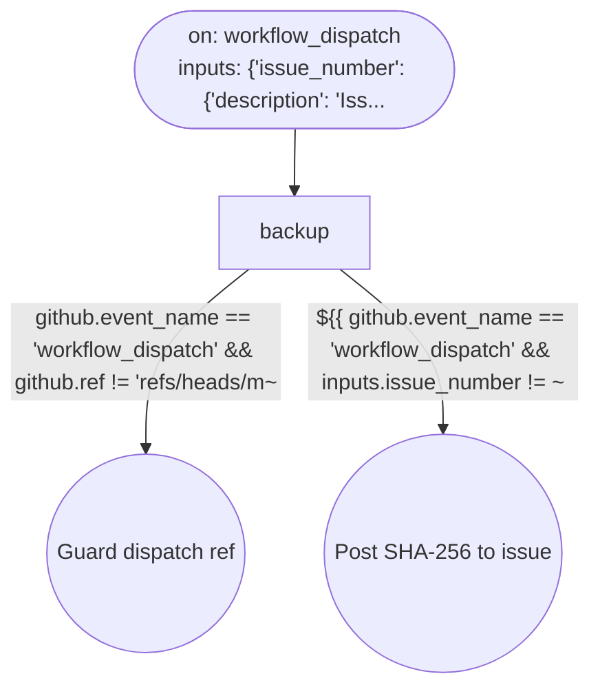

# Workflow if-branches: Backup non-ASCII originals (P1)

This file is generated from `.github/workflows/backup-non-ascii-originals.yml` by `python3 scripts/workflow_diagram.py diagram-doc`. Do not edit it by hand; update the workflow YAML and regenerate instead.

