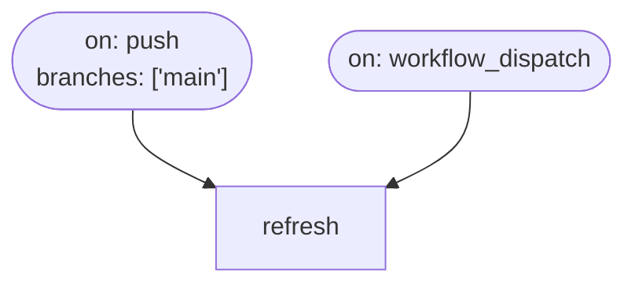

# Workflow if-branches: Refresh devcontainer pin PR

This file is generated from `.github/workflows/devcontainer-pin-refresh.yml` by `python3 scripts/workflow_diagram.py diagram-doc`. Do not edit it by hand; update the workflow YAML and regenerate instead.

