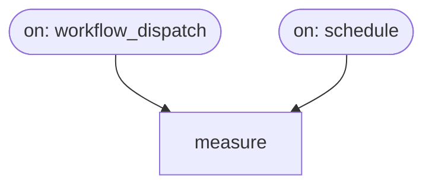

# Workflow if-branches: Measure tool overlap

This file is generated from `.github/workflows/measure-tool-overlap.yml` by `python3 scripts/workflow_diagram.py diagram-doc`. Do not edit it by hand; update the workflow YAML and regenerate instead.

