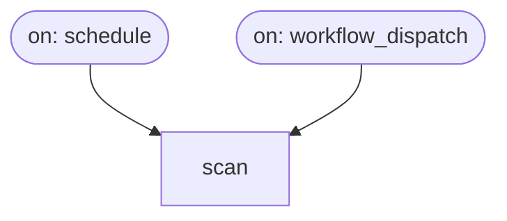

# Workflow if-branches: Scan retro/follow-up linkage drift

This file is generated from `.github/workflows/retro-followup-drift.yml` by `python3 scripts/workflow_diagram.py diagram-doc`. Do not edit it by hand; update the workflow YAML and regenerate instead.

