# Workflow if-branches: Weekly maintenance

This file is generated from `.github/workflows/weekly-maintenance.yml` by `python3 scripts/workflow_diagram.py diagram-doc`. Do not edit it by hand; update the workflow YAML and regenerate instead.

```mermaid
flowchart TD

    T_schedule(["on: schedule"])
    T_push(["on: push\nbranches: ['main']\npaths: ['.github/rulesets/**', '.github/labe..."])
    T_workflow_dispatch(["on: workflow_dispatch\ninputs: {'task': {'description': 'Weekly task..."])

    J_branch_cleanup["branch-cleanup"]
    S_J_branch_cleanup_0(("Guard dispatch ref"))
    J_dependency_freshness["dependency-freshness"]
    J_dependency_threat_triage["dependency-threat-triage"]
    S_J_dependency_threat_triage_0(("Aggregate findings onto the security tracking issue"))
    J_generate_agents["generate-agents"]
    J_measure_timings["measure-timings"]
    S_J_measure_timings_0(("Open or update CI budget tracking issue"))
    S_J_measure_timings_1(("Post report as comment on dispatch issue"))
    J_ruleset_drift["ruleset-drift"]
    J_security_control_drift["security-control-drift"]
    S_J_security_control_drift_0(("Record ruleset detect exit code"))
    S_J_security_control_drift_1(("Record labels plan exit code"))
    S_J_security_control_drift_2(("Diff CLAUDE.md / AGENTS.md"))
    S_J_security_control_drift_3(("Record uv drift exit code"))
    S_J_security_control_drift_4(("Record workflow-permissions drift exit code"))
    S_J_security_control_drift_5(("Record uv stale exit code"))
    S_J_security_control_drift_6(("Record OWASP ASI verify exit code"))
    S_J_security_control_drift_7(("Aggregate drift report"))
    S_J_security_control_drift_8(("Post or update rolling comment on the security tracking issue"))
    S_J_security_control_drift_9(("File per-family drift issues"))
    J_flake_pin_refresh["flake-pin-refresh"]
    S_J_flake_pin_refresh_0(("Recompute per-system hashes and bump flake.nix"))
    S_J_flake_pin_refresh_1(("Validate the bumped flake"))
    S_J_flake_pin_refresh_2(("Mint GitHub App token"))
    S_J_flake_pin_refresh_3(("Open bump PR"))

    T_schedule -->|"github.event_name == 'schedule' || inputs.task == 'all' || inputs.task ~"| J_branch_cleanup
    J_branch_cleanup -->|"github.event_name == 'workflow_dispatch' && github.ref != 'refs/heads/m~"| S_J_branch_cleanup_0
    T_schedule -->|"github.event_name == 'schedule' || inputs.task == 'all' || inputs.task ~"| J_dependency_freshness
    T_schedule -->|"github.event_name == 'schedule' || inputs.task == 'all' || inputs.task ~"| J_dependency_threat_triage
    J_dependency_threat_triage -->|"always()"| S_J_dependency_threat_triage_0
    T_schedule -->|"github.event_name == 'schedule' || inputs.task == 'all' || inputs.task ~"| J_generate_agents
    T_schedule -->|"github.event_name == 'schedule' || inputs.task == 'all' || inputs.task ~"| J_measure_timings
    J_measure_timings -->|"${{ inputs.measure_cutoff == '' }}"| S_J_measure_timings_0
    J_measure_timings -->|"${{ github.event_name == 'workflow_dispatch' && inputs.measure_issue_nu~"| S_J_measure_timings_1
    T_schedule -->|"github.event_name == 'schedule' || inputs.task == 'all' || inputs.task ~"| J_ruleset_drift
    T_schedule -->|"github.event_name == 'schedule' || github.event_name == 'push' || input~"| J_security_control_drift
    T_push -->|"github.event_name == 'schedule' || github.event_name == 'push' || input~"| J_security_control_drift
    J_security_control_drift -->|"always()"| S_J_security_control_drift_0
    J_security_control_drift -->|"always()"| S_J_security_control_drift_1
    J_security_control_drift -->|"always()"| S_J_security_control_drift_2
    J_security_control_drift -->|"always()"| S_J_security_control_drift_3
    J_security_control_drift -->|"always()"| S_J_security_control_drift_4
    J_security_control_drift -->|"always()"| S_J_security_control_drift_5
    J_security_control_drift -->|"always()"| S_J_security_control_drift_6
    J_security_control_drift -->|"always()"| S_J_security_control_drift_7
    J_security_control_drift -->|"always()"| S_J_security_control_drift_8
    J_security_control_drift -->|"always() && steps.aggregate.outputs.drift_families != ''"| S_J_security_control_drift_9
    T_schedule -->|"github.event_name == 'schedule' || inputs.task == 'all' || inputs.task ~"| J_flake_pin_refresh
    J_flake_pin_refresh -->|"steps.decide.outputs.target != ''"| S_J_flake_pin_refresh_0
    J_flake_pin_refresh -->|"steps.decide.outputs.target != ''"| S_J_flake_pin_refresh_1
    J_flake_pin_refresh -->|"steps.decide.outputs.target != ''"| S_J_flake_pin_refresh_2
    J_flake_pin_refresh -->|"steps.decide.outputs.target != ''"| S_J_flake_pin_refresh_3
```

