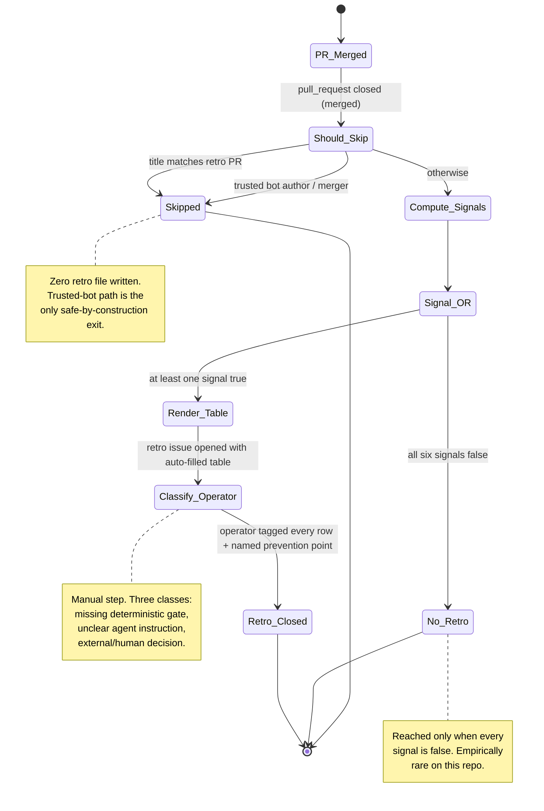
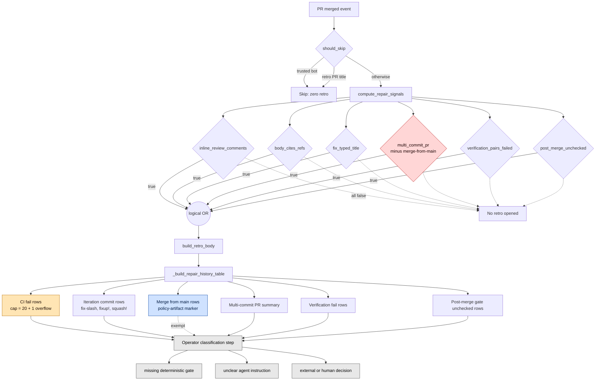

# Repair Loops Proliferation Analysis

Refs #412.

## 1. Scope

This PRD visualizes the conditional branches inside `scripts/auto_retro.py`
that decide whether a merged PR earns a retrospective issue, and which
rows get appended to the auto-filled `Repair history` table. The goal is
to make it possible to read the proliferation story at a glance:

- Which branch is most prone to false positives?
- Which row class is silently capped or exempted?
- Where does the operator still have to classify by hand?
- Does the 9-entry retrospective archive corroborate the diagram?

Out of scope: redesigning the signals, changing the taxonomy, or
mutating `scripts/auto_retro.py`. This PRD is read-only analysis whose
output feeds candidate follow-up issues.

## 2. Sources (facts)

| Source | Span | Role |
|--------|------|------|
| `scripts/auto_retro.py` | 1533 lines | Implementation under analysis |
| `CLAUDE.md` section 3 | Repair classification taxonomy | Operator contract |
| `docs/archive/retrospective-pr-*.md` | 9 files | Empirical signal exercise |
| `.github/rulesets/main.json` | squash + linear-history + strict checks | Source of merge-from-main policy artifacts |

Anchors used below cite the exact symbols in `scripts/auto_retro.py`:
`should_skip` (line 201), `compute_repair_signals` (line 368),
`_build_repair_history_table` (line 480), `build_retro_body` (line 624).

## 3. High-level flow (Figure A)



## 4. Branch-level conditions (Figure B)

Figure B expands the two choice nodes in Figure A. The Signal OR gate
fans into the six signals; the Render Table step fans into the six row
classes. Color codes mark proliferation hotspots.



Color legend:

- Red (`hotFP`): signal with the highest false-positive rate. `multi_commit_pr` still fires on operator self-revisions even after the merge-from-main exemption added in issue #400.
- Orange (`capped`): output silently capped. CI fail rows above 20 are collapsed into a single overflow line; the per-row annotation summary is truncated at 200 chars.
- Blue (`policyArtifact`): exempt from classification. Merge-from-main rows carry `[policy-artifact]` and are documented as a side effect of the squash-only + linear-history + strict-status-checks ruleset, not a repair loop.
- Gray (`manual`): not automated. The classification step relies on operator judgement; nothing prevents a retro from sitting unclassified.

## 5. Empirical signal exercise (Figure C)

Aggregation across the 9 retrospectives in `docs/archive/retrospective-pr-*.md`.
Columns `mdg`, `uai`, `ext` count the appearance of each taxonomy class
in the classification section of the retro body.

| PR | Reviewer-driven repairs | Positive control? | CI fail rows | Iteration | Merge-from-main | Multi-commit | Verification fail | Post-merge | mdg | uai | ext |
|----|------------------------:|:------------------|:------------:|:---------:|:---------------:|:------------:|:-----------------:|:----------:|:---:|:---:|:---:|
| 229 | 3 | no (true repair loop) | 0 | 0 | 0 | 0 | 0 | 0 | 3 | 2 | 1 |
| 235 | 0 | yes | 0 | 0 | 0 | 0 | 0 | 0 | 1 | 1 | 1 |
| 237 | 0 | yes | 0 | 0 | 0 | 0 | 0 | 0 | 1 | 1 | 1 |
| 248 | 0 | yes | 0 | 0 | 0 | 0 | 0 | 0 | 2 | 2 | 2 |
| 249 | 0 | yes | 0 | 0 | 0 | 0 | 0 | 0 | 2 | 2 | 2 |
| 256 | 0 | yes (framework note: auto-retro fired on zero-comment merge; fixed via #253 / #254) | 0 | 0 | 0 | 0 | 0 | 0 | 1 | 1 | 1 |
| 257 | 0 | yes | 0 | 0 | 0 | 0 | 0 | 0 | 1 | 1 | 1 |
| 337 | 0 reviewer + 3 operator self-revisions noted | yes (reviewer-zero) | 0 | 0 | 0 | 1 | 0 | 0 | 2 | 1 | 2 |
| 349 | 0 | yes (framework note: retro opened despite zero review comments; gate gap acknowledged) | 0 | 0 | 0 | 0 | 0 | 0 | 1 | 1 | 1 |

Reading notes:

- `mdg`, `uai`, `ext` counts on positive-control rows reflect template-restated taxonomy headings, not classified repairs. The retro body explicitly states `n/a` next to each on those PRs.
- PR #337 is the only positive-control entry where a row signal (`multi_commit_pr`) actually fired and the retro explains why: three operator self-revisions on the source branch, not reviewer-driven repairs.
- The signal columns are all zero for PRs #235 through #349 by direct inspection of the retro `Repair history` tables, which all render `| -- | (none) | -- |`.

## 6. Findings

1. **The visible "proliferation" is retrospective-file proliferation, not repair-loop proliferation.** 8 of 9 archived retrospectives are explicit positive controls with zero reviewer-driven repairs. Only PR #229 carries a real repair set.
2. **The signal OR-gate has a low specificity floor.** `body_cites_refs`, `fix_typed_title`, `multi_commit_pr`, and `verification_pairs_failed` can each fire on PRs that have no reviewer interaction at all. Two known firings (#256, #349) prompted framework-observation sections in the retros themselves, and one of them (#253 / #254) was fixed by adding a `has_review_comments` skip rule.
3. **`multi_commit_pr` is the highest-residual false-positive vector.** Even with the issue #400 exemption for merge-from-main commits, operator self-revisions still fire it (PR #337). The exemption set covers structural side effects of the merge policy but not drafting-style multi-commits.
4. **CI fail row truncation is silent.** When more than 20 check_runs fail, the retro body summarizes them in a single overflow row; the operator has no in-body view of which checks were dropped beyond the link. Worth surfacing the count and the dropped categories.
5. **Classification is the only fully manual step.** Nothing in the harness prevents a retrospective from sitting indefinitely with unclassified rows. CLAUDE.md section 3 asserts the contract; no gate enforces it.

## 7. Candidate follow-up gates (non-binding)

These are suggestions only. They are NOT decisions to ship; each would need its own issue, plan, and PRD where appropriate.

- A "positive-control" auto-mode for `build_retro_body` that renders a shorter body when every signal is weakly true and the repair table is empty, so positive-control retros do not look identical to true repair loops.
- A drafting-style filter in `multi_commit_pr` (treat author-only consecutive commits within a short window as one logical unit) to suppress the PR #337 class of false positive.
- A classification-pending label that the auto-retro workflow applies and that a future gate removes once every row in the retro body has a non-empty classification cell. Closes the gray box in Figure B.
- A CI fail overflow expansion: when the count exceeds the cap, attach the full list as a fold-out HTML `<details>` block instead of dropping it.

## 8. Non-goals

- Reducing the number of signals. Each signal exists because of a documented reproducer (issue #298 named two).
- Removing the operator classification step. The taxonomy is the contract; the suggestion above only enforces completion, not replacement.
- Backfilling classifications onto PRs #235 through #349. Those retros are explicit positive controls and the framework already accepts them as such.

## 8a. Rollback log

- **2026-05: `preflight_pr_no_merge_commits` gate rolled back (Issue #541).** Issue #491 had introduced a blocking gate that rejected any merge commit in `{base}..HEAD` to keep merge-from-main commits out of the PR diff and out of the auto-retro repair-history table. PR #523 surfaced a false-positive: when the repository owner clicked GitHub's "Update branch" (or any automation merged `main` into the feature branch), the gate fired even though the contributor had not authored a `git merge main`, forcing a manual `git rebase` + `git push --force-with-lease` repair on every base advance. The gate could not distinguish operator-initiated server-side updates from contributor-authored merges, and narrowing it to skip the `committer GitHub <noreply@github.com>` identity would leave a brittle surface against future automation. The squash-merge method on `main` already flattens merge commits at merge time, so the gate's only motivation was auto-retro noise suppression and not a structural defect on `main`. Lesson: do not add a gate that cannot distinguish operator-initiated server-side updates from contributor-authored merges. The `_MERGE_FROM_MAIN_PREFIXES` tuple in `scripts/auto_retro.py` is retained because retro reporting still benefits from labeling those subjects as policy artifacts.

## 9. Verification

- command: `python scripts/scan_non_ascii.py docs/prd/repair-loops-proliferation-analysis.md`
  result: `exit 0`
- command: `grep -c '^```mermaid' docs/prd/repair-loops-proliferation-analysis.md`
  result: `>= 2`
- command: `pre-commit run --files docs/prd/repair-loops-proliferation-analysis.md`
  result: `pass`
- Manual: Mermaid blocks render in the GitHub PR preview without syntax errors. Not exercised in this session (no browser); deferred to PR review.

## 10. References

- Issue #412 (this analysis).
- Issue #400, PR #403 (policy-artifact marker for merge-from-main rows).
- Issue #298 (reproducer for adding signals beyond `inline_review_comments`).
- Issue #253, PR #254 (`has_review_comments` skip rule).
- Issue #381 (CI fail row cap and annotation truncation).
- Issue #491, Issue #541, PR #523 (no-merge-commits gate introduction, false-positive discovery, and rollback recorded in section 8a).
- CLAUDE.md section 3 (operator classification taxonomy and repair-free reproduction contract).
- `scripts/auto_retro.py` `should_skip` (line 201), `compute_repair_signals` (line 368), `_build_repair_history_table` (line 480), `build_retro_body` (line 624).
