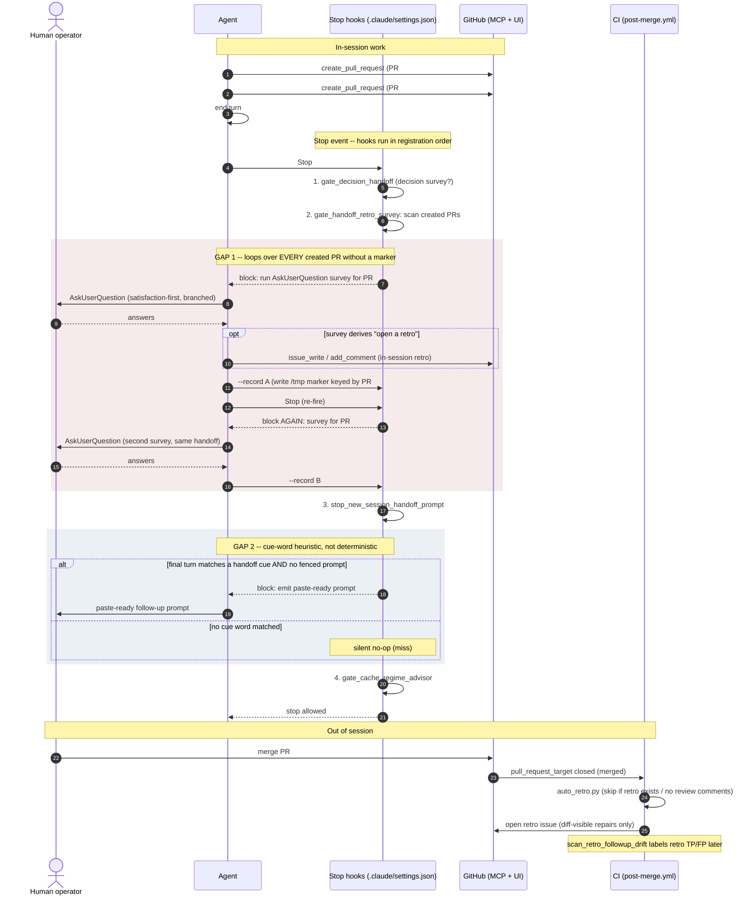

# Survey and follow-up timing sequence gap analysis

> Status: analysis (read-only decision record). Feeds candidate follow-up
> issues rather than defining a gate. Umbrella tracking issue: #1594.

This document visualizes the agent / CI / human collaboration around two
deterministically-intended handoff moments -- the pre-merge retro
*satisfaction survey* and the new-session *follow-up prompt* -- as a single
sequence diagram, then maps the gaps between the intended determinism and the
observed behavior. It exists so the timing contract is not session-memory
dependent: every gap is tagged and routed to a tracking issue or recorded here.

The triggering observation (#1594): a session that opened three PRs
(#1582 / #1584 / #1589) was prompted for the satisfaction survey once per PR,
which the operator flagged as redundant double/triple-firing.

## Source and method

- Method: the three Stop-event handoff hooks and the post-merge CI retro path
  were read in-tree and mapped onto a single sequence of the agent, the
  deterministic hook layer, the human operator (GitHub UI merge), and CI.
- Evidence tags: `[fact]` is observed in-tree or in issue state; `[analysis]`
  is a gap judgement.

### Sources (facts)

| Source | Role |
|--------|------|
| `scripts/gate_handoff_retro_survey_askuserquestion.py` | Stop gate: per-PR pre-merge satisfaction survey + marker recorder |
| `scripts/stop_new_session_handoff_prompt.py` | Stop hook: heuristic new-session follow-up prompt nudge |
| `scripts/gate_decision_handoff_askuserquestion.py` | Stop gate: decision-handoff survey (fires first on the same event) |
| `.claude/settings.json` (`Stop`) | Registers the three Claude-only Stop hooks and their order |
| `.github/workflows/post-merge.yml` (`open-retro`) | CI backstop: opens the retro issue after a human UI merge |
| `scripts/auto_retro.py` | Server-side retro opener invoked by `open-retro` |
| `scripts/scan_retro_followup_drift.py` | Closes the retro->follow-up loop with TP/FP drift labels |

## Sequence diagram (Figure A)

## Gap analysis

| # | Gap `[analysis]` | Evidence `[fact]` | Class | Tracking |
|---|---|---|---|---|
| 1 | The survey is deterministic but at the **wrong granularity**: `evaluate` loops `created_pr_numbers(entries)` and blocks once per PR without a `/tmp/claude-pre-merge-retro-survey/<pr>` marker, so an N-PR session fires the survey N times. | `gate_handoff_retro_survey_askuserquestion.py:251-263` iterates every created PR; marker keyspace is per-PR (`_marker_path(pr_number)`). #1594 observed 3 firings for #1582/#1584/#1589. | Missing deterministic gate (granularity) | #1594 |
| 2 | The follow-up prompt timing is **heuristic, not deterministic** -- it depends on a cue-word match in the final turn's prose and a fenced-block absence, so it silently misses a handoff phrased without a listed cue and cannot fire on a deterministic parked-branch signal. | `stop_new_session_handoff_prompt.py:55-92,140-166`: `HANDOFF_CUES` / `PROVIDED_MARKERS` substring match; "deliberately conservative transcript heuristic (no network, no per-stop API call)". | Unclear/weak deterministic signal | candidate (see below) |
| 3 | Three Claude-only Stop hooks fire on **the same Stop event** with no shared budget: a single handoff can chain a decision survey, one-or-more retro surveys, and a follow-up-prompt block, compounding friction without an aggregate cap. | `.claude/settings.json` `Stop` registers `gate_decision_handoff` -> `gate_handoff_retro_survey` -> `stop_new_session_handoff_prompt` -> `gate_cache_regime_advisor`, each blocking independently. | Missing deterministic gate (coordination) | candidate (see below) |
| 4 | The survey marker is **ephemeral and unaggregated**: `/tmp/claude-pre-merge-retro-survey/<pr>` is per-PR with no handoff-window record, so the gate cannot answer "was this handoff window already surveyed?" -- only "was this exact PR surveyed?". | `_MARKER_DIR = /tmp/...`; `record()` writes one JSON file per PR; no session/window key. | Missing deterministic gate (state model) | #1594 |
| 5 | **Responsibility boundary** between the in-session Stop retro and the CI `auto_retro` retro is documented but not enforced: a process-repair retro (no diff trace) is the Stop path's, a diff-visible retro is CI's, yet nothing reconciles the two if both fire for one PR. | Stop docstring "this path, not CI, owns it" (Refs #1581 / D1) vs `auto_retro.py` skip "a retro issue already exists for the source PR". | External/human reconciliation | #1581 |

## Recommended direction (speculation, for #1594)

- `[analysis]` Gap 1 + Gap 4 are the same defect at two layers: re-key the
  survey from per-PR to **per-handoff-window** (survey once, aggregate the PRs
  opened since the last survey into the single marker), matching the issue's
  proposed direction. Add a regression test that an N-PR session fires the gate
  once, not N times.
- `[analysis]` Gap 2 is the user's "follow-up prompt timing is opportunistic"
  thesis: pair the cue-word heuristic with a **deterministic** parked-state
  signal (e.g. session branch has unpushed/parked work) so a missed cue still
  triggers the prompt; keep the heuristic as the OR-side, not the only side.
- `[analysis]` Gaps 3 and 5 are out of #1594's blast radius (it scopes only
  the survey gate + tests); record them here and open scoped follow-ups rather
  than widening this analysis.

## Out of scope

Redesigning the satisfaction taxonomy, changing the AskUserQuestion flow shape,
or mutating the CI retro path. This document is read-only analysis; the survey
de-duplication fix itself is tracked in #1594.
