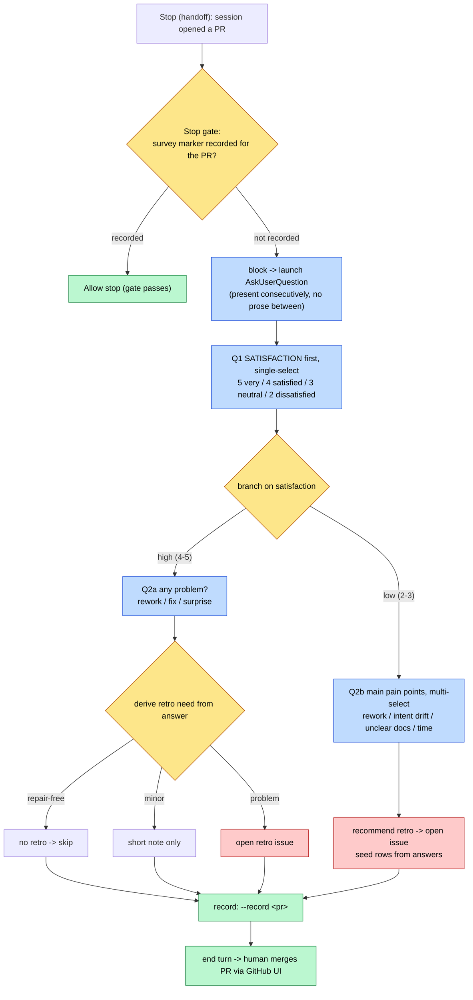

# Pre-merge retro/satisfaction survey gate (handoff Stop hook)

Operator runbook for `scripts/gate_handoff_retro_survey_askuserquestion.py`, the
Claude-only `Stop` hook that blocks the agent's end-of-turn handoff until a
structured retro/satisfaction survey has been presented through the
`AskUserQuestion` tool for every PR the session created. Refs #1073.

## Why a Stop hook, not a merge-tool gate

The earlier design (#1052 / PR #1053) gated `mcp__github__merge_pull_request`.
That only fires when the agent merges through the tool. The repository UX is that
a human reviews and merges through the GitHub UI, so the agent never calls the
merge tool and the survey never appeared (observed on PR #1062). The agent's only
in-session moment that matches a human UI merge is the *handoff*: it has opened a
PR and is ending its turn. #1073 moves the trigger to the `Stop` event.

`AskUserQuestion` is a Claude-only harness tool with no Codex/Devin equivalent, so
the gate lives only in `.claude/settings.json`, mirroring
`scripts/gate_decision_handoff_askuserquestion.py`. The `Stop` event is outside the
`scripts/scan_hook_coverage_drift.py` parity scope (SessionStart / PreToolUse /
PostToolUse), so it needs no allowlist entry.

A hook cannot call `AskUserQuestion` itself; the only lever is to block the stop
and feed the survey flow back to the agent through the block reason. The agent runs
the survey, records completion, and ends its turn for the human to merge.

## Branching scenario



## Operator steps

1. Open the PR as usual (`mcp__github__create_pull_request`) and let the turn end.
2. The Stop gate blocks with a reason that spells out the satisfaction-first,
   scenario-branched flow for each unrecorded PR. Run `AskUserQuestion` accordingly:
   - Ask satisfaction first (single-select).
   - Emit the branched follow-up immediately after the answer, with no prose in
     between, so the survey reads as one continuous flow (plan-mode style).
   - High satisfaction (4-5): ask whether any problem occurred and derive retro
     necessity (repair-free -> skip; minor -> note; problem -> open a retro).
   - Low satisfaction (2-3): ask the main pain points (multi-select) and open a
     retro seeded with the answers.
3. Record the survey: `python3 scripts/gate_handoff_retro_survey_askuserquestion.py --record <pullNumber>`.
   To persist the actual answers instead of an empty marker, add the optional
   non-interactive flags `--satisfaction <2..5>` and `--problem <text>` (see
   "Non-interactive fallback" below).
4. End the turn. The human merges the PR through the GitHub UI; do NOT call
   `merge_pull_request`. A later stop in the same session passes for that PR.

## Non-interactive fallback (AskUserQuestion confirm failure, #1081)

The survey relies on the Claude-only `AskUserQuestion` tool to collect the
satisfaction and problem answers interactively. On PRs #1078 and #1079 the
operator could not confirm/submit the selected option: the confirm action did
not register and the tool returned `Denied by user`, so the gate had to be
cleared with a bare `--record` that captured no signal.

- fact: `scripts/gate_handoff_retro_survey_askuserquestion.py` only *consumes*
  the `AskUserQuestion` tool result; it never renders the picker. The
  confirm/submit affordance lives in the Claude Code harness UI, so the
  interactive defect is out of this repository's scope and cannot be fixed by
  the gate script.
- speculation: the failing control is the confirm/submit affordance of the
  picker rather than the selection itself; record the precise control on #1081
  when it is reproduced under the harness.

Repository-side mitigation: `--record` accepts the answers non-interactively so
a real signal is captured even when the interactive confirm cannot be
submitted:

```
python3 scripts/gate_handoff_retro_survey_askuserquestion.py \
  --record <pullNumber> --satisfaction 5 --problem none
```

`--satisfaction` must be an integer `2..5`; an out-of-range value is rejected
loudly with no marker written, so the handoff is never marked done on bad data.
`--problem` is free text. A bare `--record` stays valid because the gate only
checks marker existence. The answers are persisted as JSON in the marker body.

## Only successfully created PRs count (#1374)

A PR counts as "created" only when the `create_pull_request` tool_result did not
error. A failed creation is marked `is_error: true` by the harness, and a common
failure ("A pull request already exists for owner:branch .../pull/<n>") still
carries a `/pull/<n>` URL pointing at the *existing* PR. The gate skips
`is_error` results so the handoff survey is not fired for a PR this session never
opened.

## Failure modes

Fails open (CLAUDE.md section 4): malformed stdin, a non-dict event, an unreadable
transcript, or any exception in `evaluate()` exits 0 with no output, so a gate bug
never wedges the session. The server-side post-merge retro
(`.github/workflows/post-merge.yml`) remains the backstop.

## Verification

- `uv run python -m pytest tests/test_gate_handoff_retro_survey_askuserquestion.py -q`
- `uv run python scripts/scan_hook_coverage_drift.py verify` (the `Stop` event is
  outside parity scope, so this gate is not expected in the allowlist)
- Non-interactive fallback: `python3 scripts/gate_handoff_retro_survey_askuserquestion.py --record <pullNumber> --satisfaction 5 --problem none`
  records the answers; an out-of-range `--satisfaction` (for example `1`) writes
  no marker and exits with an error.
