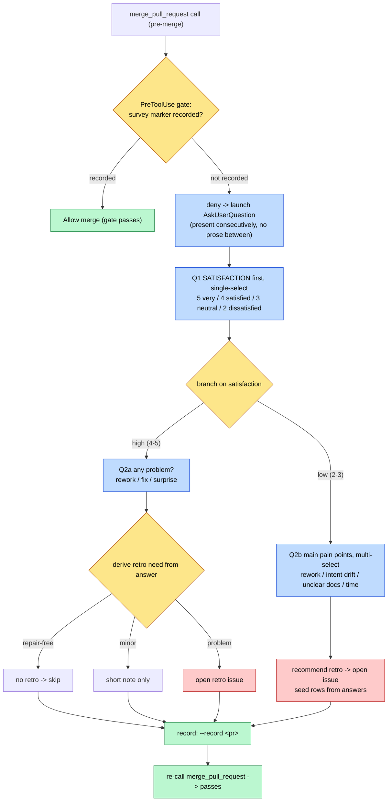

# Pre-merge retro/satisfaction survey gate

Operator runbook for `scripts/gate_merge_retro_survey_askuserquestion.py`, the
Claude-only PreToolUse gate that blocks `mcp__github__merge_pull_request` until a
structured retro/satisfaction survey has been presented through the
`AskUserQuestion` tool for the same PR. Refs #1052.

## Why this gate exists

CLAUDE.md section 3 requires a retrospective and prefers deterministic gates over
operator-recall steps. `AskUserQuestion` is a Claude-only harness tool with no
Codex/Devin equivalent, so the gate lives only in `.claude/settings.json` and is
allowlisted in `scripts/scan_hook_coverage_drift.py` (PreToolUse is in the parity
scan scope), mirroring `scripts/gate_decision_handoff_askuserquestion.py`.

A hook cannot call `AskUserQuestion` itself; the only lever is to deny the merge
and feed the survey flow back to the agent through the deny reason. The agent runs
the survey, records completion, and re-calls the merge.

## Branching scenario

## Operator steps

1. Attempt the merge as usual (`mcp__github__merge_pull_request`).
2. The gate denies with a reason that spells out the satisfaction-first,
   scenario-branched flow. Run `AskUserQuestion` accordingly:
   - Ask satisfaction first (single-select).
   - Emit the branched follow-up immediately after the answer, with no prose in
     between, so the survey reads as one continuous flow (plan-mode style).
   - High satisfaction (4-5): ask whether any problem occurred and derive retro
     necessity (repair-free -> skip; minor -> note; problem -> open a retro).
   - Low satisfaction (2-3): ask the main pain points (multi-select) and open a
     retro seeded with the answers.
3. Record the survey: `python3 scripts/gate_merge_retro_survey_askuserquestion.py --record <pullNumber>`.
4. Re-call the merge; the gate now passes.

## Failure modes

Fails open (CLAUDE.md section 4): malformed stdin, a non-dict event, a missing or
non-numeric `pullNumber`, or any exception in `decide()` exits 0 with no output, so
a gate bug never wedges a merge. The server-side merge protections remain the
backstop.

## Verification

- `uv run python -m pytest tests/test_gate_merge_retro_survey_askuserquestion.py -q`
- `uv run python scripts/scan_hook_coverage_drift.py verify` (the gate appears as an
  allowlisted gap)
