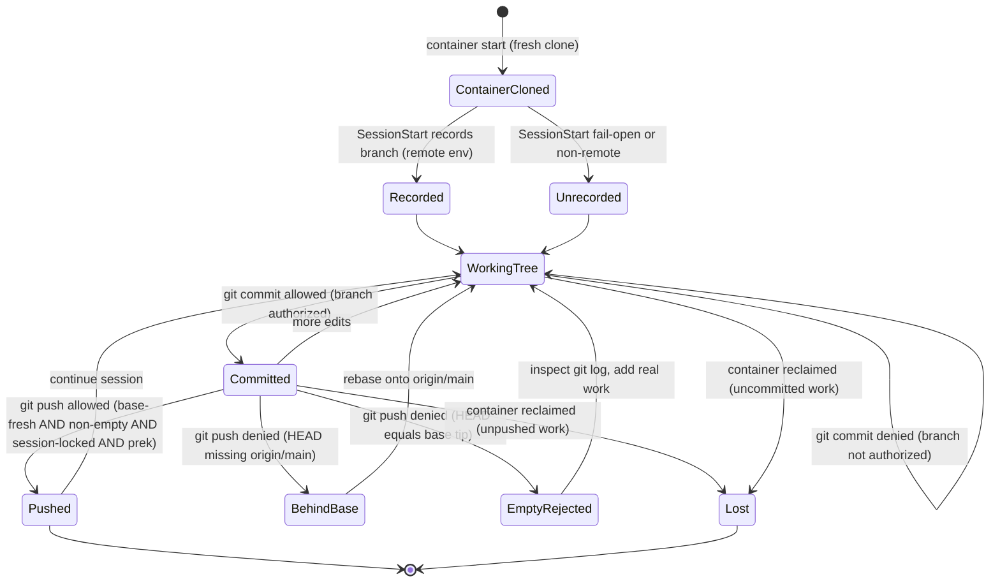
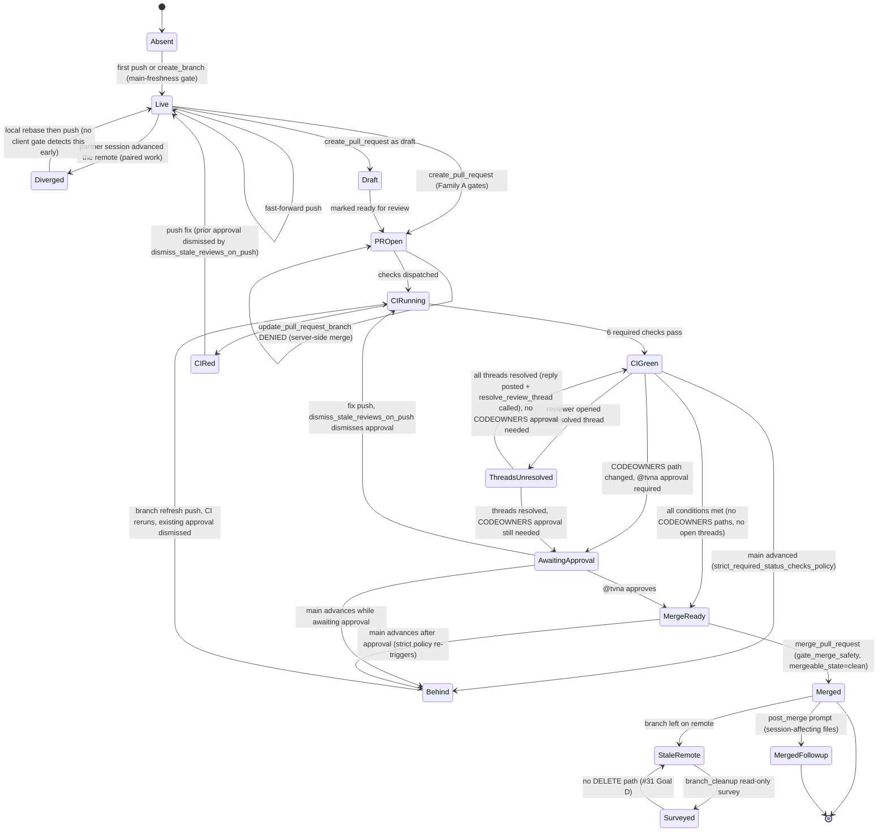

# ローカルブランチ と リモートブランチ の状態遷移

[English](./branch-local-remote.state.md) | 日本語

> ステータス: 読み取り専用の UML 設計記録（レビュー用成果物）。起点となる Issue は
> #1627（エージェント処理のブランチギャップを状態遷移のレンズで分析する）。これが
> 交差するのは、セッションブランチのロック（#785, #1181, #1513）、空 push ゲート
> （#1130）、サーバ側ブランチ更新の deny（#893）、そしてスコープ外のリモート削除
> 経路（#31 Goal D）である。

本ドキュメントは、エージェントが 1 つのリモート実行セッション内で駆動するブランチ
ライフサイクルを、実際に乖離する 2 つの状態機械に分けてモデル化する: エフェメラルな
コンテナ内の **ローカル** 作業ブランチと、GitHub 上の **リモート** ブランチである。
ここで状態遷移図が適切なレンズなのは（フック単位のメッセージ順序は既存の
`survey-followup-timing.sequence.md` が扱っている）、欠陥クラスが *コンテナ境界を
またぐ状態の乖離* にあるからだ ---- ブランチが取りうる状態、決定論的ゲートが守る遷移、
そしてゲートが一切ない遷移は何か。

- 証拠タグ: `[fact]` はツリー内で観測された事実（file:line を引用）、`[analysis]` は
  ギャップに対する判断。

## ゲートの位置

`[fact]` ローカルのライフサイクルは PreToolUse の Bash ゲート群と 1 つの SessionStart
レコーダで統治され、リモートのライフサイクルは `mcp__github__*` の PreToolUse ゲートと
1 つの PostToolUse フォローアップで統治される。いずれも code-owner マージゲートの背後の
`scripts/` 配下にあり、`.claude/settings.json` で配線されている。

| 守る遷移 | ゲート | フェーズ |
|---|---|---|
| 許可された push 先を記録 | `check_session_branch.py:17`（`.git/CLAUDE_SESSION_BRANCH` へ追記） | SessionStart |
| 非セッションブランチへの commit | `preflight_commit_session_branch.py` | PreToolUse `git commit` |
| 非セッションブランチへの push | `preflight_push_session_branch.py` | PreToolUse `git push` |
| base に後れたブランチの push | `preflight_branch_base.py:45-58`, `preflight_push_base.py` | PreToolUse `git push` |
| 新規分のない push（HEAD == base tip） | `preflight_push_nonempty.py:40` | PreToolUse `git push` |
| ローカル prek なしの push | `preflight_push_prek.py` | PreToolUse `git push` |
| 陳腐化した main 上でのリモートブランチ作成 | `preflight_main_freshness.py` | PreToolUse `mcp__github__create_branch` |
| サーバ側ブランチ更新（マージコミット） | `gate_update_pr_branch.py:4-9`（deny） | PreToolUse `mcp__github__update_pull_request_branch` |
| 設定変更マージ後のフォローアップ提示 | `post_merge_new_session_prompt.py` | PostToolUse `mcp__github__merge_pull_request` |

`[analysis]` 許可ブランチの述語は連言である ---- 記録された集合のメンバーであり、かつ
保護ブランチでないこと（`_session_branches.py:84-87`）。だが空または読めない集合は
全ゲートで fail-open として扱われるため、記録されていないセッションは、サーバ側の
ブランチ保護と CI がバックストップとして働くまで無拘束になる。

## ローカルブランチ状態機械

## リモートブランチ状態機械

`[fact]` マージ合流条件（`.github/rulesets/main.json` 実測）: (a)
`require_code_owner_review: true` ---- CODEOWNERS 保護パス（`.github/rulesets/**`、
`docs/graph/**`、`.github/CODEOWNERS`、`docs/runbooks/rulesets.md`、
`.github/workflows/apply-rulesets.yml`）を変更する PR は @tvna 承認が必須; (b) `required_review_thread_resolution: true` ---- 全レビュースレッド
の解決が必須; (c) `dismiss_stale_reviews_on_push: true` ---- 承認後の push で既存
承認が即時失効; (d) `strict_required_status_checks_policy: true` ---- マージ試行時点で
ブランチが main と同期している必要（CI 実行時点ではなく）; (e)
`allowed_merge_methods: ["squash"]` ---- スカッシュマージのみ許可。`gate_merge_safety.py`
は fail-closed で、`mergeable_state == "clean"` ---- GitHub が上記 5 条件すべての
充足を示す複合シグナル ---- の場合のみ `merge_pull_request` を許可する
（`gate_merge_safety.py:17-19`）。

`[analysis]` CODEOWNERS 保護パスを変更した PR に特有の 2 つのフィードバックループが
存在する。ループ 1（push 失効）: CI が赤になった後、修正 push により @tvna の既存承認が
`dismiss_stale_reviews_on_push` で失効し、CI 再実行と再承認が必要になる。ループ 2
（strict ポリシー）: @tvna 承認後に別 PR が main にマージされると
`strict_required_status_checks_policy` でブランチが `Behind` に遷移し、ブランチ更新
push（再び承認失効）→ CI 再実行 → 再承認 のサイクルが繰り返される。いずれのループも
「@tvna の最後の承認からマージ試行までの窓に競合マージが入らない」状態になるまで
続く。これらのループは CODEOWNERS 保護パス 5 グループ（`.github/CODEOWNERS`、
`.github/rulesets/**`、`.github/workflows/apply-rulesets.yml`、
`docs/runbooks/rulesets.md`、`docs/graph/**`）に触れる PR にのみ発生する。

## ギャップ分析

| # | ギャップ `[analysis]` | 証拠 `[fact]`（file:line） | 追跡 |
|---|---|---|---|
| 1 | 未記録セッションの fail-open: `.git/CLAUDE_SESSION_BRANCH` が空または読めないと許可集合は空になり、各セッションブランチゲートは任意のブランチへの commit/push を許してしまう ---- ロックが効くのは SessionStart が実際にブランチを記録した後だけである。 | `_session_branches.py:43`, `:84-87`; fail-open は `preflight_commit_session_branch.py:27` と `preflight_push_session_branch.py:18` に記載。 | #785, #1513, #1181 |
| 2 | HEAD をリモートのセッションブランチ tip と突き合わせるローカルゲートがない。push ゲートは HEAD が `origin/main` を含むこと、および HEAD が base tip より進んでいることしか主張しない ---- 相方セッション（ペア作業の codex/claude）が同じリモートブランチを進めると non-fast-forward の乖離が生じ、誘導付きの rebase ではなく素の push reject としてしか表面化しない。 | `preflight_branch_base.py:45-58`; `preflight_push_nonempty.py:40`; ペア作業の根拠は `_session_branches.py` の docstring。 | #1513 |
| 3 | エフェメラルなコンテナの喪失: コンテナ回収前に push されなかったローカルコミットは回復不能。push ゲートは明示的な `git push` でのみ発火するため、アイドル回収前の push を促すものがない。 | 環境契約（非アクティブ後にコンテナ回収）; push ゲートはリテラルな `git push` を条件とする ---- `preflight_push_nonempty.py:45-46`。 | #1627 |
| 4 | リモートのマージ済みブランチ削除は意図的にスコープ外: `branch_cleanup` は DELETE 経路を持たない読み取り専用サーベイのため、マージ済みリモートブランチは決定論的な削除ゲートなしに蓄積する。 | `branch_cleanup.py:5`, `:342-343`（DELETE 経路なし; #31 Goal D）。 | #31 |
| 5 | `update_pull_request_branch` は deny される（マージコミットを加えるサーバ側マージのため）が、その回復 ---- ローカル rebase 後の push ---- はランブックに記された運用/エージェント手順であり、自動化された遷移ではない。 | `gate_update_pr_branch.py:4-9`, 回復ランブックは `:40`。 | #893 |
| 6 | 多層防御の前提: すべてのローカル commit/push ゲートは内部エラーで fail-open するため、静かに壊れたゲートは守るべき操作を許す。correctness はサーバ側のブランチ保護と CI に全面的に依存する。 | fail-open は `preflight_push_session_branch.py:18`, `preflight_commit_session_branch.py:27`, `check_session_branch.py:23`。 | #785 |
| 7 | `CIGreen --> Merged` が単一の直接遷移として描かれており、サーバ側のマージ合流条件（CODEOWNERS 承認・レビュースレッド解決・strict ポリシーによるブランチ陳腐化・ドラフト状態・マージ手法制約）がすべて欠落していた。`CIGreen` はマージの必要条件であって十分条件ではなく、`MergeReady` には 5 条件の同時充足が必要。 | `.github/rulesets/main.json`（5 条件）; `gate_merge_safety.py:17-19`（`mergeable_state != "clean"` でのブロック）。 | #1923 |
| 8 | 2 つのフィードバックループが未モデル化: (1) CI 修正 push で @tvna 承認が失効し CI 再実行と再承認が必要（`dismiss_stale_reviews_on_push: true`）; (2) @tvna 承認後に別 PR が main にマージされるとブランチが `Behind` に遷移し、更新 push で承認が再失効するループ（`strict_required_status_checks_policy: true`）。いずれも CODEOWNERS 保護パスを含む PR にのみ発生。 | `main.json: dismiss_stale_reviews_on_push=true`, `strict_required_status_checks_policy=true`; `.github/CODEOWNERS`（`docs/graph/**` を含む 5 パス群）。 | #1923 |
| 9 | `gate_merge_safety.py` は `blocked` 状態のサブ条件を単一の汎用メッセージに集約しており、エージェントは「CI 待機」「@tvna レビュー要求」「スレッド解決」「ブランチ更新」のいずれが必要かを判断できない。 | `gate_merge_safety.py:79-84`（`_STATE_REMEDIATION["blocked"]` が汎用文字列）。 | #1923 |
| 10 | `ThreadsUnresolved` 状態に返信投稿と `resolve_review_thread` 呼び出しのサブ遷移がなく、エージェントが読んでも必要な 2 ステップの手順が見えない。ギャップ A（stop hook の自己返信 echo 誤発火）およびギャップ B（fix push 後の resolve 手順未定義）と連動。 | ギャップ A: `scripts/gate_stop_pr_review_reply.py`（自己投稿 webhook スキップを追加）; ギャップ B: `.apm/instructions/master.instructions.md` セクション 3（resolve 手順を追記）。 | #1932 |

## 推奨される方向（speculation）

- `[analysis]` ギャップ 1 + 6 は 2 層に現れる 1 つの欠陥: 許可集合の読み取りで
  「セッション未記録（正当に fail-open）」と「記録済み集合をセッション途中で喪失
  （fail-closed または再記録すべき）」を区別し、未記録セッションでも保護ブランチへは
  push できないという回帰テストを追加する。
- `[analysis]` ギャップ 2: push 前にリモートのセッションブランチ tip を観測し、
  non-fast-forward の乖離を素の 403/reject ではなく誘導付きの rebase プロンプトに
  変える ---- `preflight_branch_base` が陳腐化した base を実行可能な deny に変えるのと
  同じ要領で。
- `[analysis]` ギャップ 4: 破壊的削除はセッション内エージェント経路から外したまま、
  蓄積は決定論的な post-merge クリーンアップジョブ（CI）で閉じる ---- サーベイが既に
  前提としているのと同じバックストップ型。エージェントの記憶には委ねない。
- `[analysis]` ギャップ 7 + 8: ダイアグラムの `CIGreen -> MergeReady` 拡張により、
  マージ合流条件が一覧で確認可能になった。実装変更は不要; `main.json` がすでに強制
  している内容への文書化追随である。
- `[analysis]` ギャップ 9: `gate_merge_safety.py` が PR のレビュー状態とチェック
  スイート結果を REST API で probe することで、「承認未取得」「スレッド未解決」
  「CI 実行中」を別々の修復指示に分けられる。ダイアグラム更新がマージされた後、
  別 Issue としてスコープする。

## スコープ注記

`[fact]` ローカルゲートは authoritative ではなく advisory + バックストップである:
各ゲートは fail-open し、真のガードとして CI とサーバ側ブランチ保護を名指しする
（`preflight_push_session_branch.py:18`）。`[analysis]` よってここでモデル化した
ローカル/リモートの乖離は correctness の穴ではなく、エージェント/オペレータの摩擦
クラス ---- 欠落した誘導遷移 ---- である: サーバ側ルールは依然として不正な push を
reject する。`finishing-a-development-branch` スキル（advisory, CLAUDE.md 第 3 節）は
ブランチの仕上げ方を形作るが、これらの遷移に強制力は加えない。
