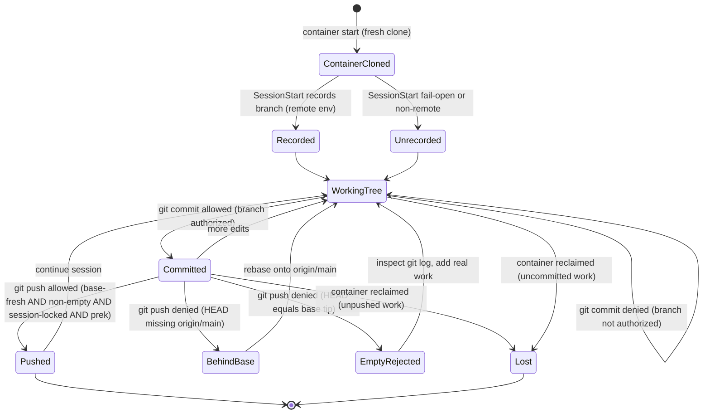
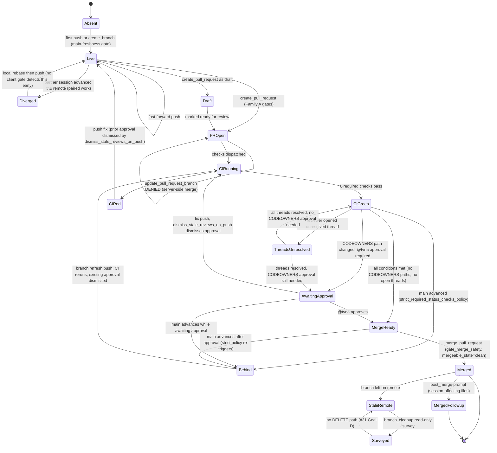

# Local vs Remote Branch State Transitions

English | [日本語](./branch-local-remote.state.ja.md)

> Status: read-only UML design record (review artifact). Origin issue is #1627
> (state-transition lens for agent-processing branch gaps). It crosses the
> session-branch lock (#785, #1181, #1513), the empty-push gate (#1130), the
> server-side branch-update deny (#893), and the out-of-scope remote delete
> path (#31 Goal D).

This document models the branch lifecycle the agent drives inside one remote
execution session, split into the two state machines that actually diverge:
the **local** working branch inside the ephemeral container, and the **remote**
branch on GitHub. A state diagram is the right lens here (the existing
`survey-followup-timing.sequence.md` already covers per-hook message ordering)
because the defect class is *state divergence across the container boundary*:
which states a branch can occupy, which transitions a deterministic gate guards,
and which transitions have no gate at all.

- Evidence tags: `[fact]` is observed in-tree (file:line cited); `[analysis]`
  is a judgement about a gap.

## Where the gates sit

`[fact]` The local lifecycle is governed by PreToolUse Bash gates and one
SessionStart recorder; the remote lifecycle is governed by `mcp__github__*`
PreToolUse gates plus a PostToolUse follow-up. All of them live in
`scripts/` behind the code-owner merge gate and are wired in
`.claude/settings.json`.

| Transition guarded | Gate | Phase |
|---|---|---|
| Record the permitted push target | `check_session_branch.py:17` (append to `.git/CLAUDE_SESSION_BRANCH`) | SessionStart |
| Commit onto a non-session branch | `preflight_commit_session_branch.py` | PreToolUse `git commit` |
| Push to a non-session branch | `preflight_push_session_branch.py` | PreToolUse `git push` |
| Push a branch behind its base | `preflight_branch_base.py:45-58`, `preflight_push_base.py` | PreToolUse `git push` |
| Push nothing new (HEAD == base tip) | `preflight_push_nonempty.py:40` | PreToolUse `git push` |
| Push without local prek | `preflight_push_prek.py` | PreToolUse `git push` |
| Create a remote branch on a stale main | `preflight_main_freshness.py` | PreToolUse `mcp__github__create_branch` |
| Server-side branch update (merge commit) | `gate_update_pr_branch.py:4-9` (deny) | PreToolUse `mcp__github__update_pull_request_branch` |
| Surface a follow-up after a config-touching merge | `post_merge_new_session_prompt.py` | PostToolUse `mcp__github__merge_pull_request` |

`[analysis]` The authorized-branch predicate is a conjunction; member of the
recorded set AND not a protected branch (`_session_branches.py:84-87`); but
an empty or unreadable set is treated as fail-open by every gate, so an
unrecorded session is unconstrained until server-side branch protection and CI
act as the backstop.

## Local branch state machine

## Remote branch state machine

`[fact]` Merge readiness conditions observed in `.github/rulesets/main.json`: (a)
`require_code_owner_review: true` (when a PR touches a CODEOWNERS-protected path
(`.github/rulesets/**`, `docs/graph/**`, `.github/CODEOWNERS`, `docs/runbooks/rulesets.md`,
`.github/workflows/apply-rulesets.yml`), @tvna approval is required before merge); (b) `required_review_thread_resolution: true`
(all review threads must be resolved); (c) `dismiss_stale_reviews_on_push: true` (a
commit pushed after approval dismisses that approval immediately); (d)
`strict_required_status_checks_policy: true` (the branch must be up to date with main
at the time of the merge attempt, not just when CI ran); (e)
`allowed_merge_methods: ["squash"]` (only squash merges are accepted).
`gate_merge_safety.py` is fail-closed and permits `merge_pull_request` only when
`mergeable_state == "clean"` (GitHub's composite signal that all of the above are
satisfied simultaneously; `gate_merge_safety.py:17-19`).

`[analysis]` Two feedback loops arise specifically on PRs touching CODEOWNERS-protected
paths. Loop 1 (push-dismissal): after CI goes red, a fix push dismisses the existing
@tvna approval; CI must rerun and @tvna must re-approve before merge is possible again.
Loop 2 (strict-policy): once @tvna approves, if any other PR merges to main the branch
goes `Behind` (strict_required_status_checks_policy); a refresh push is then required,
which dismisses the approval again, forcing CI rerun and re-approval. Both loops repeat
until the window between the last @tvna approval and the merge attempt contains no
competing merge to main. These loops apply only to PRs that touch the five
CODEOWNERS-protected path groups (`.github/CODEOWNERS`, `.github/rulesets/**`,
`.github/workflows/apply-rulesets.yml`, `docs/runbooks/rulesets.md`, `docs/graph/**`).

## Gap analysis

| # | Gap `[analysis]` | Evidence `[fact]` (file:line) | Tracking |
|---|---|---|---|
| 1 | Unrecorded-session fail-open: when `.git/CLAUDE_SESSION_BRANCH` is empty or unreadable the authorized set is empty, and every session-branch gate then permits a commit/push to ANY branch; the lock only holds once SessionStart actually recorded a branch. | `_session_branches.py:43`, `:84-87`; fail-open noted in `preflight_commit_session_branch.py:27` and `preflight_push_session_branch.py:18`. | #785, #1513, #1181 |
| 2 | No local gate compares HEAD against the remote session-branch tip. The push gates only assert HEAD contains `origin/main` and HEAD is beyond the base tip; a partner session advancing the same remote branch (paired codex/claude) creates a non-fast-forward divergence surfaced only as a raw push reject, not a guided rebase. | `preflight_branch_base.py:45-58`; `preflight_push_nonempty.py:40`; paired-work rationale in `_session_branches.py` docstring. | #1513 |
| 3 | Ephemeral-container loss: local commits not pushed before the container is reclaimed are unrecoverable. The push gates fire only on an explicit `git push`, so nothing nudges a push before idle reclamation. | Environment contract (container reclaimed after inactivity); push gates gated on a literal `git push`; `preflight_push_nonempty.py:45-46`. | #1627 |
| 4 | Remote merged-branch deletion is intentionally out of scope: `branch_cleanup` is a read-only survey with no DELETE code path, so merged remote branches accumulate with no deterministic delete gate. | `branch_cleanup.py:5`, `:342-343` (no DELETE path; #31 Goal D). | #31 |
| 5 | `update_pull_request_branch` is denied (it does a server-side merge that adds a merge commit), but the recovery; a local rebase then push; is operator/agent procedure in a runbook, not an automated transition. | `gate_update_pr_branch.py:4-9`, recovery runbook at `:40`. | #893 |
| 6 | Defense-in-depth assumption: every local commit/push gate fails open on internal error, so a silently broken gate permits the action it guards; correctness then rests entirely on server-side branch protection plus CI. | Fail-open in `preflight_push_session_branch.py:18`, `preflight_commit_session_branch.py:27`, `check_session_branch.py:23`. | #785 |
| 7 | `CIGreen --> Merged` was a single direct transition omitting all server-side merge-readiness conditions: CODEOWNERS approval, review-thread resolution, branch staleness under the strict policy, draft state, and merge-method restriction. `CIGreen` is a necessary but not sufficient precondition for merge; `MergeReady` requires all five conditions to hold simultaneously. | `.github/rulesets/main.json` (five conditions); `gate_merge_safety.py:17-19` (fail-closed on `mergeable_state != "clean"`). | #1923 |
| 8 | Two feedback loops are unmodeled: (1) a CI-fix push dismisses the existing @tvna approval (`dismiss_stale_reviews_on_push: true`), requiring CI rerun and re-approval after every fix iteration; (2) a competing merge to main after @tvna approves triggers `strict_required_status_checks_policy`, sending the branch `Behind`, which requires a refresh push (again dismissing approval), CI rerun, and re-approval. Both loops apply only to PRs touching CODEOWNERS-protected paths. | `main.json: dismiss_stale_reviews_on_push=true`, `strict_required_status_checks_policy=true`; `.github/CODEOWNERS` (5 protected path groups including `docs/graph/**`). | #1923 |
| 9 | `gate_merge_safety.py` maps all non-`clean` `blocked` states to a single generic remediation message, giving no sub-condition diagnosis. An agent receiving `mergeable_state=blocked` cannot determine whether to wait for CI, request @tvna review, resolve a thread, or refresh the branch. | `gate_merge_safety.py:79-84` (`_STATE_REMEDIATION["blocked"]` is a single generic string). | #1923 |

## Recommended direction (speculation)

- `[analysis]` Gap 1 + 6 are one defect at two layers: make the
  authorized-set read distinguish "no session recorded" (legitimately
  fail-open) from "recorded set lost mid-session" (should fail closed or
  re-record), and add a regression that an unrecorded session still cannot
  push a protected branch.
- `[analysis]` Gap 2: add a pre-push observation of the remote session-branch
  tip so a non-fast-forward divergence becomes a guided rebase prompt rather
  than a raw 403/reject, mirroring how `preflight_branch_base` turns a stale
  base into an actionable deny.
- `[analysis]` Gap 4: keep the destructive delete out of the in-session agent
  path, but close the accumulation with a deterministic post-merge cleanup
  job (CI), not agent memory; the same backstop pattern the survey already
  assumes.
- `[analysis]` Gap 7 + 8: the `CIGreen -> MergeReady` expansion in the diagram
  makes the full merge-readiness precondition inspectable at a glance. No
  implementation change is required; this is a documentation catch-up to what
  `main.json` already enforces.
- `[analysis]` Gap 9: `gate_merge_safety.py` could probe the PR's review state
  and check-suite results via the REST API to surface distinct remediations for
  "approval missing", "thread unresolved", and "CI still running". Scope as a
  separate issue after this diagram update lands.

## Scope note

`[fact]` The local gates are advisory-with-backstop, not authoritative: each
fails open and names CI plus server-side branch protection as the real guard
(`preflight_push_session_branch.py:18`). `[analysis]` So the local/remote
divergence modeled here is an agent/operator friction class; a missing
guided transition; not a correctness hole: the server-side rules still
reject an illegitimate push. The `finishing-a-development-branch` skill
(advisory, CLAUDE.md section 3) shapes how a branch is wrapped up, but adds no
enforcement to these transitions.
