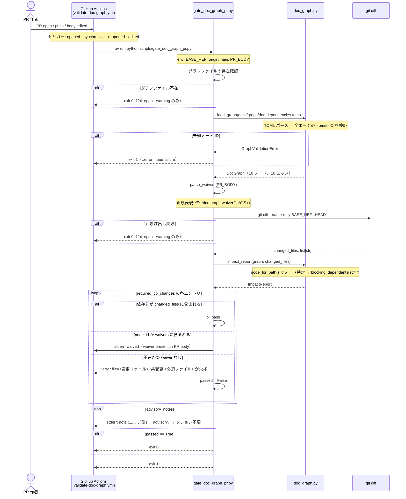
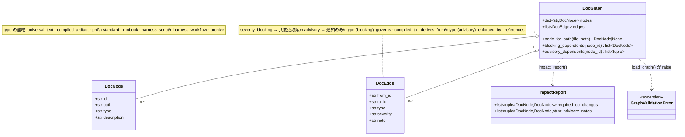

# 文書依存グラフ ガバナンス ギャップ分析

[English](./doc-dependency-graph-governance.gap.md) | 日本語

> ステータス: 読み取り専用の UML 設計記録（レビュー用成果物）。起点となる Issue は
> #1754（型付き文書依存グラフによる共変更ゲートの強化）。PR #1737 が露呈した
> ガバナンスギャップ（`master.instructions.md` 単独更新により管轄下の PRD 6 件が
> 未更新のままマージ）、それを閉じるグラフモデル、および advisory ゲートが
> まだ閉じていない残余ギャップを記録する。

本ドキュメントは、PR #1755 の前後における文書ガバナンスギャップを 3 つのレンズで
モデル化する: Before/After の依存強制マップ（ギャップの所在）、CI ゲートの
シーケンス（修正が各 PR でどう動くか）、グラフデータモデル（宣言とゲートが推論
する対象）。ギャップ表は 3 つの視点から導出する。

- 証拠タグ: `[fact]` はツリー内で観測された事実（file:line を引用）、`[analysis]`
  はギャップに対する判断。

## Before / After 強制マップ

`[fact]` PR #1755 以前、機械的に強制された依存エッジは 1 本のみだった:
`master.instructions.md` → `design_philosophy_prd`（`scan_design_philosophy_drift.py
verify-coupling`、`scan_design_philosophy_drift.py:437-470`）。
`master.instructions.md` が管轄するその他の PRD との関係はすべてレビュワーの記憶に
依存していた。

```mermaid
graph TD
    subgraph BEFORE["Before PR #1755; 強制エッジ: 1本"]
        direction TB
        MI_B["master.instructions.md"]
        DP_B["design_philosophy_prd ✅ blocking\n(scan_design_philosophy_drift)"]
        NA_B["non_ascii_prd ❌ 記憶依存"]
        SC_B["security_control_inventory ❌ 記憶依存"]
        IP_B["issue_pr_body_standard ❌ 記憶依存"]
        WQ_B["workflow_script_quality ❌ 記憶依存"]
        MI_B -->|"verify-coupling\n意味的整合 1 エッジ"| DP_B
        MI_B -. "レビュワーの記憶\n(PR #1737 で漏れた)" .-> NA_B
        MI_B -. "レビュワーの記憶" .-> SC_B
        MI_B -. "レビュワーの記憶" .-> IP_B
        MI_B -. "レビュワーの記憶" .-> WQ_B
    end

    subgraph AFTER["After PR #1755; blocking エッジ: 8本 + advisory エッジ: 8本"]
        direction TB
        MI_A["master.instructions.md"]
        DP_A["design_philosophy_prd\n🔴 governs · blocking"]
        NA_A["non_ascii_prd\n🔴 governs · blocking"]
        SC_A["security_control_inventory\n🔴 governs · blocking"]
        IP_A["issue_pr_body_standard\n🔴 governs · blocking"]
        WQ_A["workflow_script_quality\n🔴 governs · blocking"]
        DD_A["doc_dependency_prd\n🔴 governs · blocking"]
        CL_A["claude_md\n🔴 compiled_to · blocking"]
        AG_A["agents_md\n🔴 compiled_to · blocking"]
        MI_A --> DP_A
        MI_A --> NA_A
        MI_A --> SC_A
        MI_A --> IP_A
        MI_A --> WQ_A
        MI_A --> DD_A
        MI_A --> CL_A
        MI_A --> AG_A
    end
```

`[fact]` 2 つのゲートは代替ではなく補完関係にある:
`scan_design_philosophy_drift.py verify-coupling` は 1 エッジに対して意味的深さ
（ラベル一致、用語整合）を提供し、`gate_doc_graph_pr.py` は TOML 宣言済みの全エッジに
対して幅（ファイル共変更チェック）を提供する。

## CI ゲートのシーケンス

`[fact]` ゲートが fail-open（exit 0）になるのは 2 ケース: (a) TOML グラフファイル
が存在しない（`gate_doc_graph_pr.py:163-169`）、(b) `git diff` が非ゼロを返す
（`gate_doc_graph_pr.py:83-90`）。fail-loud（exit 1）になるのは (c) グラフ検証エラー
と (d) waiver のない blocking 依存欠如のみ。

`[fact]` `edited` イベント型は PR #1755 への Codex レビューを受けてコミット `9f1a23b`
で追加された。これにより、`doc-graph-waiver:` 行を PR ボディに追記・削除した際も
コードプッシュなしにゲートが再実行される。

## グラフデータモデル

`[fact]` グラフ宣言は `docs/graph/doc-dependencies.toml` にあり、
`.github/CODEOWNERS` で CODEOWNERS 保護されている。新規エッジの追加は
TOML diff（`[[edges]]` ブロック 2 行）としてコードレビューされるため、
全ガバナンス関係が機械可読かつ変更監査可能になる。

## ギャップ分析

| # | ギャップ `[analysis]` | 証拠 `[fact]`（file:line） | 追跡 |
|---|---|---|---|
| 1 | 単一プロデューサーのギャップ（適用前）: 機械強制エッジは `master_instructions` → `design_philosophy_prd` の 1 本のみ。その他の governs/compiled_to エッジはレビュワーの記憶に依存。PR #1737 は `master.instructions.md` を変更したまま管轄下の 5 PRD をタッチせずにマージした。 | `scan_design_philosophy_drift.py:437-470`（1 カップリング）; PR #1737 マージコミット。 | #1754 |
| 2 | TOML グラフが宣言済み依存関係の唯一の真実の源だが、TOML 未宣言のエッジはゲートから不可視。現行の 16 エッジ以外の関係はレビュワーの記憶に依存したまま。 | `docs/graph/doc-dependencies.toml`（PR #1755 時点で 16 エッジ）。 | #1754 |
| 3 | Phase 1 は advisory（`continue-on-error: true`）: 本物の共変更欠如はアノテーションされるがマージをブロックできない。`.github/rulesets/main.json` への昇格は FP 率 < 5% を 2 スプリント連続で達成してから。 | `validate-doc-graph.yml:28`; `docs/runbooks/doc-dependency-graph.md` セクション 6.4。 | #1754 |
| 4 | `compiled_to` エッジ（`master_instructions` → `claude_md`, `agents_md`）はグラフ上 blocking だが、コンパイルドリフトは別の required ゲート（`scan_design_philosophy_drift.py verify-apm-drift`）で既に強制されている。完全性のため宣言しているが、Phase 2 で昇格する際は severity を advisory に変更して二重失敗を防ぐ。 | `docs/graph/doc-dependencies.toml:[[edges]]` compiled_to エントリ; `gate_doc_graph_pr.py:107-117`。 | #1754 |
| 5 | Waiver の監査証跡は PR ボディテキストにのみ存在する。あるPRで適用した waiver は、後続 PR では有効にならない。同じノードペアの blocking co-change をスキップする意図がある PR は、それぞれ waiver 行を持つ必要がある。 | `gate_doc_graph_pr.py:59-67`（呼び出しごとのパース）; クロス PR の waiver ストアなし。 | #1754 |

## 推奨方向（speculation）

- `[analysis]` ギャップ 2: コードレビュー済みの TOML diff（`[[edges]]` ブロック 2 行）
  でグラフを段階的に拡張する。CODEOWNERS 保護により、各関係の追加は意図的な
  ガバナンス上の意思決定となる。
- `[analysis]` ギャップ 3: 2 スプリントで FP 率が 5% 未満と観測されたら、blocking
  エッジを required check に昇格させる。昇格ステップは `.github/rulesets/main.json`
  への 1 行追加。
- `[analysis]` ギャップ 5: waiver の監査証跡が重要になった場合、waiver を独立した
  TOML ファイル（例: `docs/graph/waivers.toml`）に CODEOWNERS 保護のうえ永続化することで、
  PR をまたぐ waiver 管理とレビュー差分による可視化が可能になる。

## スコープ注記

`[fact]` この UML 記録は `gate_doc_graph_pr.py` の幅ゲートのみを対象とする。
意味的深さゲート（`scan_design_philosophy_drift.py verify-coupling`）は補完的な
制御として引き続き有効であり、本記録のスコープ外である。そのギャップ分析は
別の UML 成果物として作成すべきである。
