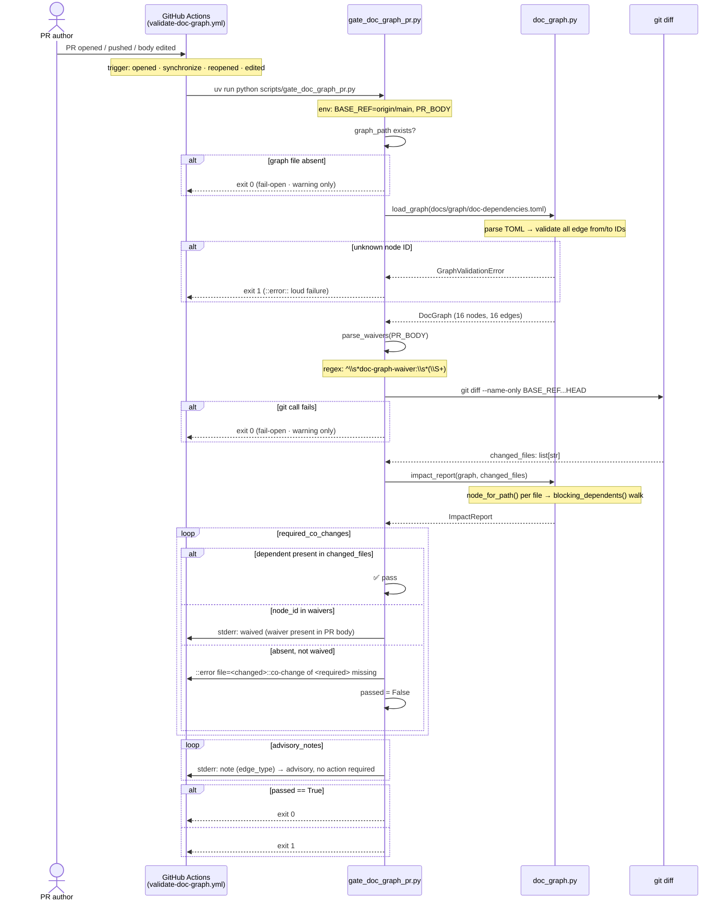
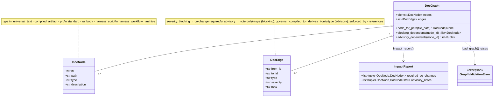

# Document Dependency Graph Governance Gap Analysis

English | [日本語](./doc-dependency-graph-governance.gap.ja.md)

> Status: read-only UML design record (review artifact). Origin issue is #1754
> (typed document dependency graph to enforce co-change gates). It captures
> the governance gap exposed by PR #1737 (master.instructions.md updated
> standalone without touching the 6 PRDs it governs), the graph model that
> closes it, and the residual gaps the advisory gate does not yet close.

This document models the document governance gap before and after PR #1755,
using three lenses: the before/after dependency enforcement map (where the
gap lived), the CI gate sequence (how the fix runs on every PR), and the
graph data model (what is declared and what the gate reasons over). A gap
table is derived from all three.

- Evidence tags: `[fact]` is observed in-tree (file:line cited); `[analysis]`
  is a judgement about a gap.

## Before / after enforcement map

`[fact]` Before PR #1755, only one machine-enforced dependency edge existed:
`master.instructions.md` → `design_philosophy_prd`, enforced by
`scan_design_philosophy_drift.py verify-coupling`
(`scan_design_philosophy_drift.py:437-470`). All other relationships between
`master.instructions.md` and the PRDs it governs relied on reviewer memory.

```mermaid
graph TD
    subgraph BEFORE["Before PR #1755 -- enforced edges: 1"]
        direction TB
        MI_B["master.instructions.md"]
        DP_B["design_philosophy_prd ✅ blocking\n(scan_design_philosophy_drift)"]
        NA_B["non_ascii_prd ❌ memory only"]
        SC_B["security_control_inventory ❌ memory only"]
        IP_B["issue_pr_body_standard ❌ memory only"]
        WQ_B["workflow_script_quality ❌ memory only"]
        MI_B -->|"verify-coupling\n1 semantic edge"| DP_B
        MI_B -. "reviewer memory\n(PR #1737 missed)" .-> NA_B
        MI_B -. "reviewer memory" .-> SC_B
        MI_B -. "reviewer memory" .-> IP_B
        MI_B -. "reviewer memory" .-> WQ_B
    end

    subgraph AFTER["After PR #1755 -- blocking edges: 8 + advisory edges: 8"]
        direction TB
        MI_A["master.instructions.md"]
        DP_A["design_philosophy_prd\n🔴 governs · blocking"]
        NA_A["non_ascii_prd\n🔴 governs · blocking"]
        SC_A["security_control_inventory\n🔴 governs · blocking"]
        IP_A["issue_pr_body_standard\n🔴 governs · blocking"]
        WQ_A["workflow_script_quality\n🔴 governs · blocking"]
        DD_A["doc_dependency_prd\n🔴 governs · blocking"]
        CL_A["claude_md\n🔴 compiled_to · blocking"]
        AG_A["agents_md\n🔴 compiled_to · blocking"]
        MI_A --> DP_A
        MI_A --> NA_A
        MI_A --> SC_A
        MI_A --> IP_A
        MI_A --> WQ_A
        MI_A --> DD_A
        MI_A --> CL_A
        MI_A --> AG_A
    end
```

`[fact]` The two gates are complementary, not substitutes:
`scan_design_philosophy_drift.py verify-coupling` provides semantic depth (label
match, vocabulary alignment) for one edge; `gate_doc_graph_pr.py` provides
breadth (file co-change check) across all TOML-declared edges.

## CI gate sequence

`[fact]` The gate fails open (`exit 0`) in two cases: (a) the TOML graph file
does not exist (`gate_doc_graph_pr.py:163-169`), (b) `git diff` returns a
non-zero exit code (`gate_doc_graph_pr.py:83-90`). It fails loud (`exit 1`)
only for (c) a graph validation error and (d) a missing, non-waived blocking
dependent.

`[fact]` The `edited` event type was added by commit `9f1a23b` in response to a
Codex review on PR #1755, ensuring the gate reruns when a `doc-graph-waiver:`
line is added or removed from the PR body without a code push.

## Graph data model

`[fact]` Graph declaration lives in `docs/graph/doc-dependencies.toml`,
CODEOWNERS-protected by `.github/CODEOWNERS`. New edges are code-reviewed as
TOML diffs, making every governance relationship machine-readable and
change-auditable.

## Gap analysis

| # | Gap `[analysis]` | Evidence `[fact]` (file:line) | Tracking |
|---|---|---|---|
| 1 | Single-producer gap (before): only `master_instructions` → `design_philosophy_prd` was machine-enforced; all other governs/compiled_to edges depended on reviewer memory. PR #1737 merged `master.instructions.md` without touching 5 governed PRDs. | `scan_design_philosophy_drift.py:437-470` (one coupling); PR #1737 merge commit. | #1754 |
| 2 | TOML graph is the single source of truth for declared dependencies, but edges not yet declared in the TOML are invisible to the gate. Relationships outside the current 16 edges still rely on reviewer memory. | `docs/graph/doc-dependencies.toml` (16 edges at PR #1755). | #1754 |
| 3 | Gate is advisory in Phase 1 (`continue-on-error: true`): a genuine missing co-change is annotated but cannot block merge until promoted to a required check in `.github/rulesets/main.json`. Promotion is gated on FP rate < 5% for 2 consecutive sprints. | `validate-doc-graph.yml:28`; `docs/prd/doc-dependency-graph.md` section 6.4. | #1754 |
| 4 | `compiled_to` edges (`master_instructions` → `claude_md`, `agents_md`) are blocking in the graph but the compile drift is already enforced by a separate required gate (`scan_design_philosophy_drift.py verify-apm-drift`). Declared here for completeness; no double-failure risk because `compile_to` severity can be set to advisory when Phase 2 promotes the gate. | `docs/graph/doc-dependencies.toml:[[edges]]` compiled_to entries; `gate_doc_graph_pr.py:107-117`. | #1754 |
| 5 | Waiver audit trail lives only in the PR body text. A waiver applied by one PR does not persist as a recognized exception for subsequent PRs touching the same node pair. Each PR that intends to skip a blocking co-change must carry its own waiver line. | `gate_doc_graph_pr.py:59-67` (per-invocation parse); no cross-PR waiver store. | #1754 |

## Recommended direction (speculation)

- `[analysis]` Gap 2: grow the graph incrementally via code-reviewed TOML
  diffs; each new relationship is a 2-line addition (`[[edges]]` block). The
  CODEOWNERS protection makes every expansion a deliberate governance decision.
- `[analysis]` Gap 3: promote blocking edges to a required check once FP rate
  is observed below 5% across two sprints; the promotion step is a one-line
  addition to `.github/rulesets/main.json`.
- `[analysis]` Gap 5: if waiver audit trail becomes important, persist waivers
  in a separate TOML file (e.g. `docs/graph/waivers.toml`) behind CODEOWNERS,
  making them durable across PRs and visible as reviewed diffs.

## Scope note

`[fact]` This UML record covers the `gate_doc_graph_pr.py` breadth gate only.
The semantic depth gate (`scan_design_philosophy_drift.py verify-coupling`)
remains active as a complementary control and is out of scope here; its own
gap analysis would be a separate UML artifact.
