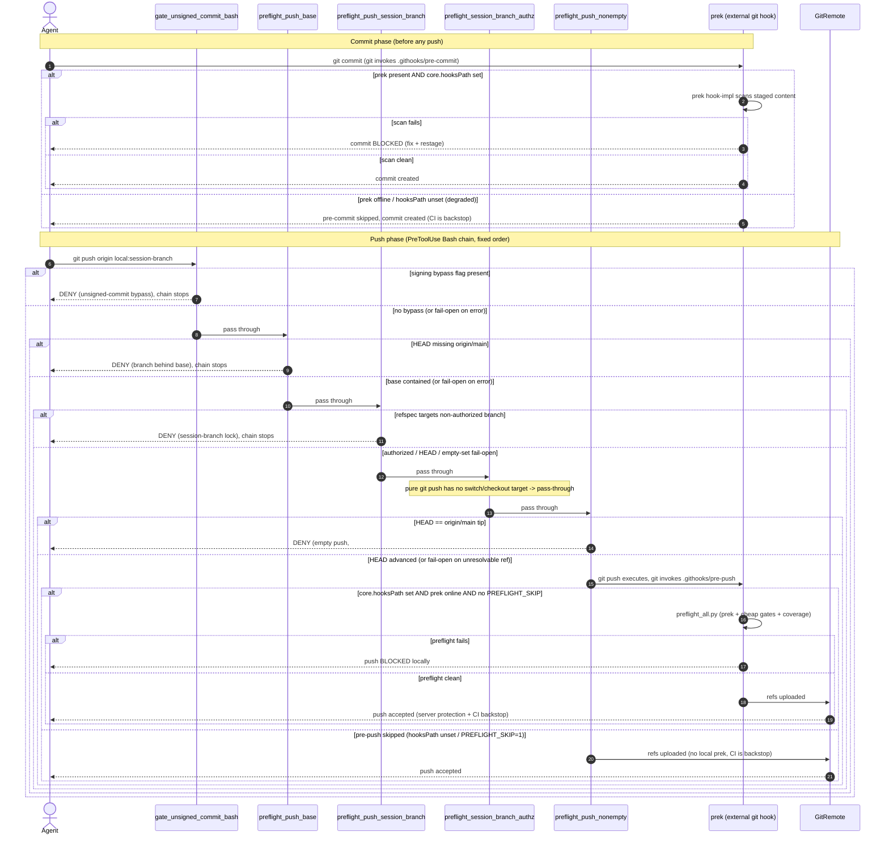

# git push PreToolUse ゲートチェーン

[English](./git-push-gate-chain.sequence.md) | 日本語

> ステータス: 読み取り専用の UML 設計記録（レビュー用成果物）。起点となる Issue は
> #2341（FTA/FMEA の事前準備）。本図は未署名コミットガード (#1713)、ベース鮮度ゲート
> (#856, #1854)、セッションブランチロック (#785, #1513)、認可の左シフト (#1658,
> #1632)、空プッシュゲート (#1130)、prek pre-push 拡張 (#901)、prek オフライン時の
> degraded path (#1931 の repair 1 と 4) を横断する。

本ドキュメントは、1つのリモート実行セッション内で `git push` が通過する決定論的な
ゲートチェーンをモデル化する。ここでシーケンス図が適切なのは、欠陥クラスが
*独立プロセス間の順序と透過* だからである。各ゲートは同一の PreToolUse イベントを
読む独立した Python プロセスであり、ハーネスは `agent_hooks_source.json` に記録された
固定順で評価し、外部の `prek` ランナーは完全に別の git-hook サーフェスに存在する。
FTA/FMEA にとって重要なのは、どのゲートが最初に deny するか、どのゲートが fail-open
するか（＝バグが押しをそのまま次層へ透過させるか）、そしてローカルチェーンが通した
ものを CI バックストップがどこで捕捉するか、である。

- 証拠タグ: `[fact]` はツリー内で観測された事実（file:line を引用）、`[analysis]` は
  ギャップに関する判断である。

## ゲートの配置

`[fact]` 5つのプッシュゲートはすべて `scripts/agent_hooks_source.json` の claude
ターゲットの `Bash` matcher にバインドされた PreToolUse フックであり、配列順で発火する
（生成される `.claude/settings.json` がその順序を保存する）:

| 順 | ゲート | 登録位置 | トリガ時の判定 | 内部エラー時 |
|---|---|---|---|---|
| 1 | `gate_unsigned_commit_bash.py` | `agent_hooks_source.json:508` | `git -c commit.gpgsign=false` / `--no-gpg-sign` バイパスを deny (`:200-204`) | stdin 境界で fail-open (`:66-67`) |
| 2 | `preflight_push_base.py` | `agent_hooks_source.json:528` | ブランチが `origin/main` より遅れていれば deny (`:64-76`) | サブプロセスエラー時 fail-open (`:60-62`) |
| 3 | `preflight_push_session_branch.py` | `agent_hooks_source.json:538` | refspec が非認可ブランチを指すプッシュを deny (`:157-167`) | エラー / 空集合 / refspec 無し時 fail-open (`:145-151`) |
| 4 | `preflight_session_branch_authz.py` | `agent_hooks_source.json:578` | 非認可ブランチへの `git switch/checkout` を deny (`:239-246`)。純粋な `git push` は透過 | 非リモート / 空集合時 fail-open (`:240-241`, `:273`) |
| 5 | `preflight_push_nonempty.py` | `agent_hooks_source.json:635` | `HEAD == origin/main` 先端時に deny (`:94-104`) | 解決不能 ref / delete / dry-run 時 fail-open (`:84-90`) |
| ext | `prek`（`.githooks/pre-commit` + `.githooks/pre-push` 経由） | `.githooks/pre-commit`, `.githooks/pre-push:66` | pre-commit: ステージ内容がスキャンに失敗する `git commit` をブロック。pre-push: `preflight_all.py` が prek を再実行 | prek / `core.hooksPath` が無ければ透過。CI がバックストップ |

`[fact]` ゲートは呼び出しチェーンではなく独立プロセスである。唯一
`preflight_push_base.py` のみが `preflight_branch_base.py verify` に委譲する
(`preflight_push_base.py:51-59`)。ゲート 3 と 4 は 1 つの信頼源
`_session_branches.read_authorized_set`（`.git/CLAUDE_SESSION_BRANCH` 上）を共有する
(`preflight_push_session_branch.py:34,68-69`;
`preflight_session_branch_authz.py:59,97-98`) ため、空または読取不能なセッション
ブランチファイルは両者を独立にではなく *同時に* fail-open させる。

`[fact]` `scripts/preflight_push_prek.py` は PreToolUse prek ゲートを実装している
(`:73-85`) が、`agent_hooks_source.json` に登録されていない（出現回数ゼロ）。実際に
走る push 時 prek は外部の `.githooks/pre-push` -> `scripts/preflight_all.py` パスのみ
であり、そのフックはクローンに `git config core.hooksPath .githooks` が設定されている
場合にのみ発火する（`.githooks/pre-push` の有効化注記）。

## プッシュゲートチェーン

`[fact]` deny に至る各ゲートは `permissionDecision: "deny"` ペイロードを返し、これが
単一の `Bash` ツールコールをブロックするため `git push` コマンドは実行されない。
エージェントはその 1 ゲートの是正テキストを受け取る。プッシュは 1 つのアトミックな
ツールコールであるため、最初の deny がそのコールにとって終端となる
(`preflight_push_base.py:64`, `preflight_push_session_branch.py:157`,
`preflight_push_nonempty.py:94`)。

`[analysis]` 「最初の deny でチェーンが停止する」はエージェント視点では真である。
どのゲートかが deny した時点でガード対象の操作（プッシュ）は走らない。ハーネスが後続
フック *プロセス* をなお実行してその判定を収集するか否かはツリー内で観測できない
ハーネス内部の詳細であり、結果を変えない。最も制限的な判定（deny）が勝ち、コマンドは
いずれにせよブロックされるからである。

`[fact]` prek オフライン時の degraded path は retro #1931 に文書化されている。repair 1
は `scan_repo_double_hyphen` 違反が CI に到達したことを記録する（「prek が最初のプッシュ
前にローカルで走らなかった」＝ pre-commit スキャンが走らなかった）。repair 4 は根本原因を
記録する（「git プロキシは `tvna/claude-md` のみにスコープされ
`https://github.com/pre-commit/pre-commit-hooks` をブロックする」）。これは
external/human decision（プロキシ許可リスト）に分類されている。`install-prek.sh` 自体も
設計上 fail-open である（`install-prek.sh` ヘッダ:「uv 欠如やインストール失敗は ... exit 0
... CI の `Run prek` ステップがバックストップ」）。

## ギャップ分析

| # | ギャップ `[analysis]` | 証拠 `[fact]`（file:line） | 追跡 |
|---|---|---|---|
| 1 | 5 ゲートすべてを実行時に同時無効化する真の単一障害点は存在しない（独立プロセスのため）。ただし相関 fail-open のペアは存在する。ゲート 3 と 4 は共に唯一の `.git/CLAUDE_SESSION_BRANCH` 集合を読むため、空/読取不能ファイルは同一瞬間に両者を fail-open させ、2 つの防御層を 1 イベントに縮退させる。 | `preflight_push_session_branch.py:68-69,145-146`; `preflight_session_branch_authz.py:97-98,240-241`。 | #785, #1513 |
| 2 | ジェネレータ/配線が SPOF に最も近い。`agent_hooks_source.json`（または生成後の `.claude/settings.json`）が Bash チェーンを欠落・並替すると、すべてのプッシュゲートが実行時シグナル無しで一斉に配線解除される。チェーンの存在はその 1 つの生成ファイルに依存する。 | `agent_hooks_source.json:508,528,538,578,635`（ゲートごと単一登録箇所）。 | open |
| 3 | prek オフラインは fail-closed ではなく透過である。プロキシが pre-commit-hooks のダウンロードをブロックする（または `core.hooksPath` 未設定）と、ローカル内容スキャン（`scan_repo_double_hyphen`, `end-of-file-fixer` 等）は単に走らず、commit/push は進行する。唯一のバックストップは CI（`portable-pr-policy.yml` の `Run prek`）と、有効時の pre-push パス上の `preflight_all.py` である。 | retro #1931 repair 1（スキャンが CI に到達）; `install-prek.sh` fail-open ヘッダ; `.githooks/pre-push:38-42`（`PREFLIGHT_SKIP=1` は prek ステップのみをスキップ）。 | #1931 |
| 4 | 設計された PreToolUse prek ゲートは死んだ配線である。`preflight_push_prek.py` は存在し、`core.hooksPath` を欠く web セッションで汚れたプッシュを deny するはずだが、`agent_hooks_source.json` に登録されておらず、意図された web セッションバックストップは決して発火しない。push 時 prek は外部 `.githooks/pre-push` に完全依存し、それはクローンごとの `core.hooksPath` 設定を要する。 | `preflight_push_prek.py:73-85`（実装済）; `agent_hooks_source.json` に `preflight_push_prek.py` の出現ゼロ; `.githooks/pre-push` 有効化注記。 | #901 |
| 5 | すべてのプッシュゲートは内部エラー時に fail-open するため、静かに壊れたゲートはプッシュを次層へ、最終的にサーバへ透過させる。fail-open 後の正しさはサーバ側ブランチ保護 + CI（`preflight_all.py` が同じ cheap tier を CI で走らせる）に依存する。ローカルチェーンは advisory-with-backstop であり、権威ではない。 | fail-open: `gate_unsigned_commit_bash.py:66-67`, `preflight_push_base.py:60-62`, `preflight_push_session_branch.py:145-146`, `preflight_push_nonempty.py:89-90`。 | #785 |
| 6 | ゲート 4（`preflight_session_branch_authz`）は純粋な `git push` に対して不活性である。その Bash サーフェスは `git switch`/`git checkout` ターゲットのみを解決するため、push コマンドでは常に透過する。push パスへのカバレッジは push 時ではなくセッション早期の Edit/Write サーフェス経由に限られる。図はこれを明示するため透過ノードとして示す。 | `preflight_session_branch_authz.py:239-246`（`_decide_bash` は switch/checkout ターゲットのみ反復）; `:281-285`。 | #1658 |

## スコープ注記

`[fact]` ローカルゲートは advisory-with-backstop であり、各々が CI および/または
サーバ側保護を真のガードとして名指す（`preflight_push_session_branch.py:18`;
`install-prek.sh` fail-open ヘッダ）。`[analysis]` したがってここでモデル化した
ゲートチェーンは CI の高速・順序付き・ローカルなミラー（CI 失敗になりうるものを
実行可能な pre-push deny に変換する）であって権威ではない。fail-open や配線解除された
チェーンは「後で CI が捕捉する」に degrade するのであって、「非正規プッシュが無検査で
着地する」には決してならない。サーバ側ブランチ保護が依然としてそれを拒否するからである。
