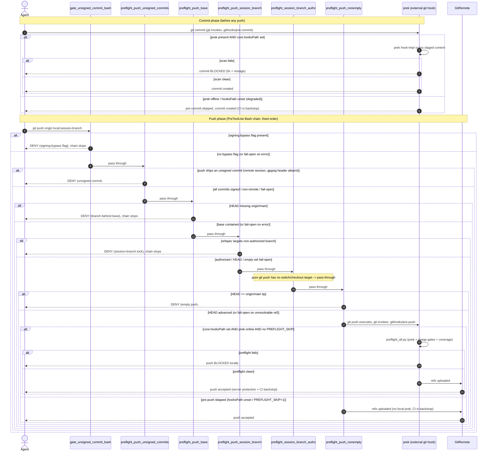

# git push PreToolUse gate chain

English | [日本語](./git-push-gate-chain.sequence.ja.md)

> Status: read-only UML design record (review artifact). Origin issue is #2341
> (FTA/FMEA prep). It crosses the unsigned-commit guards (#1713 the bypass-flag
> gate, #2138 the unsigned-commit push gate), the base-currency gate (#856,
> #1854), the session-branch lock (#785, #1513), the authz left-shift (#1658,
> #1632), the empty-push gate (#1130), the prek pre-push extension (#901), and
> the prek-offline degraded path (#1931 repairs 1 and 4).

This document models the deterministic gate chain a `git push` traverses inside
one remote execution session. A sequence diagram is the right lens here because
the defect class is *ordering and pass-through across independent processes*:
each gate is its own Python process reading the same PreToolUse event, the
harness evaluates them in the fixed order recorded in `agent_hooks_source.json`,
and the external `prek` runner sits on a separate git-hook surface entirely.
What matters for FTA/FMEA is which gate denies first, which gates fail open (so
a bug transparently passes the push through to the next layer), and where the CI
backstop catches what the local chain let through.

- Evidence tags: `[fact]` is observed in-tree (file:line cited); `[analysis]`
  is a judgement about a gap.

## Where the gates sit

`[fact]` All six push gates are PreToolUse hooks bound to the `Bash` matcher in
the claude target of `scripts/agent_hooks_source.json`, and they fire in array
order (the generated `.claude/settings.json` preserves that order):

| Order | Gate | Registration | Decision on trigger | On internal error |
|---|---|---|---|---|
| 1 | `gate_unsigned_commit_bash.py` | `agent_hooks_source.json:508` | deny a `git -c commit.gpgsign=false` / `--no-gpg-sign` bypass flag (`:200-204`) | fail-open at stdin boundary (`:66-67`) |
| 2 | `preflight_push_unsigned_commits.py` | `agent_hooks_source.json:518` | deny a push that ships a commit with no `gpgsig` header, by raw `git cat-file` (NOT `git verify-commit`); remote-session only (`:359-363`, `:305-322`) | fail-open wide: non-remote, unparseable, unresolvable sha, empty range, git error (`:69-73`, `:331-343`) |
| 3 | `preflight_push_base.py` | `agent_hooks_source.json:528` | deny when the branch is behind `origin/main` (`:64-76`) | fail-open on subprocess error (`:60-62`) |
| 4 | `preflight_push_session_branch.py` | `agent_hooks_source.json:538` | deny a push whose refspec targets a non-authorized branch (`:157-167`) | fail-open on error / empty set / no refspec (`:145-151`) |
| 5 | `preflight_session_branch_authz.py` | `agent_hooks_source.json:578` | deny a `git switch/checkout` onto an unauthorized branch (`:239-246`); a pure `git push` passes through | fail-open non-remote / empty set (`:240-241`, `:273`) |
| 6 | `preflight_push_nonempty.py` | `agent_hooks_source.json:635` | deny when `HEAD == origin/main` tip (`:94-104`) | fail-open on unresolvable ref / delete / dry-run (`:84-90`) |
| ext | `prek` via `.githooks/pre-commit` + `.githooks/pre-push` | `.githooks/pre-commit`, `.githooks/pre-push:66` | pre-commit: block a `git commit` whose staged content fails a scan; pre-push: `preflight_all.py` re-runs prek | transparent when prek / `core.hooksPath` is absent; CI backstop |

`[fact]` Gates 1 and 2 are complementary halves of the unsigned-commit category,
not duplicates (`preflight_push_unsigned_commits.py:8-28`): gate 1 blocks a
command that *disables* signing for an invocation, while gate 2 catches a commit
that lands unsigned for any other reason (the Codex worktree that carries no
signing key, #2138) by inspecting the raw `gpgsig` header presence. Gate 2 uses
header-presence rather than `git verify-commit` precisely because this remote
worktree has no `gpg.ssh.allowedSignersFile`, so verification would false-fail on
every legitimately-signed commit (`preflight_push_unsigned_commits.py:51-64`) --
the same reason the server-side ruleset is the authenticity backstop.

`[fact]` The gates are independent processes, not a call chain: only
`preflight_push_base.py` delegates onward, to `preflight_branch_base.py verify`
(`preflight_push_base.py:51-59`). Gates 4 and 5 share one source of truth,
`_session_branches.read_authorized_set` over `.git/CLAUDE_SESSION_BRANCH`
(`preflight_push_session_branch.py:34,68-69`; `preflight_session_branch_authz.py:59,97-98`),
so an empty or unreadable session-branch file fails BOTH open together, not
independently.

`[fact]` `scripts/preflight_push_prek.py` implements a PreToolUse prek gate
(`:73-85`) but it is NOT registered in `agent_hooks_source.json` (zero
occurrences); the only push-time prek that actually runs is the external
`.githooks/pre-push` -> `scripts/preflight_all.py` path, and that hook fires only
when the clone has `git config core.hooksPath .githooks` set (`.githooks/pre-push`
activation note).

## The push gate chain

`[fact]` Every gate that reaches a deny returns a `permissionDecision: "deny"`
payload, which blocks the single `Bash` tool call so the `git push` command
never executes; the agent receives that one gate's remediation text. Because the
push is one atomic tool call, the first deny is terminal for that call
(`preflight_push_unsigned_commits.py:359-363`, `preflight_push_base.py:64`,
`preflight_push_session_branch.py:157`, `preflight_push_nonempty.py:94`).

`[analysis]` "Chain stops on first deny" is true from the agent's vantage: the
guarded operation (the push) does not run once any gate denies. Whether the
harness still executes the later hook *processes* to collect their decisions is a
harness-internal detail not observable in-tree; it does not change the outcome,
because the most-restrictive decision (deny) wins and the command is blocked
regardless.

`[fact]` The prek-offline degraded path is documented by retro #1931: repair 1
records that `scan_repo_double_hyphen` violations reached CI because "prek was
not run locally before the first push" (the pre-commit scans did not run), and
repair 4 records the root cause: "the git proxy is scoped to `tvna/claude-md`
only and blocks `https://github.com/pre-commit/pre-commit-hooks`", classified as
an external/human decision (proxy allowlist). `install-prek.sh` itself fails open
by design (`install-prek.sh` header: "a missing uv or a failed install ... exits
0 ... CI's `Run prek` step is the backstop").

## Gap analysis

| # | Gap `[analysis]` | Evidence `[fact]` (file:line) | Tracking |
|---|---|---|---|
| 1 | No true single point of failure disables all six gates at runtime: they are independent processes. But there IS a correlated fail-open pair - gates 4 and 5 both read the one `.git/CLAUDE_SESSION_BRANCH` set, so an empty/unreadable file fails both open in the same instant, collapsing two defense layers to one event. | `preflight_push_session_branch.py:68-69,145-146`; `preflight_session_branch_authz.py:97-98,240-241`. | #785, #1513 |
| 2 | The generator/wiring is the closest thing to a SPOF: if `agent_hooks_source.json` (or the compiled `.claude/settings.json`) drops or reorders the Bash chain, every push gate is silently unwired at once, with no runtime signal. The chain's existence rests on that one generated file. | `agent_hooks_source.json:508,518,528,538,578,635` (single registration site per gate). | open |
| 3 | prek offline is transparent, not fail-closed: when the proxy blocks the pre-commit-hooks download (or `core.hooksPath` is unset), the local content scans (`scan_repo_double_hyphen`, `end-of-file-fixer`, ...) simply do not run and the commit/push proceeds. The only backstop is CI (`portable-pr-policy.yml` `Run prek`) and `preflight_all.py` on the pre-push path when enabled. | retro #1931 repair 1 (scans reached CI); `install-prek.sh` fail-open header; `.githooks/pre-push:38-42` (`PREFLIGHT_SKIP=1` skips only the prek step). | #1931 |
| 4 | The designed PreToolUse prek gate is dead wiring: `preflight_push_prek.py` exists and would deny a dirty push in web sessions lacking `core.hooksPath`, but it is not registered in `agent_hooks_source.json`, so that intended web-session backstop never fires. prek at push depends entirely on the external `.githooks/pre-push`, which needs `core.hooksPath` set per clone. | `preflight_push_prek.py:73-85` (implemented); zero occurrences of `preflight_push_prek.py` in `agent_hooks_source.json`; `.githooks/pre-push` activation note. | #901 |
| 5 | Every push gate fails open on internal error, so a silently broken gate passes the push through to the next layer and ultimately to the server. Correctness after a fail-open rests on server-side branch protection plus CI (`preflight_all.py` runs the same cheap tier in CI). The local chain is advisory-with-backstop, not authoritative. | fail-open at `gate_unsigned_commit_bash.py:66-67`, `preflight_push_unsigned_commits.py:69-73`, `preflight_push_base.py:60-62`, `preflight_push_session_branch.py:145-146`, `preflight_push_nonempty.py:89-90`. | #785 |
| 6 | Gate 5 (`preflight_session_branch_authz`) is inert on a pure `git push`: its Bash surface only resolves `git switch`/`git checkout` targets, so on a push command it always passes through. Its coverage of the push path is entirely via its Edit/Write surface earlier in the session, not at push time; the diagram shows it as a pass-through node to make that explicit. | `preflight_session_branch_authz.py:239-246` (`_decide_bash` iterates only switch/checkout targets); `:281-285`. | #1658 |
| 7 | Gate 2 (`preflight_push_unsigned_commits`) is remote-session-only and fails open on any non-remote session or unresolvable range, so an unsigned commit pushed from a non-remote environment, or one whose range cannot be resolved, is caught only by the server-side `required_signatures` ruleset at merge time, not before the push. | `preflight_push_unsigned_commits.py:331-343` (remote-only + wide fail-open); `:59-64` (server ruleset is the authenticity backstop). | #2138 |

## Scope note

`[fact]` The local gates are advisory-with-backstop: each names CI and/or
server-side protection as the real guard (`preflight_push_session_branch.py:18`;
`preflight_push_unsigned_commits.py:59-64`; `install-prek.sh` fail-open header).
`[analysis]` So the gate chain modeled here is a fast, ordered, local mirror of
CI - it converts a would-be CI failure into an actionable pre-push deny - but it
is not the authority: a fail-open or an unwired chain degrades to "CI catches it
later", never to "the illegitimate push lands unchecked", because server-side
branch protection and the signed-commit ruleset still reject it.
