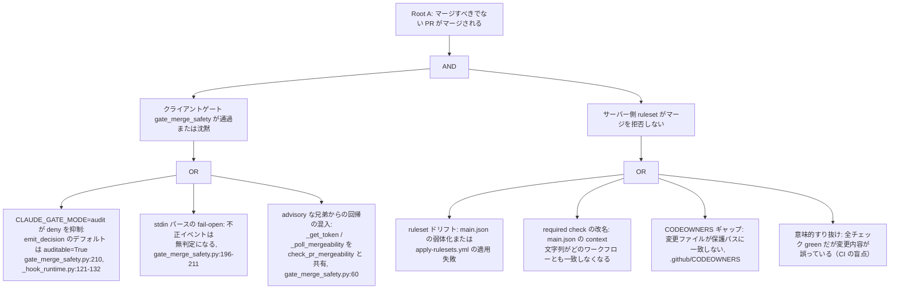
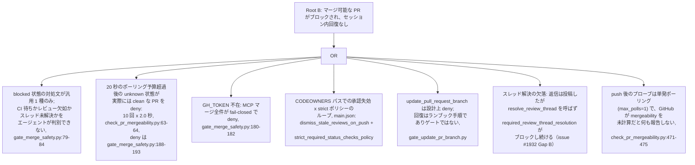
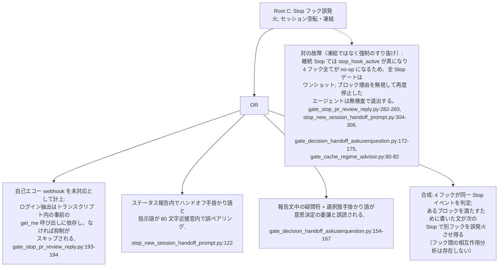
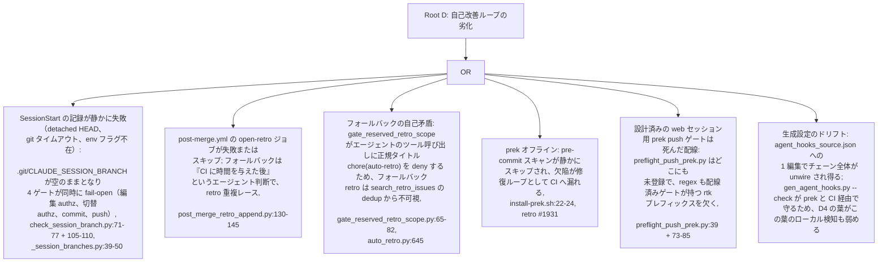

# フック/ゲート FTA-FMEA ギャップ分析

[English](./hook-gate-fta-fmea.gap.md) | 日本語

> ステータス: 読み取り専用の UML 設計記録（レビュー成果物）。起点 issue は #2341
> （FTA/FMEA 準備; 本記録が前提とする 2 本の準備シーケンス図は PR #2343 で出荷済み）。
> Stop フックの自己エコー修正（#1932）、blocked 状態のサブ条件診断要求（#1945）、
> push 後の mergeability プローブ（#1946）、セッションブランチロック群
> （#785, #1513, #1658）、prek 劣化パス（#901, #1931）、audit モードランタイム
> （#1005 系）と交差する。

本書は `scripts/agent_hooks_source.json` に配線されたフック/ゲートアーキテクチャに
対して故障の木解析（FTA）と故障モード影響解析（FMEA）を適用する。4 本の故障の木が
最悪の頂上事象（不当なマージ、マージのライブロック、Stop フックによる凍結、
自己改善ループの劣化）をコード引用付きの葉原因まで分解し、続く FMEA テーブルが
主要ゲートの故障モードを Severity x Detection で採点する。fail-open は独立した
故障ではなく Detection の劣化要因として扱う方針を採る: ローカルチェーンは設計上
advisory-with-backstop であり（`preflight_push_session_branch.py:18`）、
ローカルの穴とバックストップの穴が同時に揃う組合せのみを故障として数える。

- 証拠タグ: `[fact]` はツリー内で観測（file:line 引用）; `[analysis]` は
  ギャップに関する判断。
- 尺度: Severity 1-5（5 = 不当マージまたは回復不能な作業喪失、4 = セッション
  凍結・空転、3 = 手動の回復手段があるライブロック、2 = 摩擦・無駄な修復ループ、
  1 = ノイズ）。Detection 1-5（1 = サーバー側または CI 層が必ず捕捉、3 =
  オペレーターかエージェントが気づいた場合のみ捕捉、5 = どの層でも観測不能）。
  Occurrence は数値化せず、O 列に観測実績を定性記載する。

## 分析入力

`[fact]` 既知入力として用いた 5 つの先行 UML 記録:
`branch-local-remote.state.md`（Gap 1-10）、
`doc-dependency-graph-governance.gap.md`（Gap 1-5）、
`git-push-gate-chain.sequence.md`（Gap 1-7）、
`pr-body-fix-loop.sequence.md`（Gap 1-5）、および生成済み配線
`.claude/settings.json`（ソース: `scripts/agent_hooks_source.json`）。
分析ブリーフに記載の 2 つの成果物はツリー内に存在しない
（`survey-followup-timing.sequence.md`;
`gate_handoff_retro_survey_askuserquestion.py`）。実際の Stop フック群は
`gate_decision_handoff_askuserquestion.py`、`stop_new_session_handoff_prompt.py`、
`gate_cache_regime_advisor.py`、`gate_stop_pr_review_reply.py` である
（`agent_hooks_source.json:867-900`）。

## Root A: マージすべきでない PR がマージされる

`[analysis]` Root A は AND 事象: クライアント側マージゲートが通過（または沈黙）し、
かつサーバー側 ruleset が拒否に失敗する必要がある。クライアント側の脚は docstring の
主張より弱く、サーバー側の脚が真の床である。

`[fact]` `gate_merge_safety.py` は自らを fail-closed と文書化し
（`gate_merge_safety.py:31-42`）、トークン欠如・API 失敗・非 clean 状態で deny する。
しかし `main()` は判定を `emit_decision(decide(*split), _SCRIPT)` で出力しており
`auditable=False` がない（`gate_merge_safety.py:210`）。
`_hook_runtime.emit_decision` は `CLAUDE_GATE_MODE=audit` 設定時、`auditable` が
デフォルトの `True` のままの blocking 判定を stderr 警告へ降格する
（`_hook_runtime.py:110-132`）。push ゲート 6 本はすべて `auditable=False` を渡す
（`preflight_push_base.py:82`、`preflight_push_session_branch.py:172`、
`preflight_push_nonempty.py:109`、`gate_unsigned_commit_bash.py:225`、
`preflight_session_branch_authz.py:292`、`preflight_push_unsigned_commits.py:368`）
ため環境変数では無効化できない。fail-closed 設計の唯一のゲートであるマージゲート
だけが audit モードで沈黙可能である。`[fact]` audit モードを導入した設計 issue
#1280 は `update-pr-branch` と decision-handoff Stop ゲートを auditable な
ガバナンスゲートとして明示的に分類しており、これらのデフォルト `True` は欠落では
なく意図的な決定である; `gate_merge_safety`（#1563）はその分類より後に作られ、
docstring が fail-closed を宣言しているにもかかわらず `auditable=False` リストに
追加されなかった。欠落はそこにある。

`[analysis]` 非 clean な PR はクライアントゲートと無関係にサーバー側で拒否される
（権威はフックではなく ruleset）ため AND 構造は保たれる。よって A1a 単独では
Root A は成立せず、2 層のうち 1 層を除去するに留まり、Root A の成立にはさらに
いずれかの A2 葉が必要である。最も価値の高い修正は安価で、キーワード引数 1 つで
済む。ツール面の外側の経路（人間による GitHub UI マージ）は定義上エージェント
ハーネスのスコープ外。

## Root B: マージ可能な PR がブロックされたままセッション内で回復できない

`[analysis]` Root B は OR 事象: どれか 1 つの葉で、PR を終端状態へ運ぼうとする
セッションをライブロックさせるのに十分である。

`[fact]` ポーリング予算は advisory な PostToolUse パス向けに設計された
（`check_pr_mergeability.py:29-33`: 「ここでの失敗が block してはならない」）。
`gate_merge_safety.py` は `_poll_mergeability` を無変更で import し
（`gate_merge_safety.py:60`）、そのタイムアウトを fail-closed の deny に変換する:
10 回のポーリング後も `mergeable` が null なら poller は最後のデータを返し、
`mergeable is True` が不成立となり、`_deny_for_state` が `unknown` で発火する
（`gate_merge_safety.py:93-96`）。`[analysis]` よって B2 は安全等級をまたぐ
コード共有が持ち込んだ一時的 false-deny である: advisory ヘルパーのチューニングが、
予算の再検討なしに fail-closed ゲートのタイムアウトになった。リトライで自然回復する
（GitHub が計算を終える）ため Severity は抑えられるが、対処文は「しばらくして
再確認せよ」と言うだけでゲート自身がタイムアウトしたことを伝えず、混乱コストは
残る。

## Root C: Stop フックが誤発火してセッションが空転・凍結する

`[fact]` 4 つの Stop フックは claude ターゲットのみに登録されている
（`agent_hooks_source.json:867-900`）; codex と devin の設定には Stop ブロック自体が
存在せず、各 docstring がこの非対称を意図的と宣言している
（`gate_stop_pr_review_reply.py:22-26`）。`[fact]` #1932 の修正は、
トランスクリプト内に先行する `mcp__github__get_me` の結果が存在する場合のみ
自己エコー webhook を抑制する; なければ `_extract_session_login` は `None` を返し
「既存のブロック挙動側へ fail-open」して抑制はスキップされる
（`gate_stop_pr_review_reply.py:174-224`）。`[analysis]` つまり #1932 の欠陥は
狭められただけで閉じてはいない: `get_me` を一度も呼ばずにレビューコメントへ返信した
セッションは、依然として自分自身のエコーでブロックされる。無限再ブロックを防ぐ
`stop_hook_active` フラグは同時に強制を 1 巡に制限しており、凍結リスクと
すり抜けリスクは 1 つの機構の表裏である。4 フックの合成を本記録以前にモデル化した
記録は存在しない。

## Root D: 自己改善ループが劣化する

`[fact]` 左シフトゲート（#1658）はセッションブランチ述語を Edit/Write 面へ
拡張したが、全コンシューマは依然として同一ファイルと同一 env 変数を読み、
同じ空集合で fail-open する
（`preflight_session_branch_authz.py:240-242` と `:260-262`;
`preflight_push_session_branch.py:144-146`;
`preflight_commit_session_branch.py` の docstring）。`[analysis]`
`git-push-gate-chain.sequence.md` Gap 1 が 2 層と数えた相関 fail-open ペアは、
自身も fail-open する 1 つのファイル書き込み（`check_session_branch.py:105-110`
はあらゆる例外で exit 0）の上で 4 層が同時崩壊する構造になった。記録ゲートは
依然として「まだセッション未記録」と「セッション途中で記録喪失」を区別できず、
これは `branch-local-remote.state.md` が既に推奨した分割である。

`[fact]` `preflight_push_nonempty.py` は codex ターゲットに二重登録されている
（`agent_hooks_source.json` に重複エントリがあり、`.codex/hooks.json` にも同一
フックが 2 つ描画される）; 実行時は無害（2 回目の呼び出しも同じ判定に至る）だが、
ソースの重複登録を lint するものが何もない証拠である。

## FMEA テーブル

`[analysis]` 上記の尺度で採点し、SxD がリスク順位を与える。行は故障の木が
根拠づけた故障モードで、SxD 降順。

| ID | ゲート/フック | 故障モード | 原因 `[fact]` | 影響 | S | D | SxD | O メモ | 追跡 |
|---|---|---|---|---|---|---|---|---|---|
| F1 | `gate_merge_safety.py` | fail-closed の deny が audit モードで沈黙 | `emit_decision` のデフォルト `auditable=True`（`gate_merge_safety.py:210`; `_hook_runtime.py:110-132`） | push ゲートは保護されたままクライアント側マージ層だけが消える; Root A の脚 A1a | 5 | 4 | 20 | 未観測; #1563 に先行する #1280 audit ランタイム以降の潜在 | #2403 |
| F2 | `gate_merge_safety.py` | advisory な兄弟からの回帰混入 | `_get_token` / `_poll_mergeability` の共有（`gate_merge_safety.py:60`） | advisory パス向けの変更が fail-closed ゲートを静かに再調整する | 4 | 4 | 16 | 未観測; 構造的 | #2404 |
| F3 | Stop 合成 | 4 フックが 1 つの Stop を判定; 強制はワンショット | 4 フック全ての `stop_hook_active` no-op（`gate_stop_pr_review_reply.py:282-283` ほか） | ブロックのラリーによる空転、または再 Stop での無検査退出 | 3 | 4 | 12 | ラリー未観測; すり抜けは設計上観測不能 | #2405 |
| F4 | `gate_stop_pr_review_reply.py` | トランスクリプトに `get_me` がない場合の自己エコーブロック | 抑制は事前の `get_me` 結果に依存（`:193-194`） | 自分の返信エコーでセッションが空転 | 4 | 3 | 12 | #1932 が修正前の形を観測 | #1932（残余; #2405） |
| F5 | Stop フック群 | codex/devin に不在 | claude 専用登録（`agent_hooks_source.json:867-900`） | レビュー返信・ハンドオフ強制が 3 エージェント中 1 つにしか存在しない | 3 | 4 | 12 | 設計判断; Stop はパリティスキャン対象外 | 設計判断; 本記録に記載 |
| F6 | `post-merge.yml` open-retro | retro ジョブ失敗; フォールバックのレースと不可視化 | フォールバックはエージェント判断（`post_merge_retro_append.py:130-145`）; 正規タイトルはエージェントに deny（`gate_reserved_retro_scope.py:65-82`） | 監査台帳の欠落、重複または発見不能な retro | 3 | 4 | 12 | 未観測; フォールバック経路は未検証 | #2407 |
| F7 | `agent_hooks_source.json` | 配線 SPOF: 1 編集でチェーンが unwire | ゲートごとに登録箇所が単一; `gen_agent_hooks.py --check` が prek/CI で防御 | CI まで push ゲート全てが静かに消える | 4 | 3 | 12 | 未観測 | git-push-gate-chain Gap 2（open） |
| F8 | セッションブランチ群 | 4 ゲートにまたがる共通原因 fail-open | 1 ファイル + 1 env 変数、全コンシューマが空集合で fail-open（`_session_branches.py:39-50`; D1 の葉） | サーバー 403 まで無許可作業が進行; やり直しコスト | 3 | 3 | 9 | #1658 のニアミス（commit 時の形） | #785, #1513（#2406 が拡張） |
| F9 | `post_pr_create_body_fix.py` | 修正ループにサイクル上限なし | 収束は PostToolUse マッチャーのスコープに依存（`post_pr_create_body_fix.py:70,211`） | マッチャー 1 行の変更でループが無限化 | 3 | 4 | 12 | 未観測; 潜在 | pr-body-fix-loop Gap 1/5（open） |
| F10 | `preflight_push_prek.py` | 死んだ配線; regex も rtk プレフィックスを欠く | 登録ゼロ; `:39` の `_GIT_PUSH_RE` と配線済みゲートの `(?:rtk\s+)?` の差 | 意図された web セッション用バックストップが発火しない | 2 | 4 | 8 | #1931 が同種の帰結を観測 | #901 |
| F11 | Stop フック（4 つ全て） | Stop ブロックが audit で抑制可能 | 4 フック全てで `emit_decision` のデフォルト `auditable=True` | audit モードが Stop 強制も無効化する | 2 | 4 | 8 | 未観測; #1280 は decision-handoff を意図的に auditable と分類; 後発のレビュー返信ゲートは記録された決定なしにデフォルトを継承 | オペレーター判断（#2403 スコープ） |
| F12 | `gate_update_pr_branch.py` | deny が audit で抑制可能 | `auditable=False` のない `emit_decision`（`:70`） | サーバー側マージコミットがブランチ履歴を汚染 | 2 | 4 | 8 | 未観測; #1280 で意図的（"update-pr-branch" を auditable と明記） | #1280 の設計判断 |
| F13 | `check_pr_mergeability.py` | 20 秒のポーリングタイムアウトが fail-closed の `unknown` deny になる | `_MAX_POLLS=10`, `_POLL_INTERVAL_SECONDS=2.0`（`:63-64`）をマージゲートが再利用 | clean な PR の一時的 false-deny; Root B の葉 B2 | 3 | 2 | 6 | 大型 PR で起こり得る; 未起票 | #2404 |
| F14 | body-fix ループ | 命じられた update がターン境界で中断 | update は別のツール呼び出しで、どの Stop フックも確認しない | CI の body-policy まで破損ボディが残存 | 2 | 3 | 6 | pr-body-fix-loop Gap 3 | open |
| F15 | prek チェーン | オフラインでスキャンが静かにスキップ | プロキシによるダウンロード遮断; `install-prek.sh:22-24` の fail-open | 欠陥が CI へ漏れ修復ループ化 | 2 | 2 | 4 | #1931 で観測 | #1931 |
| F16 | `preflight_push_session_branch.py` | refspec なしの素の `git push` が通過 | `:148-150` の fail-open | トランスポート 403 が唯一のガード; 診断性が低い | 2 | 2 | 4 | 未観測 | #785 スコープ |
| F17 | `gate_merge_safety.py` | GH_TOKEN 不在で全マージ deny | `:180-182` | トークン供給まで大きく明示的に停止 | 3 | 1 | 3 | 意図された姿勢 | 文書化済み |
| F18 | codex 設定 | `preflight_push_nonempty` の二重登録 | codex ターゲットに 2 エントリ | 無害な二重実行; ソース衛生のシグナル | 1 | 2 | 2 | 本分析で観測 | #2408（tracking） |

## ギャップ分析

| # | ギャップ `[analysis]` | 証拠 `[fact]`（file:line） | 追跡 |
|---|---|---|---|
| 1 | audit モードのギャップ: fail-closed 設計の唯一のゲート（`gate_merge_safety`, #1563）が、`emit_decision` の `auditable` をデフォルト `True` のままにしているため `CLAUDE_GATE_MODE=audit` で抑制可能。同ゲートは安全境界ゲート全てに `auditable=False` を割り当てた #1280 の設計パスより後に作られ、fail-closed の docstring を持ちながらそのリストに追加されなかった。（#1280 は `update-pr-branch` と decision-handoff を意図的に auditable と分類しており、それらのデフォルトは設計判断; 後発の Stop レビュー返信ゲートは記録された決定なしにデフォルトを継承。）抑制は stderr 警告のみで、エージェントの意思決定フローからは不可視。 | `gate_merge_safety.py:210`; `_hook_runtime.py:110-132`; issue #1280 本文（auditable/非 auditable リスト）; 対照は `preflight_push_base.py:82` ほか | #2403 |
| 2 | 共有コードによる安全等級の横断: fail-closed のマージゲートが advisory な poller のトークン取得と 20 秒ポーリング予算を無変更で import している; advisory 側のチューニング変更が黙ってマージゲートを再調整し、現行予算は既に GitHub の遅い mergeability 計算を fail-closed の `unknown` deny に変換する。対処文はゲート自身のタイムアウトに言及しない。 | `gate_merge_safety.py:60`; `check_pr_mergeability.py:29-33,63-64`; `gate_merge_safety.py:93-96,188-193` | #2404（#1945 を補完） |
| 3 | Stop フック合成が未モデル化で、強制がワンショット: 4 フックが同一 Stop イベントを独立に判定し、あるブロックを満たすために出力した文が次の Stop で兄弟フックを誤発火させ得る。継続 Stop では `stop_hook_active` により 4 フック全てが no-op になるため、非準拠のまま再停止すれば無検査で退出する。#1932 のエコー抑制もトランスクリプト内の事前 `get_me` 呼び出しの存在に条件づけられている。 | `agent_hooks_source.json:867-900`; 4 フック各所の `stop_hook_active` 判定; `gate_stop_pr_review_reply.py:193-194` | #2405 |
| 4 | セッションブランチの共通原因集合が 2 ゲートから 4 ゲートへ拡大（編集 authz と切替 authz が commit と push に合流）し、全てが 1 つの静かに書かれるファイルの空で fail-open する。書き手は依然「セッション未記録」と「セッション途中の記録喪失」を区別できない。 | `check_session_branch.py:71-77,105-110`; `_session_branches.py:39-50`; `preflight_session_branch_authz.py:240-242,260-262` | #2406（#785, #1513 を拡張） |
| 5 | retro フォールバック経路が自己矛盾かつ無監視: `post_merge_retro_append` は CI の open-retro ジョブ失敗時にフォールバック retro の作成を指示するが、`gate_reserved_retro_scope` はエージェントのツール呼び出しに正規タイトルを deny するため、指示に従ったフォールバック retro は `search_retro_issues` の dedup から不可視になる; そして open-retro ジョブ自体の成否を監視するゲートがない。 | `post_merge_retro_append.py:130-145`; `gate_reserved_retro_scope.py:65-82`; `auto_retro.py:645`; `post-merge.yml:30-60` | #2407 |
| 6 | UML の fact ドリフトにゲートがない: PR #2347 が `docs/graph/` を `.gitapex/` へ移動した後も、4 つの UML 記録が旧パスを `[fact]` として引用し続けた; UML 文書のファイル引用と引用先ファイルを結びつけるものが存在しない（doc グラフは instruction/PRD エッジを扱い、UML 証拠エッジは扱わない）。既知の 4 ファイルは本 PR で修正済み; クラスとしては未解決。 | 本 PR の diff; `.gitapex/doc-dependencies.toml`（UML ノードなし）; PR #2347 | #2408（tracking） |
| 7 | 分析ブリーフのドリフト自体が改善ループの故障モード: 本記録を依頼したブリーフは存在しない 2 つの成果物と作成されなかった 1 つのブランチを名指ししており、成果物に固定されないセッション間の手渡しコンテキストが劣化する証拠である。 | 不在の `survey-followup-timing.sequence.md`; 不在の `gate_handoff_retro_survey_askuserquestion.py`; 不在のブランチ `claude/fta-fmea-gap-analysis-w9wguw` | #2408（tracking） |

## 推奨方向（speculation）

- `[analysis]` ギャップ 1 は 1 行の修正（`gate_merge_safety` に
  `auditable=False` を渡し、実装を fail-closed の docstring と #1280 の
  安全境界リストに整合させる）、加えて audit モードがマージ deny を
  沈黙させられないことを主張する回帰テスト。Stop レビュー返信ゲートも
  オプトアウトすべきかは、推測ではなく記録すべきオペレーター判断。
  テーブル中最高の SxD であり、最初に着手すべき。
- `[analysis]` ギャップ 2: マージゲートに固有のポーリング予算（または識別可能な
  `poll-timeout` deny 理由）を与え、import しているヘルパーの契約を固定する
  テストを追加して、advisory 側の再調整が安全等級を静かに越えられないようにする。
- `[analysis]` ギャップ 3: 4 フックの合成を一度モデル化し（本記録の Root C が
  出発点）、フックを単一ディスパッチャの背後に直列化するか、共有の
  「このターンは既にブロック済み」マーカーを加えて Stop ごとに高々 1 つの
  ブロック理由だけがエージェントへ届くようにする; ワンショット強制を許容するか
  どうかも明示的に決める。
- `[analysis]` ギャップ 4: `branch-local-remote.state.md` が既に推奨した
  「未記録 vs 記録喪失」の分割を実装する; セッション途中の記録喪失は fail-closed
  または再記録をトリガーすべきで、未記録セッションでも保護ブランチには push
  できないことを回帰テストで主張する。
- `[analysis]` ギャップ 5: フォールバック retro に、`search_retro_issues` も
  認識する公認の非予約タイトル形状を与え、直近マージの open-retro ジョブが実際に
  issue を生成したかを確認するマージ後チェック（次セッション開始時または
  スケジュールジョブ）を追加する。

## スコープ注記

`[fact]` ローカルゲートは advisory-with-backstop のまま: サーバー側ブランチ保護
（`.github/rulesets/main.json`: deletion、non-fast-forward、linear history、
required signatures、PR ルール、strict ポリシー下の必須チェック 7 本）と CI が、
ローカルチェーンが写像する権威である（`preflight_push_session_branch.py:18`）。
`[analysis]` したがって本記録は大半のローカル故障を直接損失ではなく Detection の
劣化として採点する; 例外であり FMEA の上位を占める理由は、ローカル層こそが
設計上の権威である 2 箇所である: fail-closed のマージゲート（F1, F2）と、
どのサーバーからも見えない Stop フック強制（F3-F5）。issue 書き込み系ゲートの
内部（`gate_issue_*`）、汎用 Bash 安全ゲート（`block_sensitive_reads`、
`gate_irreversible_bash`）、doc グラフゲート（独自の記録で分析済み）は本書の
スコープ外。
