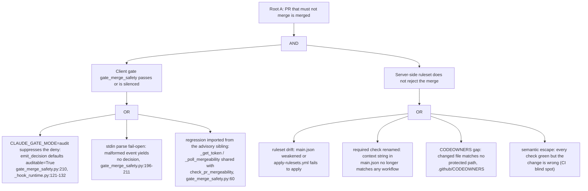
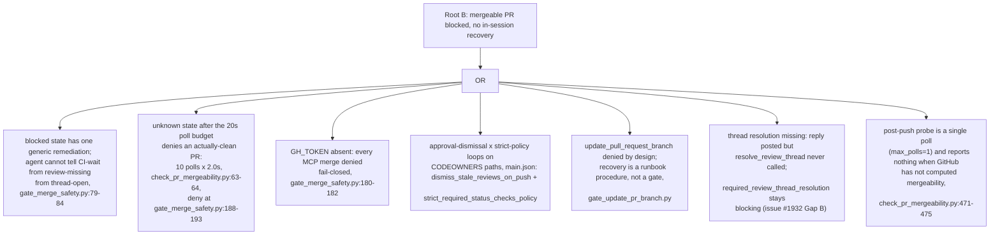
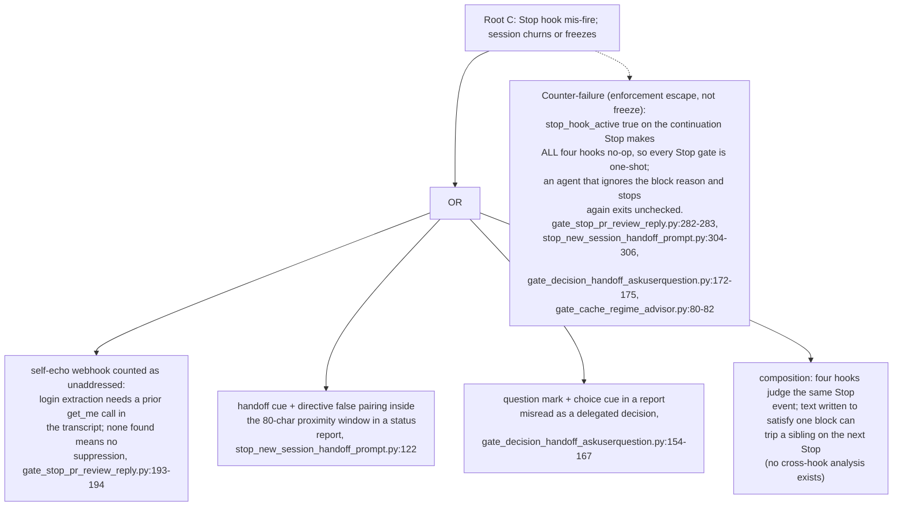
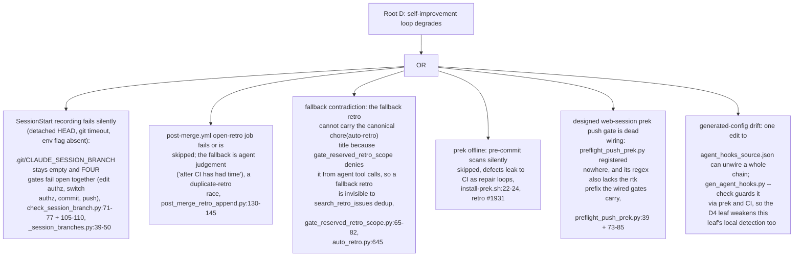

# Hook/Gate FTA-FMEA Gap Analysis

English | [日本語](./hook-gate-fta-fmea.gap.ja.md)

> Status: read-only UML design record (review artifact). Origin issue is #2341
> (FTA/FMEA prep; PR #2343 shipped the two prep sequence diagrams this record
> builds on). It crosses the Stop-hook self-echo fix (#1932), the blocked-state
> sub-condition diagnosis request (#1945), the post-push mergeability probe
> (#1946), the session-branch lock family (#785, #1513, #1658), the prek
> degraded path (#901, #1931), and the audit-mode runtime (#1005 family).

This document applies Fault Tree Analysis (FTA) and Failure Mode and Effects
Analysis (FMEA) to the hook/gate architecture wired in
`scripts/agent_hooks_source.json`. Four fault trees decompose the worst-case
top events (an undeserved merge, a merge livelock, a Stop-hook freeze, and a
degraded self-improvement loop) down to leaf causes cited from code; the FMEA
table then scores every major gate's failure modes on Severity x Detection.
The method deliberately treats fail-open as a Detection degrader, not a
standalone failure: the local chain is advisory-with-backstop by design
(`preflight_push_session_branch.py:18`), so a failure mode counts only when a
local hole and a backstop hole can align.

- Evidence tags: `[fact]` is observed in-tree (file:line cited); `[analysis]`
  is a judgement about a gap.
- Scales: Severity 1-5 (5 = undeserved merge or unrecoverable work loss,
  4 = session frozen or churning, 3 = livelock with a manual way out,
  2 = friction / wasted repair loop, 1 = noise). Detection 1-5 (1 = a
  server-side or CI layer always catches it, 3 = caught only if an operator
  or agent notices, 5 = no layer can observe it). Occurrence carries no
  numeric score; the O column records observed incidents qualitatively.

## Method inputs

`[fact]` The five prior UML records used as known inputs:
`branch-local-remote.state.md` (Gaps 1-10),
`doc-dependency-graph-governance.gap.md` (Gaps 1-5),
`git-push-gate-chain.sequence.md` (Gaps 1-7),
`pr-body-fix-loop.sequence.md` (Gaps 1-5), and the generated
`.claude/settings.json` wiring (source: `scripts/agent_hooks_source.json`).
Two documents named in the analysis brief do not exist in-tree
(`survey-followup-timing.sequence.md`;
`gate_handoff_retro_survey_askuserquestion.py`); the actual Stop-hook set is
`gate_decision_handoff_askuserquestion.py`, `stop_new_session_handoff_prompt.py`,
`gate_cache_regime_advisor.py`, `gate_stop_pr_review_reply.py`
(`agent_hooks_source.json:867-900`).

## Root A: a PR that must not merge is merged

`[analysis]` Root A is an AND event: the client merge gate must pass (or be
silenced) AND the server-side ruleset must fail to reject. The client leg is
weaker than its docstring claims; the server leg is the real floor.

`[fact]` `gate_merge_safety.py` documents itself as fail-closed
(`gate_merge_safety.py:31-42`) and denies on missing token, API failure, and
non-clean state. But its `main()` emits the decision through
`emit_decision(decide(*split), _SCRIPT)` with no `auditable=False`
(`gate_merge_safety.py:210`), and `_hook_runtime.emit_decision` downgrades any
blocking decision to a stderr warning when `CLAUDE_GATE_MODE=audit` is set and
`auditable` is left at its `True` default (`_hook_runtime.py:110-132`). All six
push gates pass `auditable=False` (`preflight_push_base.py:82`,
`preflight_push_session_branch.py:172`, `preflight_push_nonempty.py:109`,
`gate_unsigned_commit_bash.py:225`, `preflight_session_branch_authz.py:292`,
`preflight_push_unsigned_commits.py:368`), so the environment variable cannot
disable them; the merge gate, the one gate designed fail-closed, is the one
that audit mode can silence. `gate_update_pr_branch.py:70` shares the same
omission.

`[analysis]` The AND structure still holds because a non-clean PR is rejected
server-side regardless of the client gate (the ruleset, not the hook, is the
authority). So A1a alone does not produce Root A; it removes one of the two
layers, and Root A then needs any A2 leaf. The highest-value fix is cheap:
one keyword argument. Escalation paths outside the tool surface (a human
merging via the GitHub UI) are out of the agent-harness scope by definition.

## Root B: a mergeable PR stays blocked with no in-session recovery

`[analysis]` Root B is an OR event: any one leaf is enough to livelock a
session that is trying to drive a PR to its terminal state.

`[fact]` The poll budget was designed for the advisory PostToolUse path
(`check_pr_mergeability.py:29-33`: "a failure here must never block").
`gate_merge_safety.py` imports `_poll_mergeability` unchanged
(`gate_merge_safety.py:60`) and converts its timeout into a fail-closed deny:
after 10 polls with `mergeable` still null the poller returns the last data,
`mergeable is True` fails, and `_deny_for_state` fires with `unknown`
(`gate_merge_safety.py:93-96`). `[analysis]` B2 is therefore a transient
false-deny wired in by code sharing across safety classes: an advisory
helper's tuning became a fail-closed gate's timeout without review of the
budget. It self-heals on retry (GitHub finishes computing), which caps its
severity but not its confusion cost, since the remediation text tells the
agent to "re-check shortly" without saying the gate itself timed out.

## Root C: a Stop hook mis-fires and the session churns or freezes

`[fact]` All four Stop hooks are registered only in the claude target
(`agent_hooks_source.json:867-900`); the codex and devin configs carry no Stop
block at all, an asymmetry each docstring declares deliberate
(`gate_stop_pr_review_reply.py:22-26`). `[fact]` The #1932 fix suppresses
self-echo webhooks only when a `mcp__github__get_me` result exists earlier in
the transcript; `_extract_session_login` returns `None` otherwise and the
suppression is skipped "fail-open toward the existing block behaviour"
(`gate_stop_pr_review_reply.py:174-224`). `[analysis]` So the #1932 defect is
narrowed, not closed: a session that replies to review comments without ever
calling `get_me` still blocks on its own echo. The same `stop_hook_active`
flag that prevents an infinite re-block loop also bounds enforcement to one
round; the freeze risk and the escape risk are two faces of one mechanism, and
no record before this one had modeled the composition of the four hooks.

## Root D: the self-improvement loop degrades

`[fact]` The left-shift gate (#1658) extended the session-branch predicate to
Edit/Write surfaces, but every consumer still reads the same file and the same
env var and fails open on the same empty set
(`preflight_session_branch_authz.py:240-242` and `:260-262`;
`preflight_push_session_branch.py:144-146`;
`preflight_commit_session_branch.py` per its docstring). `[analysis]` The
correlated fail-open pair that `git-push-gate-chain.sequence.md` Gap 1 counted
as two layers is now four layers collapsing on one file write that itself
fails open (`check_session_branch.py:105-110` exits 0 on any exception). The
recording gate still cannot distinguish "no session recorded yet" from
"recorded set lost mid-session", the split `branch-local-remote.state.md`
already recommended.

`[fact]` `preflight_push_nonempty.py` is registered twice in the codex target
(duplicate entries in `agent_hooks_source.json`, rendered as two identical
hooks in `.codex/hooks.json`); harmless at runtime (the second invocation
reaches the same verdict) but evidence that nothing lints the source for
duplicate registrations.

## FMEA table

`[analysis]` Scored per the scales above; SxD ranks the risk. Rows are the
failure modes the fault trees ground, ordered by SxD.

| ID | Gate / hook | Failure mode | Cause `[fact]` | Effect | S | D | SxD | O memo | Tracking |
|---|---|---|---|---|---|---|---|---|---|
| F1 | `gate_merge_safety.py` | fail-closed deny silenced by audit mode | `emit_decision` default `auditable=True` (`gate_merge_safety.py:210`; `_hook_runtime.py:110-132`) | client merge layer vanishes while push gates stay protected; Root A leg A1a | 5 | 4 | 20 | not observed; latent since #1005 runtime | new (draft 1) |
| F2 | `gate_merge_safety.py` | regression imported from advisory sibling | shared `_get_token` / `_poll_mergeability` (`gate_merge_safety.py:60`) | a change tuned for the advisory path silently retunes the fail-closed gate | 4 | 4 | 16 | not observed; structural | new (draft 2) |
| F3 | Stop composition | four hooks judge one Stop; one-shot enforcement | `stop_hook_active` no-op in all four (`gate_stop_pr_review_reply.py:282-283` et al.) | block-rally churn, or unchecked exit on the retry Stop | 3 | 4 | 12 | rally not observed; escape unobservable by design | new (draft 3) |
| F4 | `gate_stop_pr_review_reply.py` | self-echo block when no `get_me` in transcript | suppression requires prior `get_me` result (`:193-194`) | session churns on its own reply echo | 4 | 3 | 12 | #1932 observed the pre-fix form | #1932 (residual; draft 3) |
| F5 | Stop hooks | absent on codex/devin | claude-only registration (`agent_hooks_source.json:867-900`) | review-reply and handoff enforcement exist for one agent of three | 3 | 4 | 12 | by design; Stop outside parity scan scope | design decision; recorded here |
| F6 | `post-merge.yml` open-retro | retro job fails; fallback race and invisible fallback | fallback is agent judgement (`post_merge_retro_append.py:130-145`); canonical title denied to agents (`gate_reserved_retro_scope.py:65-82`) | audit ledger gap, duplicate or undiscoverable retro | 3 | 4 | 12 | not observed; fallback path untested | new (draft 5) |
| F7 | `agent_hooks_source.json` | wiring SPOF: chain unwired by one edit | single registration site per gate; guarded by `gen_agent_hooks.py --check` in prek/CI | all push gates silently gone until CI | 4 | 3 | 12 | not observed | git-push-gate-chain Gap 2 (open) |
| F8 | session-branch family | common-cause fail-open across FOUR gates | one file + one env var, all consumers fail open empty (`_session_branches.py:39-50`; D1 leaves) | unauthorized work proceeds until server 403; redo cost | 3 | 3 | 9 | #1658 near-miss (commit-time form) | #785, #1513 (draft 4 extends) |
| F9 | `post_pr_create_body_fix.py` | no cycle cap on the fix loop | convergence rests on PostToolUse matcher scoping (`post_pr_create_body_fix.py:70,211`) | one-line matcher change makes the loop unbounded | 3 | 4 | 12 | not observed; latent | pr-body-fix-loop Gap 1/5 (open) |
| F10 | `preflight_push_prek.py` | dead wiring; also regex lacks rtk prefix | zero registrations; `_GIT_PUSH_RE` at `:39` vs wired gates' `(?:rtk\s+)?` | intended web-session backstop never fires | 2 | 4 | 8 | #1931 shows the consequence class | #901 |
| F11 | Stop hooks (all four) | Stop blocks audit-suppressible | `emit_decision` default `auditable=True` in all four | audit mode also disables Stop enforcement | 2 | 4 | 8 | not observed | new (draft 1 scope) |
| F12 | `gate_update_pr_branch.py` | deny audit-suppressible | `emit_decision` without `auditable=False` (`:70`) | server-side merge commit pollutes branch history | 2 | 4 | 8 | not observed | new (draft 1 scope) |
| F13 | `check_pr_mergeability.py` | 20s poll timeout becomes fail-closed `unknown` deny | `_MAX_POLLS=10`, `_POLL_INTERVAL_SECONDS=2.0` (`:63-64`) reused by the merge gate | transient false-deny of a clean PR; Root B leaf B2 | 3 | 2 | 6 | plausible on large PRs; not filed | new (draft 2) |
| F14 | body-fix loop | mandated update interrupted at the turn boundary | update is a separate tool call; no Stop hook checks for it | corrupted body persists until CI body-policy | 2 | 3 | 6 | pr-body-fix-loop Gap 3 | open |
| F15 | prek chain | offline scans silently skipped | proxy-blocked download; `install-prek.sh:22-24` fail-open | defects leak to CI; repair loops | 2 | 2 | 4 | #1931 observed | #1931 |
| F16 | `preflight_push_session_branch.py` | bare `git push` (no refspec) passes | fail-open at `:148-150` | transport 403 is the only guard; poor diagnostics | 2 | 2 | 4 | not observed | #785 scope |
| F17 | `gate_merge_safety.py` | GH_TOKEN absent denies all merges | `:180-182` | loud, documented stall until token present | 3 | 1 | 3 | intended posture | documented |
| F18 | codex config | duplicate `preflight_push_nonempty` registration | two entries in the codex target | benign double-run; source hygiene signal | 1 | 2 | 2 | observed in this analysis | new (tracking) |

## Gap analysis

| # | Gap `[analysis]` | Evidence `[fact]` (file:line) | Tracking |
|---|---|---|---|
| 1 | Audit-mode asymmetry: the one gate designed fail-closed (`gate_merge_safety`) and the server-merge deny (`gate_update_pr_branch`) plus all four Stop blocks are suppressible by `CLAUDE_GATE_MODE=audit` because they leave `emit_decision`'s `auditable` at its `True` default, while every push/commit/session gate opts out with `auditable=False`. The suppression is a stderr warning, invisible to the agent's decision flow. | `gate_merge_safety.py:210`; `gate_update_pr_branch.py:70`; Stop hooks' `emit_decision` calls; `_hook_runtime.py:110-132`; contrast `preflight_push_base.py:82` et al. | issue draft 1 |
| 2 | Safety-class crossing via shared code: the fail-closed merge gate imports the advisory poller's token getter and 20-second poll budget unchanged; any tuning of the advisory sibling silently retunes the merge gate, and the budget already converts a slow GitHub mergeability computation into a fail-closed `unknown` deny whose remediation text does not say the gate timed out. | `gate_merge_safety.py:60`; `check_pr_mergeability.py:29-33,63-64`; `gate_merge_safety.py:93-96,188-193` | issue draft 2 (complements #1945) |
| 3 | Stop-hook composition is unmodeled and enforcement is one-shot: four hooks independently judge the same Stop event; text emitted to satisfy one block can trip a sibling on the next Stop, and `stop_hook_active` makes all four no-op on the continuation, so a non-compliant retry exits unchecked. The #1932 echo suppression is also conditional on a prior `get_me` call existing in the transcript. | `agent_hooks_source.json:867-900`; `stop_hook_active` checks in all four hooks; `gate_stop_pr_review_reply.py:193-194` | issue draft 3 |
| 4 | The session-branch common-cause set has grown from two to four gates (edit authz and switch authz joined commit and push) all failing open on one silently-writable file, and the writer still cannot distinguish "no session recorded" from "record lost mid-session". | `check_session_branch.py:71-77,105-110`; `_session_branches.py:39-50`; `preflight_session_branch_authz.py:240-242,260-262` | issue draft 4 (extends #785, #1513) |
| 5 | The retro fallback path is self-contradictory and unmonitored: `post_merge_retro_append` instructs the agent to create a fallback retro when CI's open-retro job fails, but `gate_reserved_retro_scope` denies the canonical title from agent tool calls, so a compliant fallback retro is invisible to `search_retro_issues` dedup; and no gate watches whether the open-retro job itself succeeded. | `post_merge_retro_append.py:130-145`; `gate_reserved_retro_scope.py:65-82`; `auto_retro.py:645`; `post-merge.yml:30-60` | issue draft 5 |
| 6 | UML fact drift has no gate: PR #2347 moved `docs/graph/` to `.gitapex/` and four UML records kept citing the old path as `[fact]` for months; nothing ties a UML document's file citations to the cited files (the doc graph covers instruction/PRD edges, not UML evidence edges). Fixed for the four known files in this PR; the class remains open. | this PR's diff; `.gitapex/doc-dependencies.toml` (no UML nodes); PR #2347 | tracking issue draft |
| 7 | Analysis-brief drift is itself a failure mode of the improvement loop: the brief that commissioned this record named two artifacts that do not exist and one branch that was never created, evidence that hand-carried context between sessions decays where no artifact pins it. | absent `survey-followup-timing.sequence.md`; absent `gate_handoff_retro_survey_askuserquestion.py`; absent branch `claude/fta-fmea-gap-analysis-w9wguw` | tracking issue draft |

## Recommended direction (speculation)

- `[analysis]` Gap 1 is a one-line-per-gate fix (`auditable=False` on
  `gate_merge_safety`, `gate_update_pr_branch`, and, after an operator
  decision on whether Stop enforcement is a safety boundary, the Stop hooks),
  plus a regression test asserting audit mode cannot silence a merge deny.
  Highest SxD in the table; do this first.
- `[analysis]` Gap 2: give the merge gate its own poll budget (or a
  distinguishable `poll-timeout` deny reason) and a test pinning the imported
  helpers' contract, so advisory retuning cannot silently cross the safety
  class.
- `[analysis]` Gap 3: model the four-hook composition once (this record's
  Root C is the start), then either serialize the hooks behind one
  dispatcher or add a shared "already blocked this turn" marker so at most
  one block reason reaches the agent per Stop; decide explicitly whether
  one-shot enforcement is acceptable.
- `[analysis]` Gap 4: implement the "no record vs lost record" split already
  recommended by `branch-local-remote.state.md`; a lost-mid-session record
  should fail closed or trigger re-record, and a regression should assert an
  unrecorded session still cannot push a protected branch.
- `[analysis]` Gap 5: give the fallback retro a sanctioned non-reserved title
  shape that `search_retro_issues` also recognizes, and add a post-merge
  check (next session start or a scheduled job) that the open-retro job for
  the last merge actually produced an issue.

## Scope note

`[fact]` The local gates remain advisory-with-backstop: server-side branch
protection (`.github/rulesets/main.json`: deletion, non-fast-forward, linear
history, required signatures, PR rules, 7 required checks under the strict
policy) and CI are the authority the local chain mirrors
(`preflight_push_session_branch.py:18`). `[analysis]` This record therefore
scores most local failures as Detection degraders rather than direct losses;
the exceptions, and the reason they top the FMEA, are the two places where
the local layer IS the designed authority: the fail-closed merge gate (F1,
F2) and the Stop-hook enforcement that no server can see (F3-F5). Issue-write
gate internals (`gate_issue_*`), generic Bash safety gates
(`block_sensitive_reads`, `gate_irreversible_bash`), and the doc-graph gate
(analyzed in its own record) are out of scope here.
