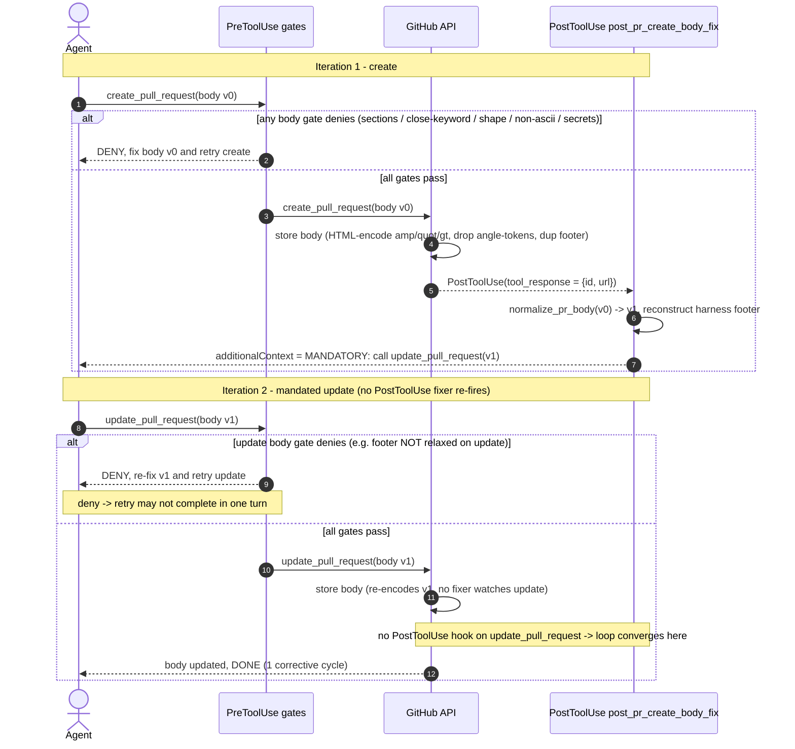

# PR body 修正ループ (create -> body-fix -> update)

[English](./pr-body-fix-loop.sequence.md) | 日本語

> ステータス: 読み取り専用の UML 設計記録（レビュー用成果物）。起点となる Issue は
> #2341（FTA/FMEA の事前準備）。本図は MCP body 破損の fixer (#892, #1361, #1427, #1441)、
> 必須セクションゲート (#382, #356)、close-keyword ゲート (#220, #222)、shape/footer
> ゲート (#1025, #1427)、そして fixer が調停する create-vs-update footer 非対称性を
> 横断する。

本ドキュメントは、`mcp__github__create_pull_request` が開くフィードバックループを
モデル化する。create コールが PreToolUse ゲート群を通過し、GitHub が破損した body を
保存し、PostToolUse フックが是正用の `update_pull_request` を指示し、その update が
（ほぼ）同じ PreToolUse ゲートを再通過する。ここでシーケンス図が適切なのは、欠陥クラスが
*明示的なサイクル上限を持たないループ* だからである。それを 1 反復に束縛している唯一の
ものは、fixer がどの PostToolUse matcher に登録されているかであって、カウンタではない。
FTA/FMEA にはその収束の論証を検査可能にすること、加えて指示された update が deny され
ターン境界をまたいで再試行される Stop-hook 割り込みケースが必要である。

- 証拠タグ: `[fact]` はツリー内で観測された事実（file:line を引用）、`[analysis]` は
  ギャップに関する判断である。

## ゲートの配置

`[fact]` create と update のコールは、`scripts/agent_hooks_source.json`（claude
ターゲット）にバインドされたほぼ同一の PreToolUse ゲート群を共有する。すべての PR-body
ゲートは合併 matcher `(create_pull_request|update_pull_request)` に対して登録されるため、
`update` は `create` と同一にゲートされ、ただし 1 つの意図的な非対称性（登録ではなく
挙動における）を持つ:

| ゲート | matcher スコープ | 登録位置 | create vs update |
|---|---|---|---|
| `preflight_non_ascii.py`, `preflight_github_secrets.py` | create+update (+他) | `agent_hooks_source.json:386,390` | 同一 |
| `preflight_angle_token_drop.py` | create+update (+他) | `agent_hooks_source.json:399` | 同一 |
| `preflight_branch_base.py` (verify) | create+update | (create/update PR ブロック) | 同一 |
| `pr_body_close_keyword_gate.py` | create+update | `agent_hooks_source.json:648` | 同一 |
| `preflight_pr_body_required_sections.py` | create+update | `agent_hooks_source.json:684` | 同一 (`:66-71`) |
| `preflight_pr_template_shape.py` | create+update | `agent_hooks_source.json:693` | footer は create のみ緩和 |

`[fact]` footer 非対称性が唯一の create-vs-update 差異である。
`preflight_pr_template_shape.py` は create パスで末尾のエージェント帰属 footer を緩和する
（web ハーネスが 1 つ自動付加する）が update では緩和しないため、単独の
`update_pull_request` はちょうど 1 つの footer を持たねばならない
(`preflight_pr_template_shape.py:57-77` ヘッダ)。これがまさに、fixer が update を指示する
前に footer を再構築する理由である。

`[fact]` ループの起点は `post_pr_create_body_fix.py` であり、
`mcp__github__create_pull_request` のみに登録された PostToolUse フックである
(`agent_hooks_source.json:790`; `post_pr_create_body_fix.py:70` の
`TARGET_TOOL = "mcp__github__create_pull_request"`、`:211` でガード)。これは MCP API 自体を
呼ばず、決定論的に正規化した body で `mcp__github__update_pull_request` を呼ぶよう指示する
`additionalContext` を発する (`:271-280`)。素の `mcp__github__update_pull_request` に
登録された PostToolUse フックは存在しない（唯一の `update_*` PostToolUse エントリは別ツール
`update_pull_request_branch` 用、`agent_hooks_source.json` PostToolUse ブロック）。

## body 修正ループ

`[fact]` fixer は authored body を持つ create に対して無条件で発火する。常に正規化 body で
`update_pull_request` を呼ぶ指示を発する（body/PR 番号を抽出できない場合は、欠陥があれば
検証して update せよという指示、`post_pr_create_body_fix.py:217-233`）。したがって body を
持つ create はちょうど 1 つの指示された update を生む。

`[fact]` ループが 1 反復で収束するのは `post_pr_create_body_fix.py` が
`update_pull_request` に登録されていないためである。指示された update は共有 PreToolUse
ゲートをトリガするが PostToolUse fixer はトリガしないため、2 回目の正規化・update 指示は
生成されない（`agent_hooks_source.json:790` matcher は `mcp__github__create_pull_request`
のみ）。

`[analysis]` したがって収束はサイクルカウンタではなく登録事実のみに依存する。もし
`post_pr_create_body_fix.py` が `update_pull_request` の PostToolUse matcher に追加された
場合、各 update は body を再破損させ（GitHub は書込ごとに再 HTML エンコードする）fixer を
再発火させ、無制限の create-then-update-forever ループを生む。fixer 内には、それが誘発
できる update コール数を上限する仕組みは無い。

## ギャップ分析

| # | ギャップ `[analysis]` | 証拠 `[fact]`（file:line） | 追跡 |
|---|---|---|---|
| 1 | サイクル上限ゲートは存在しない。1 反復の束縛は PostToolUse matcher のスコープ（`create_pull_request` のみ）に暗黙であり、明示的カウンタではない。これが収束の Single Point of Failure である。1 行の matcher 変更（`update_pull_request` 追加）が収束ループを無限ループに変える。すべての `update_pull_request` が body を再 HTML エンコードし fixer を再武装させるからである。 | `post_pr_create_body_fix.py:70,211`（`TARGET_TOOL` は create のみ）; `agent_hooks_source.json:790`（matcher `mcp__github__create_pull_request`）。 | open |
| 2 | 指示された `update_pull_request` は全 body ゲート群を再通過し、update では footer が緩和されない。`deny -> 再修正 -> 再試行` の 1 巡が 1 ターンで完了しないことがあり（例: 必須セクション欠落、または落ちた `<...>` トークンの言い換えが必要）、ターンが先に終われば PR は create 時の破損 body のまま残る。 | `preflight_pr_template_shape.py:57-77`（footer は create のみ緩和）; `preflight_pr_body_required_sections.py:127-135`（セクション欠落で deny）; `post_pr_create_body_fix.py:261-269`（落ちたトークン警告は手動言い換えを要する）。 | open |
| 3 | Stop-hook 割り込みリスク: 是正 update は create が返った後の *別* ツールコールであるため、指示された update が着地する前にターン境界で `Stop` フックが発火しうる。4 つの Stop フックのいずれも未処理の body-fix 指示を検査しないため、deny され未再試行の update はどの Stop ゲートのブロック対象でもない。 | Stop フックは `gate_decision_handoff_askuserquestion`, `stop_new_session_handoff_prompt`, `gate_cache_regime_advisor`, `gate_stop_pr_review_reply`（`agent_hooks_source.json` Stop ブロック）; いずれも PR-body 状態を検査しない。 | open |
| 4 | update_pull_request には PostToolUse 検証が無い。是正 update が body を保存した後、GitHub は v0 を破損させたのと同じ方法で v1 を再エンコードするが、update を監視する fixer が無いため、二次破損（例: 修正中にエージェントが追加した `&`）はクライアント側で決して捕捉されず、CI `verify-body-policy.yml` / angle-token サーバゲートのみが残る。 | `post_pr_create_body_fix.py:4-9`（create が body を破損）; `agent_hooks_source.json` に `update_pull_request` PostToolUse エントリ無し; angle-token 損失は回復不能 (`:14-18`)。 | open |
| 5 | fixer は明示的な update コール上限（例: PR 番号でキーした、PR あたり最大 1 回の指示発行）を持つべきである。そうすれば将来の matcher 変更や自己ループするエージェントであっても無制限の update を誘発できない。今日その束縛は登録の副作用であってガードされた不変条件ではない。まさに CLAUDE.md section 3 が求める「ゲートを作れ、記憶に頼るな」パターンである。 | `post_pr_create_body_fix.py:209-280`（`decide` は PR あたりのコール数状態を持たない）; 収束は `agent_hooks_source.json:790` のスコープに依存。 | open |

## スコープ注記

`[fact]` body ゲートはサーバゲートのクライアント側ミラーであり、各々が CI 対応物を権威と
して名指す（`preflight_pr_body_required_sections.py:98-105` は `verify-body-policy.yml` を、
`pr_body_close_keyword_gate.py:225-228` は `verify-issue-link.yml` を引用）。`[analysis]`
したがってここでモデル化したループはラウンドトリップを最適化する（`pull_request: edited`
の再トリガ嵐（retro #356）を単一のクライアント側正規化・update に変換する）が、サーバ側
body-policy ゲートがバックストップとして残る。是正 update がスキップまたは割り込まれても、
CI は依然として PR 上の破損 body を拒否する。単に遅いループを要するだけである。
