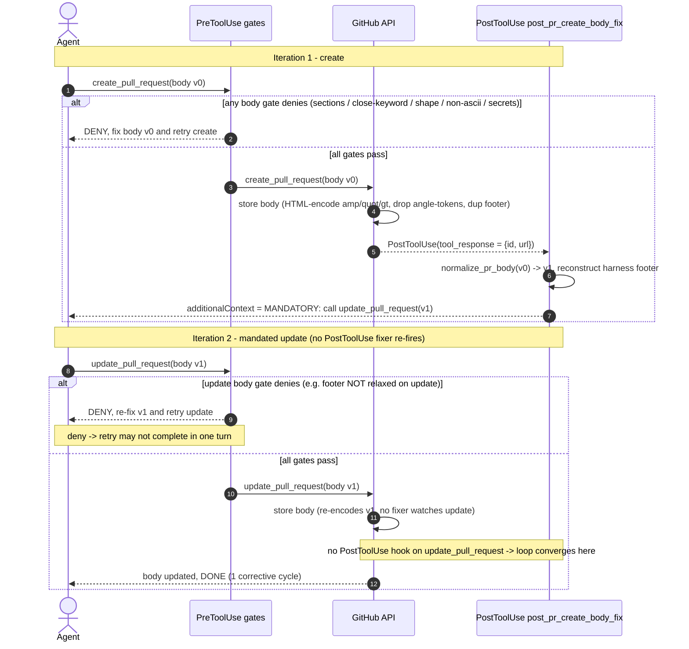

# PR body fix loop (create -> body-fix -> update)

English | [日本語](./pr-body-fix-loop.sequence.ja.md)

> Status: read-only UML design record (review artifact). Origin issue is #2341
> (FTA/FMEA prep). It crosses the MCP body-corruption fixer (#892, #1361,
> #1427, #1441), the required-section gate (#382, #356), the close-keyword gate
> (#220, #222), the shape/footer gate (#1025, #1427), and the create-vs-update
> footer asymmetry that the fixer reconciles.

This document models the feedback loop that `mcp__github__create_pull_request`
opens: the create call passes a PreToolUse gate set, GitHub stores a corrupted
body, a PostToolUse hook mandates a corrective `update_pull_request`, and that
update re-traverses (almost) the same PreToolUse gates. A sequence diagram is the
right lens because the defect class is *a loop with no explicit cycle cap*: the
only thing that bounds it to one iteration is which PostToolUse matcher the fixer
is registered under - not a counter. FTA/FMEA needs that convergence argument
made inspectable, plus the Stop-hook interruption case where the mandated update
is denied and retried across turn boundaries.

- Evidence tags: `[fact]` is observed in-tree (file:line cited); `[analysis]`
  is a judgement about a gap.

## Where the gates sit

`[fact]` The create and update calls share almost the same PreToolUse gate set,
bound in `scripts/agent_hooks_source.json` (claude target). Every PR-body gate is
registered against the union matcher `(create_pull_request|update_pull_request)`,
so an `update` is gated identically to a `create`, with ONE deliberate
asymmetry in behavior (not registration):

| Gate | Matcher scope | Registration | create vs update |
|---|---|---|---|
| `preflight_non_ascii.py`, `preflight_github_secrets.py` | create+update (+more) | `agent_hooks_source.json:386,390` | identical |
| `preflight_angle_token_drop.py` | create+update (+more) | `agent_hooks_source.json:399` | identical |
| `preflight_branch_base.py` (verify) | create+update | (create/update PR block) | identical |
| `pr_body_close_keyword_gate.py` | create+update | `agent_hooks_source.json:648` | identical |
| `preflight_pr_body_required_sections.py` | create+update | `agent_hooks_source.json:684` | identical (`:66-71`) |
| `preflight_pr_template_shape.py` | create+update | `agent_hooks_source.json:693` | footer relaxed on create only |

`[fact]` The footer asymmetry is the only create-vs-update difference:
`preflight_pr_template_shape.py` relaxes the trailing agent-attribution footer on
the create path (the web harness auto-appends one), but NOT on update, so a
standalone `update_pull_request` must carry exactly one footer
(`preflight_pr_template_shape.py:57-77` header). This is precisely why the fixer
reconstructs the footer before mandating the update.

`[fact]` The loop's origin is `post_pr_create_body_fix.py`, a PostToolUse hook
registered ONLY for `mcp__github__create_pull_request`
(`agent_hooks_source.json:790`; `TARGET_TOOL = "mcp__github__create_pull_request"`
at `post_pr_create_body_fix.py:70`, guarded at `:211`). It does not call the MCP
API itself; it emits `additionalContext` instructing the agent to call
`mcp__github__update_pull_request` with a deterministically normalized body
(`:271-280`). There is NO PostToolUse hook registered for plain
`mcp__github__update_pull_request` (the only `update_*` PostToolUse entry is for
`update_pull_request_branch`, a different tool, `agent_hooks_source.json` PostToolUse).

## The body-fix loop

`[fact]` The fixer fires unconditionally on a create that carried an authored
body: it always emits an instruction to call `update_pull_request` with the
normalized body (or, when the body/PR-number cannot be extracted, an instruction
to verify and update if any defect is present, `post_pr_create_body_fix.py:217-233`).
So a create with a body yields exactly one mandated update.

`[fact]` The loop converges in one iteration because
`post_pr_create_body_fix.py` is not registered on `update_pull_request`: the
mandated update triggers the shared PreToolUse gates but NO PostToolUse fixer, so
no second normalize-and-update instruction is generated
(`agent_hooks_source.json:790` matcher `mcp__github__create_pull_request` only).

`[analysis]` Convergence therefore rests entirely on a registration fact, not on
a cycle counter. If `post_pr_create_body_fix.py` were ever added to the
`update_pull_request` PostToolUse matcher, each update would re-corrupt the body
(GitHub re-HTML-encodes on every write) and re-fire the fixer, producing an
unbounded create-then-update-forever loop. Nothing in the fixer caps the number
of update calls it can provoke.

## Gap analysis

| # | Gap `[analysis]` | Evidence `[fact]` (file:line) | Tracking |
|---|---|---|---|
| 1 | No cycle-cap gate exists. The one-iteration bound is implicit in the PostToolUse matcher scoping (`create_pull_request` only), not an explicit counter. This is the Single Point of Failure for convergence: a one-line matcher change (adding `update_pull_request`) turns a convergent loop into an infinite one, because every `update_pull_request` re-HTML-encodes the body and would re-arm the fixer. | `post_pr_create_body_fix.py:70,211` (`TARGET_TOOL` create only); `agent_hooks_source.json:790` (matcher `mcp__github__create_pull_request`). | open |
| 2 | The mandated `update_pull_request` re-traverses the full body gate set, and on update the footer is NOT relaxed. A `deny -> re-fix -> retry` round may not finish in one turn (e.g. required section missing, or a dropped `<...>` token needs rephrasing), leaving the PR with the corrupted create-time body if the turn ends first. | `preflight_pr_template_shape.py:57-77` (footer relaxed create-only); `preflight_pr_body_required_sections.py:127-135` (deny on missing section); `post_pr_create_body_fix.py:261-269` (dropped-token warning requires manual rephrase). | open |
| 3 | Stop-hook interruption risk: the corrective update is a *separate* tool call after the create returned, so a `Stop` hook can fire at the turn boundary before the mandated update lands. None of the four Stop hooks checks for an outstanding body-fix instruction, so a denied-and-not-yet-retried update is not what any Stop gate blocks on. | Stop hooks are `gate_decision_handoff_askuserquestion`, `stop_new_session_handoff_prompt`, `gate_cache_regime_advisor`, `gate_stop_pr_review_reply` (`agent_hooks_source.json` Stop block); none inspects PR-body state. | open |
| 4 | update_pull_request has NO PostToolUse verification: after the corrective update stores its body, GitHub re-encodes v1 the same way it corrupted v0, but no fixer watches the update, so a second-order corruption (e.g. an `&` the agent added while fixing) is never caught client-side; only CI `verify-body-policy.yml` / the angle-token server gate remain. | `post_pr_create_body_fix.py:4-9` (create corrupts body); no `update_pull_request` PostToolUse entry in `agent_hooks_source.json`; angle-token loss is unrecoverable (`:14-18`). | open |
| 5 | The fixer should carry an explicit update-call ceiling (e.g. emit the instruction at most once per PR, keyed on PR number), so that even a future matcher change or an agent that loops on its own cannot provoke unbounded updates. Today the bound is a side effect of registration, not a guarded invariant - exactly the "build the gate, do not rely on memory" pattern CLAUDE.md section 3 calls for. | `post_pr_create_body_fix.py:209-280` (`decide` has no per-PR call-count state); convergence relies on `agent_hooks_source.json:790` scoping. | open |

## Scope note

`[fact]` The body gates are client-side mirrors of server gates: each names its
CI counterpart as the authority (`preflight_pr_body_required_sections.py:98-105`
cites `verify-body-policy.yml`; `pr_body_close_keyword_gate.py:225-228` cites
`verify-issue-link.yml`). `[analysis]` So the loop modeled here optimizes the
round-trip - it turns a `pull_request: edited` retrigger storm (retro #356) into
a single client-side normalize-and-update - but the server body-policy gates
remain the backstop: if the corrective update is skipped or interrupted, CI still
rejects the corrupted body on the PR, it just costs a slower loop.
