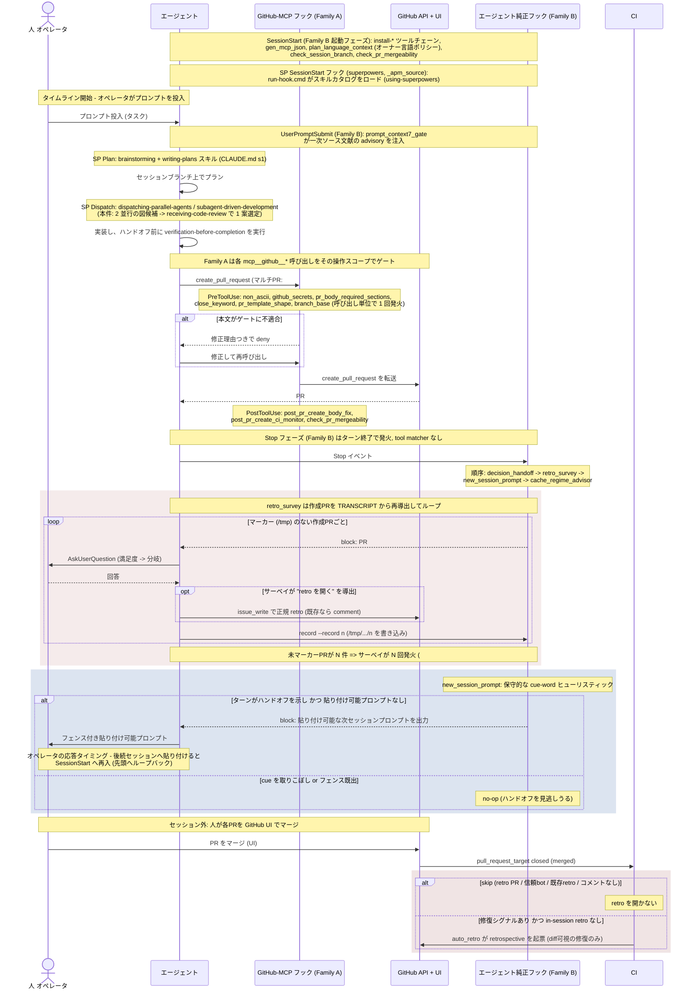

# サーベイ / フォローアップ ハンドオフタイミング

[English](./survey-followup-timing.sequence.md) | 日本語

> ステータス: レビュー用の UML 成果物候補（読み取り専用の設計記録）。起点となる
> Issue は #1594（pre-merge サーベイがマルチPRセッションで二重/三重発火する）。
> これが交差する in-session vs CI の retro 責務分離は #1581。

本ドキュメントは、エージェント / CI / 人の協働を 1 つのセッションライフサイクル全体で
可視化する。タイムラインは、SessionStart で起動済みのセッションへオペレータが
プロンプトを投入した瞬間を起点とし、2 つの Stop イベントのハンドオフ契機
（pre-merge の retro/満足度サーベイと、新規セッション向けフォローアッププロンプト）
まで追跡する。時系列のシーケンス図が適切なレンズなのは、欠陥が個々のフックのロジック
ではなく、1 ターン上で複数アクターをまたぐメッセージの「順序」と「反復」にあるからだ。
マルチPRセッションは、作成したPRごとにサーベイ脚を 1 回ずつリプレイする。SessionStart
に錨を打ち、全フェーズを追跡可能にしたタイムラインだけが、この重複発火を読み取れる。

- 証拠タグ: `[fact]` はツリー内で観測された事実（file:line を引用）、`[analysis]` は
  ギャップに対する判断。

## 2 つのフック族（本質的な区別）

`[fact]` 本リポジトリのフックは、決定論的性質の異なる 2 つの族に分かれる。
サーベイ/フォローアップのタイミング問題は、この分割に照らして読むのが最も分かりやすい
（`.claude/settings.json`）:

| 性質 | Family A: GitHub-MCP フック | Family B: エージェント純正フック |
|---|---|---|
| 紐づく対象 | `mcp__github__*`（および codex ミラー）の tool matcher | ライフサイクルイベント（`SessionStart` / `UserPromptSubmit` / `Stop`）。tool matcher なし |
| 発火 | その 1 回の tool 呼び出しに同期（Pre/PostToolUse） | ライフサイクルフェーズ（起動時・各プロンプト・各ターン終了）で発火 |
| 状態の出所 | 呼び出し自身の入力（例: PR 本文）。自己完結 | セッション transcript を走査して再導出 |
| リプレイ | なし。1 呼び出し 1 発火 | ターンの履歴を横断してリプレイ（#1594 の欠陥） |
| バックストップ | サーバ側 `verify-*` CI ジョブ | post-merge CI（`auto_retro.py`） |
| メンバー | `preflight_non_ascii`, `preflight_github_secrets`, `preflight_pr_body_required_sections`, `pr_body_close_keyword_gate`, `preflight_pr_template_shape`, `preflight_branch_base`, `gate_merge_safety`, `gate_mcp_github_uncovered`; PostToolUse `post_pr_create_body_fix`, `post_pr_create_ci_monitor`, `check_pr_mergeability` | SessionStart: `plan_language_context`, `check_session_branch`, `check_pr_mergeability`, `gen_mcp_json`; UserPromptSubmit: `prompt_context7_gate`; Stop: `gate_decision_handoff_askuserquestion`, `gate_handoff_retro_survey_askuserquestion`, `stop_new_session_handoff_prompt`, `gate_cache_regime_advisor` |

`[analysis]` Family B はセッションライフサイクル全体にまたがり、サーベイとフォロー
アッププロンプトはその **Stop フェーズ** のメンバーである。サーベイの *役割* は GitHub PR
の PR 単位ハンドオフをゲートすることなのに、実装は Family B に置かれている。Family A は
すでに `create_pull_request` を呼び出し単位で 1 回ゲートしている（`post_pr_create_ci_monitor`
/ `post_pr_create_body_fix` はまさにその tool への PostToolUse）。したがってサーベイは
create 呼び出しの識別子を dedup キーにできたはずだ。それを Family B の Stop フックとして
実装したため、代わりに transcript から PR 番号を走査してリプレイする ---- これが #1594 の
構造的な根因である。

## superpowers の関与点

`[fact]` 両族はいずれも `scripts/` 配下の repo-owned スクリプトで、code-owner マージ
ゲートの背後にある。ライフサイクルにはもう 1 つの出自も関与する: **superpowers** ----
`apm.yml` / `apm.lock.yaml` でピン留めされた外部 APM プラグイン
（`obra/superpowers@f2cbfbe`, `package_type: marketplace_plugin`）。その信頼は実行ごとの
レビューではなく lockfile のピンによってガバナンスゲートされる（CLAUDE.md 第 2 節）。
関与点は以下のとおりで、機構上は Family B の SessionStart フック 1 つ + エージェントが
意思決定点でロードするスキル群である:

| ライフサイクル点 | superpowers の関与 | 出所 |
|---|---|---|
| SessionStart（起動） | `run-hook.cmd session-start` がスキルカタログをロード | `.claude/settings.json` SessionStart（`_apm_source: superpowers`）; `using-superpowers` |
| Plan フェーズ（プロンプト後） | `brainstorming`, `writing-plans` がプランモードを駆動 | `apm.lock.yaml` のデプロイ済みスキル; CLAUDE.md 第 1 節 |
| Dispatch | `dispatching-parallel-agents`, `subagent-driven-development` | CLAUDE.md 第 3 節; 本作業では 2 つの並行図候補に使用 |
| Review / ハンドオフ直前 | `receiving-code-review`, `requesting-code-review`, `verification-before-completion` | CLAUDE.md 第 6 節 |
| ブランチ仕上げ | `finishing-a-development-branch`, `systematic-debugging`（証拠優先） | `apm.lock.yaml` のデプロイ済みスキル |

`[analysis]` superpowers の決定論的フックは SessionStart のローダーのみで、残りは
エージェントが選択的に呼ぶ *スキル* なので、ゲートではなく advisory（助言的）である。
サーベイ/フォローアップのタイミング問題にとってこれは重要だ: 並行ディスパッチや
レビューのスキルは本成果物を **どう作ったか** を形作ったが、サーベイが **いつ発火するか**
には何の強制力も加えない ---- それは完全に repo-owned の Family B Stop フックに委ねられて
いる。ここでの superpowers はビルド時の force-multiplier であり、#1594 の制御面の一部
ではない。

## シーケンス図（中心成果物）

## ギャップ分析

| # | ギャップ `[analysis]` | 証拠 `[fact]`（file:line） | 追跡 |
|---|---|---|---|
| 1 | retro_survey（Family B）は作成PRをすべて反復しマーカーを PR 単位でキーにするため、マルチPRセッション（#1582/#1584/#1589）はセッション単位の dedup なしに PR ごとにサーベイ全体を再発火する。 | `evaluate()` が `created_pr_numbers(entries)` をループしマーカー欠如ごとに block -- `scripts/gate_handoff_retro_survey_askuserquestion.py:257`; マーカーは PR 単位 `/tmp/claude-pre-merge-retro-survey/<pr>` -- `:140`, `:85`。 | #1594 |
| 2 | サーベイは GitHub アーティファクトをゲートするのにエージェント純正族に属するため、実際の create 呼び出しをキーにできず、PR 番号を transcript 走査する ---- これがリプレイを可能にする機構。Family A は同じ tool に既に PostToolUse フックを持つ。 | `created_pr_numbers` が transcript の `tool_use`/`tool_result` から PR を再構成 -- `gate_handoff_retro_survey_askuserquestion.py:208-248`; `post_pr_create_ci_monitor` は `create_pull_request` への PostToolUse -- `.claude/settings.json` PostToolUse。 | #1594 |
| 3 | new_session_prompt（Family B, Stop フェーズ）の検出は保守的な cue-word ヒューリスティックで、実ハンドオフを見逃しうる ---- 同一 Stop イベント上の沈黙的な偽陰性。 | `signals_handoff` は `HANDOFF_CUES` の部分一致のみ -- `scripts/stop_new_session_handoff_prompt.py:140`, `:55`。 | #1581 |
| 4 | Family B の Stop 順序は固定（decision_handoff -> retro_survey -> new_session_prompt -> cache_regime_advisor）。先行 block が `stop_hook_active` で再入し連鎖を no-op 化するため、継続時に後続フックがスキップされる。 | `Stop` 配列順 -- `.claude/settings.json:466-499`; `stop_hook_active -> return None` -- `gate_handoff_retro_survey_askuserquestion.py:255`。 | #1581 |
| 5 | in-session retro 責務（D1）と CI バックストップが 1 つの PR を両方対象にしうる。dedup は CI `find_existing_retro` が正規タイトルを認識することに依存し、さもないと 2 つの retro が競合する。 | `run` は `find_existing_retro` 一致時に skip -- `scripts/auto_retro.py:2862`; CI `open-retro` はマージ済みPRでゲート -- `.github/workflows/post-merge.yml:29-30`。 | #1581 |
| 6 | retro->follow-up ドリフトループは、解析可能な `#N` フォローアップ箇条書きを既に持つ retro しか再分類しない。retro を開かないサーベイ（修復なし）はスキャナが見る行を残さない。 | `parse_followup_refs` は `#N` 箇条書きを要求 -- `scripts/scan_retro_followup_drift.py:84`; `aggregate_drift` は参照ゼロで `None` を返す -- `:171`。 | #1581 |

## 推奨される方向（speculation, #1594 向け）

- `[analysis]` ギャップ 1 + 2 は 2 層に現れる 1 つの欠陥: サーベイを PR 単位から
  ハンドオフ窓単位へ再キー化する、または dedup キーを Family A の create 呼び出し識別子
  （既に PR ごとに 1 回 PostToolUse フックが発火する場所）へ移動/エイリアスする。N-PR
  セッションでゲートが N 回ではなく 1 回発火することの回帰テストを追加する。
- `[analysis]` ギャップ 3: cue-word ヒューリスティックに決定論的な parked 状態シグナルを
  併用し、cue を取りこぼしてもプロンプトが発火するようにする。ヒューリスティックは OR の
  片側として残し、唯一の側にはしない。

## スコープ注記

`[fact]` 両 Stop フェーズの Family B フックは fail-open（不正イベント / 読めない
transcript はすべて exit 0）: `gate_handoff_retro_survey_askuserquestion.py:348` と
`stop_new_session_handoff_prompt.py:197`。`[analysis]` CI `open-retro` ジョブは Family B
のバックストップだが、retro を開くだけで満足度サーベイは行わない。よって二重発火した
サーベイ（#1594）は correctness の損失ではなくエージェント/オペレータの摩擦の欠陥であり、
修正は CI ではなくセッションマーカー / フック族の層に属する。

`[analysis]` フォローアッププロンプトは 2 つの契機で描かれている: その **出力**
（Stop の block -> エージェントがフェンス付きプロンプトを出力）と、オペレータの **応答**
（後続セッションへ貼り付け、SessionStart へ再入）。この応答エッジこそが、図の先頭へ
ライフサイクルの環を閉じる ---- セッション内の出力だけでなく、クロスセッションの継続である。
