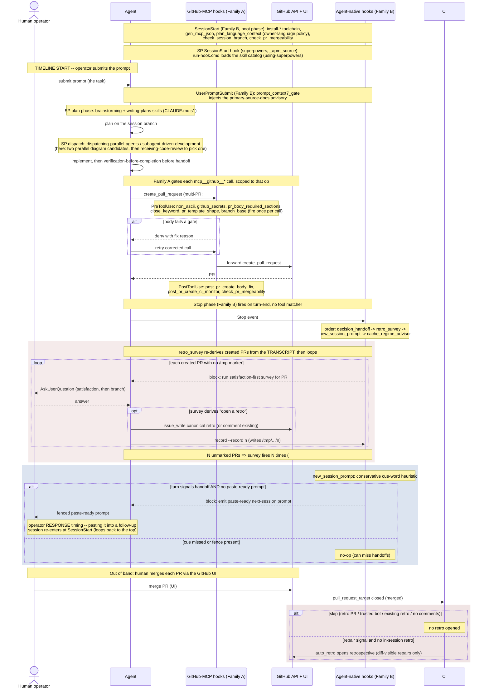

# Survey / follow-up handoff timing

English | [日本語](./survey-followup-timing.sequence.ja.md)

> Status: candidate UML artifact (read-only design record) for review. Triggering
> issue is #1594 (pre-merge survey double/triple-fires across a multi-PR session);
> the in-session-vs-CI retro ownership split it interacts with is #1581.

This document visualizes the agent / CI / human collaboration across one full
session lifecycle: it starts the timeline at the moment the operator submits a
prompt into a SessionStart-booted session, and traces through to the two
Stop-event handoff moments -- the pre-merge retro/satisfaction survey and the
new-session follow-up prompt. A temporally ordered sequence view is the right
lens because the defect is not in any single hook's logic but in the ordering
and repetition of messages across actors on one turn: a multi-PR session replays
the survey leg once per created PR. Only a timeline -- anchored at SessionStart
so every phase is traceable -- makes the duplicate firing legible.

- Evidence tags: `[fact]` is observed in-tree (cited file:line); `[analysis]` is
  a gap judgement.

## Two hook families (the key distinction)

`[fact]` This repo's hooks split into two families with different determinism
properties; the survey/follow-up timing problem is best read against that split
(`.claude/settings.json`):

| Property | Family A: GitHub-MCP hooks | Family B: agent-native hooks |
|---|---|---|
| Bound to | a `mcp__github__*` (and codex-mirror) tool matcher | a lifecycle event (`SessionStart`, `UserPromptSubmit`, `Stop`), NO tool matcher |
| Fires | synchronously on that one tool call (Pre/PostToolUse) | at the lifecycle phase (boot, each prompt, each turn-end) |
| State source | the call's own input (e.g. the PR body) -- self-contained | re-derived by scraping the session transcript |
| Replay | none -- one call, one fire | replays across the turn's history (the #1594 defect) |
| Backstop | server-side `verify-*` CI jobs | post-merge CI (`auto_retro.py`) |
| Members | `preflight_non_ascii`, `preflight_github_secrets`, `preflight_pr_body_required_sections`, `pr_body_close_keyword_gate`, `preflight_pr_template_shape`, `preflight_branch_base`, `gate_merge_safety`, `gate_mcp_github_uncovered`; PostToolUse `post_pr_create_body_fix`, `post_pr_create_ci_monitor`, `check_pr_mergeability` | SessionStart: `plan_language_context`, `check_session_branch`, `check_pr_mergeability`, `gen_mcp_json`; UserPromptSubmit: `prompt_context7_gate`; Stop: `gate_decision_handoff_askuserquestion`, `gate_handoff_retro_survey_askuserquestion`, `stop_new_session_handoff_prompt`, `gate_cache_regime_advisor` |

`[analysis]` Family B spans the whole session lifecycle; the survey and the
follow-up prompt are its **Stop-phase** members. The survey's *job* is to gate
the per-PR handoff of a GitHub PR, yet it lives in Family B. Family A already
gates `create_pull_request` once per call (`post_pr_create_ci_monitor` /
`post_pr_create_body_fix` are PostToolUse on that exact tool), so the survey
could key its dedup off the create-call identity. As a Family B Stop hook it
instead transcript-scrapes PR numbers and replays -- the structural root of #1594.

## superpowers involvement points

`[fact]` Both families are repo-owned scripts under `scripts/`, behind a
code-owner merge gate. A third provenance also engages the lifecycle:
**superpowers**, an external APM plugin pinned in `apm.yml` /
`apm.lock.yaml` (`obra/superpowers@f2cbfbe`, `package_type: marketplace_plugin`).
Its trust is governance-gated by the lockfile pin, not by per-run review
(CLAUDE.md section 2). It engages at these points, mechanically a Family B
SessionStart hook plus skills the agent loads at decision points:

| Lifecycle point | superpowers engagement | Source |
|---|---|---|
| SessionStart (boot) | `run-hook.cmd session-start` loads the skill catalog | `.claude/settings.json` SessionStart (`_apm_source: superpowers`); `using-superpowers` |
| Plan phase (post-prompt) | `brainstorming`, `writing-plans` drive plan mode | `apm.lock.yaml` deployed skills; CLAUDE.md section 1 |
| Dispatch | `dispatching-parallel-agents`, `subagent-driven-development` | CLAUDE.md section 3; used here for the two parallel diagram candidates |
| Review / pre-handoff | `receiving-code-review`, `requesting-code-review`, `verification-before-completion` | CLAUDE.md section 6 |
| Branch finish | `finishing-a-development-branch`, `systematic-debugging` (evidence-first) | `apm.lock.yaml` deployed skills |

`[analysis]` superpowers' only deterministic hook is the SessionStart loader; the
rest are *skills* the agent elects to invoke, so they are advisory, not gates.
For the survey/follow-up timing problem this matters: the parallel-dispatch and
review skills shaped HOW this artifact was built, but they add no enforcement to
WHEN the survey fires -- that stays entirely with the repo-owned Family B Stop
hook. superpowers is a build-time force-multiplier here, not part of the #1594
control surface.

## Sequence diagram (centerpiece)

## Gap analysis

| # | Gap `[analysis]` | Evidence `[fact]` (file:line) | Tracking |
|---|---|---|---|
| 1 | retro_survey (Family B) iterates every created PR and keys the marker per-PR, so a multi-PR session (#1582/#1584/#1589) re-fires the full survey once per PR with no session-level dedup. | `evaluate()` loops `created_pr_numbers(entries)` and blocks per missing marker -- `scripts/gate_handoff_retro_survey_askuserquestion.py:257`; marker is per-PR `/tmp/claude-pre-merge-retro-survey/<pr>` -- `:140`, `:85`. | #1594 |
| 2 | The survey gates a GitHub artifact but sits in the agent-native family, so it cannot key off the actual create call -- it transcript-scrapes PR numbers, the mechanism that enables the replay. Family A already has a PostToolUse hook on the same tool. | `created_pr_numbers` reconstructs PRs from transcript `tool_use`/`tool_result` -- `gate_handoff_retro_survey_askuserquestion.py:208-248`; `post_pr_create_ci_monitor` is PostToolUse on `create_pull_request` -- `.claude/settings.json` PostToolUse. | #1594 |
| 3 | new_session_prompt (Family B, Stop phase) detection is a conservative cue-word heuristic and can miss a real handoff -- a silent false negative on the same Stop event. | `signals_handoff` matches only `HANDOFF_CUES` substrings -- `scripts/stop_new_session_handoff_prompt.py:140`, `:55`. | #1581 |
| 4 | Family B Stop order is fixed (decision_handoff -> retro_survey -> new_session_prompt -> cache_regime_advisor); an earlier block re-enters with `stop_hook_active`, which no-ops the chain, so later hooks are skipped on the continuation. | `Stop` array order -- `.claude/settings.json:466-499`; `stop_hook_active -> return None` -- `gate_handoff_retro_survey_askuserquestion.py:255`. | #1581 |
| 5 | In-session retro ownership (D1) and the CI backstop can both target one PR; dedup relies on CI `find_existing_retro` recognizing the canonical title, else the two retros race. | `run` skips when `find_existing_retro` matches -- `scripts/auto_retro.py:2862`; CI `open-retro` gated on merged PR -- `.github/workflows/post-merge.yml:29-30`. | #1581 |
| 6 | The retro->follow-up drift loop only reclassifies retros that already carry parseable `#N` follow-up bullets; a survey that skips opening a retro (repair-free) leaves no row for the scanner to see. | `parse_followup_refs` requires `#N` bullets -- `scripts/scan_retro_followup_drift.py:84`; `aggregate_drift` returns `None` on zero refs -- `:171`. | #1581 |

## Recommended direction (speculation, for #1594)

- `[analysis]` Gaps 1 + 2 are one defect at two layers: re-key the survey from
  per-PR to per-handoff-window, OR move/alias the dedup key onto the Family A
  create-call identity (where a PostToolUse hook already fires once per PR). Add
  a regression test that an N-PR session fires the gate once, not N times.
- `[analysis]` Gap 3: pair the cue-word heuristic with a deterministic
  parked-state signal so a missed cue still triggers the prompt; keep the
  heuristic as the OR-side, not the only side.

## Notes on scope

`[fact]` Both Stop-phase Family B hooks fail open (any malformed event /
unreadable transcript exits 0): `gate_handoff_retro_survey_askuserquestion.py:348`
and `stop_new_session_handoff_prompt.py:197`. `[analysis]` The CI `open-retro`
job is the Family B backstop, but it only opens a retro (not a satisfaction
survey), so a double-fired survey (#1594) is an agent/operator-friction defect,
not a correctness loss -- the fix belongs at the session-marker / hook-family
layer, not in CI.

`[analysis]` The follow-up prompt is depicted at two moments: its **emission**
(the Stop block -> agent emits the fenced prompt) and the operator's **response**
(pasting it into a follow-up session, which re-enters at SessionStart). That
response edge is what closes the lifecycle loop back to the top of the diagram --
the cross-session continuation, not just the in-session emission.
