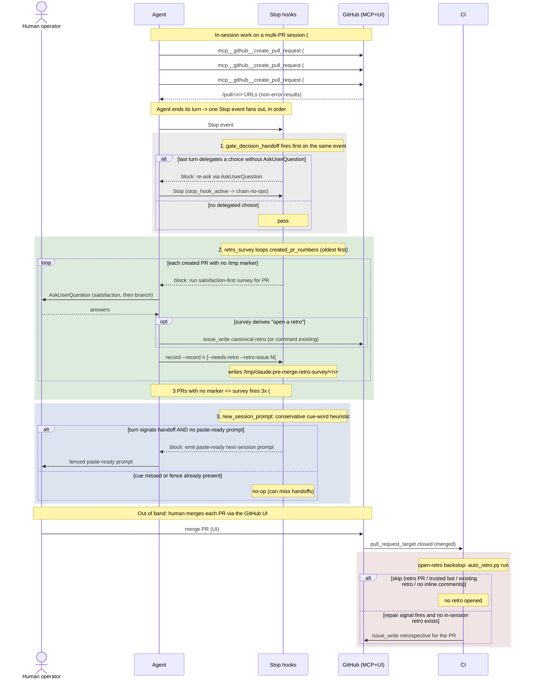

# Survey / follow-up handoff timing

> Status: candidate UML artifact (read-only design record) for review. Triggering
> issue is #1594 (pre-merge survey double/triple-fires across a multi-PR session);
> the in-session-vs-CI retro ownership split it interacts with is #1581.

This document visualizes the agent / CI / human collaboration around the two
Stop-event handoff moments in this repo: the pre-merge retro/satisfaction survey
and the new-session follow-up prompt. A temporally ordered sequence view is the
right lens here because the defect is not in any single hook's logic but in the
ordering and repetition of messages across four actors on one `Stop` event: the
same event fans out to an ordered hook chain, and a multi-PR session replays the
survey leg once per created PR. Only a timeline makes the duplicate firing legible.

- Evidence tags: `[fact]` is observed in-tree (cited file:line); `[analysis]` is
  a gap judgement.

## Actors

- Human operator: ends the agent turn, merges PRs through the GitHub UI.
- Agent: the Claude Code session; re-emits surveys/prompts when a Stop hook blocks.
- Stop hooks: the ordered `Stop` chain (decision_handoff, retro_survey,
  new_session_prompt, cache_regime_advisor).
- GitHub (MCP+UI): MCP `create_pull_request` in-session; human UI merge out of band.
- CI: `post-merge.yml` `open-retro` job running `auto_retro.py` as the backstop.

## Sequence diagram (centerpiece)

## Gap analysis

| # | Gap `[analysis]` | Evidence `[fact]` (file:line) | Tracking |
|---|---|---|---|
| 1 | retro_survey iterates every created PR and keys the marker per-PR, so a multi-PR session (#1582/#1584/#1589) re-fires the full survey once per PR with no session-level dedup. | `evaluate()` loops `created_pr_numbers(entries)` and blocks per missing marker -- `scripts/gate_handoff_retro_survey_askuserquestion.py:257`; marker path is per-PR `/tmp/claude-pre-merge-retro-survey/<pr>` -- `:140`, `:85`. | #1594 |
| 2 | The survey moment is timing-coupled to PR creation, not to the human UI merge; the agent's `Stop` is the only in-session proxy, so the count of fires tracks PRs-created, not merges. | `created_pr_numbers` counts non-error `create_pull_request` results -- `scripts/gate_handoff_retro_survey_askuserquestion.py:208`, `:240`. | #1594 |
| 3 | new_session_prompt detection is a conservative cue-word heuristic and can miss a real handoff (no fenced prompt forced) -- a silent false negative on the same Stop event. | `signals_handoff` matches only `HANDOFF_CUES` substrings -- `scripts/stop_new_session_handoff_prompt.py:140`, `:55`. | #1581 |
| 4 | Hook order is fixed (decision_handoff -> retro_survey -> new_session_prompt -> cache_regime_advisor); a block by an earlier hook re-enters with `stop_hook_active`, which no-ops the whole chain, so later hooks are skipped on the continuation. | `Stop` array order -- `.claude/settings.json:466-499`; `stop_hook_active -> return None` in each `evaluate` -- `gate_handoff_retro_survey_askuserquestion.py:255`. | #1581 |
| 5 | In-session retro ownership (D1) and CI backstop can both target one PR; dedup relies on CI `find_existing_retro` recognizing the canonical in-session title, otherwise the survey-opened and CI-opened retros race. | `run` skips when `find_existing_retro` matches -- `scripts/auto_retro.py:2862`; CI `open-retro` job gated on merged PR -- `.github/workflows/post-merge.yml:29-30`. | #1581 |
| 6 | The retro->follow-up drift loop only reclassifies retros that already exist with parseable `#N` follow-up bullets; a survey that skips opening a retro (repair-free) leaves no row for the drift scanner to ever see. | `parse_followup_refs` requires checkbox `#N` bullets -- `scripts/scan_retro_followup_drift.py:84`; `aggregate_drift` returns `None` on zero refs -- `:171`. | #1581 |

## Notes on scope

`[fact]` Both hooks fail open (any malformed event / unreadable transcript exits
0): `gate_handoff_retro_survey_askuserquestion.py:348` and
`stop_new_session_handoff_prompt.py:197`. `[analysis]` The CI `open-retro` job is
the intended backstop for a missed in-session survey, but it only opens a retro
(not a satisfaction survey), so a double-fired survey (#1594) is an
agent/operator-friction defect, not a correctness loss -- the fix belongs at the
session-marker layer, not in CI.
